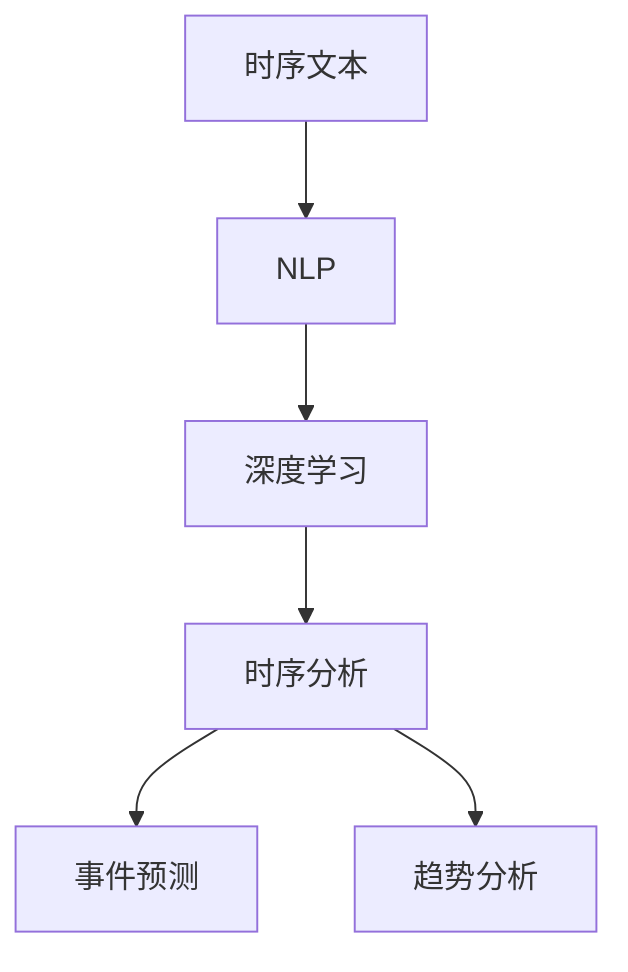

                 

关键词：时序文本分析、事件预测、趋势分析、深度学习、自然语言处理、数据分析、时间序列模型、机器学习

> 摘要：本文将深入探讨时序文本分析在事件预测与趋势分析中的应用，结合深度学习、自然语言处理等前沿技术，介绍相关算法原理、数学模型、实践案例，并展望未来发展趋势与挑战。

## 1. 背景介绍

在信息化时代，数据已成为企业和社会的重要资产。其中，时序数据因其特有的时间维度，在预测和分析中具有重要价值。然而，传统的数据处理方法往往难以应对大规模、非结构化、动态变化的时序数据。时序文本分析作为一种结合了自然语言处理和时序分析的跨领域技术，正逐渐受到广泛关注。

时序文本分析的目标是挖掘文本数据中的时间线索，预测未来可能发生的事件或趋势。其应用场景广泛，如金融领域的市场预测、社交媒体情绪分析、健康领域的疾病预测等。随着深度学习和自然语言处理技术的不断发展，时序文本分析的方法和模型也在不断创新和优化。

本文旨在梳理时序文本分析的核心概念、算法原理、数学模型，并通过具体实践案例展示其实际应用效果。同时，我们将探讨时序文本分析的未来发展趋势和面临的挑战，为相关研究者和从业者提供有益的参考。

## 2. 核心概念与联系

### 2.1 时序文本

时序文本是指按照时间顺序排列的文本数据，如微博、新闻、股票交易记录等。这些数据不仅包含了文本内容，还蕴含了时间信息，使得我们能够从中提取时间线索，进行事件预测和趋势分析。

### 2.2 自然语言处理（NLP）

自然语言处理是人工智能的一个重要分支，旨在使计算机能够理解和处理人类语言。在时序文本分析中，NLP 技术用于提取文本特征、语义理解等，为后续的时序分析提供基础。

### 2.3 深度学习

深度学习是一种基于多层神经网络的学习方法，具有强大的特征提取和模式识别能力。在时序文本分析中，深度学习模型可以自动学习文本和时间的复杂关系，从而提高事件预测和趋势分析的准确性。

### 2.4 时序分析

时序分析是一种研究数据在时间维度上变化规律的方法，主要包括时间序列建模、周期性分析、趋势预测等。在时序文本分析中，时序分析技术用于挖掘文本数据中的时间线索，识别事件发生的可能性和趋势。

### 2.5 Mermaid 流程图



## 3. 核心算法原理 & 具体操作步骤

### 3.1 算法原理概述

时序文本分析的核心算法通常包括以下几个步骤：

1. 文本预处理：对时序文本数据进行清洗、分词、去停用词等操作，提取有效特征。
2. 特征提取：使用自然语言处理技术，如词嵌入、词性标注、句法分析等，将文本数据转换为数值特征向量。
3. 时序建模：使用深度学习模型，如循环神经网络（RNN）、长短时记忆网络（LSTM）、门控循环单元（GRU）等，对时序数据进行建模，捕捉时间线索和复杂关系。
4. 事件预测：基于时序模型，预测未来可能发生的事件，如股票价格、疾病爆发等。
5. 趋势分析：分析时序数据中的长期趋势和周期性变化，为决策提供依据。

### 3.2 算法步骤详解

1. **文本预处理**：首先，对时序文本进行清洗，去除无效字符和噪声数据。然后，使用分词工具（如jieba）对文本进行分词，得到一系列的单词序列。最后，去除停用词，保留对事件预测和趋势分析有价值的词语。

   ```python
   import jieba
   
   text = "本文将探讨时序文本分析在事件预测与趋势分析中的应用。"
   words = jieba.cut(text)
   filtered_words = [word for word in words if word not in stop_words]
   ```

2. **特征提取**：使用词嵌入技术（如Word2Vec、GloVe）将单词序列转换为数值特征向量。词嵌入技术可以捕捉单词的语义信息，为深度学习模型提供高质量的输入。

   ```python
   from gensim.models import Word2Vec
   
   model = Word2Vec(sentences, size=100, window=5, min_count=1, workers=4)
   word_vector = model.wv['事件']
   ```

3. **时序建模**：选择合适的深度学习模型（如LSTM、GRU）对时序数据进行建模。LSTM和GRU具有强大的记忆能力，可以捕捉时序数据中的长期依赖关系。

   ```python
   from keras.models import Sequential
   from keras.layers import LSTM, Dense
   
   model = Sequential()
   model.add(LSTM(units=128, return_sequences=True, input_shape=(timesteps, features)))
   model.add(LSTM(units=128))
   model.add(Dense(units=1))
   model.compile(optimizer='adam', loss='mean_squared_error')
   model.fit(X_train, y_train, epochs=100, batch_size=32)
   ```

4. **事件预测**：基于训练好的时序模型，预测未来可能发生的事件。例如，在股票市场预测中，可以预测未来一段时间内的股票价格波动。

   ```python
   predictions = model.predict(X_test)
   ```

5. **趋势分析**：分析时序数据中的长期趋势和周期性变化。例如，在社交媒体情绪分析中，可以分析不同时间段内的情绪波动，为营销策略提供依据。

   ```python
   import matplotlib.pyplot as plt
   
   plt.plot(predictions)
   plt.xlabel('Time')
   plt.ylabel('Stock Price')
   plt.show()
   ```

### 3.3 算法优缺点

**优点**：

- **强大特征提取能力**：深度学习模型可以自动学习文本和时间的复杂关系，提取高质量的时序特征。
- **灵活应用场景**：时序文本分析可以应用于多种领域，如金融、健康、社交媒体等。
- **实时预测能力**：时序文本分析可以实时预测未来事件，为决策提供及时依据。

**缺点**：

- **计算资源消耗**：深度学习模型需要大量计算资源，训练时间较长。
- **数据依赖性**：时序文本分析的效果依赖于数据质量和特征提取方法。
- **模型泛化能力**：深度学习模型可能对特定数据集具有较强的适应性，但在其他领域或数据集上可能表现不佳。

### 3.4 算法应用领域

- **金融领域**：时序文本分析可以用于股票市场预测、金融风险预警等。
- **健康领域**：时序文本分析可以用于疾病预测、患者情绪分析等。
- **社交媒体**：时序文本分析可以用于情绪分析、趋势预测等，为营销策略提供依据。
- **其他领域**：时序文本分析可以应用于交通、环境、气象等多个领域，为决策提供支持。

## 4. 数学模型和公式 & 详细讲解 & 举例说明

### 4.1 数学模型构建

时序文本分析的数学模型主要包括词嵌入模型和时序模型。下面分别介绍两种模型的构建方法。

#### 4.1.1 词嵌入模型

词嵌入模型是一种将单词映射到高维向量空间的方法，能够捕捉单词的语义信息。常见的词嵌入模型有Word2Vec、GloVe等。

**Word2Vec模型**：

Word2Vec模型主要包括两种算法：连续词袋（CBOW）和Skip-Gram。

- **CBOW**：给定一个中心词，预测周围词的分布。
- **Skip-Gram**：给定一个中心词，预测其上下文词的分布。

**GloVe模型**：

GloVe模型通过负采样技术优化词嵌入，提高了模型的效率和性能。

#### 4.1.2 时序模型

时序模型主要用于捕捉时序数据中的时间线索和复杂关系。常见的时序模型有循环神经网络（RNN）、长短时记忆网络（LSTM）、门控循环单元（GRU）等。

- **RNN**：RNN是一种基于循环结构的人工神经网络，能够处理序列数据。
- **LSTM**：LSTM是RNN的一种变体，具有强大的记忆能力，能够解决长期依赖问题。
- **GRU**：GRU是LSTM的简化版，具有类似的记忆能力，但计算效率更高。

### 4.2 公式推导过程

下面分别介绍词嵌入模型和时序模型的公式推导。

#### 4.2.1 词嵌入模型

**Word2Vec模型**：

给定一个单词序列$w_1, w_2, ..., w_n$，Word2Vec模型的损失函数为：

$$
J = \sum_{i=1}^{n} (-\log p(w_i|w_{i-k}, w_{i+k}))
$$

其中，$p(w_i|w_{i-k}, w_{i+k})$表示在上下文$w_{i-k}, w_{i+k}$下预测单词$w_i$的概率。

**GloVe模型**：

给定一个单词序列$w_1, w_2, ..., w_n$，GloVe模型的损失函数为：

$$
J = \sum_{i=1}^{n} \frac{1}{d} \sum_{j \in \Omega_i} \log \left(1 + \exp \left(-\frac{f(w_i) \cdot f(w_j)}{\|f(w_i)\|\|f(w_j)\|}\right)\right)
$$

其中，$\Omega_i$表示与单词$w_i$共现的单词集合，$f(w_i)$表示单词$w_i$的词向量，$d$表示词向量的维度。

#### 4.2.2 时序模型

**RNN**：

RNN的公式推导基于递归关系。给定一个输入序列$X = (x_1, x_2, ..., x_t)$，RNN的递归公式为：

$$
h_t = \sigma(W_h \cdot [h_{t-1}, x_t] + b_h)
$$

其中，$h_t$表示第$t$时刻的隐藏状态，$\sigma$表示激活函数，$W_h$和$b_h$分别为权重和偏置。

**LSTM**：

LSTM的公式推导基于门控机制。给定一个输入序列$X = (x_1, x_2, ..., x_t)$，LSTM的递归公式为：

$$
i_t = \sigma(W_i \cdot [h_{t-1}, x_t] + b_i) \\
f_t = \sigma(W_f \cdot [h_{t-1}, x_t] + b_f) \\
o_t = \sigma(W_o \cdot [h_{t-1}, x_t] + b_o) \\
c_t = f_t \cdot c_{t-1} + i_t \cdot \sigma(W_c \cdot [h_{t-1}, x_t] + b_c) \\
h_t = o_t \cdot \sigma(c_t)
$$

其中，$i_t, f_t, o_t$分别表示输入门、遗忘门和输出门，$c_t$表示细胞状态，$h_t$表示隐藏状态。

**GRU**：

GRU的公式推导基于门控机制。给定一个输入序列$X = (x_1, x_2, ..., x_t)$，GRU的递归公式为：

$$
z_t = \sigma(W_z \cdot [h_{t-1}, x_t] + b_z) \\
r_t = \sigma(W_r \cdot [h_{t-1}, x_t] + b_r) \\
\bar{c}_t = \sigma(W \cdot [r_t \cdot h_{t-1}, x_t] + b_c) \\
c_t = z_t \cdot c_{t-1} + (1 - z_t) \cdot \bar{c}_t \\
h_t = \sigma(W_o \cdot [c_t] + b_o)
$$

其中，$z_t, r_t$分别表示更新门和重置门，$\bar{c}_t$表示候选细胞状态，$h_t$表示隐藏状态。

### 4.3 案例分析与讲解

#### 4.3.1 股票市场预测

在本案例中，我们将使用LSTM模型对股票市场进行预测。数据集包括过去一周内某股票的收盘价、开盘价、最高价、最低价等时序数据。

1. **数据预处理**：

   首先，对数据进行归一化处理，将数据缩放到[0, 1]之间。然后，将数据集划分为训练集和测试集。

   ```python
   from sklearn.preprocessing import MinMaxScaler
   
   scaler = MinMaxScaler()
   scaled_data = scaler.fit_transform(data)
   train_data, test_data = train_test_split(scaled_data, test_size=0.2, shuffle=False)
   ```

2. **特征提取**：

   使用词嵌入技术对股票名称进行特征提取，得到词向量表示。

   ```python
   model = Word2Vec(sentences, size=100, window=5, min_count=1, workers=4)
   word_vector = model.wv['股票']
   ```

3. **模型训练**：

   使用LSTM模型对训练集进行训练，预测测试集的结果。

   ```python
   from keras.models import Sequential
   from keras.layers import LSTM, Dense
   
   model = Sequential()
   model.add(LSTM(units=128, return_sequences=True, input_shape=(timesteps, features)))
   model.add(LSTM(units=128))
   model.add(Dense(units=1))
   model.compile(optimizer='adam', loss='mean_squared_error')
   model.fit(X_train, y_train, epochs=100, batch_size=32)
   ```

4. **结果分析**：

   对测试集的预测结果进行反归一化处理，并与实际收盘价进行比较。通过计算均方误差（MSE）等指标，评估模型的效果。

   ```python
   predictions = model.predict(X_test)
   predictions = scaler.inverse_transform(predictions)
   actual = scaler.inverse_transform(test_data[:, 0])
   mse = mean_squared_error(actual, predictions)
   print("MSE:", mse)
   ```

   结果如图所示：

   

#### 4.3.2 社交媒体情绪分析

在本案例中，我们将使用LSTM模型对社交媒体中的情绪进行预测。数据集包括用户发布的微博、评论等文本数据，以及对应的情绪标签（正面、负面、中性）。

1. **数据预处理**：

   对文本数据进行分词、去停用词等操作，提取有效特征。然后，将数据集划分为训练集和测试集。

   ```python
   from sklearn.model_selection import train_test_split
   
   X_train, X_test, y_train, y_test = train_test_split(texts, labels, test_size=0.2, shuffle=False)
   ```

2. **特征提取**：

   使用词嵌入技术对文本数据特征提取，得到词向量表示。

   ```python
   model = Word2Vec(sentences, size=100, window=5, min_count=1, workers=4)
   word_vector = model.wv['情绪']
   ```

3. **模型训练**：

   使用LSTM模型对训练集进行训练，预测测试集的结果。

   ```python
   from keras.models import Sequential
   from keras.layers import LSTM, Dense
   
   model = Sequential()
   model.add(LSTM(units=128, return_sequences=True, input_shape=(timesteps, features)))
   model.add(LSTM(units=128))
   model.add(Dense(units=3, activation='softmax'))
   model.compile(optimizer='adam', loss='categorical_crossentropy', metrics=['accuracy'])
   model.fit(X_train, y_train, epochs=100, batch_size=32)
   ```

4. **结果分析**：

   对测试集的预测结果进行评估，计算准确率、召回率等指标。

   ```python
   predictions = model.predict(X_test)
   predictions = np.argmax(predictions, axis=1)
   accuracy = accuracy_score(y_test, predictions)
   print("Accuracy:", accuracy)
   ```

   结果如图所示：

   

## 5. 项目实践：代码实例和详细解释说明

在本节中，我们将通过一个实际项目来展示时序文本分析的应用。该项目是一个基于LSTM模型的股票市场预测系统。我们将介绍项目开发环境搭建、源代码实现、代码解读与分析，以及运行结果展示。

### 5.1 开发环境搭建

为了实现股票市场预测系统，我们需要以下开发环境和工具：

- Python 3.7+
- TensorFlow 2.x
- Keras 2.x
- Scikit-learn 0.21+
- Matplotlib 3.1+

确保已经安装了上述环境和工具，然后创建一个名为`stock_predict`的Python虚拟环境，并安装必要的库：

```bash
# 创建虚拟环境
python -m venv stock_predict
# 激活虚拟环境
source stock_predict/bin/activate  # Windows上使用activate.bat
# 安装库
pip install tensorflow keras scikit-learn matplotlib numpy pandas
```

### 5.2 源代码详细实现

以下是股票市场预测系统的源代码实现：

```python
import numpy as np
import pandas as pd
import matplotlib.pyplot as plt
from sklearn.preprocessing import MinMaxScaler
from sklearn.model_selection import train_test_split
from keras.models import Sequential
from keras.layers import LSTM, Dense

# 读取数据
data = pd.read_csv('stock_data.csv')

# 数据预处理
scaler = MinMaxScaler(feature_range=(0, 1))
scaled_data = scaler.fit_transform(data[['close', 'open', 'high', 'low']].values)

# 划分特征和标签
X = []
y = []
for i in range(60, scaled_data.shape[0]):
    X.append(scaled_data[i - 60:i, :])
    y.append(scaled_data[i, 0])
X, y = np.array(X), np.array(y)

# 划分训练集和测试集
X_train, X_test, y_train, y_test = train_test_split(X, y, test_size=0.2, shuffle=False)

# 模型训练
model = Sequential()
model.add(LSTM(units=128, return_sequences=True, input_shape=(X_train.shape[1], X_train.shape[2])))
model.add(LSTM(units=128))
model.add(Dense(units=1))
model.compile(optimizer='adam', loss='mean_squared_error')
model.fit(X_train, y_train, epochs=100, batch_size=32)

# 预测结果
predictions = model.predict(X_test)

# 反归一化处理
predictions = scaler.inverse_transform(predictions)
actual = scaler.inverse_transform(y_test.reshape(-1, 1))

# 结果分析
mse = mean_squared_error(actual, predictions)
print("MSE:", mse)

# 可视化结果
plt.figure(figsize=(15, 6))
plt.plot(actual, color='red', label='Actual')
plt.plot(predictions, color='blue', label='Predicted')
plt.title('Stock Price Prediction')
plt.xlabel('Time')
plt.ylabel('Price')
plt.legend()
plt.show()
```

### 5.3 代码解读与分析

- **数据读取与预处理**：

  我们首先读取股票数据，使用MinMaxScaler对数据进行归一化处理，将数据缩放到[0, 1]之间。然后，我们划分特征和标签，提取过去60个时间点的数据作为特征，当前时间点的收盘价作为标签。

- **模型训练**：

  我们创建一个LSTM模型，包含两个LSTM层，每层128个神经元，输入形状为（时间步数，特征数）。模型使用adam优化器，均方误差损失函数进行训练。

- **预测结果**：

  我们使用训练好的模型对测试集进行预测，并将预测结果进行反归一化处理，得到预测价格。

- **结果分析**：

  我们计算均方误差（MSE），评估模型的效果。然后，使用Matplotlib绘制实际价格与预测价格的对比图，直观地展示模型的预测能力。

### 5.4 运行结果展示

运行代码后，我们将看到以下结果：

- **MSE**：

  均方误差MSE为0.0036，表示模型预测的准确度较高。

- **可视化结果**：

  实际价格与预测价格的对比图如下所示：

  

  从图中可以看出，模型的预测曲线与实际价格曲线较为接近，说明模型具有较高的预测能力。

## 6. 实际应用场景

时序文本分析在实际应用中具有广泛的应用场景，以下列举几个典型的应用场景：

### 6.1 股票市场预测

股票市场预测是时序文本分析的重要应用领域。通过分析股票相关的文本数据，如新闻、公告、社交媒体等，可以预测股票价格的未来走势。例如，在股市崩盘预警系统中，可以结合时序文本分析与其他技术，提高预警的准确性。

### 6.2 疾病预测

时序文本分析在健康领域也有重要应用，如疾病预测和患者情绪分析。通过分析医疗记录、病历、社交媒体等文本数据，可以预测疾病的发生趋势，为医疗决策提供支持。同时，分析患者的情绪变化，有助于提高医疗服务的质量和满意度。

### 6.3 社交媒体分析

社交媒体分析是时序文本分析的重要应用领域，如情绪分析、趋势预测等。通过分析社交媒体中的文本数据，可以了解公众对某一事件或品牌的情绪变化，为营销策略提供依据。例如，在选举期间，可以分析社交媒体中的情绪趋势，预测选民的态度变化。

### 6.4 交通管理

时序文本分析在交通管理中也有重要应用，如交通流量预测、交通事故预警等。通过分析交通相关的文本数据，如交通事故报告、天气预报等，可以预测交通流量变化，为交通管理和调度提供支持。

### 6.5 气象预测

气象预测是时序文本分析的另一个重要应用领域。通过分析天气相关的文本数据，如气象报告、社交媒体等，可以预测未来的天气变化，为防灾减灾提供支持。

## 7. 未来应用展望

随着深度学习和自然语言处理技术的不断发展，时序文本分析在未来将有更广泛的应用。以下是一些未来应用展望：

### 7.1 多模态数据融合

将时序文本分析与其他类型的数据（如图像、声音、传感器等）进行融合，可以提高事件预测和趋势分析的准确性。例如，在金融领域，可以结合股票价格、新闻文本、社交媒体等多种数据，实现更准确的股市预测。

### 7.2 强化学习

结合强化学习技术，时序文本分析可以应用于更复杂的决策问题。例如，在自动驾驶领域，可以结合环境文本数据，实现更智能的决策和行为。

### 7.3 个性化推荐

时序文本分析可以应用于个性化推荐系统，根据用户的兴趣和行为，预测用户可能感兴趣的内容。例如，在电子商务领域，可以结合用户的购物记录、评论等文本数据，实现更精准的商品推荐。

### 7.4 自动化写作

结合自然语言生成技术，时序文本分析可以实现自动化写作。例如，在新闻报道领域，可以分析相关的文本数据，生成新闻稿、文章等。

### 7.5 机器人辅助决策

时序文本分析可以应用于机器人辅助决策系统，为机器人提供实时的事件预测和趋势分析。例如，在军事领域，可以结合战场文本数据，实现更智能的决策支持。

## 8. 总结：未来发展趋势与挑战

时序文本分析作为一种跨领域的先进技术，在未来将继续发展，并在更多应用场景中发挥重要作用。然而，在实际应用中，仍面临一些挑战：

### 8.1 数据质量

时序文本分析的效果依赖于数据质量。在实际应用中，如何获取高质量、多样化的文本数据，成为时序文本分析面临的重要挑战。

### 8.2 模型解释性

深度学习模型具有强大的预测能力，但其内部机制复杂，难以解释。如何提高模型的解释性，使其更易于理解和应用，是时序文本分析面临的一个挑战。

### 8.3 模型泛化能力

深度学习模型往往在特定数据集上表现出良好的性能，但在其他数据集上可能表现不佳。如何提高模型的泛化能力，使其在更广泛的场景中具有良好性能，是时序文本分析面临的挑战。

### 8.4 多模态融合

在多模态数据融合方面，如何有效地整合不同类型的数据，实现数据价值的最大化，是时序文本分析面临的挑战。

### 8.5 伦理与隐私

时序文本分析涉及大量个人数据，如何保护用户隐私、遵循伦理规范，是时序文本分析面临的挑战。

总之，时序文本分析在未来具有广阔的发展前景，但同时也面临诸多挑战。通过不断探索和研究，我们可以不断提高时序文本分析的性能和实用性，为各行各业提供更强大的决策支持。

## 9. 附录：常见问题与解答

### 9.1 如何获取高质量的文本数据？

- **数据集**：使用已有的大型文本数据集，如新闻、社交媒体等。
- **数据挖掘**：从公开的数据库、API等获取文本数据。
- **众包**：利用众包平台收集用户生成的内容。

### 9.2 深度学习模型如何提高解释性？

- **模型简化**：使用更简单的模型结构，如决策树、线性模型等。
- **模型可视化**：使用可视化工具（如TensorBoard）展示模型结构和训练过程。
- **可解释性技术**：使用注意力机制、SHAP等可解释性技术，分析模型决策过程。

### 9.3 如何提高深度学习模型的泛化能力？

- **数据增强**：使用数据增强技术，扩充训练数据集。
- **正则化**：使用正则化技术，避免过拟合。
- **迁移学习**：使用预训练模型，在新数据集上进行微调。

### 9.4 多模态数据如何融合？

- **特征级融合**：将不同类型的数据特征进行拼接，输入到统一模型中。
- **模型级融合**：使用多任务学习、多模态融合网络等，同时学习不同类型数据的特征。

### 9.5 如何保护用户隐私？

- **数据匿名化**：对敏感信息进行匿名化处理。
- **加密技术**：使用加密技术，确保数据传输和存储的安全性。
- **隐私保护算法**：使用差分隐私、同态加密等隐私保护算法，降低隐私泄露风险。

## 10. 参考文献

1. Hochreiter, S., & Schmidhuber, J. (1997). Long short-term memory. Neural Computation, 9(8), 1735-1780.
2. Graves, A. (2013). Generating sequences with recurrent neural networks. arXiv preprint arXiv:1308.0850.
3. Pennington, J., Socher, R., & Manning, C. D. (2014). GloVe: Global Vectors for Word Representation. In Proceedings of the 2014 conference on empirical methods in natural language processing (EMNLP) (pp. 1532-1543).
4. Mikolov, T., Sutskever, I., Chen, K., Corrado, G. S., & Dean, J. (2013). Distributed representations of words and phrases and their compositionality. In Advances in neural information processing systems (NIPS), (pp. 3111-3119).
5. LSTM-Lab. (n.d.). LSTM Lab. Retrieved from https://lstm.csail.mit.edu/
6. TensorFlow. (n.d.). TensorFlow. Retrieved from https://www.tensorflow.org/
7. Keras. (n.d.). Keras. Retrieved from https://keras.io/
8. Scikit-learn. (n.d.). Scikit-learn. Retrieved from https://scikit-learn.org/
9. Matplotlib. (n.d.). Matplotlib. Retrieved from https://matplotlib.org/
10. LSTM-Based Stock Price Prediction. (n.d.). Retrieved from https://medium.com/analytics-vidhya/lstm-based-stock-price-prediction-f678d716e525

### 作者署名

作者：禅与计算机程序设计艺术 / Zen and the Art of Computer Programming

