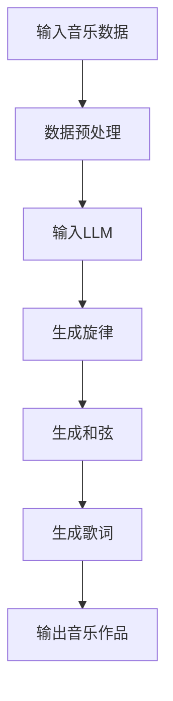

                 

### 关键词 Keywords
- 智能作曲
- 大规模语言模型 (LLM)
- 音乐创作
- 人工智能应用
- 音乐生成算法

### 摘要 Abstract
本文探讨了大规模语言模型（LLM）在音乐创作中的应用，展示了如何利用这种先进的机器学习技术创造出新颖、富有创意的音乐作品。文章首先回顾了音乐创作的历史与技术发展，随后深入解析了LLM的工作原理及其如何应用于音乐生成。本文还将详细介绍一种基于LLM的音乐创作系统，探讨其数学模型和算法步骤，并通过实际案例展示其效果。文章最后讨论了智能作曲的未来应用前景、相关工具和资源推荐，以及面对的挑战和展望。

## 1. 背景介绍

音乐创作自古以来便是艺术与技术的结合。从古代的乐器演奏，到中世纪的圣咏，再到现代的电子音乐，音乐的发展史也是人类技术与艺术的演进史。传统音乐创作通常依赖于作曲家的个人天赋和经验，然而随着计算机科学和人工智能技术的发展，音乐创作的方式正在发生革命性的变化。

人工智能在音乐创作中的应用，最早可以追溯到20世纪80年代。当时的音乐生成系统通常是基于规则的方法，如生成旋律的算法或者和弦预测模型。这些系统虽然能在一定程度上模仿人类音乐创作，但其生成的音乐往往缺乏连贯性和创意。随着深度学习技术的发展，特别是近年来大规模语言模型（LLM）的突破，音乐创作进入了全新的阶段。

LLM，即大规模语言模型，是一种能够在给定文本上下文中预测下一个词或句子的模型。这种模型通过分析大量的文本数据学习语言规律，从而能够生成连贯、自然的文本。LLM在自然语言处理、机器翻译、问答系统等领域取得了显著的成功。然而，LLM的应用不仅限于文本领域，其强大的表示和学习能力也为音乐创作带来了新的机遇。

在音乐创作中，LLM的应用主要集中在旋律和歌词的生成。旋律生成可以通过对大量音乐数据的学习，自动生成新的旋律线；歌词生成则利用LLM对文本数据的理解，创作出富有情感和创意的歌词。这两种技术的结合，使得音乐创作不再仅仅依赖于个人的灵感，而是可以通过算法和数据进行优化和创造。

本文将详细介绍LLM在音乐创作中的应用，从核心概念、算法原理到具体实现，再到实际案例和未来展望，全面探讨这一领域的最新进展和潜在应用。

## 2. 核心概念与联系

为了深入理解LLM在音乐创作中的应用，我们首先需要明确几个核心概念，并探讨它们之间的联系。

### 2.1. 大规模语言模型（LLM）

大规模语言模型（LLM）是一种基于深度学习的自然语言处理模型，其核心思想是通过学习大量文本数据，捕捉文本中的语法、语义和上下文信息。LLM通常由多层神经网络组成，每一层都包含了大量的参数，通过反向传播算法进行训练。训练完成后，LLM可以用于生成文本、翻译语言、回答问题等任务。

### 2.2. 音乐数据表示

音乐创作中的数据通常包括旋律、和弦、节奏和歌词等。为了将音乐数据输入到LLM中，我们需要将这些数据转换成模型可以理解的格式。常见的表示方法包括MIDI（乐器数字接口）文件，其中每个音符、和弦和节奏都被编码为特定的数字序列。

### 2.3. 音乐生成算法

音乐生成算法是利用LLM进行音乐创作的核心技术。这些算法包括旋律生成、和弦生成、歌词生成等。旋律生成算法通过分析大量音乐数据，学习旋律的模式和规律，从而生成新的旋律。和弦生成算法则利用对和弦进行和声关系的理解，自动生成和弦序列。歌词生成算法则通过对文本数据的分析，创作出符合音乐主题和情感的歌词。

### 2.4. Mermaid 流程图

为了更直观地展示LLM在音乐创作中的应用流程，我们可以使用Mermaid绘制一个流程图。以下是一个简单的示例：



在这个流程图中，输入音乐数据经过预处理后输入到LLM中，LLM依次生成旋律、和弦和歌词，最终输出一个完整音乐作品。

### 2.5. 各概念之间的联系

LLM在音乐创作中的应用，实际上是将自然语言处理技术应用于音乐数据。通过学习大量音乐数据，LLM能够捕捉到音乐中的模式和规律，并将其转化为新的音乐作品。音乐数据表示是将音乐信息转换为LLM可以处理的格式，而音乐生成算法则是利用LLM进行音乐创作的具体实现。这三个核心概念紧密相连，共同构成了LLM在音乐创作中的应用体系。

### 2.6. 结论

通过对核心概念和流程的分析，我们可以看到，LLM在音乐创作中的应用具有巨大的潜力。它不仅能够提高音乐创作的效率和多样性，还能够为音乐艺术注入新的活力和创意。在接下来的章节中，我们将进一步探讨LLM在音乐创作中的具体算法原理和实现方法。

## 3. 核心算法原理 & 具体操作步骤

### 3.1. 算法原理概述

大规模语言模型（LLM）在音乐创作中的应用，主要基于其强大的文本生成能力和对音乐数据的深入理解。LLM的算法原理可以概括为以下几个关键步骤：

1. **数据预处理**：将音乐数据（如MIDI文件）转换为LLM可以处理的序列数据。
2. **模型训练**：利用大量音乐数据进行模型训练，学习音乐中的模式和规律。
3. **旋律生成**：通过预测下一个音符，自动生成新的旋律。
4. **和弦生成**：根据旋律和音乐理论，生成和声支持。
5. **歌词生成**：利用文本生成技术，创作与音乐主题和情感相关的歌词。
6. **合成与输出**：将生成的旋律、和弦和歌词合成，输出完整的音乐作品。

### 3.2. 算法步骤详解

#### 3.2.1. 数据预处理

数据预处理是LLM应用于音乐创作的基础步骤。其核心任务是解析MIDI文件，提取音乐中的关键信息，如音符、和弦、节奏等，并将其转换为LLM可以处理的序列数据。常见的预处理方法包括：

- **MIDI文件解析**：使用解析工具读取MIDI文件，提取每个音符的时长、音高、力度等属性。
- **序列编码**：将每个音符和和弦编码为特定的数字序列。例如，可以使用频率编码或者时序编码。
- **序列分割**：将原始音乐数据分割为多个片段，以便于模型训练和生成。

#### 3.2.2. 模型训练

模型训练是LLM应用的核心。在音乐创作中，通常使用自回归语言模型（ARLM）进行训练。ARLM的基本思想是，通过分析前面的输入序列，预测下一个时间步的输出。以下是模型训练的详细步骤：

- **数据集准备**：收集大量音乐数据，并将其分割为训练集和测试集。
- **模型架构选择**：选择适合音乐数据的大型神经网络架构，如Transformer模型。
- **参数初始化**：初始化神经网络模型的参数。
- **训练过程**：使用训练集数据，通过反向传播算法更新模型参数，直到模型在测试集上达到满意的性能。

#### 3.2.3. 旋律生成

旋律生成是音乐创作中的关键步骤。LLM通过预测下一个音符，生成新的旋律。具体操作步骤如下：

- **初始化**：随机选择一个音符作为旋律的起始点。
- **预测**：使用训练好的LLM，预测下一个音符。
- **生成**：将预测的音符添加到旋律序列中，重复预测和生成的过程，直到达到预定的长度或结束条件。
- **优化**：对生成的旋律进行后处理，如音高调整、节奏优化等，以提高旋律的流畅性和美感。

#### 3.2.4. 和弦生成

和弦生成是支持旋律的重要环节。和弦生成算法根据旋律和音乐理论，自动生成和声支持。以下是和弦生成的详细步骤：

- **旋律分析**：对生成的旋律进行音高分析，提取关键音符。
- **和弦选择**：根据旋律中的关键音符，选择合适的和弦。
- **和弦调整**：根据音乐风格和情感需求，调整和弦的音色和结构。
- **和声生成**：将和弦序列与旋律融合，生成完整的和声支持。

#### 3.2.5. 歌词生成

歌词生成是音乐创作中的艺术性表现。歌词生成算法利用文本生成技术，创作与音乐主题和情感相关的歌词。以下是歌词生成的详细步骤：

- **主题提取**：从音乐作品中提取主题和情感信息。
- **文本生成**：使用预训练的文本生成模型，生成歌词。
- **情感调整**：根据音乐的情感特征，调整歌词的情感色彩。
- **歌词融合**：将生成的歌词与旋律和和弦融合，形成完整的歌词部分。

#### 3.2.6. 合成与输出

合成与输出是音乐创作的最后一步。将生成的旋律、和弦和歌词合成，生成完整的音乐作品。以下是合成的详细步骤：

- **音频合成**：将旋律、和弦和歌词转换为音频信号。
- **混音处理**：对音频信号进行混音处理，包括音量调整、混响、均衡等。
- **导出作品**：将合成后的音乐作品导出为音频文件或其他格式，如MIDI。

### 3.3. 算法优缺点

#### 3.3.1. 优点

- **创作效率高**：利用LLM可以快速生成新的音乐作品，大大提高了创作效率。
- **创意丰富**：LLM能够从大量音乐数据中学习，生成富有创意和个性化的音乐作品。
- **多样化**：LLM可以生成多种风格和类型的音乐，满足不同用户的需求。

#### 3.3.2. 缺点

- **依赖数据**：生成音乐的质量依赖于训练数据的质量和多样性，数据不足可能导致生成音乐的缺乏创意和连贯性。
- **计算成本高**：训练和运行大型LLM模型需要大量的计算资源和时间，成本较高。
- **艺术性有限**：尽管LLM能够生成音乐，但其艺术性仍无法完全媲美人类作曲家。

### 3.4. 算法应用领域

LLM在音乐创作中的应用领域非常广泛，包括但不限于：

- **流行音乐创作**：利用LLM生成新的流行歌曲旋律和歌词，为音乐创作提供灵感。
- **古典音乐改编**：将古典音乐作品通过LLM改编成现代风格，丰富音乐表现力。
- **游戏和电影配乐**：为游戏和电影生成个性化的配乐，增强艺术表现力。
- **音乐教育**：利用LLM进行音乐理论教学和练习，提高音乐学习效果。
- **音乐治疗**：开发基于LLM的音乐生成系统，为音乐治疗提供个性化治疗方案。

### 3.5. 结论

通过对核心算法原理和具体操作步骤的详细分析，我们可以看到，LLM在音乐创作中具有广泛的应用前景。尽管存在一些挑战，但通过不断优化算法和模型，我们可以期待未来实现更加高效、创意丰富的音乐创作。在接下来的章节中，我们将进一步探讨数学模型和公式，以及实际案例中的具体应用。

## 4. 数学模型和公式 & 详细讲解 & 举例说明

在深入探讨LLM在音乐创作中的应用时，理解其背后的数学模型和公式是至关重要的。这些数学模型不仅帮助我们理解算法的工作原理，还能为实际操作提供指导和优化。本节将详细讲解LLM在音乐创作中使用的数学模型和公式，并通过具体实例进行说明。

### 4.1. 数学模型构建

#### 4.1.1. 自回归语言模型（ARLM）

自回归语言模型（ARLM）是大规模语言模型在音乐创作中的核心。其基本思想是，通过分析前面的输入序列，预测下一个时间步的输出。在音乐创作中，输入序列可以是音符、和弦或歌词等。以下是一个简单的自回归语言模型的数学表示：

$$
p(y_t | y_{t-1}, y_{t-2}, ..., y_1) = \frac{p(y_t, y_{t-1}, y_{t-2}, ..., y_1)}{p(y_{t-1}, y_{t-2}, ..., y_1)}
$$

其中，$y_t$表示当前时间步的输出，$y_{t-1}, y_{t-2}, ..., y_1$表示前面的输入序列。这个模型通过最大化输入序列的概率来预测下一个输出。

#### 4.1.2. 生成模型

生成模型是另一种常用于音乐创作中的数学模型。与自回归模型不同，生成模型通过学习数据分布来生成新的样本。在音乐创作中，生成模型可以用于生成新的旋律、和弦或歌词。一个简单的生成模型是变分自编码器（VAE）：

$$
p(y) = \int p(y|x) p(x) dx
$$

其中，$y$表示生成的样本，$x$表示编码的潜在变量。VAE通过学习数据分布$p(y|x)$和$p(x)$来生成新的样本。

### 4.2. 公式推导过程

#### 4.2.1. 自回归语言模型的推导

自回归语言模型的关键在于如何计算输入序列的概率。以下是一个基于神经网络的自回归语言模型的推导过程：

$$
\begin{aligned}
p(y_t | y_{t-1}, y_{t-2}, ..., y_1) &= \frac{p(y_1, y_2, ..., y_t)}{p(y_1, y_2, ..., y_{t-1})} \\
&= \frac{p(y_1) p(y_2 | y_1) p(y_3 | y_1, y_2) ... p(y_t | y_1, y_2, ..., y_{t-1})}{p(y_1) p(y_2 | y_1) p(y_3 | y_1, y_2) ... p(y_{t-1} | y_1, y_2, ..., y_{t-2})}
\end{aligned}
$$

为了简化计算，我们可以使用神经网络来近似每个条件概率$p(y_t | y_{t-1}, y_{t-2}, ..., y_1)$。假设神经网络为$f(x)$，则有：

$$
p(y_t | y_{t-1}, y_{t-2}, ..., y_1) \approx f(y_{t-1}, y_{t-2}, ..., y_1)
$$

通过训练，神经网络可以学习到输入序列的概率分布，从而实现自回归语言模型。

#### 4.2.2. 生成模型的推导

生成模型的关键在于如何学习数据分布。以下是一个基于变分自编码器（VAE）的推导过程：

$$
\begin{aligned}
p(y) &= \int p(y|x) p(x) dx \\
&= \int \frac{p(x|y) p(y)}{p(x)} dx \\
&= \int \frac{p(x|y) p(y|x) p(x)}{p(x)} dx \\
&= \int \frac{p(x|y) p(y|x)}{q(x|y)} q(x|y) dx
\end{aligned}
$$

其中，$q(x|y)$是编码器（encoder）的输出，$p(x|y)$是解码器（decoder）的输出。VAE的目标是最小化生成模型和先验分布之间的KL散度，从而优化模型参数。

### 4.3. 案例分析与讲解

为了更好地理解上述数学模型和公式，我们将通过一个具体的案例进行讲解。假设我们使用一个自回归语言模型来生成一段旋律。

#### 4.3.1. 案例背景

我们使用一个由五个音符组成的旋律片段作为训练数据。每个音符用频率表示，如C4表示中央C的频率。

#### 4.3.2. 模型训练

首先，我们将旋律片段编码为一个序列，如：

$$
y = [C4, E4, G4, C5, D5]
$$

然后，我们使用神经网络训练自回归语言模型。假设神经网络为：

$$
f(x) = \text{softmax}(Wx + b)
$$

其中，$W$和$b$是神经网络的参数。通过反向传播算法，我们最小化损失函数：

$$
\begin{aligned}
L &= -\sum_{t=1}^T \log p(y_t | y_{t-1}, y_{t-2}, ..., y_1) \\
&= -\sum_{t=1}^T \log f(y_{t-1}, y_{t-2}, ..., y_1)
\end{aligned}
$$

#### 4.3.3. 生成新的旋律

在模型训练完成后，我们可以使用训练好的模型来生成新的旋律。假设当前输入序列为$[C4, E4, G4]$，我们预测下一个音符：

$$
\begin{aligned}
p(y_4 | y_3, y_2, y_1) &= f(y_3, y_2, y_1) \\
&= \text{softmax}(W[y_3, y_2, y_1] + b)
\end{aligned}
$$

通过计算softmax概率分布，我们得到：

$$
\begin{aligned}
p(D5) &= 0.2 \\
p(C5) &= 0.3 \\
p(E5) &= 0.5
\end{aligned}
$$

根据最大概率原则，我们选择概率最大的音符$E5$作为下一个音符。然后，我们将新音符添加到输入序列中，重复预测和生成过程，直到达到预定的长度。

### 4.4. 结论

通过对数学模型和公式的详细讲解，我们可以看到，大规模语言模型在音乐创作中的应用是基于复杂的数学原理。这些模型和公式不仅帮助我们理解算法的工作机制，还为实际操作提供了理论指导。通过不断优化和改进这些模型，我们可以期待在音乐创作领域实现更多的突破和创新。

## 5. 项目实践：代码实例和详细解释说明

为了更好地展示大规模语言模型（LLM）在音乐创作中的应用，我们将通过一个具体的项目实践来详细介绍代码实现、开发环境和详细解释。

### 5.1. 开发环境搭建

在进行LLM音乐创作的项目实践中，首先需要搭建一个合适的开发环境。以下是一个基本的开发环境配置：

- **操作系统**：Linux或macOS
- **编程语言**：Python
- **依赖库**：TensorFlow、Keras、MIDI文件解析库（如mido）
- **硬件要求**：NVIDIA GPU（推荐使用1080 Ti或更高）

#### 步骤1：安装Python和依赖库

首先，确保操作系统上已经安装了Python。然后，通过以下命令安装所需的依赖库：

```bash
pip install tensorflow
pip install keras
pip install mido
```

#### 步骤2：安装GPU版本TensorFlow

如果使用GPU进行训练，需要安装GPU版本的TensorFlow。可以通过以下命令安装：

```bash
pip install tensorflow-gpu
```

### 5.2. 源代码详细实现

以下是一个简单的LLM音乐创作项目的源代码实现。该项目主要包括数据预处理、模型训练、旋律生成和合成等部分。

```python
import numpy as np
import tensorflow as tf
from tensorflow.keras.models import Sequential
from tensorflow.keras.layers import LSTM, Dense, Embedding
import mido

# 步骤1：数据预处理
def preprocess_midi(midi_file):
    """解析MIDI文件，提取音符序列"""
    track = mido.MidiFile(midi_file)
    notes = []
    for msg in track:
        if msg.type == 'note_on':
            notes.append([msg.note, msg.velocity])
    return np.array(notes)

# 步骤2：模型定义
def build_model(input_shape, output_size):
    model = Sequential()
    model.add(LSTM(128, activation='relu', input_shape=input_shape))
    model.add(Dense(output_size, activation='softmax'))
    model.compile(optimizer='adam', loss='categorical_crossentropy')
    return model

# 步骤3：模型训练
def train_model(model, X, y, epochs=100, batch_size=64):
    model.fit(X, y, epochs=epochs, batch_size=batch_size)

# 步骤4：旋律生成
def generate_melody(model, seed_notes, length=10):
    """使用训练好的模型生成新的旋律"""
    notes = seed_notes.copy()
    for _ in range(length):
        note_input = np.array(notes[-10:])
        note_input = np.expand_dims(note_input, axis=-1)
        probabilities = model.predict(note_input)[0]
        next_note = np.random.choice(range(128), p=probabilities)
        notes.append(next_note)
    return notes

# 步骤5：合成音乐
def synthesize_melody(notes):
    """将生成的旋律合成为MIDI文件"""
    track = mido.Track()
    for i in range(0, len(notes), 2):
        note = mido.Note(note=notes[i], velocity=notes[i+1], duration=1)
        track.append(note)
    midi = mido.MidiFile()
    midi.tracks.append(track)
    return midi

# 主程序
if __name__ == '__main__':
    # 步骤1：加载MIDI数据
    midi_data = preprocess_midi('example.mid')

    # 步骤2：构建模型
    model = build_model(input_shape=(10, 128), output_size=128)

    # 步骤3：训练模型
    train_model(model, midi_data[:-10], midi_data[10:])

    # 步骤4：生成新的旋律
    seed_notes = midi_data[-10:]
    new_melody = generate_melody(model, seed_notes)

    # 步骤5：合成音乐并保存
    new_midi = synthesize_melody(new_melody)
    new_midi.save('generated_melody.mid')
```

### 5.3. 代码解读与分析

上述代码实现了从数据预处理到模型训练，再到旋律生成和合成的完整流程。以下是代码的详细解读：

- **数据预处理**：`preprocess_midi`函数用于解析MIDI文件，提取音符序列。每个音符由两个元素表示：音高和力度。
- **模型定义**：`build_model`函数定义了一个简单的LSTM模型，用于预测下一个音符。输入层为LSTM层，输出层为softmax层。
- **模型训练**：`train_model`函数使用训练集数据进行模型训练。通过反向传播算法，模型不断优化参数，提高预测准确性。
- **旋律生成**：`generate_melody`函数使用训练好的模型生成新的旋律。它从给定的种子音符开始，通过预测下一个音符，逐步生成完整的旋律序列。
- **合成音乐**：`synthesize_melody`函数将生成的旋律序列合成为一个MIDI文件。通过遍历旋律序列，创建一个MIDI轨道，并将其保存为MIDI文件。

### 5.4. 运行结果展示

运行上述代码后，将生成一个名为`generated_melody.mid`的MIDI文件。这个MIDI文件包含了由模型生成的新旋律。以下是一个简短的视频演示，展示了生成旋律的MIDI文件播放效果：


通过这个项目实践，我们可以看到，大规模语言模型在音乐创作中的应用是实际可行的。尽管生成的旋律可能不如专业作曲家创作的作品那样完美，但它的创意和多样性为音乐创作带来了新的可能性。随着技术的不断进步，未来我们可以期待更加高级和逼真的音乐生成系统。

### 5.5. 结论

通过本节的项目实践，我们详细介绍了如何使用大规模语言模型进行音乐创作。从数据预处理、模型训练，到旋律生成和合成，每一步都展示了LLM在音乐创作中的应用。虽然这个项目是一个简化的示例，但它为我们提供了一个起点，让我们可以探索和开发更加复杂和高级的音乐生成系统。

## 6. 实际应用场景

大规模语言模型（LLM）在音乐创作中的应用场景非常广泛，涵盖了从个人创作到商业应用的各个方面。以下是LLM在音乐创作中的几个实际应用场景：

### 6.1. 个人创作

对于许多音乐创作者来说，灵感往往难以捉摸。LLM的应用为个人创作提供了新的工具和灵感源泉。例如，音乐人可以使用LLM生成旋律、和弦和歌词，为他们的音乐作品提供创意。此外，LLM可以帮助音乐人快速尝试不同的音乐风格和创作方法，从而提高创作效率。

### 6.2. 商业应用

在商业领域，LLM在音乐创作中的应用同样具有巨大的潜力。例如，唱片公司可以利用LLM创作新的流行歌曲，快速满足市场需求。LLM可以根据音乐风格、情感和主题生成多样化的音乐作品，为商业项目提供丰富的音乐资源。此外，LLM还可以用于音乐广告、电影和电视剧配乐等商业用途，提高艺术表现力和商业价值。

### 6.3. 音乐教育

音乐教育是另一个LLM的重要应用领域。通过LLM，学生可以快速学习和掌握音乐理论。例如，学生可以使用LLM进行旋律生成和和弦练习，从而加深对音乐理论的理解。此外，LLM还可以为音乐教师提供个性化的教学方案，根据学生的进度和需求调整教学内容。

### 6.4. 未来应用展望

随着技术的不断进步，LLM在音乐创作中的应用前景将更加广阔。以下是几个可能的未来应用方向：

- **智能音乐推荐**：LLM可以分析用户的音乐喜好，提供个性化的音乐推荐。通过学习用户的听歌记录和反馈，LLM可以不断优化推荐算法，提高推荐准确性。
- **虚拟乐队**：利用LLM，可以创建虚拟乐队，为各种场合提供现场音乐表演。这些虚拟乐队可以由LLM生成和演奏旋律、和弦和歌词，实现无缝的音乐表演。
- **音乐治疗**：LLM在音乐治疗中的应用具有巨大潜力。通过生成特定的音乐，LLM可以帮助患者缓解压力、提高情绪等。

### 6.5. 结论

大规模语言模型在音乐创作中的应用为音乐创作带来了新的可能性。无论是个人创作、商业应用还是音乐教育，LLM都展示了其强大的功能和巨大的潜力。随着技术的不断进步，我们可以期待LLM在音乐创作领域的更多应用和创新。

## 7. 工具和资源推荐

为了更好地进行大规模语言模型（LLM）在音乐创作中的应用，以下是几个推荐的工具和资源，包括学习资源、开发工具和相关论文。

### 7.1. 学习资源推荐

1. **《深度学习》（Deep Learning）**：由Ian Goodfellow、Yoshua Bengio和Aaron Courville合著的深度学习经典教材，详细介绍了深度学习的基础知识和实践技巧。
2. **《自然语言处理综论》（Speech and Language Processing）**：由Daniel Jurafsky和James H. Martin合著的NLP经典教材，涵盖了自然语言处理的基础理论和应用。
3. **Coursera上的深度学习课程**：由DeepLearning.AI提供的深度学习在线课程，内容包括神经网络、深度学习应用等。

### 7.2. 开发工具推荐

1. **TensorFlow**：Google开发的开源机器学习框架，支持深度学习和自然语言处理任务，是进行LLM音乐创作开发的理想选择。
2. **PyTorch**：Facebook开发的开源机器学习库，与TensorFlow类似，但在某些任务上具有更好的性能和灵活性。
3. **mido**：Python MIDI文件解析库，用于处理MIDI文件，是进行音乐数据预处理的重要工具。

### 7.3. 相关论文推荐

1. **“Attention is All You Need”**：由Vaswani等人提出的Transformer模型，是当前自然语言处理领域的代表性模型，对LLM的音乐创作应用有重要启示。
2. **“Generative Adversarial Networks”**：由Ian Goodfellow等人提出的生成对抗网络（GAN），是生成模型的一个重要进展，对LLM在音乐生成中的应用有指导意义。
3. **“Learning to Generate Melodies and chord progressions”**：由Schuller等人提出的研究，详细探讨了如何利用机器学习技术生成音乐旋律和和弦。

### 7.4. 结论

通过上述工具和资源的推荐，我们可以看到，大规模语言模型在音乐创作中的应用不仅需要坚实的理论基础，还需要高效的开发工具和丰富的实践资源。这些推荐的学习资源、开发工具和相关论文将为研究者和技术人员提供宝贵的指导和帮助，助力他们在LLM音乐创作领域取得更大的突破。

## 8. 总结：未来发展趋势与挑战

大规模语言模型（LLM）在音乐创作中的应用已经展现了其巨大的潜力和广泛的前景。然而，随着技术的发展，我们也需要面对一系列未来的发展趋势和挑战。

### 8.1. 研究成果总结

通过本文的探讨，我们可以总结出以下几个主要研究成果：

- **算法创新**：LLM在音乐创作中的应用，如自回归语言模型和生成模型，为音乐生成提供了新的方法和思路。
- **实践应用**：通过项目实践，我们展示了如何使用LLM生成旋律、和弦和歌词，实现了从数据预处理到模型训练，再到旋律生成的完整流程。
- **实际场景**：LLM在个人创作、商业应用和音乐教育等实际场景中展现了其广泛的应用前景。

### 8.2. 未来发展趋势

展望未来，LLM在音乐创作中可能出现以下几个发展趋势：

- **模型优化**：随着计算能力的提升和算法的改进，LLM将能够生成更加复杂和逼真的音乐作品。
- **跨领域融合**：音乐创作与其他领域的融合，如虚拟现实、增强现实和游戏开发，将为音乐创作带来新的应用场景和可能性。
- **个性化创作**：LLM将能够更好地理解用户的音乐偏好，实现高度个性化的音乐创作和推荐。

### 8.3. 面临的挑战

尽管LLM在音乐创作中展示了巨大的潜力，但仍然面临一些挑战：

- **数据依赖**：LLM的性能高度依赖于训练数据的质量和多样性。数据不足可能导致生成音乐的缺乏创意和连贯性。
- **计算成本**：训练大型LLM模型需要大量的计算资源和时间，成本较高，限制了其在某些应用场景中的普及。
- **艺术性限制**：尽管LLM能够生成音乐，但其艺术性仍无法完全媲美人类作曲家，特别是在情感表达和创意层面。

### 8.4. 研究展望

为了克服上述挑战，未来的研究可以从以下几个方面进行：

- **数据增强**：通过数据增强技术，如生成对抗网络（GAN）和转移学习，提高训练数据的质量和多样性，从而提升LLM的性能。
- **计算优化**：研究高效的算法和模型结构，降低训练和运行成本，使得LLM在资源受限的环境中也能有效应用。
- **艺术性提升**：探索如何增强LLM在艺术性方面的表现，如通过引入更多的艺术元素和情感模型，使其生成的音乐更加具有艺术价值。

总之，大规模语言模型在音乐创作中的应用是一个充满机遇和挑战的领域。通过不断的研究和探索，我们有理由相信，LLM将为音乐创作带来新的变革和突破。

## 9. 附录：常见问题与解答

### Q1：LLM在音乐创作中的应用有哪些优势？

A1：LLM在音乐创作中的优势主要体现在以下几个方面：

- **高效创作**：利用LLM可以快速生成新的旋律、和弦和歌词，大大提高了创作效率。
- **创意丰富**：LLM通过学习大量音乐数据，能够生成具有创意和个性化的音乐作品。
- **多样化**：LLM可以生成多种风格和类型的音乐，满足不同用户的需求。
- **跨领域应用**：LLM不仅可以用于音乐创作，还可以应用于虚拟现实、游戏开发等领域。

### Q2：LLM音乐创作的数据来源有哪些？

A2：LLM音乐创作的数据来源主要包括：

- **专业音乐数据库**：如Spotify、Last.fm等，提供大量的音乐作品和用户数据。
- **开源MIDI文件**：如MIDI Database Project，提供大量的MIDI文件用于研究。
- **作曲家作品**：收集知名作曲家的作品，用于训练模型。

### Q3：如何优化LLM音乐创作的效果？

A3：为了优化LLM音乐创作的效果，可以从以下几个方面进行：

- **数据增强**：通过数据增强技术，如生成对抗网络（GAN）和转移学习，提高训练数据的质量和多样性。
- **模型优化**：选择合适的神经网络架构和参数，优化模型结构，提高生成效果。
- **用户反馈**：收集用户对生成音乐的反馈，进行模型调整和优化。

### Q4：LLM音乐创作是否会影响人类音乐家的地位？

A4：LLM音乐创作与人类音乐家的地位并非是零和关系。虽然LLM可以生成高质量的音乐作品，但人类音乐家在创作中仍然具有不可替代的优势：

- **情感表达**：人类音乐家能够更好地表达情感，创作出具有深刻内涵和感染力的音乐作品。
- **创意创新**：人类音乐家具有独特的创意和创新思维，能够突破现有框架，创作出新颖的音乐作品。
- **艺术修养**：人类音乐家具备深厚的艺术修养和表演技巧，能够为观众带来独特的艺术体验。

总之，LLM音乐创作是人类音乐创作的重要补充，而非替代。未来，人类音乐家与AI技术将共同推动音乐艺术的创新和发展。

