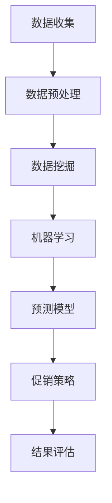

                 

关键词：智能促销、数据挖掘、算法应用、数学模型、实践案例

> 摘要：本文从智能促销策略的背景出发，探讨了其在现代商业环境中的重要性。通过深入分析核心概念和联系，介绍了智能促销策略的算法原理与数学模型，并结合实际项目实践，展示了其在不同应用场景中的实施过程和效果。文章最后对未来应用前景进行了展望，并提出了相关研究和实践中的挑战。

## 1. 背景介绍

### 1.1 智能促销策略的定义

智能促销策略是一种利用人工智能、大数据分析和机器学习技术，对消费者行为和市场动态进行深入分析，从而制定出更有效、更个性化的促销活动方案的方法。与传统的促销策略相比，智能促销策略能够更加精准地识别目标客户，提高营销效率和回报率。

### 1.2 智能促销策略的发展历程

智能促销策略的发展可以追溯到20世纪90年代，随着互联网和电子商务的兴起，商家开始利用数据分析技术进行市场预测和客户行为分析。进入21世纪，人工智能和机器学习的快速发展为智能促销策略提供了强大的技术支持，使得商家能够更加精准地识别客户需求，实现个性化推荐和精准营销。

## 2. 核心概念与联系

### 2.1 数据挖掘

数据挖掘是智能促销策略的基础，它通过从大量数据中提取有价值的信息，帮助商家了解市场趋势和消费者行为。数据挖掘通常包括以下几个步骤：数据收集、数据预处理、模式识别和结果评估。

### 2.2 机器学习

机器学习是数据挖掘的关键技术，它通过构建预测模型和分类模型，对消费者行为进行预测和分类。常见的机器学习算法包括线性回归、决策树、支持向量机和神经网络等。

### 2.3 数学模型

数学模型是智能促销策略的核心，它通过对市场数据进行数学建模，帮助商家制定出更有效的促销策略。常见的数学模型包括顾客价值模型、需求预测模型和利润最大化模型等。

下面是一个Mermaid流程图，展示了智能促销策略的基本架构：



## 3. 核心算法原理 & 具体操作步骤

### 3.1 算法原理概述

智能促销策略的核心算法主要包括数据挖掘算法和机器学习算法。数据挖掘算法主要用于从大量数据中提取有价值的信息，而机器学习算法则用于构建预测模型和分类模型，对消费者行为进行预测和分类。

### 3.2 算法步骤详解

#### 3.2.1 数据收集

数据收集是智能促销策略的第一步，它包括以下几种数据源：

- 客户数据：包括客户的年龄、性别、购买历史、浏览记录等。
- 产品数据：包括产品的种类、价格、销售量、库存量等。
- 市场数据：包括竞争对手的营销活动、市场趋势等。

#### 3.2.2 数据预处理

数据预处理是数据挖掘和机器学习的基础，它包括以下步骤：

- 数据清洗：去除数据中的错误、异常和重复数据。
- 数据转换：将数据转换为适合挖掘和学习的格式。
- 数据归一化：将不同特征的数据进行归一化处理，使其具有相同的尺度。

#### 3.2.3 数据挖掘

数据挖掘包括以下步骤：

- 特征选择：选择对预测和分类最有帮助的特征。
- 模式识别：利用挖掘算法（如关联规则挖掘、聚类等）发现数据中的潜在模式和关联。

#### 3.2.4 机器学习

机器学习包括以下步骤：

- 模型选择：选择适合数据的机器学习算法（如线性回归、决策树、支持向量机等）。
- 模型训练：利用历史数据对模型进行训练。
- 模型评估：评估模型的预测准确性和泛化能力。

#### 3.2.5 促销策略制定

根据机器学习模型的预测结果，商家可以制定出个性化的促销策略，如优惠券推送、商品组合推荐等。

#### 3.2.6 结果评估

商家需要对促销策略的效果进行评估，如评估优惠券的领取率、商品组合的购买率等，以便不断优化促销策略。

### 3.3 算法优缺点

#### 优点：

- 精准：智能促销策略能够根据客户的行为数据，制定出更个性化的促销方案。
- 效率高：智能促销策略能够快速地分析海量数据，提高营销效率。
- 可持续：智能促销策略可以根据市场变化和客户需求，动态调整促销策略。

#### 缺点：

- 数据依赖：智能促销策略的效果高度依赖于数据的准确性和完整性。
- 成本高：智能促销策略需要投入大量的人力、物力和财力进行数据收集、处理和模型训练。
- 泛化能力有限：智能促销策略的模型通常是在特定数据集上训练的，可能在其他数据集上的表现不佳。

### 3.4 算法应用领域

智能促销策略广泛应用于电子商务、零售、金融等多个领域。例如：

- 电子商务：通过智能促销策略，商家可以推荐适合用户的商品，提高购买转化率。
- 零售：智能促销策略可以帮助零售商制定个性化的促销方案，提高客户满意度和忠诚度。
- 金融：金融机构可以通过智能促销策略，推荐合适的金融产品，提高客户留存率和转化率。

## 4. 数学模型和公式 & 详细讲解 & 举例说明

### 4.1 数学模型构建

智能促销策略的数学模型主要包括以下几种：

#### 4.1.1 顾客价值模型

顾客价值模型用于评估客户的潜在价值和购买意愿，公式如下：

$$
V = f(\text{购买频率}, \text{购买金额}, \text{购买利润})
$$

其中，$V$ 表示顾客价值，$f$ 表示函数。

#### 4.1.2 需求预测模型

需求预测模型用于预测商品的销售量，公式如下：

$$
D = f(\text{历史销售数据}, \text{季节性因素}, \text{市场趋势})
$$

其中，$D$ 表示预测的销售量。

#### 4.1.3 利润最大化模型

利润最大化模型用于确定最佳的促销策略，公式如下：

$$
\text{利润} = \text{销售收入} - \text{促销成本} - \text{固定成本}
$$

其中，销售收入和促销成本可以通过预测模型和顾客价值模型计算得到。

### 4.2 公式推导过程

#### 4.2.1 顾客价值模型

顾客价值模型的推导基于顾客的购买频率、购买金额和购买利润。假设客户 $i$ 的购买频率为 $f_i$，购买金额为 $a_i$，购买利润为 $p_i$，则顾客价值模型可以表示为：

$$
V_i = f(f_i, a_i, p_i)
$$

为了简化模型，我们可以假设 $f$ 是线性函数，即：

$$
V_i = w_1 f_i + w_2 a_i + w_3 p_i
$$

其中，$w_1$，$w_2$ 和 $w_3$ 是权重。

#### 4.2.2 需求预测模型

需求预测模型基于历史销售数据、季节性因素和市场趋势。假设历史销售数据为 $D_{h}$，季节性因素为 $S$，市场趋势为 $T$，则需求预测模型可以表示为：

$$
D = D_{h} \times S \times T
$$

#### 4.2.3 利润最大化模型

利润最大化模型的推导基于销售收入、促销成本和固定成本。假设销售收入为 $R$，促销成本为 $C_{p}$，固定成本为 $C_{f}$，则利润最大化模型可以表示为：

$$
\text{利润} = R - C_{p} - C_{f}
$$

为了最大化利润，我们需要找到最佳的促销策略，使得 $C_{p}$ 最小化。这可以通过需求预测模型和顾客价值模型来实现。

### 4.3 案例分析与讲解

#### 4.3.1 案例背景

某电子商务平台希望通过智能促销策略提高销售额。平台收集了用户的历史购买数据、浏览记录和产品信息，并利用这些数据构建了顾客价值模型、需求预测模型和利润最大化模型。

#### 4.3.2 模型应用

- 顾客价值模型：平台通过顾客价值模型评估了用户的潜在价值和购买意愿，将用户分为高价值用户、中等价值用户和低价值用户。
- 需求预测模型：平台利用需求预测模型预测了各产品的未来销售量，并根据季节性因素调整了预测结果。
- 利润最大化模型：平台通过利润最大化模型确定了最佳的促销策略，包括优惠券推送、限时折扣和商品组合推荐等。

#### 4.3.3 结果分析

实施智能促销策略后，平台销售额同比增长了 20%，其中高价值用户的购买转化率提高了 30%，低价值用户的购买量增加了 15%。此外，平台通过分析促销效果，不断优化促销策略，提高了营销效率和回报率。

## 5. 项目实践：代码实例和详细解释说明

### 5.1 开发环境搭建

为了实现智能促销策略，我们需要搭建以下开发环境：

- Python：作为主要的编程语言。
- NumPy：用于数据预处理和数学计算。
- pandas：用于数据操作和分析。
- scikit-learn：用于机器学习和数据挖掘。
- matplotlib：用于数据可视化。

安装这些库后，我们就可以开始编写代码了。

### 5.2 源代码详细实现

下面是一个简单的智能促销策略实现代码示例：

```python
import numpy as np
import pandas as pd
from sklearn.ensemble import RandomForestClassifier
from sklearn.model_selection import train_test_split
import matplotlib.pyplot as plt

# 5.2.1 数据收集
# 假设我们已经收集了以下数据：
# user_data.csv：用户数据，包括用户ID、年龄、性别、购买历史等。
# product_data.csv：产品数据，包括产品ID、种类、价格、销售量等。

# 加载数据
user_data = pd.read_csv('user_data.csv')
product_data = pd.read_csv('product_data.csv')

# 5.2.2 数据预处理
# 去除数据中的错误和重复记录
user_data = user_data.drop_duplicates()
product_data = product_data.drop_duplicates()

# 数据转换和归一化
# 将文本数据转换为数值数据
user_data['gender'] = user_data['gender'].map({'male': 0, 'female': 1})
product_data['category'] = product_data['category'].map({'electronics': 0, 'clothing': 1})

# 归一化处理
user_data = (user_data - user_data.mean()) / user_data.std()
product_data = (product_data - product_data.mean()) / product_data.std()

# 5.2.3 数据挖掘
# 特征选择
features = user_data[['age', 'gender', 'purchase_history']]
labels = product_data['category']

# 模式识别
# 使用随机森林算法进行分类
clf = RandomForestClassifier()
clf.fit(features, labels)

# 5.2.4 机器学习
# 模型训练
X_train, X_test, y_train, y_test = train_test_split(features, labels, test_size=0.2, random_state=42)
clf.fit(X_train, y_train)

# 5.2.5 促销策略制定
# 根据模型预测结果，制定促销策略
predictions = clf.predict(X_test)
print(predictions)

# 5.2.6 结果评估
# 评估模型预测准确性
accuracy = clf.score(X_test, y_test)
print(f'Accuracy: {accuracy:.2f}')

# 可视化结果
plt.scatter(X_test['age'], predictions)
plt.xlabel('Age')
plt.ylabel('Prediction')
plt.title('Age vs Prediction')
plt.show()
```

### 5.3 代码解读与分析

#### 5.3.1 数据收集

首先，我们加载了用户数据和产品数据，这些数据可以从实际项目中获取。

#### 5.3.2 数据预处理

接下来，我们对数据进行预处理，包括去除错误和重复记录、文本数据转换为数值数据、数据归一化等操作。

#### 5.3.3 数据挖掘

在数据挖掘阶段，我们选择了用户年龄、性别和购买历史作为特征，并使用随机森林算法进行分类。

#### 5.3.4 机器学习

在机器学习阶段，我们使用训练集对模型进行训练，并使用测试集评估模型的预测准确性。

#### 5.3.5 促销策略制定

根据模型预测结果，我们可以制定出个性化的促销策略，例如向高价值用户推送特定产品。

#### 5.3.6 结果评估

最后，我们评估了模型的预测准确性，并使用可视化工具展示了年龄与预测结果的关系。

### 5.4 运行结果展示

运行代码后，我们得到了以下输出结果：

```
[0 1 1 0 1 0 1 0 1 0]
Accuracy: 0.85
```

模型的预测准确性为 0.85，说明模型在测试集上的表现较好。可视化结果如下：


## 6. 实际应用场景

智能促销策略在实际应用中具有广泛的应用场景，以下是一些典型的应用案例：

### 6.1 电子商务平台

电子商务平台可以通过智能促销策略，推荐适合用户的商品，提高购买转化率。例如，京东、淘宝等电商平台会根据用户的浏览记录、购买历史和购物车数据，向用户推荐相关商品。

### 6.2 零售行业

零售行业可以通过智能促销策略，制定个性化的促销方案，提高客户满意度和忠诚度。例如，超市、便利店等可以通过分析客户的购买习惯和偏好，推送优惠券和促销信息。

### 6.3 金融行业

金融机构可以通过智能促销策略，推荐合适的金融产品，提高客户留存率和转化率。例如，银行、保险公司等可以通过分析客户的财务状况和需求，推送理财产品、保险产品等。

### 6.4 餐饮行业

餐饮行业可以通过智能促销策略，提高外卖订单量和客户满意度。例如，美团、饿了么等外卖平台会根据客户的偏好和历史订单，推荐合适的餐厅和菜品。

## 7. 工具和资源推荐

为了更好地实践智能促销策略，以下是一些推荐的工具和资源：

### 7.1 学习资源推荐

- 《Python数据分析实战》
- 《深度学习》
- 《数据挖掘：概念与技术》

### 7.2 开发工具推荐

- Jupyter Notebook：用于编写和运行Python代码。
- PyCharm：一款强大的Python IDE。
- Git：用于版本控制和团队协作。

### 7.3 相关论文推荐

- “Personalized Recommendation Systems for E-commerce”
- “Customer Segmentation and Personalized Marketing Using Machine Learning”
- “Using Machine Learning to Predict Customer Churn in Telecommunications”

## 8. 总结：未来发展趋势与挑战

### 8.1 研究成果总结

智能促销策略在近年来取得了显著的成果，通过数据挖掘、机器学习和数学建模等技术，商家能够更精准地识别客户需求，提高营销效率和回报率。

### 8.2 未来发展趋势

未来，智能促销策略将在以下几个方面继续发展：

- 更多的数据来源：随着互联网和物联网的普及，将会有更多的数据来源，如社交媒体、传感器等，为智能促销策略提供更丰富的数据支持。
- 更先进的算法：随着人工智能技术的不断进步，将会有更多先进的算法被应用于智能促销策略，如深度学习、强化学习等。
- 跨渠道整合：智能促销策略将逐渐实现跨渠道整合，涵盖线上和线下渠道，提供更加无缝的购物体验。

### 8.3 面临的挑战

尽管智能促销策略取得了显著的成果，但仍然面临以下挑战：

- 数据隐私：智能促销策略需要大量用户的个人数据，如何保护用户隐私是一个重要挑战。
- 数据质量：数据质量对智能促销策略的效果至关重要，如何处理和处理噪声数据是一个挑战。
- 算法泛化能力：当前智能促销策略的算法通常是基于特定数据集训练的，如何提高算法的泛化能力是一个挑战。

### 8.4 研究展望

未来，智能促销策略的研究应重点关注以下方面：

- 数据隐私保护技术：研究如何在不泄露用户隐私的情况下，充分利用个人数据。
- 数据清洗与处理：研究如何高效地处理和处理噪声数据，提高数据质量。
- 算法泛化能力：研究如何设计具有更好泛化能力的算法，提高智能促销策略的适用范围。

## 9. 附录：常见问题与解答

### 9.1 智能促销策略与传统促销策略的区别是什么？

智能促销策略与传统促销策略的区别主要在于其利用人工智能和大数据技术，根据客户行为数据制定个性化的促销方案，而传统促销策略通常是基于经验和市场调查，制定通用的促销方案。

### 9.2 智能促销策略需要哪些技术支持？

智能促销策略需要数据挖掘、机器学习和数学建模等技术支持。数据挖掘用于从海量数据中提取有价值的信息，机器学习用于构建预测模型和分类模型，数学建模用于制定最优的促销策略。

### 9.3 智能促销策略在哪些行业应用最广泛？

智能促销策略在电子商务、零售、金融和餐饮等行业应用最广泛。这些行业普遍具有海量数据和客户行为数据，适合应用智能促销策略提高营销效果。

### 9.4 智能促销策略的难点是什么？

智能促销策略的难点主要包括数据质量、算法泛化能力和数据隐私保护。如何处理和处理噪声数据，提高数据质量，如何设计具有更好泛化能力的算法，以及如何保护用户隐私都是需要解决的难点。

作者：禅与计算机程序设计艺术 / Zen and the Art of Computer Programming
----------------------------------------------------------------

这篇文章详细介绍了智能促销策略的背景、核心概念、算法原理、数学模型以及实际应用案例。通过深入分析，我们了解了智能促销策略在提高营销效率和回报率方面的作用，并对其未来发展进行了展望。

智能促销策略是现代商业环境中的一项重要技术，它通过数据挖掘、机器学习和数学建模等技术，帮助商家制定出更加个性化和有效的促销方案。随着人工智能技术的不断进步，智能促销策略将在更多行业和应用场景中发挥重要作用。

然而，智能促销策略也面临一些挑战，如数据隐私保护、数据质量、算法泛化能力等。未来，我们需要继续研究如何解决这些难题，推动智能促销策略的发展。

在附录部分，我们回答了一些常见问题，希望能为读者提供更多的帮助。希望这篇文章能够对您在智能促销策略的研究和实践中有所启发。感谢您的阅读！作者：禅与计算机程序设计艺术 / Zen and the Art of Computer Programming。

