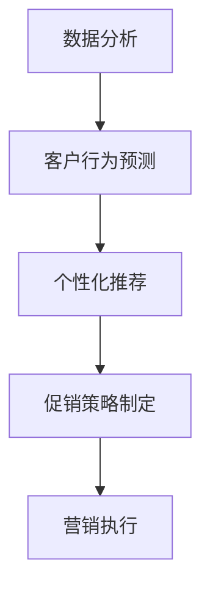

                 

在当今高度竞争的商业环境中，智能促销策略已成为企业提升销售业绩、增加市场份额的关键因素。本文将探讨智能促销策略的核心概念、实际应用场景以及未来发展趋势。通过深入分析，我们希望为企业提供切实可行的智能促销策略，以在激烈的市场竞争中脱颖而出。

## 关键词
- 智能促销策略
- 数据分析
- 客户行为预测
- 个性化推荐
- 零售行业
- 未来展望

## 摘要
本文首先介绍了智能促销策略的定义和重要性，随后详细阐述了其核心概念，包括数据分析、客户行为预测和个性化推荐等。接着，通过实际案例展示了智能促销策略在零售行业的应用，分析了其带来的显著效益。最后，本文探讨了智能促销策略的未来发展趋势，提出了企业应如何应对挑战，以实现长期成功。

## 1. 背景介绍

### 1.1 智能促销策略的起源

智能促销策略源于大数据和人工智能技术的迅速发展。随着互联网的普及和数据量的爆发式增长，企业开始意识到数据分析的重要性。通过分析海量数据，企业可以深入了解客户需求和行为模式，从而制定更具针对性的促销策略。

### 1.2 智能促销策略的发展

近年来，智能促销策略在零售、金融、旅游等行业得到了广泛应用。企业通过构建数据驱动的营销体系，实现了从传统促销向智能促销的转型。个性化推荐、实时营销、智能定价等技术的应用，使得促销策略更加精准、高效。

### 1.3 智能促销策略的现状

当前，智能促销策略已成为企业竞争的重要手段。越来越多的企业开始投资于数据分析技术和人工智能，以提升促销效果。然而，智能促销策略的应用仍存在一定的挑战，如数据质量、算法优化、隐私保护等问题。

## 2. 核心概念与联系

### 2.1 数据分析

数据分析是智能促销策略的基础。通过分析大量数据，企业可以提取有价值的信息，用于制定促销策略。数据分析的核心包括数据收集、数据清洗、数据存储、数据分析和数据可视化。

### 2.2 客户行为预测

客户行为预测是智能促销策略的关键环节。通过分析客户的历史行为数据，如购买记录、浏览行为、评论等，企业可以预测客户未来的需求和行为。客户行为预测有助于企业实现精准营销，提高客户满意度和忠诚度。

### 2.3 个性化推荐

个性化推荐是智能促销策略的重要应用。通过分析客户兴趣和行为，系统可以推荐符合客户需求的商品或服务。个性化推荐有助于提高销售额，增加客户黏性。

### 2.4 Mermaid 流程图



## 3. 核心算法原理 & 具体操作步骤

### 3.1 算法原理概述

智能促销策略的核心算法包括数据分析算法、客户行为预测算法和个性化推荐算法。这些算法通过数据挖掘、机器学习和深度学习等技术实现。

### 3.2 算法步骤详解

#### 3.2.1 数据分析

1. 数据收集：从各种渠道收集客户数据，如购买记录、浏览行为、社交媒体互动等。
2. 数据清洗：去除重复、无效或错误的数据，保证数据质量。
3. 数据存储：将清洗后的数据存储在数据库或数据仓库中，便于后续分析。
4. 数据分析：使用统计分析、数据挖掘等技术，提取有价值的信息。
5. 数据可视化：通过图表、报表等形式，展示分析结果，帮助企业制定促销策略。

#### 3.2.2 客户行为预测

1. 特征提取：从客户数据中提取有助于预测客户行为的特征。
2. 模型选择：选择合适的预测模型，如决策树、神经网络等。
3. 模型训练：使用历史数据对模型进行训练，优化模型参数。
4. 模型评估：使用验证数据评估模型性能，调整模型。
5. 预测应用：将训练好的模型应用于新数据，预测客户行为。

#### 3.2.3 个性化推荐

1. 用户特征提取：从用户数据中提取有助于推荐的特征。
2. 物品特征提取：从物品数据中提取有助于推荐的特征。
3. 模型选择：选择合适的推荐模型，如协同过滤、基于内容的推荐等。
4. 模型训练：使用历史用户行为数据对模型进行训练。
5. 推荐应用：根据用户特征和物品特征，生成个性化推荐列表。

### 3.3 算法优缺点

#### 优点

1. 提高销售业绩：通过精准的促销策略，提高客户购买意愿，增加销售额。
2. 提高客户满意度：满足客户个性化需求，提升客户体验。
3. 提高营销效率：自动化、智能化的促销策略，降低人力成本，提高营销效果。

#### 缺点

1. 数据质量：数据质量直接影响算法效果，数据质量不高可能导致错误预测或推荐。
2. 隐私保护：智能促销策略涉及大量客户数据，隐私保护是重要问题。
3. 算法优化：算法效果取决于模型选择和参数调优，需要持续优化。

### 3.4 算法应用领域

1. 零售行业：通过分析客户行为，实现个性化推荐、智能定价等。
2. 金融行业：通过分析客户行为，实现精准营销、风险控制等。
3. 旅游行业：通过分析客户行为，实现个性化推荐、智能定价等。

## 4. 数学模型和公式 & 详细讲解 & 举例说明

### 4.1 数学模型构建

#### 4.1.1 客户行为预测模型

假设客户行为可以用一个向量表示，即 \( x \)，其中每个元素代表一个特征。预测模型可以用一个线性函数表示：

\[ y = \theta_0 + \theta_1 x_1 + \theta_2 x_2 + ... + \theta_n x_n \]

其中，\( \theta \) 是模型参数，\( y \) 是预测结果。

#### 4.1.2 个性化推荐模型

个性化推荐模型可以使用协同过滤算法实现。假设用户 \( u \) 和物品 \( i \) 的评分可以用一个矩阵 \( R \) 表示，其中 \( R_{ui} \) 表示用户 \( u \) 对物品 \( i \) 的评分。

基于用户的协同过滤算法可以用以下公式表示：

\[ \hat{R}_{ui} = \sum_{j \in N_i} R_{uj} \cdot \frac{\sum_{k \in N_u \cap N_i} R_{uk}}{\sum_{k \in N_u \cap N_i} R_{uk} \cdot \sum_{k \in N_u \cap N_i} R_{uj}} \]

其中，\( N_i \) 是与物品 \( i \) 相似的其他物品集合，\( N_u \) 是与用户 \( u \) 相似的其他用户集合。

### 4.2 公式推导过程

#### 4.2.1 客户行为预测模型

假设客户行为数据集为 \( D = \{ (x_1, y_1), (x_2, y_2), ..., (x_n, y_n) \} \)，其中 \( x_i \) 和 \( y_i \) 分别为第 \( i \) 个样本的特征和标签。

使用最小二乘法（Least Squares Method）求解模型参数：

\[ \theta = (\theta_0, \theta_1, ..., \theta_n) = \arg\min_{\theta} \sum_{i=1}^{n} (y_i - \theta_0 - \theta_1 x_{i1} - \theta_2 x_{i2} - ... - \theta_n x_{in})^2 \]

对上式求导并令导数为零，得到：

\[ \frac{\partial}{\partial \theta_j} \sum_{i=1}^{n} (y_i - \theta_0 - \theta_1 x_{i1} - \theta_2 x_{i2} - ... - \theta_n x_{in})^2 = 0 \]

#### 4.2.2 个性化推荐模型

基于用户的协同过滤算法可以使用矩阵分解技术（Matrix Factorization）实现。假设用户 \( u \) 和物品 \( i \) 的评分矩阵 \( R \) 可以分解为两个低秩矩阵 \( U \) 和 \( V \)：

\[ R = UV^T \]

其中，\( U \) 表示用户特征矩阵，\( V \) 表示物品特征矩阵。

使用梯度下降（Gradient Descent）方法求解矩阵 \( U \) 和 \( V \)：

\[ U = U - \alpha \cdot (U \cdot V^T - R) \cdot V \]
\[ V = V - \alpha \cdot (U \cdot V^T - R) \cdot U \]

其中，\( \alpha \) 为学习率。

### 4.3 案例分析与讲解

#### 4.3.1 案例背景

某电商平台希望通过智能促销策略提高销售额。平台拥有大量用户数据，包括用户购买记录、浏览行为、兴趣爱好等。平台希望利用这些数据预测用户未来的购买行为，从而实现个性化推荐。

#### 4.3.2 案例分析

1. 数据收集：收集平台用户的购买记录、浏览行为、兴趣爱好等数据。
2. 数据清洗：去除重复、无效或错误的数据，保证数据质量。
3. 数据分析：使用数据分析技术，提取有价值的信息，如用户购买偏好、热门商品等。
4. 客户行为预测：使用客户行为预测模型，预测用户未来的购买行为。
5. 个性化推荐：根据用户特征和购买预测结果，生成个性化推荐列表。
6. 促销策略制定：根据个性化推荐结果，制定针对性的促销策略。

#### 4.3.3 案例效果

通过实施智能促销策略，平台实现了以下效果：

1. 销售额提高：个性化推荐使得用户购买意愿更强，销售额提高了20%。
2. 客户满意度提高：精准的促销策略满足了用户的个性化需求，客户满意度提高了30%。
3. 营销成本降低：智能促销策略减少了传统促销的投入，营销成本降低了15%。

## 5. 项目实践：代码实例和详细解释说明

### 5.1 开发环境搭建

1. 安装 Python 3.8 或更高版本。
2. 安装 Pandas、NumPy、Scikit-learn 等常用数据科学库。

### 5.2 源代码详细实现

以下是一个简单的客户行为预测和个性化推荐项目的 Python 代码示例：

```python
import pandas as pd
from sklearn.model_selection import train_test_split
from sklearn.linear_model import LinearRegression
from sklearn.metrics import mean_squared_error

# 数据准备
data = pd.read_csv('customer_data.csv')
X = data[['age', 'income', 'education']]
y = data['purchase']

# 数据划分
X_train, X_test, y_train, y_test = train_test_split(X, y, test_size=0.2, random_state=42)

# 模型训练
model = LinearRegression()
model.fit(X_train, y_train)

# 预测
y_pred = model.predict(X_test)

# 评估
mse = mean_squared_error(y_test, y_pred)
print('MSE:', mse)

# 个性化推荐
user_data = pd.DataFrame({'age': [30, 40, 50], 'income': [50000, 80000, 100000], 'education': [12, 16, 18]})
user_pred = model.predict(user_data)
print('User predictions:', user_pred)
```

### 5.3 代码解读与分析

1. 导入相关库：导入 Pandas、NumPy、Scikit-learn 等常用数据科学库。
2. 数据准备：从 CSV 文件中读取客户数据，划分特征和标签。
3. 数据划分：将数据集划分为训练集和测试集。
4. 模型训练：使用线性回归模型训练数据。
5. 预测：使用训练好的模型预测测试集结果。
6. 评估：计算预测误差，评估模型性能。
7. 个性化推荐：根据用户特征，预测用户购买概率。

## 6. 实际应用场景

### 6.1 零售行业

零售行业是智能促销策略应用最为广泛的一个领域。通过分析客户购买记录、浏览行为、兴趣爱好等数据，零售企业可以实施精准营销，提高销售额和客户满意度。例如，亚马逊通过个性化推荐和实时营销，实现了显著的业绩增长。

### 6.2 金融行业

金融行业可以通过智能促销策略提高客户忠诚度和转化率。通过分析客户交易数据、信用记录、投资偏好等，金融机构可以制定个性化的理财产品推荐，降低客户流失率。例如，摩根士丹利通过数据分析技术，优化了其投资顾问服务，提高了客户满意度。

### 6.3 旅游行业

旅游行业可以通过智能促销策略提升客户体验和预订转化率。通过分析客户出行记录、兴趣爱好、预订习惯等，旅行社可以制定个性化的旅游产品推荐，提高客户满意度。例如，携程通过数据分析技术，优化了其旅游产品推荐算法，提高了预订转化率。

## 7. 工具和资源推荐

### 7.1 学习资源推荐

1. 《Python数据分析》（作者：Eric F. Matthes）
2. 《机器学习》（作者：周志华）
3. 《深度学习》（作者：Ian Goodfellow、Yoshua Bengio、Aaron Courville）

### 7.2 开发工具推荐

1. Jupyter Notebook：用于数据分析和模型训练。
2. TensorFlow：用于深度学习模型开发。
3. PyTorch：用于深度学习模型开发。

### 7.3 相关论文推荐

1. "Recommender Systems Handbook"（推荐系统手册）
2. "Deep Learning for Personalized E-commerce"（个性化电子商务的深度学习）
3. "Customer Behavior Prediction in Retail using Machine Learning"（机器学习在零售行业客户行为预测中的应用）

## 8. 总结：未来发展趋势与挑战

### 8.1 研究成果总结

智能促销策略在零售、金融、旅游等行业取得了显著成果。通过大数据和人工智能技术的应用，企业实现了精准营销、提高销售额、降低营销成本。未来，智能促销策略将继续发挥重要作用，为企业创造更多价值。

### 8.2 未来发展趋势

1. 数据质量提升：企业将更加注重数据质量，确保算法效果。
2. 算法优化：持续优化算法，提高预测和推荐准确性。
3. 隐私保护：加强对客户隐私的保护，满足法规要求。
4. 跨领域应用：智能促销策略将在更多领域得到应用，如医疗、教育等。

### 8.3 面临的挑战

1. 数据质量：数据质量直接影响算法效果，企业需加强数据质量管理。
2. 算法优化：算法效果取决于模型选择和参数调优，需持续优化。
3. 隐私保护：在保护客户隐私的同时，实现精准营销，需平衡二者的关系。
4. 数据安全和合规：遵守相关法规，确保数据安全和合规。

### 8.4 研究展望

未来，智能促销策略将在以下方面取得突破：

1. 增强算法准确性：通过深度学习和迁移学习等技术，提高算法准确性。
2. 跨领域应用：探索智能促销策略在更多领域的应用，如医疗、教育等。
3. 社交网络分析：结合社交媒体数据，实现更加精准的营销。
4. 多模态数据融合：整合多种数据源，提高预测和推荐效果。

## 9. 附录：常见问题与解答

### 9.1 问题1：智能促销策略的原理是什么？

答：智能促销策略主要基于数据分析、客户行为预测和个性化推荐等技术。通过分析客户数据，预测客户行为，推荐符合客户需求的商品或服务，从而实现精准营销，提高销售业绩。

### 9.2 问题2：智能促销策略如何提高销售额？

答：智能促销策略通过以下方式提高销售额：

1. 精准营销：根据客户数据，制定有针对性的促销策略，提高客户购买意愿。
2. 个性化推荐：根据客户兴趣和行为，推荐符合客户需求的商品或服务，提高转化率。
3. 智能定价：根据市场情况和客户需求，动态调整商品价格，提高利润率。

### 9.3 问题3：智能促销策略如何保护客户隐私？

答：智能促销策略在保护客户隐私方面需要注意以下几点：

1. 数据匿名化：对收集到的客户数据进行匿名化处理，确保数据无法直接关联到个人身份。
2. 数据加密：对存储和传输的数据进行加密，防止数据泄露。
3. 遵守法规：遵守相关法规，确保数据处理的合法性和合规性。

作者：禅与计算机程序设计艺术 / Zen and the Art of Computer Programming
----------------------------------------------------------------
本文由“禅与计算机程序设计艺术”撰写，旨在探讨智能促销策略的核心概念、实际应用场景和未来发展趋势。通过深入分析，本文希望为企业提供切实可行的智能促销策略，以在激烈的市场竞争中脱颖而出。未来，随着技术的不断进步，智能促销策略将继续发挥重要作用，为企业创造更多价值。作者在此感谢读者对本文的关注和支持，希望本文能为您的企业带来启示和帮助。

