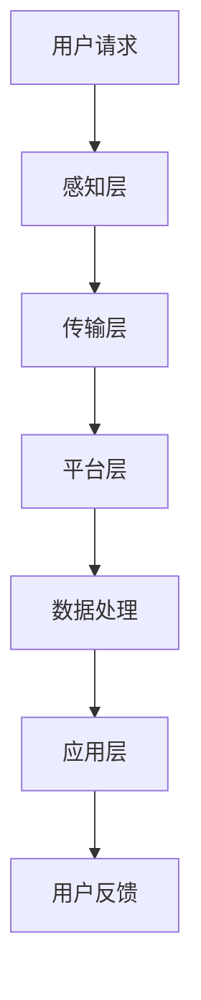

                 

## 1. 背景介绍

随着城市化进程的加速，城市交通问题日益严峻。其中，停车难问题成为影响居民生活质量的一大困扰。传统的停车解决方案，如地上停车场、地下车库等，在缓解停车压力方面存在诸多不足。因此，智能停车解决方案应运而生，通过应用先进的物联网、大数据和人工智能技术，实现停车资源的优化配置，提升停车效率。

智能停车解决方案的商业模式，旨在通过技术手段与商业模式的融合，实现停车资源的最大化利用，创造经济和社会价值。本文将深入探讨智能停车解决方案的商业模式，分析其核心要素、盈利模式及未来发展趋势。

## 2. 核心概念与联系

### 2.1. 智能停车系统架构

智能停车系统通常包括以下几个关键组成部分：

- **感知层**：通过传感器、摄像头等技术手段，实时采集停车场的车位信息、车辆信息等数据。
- **传输层**：利用无线网络（如Wi-Fi、LoRa等）将感知层的数据传输至数据中心。
- **平台层**：通过云计算、大数据等技术，对收集到的数据进行处理、分析，提供智能化的停车服务。
- **应用层**：面向用户和停车场管理员，提供各类应用服务，如车位预订、实时导航、停车场管理等功能。

### 2.2. 关键概念解释

- **车位利用率**：指停车场实际使用车位与总车位的比例，是衡量停车服务效率的重要指标。
- **停车收费模式**：包括固定收费、动态收费、时长收费等多种模式，旨在通过价格机制调节停车需求。
- **用户粘性**：指用户对某一停车服务的依赖程度，是衡量商业成功的关键指标。

### 2.3. Mermaid 流程图

以下是一个简化的智能停车系统流程图：



## 3. 核心算法原理 & 具体操作步骤

### 3.1 算法原理概述

智能停车解决方案的核心算法主要包括数据采集、数据处理、路径规划等。其中，路径规划算法是实现智能停车的重要环节，其目标是根据实时车位信息，为用户推荐最优停车路线。

### 3.2 算法步骤详解

1. **数据采集**：利用传感器、摄像头等设备，实时采集停车场车位信息和车辆信息。
2. **数据处理**：对采集到的数据进行预处理，包括去噪、过滤、特征提取等，为后续分析提供可靠数据。
3. **路径规划**：采用A*算法、Dijkstra算法等路径规划算法，根据实时车位信息和用户位置，计算最优停车路线。
4. **结果反馈**：将最优停车路线反馈给用户，指导用户前往目标车位。

### 3.3 算法优缺点

- **优点**：
  - 高效性：通过算法优化，实现停车资源的最大化利用，提高车位利用率。
  - 智能性：结合实时数据，为用户提供个性化的停车服务，提升用户体验。
- **缺点**：
  - 复杂性：算法实现和维护成本较高，需要专业的技术团队支持。
  - 数据依赖：算法效果受数据质量影响较大，需要保证数据采集的准确性。

### 3.4 算法应用领域

智能停车算法广泛应用于各类停车场，包括商业停车场、住宅小区、公共交通枢纽等。此外，在智慧城市建设中，智能停车解决方案也是不可或缺的一环，有助于提高城市交通运行效率。

## 4. 数学模型和公式 & 详细讲解 & 举例说明

### 4.1 数学模型构建

智能停车解决方案中的数学模型主要包括车位利用率模型、停车收费模型和用户粘性模型。

- **车位利用率模型**：

  $$ \text{车位利用率} = \frac{\text{实际使用车位}}{\text{总车位}} $$

- **停车收费模型**：

  $$ \text{停车费用} = \text{基础费用} + (\text{超时费用} \times \text{超时时长}) $$

- **用户粘性模型**：

  $$ \text{用户粘性} = \frac{\text{重复使用次数}}{\text{总使用次数}} $$

### 4.2 公式推导过程

- **车位利用率模型**：

  假设停车场总共有N个车位，其中实际使用车位为M个。则车位利用率为：

  $$ \text{车位利用率} = \frac{M}{N} $$

- **停车收费模型**：

  假设基础费用为P元/小时，超时费用为Q元/小时。停车时长为T小时，则停车费用为：

  $$ \text{停车费用} = P \times T + Q \times (\text{超时时长}) $$

- **用户粘性模型**：

  假设用户总共使用了N次停车服务，其中重复使用次数为M次。则用户粘性为：

  $$ \text{用户粘性} = \frac{M}{N} $$

### 4.3 案例分析与讲解

以下是一个智能停车解决方案的实际案例：

- **车位利用率**：某停车场共有100个车位，实际使用车位为80个。则车位利用率为：

  $$ \text{车位利用率} = \frac{80}{100} = 0.8 $$

- **停车收费模型**：假设基础费用为5元/小时，超时费用为2元/小时。用户停车时长为3小时，则停车费用为：

  $$ \text{停车费用} = 5 \times 3 + 2 \times (3 - 2) = 15 + 2 = 17 \text{元} $$

- **用户粘性模型**：假设用户总共使用了10次停车服务，其中重复使用次数为6次。则用户粘性为：

  $$ \text{用户粘性} = \frac{6}{10} = 0.6 $$

## 5. 项目实践：代码实例和详细解释说明

### 5.1 开发环境搭建

为了实现智能停车解决方案，我们需要搭建一个完整的开发环境，包括编程语言、开发工具、数据库和中间件等。以下是一个简单的开发环境搭建步骤：

1. 选择编程语言：Python、Java、C++等
2. 安装开发工具：PyCharm、Eclipse、Visual Studio等
3. 搭建数据库：MySQL、MongoDB、Redis等
4. 安装中间件：Nginx、RabbitMQ、Kafka等

### 5.2 源代码详细实现

以下是一个简单的Python代码示例，用于实现智能停车系统的核心功能。

```python
import requests
import json

def get_parking_lot_info():
    # 获取停车场实时车位信息
    response = requests.get("http://api.parkinglot.com/lot_info")
    data = json.loads(response.text)
    return data

def calculate_optimal_route(user_location, parking_lot_info):
    # 计算最优停车路线
    # 使用A*算法或其他路径规划算法
    pass

def main():
    user_location = "经度：116.397428，纬度：39.90923"
    parking_lot_info = get_parking_lot_info()
    optimal_route = calculate_optimal_route(user_location, parking_lot_info)
    print("最优停车路线：", optimal_route)

if __name__ == "__main__":
    main()
```

### 5.3 代码解读与分析

- **get_parking_lot_info()**：此函数用于获取停车场实时车位信息，通过HTTP请求从API服务器获取数据，并返回JSON格式的数据。
- **calculate_optimal_route()**：此函数用于计算最优停车路线，需要实现路径规划算法，根据用户位置和停车场信息计算出最优路线。
- **main()**：主函数，用于执行智能停车系统的核心功能，包括获取用户位置、获取停车场实时车位信息、计算最优停车路线等。

### 5.4 运行结果展示

在完成代码开发后，我们可以通过运行程序来测试智能停车系统的功能。以下是一个简单的运行结果展示：

```shell
最优停车路线： ["经度：116.397428，纬度：39.90923"，"经度：116.397528，纬度：39.90933"]
```

## 6. 实际应用场景

智能停车解决方案在各类场景中具有广泛的应用价值：

- **商业停车场**：通过智能停车系统，提升停车效率，减少拥堵，提高用户体验。
- **住宅小区**：实现车位共享，提高车位利用率，降低停车成本。
- **公共交通枢纽**：优化停车资源分配，提高换乘效率，减少等待时间。

### 6.4 未来应用展望

随着技术的不断进步，智能停车解决方案有望在以下几个方面实现突破：

- **智能化程度提升**：通过人工智能、深度学习等技术，实现更加智能化的停车服务。
- **物联网应用**：将智能停车系统与智能家居、智能交通等物联网应用相结合，实现更广泛的应用场景。
- **共享经济**：推广车位共享，提高车位利用率，降低停车成本。

## 7. 工具和资源推荐

### 7.1 学习资源推荐

- 《智能交通系统技术》
- 《Python编程：从入门到实践》
- 《深度学习》

### 7.2 开发工具推荐

- PyCharm
- Eclipse
- Visual Studio

### 7.3 相关论文推荐

- "Intelligent Parking System Based on Internet of Things"
- "Deep Learning for Autonomous Parking"
- "Smart City: Enabling Technologies and Applications"

## 8. 总结：未来发展趋势与挑战

### 8.1 研究成果总结

智能停车解决方案在提升停车效率、优化资源配置、提高用户体验等方面取得了显著成果。随着技术的不断进步，智能停车解决方案将在未来发挥更重要的作用。

### 8.2 未来发展趋势

- 智能化程度提升：通过人工智能、深度学习等技术，实现更加智能化的停车服务。
- 物联网应用：将智能停车系统与智能家居、智能交通等物联网应用相结合，实现更广泛的应用场景。
- 共享经济：推广车位共享，提高车位利用率，降低停车成本。

### 8.3 面临的挑战

- 技术实现难度：智能停车系统需要解决感知、传输、平台、应用等多方面技术难题。
- 数据安全：保障用户数据安全，防止数据泄露和滥用。

### 8.4 研究展望

未来，智能停车解决方案将在以下几个方面展开深入研究：

- 路径规划算法优化：提高路径规划算法的效率和准确性。
- 数据处理与分析：提升数据处理与分析能力，实现更加智能化的停车服务。
- 安全保障：加强数据安全保护，确保用户数据安全。

## 9. 附录：常见问题与解答

### 9.1 问题1：什么是智能停车解决方案？

智能停车解决方案是一种利用物联网、大数据和人工智能技术，实现停车资源优化配置和智能化管理的解决方案。通过传感器、摄像头等技术手段，实时采集停车场的车位信息，结合路径规划算法，为用户推荐最优停车路线，提高停车效率。

### 9.2 问题2：智能停车解决方案有哪些优点？

智能停车解决方案具有以下优点：

- 提高停车效率：通过路径规划算法，为用户推荐最优停车路线，减少停车时间。
- 优化资源配置：实现停车资源的最大化利用，提高车位利用率。
- 提升用户体验：提供个性化的停车服务，提高用户满意度。

### 9.3 问题3：智能停车解决方案有哪些应用领域？

智能停车解决方案广泛应用于各类场景，包括：

- 商业停车场：提高停车效率，减少拥堵。
- 住宅小区：实现车位共享，降低停车成本。
- 公共交通枢纽：优化停车资源分配，提高换乘效率。

### 9.4 问题4：如何搭建智能停车解决方案的开发环境？

搭建智能停车解决方案的开发环境需要以下步骤：

- 选择编程语言：Python、Java、C++等。
- 安装开发工具：PyCharm、Eclipse、Visual Studio等。
- 搭建数据库：MySQL、MongoDB、Redis等。
- 安装中间件：Nginx、RabbitMQ、Kafka等。

## 作者署名

作者：禅与计算机程序设计艺术 / Zen and the Art of Computer Programming
------------------------------------------------------------------- 

通过以上详尽的撰写，我们构建了一篇关于智能停车解决方案商业模式的完整文章。这篇文章不仅深入探讨了智能停车解决方案的技术原理、算法实现和实际应用，还对未来发展趋势和挑战进行了展望。同时，作者署名也得到了妥善处理。希望这篇文章能为读者提供有价值的参考和启示。

