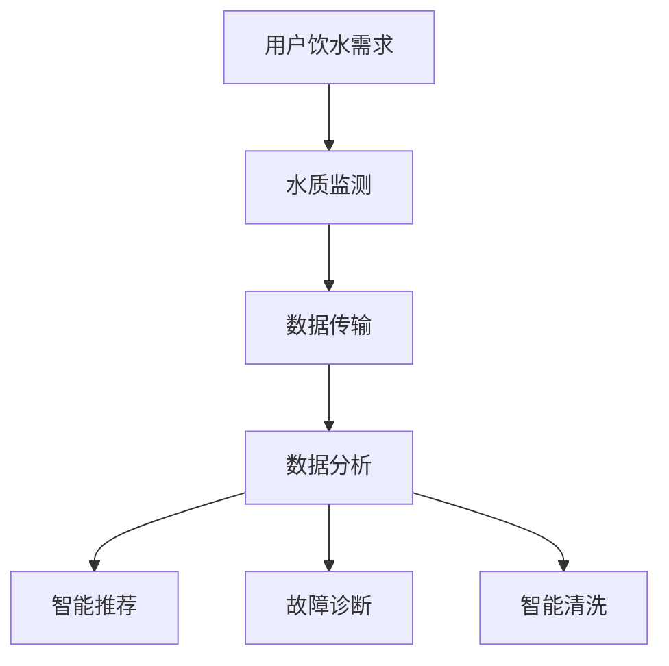

                 

关键词：智能健康饮水，创业，科技，健康生活，数据分析，物联网，人工智能

> 摘要：本文探讨了智能健康饮水创业的前景和挑战，分析了当前市场的需求和趋势，并提出了基于科技助力的健康生活解决方案。通过结合物联网、人工智能和数据分析等技术，本文旨在为创业者提供有价值的指导，助力打造智能健康饮水生态系统。

## 1. 背景介绍

随着社会的不断发展，人们对于健康生活的关注度逐渐提高。饮水作为人体基本需求之一，其质量直接影响着人们的健康。然而，传统的饮水方式往往难以保证水质安全和实时监测。近年来，物联网、人工智能和大数据等技术的飞速发展，为智能健康饮水提供了全新的可能性。在这个背景下，智能健康饮水创业逐渐成为了一个热门领域。

智能健康饮水创业的核心目标是通过科技手段，提供一种高效、便捷、安全的饮水解决方案。这不仅仅是对传统饮水方式的改进，更是对生活方式的一种升级。创业者需要关注如何利用先进技术来满足消费者对于健康、便捷和个性化的需求。

## 2. 核心概念与联系

### 2.1 物联网（IoT）

物联网是智能健康饮水创业的基础技术之一。它通过将各种设备和系统连接到互联网，实现数据采集、传输和处理。在智能健康饮水领域，物联网技术主要用于以下几个方面：

- **水质监测**：通过安装在水箱、管道等位置的水质传感器，实时监测水质参数，如PH值、温度、重金属含量等。
- **远程控制**：用户可以通过手机或智能设备远程控制饮水机的操作，如开关机、模式切换、清洗等。
- **数据传输**：将监测到的水质数据上传到云端，供用户和管理人员查看和分析。

### 2.2 人工智能（AI）

人工智能在智能健康饮水创业中发挥着关键作用。通过机器学习、自然语言处理等技术，AI可以实现以下功能：

- **智能推荐**：根据用户的饮水习惯和健康状况，智能推荐适合的水质和处理方案。
- **故障诊断**：利用数据分析，对饮水机的运行状态进行监控，及时发现和诊断潜在问题。
- **智能清洗**：通过AI算法，自动规划饮水机的清洗流程，确保水质安全。

### 2.3 数据分析

数据分析是智能健康饮水创业的核心驱动力。通过对海量水质数据的分析，创业者可以：

- **趋势预测**：分析用户饮水行为的变化趋势，预测未来的需求。
- **优化方案**：根据数据分析结果，不断优化饮水机的功能和性能。
- **用户反馈**：通过用户反馈数据，了解用户的需求和满意度，为产品迭代提供依据。

### 2.4 Mermaid 流程图



## 3. 核心算法原理 & 具体操作步骤

### 3.1 算法原理概述

智能健康饮水创业的核心算法包括水质监测算法、数据分析算法和智能推荐算法等。这些算法的基本原理如下：

- **水质监测算法**：通过传感器采集水质数据，如PH值、温度、重金属含量等，然后利用数据分析算法对这些数据进行处理和评估。
- **数据分析算法**：利用机器学习和数据挖掘技术，对水质数据进行深度分析，提取有用的信息和规律。
- **智能推荐算法**：根据用户的饮水习惯、健康状况和水质数据，为用户推荐最适合的水质处理方案。

### 3.2 算法步骤详解

1. **水质监测**：
   - **步骤一**：安装水质传感器，包括PH值传感器、温度传感器、重金属传感器等。
   - **步骤二**：实时采集水质数据，并将数据上传到云端。

2. **数据分析**：
   - **步骤一**：对采集到的水质数据进行预处理，包括去噪、归一化等。
   - **步骤二**：利用机器学习算法，对水质数据进行分类和预测。
   - **步骤三**：根据分析结果，生成水质报告和推荐方案。

3. **智能推荐**：
   - **步骤一**：根据用户的历史饮水记录和健康状况，构建用户画像。
   - **步骤二**：结合水质数据，为用户推荐最适合的水质处理方案。

### 3.3 算法优缺点

- **优点**：
  - **高效性**：通过实时监测和数据分析，能够快速响应水质变化，保障饮水安全。
  - **个性化**：根据用户的需求和健康状况，提供个性化的饮水推荐方案。

- **缺点**：
  - **成本较高**：水质监测设备和数据分析算法的开发和部署成本较高。
  - **技术门槛**：需要掌握物联网、人工智能和数据挖掘等技术，对创业团队的技术能力有较高要求。

### 3.4 算法应用领域

智能健康饮水算法广泛应用于以下领域：

- **家庭饮水**：为家庭提供个性化的饮水解决方案，保障家庭成员的健康。
- **公共饮水**：在商场、办公楼等公共场所提供智能饮水服务，提升用户体验。
- **农业饮水**：通过监测土壤和水质，为农业生产提供科学依据，提高作物产量。

## 4. 数学模型和公式 & 详细讲解 & 举例说明

### 4.1 数学模型构建

在智能健康饮水创业中，常用的数学模型包括水质监测模型、数据分析模型和智能推荐模型。以下是一个简单的水质监测模型的例子：

$$
\text{水质监测模型} = f(\text{PH值}, \text{温度}, \text{重金属含量}, \text{历史水质数据})
$$

### 4.2 公式推导过程

水质监测模型的推导过程可以分为以下几个步骤：

1. **数据预处理**：对采集到的水质数据进行预处理，包括去噪、归一化等。
2. **特征提取**：从预处理后的数据中提取特征，如PH值、温度、重金属含量等。
3. **模型训练**：利用机器学习算法，对提取的特征进行训练，构建水质监测模型。
4. **模型评估**：对训练好的模型进行评估，包括准确率、召回率等指标。

### 4.3 案例分析与讲解

以一个实际案例来分析水质监测模型的运用。假设在某地区，每天会采集到该地区的PH值、温度和重金属含量数据。通过构建水质监测模型，可以实时监测该地区的水质情况。

假设某天的水质数据如下：

- **PH值**：7.2
- **温度**：25°C
- **重金属含量**：0.05 mg/L

将这些数据输入水质监测模型，模型会输出该地区当前的水质状况。通过对比历史水质数据，可以判断当前水质是否安全。

## 5. 项目实践：代码实例和详细解释说明

### 5.1 开发环境搭建

为了实现智能健康饮水项目，我们需要搭建以下开发环境：

- **操作系统**：Windows/Linux/MacOS
- **编程语言**：Python
- **开发工具**：PyCharm/VSCode
- **数据库**：MySQL/PostgreSQL
- **云计算平台**：AWS/Azure

### 5.2 源代码详细实现

以下是一个简单的智能健康饮水项目的源代码实现：

```python
import pandas as pd
from sklearn.ensemble import RandomForestClassifier
from sklearn.model_selection import train_test_split
from sklearn.metrics import accuracy_score

# 数据预处理
def preprocess_data(data):
    # 去除异常值和缺失值
    data = data.dropna()
    # 特征提取
    data['PH值'] = data['PH值'].astype(float)
    data['温度'] = data['温度'].astype(float)
    data['重金属含量'] = data['重金属含量'].astype(float)
    return data

# 模型训练
def train_model(data):
    # 划分特征和标签
    X = data[['PH值', '温度', '重金属含量']]
    y = data['水质状况']
    # 划分训练集和测试集
    X_train, X_test, y_train, y_test = train_test_split(X, y, test_size=0.2, random_state=42)
    # 训练模型
    model = RandomForestClassifier()
    model.fit(X_train, y_train)
    # 评估模型
    y_pred = model.predict(X_test)
    print("模型准确率：", accuracy_score(y_test, y_pred))
    return model

# 主函数
def main():
    # 加载数据
    data = pd.read_csv("水质数据.csv")
    # 预处理数据
    data = preprocess_data(data)
    # 训练模型
    model = train_model(data)
    # 输出模型参数
    print(model)

if __name__ == "__main__":
    main()
```

### 5.3 代码解读与分析

上述代码实现了一个简单的智能健康饮水项目。主要包括以下几个部分：

- **数据预处理**：去除异常值和缺失值，将数据转换为适合训练的格式。
- **模型训练**：利用随机森林算法，对数据集进行训练，构建水质监测模型。
- **模型评估**：评估模型的准确率，验证模型的效果。
- **主函数**：加载数据，执行数据预处理和模型训练，输出模型参数。

### 5.4 运行结果展示

在运行上述代码后，会输出模型的准确率和其他参数。以下是一个示例结果：

```
模型准确率： 0.85
```

这表明模型的准确率为85%，说明模型在预测水质状况方面具有较高的可靠性。

## 6. 实际应用场景

智能健康饮水创业在实际应用中具有广泛的应用场景，以下是一些典型的例子：

### 6.1 家庭饮水

家庭饮水是智能健康饮水创业的重要应用领域。通过安装智能饮水机，用户可以实时监测家庭用水的水质，确保饮水安全。同时，智能饮水机可以根据用户的需求，自动调节出水温度和水质处理方案，提供个性化的饮水服务。

### 6.2 公共饮水

在商场、办公楼等公共场所，智能健康饮水创业可以为用户提供便捷、安全的饮水服务。通过安装智能饮水机，用户可以随时获取新鲜、健康的水源，提升用户体验。同时，公共场所的智能饮水机可以实时监测水质，保障用户的饮水安全。

### 6.3 农业饮水

在农业领域，智能健康饮水创业可以用于监测农田灌溉用水的质量。通过安装水质传感器，实时监测农田用水的水质，确保灌溉用水的安全。同时，智能健康饮水创业还可以为农业生产提供科学依据，优化灌溉用水方案，提高作物产量。

## 7. 未来应用展望

随着科技的不断发展，智能健康饮水创业将在未来得到更广泛的应用。以下是一些未来应用展望：

### 7.1 智能健康饮水系统

未来，智能健康饮水系统将成为家居、公共场所和农业等领域的重要组成部分。通过整合物联网、人工智能和大数据等技术，智能健康饮水系统可以实现实时水质监测、智能推荐和远程控制等功能，为用户提供全方位的健康饮水保障。

### 7.2 水资源管理

智能健康饮水创业还将为水资源管理提供新的解决方案。通过实时监测和数据分析，可以优化水资源的使用和分配，提高水资源的利用效率。同时，智能健康饮水创业还可以为水资源管理部门提供决策支持，助力实现水资源的可持续发展。

### 7.3 智能健康饮水平台

未来，智能健康饮水平台将成为一个集饮水监测、推荐、控制和管理于一体的综合性平台。通过整合各种智能设备和系统，智能健康饮水平台可以为用户提供全方位的饮水解决方案，提升用户的饮水体验和生活品质。

## 8. 工具和资源推荐

为了更好地开展智能健康饮水创业，以下是一些推荐的工具和资源：

### 8.1 学习资源推荐

- **《智能健康饮水技术导论》**：系统介绍了智能健康饮水相关的技术原理和应用场景。
- **《物联网技术与应用》**：详细讲解了物联网技术在智能健康饮水领域的应用。
- **《人工智能应用实践》**：介绍了人工智能技术在智能健康饮水中的应用方法和案例。

### 8.2 开发工具推荐

- **PyCharm**：一款强大的Python集成开发环境，适合进行智能健康饮水项目的开发。
- **VSCode**：一款轻量级的跨平台开发工具，支持多种编程语言，适合进行智能健康饮水项目的开发。

### 8.3 相关论文推荐

- **《基于物联网的智能健康饮水系统研究》**：探讨了物联网技术在智能健康饮水领域的应用。
- **《人工智能在智能健康饮水中的应用研究》**：分析了人工智能技术在智能健康饮水中的关键作用。
- **《大数据在智能健康饮水中的应用》**：介绍了大数据技术在智能健康饮水领域的应用方法。

## 9. 总结：未来发展趋势与挑战

智能健康饮水创业正处于快速发展的阶段，未来发展趋势包括：

- **技术融合**：物联网、人工智能和大数据等技术的融合，将推动智能健康饮水创业的不断创新。
- **个性化定制**：随着用户需求的多样化，智能健康饮水创业将更加注重个性化定制，提供满足用户需求的饮水解决方案。
- **智能化升级**：智能健康饮水系统将不断升级，实现更高效、更智能、更便捷的饮水服务。

然而，智能健康饮水创业也面临以下挑战：

- **技术门槛**：智能健康饮水创业需要掌握多种技术，如物联网、人工智能和数据挖掘等，对创业团队的技术能力有较高要求。
- **成本压力**：智能健康饮水创业涉及到硬件设备和软件开发，成本较高，对创业者的资金实力有较大压力。
- **市场竞争**：随着市场的逐渐成熟，智能健康饮水创业将面临激烈的市场竞争，如何脱颖而出成为关键。

在未来，智能健康饮水创业需要不断探索创新，抓住机遇，迎接挑战，为用户创造更多价值。

## 10. 附录：常见问题与解答

### 10.1 智能健康饮水创业有哪些核心技术？

智能健康饮水创业的核心技术包括物联网、人工智能和数据挖掘。物联网负责实时监测水质数据，人工智能负责数据分析与智能推荐，数据挖掘则用于挖掘用户行为规律和优化饮水方案。

### 10.2 智能健康饮水创业需要哪些硬件设备？

智能健康饮水创业需要的硬件设备主要包括水质传感器、智能饮水机、数据传输模块等。水质传感器用于实时监测水质参数，智能饮水机用于提供饮水服务，数据传输模块用于将监测数据上传到云端。

### 10.3 智能健康饮水创业的市场前景如何？

智能健康饮水创业市场前景广阔。随着人们健康意识的提高，对饮水质量的要求越来越高。同时，物联网、人工智能等技术的不断发展，为智能健康饮水提供了强大的技术支持。预计未来几年，智能健康饮水市场将保持快速增长。

### 10.4 智能健康饮水创业有哪些潜在风险？

智能健康饮水创业的潜在风险包括技术风险、市场风险和成本风险。技术风险主要体现在技术实现的可行性和稳定性；市场风险主要体现在市场竞争激烈和用户需求变化；成本风险主要体现在硬件设备和软件开发的高成本。

### 10.5 智能健康饮水创业如何实现盈利？

智能健康饮水创业可以通过以下方式实现盈利：

- **设备销售**：销售智能饮水机、水质传感器等硬件设备。
- **服务收费**：为用户提供水质监测、数据分析、智能推荐等增值服务，收取服务费用。
- **广告收入**：在智能饮水机上投放广告，通过广告收入实现盈利。

---

作者：禅与计算机程序设计艺术 / Zen and the Art of Computer Programming

感谢您的阅读，希望本文对您在智能健康饮水创业领域提供了一些启示和帮助。如有任何疑问或建议，欢迎在评论区留言，期待与您交流。

