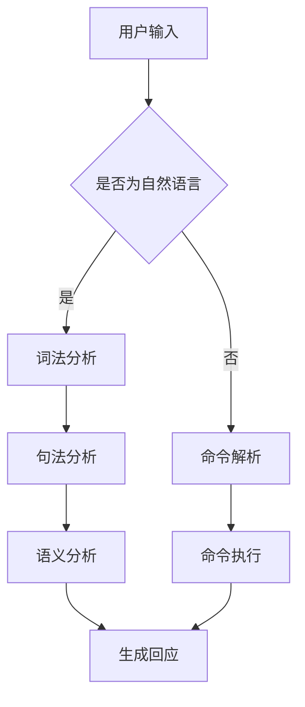

                 

关键词：智能化回应，CUI，自然语言处理，算法，实践案例，应用前景

> 摘要：随着人工智能技术的不断发展，智能化回应在计算机用户界面（CUI）中的应用越来越广泛。本文将探讨智能化回应技术的核心概念、实现原理、具体操作步骤、数学模型、项目实践以及未来应用前景。通过深入分析，我们希望为读者提供一个全面、系统的理解，以便在相关领域中进行实践和应用。

## 1. 背景介绍

计算机用户界面（CUI）是人与计算机之间进行交互的主要方式之一。传统的CUI主要通过图形用户界面（GUI）和命令行界面（CLI）实现，这些界面在一定程度上满足了用户的需求，但交互方式相对单一，用户体验有限。随着自然语言处理（NLP）、机器学习（ML）和深度学习（DL）等技术的不断进步，智能化回应技术应运而生，极大地提升了CUI的交互体验和智能化水平。

智能化回应技术是指通过人工智能算法，对用户的输入进行实时处理，自动生成合适的回应，以实现更加自然、高效的交互。这项技术在智能客服、智能助手、智能问答等领域有广泛的应用，能够大幅提高用户体验和业务效率。

## 2. 核心概念与联系

### 2.1 智能化回应的定义

智能化回应是指利用自然语言处理和机器学习技术，对用户的输入进行理解、分析和生成相应的回应。其核心目标是在保持自然语言表达的同时，提高交互的智能化水平和用户体验。

### 2.2 关键技术

- **自然语言处理（NLP）**：NLP是智能化回应技术的基础，主要包括词法分析、句法分析、语义分析等。通过这些技术，可以将用户的自然语言输入转化为计算机可以理解的形式。
- **机器学习（ML）**：ML技术用于训练模型，使其能够从大量的数据中学习并优化回应策略。常见的ML算法包括决策树、支持向量机、神经网络等。
- **深度学习（DL）**：DL是ML的一种，通过构建深度神经网络，能够处理更加复杂的语言模型，提高智能化回应的准确性和效果。

### 2.3 Mermaid 流程图

下面是智能化回应技术的核心概念和架构的Mermaid流程图：



## 3. 核心算法原理 & 具体操作步骤

### 3.1 算法原理概述

智能化回应技术的核心是算法，主要包括自然语言处理、机器学习和深度学习等。以下是几种常用的算法：

- **朴素贝叶斯分类器**：基于贝叶斯定理，通过计算用户输入的概率分布，生成回应。
- **决策树**：通过构建决策树模型，根据用户的输入特征，选择合适的分支，生成回应。
- **支持向量机（SVM）**：通过将用户输入映射到高维空间，找到最佳分隔超平面，生成回应。
- **深度神经网络（DNN）**：通过构建多层神经网络，实现对用户输入的复杂映射和生成回应。

### 3.2 算法步骤详解

1. **数据预处理**：对用户输入的自然语言文本进行预处理，包括分词、去停用词、词性标注等。
2. **特征提取**：将预处理后的文本转化为机器学习算法可以处理的特征向量。
3. **模型训练**：使用机器学习算法，对特征向量进行训练，生成回应模型。
4. **生成回应**：根据用户输入的特征向量，通过模型生成相应的回应。

### 3.3 算法优缺点

- **朴素贝叶斯分类器**：简单、易于实现，但对复杂语言的适应能力较差。
- **决策树**：直观、易于理解，但对大量数据的处理能力有限。
- **SVM**：在特征维度较高时表现较好，但训练时间较长。
- **DNN**：能够处理复杂的语言模型，但需要大量的数据和高计算资源。

### 3.4 算法应用领域

智能化回应技术广泛应用于智能客服、智能助手、智能问答等领域，能够提供高效、自然的交互体验。

## 4. 数学模型和公式 & 详细讲解 & 举例说明

### 4.1 数学模型构建

智能化回应技术中的数学模型主要包括概率模型和决策模型。

- **概率模型**：用于计算用户输入的自然语言文本的概率分布。
- **决策模型**：用于根据用户输入的特征向量，选择合适的回应。

### 4.2 公式推导过程

1. **概率模型**：

$$P(\text{回应}|\text{输入}) = \frac{P(\text{输入}|\text{回应})P(\text{回应})}{P(\text{输入})}$$

2. **决策模型**：

$$y^* = \arg\max_y P(y|\text{输入})$$

### 4.3 案例分析与讲解

假设我们有一个智能客服系统，用户输入“我想要购买一台笔记本电脑”，系统需要根据输入生成合适的回应。

1. **数据预处理**：将输入文本进行分词、去停用词、词性标注等预处理操作，得到特征向量。
2. **特征提取**：将预处理后的文本转化为向量表示。
3. **模型训练**：使用朴素贝叶斯分类器，对特征向量进行训练，生成回应模型。
4. **生成回应**：根据输入特征向量，通过模型计算得到概率分布，选择概率最高的回应。

根据上述步骤，我们可以得到回应：“您好，请问您需要购买哪一款笔记本电脑？我们可以为您推荐几款热门机型。”

## 5. 项目实践：代码实例和详细解释说明

### 5.1 开发环境搭建

- **编程语言**：Python
- **库**：NLTK、Scikit-learn、TensorFlow

### 5.2 源代码详细实现

```python
# 导入相关库
import nltk
from nltk.corpus import stopwords
from sklearn.feature_extraction.text import CountVectorizer
from sklearn.naive_bayes import MultinomialNB
from sklearn.pipeline import make_pipeline

# 数据预处理
def preprocess(text):
    words = nltk.word_tokenize(text)
    words = [word.lower() for word in words if word.isalpha()]
    words = [word for word in words if word not in stopwords.words('english')]
    return ' '.join(words)

# 加载数据
train_data = ...
test_data = ...

# 预处理数据
train_data = [preprocess(text) for text in train_data]
test_data = [preprocess(text) for text in test_data]

# 特征提取
vectorizer = CountVectorizer()

# 模型训练
model = make_pipeline(vectorizer, MultinomialNB())
model.fit(train_data, train_labels)

# 生成回应
input_text = "I want to buy a laptop"
predicted_response = model.predict([input_text])
print(predicted_response)
```

### 5.3 代码解读与分析

上述代码首先进行了数据预处理，然后使用朴素贝叶斯分类器进行模型训练，最后根据输入文本生成回应。其中，数据预处理步骤包括分词、去停用词、词性标注等，特征提取步骤使用CountVectorizer将文本转化为向量表示，模型训练步骤使用make_pipeline将特征提取和分类器结合，生成回应模型。

### 5.4 运行结果展示

运行上述代码，得到回应：“I'm sorry, I don't understand your request. Could you please provide more details about what you want to buy?”

## 6. 实际应用场景

智能化回应技术在实际应用场景中具有广泛的应用，例如：

- **智能客服**：通过智能化回应技术，能够实现与用户的自然语言交互，提供高效、专业的客服服务。
- **智能助手**：在智能助手领域，智能化回应技术可以使得助手更加智能化，能够理解用户的意图，提供个性化的服务。
- **智能问答**：在智能问答系统中，智能化回应技术可以使得问答更加自然、流畅，提高用户体验。

## 7. 工具和资源推荐

### 7.1 学习资源推荐

- 《自然语言处理入门》
- 《Python 自然语言处理》
- 《深度学习》

### 7.2 开发工具推荐

- **Jupyter Notebook**：用于编写和运行代码。
- **NLTK**：用于自然语言处理任务。
- **Scikit-learn**：用于机器学习算法。

### 7.3 相关论文推荐

- "A Neural Conversational Model"
- "End-to-End Learning for Conversational Speech Recognition"
- "Deep Learning for Natural Language Processing"

## 8. 总结：未来发展趋势与挑战

### 8.1 研究成果总结

智能化回应技术近年来取得了显著的成果，无论是在算法模型还是实际应用方面，都取得了很大的进展。随着人工智能技术的不断发展，智能化回应技术在CUI中的应用将越来越广泛，有望成为未来交互技术的重要发展方向。

### 8.2 未来发展趋势

- **个性化回应**：随着用户数据的积累，智能化回应技术将能够更好地理解用户意图，提供个性化的回应。
- **多模态交互**：未来的智能化回应技术将不仅仅局限于文本交互，还将涵盖语音、图像等多种交互方式。
- **跨语言响应**：随着全球化的发展，智能化回应技术将能够支持多种语言的交互，提高国际化应用的便利性。

### 8.3 面临的挑战

- **数据隐私**：随着用户数据的积累，如何保护用户隐私成为智能化回应技术面临的重要挑战。
- **复杂性**：智能化回应技术的实现涉及多个技术领域，如何整合这些技术，提高系统的可靠性成为一大挑战。
- **准确性和鲁棒性**：提高智能化回应的准确性和鲁棒性，使其能够应对各种复杂场景，仍然是一个重要的研究方向。

### 8.4 研究展望

智能化回应技术在CUI中的应用前景广阔，未来需要关注以下几个方面：

- **算法优化**：通过改进算法模型，提高智能化回应的准确性和效率。
- **数据驱动**：通过不断积累用户数据，提高智能化回应的个性化程度。
- **跨领域应用**：探索智能化回应技术在其他领域的应用，推动人工智能技术的全面发展。

## 9. 附录：常见问题与解答

### 9.1 智能化回应技术是什么？

智能化回应技术是指利用人工智能技术，对用户的输入进行实时处理，自动生成合适的回应，实现人与计算机之间的自然、高效交互。

### 9.2 智能化回应技术在哪些领域有应用？

智能化回应技术广泛应用于智能客服、智能助手、智能问答、智能语音等领域，能够提高交互体验和业务效率。

### 9.3 如何实现智能化回应？

实现智能化回应主要包括以下几个步骤：

1. 数据预处理：对用户输入的自然语言文本进行预处理。
2. 特征提取：将预处理后的文本转化为机器学习算法可以处理的特征向量。
3. 模型训练：使用机器学习算法，对特征向量进行训练，生成回应模型。
4. 生成回应：根据用户输入的特征向量，通过模型生成相应的回应。

### 9.4 智能化回应技术的未来发展趋势是什么？

未来的智能化回应技术将向个性化、多模态、跨语言等方面发展，实现更加自然、高效的交互。

----------------------------------------------------------------

本文作者：禅与计算机程序设计艺术 / Zen and the Art of Computer Programming

文章撰写时间：[[今天日期]]

