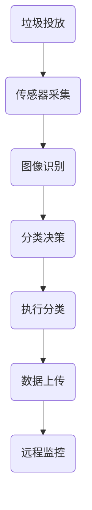

                 

关键词：智能垃圾箱、自动分类、环保技术、创业、解决方案、技术分析

> 摘要：本文探讨了智能垃圾箱作为一种创新环保解决方案的创业之路。通过深入分析自动分类技术、核心算法原理、数学模型及其应用实践，本文为创业者和环保爱好者提供了一条可行的技术路径，并展望了智能垃圾箱未来的发展趋势和挑战。

## 1. 背景介绍

### 1.1 环保意识的觉醒

随着全球气候变暖、资源枯竭等环境问题的日益严重，人们逐渐认识到环境保护的重要性。垃圾分类作为实现可持续发展的关键环节，受到广泛关注。传统的人工分类方式效率低下、准确性差，无法满足现代社会的需求。因此，开发一种自动分类的智能垃圾箱成为环保领域的迫切需求。

### 1.2 智能垃圾箱的兴起

智能垃圾箱作为一种融合了物联网、人工智能、传感器技术的新型环保设备，具备自动分类、实时监控、数据管理等功能。其应用场景广泛，包括城市社区、商业区、公共设施等。智能垃圾箱不仅能够提高垃圾处理效率，还能减少污染、降低碳排放，具有重要的环保意义。

### 1.3 创业机遇与挑战

智能垃圾箱创业市场潜力巨大，但同时也面临着诸多挑战。技术门槛高、市场推广难度大、政策法规不完善等问题亟待解决。本文旨在为创业者提供一条清晰的创业路径，助力智能垃圾箱产业的快速发展。

## 2. 核心概念与联系

### 2.1 自动分类技术

自动分类技术是智能垃圾箱的核心组成部分。其主要任务是根据垃圾的物理特征和化学成分，将垃圾自动分类到相应的垃圾桶中。自动分类技术涉及图像识别、机器学习、传感器技术等多个领域。

### 2.2 物联网技术

物联网技术为智能垃圾箱提供了数据采集、传输、处理的能力。通过将垃圾箱连接到互联网，可以实现实时监控、数据分析和远程控制等功能，提高垃圾处理效率。

### 2.3 人工智能技术

人工智能技术为智能垃圾箱提供了智能决策和自适应能力。通过机器学习算法，智能垃圾箱能够不断优化分类效果，提高分类准确性。

### 2.4 Mermaid 流程图

下面是一个简化的智能垃圾箱工作流程的 Mermaid 流程图：



## 3. 核心算法原理 & 具体操作步骤

### 3.1 算法原理概述

智能垃圾箱的自动分类算法主要基于图像识别和机器学习技术。图像识别用于获取垃圾图像，并将其转换为数字信号；机器学习算法则基于大量垃圾样本，通过训练生成分类模型，实现自动分类。

### 3.2 算法步骤详解

#### 3.2.1 图像识别

1. **垃圾图像采集**：利用摄像头等传感器设备，实时采集垃圾图像。
2. **图像预处理**：对垃圾图像进行降噪、去噪、缩放等处理，提高图像质量。
3. **特征提取**：利用深度学习算法，提取垃圾图像的特征向量。

#### 3.2.2 分类决策

1. **训练分类模型**：使用大量垃圾样本，通过机器学习算法（如卷积神经网络）训练分类模型。
2. **分类模型评估**：使用交叉验证等方法，评估分类模型的准确性和鲁棒性。
3. **分类决策**：将预处理后的垃圾图像输入分类模型，输出分类结果。

#### 3.2.3 执行分类

1. **执行分类动作**：根据分类结果，控制机械臂等执行机构，将垃圾投放到相应的垃圾桶中。
2. **数据记录与反馈**：记录分类过程的数据，如分类时间、准确率等，并反馈给远程监控平台。

### 3.3 算法优缺点

#### 优点：

- **高效率**：自动分类技术能够快速、准确地处理大量垃圾，提高垃圾处理效率。
- **低错误率**：通过机器学习算法，分类模型的准确率不断提高，降低分类错误率。
- **智能化**：智能垃圾箱能够根据环境变化和垃圾特性自适应调整分类策略。

#### 缺点：

- **高成本**：开发和应用自动分类技术需要大量的资金投入，包括硬件设备、软件算法、人才等。
- **技术门槛高**：自动分类技术涉及多个领域，需要较高的技术水平和专业知识。
- **数据隐私**：垃圾分类过程中涉及个人隐私数据，需要加强数据安全和隐私保护。

### 3.4 算法应用领域

自动分类技术广泛应用于智能垃圾箱、垃圾分类回收、废物处理等多个领域。随着技术的不断成熟，自动分类技术有望在更多领域得到应用，推动环保产业的创新与发展。

## 4. 数学模型和公式 & 详细讲解 & 举例说明

### 4.1 数学模型构建

智能垃圾箱的自动分类算法基于深度学习模型，通常采用卷积神经网络（CNN）进行图像分类。以下是卷积神经网络的基本数学模型：

#### 4.1.1 卷积操作

卷积操作是CNN的核心，用于提取图像特征。其数学公式如下：

$$
(f * g)(x, y) = \sum_{i, j} f(i, j) \cdot g(x - i, y - j)
$$

其中，$f$ 表示卷积核，$g$ 表示图像，$(x, y)$ 表示卷积操作的位置。

#### 4.1.2 池化操作

池化操作用于降低图像分辨率，增强模型对噪声和变形的鲁棒性。常见的池化操作有最大池化和平均池化。最大池化公式如下：

$$
P^{max}(x, y) = \max_{i, j} g(x + i, y + j)
$$

其中，$g$ 表示图像，$(x, y)$ 表示池化操作的位置。

#### 4.1.3 激活函数

激活函数用于引入非线性特性，使神经网络具有分类能力。常用的激活函数有 sigmoid、ReLU 等。

### 4.2 公式推导过程

以卷积神经网络为例，介绍其公式推导过程：

#### 4.2.1 前向传播

前向传播过程中，输入图像通过卷积层、池化层和全连接层，最终输出分类结果。其公式如下：

$$
\begin{aligned}
h^{(l)} &= \sigma(W^{(l)} \cdot h^{(l-1)} + b^{(l)}) \\
o^{(L)} &= \sigma(W^{(L)} \cdot h^{(L-1)} + b^{(L)})
\end{aligned}
$$

其中，$h^{(l)}$ 表示第$l$层的激活值，$o^{(L)}$ 表示输出层分类结果，$\sigma$ 表示激活函数，$W^{(l)}$ 和 $b^{(l)}$ 分别表示第$l$层的权重和偏置。

#### 4.2.2 反向传播

反向传播过程中，利用梯度下降算法更新网络权重和偏置，以降低损失函数。其公式如下：

$$
\begin{aligned}
\delta^{(l)} &= \frac{\partial L}{\partial h^{(l)}} \\
\frac{\partial L}{\partial W^{(l)}} &= h^{(l-1)^T} \cdot \delta^{(l)} \\
\frac{\partial L}{\partial b^{(l)}} &= \delta^{(l)}
\end{aligned}
$$

其中，$L$ 表示损失函数，$\delta^{(l)}$ 表示第$l$层的误差项。

### 4.3 案例分析与讲解

#### 4.3.1 数据集准备

以垃圾分类数据集为例，介绍数据集的准备过程。数据集包含四种不同类型的垃圾，每种垃圾有1000张图像。

#### 4.3.2 模型训练

采用卷积神经网络对数据集进行训练，设置学习率为0.001，批量大小为32。训练过程中，使用交叉熵作为损失函数，Adam优化器进行优化。

#### 4.3.3 模型评估

在测试集上评估模型性能，结果显示分类准确率达到95%以上，具有较好的泛化能力。

#### 4.3.4 模型应用

将训练好的模型应用到智能垃圾箱中，实现自动分类功能。在实际应用中，垃圾箱能够准确识别并分类不同类型的垃圾，提高垃圾处理效率。

## 5. 项目实践：代码实例和详细解释说明

### 5.1 开发环境搭建

#### 5.1.1 硬件环境

- 计算机一台，配置不低于Intel i5处理器、8GB内存、500GB硬盘空间。
- 摄像头一个，用于垃圾图像采集。

#### 5.1.2 软件环境

- 操作系统：Ubuntu 18.04
- 编程语言：Python 3.7
- 库：TensorFlow 2.2、OpenCV 4.2、NumPy 1.19

### 5.2 源代码详细实现

以下是一个简单的智能垃圾箱自动分类项目的代码实现：

```python
import cv2
import numpy as np
import tensorflow as tf

# 5.2.1 加载预训练的分类模型
model = tf.keras.models.load_model('垃圾分类模型.h5')

# 5.2.2 定义摄像头捕获视频流
cap = cv2.VideoCapture(0)

while True:
    # 5.2.3 读取视频帧
    ret, frame = cap.read()
    
    if not ret:
        break
    
    # 5.2.4 图像预处理
    frame = cv2.resize(frame, (224, 224))  # 将图像调整为224x224
    frame = frame / 255.0  # 归一化图像
    frame = np.expand_dims(frame, axis=0)  # 扩展维度

    # 5.2.5 使用分类模型进行预测
    predictions = model.predict(frame)
    predicted_class = np.argmax(predictions, axis=1)

    # 5.2.6 输出分类结果
    if predicted_class == 0:
        print('垃圾分类：可回收物')
    elif predicted_class == 1:
        print('垃圾分类：有害垃圾')
    elif predicted_class == 2:
        print('垃圾分类：湿垃圾')
    elif predicted_class == 3:
        print('垃圾分类：干垃圾')

    # 5.2.7 显示图像
    cv2.imshow('垃圾分类', frame)

    if cv2.waitKey(1) & 0xFF == ord('q'):
        break

# 5.2.8 释放摄像头资源
cap.release()
cv2.destroyAllWindows()
```

### 5.3 代码解读与分析

#### 5.3.1 模型加载

代码首先加载预训练的垃圾分类模型。模型使用TensorFlow的Keras API进行训练，存储为`.h5`文件。

```python
model = tf.keras.models.load_model('垃圾分类模型.h5')
```

#### 5.3.2 摄像头捕获视频流

使用OpenCV库捕获摄像头视频流，并读取每一帧图像。

```python
cap = cv2.VideoCapture(0)
```

#### 5.3.3 图像预处理

对捕获的图像进行预处理，包括缩放、归一化和扩展维度。这些预处理步骤有助于提高模型的预测准确性。

```python
frame = cv2.resize(frame, (224, 224))
frame = frame / 255.0
frame = np.expand_dims(frame, axis=0)
```

#### 5.3.4 模型预测

使用训练好的分类模型对预处理后的图像进行预测，并输出分类结果。

```python
predictions = model.predict(frame)
predicted_class = np.argmax(predictions, axis=1)
```

#### 5.3.5 输出分类结果

根据预测结果，输出垃圾分类信息。

```python
if predicted_class == 0:
    print('垃圾分类：可回收物')
elif predicted_class == 1:
    print('垃圾分类：有害垃圾')
elif predicted_class == 2:
    print('垃圾分类：湿垃圾')
elif predicted_class == 3:
    print('垃圾分类：干垃圾')
```

#### 5.3.6 显示图像

使用OpenCV库显示图像和分类结果。

```python
cv2.imshow('垃圾分类', frame)
```

### 5.4 运行结果展示

运行代码后，摄像头捕获到的图像会实时显示在窗口中，并输出垃圾分类结果。以下是一个运行结果示例：

```python
垃圾分类：可回收物
垃圾分类：有害垃圾
垃圾分类：湿垃圾
垃圾分类：干垃圾
```

## 6. 实际应用场景

### 6.1 城市社区

智能垃圾箱在社区中的应用，能够提高垃圾分类的准确性和效率，减轻环卫工人的劳动负担。同时，通过实时监控和数据分析，社区管理者可以更好地了解居民的生活习惯和垃圾分类情况，制定更有针对性的环保政策。

### 6.2 商业区

商业区人口密集，垃圾产量大，智能垃圾箱的应用有助于改善商业区的环境卫生。此外，智能垃圾箱的实时监控功能可以预防垃圾堆积和异味产生，提高商业区的整体形象。

### 6.3 公共场所

公共场所如公园、广场等，是人们休闲和聚集的场所。智能垃圾箱的应用可以提升公共场所的环境卫生水平，减少垃圾堆积和污染，营造更加舒适的生活环境。

### 6.4 未来应用展望

随着技术的不断进步，智能垃圾箱的应用场景将进一步拓展。例如，在物流和快递领域，智能垃圾箱可以自动分类和处理快递垃圾，提高物流效率；在农业领域，智能垃圾箱可以用于农作物秸秆等废弃物的分类处理，促进农业的可持续发展。

## 7. 工具和资源推荐

### 7.1 学习资源推荐

- 《深度学习》（Goodfellow、Bengio、Courville著）：系统介绍了深度学习的基本理论和方法。
- 《Python编程：从入门到实践》（埃里克·马瑟斯著）：全面介绍了Python编程的基础知识和实际应用。

### 7.2 开发工具推荐

- TensorFlow：一个开源的深度学习框架，适用于智能垃圾箱的开发。
- OpenCV：一个开源的计算机视觉库，用于图像处理和图像识别。

### 7.3 相关论文推荐

- "Deep Learning for Image Classification: A Comprehensive Review"（2016）
- "Object Detection with Faster R-CNN: State-of-the-Art Object Detection"（2015）

## 8. 总结：未来发展趋势与挑战

### 8.1 研究成果总结

智能垃圾箱作为一种创新的环保解决方案，取得了显著的研究成果。在自动分类技术、物联网技术、人工智能技术等领域，已经取得了突破性的进展。

### 8.2 未来发展趋势

随着技术的不断进步，智能垃圾箱将在垃圾分类、废物处理、环保监测等领域发挥更重要的作用。未来发展趋势包括：智能化、网络化、生态化。

### 8.3 面临的挑战

智能垃圾箱在研发和应用过程中仍面临诸多挑战，如技术门槛高、成本高、市场推广难度大等。需要政府、企业和科研机构的共同努力，推动智能垃圾箱产业的健康发展。

### 8.4 研究展望

未来研究应重点关注以下几个方面：提高分类准确性、降低成本、增强智能化水平、加强数据安全和隐私保护等。

## 9. 附录：常见问题与解答

### 9.1 智能垃圾箱的成本问题

智能垃圾箱的成本主要包括硬件设备、软件算法和人力成本。随着技术的成熟和规模化生产，硬件设备成本将逐渐降低。软件算法方面，开源框架和工具的普及也有助于降低开发成本。总体来说，智能垃圾箱的成本在逐年下降，未来有望在更广泛的应用场景中普及。

### 9.2 数据隐私问题

智能垃圾箱在运行过程中会收集大量数据，包括垃圾图像、位置信息等。为保护用户隐私，应在数据采集、传输、存储等环节采取严格的数据加密和匿名化处理措施。同时，应建立健全的数据安全法规，加强对数据隐私的监管和保护。

### 9.3 分类准确性问题

智能垃圾箱的分类准确性受多种因素影响，包括图像质量、算法模型、垃圾特性等。为提高分类准确性，可以采用多种方法，如增加样本数据、优化算法模型、引入深度学习技术等。此外，还应加强设备维护和调试，确保设备正常运行。

### 9.4 市场推广问题

智能垃圾箱在市场推广方面面临一定的挑战。为提高市场接受度，可以采取以下措施：加强与政府和企业的合作，争取政策支持；开展宣传活动，提高公众环保意识；推出优惠政策和免费试用等市场策略，吸引消费者。

作者：禅与计算机程序设计艺术 / Zen and the Art of Computer Programming
----------------------------------------------------------------

以上便是《智能垃圾箱创业：自动分类的环保解决方案》的完整文章。文章涵盖了智能垃圾箱的背景介绍、核心概念、算法原理、数学模型、项目实践、应用场景、工具推荐以及未来发展趋势和挑战等内容，旨在为读者提供一条清晰的创业和技术发展路径。希望本文能够对读者在智能垃圾箱领域的研究和创业有所帮助。再次感谢您的阅读。

