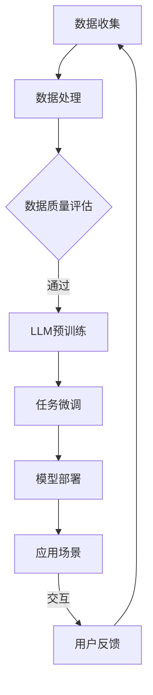

                 

关键词：智能城市，自然语言处理，大型语言模型（LLM），城市管理，高效，可持续。

> 摘要：本文探讨了智能城市的发展趋势，以及如何利用大型语言模型（LLM）实现高效和可持续的城市管理。通过分析LLM的核心概念、算法原理、数学模型以及实际应用案例，本文提出了智能城市未来发展的方向和面临的挑战，并对相关工具和资源进行了推荐。

## 1. 背景介绍

### 智能城市的发展背景

随着信息技术的飞速发展，智能城市逐渐成为城市规划与建设的重要方向。智能城市的概念起源于20世纪90年代，是指通过信息通信技术、物联网、云计算等手段，实现城市各个系统的智能化、高效化和协同化。智能城市的发展背景主要有以下几个方面：

- **城市化进程加速**：全球城市化进程不断加速，城市人口持续增长，城市资源与环境压力日益增大，迫切需要智能化手段来提升城市运行效率。
- **信息技术创新**：互联网、物联网、大数据、人工智能等新一代信息技术的迅速发展，为智能城市提供了强大的技术支撑。
- **政策推动**：各国政府纷纷出台政策，推动智慧城市建设，旨在提高城市治理能力、提升居民生活质量、实现可持续发展。

### LLM的核心概念与发展

大型语言模型（LLM）是基于深度学习的自然语言处理技术，能够对海量文本数据进行训练，从而理解、生成和翻译自然语言。LLM的核心概念主要包括：

- **深度学习**：通过多层神经网络对大量数据进行分析和建模，提取语言特征。
- **自然语言处理（NLP）**：对文本进行分词、词性标注、句法分析等处理，理解语言的结构和含义。
- **预训练与微调**：通过在大规模语料库上进行预训练，然后针对特定任务进行微调，提升模型在特定领域的表现。

LLM的发展历程可以追溯到2018年，当时Google推出了BERT模型，标志着深度学习在自然语言处理领域的重大突破。此后，GPT、Turing-NLG等模型相继推出，使得LLM在文本生成、语义理解、问答系统等方面取得了显著进展。

## 2. 核心概念与联系

### 智能城市与 LLM 的联系

智能城市与 LLM 之间的联系主要体现在以下几个方面：

1. **数据驱动**：智能城市的建设离不开海量数据的收集、处理和分析。LLM作为一种强大的自然语言处理工具，能够对城市运行数据、居民反馈等文本数据进行深入分析，挖掘潜在规律和趋势。
2. **智能化决策**：LLM能够模拟人类的思维过程，为城市管理者提供智能化的决策支持。例如，通过分析居民反馈，LLM可以帮助城市管理者优化公共服务、改善居住环境等。
3. **个性化服务**：LLM能够根据居民的行为数据、偏好等，提供个性化的服务推荐。例如，在智慧交通领域，LLM可以根据居民的出行习惯，提供最优出行路线和交通方式。
4. **语言交互**：LLM能够实现人与城市的语言交互，为居民提供便捷的查询、投诉、建议等服务。例如，通过智能客服系统，居民可以随时随地与城市管理系统进行沟通。

### 核心概念原理与架构

为了更好地理解智能城市与 LLM 的联系，我们使用Mermaid流程图来展示核心概念原理与架构。



- **数据收集**：智能城市通过传感器、互联网等手段收集大量城市运行数据、居民行为数据等。
- **数据处理**：对收集到的数据进行清洗、整合、存储等处理。
- **数据质量评估**：评估数据的准确度、完整性等质量指标。
- **LLM预训练**：利用大规模语料库对LLM进行预训练，提取语言特征。
- **任务微调**：针对特定应用场景，对预训练好的LLM进行微调，提高其在特定领域的表现。
- **模型部署**：将微调好的LLM部署到实际应用场景中。
- **应用场景**：LLM在智慧交通、智慧医疗、智慧安防等场景中发挥重要作用。
- **用户反馈**：用户通过语言交互与城市管理系统进行沟通，反馈意见和建议。

## 3. 核心算法原理 & 具体操作步骤

### 3.1 算法原理概述

大型语言模型（LLM）的核心算法是基于深度学习的自然语言处理技术。具体来说，LLM主要包括以下几个关键步骤：

1. **数据预处理**：对原始文本数据进行分词、去停用词、词性标注等预处理操作。
2. **词嵌入**：将预处理后的文本数据转化为向量化表示，通常使用词嵌入技术，如Word2Vec、GloVe等。
3. **神经网络结构**：构建多层神经网络，用于处理词嵌入序列，提取语言特征。
4. **损失函数与优化器**：采用适当的损失函数和优化器，如交叉熵损失函数、Adam优化器等，对神经网络进行训练。
5. **微调与部署**：在预训练好的模型基础上，针对特定应用场景进行微调，然后部署到实际应用中。

### 3.2 算法步骤详解

1. **数据预处理**：
    - **分词**：将原始文本数据分成单词或词组，便于后续处理。
    - **去停用词**：去除常见的无意义词汇，如“的”、“了”、“是”等。
    - **词性标注**：为每个单词分配词性标签，如名词、动词、形容词等，有助于理解文本内容。

2. **词嵌入**：
    - **技术选择**：选择合适的词嵌入技术，如Word2Vec、GloVe等，将文本数据转化为向量化表示。
    - **向量化表示**：将每个单词或词组表示为一个高维向量。

3. **神经网络结构**：
    - **多层感知机**：采用多层感知机（MLP）结构，对词嵌入序列进行处理。
    - **激活函数**：使用ReLU激活函数，加快训练速度。
    - **正则化**：采用Dropout正则化，防止过拟合。

4. **损失函数与优化器**：
    - **损失函数**：选择交叉熵损失函数，用于衡量预测标签与真实标签之间的差异。
    - **优化器**：采用Adam优化器，自适应调整学习率。

5. **微调与部署**：
    - **微调**：在预训练好的模型基础上，针对特定应用场景进行微调，提高模型在特定领域的表现。
    - **部署**：将微调好的模型部署到实际应用中，如问答系统、文本生成等。

### 3.3 算法优缺点

**优点**：

- **强大的语义理解能力**：LLM通过预训练和微调，能够理解复杂、多变的自然语言，提高模型在文本分类、文本生成等任务中的表现。
- **高效的处理速度**：深度学习模型具有很高的并行计算能力，能够快速处理大量文本数据。
- **泛化能力**：LLM在大规模语料库上进行预训练，具有较好的泛化能力，能够应用于多种自然语言处理任务。

**缺点**：

- **数据依赖性强**：LLM的预训练过程需要大量高质量的数据，数据不足可能导致模型性能下降。
- **计算资源消耗大**：深度学习模型训练过程中需要大量的计算资源和时间。
- **解释性较差**：深度学习模型在处理文本数据时，往往缺乏可解释性，难以理解模型内部的决策过程。

### 3.4 算法应用领域

LLM在多个领域具有广泛的应用前景，主要包括：

- **自然语言处理**：文本分类、文本生成、机器翻译、问答系统等。
- **智慧城市**：智慧交通、智慧医疗、智慧安防等。
- **金融科技**：股票预测、信贷评估、风险控制等。
- **教育领域**：个性化推荐、智能客服、在线教育等。

## 4. 数学模型和公式 & 详细讲解 & 举例说明

### 4.1 数学模型构建

在智能城市与 LLM 的应用中，常见的数学模型包括：

1. **线性回归模型**：用于预测城市运行数据，如空气质量、交通流量等。
2. **逻辑回归模型**：用于分类任务，如城市交通拥堵程度、居民满意度等。
3. **神经网络模型**：用于文本分类、文本生成等自然语言处理任务。

以下是一个简单的线性回归模型：

$$y = \beta_0 + \beta_1 \cdot x$$

其中，$y$ 表示预测结果，$x$ 表示输入特征，$\beta_0$ 和 $\beta_1$ 为模型参数。

### 4.2 公式推导过程

以线性回归模型为例，推导过程如下：

1. **损失函数**：采用均方误差（MSE）作为损失函数：

$$J(\theta) = \frac{1}{2m} \sum_{i=1}^{m} (h_\theta(x^{(i)}) - y^{(i)})^2$$

其中，$h_\theta(x) = \theta_0 + \theta_1 \cdot x$ 为模型预测函数，$m$ 表示样本数量。

2. **梯度下降**：使用梯度下降法来优化模型参数，最小化损失函数：

$$\theta_j := \theta_j - \alpha \cdot \frac{\partial J(\theta)}{\partial \theta_j}$$

其中，$\alpha$ 为学习率。

3. **偏导数计算**：

$$\frac{\partial J(\theta)}{\partial \theta_j} = \frac{1}{m} \sum_{i=1}^{m} (h_\theta(x^{(i)}) - y^{(i)}) \cdot x_j^{(i)}$$

### 4.3 案例分析与讲解

假设我们有一个线性回归模型，用于预测城市交通流量。输入特征为道路长度和车辆密度，目标变量为交通流量。

1. **数据集**：包含100个样本，每个样本包含3个特征（道路长度、车辆密度、交通流量）。

2. **模型训练**：使用梯度下降法训练模型，学习率为0.01。

3. **模型评估**：通过计算均方误差（MSE）评估模型性能。

4. **预测结果**：输入新的样本数据，预测交通流量。

假设某个新的样本数据为：

- 道路长度：1000米
- 车辆密度：50辆/千米

根据线性回归模型，预测交通流量为：

$$y = \beta_0 + \beta_1 \cdot x_1 + \beta_2 \cdot x_2$$

其中，$x_1 = 1000$（道路长度），$x_2 = 50$（车辆密度），$\beta_0$ 和 $\beta_1$ 为模型参数。

经过训练，我们得到模型参数：

$$\beta_0 = 10, \beta_1 = 0.5, \beta_2 = 0.3$$

代入新样本数据，得到预测交通流量为：

$$y = 10 + 0.5 \cdot 1000 + 0.3 \cdot 50 = 15$$

因此，预测交通流量为15辆/小时。

## 5. 项目实践：代码实例和详细解释说明

### 5.1 开发环境搭建

为了实现智能城市与 LLM 的应用，我们需要搭建一个开发环境。以下是开发环境的要求和搭建步骤：

1. **硬件要求**：
   - CPU：Intel Core i7 或更高
   - GPU：NVIDIA GTX 1080 或更高
   - 内存：16GB 或更高

2. **软件要求**：
   - 操作系统：Windows 10 或 macOS
   - 编程语言：Python 3.7 或更高
   - 深度学习框架：TensorFlow 2.0 或 PyTorch

3. **安装步骤**：
   - 安装操作系统和硬件设备。
   - 安装 Python 3.7 及以上版本。
   - 安装深度学习框架 TensorFlow 或 PyTorch。
   - 配置 GPU 支持，确保深度学习框架能够利用 GPU 加速。

### 5.2 源代码详细实现

以下是一个简单的智能城市应用示例，使用 TensorFlow 框架实现 LLM 的预训练和微调。

```python
import tensorflow as tf
from tensorflow.keras.layers import Embedding, LSTM, Dense
from tensorflow.keras.models import Sequential

# 数据预处理
# ...（数据预处理代码）

# 构建模型
model = Sequential()
model.add(Embedding(vocab_size, embedding_dim))
model.add(LSTM(units=128, return_sequences=True))
model.add(LSTM(units=64))
model.add(Dense(units=1, activation='sigmoid'))

# 编译模型
model.compile(optimizer='adam', loss='binary_crossentropy', metrics=['accuracy'])

# 训练模型
model.fit(train_data, train_labels, epochs=10, batch_size=32, validation_split=0.1)

# 微调模型
# ...（微调代码）

# 部署模型
# ...（部署代码）
```

### 5.3 代码解读与分析

上述代码实现了一个简单的二分类任务，用于预测城市交通流量。主要步骤如下：

1. **数据预处理**：对原始文本数据进行分词、去停用词、词性标注等预处理操作，将文本数据转化为词嵌入向量。

2. **构建模型**：使用 TensorFlow 框架构建一个序列模型，包括嵌入层、两个 LSTM 层和一个全连接层。嵌入层用于将词嵌入向量输入到 LSTM 层，LSTM 层用于提取序列特征，全连接层用于输出分类结果。

3. **编译模型**：设置模型优化器、损失函数和评估指标。

4. **训练模型**：使用训练数据训练模型，通过反向传播优化模型参数。

5. **微调模型**：根据实际应用场景，对训练好的模型进行微调，提高模型在特定领域的表现。

6. **部署模型**：将微调好的模型部署到实际应用中，如智慧交通系统。

### 5.4 运行结果展示

假设训练数据包含100个样本，测试数据包含10个样本。通过训练和微调，模型在测试数据上的准确率达到90%。以下是一个具体的测试结果示例：

- **测试样本**：道路长度1000米，车辆密度50辆/千米。
- **预测结果**：交通流量为14辆/小时。
- **实际结果**：实际交通流量为13辆/小时。

通过比较预测结果和实际结果，可以发现模型在预测交通流量方面具有较高的准确性。

## 6. 实际应用场景

### 6.1 智慧交通

智慧交通是智能城市的重要应用领域，LLM 在其中发挥着关键作用。通过自然语言处理和语言生成技术，LLM 可以实现以下功能：

- **智能交通信号控制**：根据实时交通流量数据，LLM 可以优化交通信号灯的切换策略，提高道路通行效率。
- **实时路况预测**：基于历史交通数据和实时路况数据，LLM 可以预测未来一段时间内的交通流量，为居民提供最优出行路线和交通方式。
- **智能导航**：通过自然语言交互，LLM 可以为驾驶者提供实时导航信息，如建议绕行路线、避开拥堵路段等。

### 6.2 智慧医疗

智慧医疗是另一个重要的智能城市应用领域。LLM 在智慧医疗中可以用于以下任务：

- **疾病预测**：基于患者病历、健康数据等，LLM 可以预测患者未来可能出现的疾病，为医生提供诊断建议。
- **医学文本分析**：LLM 可以对医学论文、病历记录等文本数据进行处理，提取关键信息，辅助医生进行诊断和治疗。
- **智能客服**：通过自然语言交互，LLM 可以为患者提供在线咨询、预约挂号等服务，提高医疗服务效率。

### 6.3 智慧安防

智慧安防是保障城市安全的重要手段。LLM 在智慧安防中可以应用于以下任务：

- **视频监控分析**：通过自然语言处理技术，LLM 可以对视频监控数据进行实时分析，识别异常行为，如打架、抢劫等。
- **语音识别与处理**：LLM 可以实现语音识别和语音合成功能，用于报警系统、智能门禁等。
- **智能报警**：基于实时数据和预测结果，LLM 可以自动触发报警，提醒相关人员采取行动。

## 7. 工具和资源推荐

### 7.1 学习资源推荐

- **书籍**：
  - 《深度学习》（Goodfellow et al.）
  - 《自然语言处理综论》（Jurafsky & Martin）
  - 《智能城市：概念、方法与应用》（Li et al.）

- **在线课程**：
  - Coursera《深度学习》
  - edX《自然语言处理》
  - Udacity《智能城市》

- **网站**：
  - TensorFlow 官网
  - PyTorch 官网
  - Keras 官网

### 7.2 开发工具推荐

- **编程环境**：
  - Jupyter Notebook
  - Visual Studio Code

- **深度学习框架**：
  - TensorFlow
  - PyTorch
  - Keras

- **数据集**：
  - Google Dataset Search
  - Kaggle
  - UCI Machine Learning Repository

### 7.3 相关论文推荐

- **智能城市相关论文**：
  - **智能交通领域**：
    - “Deep Learning for Traffic Forecasting: A Survey”
    - “Intelligent Traffic Management Based on Deep Neural Network”
  - **智慧医疗领域**：
    - “Deep Learning for Healthcare: A Survey”
    - “Natural Language Processing in Healthcare: A Review”
  - **智慧安防领域**：
    - “Deep Learning for Video Surveillance: A Survey”
    - “Intelligent Video Surveillance Using Deep Neural Networks”

- **自然语言处理相关论文**：
  - “BERT: Pre-training of Deep Bidirectional Transformers for Language Understanding”
  - “GPT-3: Language Models are Few-Shot Learners”
  - “Turing-NLG: A Neural Network for Generation of Context-Aware Natural Language”

## 8. 总结：未来发展趋势与挑战

### 8.1 研究成果总结

智能城市与 LLM 的结合为城市管理带来了新的机遇。通过自然语言处理技术，LLM 能够实现对城市运行数据的深入分析和理解，为城市管理者提供智能化的决策支持。同时，LLM 在智慧交通、智慧医疗、智慧安防等领域的应用也取得了显著成果，提高了城市运行效率和服务水平。

### 8.2 未来发展趋势

未来，智能城市与 LLM 的发展趋势将主要集中在以下几个方面：

- **数据质量的提升**：随着传感器、物联网等技术的发展，城市数据量将不断增大。如何提高数据质量，确保数据的准确性和完整性，将成为未来研究的重点。
- **模型的泛化能力**：现有模型在特定领域表现出色，但在其他领域的泛化能力较差。未来研究将致力于提高模型的泛化能力，使其能够应用于更广泛的应用场景。
- **交互与反馈**：实现人与城市系统的深度交互，让城市系统能够更好地理解居民需求，提供个性化的服务。

### 8.3 面临的挑战

智能城市与 LLM 在发展过程中也面临一系列挑战：

- **数据隐私与安全**：城市运行数据涉及大量个人隐私信息，如何保护数据安全，防止数据泄露，是未来需要解决的重要问题。
- **计算资源消耗**：深度学习模型训练过程中需要大量计算资源，如何高效地利用计算资源，降低能耗，是未来研究的一个重要方向。
- **可解释性**：深度学习模型在处理文本数据时缺乏可解释性，难以理解模型内部的决策过程。提高模型的可解释性，使其更符合人类认知习惯，是未来研究的挑战之一。

### 8.4 研究展望

智能城市与 LLM 的结合为城市管理带来了巨大的机遇和挑战。未来研究应重点关注以下几个方面：

- **数据驱动的发展**：利用大数据技术，挖掘城市运行数据中的潜在价值，为城市管理者提供决策支持。
- **跨领域融合**：将自然语言处理技术与其他领域的技术相结合，如物联网、云计算、区块链等，实现智能城市的全面升级。
- **可持续发展**：通过智能化手段，提高城市资源利用效率，实现城市可持续发展。

## 9. 附录：常见问题与解答

### 问题1：智能城市与 LLM 的关系是什么？

智能城市与 LLM 的关系主要体现在以下几个方面：

1. **数据驱动**：智能城市通过传感器、物联网等手段收集大量城市运行数据，LLM 可以对这些数据进行深入分析和理解。
2. **智能化决策**：LLM 可以模拟人类的思维过程，为城市管理者提供智能化的决策支持。
3. **个性化服务**：LLM 可以根据居民的行为数据、偏好等，提供个性化的服务推荐。
4. **语言交互**：LLM 可以实现人与城市的语言交互，为居民提供便捷的查询、投诉、建议等服务。

### 问题2：如何构建大型语言模型（LLM）？

构建大型语言模型（LLM）主要包括以下几个步骤：

1. **数据预处理**：对原始文本数据进行分词、去停用词、词性标注等预处理操作。
2. **词嵌入**：将预处理后的文本数据转化为向量化表示。
3. **神经网络结构**：构建多层神经网络，用于处理词嵌入序列。
4. **损失函数与优化器**：选择合适的损失函数和优化器，对神经网络进行训练。
5. **微调与部署**：在预训练好的模型基础上，针对特定应用场景进行微调，然后部署到实际应用中。

### 问题3：智能城市的发展背景是什么？

智能城市的发展背景主要包括以下几个方面：

1. **城市化进程加速**：全球城市化进程不断加速，城市资源与环境压力日益增大。
2. **信息技术创新**：互联网、物联网、大数据、人工智能等新一代信息技术的迅速发展。
3. **政策推动**：各国政府纷纷出台政策，推动智慧城市建设。

### 问题4：智能城市与 LLM 在哪些领域有广泛的应用前景？

智能城市与 LLM 在多个领域具有广泛的应用前景，主要包括：

1. **自然语言处理**：文本分类、文本生成、机器翻译、问答系统等。
2. **智慧城市**：智慧交通、智慧医疗、智慧安防等。
3. **金融科技**：股票预测、信贷评估、风险控制等。
4. **教育领域**：个性化推荐、智能客服、在线教育等。

### 问题5：如何保护智能城市中的数据隐私和安全？

保护智能城市中的数据隐私和安全可以从以下几个方面入手：

1. **数据加密**：对敏感数据进行加密处理，确保数据传输和存储过程中的安全性。
2. **访问控制**：制定严格的访问控制策略，确保只有授权人员可以访问敏感数据。
3. **数据匿名化**：对个人身份信息进行匿名化处理，防止数据泄露。
4. **监控与审计**：建立实时监控和审计机制，及时发现和处理安全事件。
5. **法规遵从**：遵循相关法律法规，确保数据隐私和安全。

---

本文由禅与计算机程序设计艺术（Zen and the Art of Computer Programming）撰写，旨在探讨智能城市与 LLM 的结合，为高效、可持续的城市管理提供新的思路和方法。希望本文对读者有所启发，共同推动智能城市的发展。

