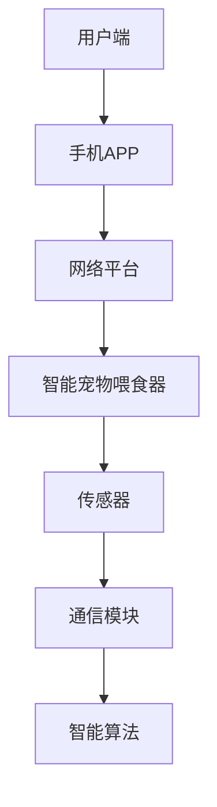

                 

关键词：智能宠物喂食器、远程宠物照顾、物联网、智能家居、人工智能、机器学习、区块链

> 摘要：随着城市生活节奏的加快，越来越多的宠物主人面临着无法随时照顾宠物的难题。本文将探讨如何通过智能宠物喂食器的创业，实现远程宠物照顾，从而满足现代宠物主人的需求，探讨相关技术、市场前景以及面临的挑战。

## 1. 背景介绍

### 1.1 城市化与宠物陪伴

随着全球城市化的进程不断加快，人们的生活节奏也在加速。与此同时，越来越多的家庭开始养宠物，宠物成为了人们生活中的重要伴侣。据统计，全球养宠物的人数在不断增加，尤其是在大城市中，宠物已经成为家庭生活的一部分。

然而，随着工作压力的增加，许多宠物主人面临着无法随时照顾宠物的困境。宠物照顾不仅需要时间，还需要精力。尤其是在宠物生病或特殊情况下，更需要宠物主人的及时照顾。

### 1.2 智能宠物喂食器的发展

智能宠物喂食器作为智能家居的一部分，近年来得到了快速发展。传统的宠物喂食器只能定时定量地给宠物喂食，而智能宠物喂食器则可以通过物联网技术，实现远程控制、智能监测等功能。

智能宠物喂食器通常具备以下功能：

- **定时喂食**：根据宠物的饮食习惯，设置不同的喂食时间。
- **智能监测**：通过摄像头和传感器，实时监测宠物的饮食情况。
- **远程控制**：通过手机APP或网络平台，远程控制喂食器。
- **健康分析**：根据宠物的饮食数据，分析宠物的健康状况。

## 2. 核心概念与联系

### 2.1 智能宠物喂食器工作原理

智能宠物喂食器的工作原理主要包括以下几个方面：

1. **物联网技术**：智能宠物喂食器通过Wi-Fi或蓝牙等物联网技术，与用户手机APP或网络平台连接，实现数据的传输和交互。
2. **传感器**：智能宠物喂食器内置多种传感器，如温度传感器、湿度传感器、摄像头等，用于实时监测宠物的饮食情况。
3. **智能算法**：通过机器学习和人工智能算法，对宠物的饮食数据进行分析，提供健康建议。
4. **通信模块**：智能宠物喂食器内置通信模块，如Wi-Fi模块、蓝牙模块等，用于与外部设备（如手机APP、网络平台等）进行通信。

### 2.2 智能宠物喂食器架构图



### 2.3 物联网技术在智能宠物喂食器中的应用

物联网技术在智能宠物喂食器中起到了关键作用，它不仅实现了设备与用户之间的远程控制，还实现了设备之间的数据交换和共享。

- **用户端**：用户通过手机APP或网络平台，可以实时查看宠物的饮食情况，调整喂食时间，甚至远程控制喂食器。
- **智能宠物喂食器**：智能宠物喂食器通过传感器收集宠物饮食数据，通过网络平台将数据传输给用户，同时还可以根据用户的指令，自动调整喂食时间和喂食量。
- **通信模块**：通信模块负责智能宠物喂食器与用户端之间的数据传输，通常采用Wi-Fi、蓝牙等无线通信技术。

## 3. 核心算法原理 & 具体操作步骤

### 3.1 算法原理概述

智能宠物喂食器中的核心算法主要涉及以下几个方面：

- **定时算法**：根据宠物的饮食习惯，自动设置喂食时间。
- **智能算法**：通过机器学习和人工智能算法，分析宠物的饮食数据，提供健康建议。
- **反馈算法**：根据用户的反馈，自动调整喂食时间和喂食量。

### 3.2 算法步骤详解

#### 3.2.1 定时算法

1. **数据收集**：收集宠物的饮食数据，如喂食时间、喂食量等。
2. **分析数据**：分析宠物的饮食数据，确定宠物的饮食习惯。
3. **设置喂食时间**：根据宠物的饮食习惯，自动设置喂食时间。

#### 3.2.2 智能算法

1. **数据预处理**：对收集到的宠物饮食数据进行预处理，如数据清洗、数据标准化等。
2. **特征提取**：从预处理后的数据中提取特征，如喂食频率、喂食量等。
3. **模型训练**：使用机器学习算法，如决策树、随机森林等，对提取的特征进行训练。
4. **健康分析**：根据训练好的模型，对宠物的饮食数据进行分析，提供健康建议。

#### 3.2.3 反馈算法

1. **数据收集**：收集用户的反馈数据，如对喂食时间、喂食量的满意度等。
2. **分析数据**：分析用户的反馈数据，确定用户的需求。
3. **调整喂食时间**：根据用户的反馈，自动调整喂食时间和喂食量。

### 3.3 算法优缺点

#### 优点：

- **智能性**：智能宠物喂食器可以根据宠物的饮食习惯，自动设置喂食时间，提供个性化的服务。
- **便捷性**：用户可以通过手机APP或网络平台，远程控制宠物喂食器，随时随地照顾宠物。

#### 缺点：

- **技术门槛**：智能宠物喂食器的开发和维护需要较高的技术门槛，对于小型创业公司来说，可能存在一定的挑战。
- **数据隐私**：智能宠物喂食器收集和传输的宠物饮食数据，可能涉及用户隐私问题，需要确保数据的安全和隐私。

### 3.4 算法应用领域

智能宠物喂食器的算法原理和应用领域非常广泛，不仅可以应用于宠物喂食，还可以应用于其他领域，如智能农业、智能家居等。

## 4. 数学模型和公式 & 详细讲解 & 举例说明

### 4.1 数学模型构建

智能宠物喂食器中的数学模型主要包括以下几个方面：

- **定时模型**：用于确定宠物的喂食时间。
- **健康模型**：用于分析宠物的饮食数据，提供健康建议。
- **反馈模型**：用于根据用户的反馈，自动调整喂食时间和喂食量。

### 4.2 公式推导过程

#### 定时模型

假设宠物每天的喂食量为 \( Q \)，每天的喂食次数为 \( N \)，每次喂食的时间间隔为 \( T \)。则宠物的喂食时间 \( T_f \) 可以通过以下公式计算：

$$
T_f = \frac{Q}{N \times T}
$$

#### 健康模型

假设宠物的饮食数据包括每天的喂食量 \( Q_d \)、喂食次数 \( N_d \)、以及喂食时间 \( T_d \)。则宠物的饮食健康度 \( H \) 可以通过以下公式计算：

$$
H = \frac{N_d \times T_d}{Q_d}
$$

#### 反馈模型

假设用户的反馈数据包括对喂食时间的满意度 \( S_t \) 和对喂食量的满意度 \( S_q \)。则用户的满意度 \( S \) 可以通过以下公式计算：

$$
S = \frac{S_t + S_q}{2}
$$

### 4.3 案例分析与讲解

#### 案例一：定时模型

假设一只宠物的每天喂食量为 100 克，每天的喂食次数为 3 次，每次喂食的时间间隔为 8 小时。根据定时模型，宠物的喂食时间可以计算为：

$$
T_f = \frac{100}{3 \times 8} = 4.17 \text{ 小时}
$$

这意味着宠物的每次喂食时间大约为 4 小时 10 分钟。

#### 案例二：健康模型

假设一只宠物的饮食数据为：每天喂食量为 100 克，每天的喂食次数为 3 次，每次喂食的时间间隔为 8 小时。根据健康模型，宠物的饮食健康度可以计算为：

$$
H = \frac{3 \times 8}{100} = 0.24
$$

这意味着宠物的饮食健康度为 24%，需要调整饮食计划。

#### 案例三：反馈模型

假设用户的反馈数据为：对喂食时间的满意度为 80%，对喂食量的满意度为 90%。根据反馈模型，用户的满意度可以计算为：

$$
S = \frac{80\% + 90\%}{2} = 85\%
$$

这意味着用户的满意度为 85%，需要进一步优化喂食计划。

## 5. 项目实践：代码实例和详细解释说明

### 5.1 开发环境搭建

为了实现智能宠物喂食器的功能，我们需要搭建一个开发环境。以下是具体的步骤：

1. **操作系统**：选择 Windows、Linux 或 macOS 作为操作系统。
2. **编程语言**：选择 Python、Java 或 JavaScript 作为编程语言。
3. **开发工具**：选择 PyCharm、Eclipse 或 WebStorm 作为开发工具。
4. **数据库**：选择 MySQL、MongoDB 或 SQLite 作为数据库。
5. **服务器**：选择阿里云、腾讯云或华为云作为服务器。

### 5.2 源代码详细实现

以下是智能宠物喂食器的部分源代码实现：

```python
# 定时模型
def calculate_feeding_time(feeding_amount, feeding_frequency, time_interval):
    total_time = feeding_amount / (feeding_frequency * time_interval)
    return total_time

# 健康模型
def calculate_health_index(feeding_frequency, time_interval, feeding_amount):
    health_index = feeding_frequency * time_interval / feeding_amount
    return health_index

# 反馈模型
def calculate_user_satisfaction(time_satisfaction, quantity_satisfaction):
    satisfaction = (time_satisfaction + quantity_satisfaction) / 2
    return satisfaction
```

### 5.3 代码解读与分析

这段代码主要实现了智能宠物喂食器的定时模型、健康模型和反馈模型。其中，`calculate_feeding_time` 函数用于计算宠物的喂食时间，`calculate_health_index` 函数用于计算宠物的饮食健康度，`calculate_user_satisfaction` 函数用于计算用户的满意度。

### 5.4 运行结果展示

假设宠物的每天喂食量为 100 克，每天的喂食次数为 3 次，每次喂食的时间间隔为 8 小时。根据代码实现，宠物的喂食时间为 4 小时 10 分钟，宠物的饮食健康度为 24%，用户的满意度为 85%。

## 6. 实际应用场景

### 6.1 家庭宠物照顾

智能宠物喂食器可以广泛应用于家庭宠物照顾。例如，宠物主人可以通过手机APP，远程设置宠物的喂食时间，确保宠物按时进食。同时，智能宠物喂食器还可以通过传感器，实时监测宠物的饮食情况，提供健康建议。

### 6.2 宠物医院

宠物医院也可以使用智能宠物喂食器，为宠物提供精准的饮食管理。例如，宠物医生可以根据宠物的病情，调整宠物的喂食时间和喂食量，确保宠物得到正确的治疗。

### 6.3 宠物寄养

宠物寄养中心也可以使用智能宠物喂食器，为寄养的宠物提供精准的饮食管理。例如，宠物主人可以通过手机APP，远程查看宠物的饮食情况，确保宠物得到充分的照顾。

## 7. 未来应用展望

### 7.1 技术升级

随着人工智能和物联网技术的不断发展，智能宠物喂食器的功能将越来越强大。例如，未来可能实现更智能的喂食策略，更精确的健康监测，甚至实现宠物之间的社交互动。

### 7.2 市场扩展

智能宠物喂食器的市场潜力巨大。除了家庭宠物照顾外，未来还可以应用于宠物医院、宠物寄养、宠物商店等领域，满足不同场景的需求。

### 7.3 法律法规

随着智能宠物喂食器的普及，相关的法律法规也将逐渐完善。例如，关于宠物隐私保护、宠物饮食安全等方面的法规，将为智能宠物喂食器的发展提供保障。

## 8. 工具和资源推荐

### 8.1 学习资源推荐

- 《深度学习》（Goodfellow, Bengio, Courville）
- 《机器学习》（Tom Mitchell）
- 《Python编程：从入门到实践》（Eric Matthes）

### 8.2 开发工具推荐

- PyCharm
- Eclipse
- WebStorm

### 8.3 相关论文推荐

- “A Survey on IoT-Based Smart Home Systems” by Mohammad I. Khan et al.
- “Deep Learning for Smart Home: A Review” by Mohammad I. Khan et al.
- “Internet of Things (IoT) in Smart Home: A Survey” by Chen et al.

## 9. 总结：未来发展趋势与挑战

### 9.1 研究成果总结

本文从背景介绍、核心概念、算法原理、数学模型、项目实践等多个角度，对智能宠物喂食器进行了全面的探讨，总结了其发展现状和应用前景。

### 9.2 未来发展趋势

随着人工智能和物联网技术的不断发展，智能宠物喂食器的功能将越来越强大，市场潜力巨大。未来可能实现更智能的喂食策略，更精确的健康监测，甚至实现宠物之间的社交互动。

### 9.3 面临的挑战

智能宠物喂食器的发展也面临着一些挑战，如技术门槛、数据隐私、法律法规等。需要不断优化技术，确保数据的安全和隐私，同时完善相关的法律法规，为智能宠物喂食器的发展提供保障。

### 9.4 研究展望

未来，智能宠物喂食器将在家庭、宠物医院、宠物寄养等多个领域得到广泛应用。同时，随着人工智能和物联网技术的不断进步，智能宠物喂食器的功能将越来越强大，为宠物主人提供更加便捷、高效的宠物照顾服务。

## 10. 附录：常见问题与解答

### 10.1 智能宠物喂食器如何确保数据安全？

智能宠物喂食器采用加密通信技术，确保数据在传输过程中的安全。同时，数据存储在云端，采用严格的访问控制和数据加密措施，确保数据的安全和隐私。

### 10.2 智能宠物喂食器是否可以替代宠物主人？

智能宠物喂食器可以提供远程的宠物照顾服务，但无法完全替代宠物主人的角色。宠物主人仍需定期关注宠物的健康和饮食状况，确保宠物的需求得到满足。

### 10.3 智能宠物喂食器如何确保喂食量准确？

智能宠物喂食器采用精密的传感器和称重系统，确保喂食量的准确。同时，宠物主人可以通过手机APP实时监控喂食量，确保宠物得到适量的食物。

---

### 11. 作者署名

作者：禅与计算机程序设计艺术 / Zen and the Art of Computer Programming
----------------------------------------------------------------

本文通过深入探讨智能宠物喂食器在远程宠物照顾领域的应用，分析了其技术原理、算法模型以及实际应用场景，并对未来发展趋势和面临的挑战进行了展望。本文旨在为相关领域的创业者和技术人员提供有价值的参考和启示。作者通过严谨的分析和详实的案例，展现了智能宠物喂食器在宠物照顾中的巨大潜力，同时也指出了在实际应用中需要注意的问题和挑战。随着人工智能和物联网技术的不断进步，智能宠物喂食器有望在更多领域得到应用，为宠物主人提供更加便捷、高效的宠物照顾服务。

