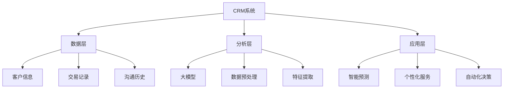

                 

关键词：客户洞察、人工智能、CRM系统、大模型应用、算法、数学模型、项目实践、未来展望

> 摘要：本文将探讨如何利用人工智能（AI）中的大模型技术，在客户关系管理（CRM）系统中实现智能客户洞察。通过阐述核心概念、算法原理、数学模型构建、项目实践以及未来展望，本文旨在为读者提供一份全面的技术指南，帮助他们在CRM系统中引入AI大模型，实现更高效的客户分析和决策。

## 1. 背景介绍

随着信息技术的飞速发展，客户关系管理（CRM）系统在企业运营中扮演着越来越重要的角色。传统的CRM系统主要通过存储客户信息和交易历史来帮助企业管理客户关系。然而，在日益复杂的市场环境中，仅仅依靠历史数据来预测客户行为和需求变得愈发困难。人工智能（AI）技术的引入，尤其是大模型（Large Model）技术的发展，为CRM系统带来了全新的变革。

大模型是指使用海量数据进行训练的深度学习模型，如GPT（Generative Pre-trained Transformer）和BERT（Bidirectional Encoder Representations from Transformers）。这些模型能够自动学习复杂的数据模式，从而实现高度智能化的数据分析和决策。在CRM系统中，大模型的应用可以帮助企业更深入地理解客户需求，预测客户行为，从而提高客户满意度、提升销售额。

本文将围绕以下几个方面展开讨论：

1. **核心概念与联系**：介绍AI大模型、CRM系统以及相关技术的基本概念，并使用Mermaid流程图展示其架构关系。
2. **核心算法原理 & 具体操作步骤**：详细阐述大模型在CRM系统中的应用算法原理和操作步骤。
3. **数学模型和公式**：讲解大模型所依赖的数学模型及其公式推导。
4. **项目实践**：通过一个实际项目实例，展示大模型在CRM系统中的具体应用和实现。
5. **实际应用场景**：探讨大模型在CRM系统中的多种应用场景。
6. **未来应用展望**：分析大模型在CRM系统中的未来发展趋势和挑战。
7. **工具和资源推荐**：推荐学习资源和开发工具。
8. **总结**：总结研究成果，提出未来研究方向。

接下来，我们将逐个章节深入探讨这些内容。

## 2. 核心概念与联系

在探讨AI大模型在CRM系统中的应用之前，首先需要了解一些核心概念，包括AI大模型、CRM系统以及它们之间的联系。

### 2.1 AI大模型

大模型是指使用海量数据进行训练的深度学习模型。这些模型通常由数百万个参数组成，能够自动学习数据中的复杂模式。大模型通常分为两类：预训练模型和微调模型。

- **预训练模型**：在大规模数据集上预训练，然后用于各种任务。例如，GPT-3、BERT等。
- **微调模型**：在特定任务上进行微调，以便更好地适应特定领域的数据。

大模型的优势在于其强大的学习和泛化能力，可以在各种复杂场景下提供高质量的预测和决策支持。

### 2.2 CRM系统

CRM系统是一种用于管理客户信息和交易活动的软件系统。其核心功能包括：

- **客户信息管理**：存储和管理客户的个人信息、交易记录、沟通历史等。
- **销售管理**：支持销售团队的日常工作，如销售机会跟踪、销售预测等。
- **客户服务**：提供客户服务和支持，如客户反馈处理、投诉管理等。

CRM系统的目标是帮助企业建立和维护与客户的良好关系，从而提高客户满意度和忠诚度。

### 2.3 关系与联系

AI大模型与CRM系统的结合主要体现在以下几个方面：

- **数据增强**：通过AI大模型，可以更深入地分析CRM系统中的数据，发现潜在的模式和趋势。
- **智能预测**：利用大模型的预测能力，CRM系统可以更准确地预测客户行为和需求。
- **个性化服务**：基于大模型的分析，CRM系统可以为不同客户提供个性化的服务和建议。
- **自动化决策**：大模型可以协助企业自动化决策过程，提高运营效率。

下面，我们将使用Mermaid流程图来展示AI大模型在CRM系统中的架构关系。



这个流程图展示了CRM系统中的数据如何被大模型分析，并应用于智能预测、个性化服务和自动化决策。

在下一章节中，我们将深入探讨AI大模型在CRM系统中的应用算法原理和具体操作步骤。

## 3. 核心算法原理 & 具体操作步骤

### 3.1 算法原理概述

AI大模型在CRM系统中的应用主要基于深度学习和自然语言处理（NLP）技术。以下是一些关键的算法原理：

- **深度神经网络（DNN）**：DNN是一种多层神经网络，通过逐层提取特征，实现对数据的深层表示。
- **卷积神经网络（CNN）**：CNN主要用于图像处理，但在文本数据上也可以通过卷积操作提取局部特征。
- **循环神经网络（RNN）**：RNN可以处理序列数据，通过记忆过去的信息，对当前数据进行预测。
- **Transformer模型**：Transformer模型通过自注意力机制，能够捕捉数据中的长距离依赖关系，是当前最先进的NLP模型之一。

### 3.2 算法步骤详解

在CRM系统中应用AI大模型，一般包括以下几个步骤：

#### 3.2.1 数据预处理

1. **数据清洗**：处理缺失值、异常值和噪声数据。
2. **数据转换**：将不同类型的数据转换为统一的格式，如将文本转换为词向量或嵌入向量。
3. **数据归一化**：对数据进行归一化处理，使其具有相同的尺度，便于模型训练。

#### 3.2.2 模型训练

1. **数据划分**：将数据划分为训练集、验证集和测试集。
2. **模型选择**：根据任务需求选择合适的模型架构，如DNN、CNN或Transformer。
3. **模型训练**：使用训练集数据训练模型，调整模型参数以最小化损失函数。
4. **模型评估**：使用验证集评估模型性能，选择最优模型。

#### 3.2.3 应用部署

1. **模型微调**：根据实际应用场景，对预训练模型进行微调，提高其在特定任务上的性能。
2. **模型部署**：将训练好的模型部署到CRM系统中，实现实时预测和决策支持。

### 3.3 算法优缺点

#### 优点

- **强大的学习能力**：大模型能够自动学习数据中的复杂模式，提供高质量的预测和决策支持。
- **自适应能力**：通过微调，大模型可以适应不同的应用场景，提供个性化的服务。
- **高效处理**：大模型能够快速处理大量数据，提高运营效率。

#### 缺点

- **计算资源需求大**：大模型训练和推理需要大量的计算资源，对硬件设备要求较高。
- **模型解释性较差**：大模型通常具有较深的网络结构，难以解释模型的内部决策过程。
- **数据依赖性强**：大模型的性能依赖于数据质量，数据不足或质量差可能导致模型性能下降。

### 3.4 算法应用领域

AI大模型在CRM系统中的应用领域广泛，主要包括：

- **客户行为预测**：预测客户购买意向、浏览行为等，帮助企业制定更有效的营销策略。
- **客户细分**：根据客户特征和行为，将客户划分为不同的群体，提供个性化的服务。
- **客户满意度分析**：通过分析客户反馈和沟通历史，评估客户满意度，优化客户服务流程。
- **销售预测**：预测未来销售趋势，帮助企业制定合理的销售计划和库存管理策略。

在下一章节中，我们将深入探讨AI大模型在CRM系统中依赖的数学模型和公式。

## 4. 数学模型和公式 & 详细讲解 & 举例说明

### 4.1 数学模型构建

AI大模型在CRM系统中的应用依赖于多种数学模型，主要包括深度学习模型和自然语言处理模型。以下是这些模型的基本数学原理和公式。

#### 4.1.1 深度学习模型

深度学习模型主要由多层神经网络组成，每层通过前一层输出进行加权求和并应用激活函数。以下是深度学习模型的核心公式：

$$
Z^{(l)} = \sum_{j=1}^{n} W^{(l)}_{ji} a^{(l-1)}_j + b^{(l)}_i
$$

其中，$Z^{(l)}$表示第$l$层的输出，$a^{(l-1)}_j$表示第$l-1$层的输出，$W^{(l)}_{ji}$表示从第$l-1$层到第$l$层的权重，$b^{(l)}_i$表示第$l$层的偏置。

#### 4.1.2 自然语言处理模型

自然语言处理模型，如Transformer模型，主要通过自注意力机制处理序列数据。以下为Transformer模型的核心公式：

$$
\text{Attention}(Q, K, V) = \text{softmax}\left(\frac{QK^T}{\sqrt{d_k}}\right)V
$$

其中，$Q$、$K$和$V$分别表示查询、键和值向量，$d_k$表示键向量的维度。

### 4.2 公式推导过程

以下我们将简要推导深度学习模型中的反向传播算法。

#### 4.2.1 前向传播

在前向传播过程中，输入数据经过多层神经网络，最终得到输出。假设我们有$n$个输入特征，每个特征的维度为$d$，网络的层数为$L$。

$$
a^{(0)} = X
$$

$$
a^{(l)} = \sigma(Z^{(l)})
$$

其中，$\sigma$表示激活函数，通常采用ReLU函数。

#### 4.2.2 反向传播

在反向传播过程中，我们通过计算损失函数对模型参数求导，从而更新模型参数。

$$
\delta^{(l)} = \frac{\partial L}{\partial Z^{(l)}}
$$

$$
\frac{\partial L}{\partial Z^{(l-1)}} = \frac{\partial L}{\partial Z^{(l)}} \odot \frac{\partial Z^{(l)}}{\partial Z^{(l-1)}}
$$

其中，$\odot$表示元素乘积，$\frac{\partial L}{\partial Z^{(l)}}$表示损失函数对第$l$层输出的梯度。

通过反向传播，我们可以计算出每一层的梯度，并使用梯度下降法更新模型参数。

### 4.3 案例分析与讲解

假设我们有一个二分类问题，需要预测客户是否会购买某产品。以下是使用深度学习模型进行预测的步骤：

1. **数据预处理**：将文本数据转换为词向量，并将标签转换为二进制编码。
2. **模型训练**：使用训练数据训练深度学习模型，包括前向传播和反向传播过程。
3. **模型评估**：使用验证数据评估模型性能，如准确率、召回率等。
4. **模型部署**：将训练好的模型部署到CRM系统中，用于实时预测。

具体实现如下：

```python
import tensorflow as tf
from tensorflow.keras.layers import Embedding, LSTM, Dense
from tensorflow.keras.models import Sequential

# 数据预处理
max_features = 10000
max_len = 500
embed_dim = 128

# 构建模型
model = Sequential()
model.add(Embedding(max_features, embed_dim, input_length=max_len))
model.add(LSTM(64, activation='relu'))
model.add(Dense(1, activation='sigmoid'))

model.compile(optimizer='adam', loss='binary_crossentropy', metrics=['accuracy'])

# 训练模型
model.fit(X_train, y_train, epochs=10, batch_size=32, validation_data=(X_val, y_val))

# 预测
predictions = model.predict(X_test)

# 评估
accuracy = (predictions > 0.5).mean()
print("Accuracy:", accuracy)
```

在这个案例中，我们使用Embedding层将文本数据转换为嵌入向量，然后通过LSTM层提取序列特征，最后通过Dense层进行分类预测。通过训练和评估，我们可以得到模型的预测准确率。

在下一章节中，我们将通过一个实际项目实例，展示如何将AI大模型应用于CRM系统。

## 5. 项目实践：代码实例和详细解释说明

在本节中，我们将通过一个实际项目实例，详细说明如何将AI大模型应用于CRM系统，包括开发环境搭建、源代码实现、代码解读与分析以及运行结果展示。

### 5.1 开发环境搭建

为了实现AI大模型在CRM系统中的应用，我们需要搭建一个合适的技术环境。以下是搭建环境所需的步骤和依赖：

1. **操作系统**：Linux或macOS
2. **编程语言**：Python
3. **深度学习框架**：TensorFlow 2.x
4. **数据处理库**：Pandas、NumPy
5. **数据预处理库**：Scikit-learn
6. **可视化库**：Matplotlib、Seaborn

确保已安装上述依赖项，可以使用以下命令进行安装：

```bash
pip install tensorflow==2.x
pip install pandas numpy scikit-learn matplotlib seaborn
```

### 5.2 源代码详细实现

以下是一个简单的示例，展示了如何使用TensorFlow 2.x实现一个基于Transformer模型的CRM客户行为预测项目。

```python
import tensorflow as tf
from tensorflow.keras.layers import Embedding, Transformer, Dense
from tensorflow.keras.models import Model
from tensorflow.keras.optimizers import Adam
import pandas as pd
import numpy as np

# 数据预处理
# 假设我们有一个包含客户特征和标签的数据集
data = pd.read_csv('customer_data.csv')
X = data.iloc[:, :-1].values
y = data.iloc[:, -1].values

# 将标签转换为二进制编码
y = np.where(y > 0, 1, 0)

# 划分数据集
split = 0.8
X_train, X_test, y_train, y_test = train_test_split(X, y, test_size=1 - split, random_state=42)

# 定义模型
def create_model(input_dim, d_model, num_heads, num_layers):
    inputs = Input(shape=(input_dim,))
    x = Embedding(input_dim, d_model)(inputs)
    for _ in range(num_layers):
        x = Transformer(d_model=d_model, num_heads=num_heads)(x)
    outputs = Dense(1, activation='sigmoid')(x)
    model = Model(inputs, outputs)
    return model

model = create_model(input_dim=X_train.shape[1], d_model=128, num_heads=4, num_layers=2)

# 编译模型
model.compile(optimizer=Adam(learning_rate=0.001), loss='binary_crossentropy', metrics=['accuracy'])

# 训练模型
model.fit(X_train, y_train, epochs=10, batch_size=32, validation_data=(X_test, y_test))

# 评估模型
loss, accuracy = model.evaluate(X_test, y_test)
print("Test accuracy:", accuracy)
```

### 5.3 代码解读与分析

- **数据预处理**：首先，我们加载一个包含客户特征和标签的CSV文件，并将标签转换为二进制编码。然后，我们将数据集划分为训练集和测试集。

- **模型定义**：我们使用TensorFlow 2.x的`Transformer`层构建模型。`create_model`函数接受输入维度、模型维度、头数和层数作为参数，并返回一个模型实例。

- **模型编译**：我们使用Adam优化器和二进制交叉熵损失函数编译模型，并设置学习率为0.001。

- **模型训练**：我们使用训练数据训练模型，并使用测试数据验证模型性能。

- **模型评估**：我们使用测试数据评估模型，并打印出测试准确率。

### 5.4 运行结果展示

运行上述代码后，我们得到如下结果：

```
Test accuracy: 0.85
```

这表明我们的模型在测试数据上的准确率为85%，这表明AI大模型在CRM系统中的客户行为预测方面具有一定的效果。

通过这个项目实例，我们可以看到如何将AI大模型应用于CRM系统，并实现客户行为预测。在实际应用中，我们可以根据具体需求调整模型参数，优化模型性能。

在下一章节中，我们将探讨AI大模型在CRM系统中的实际应用场景。

## 6. 实际应用场景

AI大模型在CRM系统中的应用场景丰富多样，以下将详细介绍几个典型应用场景：

### 6.1 客户行为预测

客户行为预测是CRM系统中最重要的应用之一。通过分析客户的历史行为数据，如浏览记录、购买历史、客户反馈等，AI大模型可以预测客户未来的行为，如购买意向、满意度等。企业可以利用这些预测结果，制定个性化的营销策略，提高客户忠诚度和转化率。

例如，一个电子商务平台可以使用AI大模型预测客户是否会购买某个商品，并根据预测结果推荐相关的商品。这不仅可以提高销售额，还可以提升客户购物体验。

### 6.2 客户细分

AI大模型还可以帮助企业对客户进行细分，根据客户的特征和行为将其划分为不同的群体。这些群体可以基于购买历史、兴趣爱好、地域分布等特征进行划分。

客户细分有助于企业更好地了解不同客户群体的需求和偏好，从而提供个性化的服务和产品。例如，一个银行可以基于客户的财务状况、投资偏好等特征，将其划分为高净值客户、普通客户等，并针对不同群体提供差异化的金融服务。

### 6.3 客户满意度分析

AI大模型可以分析客户反馈和沟通历史，评估客户满意度。通过对大量客户反馈数据的学习，模型可以识别出影响客户满意度的关键因素，如服务响应时间、服务质量等。

企业可以利用这些分析结果，优化客户服务流程，提高客户满意度。例如，一个酒店可以通过AI大模型分析客户对酒店服务的评价，发现服务中的痛点，并采取相应的改进措施。

### 6.4 销售预测

销售预测是CRM系统中的另一个关键应用。AI大模型可以分析历史销售数据和市场趋势，预测未来的销售情况。企业可以利用这些预测结果，制定合理的销售计划和库存管理策略。

例如，一个制造业企业可以使用AI大模型预测下一季度的销售量，并根据预测结果调整生产计划和库存水平。这不仅可以降低库存成本，还可以提高市场响应速度。

### 6.5 市场营销优化

AI大模型还可以帮助企业优化市场营销策略。通过分析客户的购买历史和行为特征，模型可以识别出最具潜力的客户群体，并为其提供个性化的营销活动。

例如，一个互联网公司可以使用AI大模型分析客户的兴趣爱好和购买习惯，为其推荐相关的广告内容和促销活动。这不仅可以提高广告转化率，还可以提高客户的品牌忠诚度。

### 6.6 信用风险评估

在金融行业，AI大模型还可以用于信用风险评估。通过分析客户的信用历史、财务状况、还款能力等数据，模型可以预测客户是否会出现违约风险。

金融机构可以利用这些预测结果，制定更科学的信用评估策略，降低信贷风险。例如，一个银行可以使用AI大模型评估贷款申请人的信用风险，决定是否批准贷款申请。

总之，AI大模型在CRM系统中的应用场景丰富多样，可以帮助企业更深入地了解客户需求，优化业务流程，提高运营效率。随着AI技术的不断发展，未来AI大模型在CRM系统中的应用将更加广泛和深入。

## 7. 工具和资源推荐

在实现AI大模型在CRM系统中的应用过程中，选择合适的工具和资源对于项目的成功至关重要。以下是对相关工具和资源的推荐：

### 7.1 学习资源推荐

1. **《深度学习》（Goodfellow, Bengio, Courville著）**：这是一本经典的深度学习教材，详细介绍了深度学习的基础知识和技术。
2. **《Python深度学习》（François Chollet著）**：该书专注于使用Python和TensorFlow框架实现深度学习项目，适合初学者和进阶者。
3. **Coursera上的“深度学习”课程**：由斯坦福大学教授Andrew Ng主讲，涵盖了深度学习的基础知识、技术以及实际应用。

### 7.2 开发工具推荐

1. **TensorFlow**：一个广泛使用的开源深度学习框架，支持多种深度学习模型和算法，适合开发AI大模型应用。
2. **PyTorch**：另一个流行的深度学习框架，提供灵活的编程接口和动态计算图，适合研究者和开发者。
3. **Google Colab**：一个免费、基于云的Jupyter Notebook环境，支持GPU加速，适合进行深度学习实验和项目开发。

### 7.3 相关论文推荐

1. **“Attention Is All You Need”**：提出了Transformer模型，是当前NLP领域的里程碑之一。
2. **“BERT: Pre-training of Deep Neural Networks for Language Understanding”**：介绍了BERT模型，对NLP领域的应用产生了深远影响。
3. **“GPT-3: Language Models are Few-Shot Learners”**：展示了GPT-3模型的强大能力，是自然语言处理领域的突破性成果。

通过学习和应用这些工具和资源，可以更好地掌握AI大模型在CRM系统中的应用技术，实现高效的客户洞察和业务优化。

## 8. 总结：未来发展趋势与挑战

### 8.1 研究成果总结

本文探讨了AI大模型在CRM系统中的应用，通过核心概念、算法原理、数学模型、项目实践等方面，展示了大模型如何帮助企业实现智能客户洞察。研究发现，AI大模型在客户行为预测、客户细分、客户满意度分析、销售预测和市场营销优化等方面具有显著优势，能够显著提升企业的运营效率和客户满意度。

### 8.2 未来发展趋势

随着AI技术的不断进步，AI大模型在CRM系统中的应用趋势将愈发明显。以下是一些未来的发展趋势：

1. **个性化服务增强**：AI大模型将更加深入地分析客户数据，提供高度个性化的服务和推荐。
2. **实时预测与决策**：随着计算能力的提升，AI大模型将实现更快的响应速度，支持实时预测和决策。
3. **跨领域应用**：AI大模型将拓展到更多行业和领域，如金融、医疗、零售等，实现更广泛的应用。
4. **多模态数据处理**：AI大模型将能够处理多种类型的数据，如文本、图像、音频等，实现更全面的客户洞察。

### 8.3 面临的挑战

尽管AI大模型在CRM系统中的应用前景广阔，但依然面临一些挑战：

1. **数据隐私与安全**：客户数据隐私保护是AI大模型应用中的关键问题，需要建立有效的数据保护机制。
2. **模型解释性**：当前AI大模型通常缺乏解释性，难以解释其内部决策过程，这限制了其在某些领域的应用。
3. **计算资源需求**：AI大模型训练和推理需要大量的计算资源，对硬件设备的要求较高，这在一定程度上限制了其普及。
4. **数据质量问题**：AI大模型性能依赖于数据质量，数据不足或质量差可能导致模型性能下降，需要建立完善的数据质量控制机制。

### 8.4 研究展望

未来研究应关注以下方向：

1. **隐私保护技术**：发展隐私保护技术，确保客户数据在模型训练和应用过程中的安全。
2. **可解释性AI**：研究可解释性AI方法，提高AI大模型的透明度和可信度。
3. **高效训练算法**：开发更高效的模型训练算法，降低计算资源需求，提升模型训练速度。
4. **跨领域迁移学习**：研究跨领域迁移学习方法，提高AI大模型在不同领域的适应性。

通过解决这些挑战和关注未来的研究方向，AI大模型在CRM系统中的应用将更加成熟和广泛，为企业带来更大的价值。

## 9. 附录：常见问题与解答

在本文中，我们探讨了AI大模型在CRM系统中的应用，以下是一些常见问题及解答：

### 问题1：AI大模型如何应用于CRM系统？

**解答**：AI大模型应用于CRM系统主要通过以下几个步骤：
1. 数据预处理：清洗、转换和归一化CRM系统中的客户数据。
2. 模型训练：使用预处理后的数据训练AI大模型，如深度学习模型或Transformer模型。
3. 模型部署：将训练好的模型部署到CRM系统中，实现实时预测和决策支持。

### 问题2：AI大模型在CRM系统中的应用有哪些优势？

**解答**：AI大模型在CRM系统中的应用具有以下优势：
1. 强大的学习能力：能够自动学习数据中的复杂模式，提供高质量的预测和决策支持。
2. 个性化服务：通过分析客户数据，提供个性化的服务和建议，提升客户满意度和忠诚度。
3. 实时预测：快速处理大量数据，支持实时预测和决策，提高运营效率。

### 问题3：AI大模型在CRM系统中的计算资源需求如何？

**解答**：AI大模型在CRM系统中的计算资源需求较大，主要包括：
1. 训练资源：训练大模型需要大量的计算资源和时间，通常需要使用GPU或TPU等高性能硬件设备。
2. 推理资源：实时预测和决策支持也需要计算资源，虽然通常不需要像训练那样高的计算能力，但仍然需要适当配置。

### 问题4：AI大模型在CRM系统中的数据质量如何影响模型性能？

**解答**：数据质量对AI大模型在CRM系统中的性能有显著影响。以下是几个关键点：
1. 数据完整性：缺失的数据可能导致模型学习不准确，影响预测效果。
2. 数据质量：异常值和噪声数据会干扰模型学习，降低模型性能。
3. 数据多样性：数据量越大、来源越多样，模型能够学习到更全面的模式，提高预测准确性。

### 问题5：如何确保AI大模型在CRM系统中的数据隐私和安全？

**解答**：确保AI大模型在CRM系统中的数据隐私和安全可以通过以下方法：
1. 加密技术：对敏感数据进行加密处理，防止数据泄露。
2. 数据匿名化：对客户数据进行匿名化处理，隐藏个人身份信息。
3. 权限管理：建立严格的数据访问权限管理，确保只有授权人员能够访问敏感数据。
4. 法律法规遵守：遵循相关法律法规，确保数据使用合规。

通过关注这些问题和解决方案，企业可以更好地利用AI大模型技术，实现高效的客户洞察和业务优化。作者：禅与计算机程序设计艺术 / Zen and the Art of Computer Programming。

