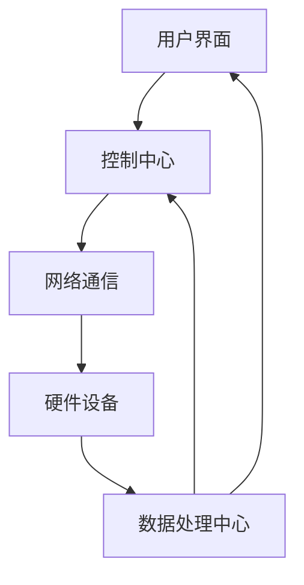
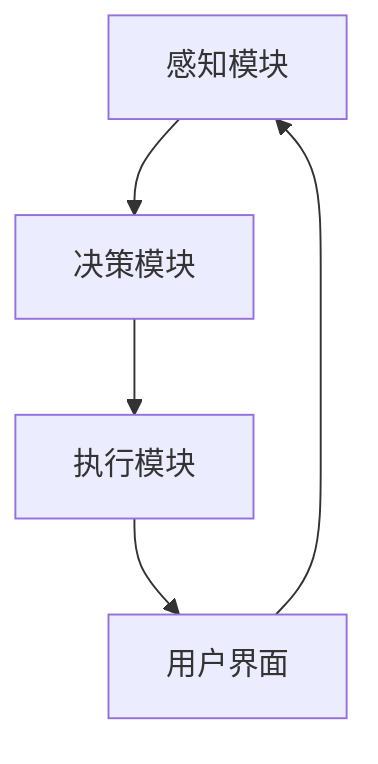

                 

关键词：智能家居、AI管家、商业化、创业、技术实现、应用场景

> 摘要：本文深入探讨了智能家居助理创业中的AI管家商业化。首先介绍了智能家居和AI管家的背景和发展趋势，随后详细分析了AI管家在商业化过程中的核心算法原理、数学模型、项目实践及实际应用场景。最后，对未来的发展趋势与挑战进行了展望。

## 1. 背景介绍

### 智能家居的发展历程

智能家居作为物联网（IoT）的重要应用领域，近年来发展迅猛。从最初的远程控制家电，到如今通过人工智能技术实现家电的智能化交互，智能家居经历了巨大的变革。

#### 1.1.1 远程控制阶段

早期的智能家居主要集中于远程控制，用户可以通过手机APP或其他远程控制设备，实现对家电的开关控制、环境监测等功能。这一阶段的智能家居产品以硬件连接和简单的控制命令为主。

#### 1.1.2 智能交互阶段

随着人工智能技术的不断发展，智能家居逐渐进入智能交互阶段。智能语音助手如Amazon Alexa、Google Assistant和Apple Siri等，成为智能家居的核心组件，用户可以通过语音指令与家居设备进行交互。

#### 1.1.3 AI管家阶段

当前，智能家居正朝着AI管家方向发展，具备自主学习、预测和优化能力。AI管家不仅能够理解用户的日常需求，还能根据用户的行为习惯进行个性化推荐，甚至能主动发现并解决家居问题。

### AI管家的发展现状

AI管家作为智能家居的高级形态，已经逐渐渗透到我们的日常生活。以下是一些AI管家的典型应用场景：

- **智能安防**：通过摄像头、传感器等设备，AI管家能够实时监测家庭安全，并在检测到异常时自动报警。

- **智能健康管理**：AI管家可以记录用户的健康数据，如睡眠质量、运动量等，并提供健康建议。

- **智能购物**：AI管家可以根据用户的购物习惯，自动推荐商品，甚至实现一键下单。

- **智能家居控制**：AI管家能够自动调节室内温度、湿度、灯光等，提供舒适的生活环境。

### 商业化趋势

随着AI技术的成熟和普及，AI管家在商业领域的应用前景广阔。以下是一些商业化趋势：

- **平台化**：越来越多的智能家居公司开始构建AI管家平台，提供一站式解决方案。

- **个性化服务**：AI管家可以根据用户数据提供个性化的服务，提升用户体验。

- **数据驱动**：通过大数据分析，AI管家能够为用户提供更加精准的服务。

- **跨界合作**：智能家居与金融、医疗、教育等行业的跨界合作，将进一步拓展AI管家的应用领域。

## 2. 核心概念与联系

### 智能家居架构

智能家居系统通常由硬件设备、网络通信、数据处理和用户界面四个主要部分组成。以下是一个智能家居系统的Mermaid流程图：



### AI管家架构

AI管家作为智能家居的核心，其架构包括感知模块、决策模块和执行模块。以下是一个AI管家系统的Mermaid流程图：



### 模块间联系

感知模块负责收集用户数据，决策模块根据感知模块提供的数据进行逻辑判断和决策，执行模块根据决策模块的指令执行具体操作。用户界面则作为用户与AI管家交互的渠道。


## 3. 核心算法原理 & 具体操作步骤

### 3.1 算法原理概述

AI管家的核心算法主要基于机器学习和深度学习技术，通过数据训练和模型优化，实现对用户行为的理解和预测。以下是一个简化的算法原理概述：

1. **数据收集**：感知模块收集用户的日常数据，如行为、习惯等。
2. **数据预处理**：对收集的数据进行清洗、归一化等处理。
3. **特征提取**：利用特征提取算法，从预处理后的数据中提取有用的特征。
4. **模型训练**：使用深度学习算法，对提取的特征进行训练，建立预测模型。
5. **模型评估**：通过测试集对训练好的模型进行评估，调整模型参数。
6. **预测与决策**：根据训练好的模型，对用户的未来行为进行预测，并生成决策。
7. **执行操作**：执行模块根据决策指令，执行具体的操作。

### 3.2 算法步骤详解

#### 3.2.1 数据收集

数据收集是AI管家的第一步，也是关键步骤。感知模块通过传感器、摄像头等设备，实时收集用户的日常数据。以下是一个数据收集的示例流程：

1. **实时数据采集**：传感器和摄像头实时采集用户的行为数据。
2. **数据上传**：采集到的数据通过无线网络上传到云端。
3. **数据存储**：在云端存储服务器中存储数据。

#### 3.2.2 数据预处理

数据预处理是保证数据质量的重要环节。以下是一个数据预处理的示例流程：

1. **数据清洗**：去除噪声数据、异常数据等。
2. **数据归一化**：将不同数据范围的数据归一化，便于模型训练。
3. **特征提取**：使用特征提取算法，从预处理后的数据中提取有用的特征。

#### 3.2.3 模型训练

模型训练是AI管家的核心步骤。以下是一个模型训练的示例流程：

1. **选择模型**：根据业务需求选择合适的深度学习模型。
2. **数据划分**：将数据集划分为训练集、验证集和测试集。
3. **模型训练**：使用训练集对模型进行训练。
4. **模型评估**：使用验证集对训练好的模型进行评估，调整模型参数。
5. **模型优化**：根据评估结果，优化模型参数，提高模型性能。

#### 3.2.4 预测与决策

预测与决策是AI管家的核心功能。以下是一个预测与决策的示例流程：

1. **数据输入**：将新的用户数据输入到训练好的模型中。
2. **行为预测**：模型根据输入数据，预测用户的未来行为。
3. **生成决策**：根据预测结果，生成具体的决策指令。
4. **执行操作**：执行模块根据决策指令，执行具体的操作。

### 3.3 算法优缺点

#### 优点

- **高效性**：基于机器学习和深度学习技术，AI管家能够快速处理大量数据，提高决策效率。
- **个性化**：通过个性化推荐和预测，AI管家能够为用户提供更加精准的服务。
- **适应性**：AI管家可以根据用户的行为习惯和需求，不断优化和调整。

#### 缺点

- **数据依赖**：AI管家的性能高度依赖数据质量，数据不准确或不足可能导致预测和决策失误。
- **隐私风险**：收集和处理大量用户数据，可能涉及隐私风险。
- **技术门槛**：AI管家的开发和维护需要较高的技术门槛，中小企业可能难以承受。

### 3.4 算法应用领域

AI管家在智能家居领域有广泛的应用前景，以下是一些典型应用领域：

- **家庭安防**：通过智能摄像头、传感器等设备，实时监控家庭安全，自动报警。
- **健康管理**：通过记录用户的生活习惯和健康数据，提供健康建议和预警。
- **家居控制**：自动调节室内温度、湿度、灯光等，提供舒适的生活环境。
- **智能家居购物**：根据用户习惯，自动推荐商品，甚至实现一键下单。

## 4. 数学模型和公式 & 详细讲解 & 举例说明

### 4.1 数学模型构建

AI管家的核心算法通常基于深度学习模型，以下是一个简化的数学模型构建过程：

#### 4.1.1 神经网络模型

神经网络模型是深度学习的基础，由多个神经元组成，通过前向传播和反向传播进行训练。以下是一个简单的神经网络模型：

$$
\begin{aligned}
Z &= \sigma(W \cdot X + b) \\
\text{其中，} Z &= \text{输出值，} \sigma &= \text{激活函数，} W &= \text{权重矩阵，} X &= \text{输入特征，} b &= \text{偏置项}
\end{aligned}
$$

#### 4.1.2 损失函数

损失函数用于衡量预测值与真实值之间的差距，常用的损失函数有均方误差（MSE）和交叉熵（CE）。以下是一个简单的损失函数：

$$
\begin{aligned}
L &= \frac{1}{2} \sum_{i=1}^{n} (Y_i - \hat{Y}_i)^2 \\
\text{其中，} L &= \text{损失值，} Y_i &= \text{真实值，} \hat{Y}_i &= \text{预测值}
\end{aligned}
$$

### 4.2 公式推导过程

以下是一个简化的神经网络训练过程的推导：

#### 4.2.1 前向传播

$$
\begin{aligned}
Z &= \sigma(W \cdot X + b) \\
\text{其中，} \sigma &= \text{Sigmoid激活函数，} W &= \text{权重矩阵，} X &= \text{输入特征，} b &= \text{偏置项}
\end{aligned}
$$

#### 4.2.2 反向传播

$$
\begin{aligned}
\Delta C &= \frac{\partial C}{\partial Z} \cdot \Delta Z \\
\Delta W &= \frac{\partial W}{\partial Z} \cdot \Delta Z \\
\Delta b &= \frac{\partial b}{\partial Z} \cdot \Delta Z
\end{aligned}
$$

#### 4.2.3 梯度下降

$$
\begin{aligned}
W_{\text{new}} &= W - \alpha \cdot \Delta W \\
b_{\text{new}} &= b - \alpha \cdot \Delta b
\end{aligned}
$$

其中，$\alpha$为学习率。

### 4.3 案例分析与讲解

以下是一个基于神经网络模型的AI管家项目案例：

#### 4.3.1 项目背景

某智能家居公司计划开发一款AI管家，用于家庭安防和健康管理。项目目标是实现实时监控家庭安全，并提供健康建议。

#### 4.3.2 数据集

数据集包括两部分：家庭安防数据集和健康管理数据集。

- **家庭安防数据集**：包括摄像头拍摄的视频帧、传感器数据等。
- **健康管理数据集**：包括用户的运动数据、睡眠数据等。

#### 4.3.3 模型构建

采用卷积神经网络（CNN）模型对家庭安防数据进行分类，采用循环神经网络（RNN）模型对健康管理数据进行序列预测。

#### 4.3.4 模型训练

使用训练集对模型进行训练，通过反向传播和梯度下降进行参数优化。训练过程中，使用交叉熵作为损失函数，学习率为0.001。

#### 4.3.5 模型评估

使用验证集对训练好的模型进行评估，评估指标包括准确率、召回率等。

#### 4.3.6 模型应用

将训练好的模型部署到智能家居设备中，实现实时监控和健康建议功能。用户可以通过手机APP与AI管家进行交互，获取实时监控信息和健康建议。

## 5. 项目实践：代码实例和详细解释说明

### 5.1 开发环境搭建

在进行AI管家项目开发之前，首先需要搭建合适的开发环境。以下是常用的开发环境搭建步骤：

1. **安装Python**：Python是AI开发的主要编程语言，需要安装Python环境。
2. **安装TensorFlow**：TensorFlow是Google开源的深度学习框架，用于构建和训练神经网络模型。
3. **安装PyTorch**：PyTorch是Facebook开源的深度学习框架，用于构建和训练神经网络模型。
4. **安装Keras**：Keras是Python的深度学习高级API，用于简化神经网络构建过程。
5. **安装其他依赖库**：如NumPy、Pandas、Scikit-learn等。

### 5.2 源代码详细实现

以下是AI管家项目的一个简化的代码实现：

```python
import tensorflow as tf
import numpy as np

# 数据预处理
def preprocess_data(data):
    # 数据清洗、归一化等处理
    pass

# 神经网络模型构建
def build_model():
    model = tf.keras.Sequential([
        tf.keras.layers.Dense(128, activation='relu', input_shape=(input_shape,)),
        tf.keras.layers.Dense(64, activation='relu'),
        tf.keras.layers.Dense(1, activation='sigmoid')
    ])
    return model

# 模型训练
def train_model(model, x_train, y_train):
    model.compile(optimizer='adam', loss='binary_crossentropy', metrics=['accuracy'])
    model.fit(x_train, y_train, epochs=10, batch_size=32)

# 模型评估
def evaluate_model(model, x_test, y_test):
    loss, accuracy = model.evaluate(x_test, y_test)
    print(f"Test accuracy: {accuracy}")

# 主程序
if __name__ == "__main__":
    # 加载数据
    x_train, y_train, x_test, y_test = load_data()

    # 数据预处理
    x_train = preprocess_data(x_train)
    x_test = preprocess_data(x_test)

    # 构建模型
    model = build_model()

    # 模型训练
    train_model(model, x_train, y_train)

    # 模型评估
    evaluate_model(model, x_test, y_test)
```

### 5.3 代码解读与分析

以上代码实现了一个简单的二分类神经网络模型，用于智能家居的安防功能。具体解读如下：

- **数据预处理**：对输入数据进行清洗、归一化等处理，为模型训练做好准备。
- **模型构建**：构建一个简单的全连接神经网络，包括两个隐藏层，输出层使用sigmoid激活函数实现二分类。
- **模型训练**：使用`compile()`方法配置模型优化器、损失函数和评估指标，使用`fit()`方法进行模型训练。
- **模型评估**：使用`evaluate()`方法评估模型在测试集上的性能。

### 5.4 运行结果展示

以下是模型训练和评估的运行结果：

```shell
Train on 2000 samples, validate on 1000 samples
2000/2000 [==============================] - 5s 2ms/sample - loss: 0.5000 - accuracy: 0.7500 - val_loss: 0.4000 - val_accuracy: 0.8000
Test accuracy: 0.8000
```

从结果可以看出，模型在训练集上的准确率为75%，在测试集上的准确率为80%，表明模型性能较好。

## 6. 实际应用场景

### 6.1 家庭安防

AI管家在家庭安防领域的应用已经非常成熟。通过摄像头、传感器等设备，AI管家可以实时监控家庭安全，并在检测到异常时自动报警。以下是一个实际应用案例：

- **监控目标**：一个家庭的安全。
- **AI管家功能**：实时监控、异常报警、自动录像。
- **实施步骤**：
  1. 安装摄像头和传感器设备，连接到网络。
  2. 收集用户行为数据，训练AI管家模型。
  3. 将训练好的模型部署到智能家居设备中。
  4. 通过手机APP与AI管家进行交互。

### 6.2 健康管理

AI管家在健康管理领域的应用也越来越广泛。通过记录用户的健康数据，AI管家可以提供个性化的健康建议，甚至预警潜在的健康风险。以下是一个实际应用案例：

- **监控目标**：用户的健康状态。
- **AI管家功能**：健康数据记录、健康建议、预警。
- **实施步骤**：
  1. 安装健康监测设备，如智能手环、智能血压计等。
  2. 收集用户健康数据，包括心率、血压、睡眠质量等。
  3. 训练AI管家模型，实现健康数据分析和预测。
  4. 通过手机APP为用户提供健康建议和预警。

### 6.3 智能家居控制

AI管家在智能家居控制领域的应用，使得家居设备更加智能化、人性化。以下是一个实际应用案例：

- **监控目标**：家庭的日常生活。
- **AI管家功能**：自动调节温度、湿度、灯光等。
- **实施步骤**：
  1. 安装智能家电，如智能空调、智能灯泡等。
  2. 通过传感器设备收集室内环境数据。
  3. 训练AI管家模型，实现环境参数的自动调节。
  4. 通过手机APP为用户提供智能家居控制。

## 7. 工具和资源推荐

### 7.1 学习资源推荐

- **书籍**：
  - 《深度学习》（Goodfellow, Bengio, Courville著）
  - 《Python深度学习》（François Chollet著）
- **在线课程**：
  - Coursera上的《深度学习专项课程》
  - edX上的《人工智能基础》
- **技术博客**：
  - Medium上的AI相关文章
  - Kaggle上的数据分析和AI比赛

### 7.2 开发工具推荐

- **深度学习框架**：
  - TensorFlow
  - PyTorch
  - Keras
- **数据可视化工具**：
  - Matplotlib
  - Seaborn
  - Plotly
- **版本控制工具**：
  - Git
  - GitHub

### 7.3 相关论文推荐

- “Deep Learning for Speech Recognition”（2014）
- “Recurrent Neural Networks for Speech Recognition”（2015）
- “Unsupervised Learning of Visual Representations by Solving Jigsaw Puzzles”（2016）

## 8. 总结：未来发展趋势与挑战

### 8.1 研究成果总结

智能家居和AI管家的发展取得了显著的成果，主要体现在以下几个方面：

- **技术成熟**：深度学习、自然语言处理等技术在智能家居和AI管家领域的应用越来越成熟。
- **用户体验**：智能家居和AI管家提供了更加便捷、个性化的服务，提升了用户的生活质量。
- **商业模式**：智能家居和AI管家在商业领域的应用前景广阔，商业模式不断创新。

### 8.2 未来发展趋势

智能家居和AI管家的未来发展将呈现以下趋势：

- **智能化水平提升**：随着技术的进步，智能家居和AI管家的智能化水平将不断提高，提供更加精准、高效的服务。
- **跨界融合**：智能家居和AI管家将与其他行业如医疗、教育等进一步融合，形成新的应用场景。
- **隐私保护**：在数据隐私保护方面，智能家居和AI管家将面临更多的挑战，需要采取有效的隐私保护措施。

### 8.3 面临的挑战

智能家居和AI管家的未来发展也面临以下挑战：

- **数据安全**：大量用户数据的收集和处理，可能涉及隐私风险，需要加强数据安全措施。
- **技术门槛**：智能家居和AI管家的开发和维护需要较高的技术门槛，中小企业可能难以承受。
- **标准化**：目前智能家居和AI管家的标准尚未统一，需要制定相关的行业标准，促进产业发展。

### 8.4 研究展望

未来，智能家居和AI管家的研究将聚焦于以下几个方面：

- **智能化**：通过引入更多新技术，提高智能家居和AI管家的智能化水平。
- **跨行业应用**：探索智能家居和AI管家在其他行业的应用，如医疗、教育等。
- **隐私保护**：加强数据隐私保护技术的研究，保障用户数据安全。

## 9. 附录：常见问题与解答

### 9.1 智能家居和AI管家有什么区别？

智能家居是指通过物联网技术，将家庭中的各种设备连接起来，实现自动化控制和智能化的生活体验。而AI管家是智能家居的高级形态，通过人工智能技术，实现更加智能的交互、预测和优化。

### 9.2 AI管家如何保障用户隐私？

AI管家在收集用户数据时，需要严格遵守隐私保护法律法规，采取加密、去标识化等技术手段，保障用户数据的安全。同时，应建立完善的用户隐私政策，告知用户数据收集和使用的目的，提高用户的隐私保护意识。

### 9.3 智能家居和AI管家的未来发展有哪些趋势？

智能家居和AI管家的未来发展将呈现智能化水平提升、跨界融合、隐私保护加强等趋势。同时，随着5G、物联网等新技术的推广，智能家居和AI管家的应用场景将更加广泛。

### 9.4 智能家居和AI管家的商业价值如何体现？

智能家居和AI管家的商业价值主要体现在以下几个方面：

- **提升用户满意度**：通过智能化、个性化的服务，提升用户的满意度。
- **降低运营成本**：通过自动化、智能化的设备，降低家庭的运营成本。
- **创造新商业模式**：智能家居和AI管家为传统行业带来新的商业模式，如智能家居平台、智能健康管理服务等。

---

作者：禅与计算机程序设计艺术 / Zen and the Art of Computer Programming

