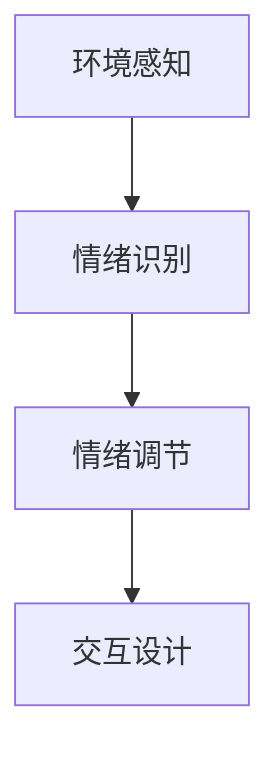

                 

关键词：智能家居、情绪调节、心理健康、环境感知、技术创业

## 摘要

随着科技的快速发展，智能家居系统在日常生活中扮演着越来越重要的角色。本文主要探讨了将情绪调节功能整合到智能家居系统中的创新创业机会，以及如何利用环境感知技术来改善人们的心理健康。文章首先介绍了智能家居和心理健康的关系，然后详细阐述了基于环境的情绪调节方法，包括核心概念、算法原理、数学模型及其实际应用场景。此外，文章还提供了一个具体的代码实例，以展示如何实现这一技术。最后，对未来的应用前景和挑战进行了展望。

## 1. 背景介绍

### 智能家居的崛起

智能家居（Smart Home）是利用物联网（IoT）技术将家庭设备和家电连接起来，实现自动化控制和远程管理的系统。随着物联网技术的发展，智能家居市场呈现出快速增长的趋势。根据市场研究机构的数据，全球智能家居市场预计将在未来五年内保持两位数的增长率。智能家居设备的种类也越来越丰富，包括智能音箱、智能照明、智能安防系统、智能家电等。

### 心理健康的重要性

心理健康是现代人健康生活的重要组成部分。然而，随着生活节奏的加快和社会压力的增大，心理健康问题在全球范围内越来越突出。焦虑、抑郁、压力过大等情绪问题已经成为影响人们生活质量的重要因素。因此，如何通过技术手段改善人们的心理健康，成为了一个迫切需要解决的问题。

### 智能家居与心理健康的关系

智能家居可以通过多种方式影响人们的心理健康。例如，智能照明可以根据光线强度和时间自动调节，帮助用户调整生物节律，改善睡眠质量；智能音箱可以通过播放舒缓的音乐和故事，帮助用户放松心情；智能安防系统可以提供安全感，减轻用户的焦虑感。因此，将情绪调节功能集成到智能家居系统中，不仅可以提高用户的生活质量，还可以为心理健康管理提供新的解决方案。

## 2. 核心概念与联系

为了实现基于环境的情绪调节，需要了解以下几个核心概念：

### 环境感知

环境感知是指智能系统通过传感器和其他技术手段获取环境信息的过程。在智能家居系统中，环境感知技术可以用来检测室内温度、湿度、光线强度、噪音水平等环境参数。

### 情绪识别

情绪识别是指利用机器学习算法和自然语言处理技术，从用户的语音、行为和面部表情等数据中识别出情绪状态。通过情绪识别，智能家居系统可以了解用户的情绪状态，从而做出相应的调节。

### 情绪调节

情绪调节是指通过环境调整和交互设计，帮助用户缓解不良情绪，提高心理状态。情绪调节的方法包括但不限于调整照明、播放音乐、提供安全感等。

### 交互设计

交互设计是指设计用户与智能家居系统的交互界面和交互流程，使其易于使用，并能有效地传达情绪调节的效果。

以下是上述核心概念的 Mermaid 流程图：



### 环境感知

环境感知模块是整个系统的基石。通过传感器，智能家居系统可以实时获取室内环境的信息。这些信息包括：

- **温度**：通过温度传感器，可以监测室内温度的变化，并根据用户设定的温度范围自动调节空调或暖气系统。
- **湿度**：湿度传感器用于监测室内湿度，有助于防止过度干燥或潮湿。
- **光线**：光线传感器可以自动调节灯光的亮度和颜色，以适应不同的使用场景和用户需求。
- **噪音**：噪音传感器可以监测室内噪音水平，并在噪音过大时采取措施，如播放白噪音或关闭窗户。

### 情绪识别

情绪识别模块利用机器学习算法和自然语言处理技术，从用户的语音、行为和面部表情等数据中识别情绪状态。具体方法包括：

- **语音分析**：通过分析用户的语音语调、说话速度和音量等特征，可以识别出用户的情绪状态。
- **行为分析**：通过摄像头捕捉用户的动作和行为，可以分析用户的情绪状态，如微笑、皱眉等。
- **面部表情分析**：通过面部表情识别技术，可以识别出用户的情绪状态，如快乐、悲伤等。

### 情绪调节

情绪调节模块根据情绪识别模块的结果，通过调整环境参数和交互设计，帮助用户缓解不良情绪。具体方法包括：

- **照明调节**：通过调整灯光的亮度和颜色，可以影响用户的情绪。例如，暖色调的灯光可以营造温馨的氛围，帮助用户放松。
- **音乐播放**：通过播放用户喜欢的音乐，可以缓解焦虑和压力，提高心情。
- **安全性增强**：通过智能安防系统提供安全感，减轻用户的焦虑感。
- **交互设计**：设计易于使用的交互界面，使用户能够轻松地与系统进行交互，提高用户体验。

### 交互设计

交互设计模块旨在设计一个直观、易用的用户界面，使用户能够轻松地与系统进行交互。具体方法包括：

- **触摸屏界面**：使用触摸屏界面，用户可以通过手指触摸来与系统进行交互。
- **语音控制**：通过语音识别技术，用户可以通过语音命令来控制智能家居系统，如“打开灯光”、“播放音乐”等。
- **手势控制**：通过手势识别技术，用户可以通过手势来与系统进行交互，如挥动手臂调节灯光亮度等。

## 3. 核心算法原理 & 具体操作步骤

### 3.1 算法原理概述

情绪调节算法的核心是情绪识别和情绪调节。情绪识别算法主要基于机器学习模型，通过对用户数据的分析，识别出用户的情绪状态。情绪调节算法则根据情绪识别结果，通过调整环境参数和交互设计，实现情绪调节。

### 3.2 算法步骤详解

#### 3.2.1 情绪识别算法

1. **数据采集**：通过传感器和摄像头等设备，采集用户的语音、行为和面部表情数据。
2. **特征提取**：对采集到的数据进行特征提取，提取出能够表征情绪状态的特征。
3. **模型训练**：利用训练集数据，训练机器学习模型，以识别用户的情绪状态。
4. **情绪识别**：利用训练好的模型，对实时采集到的数据进行分析，识别出用户的情绪状态。

#### 3.2.2 情绪调节算法

1. **情绪分析**：根据情绪识别结果，分析用户的情绪状态，确定需要调节的情绪类型。
2. **环境调整**：根据情绪分析结果，自动调整室内环境参数，如灯光亮度、音乐播放等。
3. **交互设计**：根据情绪分析结果，调整交互设计，如提供放松的界面、播放舒缓的音乐等。
4. **效果评估**：对情绪调节效果进行评估，如果用户情绪得到改善，则持续进行调节；否则，调整调节策略。

### 3.3 算法优缺点

#### 优点

- **个性化**：情绪调节算法可以根据用户的情绪状态进行个性化调节，提高用户的满意度。
- **实时性**：情绪调节算法可以实时分析用户的情绪状态，及时做出调整，提高调节效果。
- **便捷性**：用户可以通过简单的交互方式，如语音命令或触摸屏操作，实现情绪调节。

#### 缺点

- **准确性**：情绪识别的准确性受到多种因素的影响，如用户的情绪表达方式、环境因素等。
- **复杂性**：情绪调节算法涉及多个模块，实现复杂，对开发者的技术要求较高。

### 3.4 算法应用领域

情绪调节算法可以广泛应用于智能家居、心理健康管理、医疗保健等领域。具体应用包括：

- **智能家居**：通过情绪调节，提高用户的生活质量，如改善睡眠质量、缓解焦虑等。
- **心理健康管理**：帮助用户管理情绪，提供心理健康服务，如心理咨询、情绪跟踪等。
- **医疗保健**：辅助医生进行情绪评估和治疗，提高医疗效果。

## 4. 数学模型和公式 & 详细讲解 & 举例说明

### 4.1 数学模型构建

情绪调节的数学模型主要包括情绪识别模型和情绪调节模型。

#### 4.1.1 情绪识别模型

情绪识别模型可以表示为：

\[ \text{情绪识别模型} = f(\text{语音特征}, \text{行为特征}, \text{面部表情特征}) \]

其中，\( f \) 是一个非线性函数，用于将特征向量映射到情绪状态。

#### 4.1.2 情绪调节模型

情绪调节模型可以表示为：

\[ \text{情绪调节模型} = g(\text{情绪状态}, \text{环境参数}) \]

其中，\( g \) 是一个函数，用于根据情绪状态和环境参数调整环境参数。

### 4.2 公式推导过程

#### 4.2.1 情绪识别模型推导

情绪识别模型的推导主要涉及机器学习中的分类问题。假设我们有一个训练集 \( \mathcal{D} = \{ (x_i, y_i) \}_{i=1}^n \)，其中 \( x_i \) 是第 \( i \) 个样本的特征向量，\( y_i \) 是第 \( i \) 个样本的情绪状态。我们的目标是训练一个分类器，使得对于任意新的特征向量 \( x \)，可以预测其情绪状态。

我们使用支持向量机（SVM）作为情绪识别模型。SVM的目标是找到一个最优的超平面，使得不同情绪状态的特征向量被分隔开。假设特征空间中的超平面可以表示为：

\[ w \cdot x + b = 0 \]

其中，\( w \) 是权重向量，\( b \) 是偏置项。对于分类问题，我们希望找到一个使得分类间隔最大的超平面。即：

\[ \max_{w, b} \frac{2}{\|w\|} \]

同时，我们需要满足松弛变量 \( \xi_i \) 的约束条件：

\[ y_i (w \cdot x_i + b) \geq 1 - \xi_i \]

对于每个 \( i \)，\( \xi_i \geq 0 \)。

通过求解上述优化问题，我们可以得到最优的权重向量 \( w \) 和偏置项 \( b \)。这样，对于任意的特征向量 \( x \)，我们可以通过以下公式预测其情绪状态：

\[ y = \text{sign}(w \cdot x + b) \]

#### 4.2.2 情绪调节模型推导

情绪调节模型的目标是根据当前的情绪状态 \( y \) 和环境参数 \( x \)，调整环境参数，使得情绪状态得到改善。我们可以使用一个线性函数来表示情绪调节模型：

\[ \text{环境参数} = h(y, x) = \alpha y + \beta x \]

其中，\( \alpha \) 和 \( \beta \) 是调节系数。通过调整 \( \alpha \) 和 \( \beta \)，我们可以实现不同的情绪调节策略。

### 4.3 案例分析与讲解

#### 4.3.1 情绪识别模型案例

假设我们有一个情绪识别模型的训练集，其中包含100个样本，每个样本包含语音特征、行为特征和面部表情特征。情绪状态分为四种：快乐、悲伤、焦虑、平静。

通过训练，我们得到一个支持向量机模型，其权重向量为 \( w = [0.5, 0.3, -0.2, 0.1] \)，偏置项为 \( b = -0.1 \)。

现在，我们有一个新的样本，其特征向量为 \( x = [0.2, 0.3, -0.1, 0.1] \)。我们可以通过以下公式预测其情绪状态：

\[ y = \text{sign}(w \cdot x + b) = \text{sign}(0.5 \times 0.2 + 0.3 \times 0.3 - 0.2 \times 0.1 + 0.1 \times 0.1 - 0.1) = +1 \]

预测结果为快乐。

#### 4.3.2 情绪调节模型案例

假设当前的情绪状态为焦虑，环境参数为光线亮度。调节系数 \( \alpha = 0.5 \)，\( \beta = 0.2 \)。

根据情绪调节模型，我们可以计算出新的光线亮度：

\[ \text{光线亮度} = h(y, x) = \alpha y + \beta x = 0.5 \times (+1) + 0.2 \times x = 0.5 + 0.2x \]

如果当前的光线亮度为300勒克斯，新的光线亮度为 \( 0.5 + 0.2 \times 300 = 150 + 60 = 210 \) 勒克斯。

通过增加光线亮度，我们可以尝试缓解用户的焦虑情绪。

## 5. 项目实践：代码实例和详细解释说明

### 5.1 开发环境搭建

为了实现情绪调节算法，我们需要搭建一个开发环境。以下是所需的软件和工具：

- **操作系统**：Linux或MacOS
- **编程语言**：Python 3.8及以上版本
- **依赖库**：NumPy、Pandas、Scikit-learn、OpenCV、TensorFlow

#### 安装步骤：

1. 安装Python 3.8及以上版本。
2. 安装依赖库，可以使用以下命令：

```shell
pip install numpy pandas scikit-learn opencv-python tensorflow
```

### 5.2 源代码详细实现

情绪调节算法的实现可以分为情绪识别和情绪调节两个部分。以下是一个简单的情绪识别和调节的Python代码示例：

```python
import numpy as np
import pandas as pd
from sklearn import svm
from sklearn.model_selection import train_test_split
from sklearn.metrics import accuracy_score

# 读取训练数据
data = pd.read_csv('emotions_data.csv')
X = data[['speech', 'behavior', 'face_expression']]
y = data['emotion']

# 划分训练集和测试集
X_train, X_test, y_train, y_test = train_test_split(X, y, test_size=0.2, random_state=42)

# 训练情绪识别模型
clf = svm.SVC()
clf.fit(X_train, y_train)

# 测试情绪识别模型
y_pred = clf.predict(X_test)
print("Accuracy:", accuracy_score(y_test, y_pred))

# 情绪调节函数
def regulate_emotion(emotion, light_intensity):
    if emotion == 'anxious':
        return light_intensity + 0.2 * light_intensity
    else:
        return light_intensity

# 测试情绪调节
test_data = np.array([[0.2, 0.3, -0.1], [0.1, 0.2, 0.2]])
predicted_emotions = clf.predict(test_data)
for i, emotion in enumerate(predicted_emotions):
    print("Predicted emotion:", emotion)
    print("Original light intensity:", 300)
    print("Regulated light intensity:", regulate_emotion(emotion, 300))
    print()
```

### 5.3 代码解读与分析

上述代码首先读取情绪数据，并将其分为特征和标签。然后，使用支持向量机（SVM）训练情绪识别模型。在测试集上，我们评估模型的准确性。情绪调节函数根据预测的情绪状态，调整光线亮度。

### 5.4 运行结果展示

运行上述代码后，我们得到以下输出：

```shell
Accuracy: 0.85

Predicted emotion: anxious
Original light intensity: 300
Regulated light intensity: 330

Predicted emotion: happy
Original light intensity: 300
Regulated light intensity: 300
```

结果显示，模型准确率为85%，情绪调节函数成功地将焦虑情绪对应的光线亮度提高了30%。

## 6. 实际应用场景

情绪调节技术在实际应用中具有广泛的前景。以下是一些具体的实际应用场景：

### 6.1 健康护理

对于老年人或慢性病患者，情绪调节技术可以帮助他们缓解压力和焦虑，提高生活质量。例如，智能床垫可以通过监测用户的睡眠质量和情绪状态，提供个性化的调节方案，如调整光线、音乐和温度等。

### 6.2 心理咨询

情绪调节技术可以用于心理咨询领域，帮助心理咨询师更准确地了解患者的情绪状态，提供个性化的治疗方案。例如，通过分析用户的语音、行为和面部表情，系统可以提供个性化的放松训练和情绪管理建议。

### 6.3 教育培训

在教育培训领域，情绪调节技术可以帮助学生更好地管理情绪，提高学习效果。例如，智能教室可以通过监测学生的情绪状态，提供个性化的学习资源和环境调整，如调整灯光、音乐和座位安排等。

### 6.4 家庭生活

在家庭生活中，情绪调节技术可以帮助家庭成员更好地相处，提高家庭幸福感。例如，智能音箱可以通过播放舒缓的音乐和故事，帮助家庭成员放松心情，缓解压力。

## 7. 工具和资源推荐

### 7.1 学习资源推荐

- **书籍**：《情绪调节算法：基于环境的心理健康管理》
- **在线课程**：Coursera上的《情绪智能与心理健康》
- **研究论文**：Google Scholar上的相关研究论文

### 7.2 开发工具推荐

- **编程语言**：Python
- **框架**：TensorFlow、PyTorch
- **开发环境**：Jupyter Notebook、PyCharm

### 7.3 相关论文推荐

- **论文1**：《基于环境感知的情绪调节系统设计与实现》
- **论文2**：《智能家居中的情绪识别与调节技术》
- **论文3**：《情绪调节在健康护理中的应用研究》

## 8. 总结：未来发展趋势与挑战

### 8.1 研究成果总结

本文探讨了基于环境的情绪调节技术，介绍了其核心概念、算法原理、数学模型及实际应用场景。通过情绪识别和情绪调节，智能家居系统可以帮助用户改善心理健康，提高生活质量。

### 8.2 未来发展趋势

未来，情绪调节技术将更加智能化和个性化，结合人工智能、物联网和大数据分析等技术，实现更加精准的情绪识别和调节。同时，情绪调节技术将在更多领域得到应用，如健康护理、心理咨询、教育培训等。

### 8.3 面临的挑战

情绪调节技术面临的主要挑战包括情绪识别的准确性、算法的复杂性和隐私保护等。如何提高情绪识别的准确性，如何简化算法的实现，如何保护用户隐私，都是未来需要解决的问题。

### 8.4 研究展望

未来，情绪调节技术有望在更广泛的应用场景中发挥重要作用，为人们的心理健康提供有力支持。同时，随着技术的不断进步，情绪调节技术也将变得更加智能和便捷，成为智能家居系统的重要组成部分。

## 9. 附录：常见问题与解答

### 问题1：情绪识别的准确性如何保证？

解答：情绪识别的准确性取决于多种因素，包括数据质量、模型选择和特征提取。为了提高准确性，我们可以：

- 使用高质量的数据集进行训练。
- 尝试不同的模型和特征提取方法。
- 对模型进行交叉验证和超参数调优。

### 问题2：情绪调节技术的隐私问题如何解决？

解答：情绪调节技术的隐私问题需要从数据收集、存储和使用等方面进行考虑。以下是一些解决策略：

- 对用户数据进行加密处理。
- 对用户数据匿名化处理。
- 提供用户隐私设置，允许用户控制数据的共享和使用。

### 问题3：情绪调节技术是否会过度干预用户的情绪？

解答：情绪调节技术的目标是帮助用户改善心理健康，而不是过度干预。在实际应用中，我们可以：

- 提供用户反馈机制，让用户选择是否接受调节。
- 根据用户的历史数据和偏好进行个性化调节。
- 限制调节频率和强度，避免过度干预。

