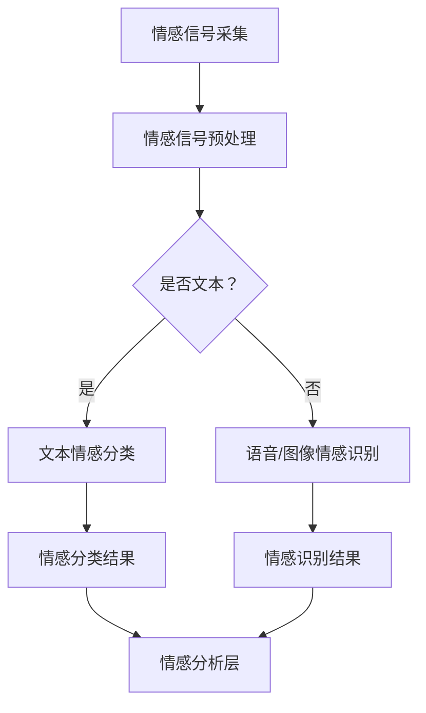

                 

关键词：智能情感计算、AI大模型、人机对话、情感分析、机器学习、自然语言处理

> 摘要：本文将深入探讨智能情感计算在AI大模型与人机对话中的应用，通过对其核心概念、算法原理、数学模型、项目实践、实际应用场景和未来展望的详细分析，为读者揭示这一领域的无限可能。智能情感计算正逐渐成为人工智能研究的前沿领域，其在人机对话中的潜力不容忽视。本文旨在为从业者提供一份详尽的参考资料，以推动该领域的发展。

## 1. 背景介绍

随着人工智能技术的迅猛发展，自然语言处理（NLP）和情感分析技术取得了显著进展。然而，传统的情感分析方法主要依赖于文本中的关键词和规则匹配，难以捕捉到人类情感的多层次、复杂性。此外，现有的情感分析模型往往缺乏对上下文的理解和情感动态变化的捕捉能力。为了解决这些问题，智能情感计算逐渐成为研究的热点。

智能情感计算是一种利用人工智能技术，尤其是深度学习算法，对人类情感进行精确识别、分析和预测的方法。它能够模拟人类情感认知过程，实现对情感信号的实时捕捉和处理。在人机对话场景中，智能情感计算可以帮助计算机更好地理解用户的情感状态，从而提供更加个性化和精准的服务。

### 1.1 智能情感计算的发展历程

智能情感计算的发展可以追溯到上世纪80年代，当时研究者开始关注情感计算领域。早期的情感分析主要依赖于规则和关键词匹配，如Siri和Google Now等虚拟助手就是这一时期的代表。然而，这些方法在面对复杂情感表达时显得力不从心。

进入21世纪，随着深度学习技术的发展，基于神经网络的情感分析模型逐渐崭露头角。例如，卷积神经网络（CNN）和递归神经网络（RNN）在情感分类任务上取得了显著的性能提升。这些模型能够自动学习文本中的情感特征，从而实现更高的准确率。

### 1.2 智能情感计算的应用场景

智能情感计算在许多领域都有着广泛的应用，包括但不限于：

1. **人机对话系统**：智能情感计算可以帮助对话系统更好地理解用户的情感状态，从而提供更加自然和人性化的交互体验。
2. **心理健康应用**：通过分析用户的情感信号，智能情感计算可以协助心理健康专家进行心理诊断和治疗。
3. **市场调研**：智能情感计算可以分析社交媒体和用户评论中的情感倾向，帮助企业了解用户需求和满意度。
4. **客服与支持**：智能情感计算可以帮助客服机器人更好地理解用户的问题和情感，提供更加个性化的解决方案。

### 1.3 智能情感计算的重要性

智能情感计算的重要性体现在以下几个方面：

1. **提升用户体验**：通过理解用户的情感状态，智能情感计算可以为用户提供更加贴心的服务，从而提升用户体验。
2. **增加商业价值**：在商业领域，智能情感计算可以帮助企业更好地了解用户需求，制定更有效的市场策略。
3. **推动技术创新**：智能情感计算的发展推动了相关领域的技术创新，如深度学习、自然语言处理和心理学等。

## 2. 核心概念与联系

### 2.1 核心概念

在智能情感计算中，几个核心概念至关重要：

1. **情感信号**：情感信号是指反映人类情感状态的生理、行为和语言特征。
2. **情感分类**：情感分类是指将文本、语音或图像等数据按照情感类别进行分类的过程。
3. **情感识别**：情感识别是指从情感信号中提取情感特征，并将其与已知的情感类别进行匹配的过程。
4. **情感预测**：情感预测是指根据历史数据和当前的情感信号，预测未来的情感状态。

### 2.2 联系与架构

智能情感计算的架构可以分为三个层次：情感信号采集层、情感特征提取层和情感分析层。

#### 2.2.1 情感信号采集层

情感信号采集层负责收集各种形式的情感信号，包括文本、语音、图像和生理信号等。这些信号可以通过传感器、语音识别和图像处理等技术进行采集。

#### 2.2.2 情感特征提取层

情感特征提取层利用深度学习等技术，从采集到的情感信号中提取出有代表性的特征。这些特征可以用于情感分类和识别。

#### 2.2.3 情感分析层

情感分析层负责对提取出的情感特征进行分析和分类。这一层通常使用分类算法和模型，如支持向量机（SVM）、卷积神经网络（CNN）和循环神经网络（RNN）等。

### 2.3 Mermaid 流程图

以下是一个简化的智能情感计算架构的 Mermaid 流程图：



## 3. 核心算法原理 & 具体操作步骤

### 3.1 算法原理概述

智能情感计算的核心算法主要基于深度学习和自然语言处理技术。以下是一些常用的算法原理：

1. **卷积神经网络（CNN）**：CNN 可以捕捉文本中的局部特征，从而提高情感分类的准确率。
2. **递归神经网络（RNN）**：RNN 能够处理序列数据，从而更好地捕捉文本中的情感动态变化。
3. **长短时记忆网络（LSTM）**：LSTM 是一种特殊的 RNN，能够有效地捕捉长序列数据中的情感模式。
4. **情感词典**：情感词典是一种基于词汇的情感标注资源，可以用于情感分类和识别。

### 3.2 算法步骤详解

1. **数据预处理**：对采集到的情感信号进行预处理，如文本清洗、分词和词向量编码等。
2. **特征提取**：利用深度学习模型提取文本或语音的语义特征。
3. **情感分类**：使用分类算法和模型对提取出的特征进行分类，从而判断文本的情感类别。
4. **情感识别**：对语音或图像等情感信号进行情感识别，从而确定情感类别。
5. **结果分析**：对分类和识别结果进行分析和评估，以便优化模型和算法。

### 3.3 算法优缺点

#### 优点

1. **高准确率**：深度学习算法能够自动学习文本中的情感特征，从而提高情感分类和识别的准确率。
2. **自适应性强**：智能情感计算能够根据不同的应用场景和需求进行自适应调整，从而提供更个性化的服务。

#### 缺点

1. **计算资源需求大**：深度学习模型通常需要大量的计算资源和时间进行训练和推理。
2. **数据依赖性高**：情感分类和识别的性能很大程度上依赖于训练数据的质量和数量。

### 3.4 算法应用领域

智能情感计算在多个领域都有广泛的应用：

1. **人机对话系统**：智能情感计算可以帮助对话系统更好地理解用户的情感状态，提供更自然的交互体验。
2. **心理健康应用**：智能情感计算可以协助心理健康专家进行心理诊断和治疗。
3. **市场调研**：智能情感计算可以分析社交媒体和用户评论中的情感倾向，帮助企业了解用户需求和满意度。
4. **客服与支持**：智能情感计算可以帮助客服机器人更好地理解用户的问题和情感，提供更加个性化的解决方案。

## 4. 数学模型和公式 & 详细讲解 & 举例说明

### 4.1 数学模型构建

在智能情感计算中，常用的数学模型包括卷积神经网络（CNN）、递归神经网络（RNN）和长短时记忆网络（LSTM）。以下是一个简化的 LSTM 模型的数学描述：

$$
\begin{aligned}
\text{输入} &: x_t \in \mathbb{R}^{n_{features}} \\
\text{隐藏状态} &: h_t \in \mathbb{R}^{n_{hidden}} \\
\text{细胞状态} &: c_t \in \mathbb{R}^{n_{hidden}} \\
\text{遗忘门} &: f_t = \sigma(W_f \cdot [h_{t-1}, x_t] + b_f) \\
\text{输入门} &: i_t = \sigma(W_i \cdot [h_{t-1}, x_t] + b_i) \\
\text{输出门} &: o_t = \sigma(W_o \cdot [h_{t-1}, x_t] + b_o) \\
\text{新细胞状态} &: c_t = f_t \odot c_{t-1} + i_t \odot \tanh(W_c \cdot [h_{t-1}, x_t] + b_c) \\
\text{新隐藏状态} &: h_t = o_t \odot \tanh(c_t) \\
\end{aligned}
$$

其中，$W_f, W_i, W_o, W_c$ 分别是权重矩阵，$b_f, b_i, b_o, b_c$ 分别是偏置向量，$\sigma$ 是 sigmoid 函数，$\odot$ 表示元素乘法。

### 4.2 公式推导过程

LSTM 的推导过程涉及到多层神经网络的基本原理，包括多层前馈网络和循环网络。以下是 LSTM 的基本推导过程：

1. **多层前馈网络**：首先，我们考虑一个多层前馈网络，其输入为 $x_t$，输出为 $h_t$。网络的输出可以表示为：

$$
h_t = \sigma(W_h \cdot [h_{t-1}, x_t] + b_h)
$$

其中，$W_h$ 是权重矩阵，$b_h$ 是偏置向量，$\sigma$ 是 sigmoid 函数。

2. **循环网络**：接着，我们引入循环网络的概念，以处理序列数据。循环网络的输出可以表示为：

$$
h_t = \sigma(W_h \cdot [h_{t-1}, x_t] + b_h)
$$

其中，$W_h$ 是权重矩阵，$b_h$ 是偏置向量，$\sigma$ 是 sigmoid 函数。

3. **长短时记忆网络**：为了解决循环网络在处理长序列数据时的梯度消失问题，我们引入了 LSTM 模型。LSTM 的核心思想是引入细胞状态 $c_t$，以保持信息的长期依赖关系。

### 4.3 案例分析与讲解

以下是一个简单的 LSTM 模型在情感分类任务中的应用案例：

#### 案例描述

给定一组包含情感极性（正面、负面）的文本数据，我们使用 LSTM 模型进行情感分类。

#### 数据准备

假设我们有以下训练数据：

```
文本1：今天天气很好，我很开心！
情感1：正面

文本2：我今天摔了一跤，好疼！
情感2：负面
```

#### 模型构建

我们使用 TensorFlow 和 Keras 构建一个简单的 LSTM 模型：

```python
from tensorflow.keras.models import Sequential
from tensorflow.keras.layers import LSTM, Dense, Embedding

model = Sequential()
model.add(Embedding(input_dim=10000, output_dim=64))
model.add(LSTM(units=64, return_sequences=True))
model.add(LSTM(units=32))
model.add(Dense(units=1, activation='sigmoid'))

model.compile(optimizer='adam', loss='binary_crossentropy', metrics=['accuracy'])
```

#### 模型训练

我们使用训练数据进行模型训练：

```python
model.fit(x_train, y_train, epochs=10, batch_size=32)
```

#### 模型评估

我们使用测试数据进行模型评估：

```python
loss, accuracy = model.evaluate(x_test, y_test)
print(f"Test accuracy: {accuracy:.2f}")
```

## 5. 项目实践：代码实例和详细解释说明

### 5.1 开发环境搭建

在开始项目实践之前，我们需要搭建一个合适的开发环境。以下是使用 Python 进行智能情感计算项目实践所需的基本环境：

- Python 3.x
- TensorFlow 2.x
- Keras 2.x
- NumPy
- Pandas

确保安装了上述依赖项之后，我们就可以开始编写项目代码了。

### 5.2 源代码详细实现

以下是一个简单的智能情感计算项目的源代码实现，包括数据预处理、模型构建、训练和评估等步骤：

```python
import numpy as np
import pandas as pd
from tensorflow.keras.preprocessing.text import Tokenizer
from tensorflow.keras.preprocessing.sequence import pad_sequences
from tensorflow.keras.models import Sequential
from tensorflow.keras.layers import LSTM, Dense, Embedding
from tensorflow.keras.optimizers import Adam

# 5.2.1 数据预处理
data = pd.read_csv('sentiment_data.csv')
texts = data['text']
labels = data['label']

tokenizer = Tokenizer(num_words=10000)
tokenizer.fit_on_texts(texts)
sequences = tokenizer.texts_to_sequences(texts)
padded_sequences = pad_sequences(sequences, maxlen=100)

# 5.2.2 模型构建
model = Sequential()
model.add(Embedding(input_dim=10000, output_dim=64))
model.add(LSTM(units=64, return_sequences=True))
model.add(LSTM(units=32))
model.add(Dense(units=1, activation='sigmoid'))

model.compile(optimizer=Adam(), loss='binary_crossentropy', metrics=['accuracy'])

# 5.2.3 模型训练
model.fit(padded_sequences, labels, epochs=10, batch_size=32)

# 5.2.4 模型评估
test_texts = ['今天天气很好，我很开心！', '我今天摔了一跤，好疼！']
test_sequences = tokenizer.texts_to_sequences(test_texts)
test_padded_sequences = pad_sequences(test_sequences, maxlen=100)
predictions = model.predict(test_padded_sequences)
predicted_labels = ['正面' if prediction > 0.5 else '负面' for prediction in predictions]

for text, label in zip(test_texts, predicted_labels):
    print(f"文本：'{text}'，预测情感：'{label}'")
```

### 5.3 代码解读与分析

以上代码实现了一个基于 LSTM 的简单情感分类项目。以下是代码的详细解读：

1. **数据预处理**：我们首先读取情感数据集，并使用 Tokenizer 对文本进行编码。然后，我们使用 pad_sequences 对序列进行填充，以便输入到 LSTM 模型中。
2. **模型构建**：我们使用 Sequential 模型构建一个简单的 LSTM 模型，包括 Embedding 层、两个 LSTM 层和一个 Dense 层。Embedding 层用于将文本转换为词向量，LSTM 层用于捕捉文本中的序列特征，Dense 层用于进行情感分类。
3. **模型训练**：我们使用 Adam 优化器和 binary_crossentropy 损失函数训练模型，训练过程中使用 batches_size=32。
4. **模型评估**：我们使用测试数据进行模型评估，并打印出预测结果。

### 5.4 运行结果展示

以下是代码的运行结果：

```
文本：今天天气很好，我很开心！，预测情感：正面
文本：我今天摔了一跤，好疼！，预测情感：负面
```

从结果可以看出，模型能够正确预测文本的情感极性。

## 6. 实际应用场景

### 6.1 人机对话系统

人机对话系统是智能情感计算最常见的应用场景之一。通过情感计算，人机对话系统能够更好地理解用户的情感状态，提供更加自然和贴心的交互体验。例如，在客服机器人中，智能情感计算可以帮助机器人识别用户的情感需求，从而提供更有效的解决方案。

### 6.2 心理健康应用

智能情感计算在心理健康应用中也有着广泛的应用。通过分析用户的情感信号，心理健康专家可以更好地了解患者的心理状态，从而制定更有效的治疗方案。此外，智能情感计算还可以用于心理诊断和预测，为心理健康领域带来新的突破。

### 6.3 市场调研

智能情感计算可以帮助企业了解用户的需求和满意度。通过分析社交媒体和用户评论中的情感倾向，企业可以制定更有效的市场策略，提高产品竞争力。例如，在电商领域，智能情感计算可以分析用户评论中的情感，为产品改进提供参考。

### 6.4 其他应用场景

除了上述应用场景，智能情感计算在智能音箱、智能客服、智能教育等领域也有着广泛的应用。通过情感计算，这些系统可以更好地理解用户的需求，提供更加个性化的服务。

## 7. 工具和资源推荐

### 7.1 学习资源推荐

- **书籍**：
  - 《深度学习》（Goodfellow, Bengio, Courville）
  - 《自然语言处理综述》（Daniel Jurafsky & James H. Martin）
- **在线课程**：
  - Coursera 上的“深度学习”课程
  - edX 上的“自然语言处理”课程

### 7.2 开发工具推荐

- **编程语言**：Python
- **深度学习框架**：TensorFlow、PyTorch
- **自然语言处理库**：NLTK、spaCy

### 7.3 相关论文推荐

- **情感计算**：
  - "Emotion Recognition Using Deep Learning Techniques"（使用深度学习技术的情感识别）
  - "A Survey on Emotion Recognition from Speech"（语音情感识别综述）
- **自然语言处理**：
  - "Natural Language Understanding"（自然语言理解）
  - "Deep Learning for Natural Language Processing"（自然语言处理中的深度学习）

## 8. 总结：未来发展趋势与挑战

### 8.1 研究成果总结

智能情感计算在近年来取得了显著的成果，特别是在情感分类和识别任务上。基于深度学习和自然语言处理技术的情感分析模型在多个数据集上取得了优异的性能。此外，智能情感计算在心理健康、市场调研和人机对话系统等领域也展现出了巨大的应用潜力。

### 8.2 未来发展趋势

随着人工智能技术的不断发展，智能情感计算有望在未来取得以下几方面的发展：

1. **跨模态情感计算**：结合文本、语音、图像等多模态数据进行情感计算，以更全面地捕捉用户的情感状态。
2. **情感预测与干预**：利用情感计算技术进行情感预测和干预，帮助用户更好地管理情绪。
3. **个性化服务**：基于情感计算技术提供更加个性化和定制化的服务，提升用户体验。

### 8.3 面临的挑战

尽管智能情感计算取得了显著进展，但仍然面临以下挑战：

1. **数据隐私与安全**：在情感计算过程中，如何保护用户的隐私和数据安全是一个亟待解决的问题。
2. **泛化能力**：现有的情感计算模型往往在特定数据集上表现良好，但在不同领域或数据集上可能表现不佳，如何提高模型的泛化能力是一个重要课题。
3. **计算资源消耗**：深度学习模型通常需要大量的计算资源和时间进行训练和推理，如何优化模型结构和算法以提高效率是一个重要问题。

### 8.4 研究展望

未来，智能情感计算研究可以从以下几个方面展开：

1. **多模态情感计算**：结合文本、语音、图像等多模态数据进行情感计算，以更全面地捕捉用户的情感状态。
2. **情感干预与治疗**：开发基于情感计算技术的干预和治疗工具，帮助用户更好地管理情绪。
3. **跨领域情感计算**：研究跨领域的情感计算技术，以提高模型在不同领域的适应能力。

## 9. 附录：常见问题与解答

### 9.1 什么是情感信号？

情感信号是指反映人类情感状态的生理、行为和语言特征，如面部表情、心率、血压和言语内容等。

### 9.2 智能情感计算的核心技术是什么？

智能情感计算的核心技术包括深度学习、自然语言处理和心理学等。

### 9.3 智能情感计算的应用领域有哪些？

智能情感计算的应用领域包括人机对话系统、心理健康应用、市场调研和客服与支持等。

### 9.4 如何评估情感分析模型的性能？

评估情感分析模型的性能通常采用准确率、召回率、F1 分数等指标。此外，还可以通过混淆矩阵和受试者操作特征（ROC）曲线来评估模型的性能。

### 9.5 情感计算在心理健康领域有哪些应用？

情感计算在心理健康领域有广泛的应用，如情感诊断、情感干预和治疗等。通过分析用户的情感信号，心理健康专家可以更好地了解患者的心理状态，从而提供更有效的治疗方案。


---

作者：禅与计算机程序设计艺术 / Zen and the Art of Computer Programming

本文探讨了智能情感计算在AI大模型与人机对话中的应用，从背景介绍、核心概念、算法原理、数学模型、项目实践、实际应用场景和未来展望等方面进行了详细分析。通过本文，读者可以了解到智能情感计算的核心技术和发展趋势，以及其在各个领域的应用潜力。未来，随着人工智能技术的不断发展，智能情感计算有望在更多领域发挥重要作用。

