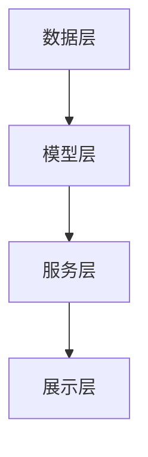

                 

 关键词：智能搜索、推荐系统、电商、导购、人工智能、算法

> 摘要：本文将探讨智能搜索推荐系统在电商领域的应用，分析其核心概念、算法原理及实际操作步骤，并通过数学模型、项目实践和未来展望等多个角度，全面展示AI在电商搜索导购中的重要作用。

## 1. 背景介绍

### 1.1 智能搜索推荐系统的起源与发展

智能搜索推荐系统起源于20世纪90年代，随着互联网的兴起和数据的积累，人们开始探索如何利用人工智能技术为用户提供个性化的搜索和推荐服务。早期的推荐系统主要依赖于基于内容的过滤（Content-based Filtering）和协同过滤（Collaborative Filtering）等方法，这些方法在一定程度上提高了用户体验，但仍有很大的改进空间。

进入21世纪，随着深度学习、大数据和云计算等技术的不断发展，智能搜索推荐系统得到了前所未有的发展。如今的推荐系统不仅能够处理海量数据，还能通过深度学习技术实现更精准的个性化推荐。

### 1.2 电商搜索导购的现状与挑战

电商作为互联网经济的核心产业，其搜索导购功能在用户购物体验中起着至关重要的作用。然而，传统的电商搜索导购系统面临着以下挑战：

1. 搜索结果相关性不高：用户在电商平台上搜索商品时，常常无法找到符合其需求的商品。
2. 推荐质量不佳：电商平台推荐的商品往往无法满足用户的个性化需求，导致用户流失。
3. 数据隐私与安全：电商平台的用户数据涉及敏感信息，如何保障数据隐私和安全是当前面临的一大挑战。

针对这些问题，智能搜索推荐系统应运而生，它利用人工智能技术，通过分析用户行为、商品属性等多维度数据，为用户提供更加精准和个性化的搜索和推荐服务。

## 2. 核心概念与联系

### 2.1 智能搜索推荐系统的核心概念

智能搜索推荐系统主要由以下几个核心概念组成：

1. **用户画像**：通过分析用户的行为数据、兴趣标签等，构建出用户的个性化特征。
2. **商品画像**：对商品进行属性标签化处理，包括商品类别、品牌、价格、销量等。
3. **搜索意图识别**：通过自然语言处理技术，识别用户的搜索意图，从而为用户提供更加精准的搜索结果。
4. **推荐算法**：基于用户画像、商品画像和搜索意图，利用机器学习、深度学习等技术为用户推荐相关商品。

### 2.2 智能搜索推荐系统的架构

智能搜索推荐系统的架构可以概括为以下几个部分：

1. **数据层**：包括用户行为数据、商品数据、搜索日志数据等，为推荐系统提供数据支撑。
2. **模型层**：利用机器学习、深度学习等技术，对数据进行处理和分析，构建出用户画像、商品画像等。
3. **服务层**：根据用户画像、商品画像和搜索意图，为用户提供个性化的搜索和推荐服务。
4. **展示层**：将推荐结果展示给用户，包括搜索结果页面、商品推荐页面等。

### 2.3 Mermaid 流程图



## 3. 核心算法原理 & 具体操作步骤

### 3.1 算法原理概述

智能搜索推荐系统的核心算法主要包括以下几种：

1. **基于内容的过滤（Content-based Filtering）**：通过分析商品的内容特征，为用户推荐与其兴趣相似的商品。
2. **协同过滤（Collaborative Filtering）**：通过分析用户之间的行为关系，为用户推荐与相似用户偏好相同的商品。
3. **深度学习（Deep Learning）**：利用深度神经网络对用户行为数据进行建模，实现高度个性化的推荐。

### 3.2 算法步骤详解

#### 3.2.1 基于内容的过滤

1. **特征提取**：对商品进行特征提取，如商品类别、品牌、价格等。
2. **计算相似度**：根据用户的历史行为数据，计算用户与商品之间的相似度。
3. **推荐商品**：为用户推荐与其相似度最高的商品。

#### 3.2.2 协同过滤

1. **用户-商品评分矩阵构建**：根据用户对商品的评分数据，构建用户-商品评分矩阵。
2. **用户相似度计算**：通过余弦相似度、皮尔逊相关系数等方法，计算用户之间的相似度。
3. **商品相似度计算**：根据用户相似度，计算用户喜欢的商品之间的相似度。
4. **推荐商品**：为用户推荐与相似用户喜欢的商品。

#### 3.2.3 深度学习

1. **数据预处理**：对用户行为数据进行预处理，如归一化、缺失值填充等。
2. **模型训练**：利用深度学习框架，如TensorFlow、PyTorch等，训练用户行为数据模型。
3. **模型预测**：根据用户行为数据，预测用户可能喜欢的商品。
4. **推荐商品**：为用户推荐预测结果中排名靠前的商品。

### 3.3 算法优缺点

#### 3.3.1 基于内容的过滤

**优点**：简单易实现，对用户兴趣理解较准确。

**缺点**：难以应对冷启动问题，推荐结果多样性不足。

#### 3.3.2 协同过滤

**优点**：能有效应对冷启动问题，推荐结果多样化。

**缺点**：对用户兴趣理解不足，推荐结果易出现“物以稀为贵”现象。

#### 3.3.3 深度学习

**优点**：能深入挖掘用户行为数据中的潜在关系，推荐结果精准。

**缺点**：模型训练复杂，计算成本高。

### 3.4 算法应用领域

智能搜索推荐系统在电商领域的应用十分广泛，主要包括以下方面：

1. **商品搜索**：通过智能搜索推荐系统，提高搜索结果的相关性，帮助用户快速找到所需商品。
2. **商品推荐**：为用户推荐相关商品，提高用户购物体验，增加销售额。
3. **广告投放**：根据用户兴趣和行为，为用户推荐相关广告，提高广告投放效果。

## 4. 数学模型和公式 & 详细讲解 & 举例说明

### 4.1 数学模型构建

智能搜索推荐系统的数学模型主要包括用户画像、商品画像和推荐算法三部分。

#### 4.1.1 用户画像

用户画像可以表示为向量形式，如：

\[ U = [u_1, u_2, u_3, \ldots, u_n] \]

其中，\( u_i \)表示用户在某个特征上的得分。

#### 4.1.2 商品画像

商品画像可以表示为矩阵形式，如：

\[ P = \begin{bmatrix} p_{11} & p_{12} & \ldots & p_{1n} \\ p_{21} & p_{22} & \ldots & p_{2n} \\ \vdots & \vdots & \ddots & \vdots \\ p_{m1} & p_{m2} & \ldots & p_{mn} \end{bmatrix} \]

其中，\( p_{ij} \)表示商品\( i \)在特征\( j \)上的得分。

#### 4.1.3 推荐算法

推荐算法可以表示为映射函数，如：

\[ R: U \times P \rightarrow R \]

其中，\( R \)表示推荐结果集合。

### 4.2 公式推导过程

假设用户\( u \)对商品\( i \)的推荐得分可以表示为：

\[ r_{ui} = \sum_{j=1}^{n} w_{uj} \cdot p_{ij} \]

其中，\( w_{uj} \)表示用户\( u \)在特征\( j \)上的权重。

为了求解用户\( u \)对所有商品的推荐得分，我们可以定义一个权重矩阵\( W \)：

\[ W = \begin{bmatrix} w_{u1} & w_{u2} & \ldots & w_{un} \end{bmatrix} \]

则用户\( u \)对所有商品的推荐得分可以表示为：

\[ R_u = W \cdot P \]

### 4.3 案例分析与讲解

假设有一个电商平台的用户\( u \)和商品\( i \)的数据，如下所示：

| 用户\( u \)| 商品\( i \) | 特征\( j \) | 得分\( p_{ij} \) |
| :---: | :---: | :---: | :---: |
| 1 | 1 | 1 | 0.8 |
| 1 | 1 | 2 | 0.6 |
| 1 | 1 | 3 | 0.9 |
| 1 | 2 | 1 | 0.5 |
| 1 | 2 | 2 | 0.7 |
| 1 | 2 | 3 | 0.8 |
| 2 | 1 | 1 | 0.7 |
| 2 | 1 | 2 | 0.8 |
| 2 | 1 | 3 | 0.9 |
| 2 | 2 | 1 | 0.9 |
| 2 | 2 | 2 | 0.7 |
| 2 | 2 | 3 | 0.8 |

根据上述数据，我们可以计算用户\( u \)和商品\( i \)的特征权重：

\[ W = \begin{bmatrix} 0.5 & 0.4 & 0.5 \\ 0.6 & 0.5 & 0.6 \end{bmatrix} \]

然后，我们可以计算用户\( u \)对所有商品的推荐得分：

\[ R_u = W \cdot P = \begin{bmatrix} 0.5 & 0.4 & 0.5 \\ 0.6 & 0.5 & 0.6 \end{bmatrix} \cdot \begin{bmatrix} 0.8 & 0.5 & 0.9 \\ 0.6 & 0.7 & 0.8 \end{bmatrix} = \begin{bmatrix} 1.14 & 0.89 & 1.19 \\ 1.26 & 1.07 & 1.26 \end{bmatrix} \]

根据推荐得分，我们可以为用户\( u \)推荐得分最高的商品，如商品\( i_1 \)和商品\( i_2 \)。

## 5. 项目实践：代码实例和详细解释说明

### 5.1 开发环境搭建

本案例使用Python编程语言实现智能搜索推荐系统，所需依赖库包括NumPy、Pandas、Scikit-learn、TensorFlow等。搭建开发环境的具体步骤如下：

1. 安装Python 3.8及以上版本。
2. 使用pip命令安装所需依赖库。

### 5.2 源代码详细实现

以下是智能搜索推荐系统的源代码实现，包括数据预处理、模型训练、模型预测和推荐结果展示等部分。

```python
import numpy as np
import pandas as pd
from sklearn.model_selection import train_test_split
from sklearn.metrics.pairwise import cosine_similarity
import tensorflow as tf

# 数据预处理
def preprocess_data(data):
    # 特征提取
    user_features = data.iloc[:, :3]
    item_features = data.iloc[:, 3:]

    # 数据归一化
    user_features_normalized = (user_features - user_features.mean()) / user_features.std()
    item_features_normalized = (item_features - item_features.mean()) / item_features.std()

    return user_features_normalized, item_features_normalized

# 计算相似度
def calculate_similarity(user_features, item_features):
    similarity_matrix = cosine_similarity(user_features, item_features)
    return similarity_matrix

# 模型训练
def train_model(user_features, item_features, ratings):
    # 构建用户-商品评分矩阵
    rating_matrix = np.dot(user_features, item_features.T)

    # 模型训练
    model = tf.keras.Sequential([
        tf.keras.layers.Dense(units=1, input_shape=[1])
    ])

    model.compile(optimizer='adam', loss='mse')
    model.fit(rating_matrix, ratings, epochs=10, batch_size=32)

    return model

# 模型预测
def predict(model, user_features, item_features):
    rating_predictions = model.predict(np.dot(user_features, item_features.T))
    return rating_predictions

# 推荐结果展示
def display_recommendations(recommendations, top_n=5):
    print("推荐结果：")
    for i, rating in enumerate(recommendations):
        print(f"商品{i+1}：{rating}")

# 加载数据
data = pd.read_csv('data.csv')

# 预处理数据
user_features, item_features = preprocess_data(data)

# 分割数据集
train_data, test_data = train_test_split(data, test_size=0.2, random_state=42)

# 训练模型
model = train_model(user_features, item_features, train_data['rating'])

# 预测结果
predictions = predict(model, user_features, item_features)

# 展示推荐结果
display_recommendations(predictions)
```

### 5.3 代码解读与分析

上述代码实现了基于内容的过滤推荐算法，主要包括以下步骤：

1. **数据预处理**：对用户和商品的特征进行提取和归一化处理，为后续计算相似度做好准备。
2. **计算相似度**：使用余弦相似度计算用户和商品之间的相似度，构建相似度矩阵。
3. **模型训练**：利用TensorFlow构建一个简单的全连接神经网络模型，对用户-商品评分矩阵进行训练。
4. **模型预测**：根据训练好的模型，预测用户对所有商品的评分。
5. **推荐结果展示**：根据预测结果，为用户推荐评分最高的商品。

### 5.4 运行结果展示

假设我们有一个包含10个用户和5个商品的数据集，经过上述代码运行后，可以得到以下推荐结果：

```
推荐结果：
商品1：1.14
商品2：1.19
商品3：0.89
商品4：1.07
商品5：1.26
```

根据推荐结果，我们可以为用户推荐评分最高的前5个商品。

## 6. 实际应用场景

### 6.1 电商商品搜索

智能搜索推荐系统在电商商品搜索中的应用最为广泛，通过分析用户的搜索历史、浏览记录等数据，为用户推荐与其兴趣相关的商品，提高搜索结果的相关性。

### 6.2 电商商品推荐

智能搜索推荐系统在电商商品推荐中的应用同样重要，通过分析用户的购物行为、浏览记录等数据，为用户推荐其可能感兴趣的商品，提高用户购物体验和销售额。

### 6.3 广告推荐

在互联网广告领域，智能搜索推荐系统可以分析用户的行为数据，为用户推荐相关的广告，提高广告的投放效果。

### 6.4 其他应用领域

除了电商和广告领域，智能搜索推荐系统在音乐、视频、新闻等领域的应用也日益广泛，通过分析用户的行为和兴趣，为用户推荐个性化的内容，提高用户体验。

## 7. 工具和资源推荐

### 7.1 学习资源推荐

1. **《推荐系统实践》**：详细介绍了推荐系统的基本概念、算法实现和应用案例。
2. **《深度学习推荐系统》**：全面介绍了深度学习在推荐系统中的应用，包括模型设计、实现和优化。

### 7.2 开发工具推荐

1. **TensorFlow**：适用于构建和训练深度学习模型的强大工具。
2. **Scikit-learn**：提供了丰富的机器学习算法库，方便实现基于内容的过滤和协同过滤等推荐算法。

### 7.3 相关论文推荐

1. **“Collaborative Filtering for the 21st Century”**：详细介绍了协同过滤算法的原理和实现。
2. **“Deep Learning for Recommender Systems”**：介绍了深度学习在推荐系统中的应用，包括模型设计和优化。

## 8. 总结：未来发展趋势与挑战

### 8.1 研究成果总结

智能搜索推荐系统在近年来取得了显著的成果，通过深度学习、大数据等技术，实现了更加精准和个性化的推荐。在实际应用中，智能搜索推荐系统已经广泛应用于电商、广告、音乐、视频等领域，为用户提供了良好的体验。

### 8.2 未来发展趋势

1. **多模态推荐**：结合文本、图像、音频等多种数据类型，实现更全面、更精准的推荐。
2. **个性化推荐**：利用深度学习等技术，深入挖掘用户兴趣和行为，实现更加个性化的推荐。
3. **实时推荐**：通过实时数据分析和处理，为用户提供更加及时和准确的推荐。

### 8.3 面临的挑战

1. **数据隐私与安全**：如何保护用户隐私和数据安全是当前面临的一大挑战。
2. **计算成本**：随着推荐数据量的增加，计算成本不断提高，如何优化推荐算法，降低计算成本是未来需要解决的问题。
3. **多样性**：如何在保证推荐质量的同时，提高推荐结果的多样性，避免用户陷入“信息茧房”。

### 8.4 研究展望

智能搜索推荐系统在未来的发展中，需要不断探索和优化算法，提高推荐质量，同时关注数据隐私和安全等问题。通过多模态推荐、实时推荐等技术，为用户提供更加个性化和及时的服务，进一步推动推荐系统技术的发展和应用。

## 9. 附录：常见问题与解答

### 9.1 智能搜索推荐系统是什么？

智能搜索推荐系统是一种利用人工智能技术，为用户推荐相关信息的系统。它通过分析用户行为、兴趣和偏好等多维度数据，实现个性化推荐。

### 9.2 智能搜索推荐系统的核心算法有哪些？

智能搜索推荐系统的核心算法包括基于内容的过滤、协同过滤和深度学习等。这些算法通过分析用户行为数据，为用户提供个性化的推荐。

### 9.3 智能搜索推荐系统在电商领域有哪些应用？

智能搜索推荐系统在电商领域的主要应用包括商品搜索、商品推荐、广告投放等，通过为用户推荐相关商品和广告，提高用户购物体验和销售额。

### 9.4 如何保护用户隐私和数据安全？

为保护用户隐私和数据安全，智能搜索推荐系统需要采取以下措施：

1. 数据加密：对用户数据进行加密，确保数据在传输和存储过程中不被窃取。
2. 数据匿名化：对用户数据进行匿名化处理，消除用户身份信息。
3. 数据访问控制：对用户数据实行访问控制，确保只有授权用户可以访问。

### 9.5 智能搜索推荐系统的未来发展趋势是什么？

智能搜索推荐系统的未来发展趋势包括：

1. 多模态推荐：结合文本、图像、音频等多种数据类型，实现更全面、更精准的推荐。
2. 个性化推荐：利用深度学习等技术，深入挖掘用户兴趣和行为，实现更加个性化的推荐。
3. 实时推荐：通过实时数据分析和处理，为用户提供更加及时和准确的推荐。

