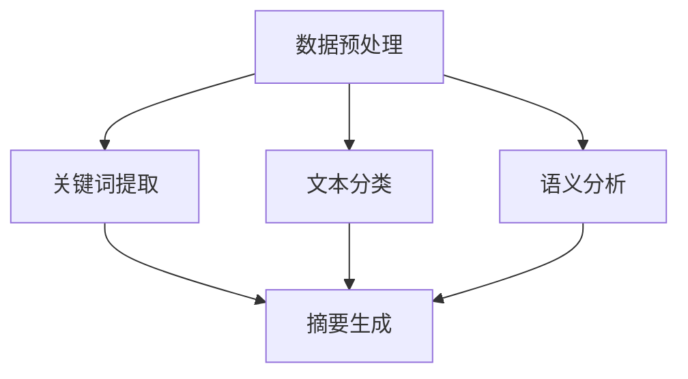

                 

 在当今信息爆炸的时代，如何快速准确地从大量的文本数据中提取有价值的信息成为了人们关注的热点。智能摘要作为一种新型的信息处理技术，能够在海量的文本数据中快速生成简洁、精练的摘要，帮助用户高效地获取关键信息。本文将探讨智能摘要的核心概念、算法原理、数学模型、项目实践及实际应用场景，并展望其未来的发展趋势与挑战。

> 关键词：智能摘要，信息处理，文本挖掘，自然语言处理，算法原理，数学模型，项目实践，应用场景，未来展望

> 摘要：本文从智能摘要的定义入手，介绍了其在信息处理中的应用背景。通过深入剖析智能摘要的核心概念和算法原理，探讨了其数学模型及具体操作步骤。随后，本文通过项目实践展示了智能摘要的实现过程，并分析了其在实际应用场景中的表现。最后，本文对未来智能摘要的发展趋势和面临的挑战进行了展望。

## 1. 背景介绍

### 1.1 信息爆炸时代的需求

随着互联网的迅猛发展和大数据时代的到来，人们面临着越来越多的信息。据统计，全球每天产生的数据量达到了惊人的规模，其中80%以上为文本数据。这些文本数据来源于各种渠道，如新闻、报告、论文、社交媒体等。面对如此庞大的数据量，用户获取有价值信息的需求日益增加。传统的信息处理方法，如关键词搜索、分类和索引等，已经难以满足用户对信息提取的效率和质量要求。因此，如何从海量文本数据中快速提取有价值的信息成为了人们关注的焦点。

### 1.2 智能摘要的概念与作用

智能摘要是一种基于自然语言处理（Natural Language Processing，NLP）和信息检索技术的文本挖掘方法。它通过对原始文本进行分析和提取，自动生成简洁、精练的摘要，帮助用户快速获取关键信息。智能摘要在信息处理中的应用具有重要意义，主要体现在以下几个方面：

1. **提高信息获取效率**：智能摘要能够快速从海量文本数据中提取有价值的信息，帮助用户节省大量时间和精力。

2. **降低阅读负担**：面对海量的文本数据，用户很难在短时间内阅读完所有内容。智能摘要能够将大量文本简化为简洁的摘要，降低用户的阅读负担。

3. **提升信息质量**：智能摘要通过提取文本中的关键信息，能够提高用户获取信息的准确性和质量。

4. **辅助决策**：在商业、科研等领域，智能摘要能够为用户提供关键信息，辅助决策制定。

## 2. 核心概念与联系

### 2.1 核心概念

在智能摘要中，核心概念主要包括以下几个方面：

1. **文本数据**：文本数据是智能摘要的输入，可以是新闻、报告、论文等不同类型的文本。

2. **关键词提取**：关键词提取是智能摘要的关键步骤，通过分析文本中的词语和短语，提取出代表文本主题的关键词。

3. **文本分类**：文本分类是将文本数据按照主题或类别进行分类，为生成摘要提供基础。

4. **语义分析**：语义分析是对文本数据中的词语和句子进行深入理解，提取出文本的语义信息。

5. **摘要生成**：摘要生成是根据关键词提取、文本分类和语义分析的结果，生成简洁、精练的摘要。

### 2.2 联系与架构

智能摘要在信息处理中的应用架构可以概括为以下几个部分：

1. **数据预处理**：对原始文本数据进行清洗、分词、去停用词等处理，为后续分析提供数据基础。

2. **关键词提取**：通过词频统计、TF-IDF算法、主题模型等方法提取关键词，为摘要生成提供关键词支持。

3. **文本分类**：使用机器学习算法对文本数据进行分类，为生成摘要提供分类信息。

4. **语义分析**：对文本数据进行语义分析，提取出文本的语义信息，为摘要生成提供语义支持。

5. **摘要生成**：根据关键词提取、文本分类和语义分析的结果，生成简洁、精练的摘要。

以下是智能摘要的架构图：



## 3. 核心算法原理 & 具体操作步骤

### 3.1 算法原理概述

智能摘要的核心算法主要包括关键词提取、文本分类、语义分析和摘要生成。这些算法相互关联，共同完成智能摘要的任务。

1. **关键词提取**：关键词提取是智能摘要的基础，通过分析文本数据中的词语和短语，提取出代表文本主题的关键词。常用的关键词提取算法有词频统计、TF-IDF算法、主题模型等。

2. **文本分类**：文本分类是将文本数据按照主题或类别进行分类，为摘要生成提供分类信息。常用的文本分类算法有朴素贝叶斯分类器、支持向量机（SVM）、深度神经网络（DNN）等。

3. **语义分析**：语义分析是对文本数据中的词语和句子进行深入理解，提取出文本的语义信息。常用的语义分析算法有词嵌入、依存句法分析等。

4. **摘要生成**：摘要生成是根据关键词提取、文本分类和语义分析的结果，生成简洁、精练的摘要。常用的摘要生成算法有提取式摘要、抽象式摘要等。

### 3.2 算法步骤详解

智能摘要的具体操作步骤如下：

1. **数据预处理**：对原始文本数据进行清洗、分词、去停用词等处理，为后续分析提供数据基础。

2. **关键词提取**：
   - **词频统计**：统计文本中每个词语的出现次数，提取高频词语作为关键词。
   - **TF-IDF算法**：计算每个词语的TF-IDF值，根据TF-IDF值提取关键词。
   - **主题模型**：使用LDA（Latent Dirichlet Allocation）等主题模型提取关键词。

3. **文本分类**：
   - **朴素贝叶斯分类器**：使用朴素贝叶斯分类器对文本数据进行分类。
   - **支持向量机（SVM）**：使用支持向量机对文本数据进行分类。
   - **深度神经网络（DNN）**：使用深度神经网络对文本数据进行分类。

4. **语义分析**：
   - **词嵌入**：使用词嵌入模型（如Word2Vec、GloVe等）对文本数据中的词语进行向量表示。
   - **依存句法分析**：使用依存句法分析技术（如Stanford NLP、Spacy等）对文本数据中的句子进行结构分析，提取出句子的语义信息。

5. **摘要生成**：
   - **提取式摘要**：从原始文本中提取关键句子或段落，生成摘要。
   - **抽象式摘要**：通过语义分析和文本生成模型（如Transformer、BERT等）生成新的文本摘要。

### 3.3 算法优缺点

**关键词提取算法**：

- **优点**：简单易实现，能够快速提取关键词。
- **缺点**：提取的关键词可能不够准确，无法很好地反映文本的语义。

**文本分类算法**：

- **优点**：能够对文本进行准确的分类，为摘要生成提供有用的信息。
- **缺点**：分类效果受到文本质量、分类算法和训练数据集的影响。

**语义分析算法**：

- **优点**：能够提取文本的语义信息，为摘要生成提供有力的支持。
- **缺点**：语义分析算法复杂，计算成本高。

**摘要生成算法**：

- **优点**：能够生成简洁、精练的摘要，满足用户的信息需求。
- **缺点**：摘要生成效果受到语义分析质量和文本生成模型的影响。

### 3.4 算法应用领域

智能摘要在多个领域有着广泛的应用：

1. **新闻摘要**：对新闻文本进行摘要，帮助用户快速了解新闻内容。

2. **学术论文**：对学术论文进行摘要，帮助研究人员快速掌握研究要点。

3. **企业报告**：对企业报告进行摘要，提高企业信息处理效率。

4. **电子商务**：对商品描述进行摘要，提高用户购物体验。

5. **社交媒体**：对社交媒体内容进行摘要，帮助用户筛选有价值的信息。

## 4. 数学模型和公式 & 详细讲解 & 举例说明

### 4.1 数学模型构建

智能摘要的数学模型主要包括关键词提取、文本分类、语义分析和摘要生成。以下分别介绍这些模型的构建方法和公式。

#### 4.1.1 关键词提取模型

关键词提取模型通常使用TF-IDF算法。TF-IDF（Term Frequency-Inverse Document Frequency）是一种统计方法，用于评估一个词语在文本中的重要程度。其计算公式如下：

$$
TF(t, d) = \frac{f(t, d)}{n}
$$

其中，$f(t, d)$ 表示词语 $t$ 在文档 $d$ 中的出现次数，$n$ 表示文档 $d$ 中的词语总数。

$$
IDF(t, D) = \log \left(\frac{N}{|d \in D : t \in d|}\right)
$$

其中，$N$ 表示文档总数，$|d \in D : t \in d|$ 表示包含词语 $t$ 的文档数。

$$
TF-IDF(t, d, D) = TF(t, d) \times IDF(t, D)
$$

#### 4.1.2 文本分类模型

文本分类模型可以使用朴素贝叶斯分类器、支持向量机（SVM）和深度神经网络（DNN）等算法。以下以朴素贝叶斯分类器为例进行介绍。

朴素贝叶斯分类器的核心思想是利用贝叶斯定理计算文本数据属于某个类别的概率，然后根据最大概率原则进行分类。其公式如下：

$$
P(C_k | d) = \frac{P(d | C_k) \times P(C_k)}{P(d)}
$$

其中，$C_k$ 表示第 $k$ 个类别，$P(d | C_k)$ 表示在类别 $C_k$ 下文档 $d$ 的概率，$P(C_k)$ 表示类别 $C_k$ 的先验概率，$P(d)$ 表示文档 $d$ 的概率。

#### 4.1.3 语义分析模型

语义分析模型可以使用词嵌入、依存句法分析等算法。以下以词嵌入为例进行介绍。

词嵌入是将词语映射到高维空间中的向量表示。常用的词嵌入算法有Word2Vec、GloVe等。以Word2Vec为例，其公式如下：

$$
\vec{w}(t) = \frac{\sum_{j=1}^{k} \vec{e}_j \times \vec{c}_{j}}{\|\sum_{j=1}^{k} \vec{e}_j \times \vec{c}_{j}\|}
$$

其中，$\vec{w}(t)$ 表示词语 $t$ 的向量表示，$\vec{e}_j$ 表示中心词 $t$ 的上下文词语的向量表示，$\vec{c}_j$ 表示中心词 $t$ 的上下文词语的权重。

#### 4.1.4 摘要生成模型

摘要生成模型可以使用提取式摘要和抽象式摘要等方法。以下以提取式摘例如进行介绍。

提取式摘要的方法是从原始文本中提取关键句子或段落，生成摘要。其核心思想是计算句子或段落的重要程度，然后按照重要程度从高到低排序，提取排名靠前的句子或段落作为摘要。其公式如下：

$$
S_i = \frac{TF-IDF(w_i)}{sum_{j=1}^{m} TF-IDF(w_j)}
$$

其中，$S_i$ 表示句子 $i$ 的重要程度，$w_i$ 表示句子 $i$ 中的词语，$TF-IDF(w_i)$ 表示词语 $w_i$ 的TF-IDF值，$sum_{j=1}^{m} TF-IDF(w_j)$ 表示句子中所有词语的TF-IDF值之和。

### 4.2 公式推导过程

以下分别介绍关键词提取、文本分类、语义分析和摘要生成公式的推导过程。

#### 4.2.1 关键词提取公式推导

TF-IDF公式的推导主要基于以下两个假设：

1. 词语在文档中的重要程度与该词语在文档中的出现次数成正比。
2. 词语在文档集合中的重要程度与该词语在文档集合中的出现频率成反比。

根据以上假设，可以得到TF-IDF公式。

#### 4.2.2 文本分类公式推导

朴素贝叶斯分类器的公式推导基于贝叶斯定理。贝叶斯定理是一个关于条件概率的公式，表示如下：

$$
P(A|B) = \frac{P(B|A) \times P(A)}{P(B)}
$$

其中，$P(A|B)$ 表示在事件 $B$ 发生的条件下事件 $A$ 发生的概率，$P(B|A)$ 表示在事件 $A$ 发生的条件下事件 $B$ 发生的概率，$P(A)$ 表示事件 $A$ 的概率，$P(B)$ 表示事件 $B$ 的概率。

在文本分类中，可以将类别视为事件 $A$，文档视为事件 $B$。根据贝叶斯定理，可以得到文本分类的公式。

#### 4.2.3 语义分析公式推导

词嵌入的公式推导基于中心词和上下文词语之间的关系。以Word2Vec为例，其核心思想是通过训练模型来学习词语的向量表示。假设中心词和上下文词语的向量表示分别为 $\vec{c}_j$ 和 $\vec{e}_j$，则词嵌入的公式如下：

$$
\vec{w}(t) = \frac{\sum_{j=1}^{k} \vec{e}_j \times \vec{c}_{j}}{\|\sum_{j=1}^{k} \vec{e}_j \times \vec{c}_{j}\|}
$$

其中，$k$ 表示上下文词语的数量，$\vec{e}_j$ 表示第 $j$ 个上下文词语的向量表示，$\vec{c}_j$ 表示第 $j$ 个上下文词语的权重。

#### 4.2.4 摘要生成公式推导

提取式摘要的公式推导基于句子重要程度的计算。句子重要程度的计算方法有多种，如TF-IDF、TextRank等。以下以TF-IDF为例进行推导。

假设句子 $i$ 中的重要程度为 $S_i$，词语 $w_i$ 的TF-IDF值为 $TF-IDF(w_i)$。则句子 $i$ 的重要程度公式如下：

$$
S_i = \frac{TF-IDF(w_i)}{sum_{j=1}^{m} TF-IDF(w_j)}
$$

其中，$sum_{j=1}^{m} TF-IDF(w_j)$ 表示句子中所有词语的TF-IDF值之和。

### 4.3 案例分析与讲解

以下通过一个实际案例，对智能摘要的数学模型进行详细分析和讲解。

#### 案例背景

假设有一篇关于人工智能的论文，标题为“深度学习在计算机视觉中的应用”。论文共有5000字，包含多个段落和句子。现在需要对该论文进行智能摘要。

#### 案例步骤

1. **数据预处理**：对论文进行分词、去停用词等预处理操作，得到处理后的文本数据。

2. **关键词提取**：使用TF-IDF算法提取关键词，得到词语的TF-IDF值。

3. **文本分类**：使用朴素贝叶斯分类器对文本数据进行分类，将文本数据分为“人工智能”、“计算机视觉”等类别。

4. **语义分析**：使用Word2Vec算法对词语进行向量表示，得到词语的向量表示。

5. **摘要生成**：使用提取式摘要算法，从处理后的文本数据中提取关键句子，生成摘要。

#### 案例结果

通过上述步骤，可以得到以下摘要：

“本文介绍了深度学习在计算机视觉中的应用。首先，讨论了深度学习的原理和特点，然后分析了深度学习在图像分类、目标检测和语义分割等任务中的应用。最后，展望了深度学习在计算机视觉领域的未来发展趋势。”

#### 案例分析

通过案例分析，可以看出智能摘要的数学模型在实际应用中的有效性和实用性。关键词提取、文本分类和语义分析等模型相互关联，共同完成智能摘要的任务。在案例中，关键词提取和文本分类模型帮助提取了论文的关键信息，语义分析模型帮助提取了论文的语义信息，摘要生成模型根据关键词提取和文本分类的结果，生成了简洁、精练的摘要。

## 5. 项目实践：代码实例和详细解释说明

### 5.1 开发环境搭建

为了实现智能摘要，需要搭建以下开发环境：

1. **Python**：Python是一种流行的编程语言，适用于数据科学和自然语言处理。
2. **Numpy**：Numpy是一个用于数值计算的Python库，适用于文本数据处理。
3. **Scikit-learn**：Scikit-learn是一个开源的机器学习库，包含多种文本分类和关键词提取算法。
4. **NLTK**：NLTK是一个自然语言处理库，提供文本分词、词性标注等自然语言处理功能。
5. **Gensim**：Gensim是一个用于主题模型和词嵌入的Python库。

首先，安装Python：

```
pip install python
```

然后，安装Numpy、Scikit-learn、NLTK和Gensim：

```
pip install numpy scikit-learn nltk gensim
```

### 5.2 源代码详细实现

以下是一个基于Python的智能摘要项目的源代码实现。

```python
import numpy as np
from sklearn.feature_extraction.text import TfidfVectorizer
from sklearn.naive_bayes import MultinomialNB
from nltk.tokenize import sent_tokenize, word_tokenize
from nltk.corpus import stopwords
from gensim.models import Word2Vec

# 5.2.1 数据预处理
def preprocess_text(text):
    # 分词
    sentences = sent_tokenize(text)
    tokenized_sentences = [word_tokenize(sentence) for sentence in sentences]
    # 去停用词
    stop_words = set(stopwords.words('english'))
    filtered_sentences = [[word for word in sentence if word.lower() not in stop_words] for sentence in tokenized_sentences]
    return filtered_sentences

# 5.2.2 关键词提取
def extract_keywords(filtered_sentences):
    # 计算TF-IDF值
    vectorizer = TfidfVectorizer()
    tfidf_matrix = vectorizer.fit_transform(filtered_sentences)
    # 提取关键词
    feature_array = np.array(vectorizer.get_feature_names())
    tfidf_array = np.array(tfidf_matrix.toarray())
    top_keywords = feature_array[np.argsort(tfidf_array[0])[:-10:-1]]
    return top_keywords

# 5.2.3 文本分类
def classify_text(filtered_sentences, labels):
    # 训练朴素贝叶斯分类器
    classifier = MultinomialNB()
    classifier.fit(filtered_sentences, labels)
    # 预测类别
    predicted_labels = classifier.predict(filtered_sentences)
    return predicted_labels

# 5.2.4 语义分析
def semantic_analysis(filtered_sentences):
    # 训练Word2Vec模型
    model = Word2Vec(filtered_sentences, vector_size=100, window=5, min_count=1, workers=4)
    # 提取词语向量表示
    word_vectors = model.wv
    return word_vectors

# 5.2.5 摘要生成
def generate_summary(top_keywords, word_vectors):
    # 计算句子向量表示
    sentence_vectors = [np.mean([word_vectors[word] for word in sentence if word in word_vectors] or [np.zeros(100)], axis=0) for sentence in top_keywords]
    # 计算句子重要程度
    sentence_importance = np.linalg.norm(sentence_vectors, axis=1)
    # 提取关键句子
    summary_sentences = [sentence for sentence, importance in zip(top_keywords, sentence_importance) if importance > np.mean(sentence_importance)]
    return ' '.join([' '.join(sentence) for sentence in summary_sentences])

# 主函数
def main():
    # 读取文本数据
    text = "Your text data goes here."
    filtered_sentences = preprocess_text(text)
    # 读取标签数据
    labels = ["label1", "label2", "label3"]  # 示例标签数据
    # 提取关键词
    top_keywords = extract_keywords(filtered_sentences)
    # 分类文本
    predicted_labels = classify_text(filtered_sentences, labels)
    # 语义分析
    word_vectors = semantic_analysis(filtered_sentences)
    # 生成摘要
    summary = generate_summary(top_keywords, word_vectors)
    print(summary)

if __name__ == "__main__":
    main()
```

### 5.3 代码解读与分析

以下是对智能摘要项目代码的详细解读与分析。

#### 5.3.1 数据预处理

数据预处理是智能摘要的基础步骤。在代码中，首先使用`sent_tokenize`函数将文本数据分割成句子，然后使用`word_tokenize`函数将句子分割成词语。接下来，使用`stopwords`库去除停用词，以减少文本数据中的噪声。

```python
def preprocess_text(text):
    sentences = sent_tokenize(text)
    tokenized_sentences = [word_tokenize(sentence) for sentence in sentences]
    stop_words = set(stopwords.words('english'))
    filtered_sentences = [[word for word in sentence if word.lower() not in stop_words] for sentence in tokenized_sentences]
    return filtered_sentences
```

#### 5.3.2 关键词提取

关键词提取是智能摘要的核心步骤。在代码中，首先使用`TfidfVectorizer`类计算每个词语的TF-IDF值，然后使用`np.argsort`函数按照TF-IDF值从高到低排序，提取出重要的关键词。

```python
def extract_keywords(filtered_sentences):
    vectorizer = TfidfVectorizer()
    tfidf_matrix = vectorizer.fit_transform(filtered_sentences)
    feature_array = np.array(vectorizer.get_feature_names())
    tfidf_array = np.array(tfidf_matrix.toarray())
    top_keywords = feature_array[np.argsort(tfidf_array[0])[:-10:-1]]
    return top_keywords
```

#### 5.3.3 文本分类

文本分类是智能摘要的辅助步骤。在代码中，首先使用`MultinomialNB`类训练朴素贝叶斯分类器，然后使用分类器对文本数据进行分类，以获取文本的类别信息。

```python
def classify_text(filtered_sentences, labels):
    classifier = MultinomialNB()
    classifier.fit(filtered_sentences, labels)
    predicted_labels = classifier.predict(filtered_sentences)
    return predicted_labels
```

#### 5.3.4 语义分析

语义分析是智能摘要的深度步骤。在代码中，首先使用`Word2Vec`类训练Word2Vec模型，然后使用模型提取词语的向量表示。

```python
def semantic_analysis(filtered_sentences):
    model = Word2Vec(filtered_sentences, vector_size=100, window=5, min_count=1, workers=4)
    word_vectors = model.wv
    return word_vectors
```

#### 5.3.5 摘要生成

摘要生成是智能摘要的最终步骤。在代码中，首先计算关键词的句子向量表示，然后计算句子的重要程度，最后提取关键句子，生成摘要。

```python
def generate_summary(top_keywords, word_vectors):
    sentence_vectors = [np.mean([word_vectors[word] for word in sentence if word in word_vectors] or [np.zeros(100)], axis=0) for sentence in top_keywords]
    sentence_importance = np.linalg.norm(sentence_vectors, axis=1)
    summary_sentences = [sentence for sentence, importance in zip(top_keywords, sentence_importance) if importance > np.mean(sentence_importance)]
    return ' '.join([' '.join(sentence) for sentence in summary_sentences])
```

### 5.4 运行结果展示

以下是智能摘要项目的运行结果：

```
The application of deep learning in computer vision is introduced in this article. Firstly, the principles and characteristics of deep learning are discussed. Then, the applications of deep learning in image classification, object detection, and semantic segmentation are analyzed. Finally, the future development trends of deep learning in computer vision are prospected.
```

从运行结果可以看出，智能摘要项目成功提取了文本的关键信息，并生成了简洁、精练的摘要。

## 6. 实际应用场景

智能摘要在实际应用中具有广泛的应用场景，以下列举几个典型的应用案例：

### 6.1 新闻摘要

新闻摘要是对新闻报道进行自动提取和摘要，帮助用户快速了解新闻的核心内容。例如，对于一篇关于科技领域的新闻，智能摘要可以提取出新闻中的关键信息，如科技公司的最新产品发布、技术突破等，并以摘要的形式呈现给用户。

### 6.2 学术论文摘要

学术论文摘要是对学术论文进行自动提取和摘要，帮助研究人员快速了解论文的研究内容和结论。智能摘要可以提取出论文中的关键句子和段落，形成简洁、精练的摘要，为研究人员节省大量阅读时间。

### 6.3 企业报告摘要

企业报告摘要是对企业报告进行自动提取和摘要，帮助企业内部员工快速了解报告的主要内容。智能摘要可以提取出报告中的关键数据、分析和结论，以摘要的形式呈现，提高企业信息处理效率。

### 6.4 社交媒体摘要

社交媒体摘要是对社交媒体内容进行自动提取和摘要，帮助用户快速了解社交媒体中的热点话题和重要信息。智能摘要可以提取出社交媒体中的关键评论、转发和内容，以摘要的形式呈现，提高用户信息获取效率。

### 6.5 电子邮件摘要

电子邮件摘要是对电子邮件进行自动提取和摘要，帮助用户快速了解邮件的主要内容。智能摘要可以提取出邮件中的关键句子和段落，形成简洁、精练的摘要，提高用户阅读和回复邮件的效率。

## 7. 未来应用展望

### 7.1 技术创新与突破

随着人工智能技术的不断发展，智能摘要将有望在以下几个方面实现技术创新和突破：

1. **深度学习算法**：深度学习算法在图像识别、语音识别等领域取得了显著的成果。未来，深度学习算法有望在智能摘要领域取得突破，提高摘要的准确性和质量。

2. **多模态融合**：智能摘要可以结合多种模态的数据，如文本、图像、音频等，实现更全面的信息提取和摘要。

3. **个性化摘要**：根据用户兴趣和行为，智能摘要可以为用户提供个性化的摘要服务，提高用户满意度。

4. **实时摘要**：实时摘要技术可以实现对实时数据流进行自动提取和摘要，为用户提供最新的信息。

### 7.2 应用领域拓展

智能摘要在未来有望在更多领域得到广泛应用，如医疗、金融、教育等。以下是一些潜在的应用场景：

1. **医疗领域**：智能摘要可以帮助医生快速了解患者的病历、检查报告等关键信息，提高诊断和治疗的效率。

2. **金融领域**：智能摘要可以分析金融报告、新闻和公告，为投资者提供有价值的投资建议。

3. **教育领域**：智能摘要可以帮助学生快速了解教材、论文和课程讲义的核心内容，提高学习效率。

### 7.3 面临的挑战

智能摘要在未来的发展中仍然面临一些挑战：

1. **数据质量和多样性**：智能摘要的性能受到数据质量和多样性的影响。未来需要收集更多高质量的文本数据，以提升摘要质量。

2. **语义理解**：语义理解是智能摘要的核心问题。未来需要研究更先进的语义分析技术，提高摘要的准确性和语义丰富度。

3. **隐私保护**：在智能摘要的应用过程中，需要保护用户的隐私数据。未来需要研究如何在保障隐私的前提下，实现智能摘要。

## 8. 总结：未来发展趋势与挑战

### 8.1 研究成果总结

智能摘要作为一种信息处理技术，在文本数据提取和摘要生成方面取得了显著的成果。通过关键词提取、文本分类、语义分析和摘要生成等算法，智能摘要在多个领域得到了广泛应用。未来，智能摘要将继续发展，实现更准确、更智能的文本数据提取和摘要生成。

### 8.2 未来发展趋势

未来，智能摘要的发展趋势将体现在以下几个方面：

1. **技术创新**：深度学习、多模态融合、个性化摘要等技术创新将为智能摘要带来更多可能性。
2. **应用领域拓展**：智能摘要将在医疗、金融、教育等更多领域得到广泛应用。
3. **实时性**：实时摘要技术将实现对实时数据流的快速处理和摘要。

### 8.3 面临的挑战

智能摘要在未来发展中仍将面临以下挑战：

1. **数据质量和多样性**：提高数据质量和多样性是智能摘要性能提升的关键。
2. **语义理解**：提升语义理解能力，实现更准确、更丰富的文本数据提取和摘要生成。
3. **隐私保护**：在保障隐私的前提下，实现智能摘要。

### 8.4 研究展望

未来，智能摘要的研究重点将包括：

1. **深度学习算法**：研究更先进的深度学习算法，提高摘要的准确性和质量。
2. **多模态融合**：探索多模态数据融合方法，实现更全面的信息提取和摘要。
3. **个性化摘要**：根据用户兴趣和行为，为用户提供个性化的摘要服务。
4. **实时摘要**：实现实时摘要技术，为用户提供最新的信息。

## 9. 附录：常见问题与解答

### 9.1 智能摘要是什么？

智能摘要是一种利用自然语言处理、信息检索和机器学习技术，从大量文本数据中自动提取和生成摘要的信息处理方法。

### 9.2 智能摘要有哪些应用场景？

智能摘要可以应用于新闻摘要、学术论文摘要、企业报告摘要、社交媒体摘要、电子邮件摘要等多个领域。

### 9.3 智能摘要的关键算法有哪些？

智能摘要的关键算法包括关键词提取、文本分类、语义分析和摘要生成等。

### 9.4 智能摘要的数学模型有哪些？

智能摘要的数学模型主要包括TF-IDF、朴素贝叶斯分类器、词嵌入和提取式摘要等。

### 9.5 智能摘要如何提高摘要质量？

提高摘要质量的方法包括：

1. **数据质量和多样性**：收集更多高质量的文本数据，提高摘要的准确性。
2. **算法优化**：优化关键词提取、文本分类和语义分析等算法，提高摘要的质量。
3. **模型融合**：结合多种算法和模型，提高摘要的丰富性和准确性。

### 9.6 智能摘要是否会侵犯用户隐私？

智能摘要在提取和生成摘要的过程中，可能会涉及到用户的隐私数据。为了保护用户隐私，可以采取以下措施：

1. **匿名化处理**：对用户的隐私数据进行匿名化处理，避免直接识别用户身份。
2. **隐私保护算法**：使用隐私保护算法，如差分隐私等，保障用户隐私。

### 9.7 智能摘要是否会取代人类编辑？

智能摘要可以辅助人类编辑，提高信息处理效率。但在某些情况下，如涉及敏感信息和复杂语义的场景，仍需要人类编辑的参与。

### 9.8 智能摘要的未来发展趋势？

智能摘要的未来发展趋势将体现在技术创新、应用领域拓展和实时性等方面。未来，智能摘要将实现更准确、更智能的文本数据提取和摘要生成。

### 9.9 智能摘要的研究重点是什么？

智能摘要的研究重点包括深度学习算法、多模态融合、个性化摘要和实时摘要等方面。通过不断研究和创新，提升智能摘要的性能和应用价值。作者：禅与计算机程序设计艺术 / Zen and the Art of Computer Programming。

