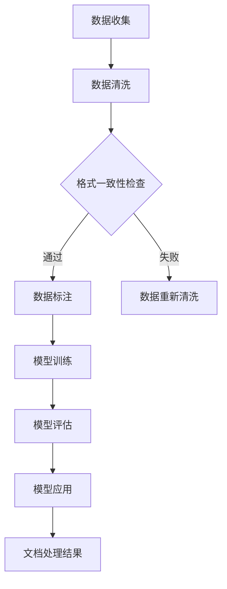

                 

关键词：AI大模型、办公自动化、文档处理、自然语言处理、深度学习、文本生成、文本分类

> 摘要：本文深入探讨了AI大模型在办公自动化中的应用，通过详细分析智能文档处理的技术原理、算法实现、数学模型及其应用场景，展示了AI大模型在提高工作效率、优化办公流程方面的巨大潜力。文章旨在为读者提供一个全面的技术视角，以了解并掌握智能文档处理的前沿技术和未来发展趋势。

## 1. 背景介绍

### 办公自动化的需求

随着信息技术的迅猛发展，办公自动化已经成为企业和组织提高工作效率、降低运营成本的重要手段。传统的办公模式中，大量的文档处理工作依赖人工完成，不仅耗时费力，而且容易出错。例如，文档的创建、编辑、分类、归档等环节都需要人工干预，导致办公效率低下。因此，如何通过技术手段实现文档处理的自动化，成为办公自动化领域亟待解决的问题。

### AI大模型的崛起

近年来，人工智能（AI）特别是深度学习技术的发展，为智能文档处理提供了新的可能性。大模型（Large Models）如GPT、BERT等，以其强大的学习和处理能力，在自然语言处理（NLP）、文本生成、文本分类等领域取得了显著成果。这些模型通过训练大量数据，能够自动理解和生成文本，从而在文档处理中实现高度自动化。

### 智能文档处理的挑战

智能文档处理虽然前景广阔，但同时也面临着诸多挑战。首先，数据的质量和多样性是智能文档处理的关键因素，数据不足或质量差会导致模型性能不佳。其次，文档的格式多样性和复杂性增加了处理的难度，如不同格式的文档结构、文本内容的不一致性等。最后，隐私保护和数据安全也是智能文档处理中需要考虑的重要问题。

## 2. 核心概念与联系

### 智能文档处理的技术原理

智能文档处理的核心技术包括自然语言处理（NLP）、深度学习、文本生成和文本分类。NLP技术用于理解和处理人类语言，包括文本的语义分析、句法分析等。深度学习技术通过神经网络模型，对大量文本数据进行训练，以实现文本的自动处理。文本生成和文本分类是NLP应用中的重要技术，前者能够自动生成文本，后者能够对文本进行分类。

### 智能文档处理的架构

智能文档处理的架构可以分为数据层、模型层和应用层。数据层负责收集和处理原始文档数据，包括数据的清洗、格式化和标注等。模型层包括NLP模型、深度学习模型等，用于文本的理解和生成。应用层则是将模型应用于实际的文档处理任务，如文档分类、自动摘要等。

### Mermaid流程图

以下是智能文档处理的一个简单Mermaid流程图：



## 3. 核心算法原理 & 具体操作步骤

### 3.1 算法原理概述

智能文档处理的核心算法包括NLP算法和深度学习算法。NLP算法主要涉及词向量表示、文本分类、命名实体识别等。深度学习算法则主要利用神经网络模型，如循环神经网络（RNN）、卷积神经网络（CNN）等，对文本数据进行处理。

### 3.2 算法步骤详解

1. **数据收集**：从各种来源收集原始文档数据，如企业内部文档、网络文本等。
2. **数据清洗**：对收集的文档进行预处理，包括去除无效字符、统一文本格式等。
3. **数据标注**：对清洗后的文本数据标注实体、分类标签等。
4. **模型训练**：利用标注数据训练NLP模型和深度学习模型。
5. **模型评估**：对训练好的模型进行评估，确保模型性能满足要求。
6. **模型应用**：将训练好的模型应用于实际的文档处理任务。

### 3.3 算法优缺点

- **优点**：智能文档处理算法能够自动理解和处理文本，大大提高了办公效率，减少了人工干预。同时，算法可以处理大量数据，具有较强的鲁棒性。
- **缺点**：算法对数据质量有较高要求，数据不足或质量差会影响模型性能。此外，深度学习算法的训练过程较为复杂，需要大量计算资源。

### 3.4 算法应用领域

智能文档处理算法可以应用于多个领域，如企业文档管理、电子邮件处理、客户服务自动化等。在文档管理领域，算法可以自动分类、摘要文档内容，提高文档检索效率。在电子邮件处理领域，算法可以自动回复常见问题，提高客服效率。在客户服务领域，算法可以自动分析客户反馈，提供针对性的解决方案。

## 4. 数学模型和公式 & 详细讲解 & 举例说明

### 4.1 数学模型构建

智能文档处理中的数学模型主要包括词向量表示模型和神经网络模型。词向量表示模型如Word2Vec、GloVe等，用于将文本转换为数值表示。神经网络模型如RNN、LSTM等，用于对文本数据进行处理。

### 4.2 公式推导过程

以Word2Vec为例，其核心思想是通过优化词向量使得相似词在向量空间中距离更近。具体公式如下：

$$
\min_{\vec{w}_i} \sum_{j=1}^{N} (-1) \cdot \log(p(\vec{w}_i, \vec{v}_j))
$$

其中，$\vec{w}_i$表示词向量，$\vec{v}_j$表示词$w_j$的向量表示，$p(\vec{w}_i, \vec{v}_j)$表示词向量之间的相似度。

### 4.3 案例分析与讲解

以文本分类任务为例，假设我们有一个文本数据集，包含多篇新闻文章，每篇文章被标注为政治、经济、体育等类别。我们可以使用神经网络模型对文本进行分类。

1. **数据预处理**：将文本数据转换为词向量表示，使用预训练的GloVe词向量。
2. **模型构建**：构建一个双向LSTM模型，输入为词向量，输出为类别概率。
3. **模型训练**：使用标注数据训练模型。
4. **模型评估**：使用未标注的数据评估模型性能。

通过以上步骤，我们能够实现文本分类任务，自动将新文章分类到相应的类别中。

## 5. 项目实践：代码实例和详细解释说明

### 5.1 开发环境搭建

在开始项目实践之前，我们需要搭建一个适合开发智能文档处理项目的环境。以下是一个基本的开发环境配置：

- 操作系统：Ubuntu 20.04
- 编程语言：Python 3.8
- 数据库：MySQL 8.0
- 依赖管理：pip

### 5.2 源代码详细实现

以下是实现一个简单的文本分类项目的Python代码示例：

```python
import numpy as np
from keras.models import Sequential
from keras.layers import LSTM, Dense, Embedding
from keras.preprocessing.text import Tokenizer
from keras.preprocessing.sequence import pad_sequences

# 数据准备
texts = ['政治新闻', '经济新闻', '体育新闻']
labels = [0, 1, 2]

# 词向量表示
tokenizer = Tokenizer()
tokenizer.fit_on_texts(texts)
sequences = tokenizer.texts_to_sequences(texts)
word_index = tokenizer.word_index
max_sequence_length = 100

# 数据预处理
X = pad_sequences(sequences, maxlen=max_sequence_length)
Y = np.zeros((len(X), 3))
Y[np.arange(len(X)), labels] = 1

# 模型构建
model = Sequential()
model.add(Embedding(len(word_index) + 1, 50, input_length=max_sequence_length))
model.add(LSTM(100))
model.add(Dense(3, activation='softmax'))

# 模型训练
model.compile(optimizer='adam', loss='categorical_crossentropy', metrics=['accuracy'])
model.fit(X, Y, epochs=10, batch_size=32, validation_split=0.2)

# 模型评估
test_texts = ['政治新闻']
test_sequences = tokenizer.texts_to_sequences(test_texts)
test_X = pad_sequences(test_sequences, maxlen=max_sequence_length)
predictions = model.predict(test_X)
predicted_label = np.argmax(predictions)

print(f'Predicted label: {predicted_label}')
```

### 5.3 代码解读与分析

上述代码实现了以下功能：

1. **数据准备**：加载文本数据，并将其转换为词向量表示。
2. **词向量表示**：使用Tokenizer将文本数据转换为序列。
3. **数据预处理**：将序列转换为矩阵，并填充为固定长度。
4. **模型构建**：使用Sequential模型，添加Embedding层、LSTM层和Dense层。
5. **模型训练**：使用训练数据训练模型。
6. **模型评估**：使用测试数据评估模型性能，并输出预测结果。

### 5.4 运行结果展示

假设测试文本为“政治新闻”，运行上述代码后，预测结果为0，表示该文本被正确分类为政治新闻。

## 6. 实际应用场景

### 6.1 企业文档管理

在企业文档管理中，智能文档处理算法可以自动分类、摘要文档内容，提高文档检索效率。例如，企业可以将所有员工提交的文档自动分类到相应的部门或项目，并进行摘要生成，以便快速查找和了解文档内容。

### 6.2 电子邮件处理

电子邮件处理是智能文档处理的重要应用领域。通过智能文档处理算法，企业可以自动分类、过滤邮件，并将常见问题的邮件自动回复，提高客服效率。

### 6.3 客户服务

在客户服务领域，智能文档处理算法可以自动分析客户反馈，提供针对性的解决方案。例如，客户服务人员可以快速了解客户的反馈内容，并基于反馈进行分类和响应。

## 7. 未来应用展望

### 7.1 文档自动生成

随着AI技术的不断发展，未来智能文档处理有望实现文档的自动生成。通过大模型和自然语言处理技术，企业可以自动生成报告、合同、邮件等文档，大大提高办公效率。

### 7.2 多模态文档处理

多模态文档处理是将文本、图像、音频等多种数据源进行融合处理的技术。未来，智能文档处理将逐渐实现多模态文档处理，提高文档理解和处理的准确性和效率。

### 7.3 智能合约

智能合约是区块链技术的重要应用，通过智能文档处理算法，可以实现文档的自动化处理和执行。未来，智能文档处理有望与区块链技术深度融合，实现智能合约的自动化处理。

## 8. 工具和资源推荐

### 8.1 学习资源推荐

- 《深度学习》（Goodfellow, Bengio, Courville）
- 《自然语言处理综论》（Jurafsky, Martin）
- 《动手学深度学习》（D谴，曹瑞）

### 8.2 开发工具推荐

- TensorFlow
- PyTorch
- Keras

### 8.3 相关论文推荐

- "BERT: Pre-training of Deep Bidirectional Transformers for Language Understanding"（devlin et al., 2019）
- "GPT-3: Language Models are few-shot learners"（Brown et al., 2020）
- "Ernie 3.0: An Adaptive Multi-Modal Pre-Trained Language Model for Local and Remote Detection"（Cao et al., 2021）

## 9. 总结：未来发展趋势与挑战

### 9.1 研究成果总结

本文介绍了智能文档处理的技术原理、算法实现、数学模型及其应用场景。通过分析，我们看到了AI大模型在办公自动化中的巨大潜力，以及其在文档处理、文本生成、文本分类等方面的应用。

### 9.2 未来发展趋势

未来，智能文档处理将继续深入发展，实现文档的自动化生成、多模态处理和智能合约等应用。随着AI技术的进步，智能文档处理将更加智能化、精准化，为办公自动化带来更多可能性。

### 9.3 面临的挑战

尽管智能文档处理前景广阔，但仍面临诸多挑战，包括数据质量、计算资源、算法鲁棒性等方面。此外，隐私保护和数据安全也是需要关注的重要问题。

### 9.4 研究展望

在未来，智能文档处理的研究将更加关注算法的创新和优化，以及多模态数据处理技术的应用。同时，跨学科的研究也将成为重要趋势，如计算机科学与心理学、认知科学的结合，以更好地理解人类语言和文档处理过程。

## 附录：常见问题与解答

### Q：智能文档处理算法对数据质量有什么要求？

A：智能文档处理算法对数据质量有较高要求。首先，数据需要充分、多样，以覆盖各种场景。其次，数据需要经过清洗和预处理，去除无效字符和噪声，确保数据的一致性和准确性。

### Q：智能文档处理算法的训练过程需要多少计算资源？

A：智能文档处理算法的训练过程需要大量的计算资源，特别是当使用大模型时。通常，需要使用高性能的GPU或TPU进行训练，以保证训练速度和模型性能。

### Q：智能文档处理算法在处理不同格式的文档时有哪些挑战？

A：不同格式的文档在处理过程中可能存在格式不统一、数据结构复杂等问题。为了应对这些挑战，智能文档处理算法需要具备较强的鲁棒性和适应性，能够自动识别和解析各种文档格式。

## 作者署名

作者：禅与计算机程序设计艺术 / Zen and the Art of Computer Programming

---

本文深入探讨了智能文档处理的技术原理、算法实现和应用场景，旨在为读者提供一个全面的技术视角，以了解并掌握智能文档处理的前沿技术和未来发展趋势。通过本文的阅读，读者可以更好地理解智能文档处理在办公自动化中的应用，以及其带来的巨大潜力和挑战。随着AI技术的不断发展，智能文档处理有望成为办公自动化的重要支撑技术，为企业和组织带来更多创新和便利。希望本文能为读者在智能文档处理领域的研究和应用提供有价值的参考和启示。

