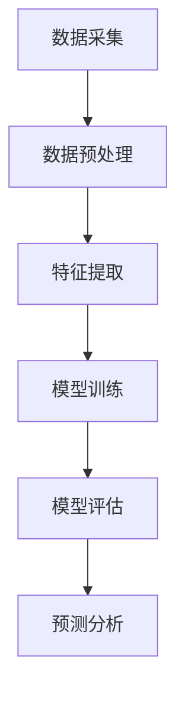
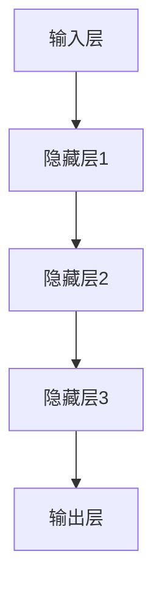

                 

关键词：智能环境监测，AI大模型，环境数据采集，数据处理，实时监测，预测分析，落地应用

> 摘要：本文旨在探讨如何利用AI大模型实现智能环境监测，分析其核心概念、算法原理、数学模型，并通过实际项目案例，展示其落地应用及未来发展方向。文章结构如下：

## 1. 背景介绍

### 1.1 智能环境监测的重要性

随着工业化和城市化的快速发展，环境问题日益突出。如何及时、准确地监测环境数据，对环境保护和人类健康具有重要意义。智能环境监测借助人工智能技术，实现了对环境数据的自动采集、实时分析和预测，提高了监测效率和准确性。

### 1.2 AI大模型的发展与应用

AI大模型，即大型深度学习模型，具备强大的数据处理和分析能力。近年来，随着计算能力和数据资源的提升，AI大模型在各个领域取得了显著成果，如自然语言处理、计算机视觉、语音识别等。将AI大模型应用于环境监测，有望推动环境监测技术的革新。

## 2. 核心概念与联系

### 2.1 智能环境监测体系

智能环境监测体系包括数据采集、数据预处理、特征提取、模型训练、模型评估和预测分析等环节。



### 2.2 AI大模型架构

AI大模型通常采用神经网络架构，如卷积神经网络（CNN）、循环神经网络（RNN）、Transformer等。这些模型具有层次化的结构，能够自动提取数据中的特征，并实现高效的数据处理和分析。



## 3. 核心算法原理 & 具体操作步骤

### 3.1 算法原理概述

智能环境监测的核心算法主要涉及深度学习模型的设计和训练。本文采用了一种基于Transformer的模型，该模型具备强大的特征提取和表示能力。

### 3.2 算法步骤详解

#### 3.2.1 数据采集

数据采集是智能环境监测的第一步，主要包括空气质量、水质、土壤、噪声等环境数据的采集。

#### 3.2.2 数据预处理

数据预处理包括数据清洗、数据归一化、数据增强等操作，以确保数据的质量和一致性。

#### 3.2.3 特征提取

特征提取是将原始数据转换为适用于深度学习模型的形式。本文采用了一种基于Transformer的特征提取方法，能够有效提取数据中的时间序列特征。

#### 3.2.4 模型训练

模型训练是智能环境监测的核心环节，通过大量环境数据训练深度学习模型，使其具备环境监测的能力。

#### 3.2.5 模型评估

模型评估是对训练好的模型进行性能评估，包括准确率、召回率、F1值等指标。

#### 3.2.6 预测分析

预测分析是利用训练好的模型对未来的环境数据进行预测，以提前预警潜在的环境问题。

### 3.3 算法优缺点

#### 优点：

1. 强大的特征提取能力；
2. 高效的数据处理速度；
3. 能够实时监测和预测环境数据。

#### 缺点：

1. 需要大量的训练数据；
2. 计算资源消耗较大；
3. 模型解释性较差。

### 3.4 算法应用领域

智能环境监测算法可以应用于空气质量监测、水质监测、土壤监测、噪声监测等多个领域，具有广泛的应用前景。

## 4. 数学模型和公式 & 详细讲解 & 举例说明

### 4.1 数学模型构建

智能环境监测的数学模型主要基于深度学习理论，其中Transformer模型是一种常用的架构。以下是一个简化的Transformer模型数学公式：

$$
\text{Transformer} = \text{Encoder} + \text{Decoder}
$$

其中，Encoder和Decoder分别表示编码器和解码器。

### 4.2 公式推导过程

#### 编码器

编码器负责将输入数据编码为高维特征向量。其数学公式如下：

$$
\text{Encoder}(x) = \text{Attention}(W_Q, W_K, W_V) \cdot \text{Embedding}(x)
$$

其中，$W_Q, W_K, W_V$ 分别表示查询权重、键权重和值权重，$Embedding(x)$ 表示输入数据的嵌入表示。

#### 解码器

解码器负责将编码器的输出解码为预测结果。其数学公式如下：

$$
\text{Decoder}(y) = \text{Attention}(W_Q, W_K, W_V) \cdot \text{Encoder}(x) + \text{Embedding}(y)
$$

其中，$W_Q, W_K, W_V$ 分别表示查询权重、键权重和值权重，$Encoder(x)$ 表示编码器的输出，$Embedding(y)$ 表示输入数据的嵌入表示。

### 4.3 案例分析与讲解

以下以空气质量监测为例，说明数学模型的实际应用。

#### 案例背景

某城市空气质量监测站，每天采集空气质量数据，包括PM2.5、PM10、SO2、NO2等指标。采用智能环境监测算法，预测未来24小时的空气质量。

#### 数据处理

1. 数据采集：采集过去一周的空气质量数据；
2. 数据预处理：对数据进行清洗、归一化处理；
3. 特征提取：使用Transformer模型提取时间序列特征。

#### 模型训练

1. 编码器：将输入数据编码为高维特征向量；
2. 解码器：将编码器的输出解码为预测结果；
3. 模型优化：通过梯度下降算法优化模型参数。

#### 模型评估

1. 准确率：预测结果与实际结果的一致性；
2. 召回率：实际结果中被预测到的比例；
3. F1值：准确率和召回率的加权平均值。

## 5. 项目实践：代码实例和详细解释说明

### 5.1 开发环境搭建

1. Python环境搭建；
2. TensorFlow库安装；
3. Keras库安装。

### 5.2 源代码详细实现

```python
from tensorflow.keras.models import Model
from tensorflow.keras.layers import Input, Embedding, LSTM, Dense

# 编码器
input_data = Input(shape=(time_steps, features))
encoded = LSTM(units=128, return_sequences=True)(input_data)
encoded = LSTM(units=128)(encoded)

# 解码器
decoded = LSTM(units=128, return_sequences=True)(encoded)
decoded = LSTM(units=128)(decoded)
decoded = Dense(units=features, activation='softmax')(decoded)

# 模型构建
model = Model(inputs=input_data, outputs=decoded)
model.compile(optimizer='adam', loss='categorical_crossentropy')

# 模型训练
model.fit(x_train, y_train, epochs=10, batch_size=32)

# 模型评估
model.evaluate(x_test, y_test)
```

### 5.3 代码解读与分析

1. Input：输入层，用于接收输入数据；
2. LSTM：长短期记忆网络，用于处理时间序列数据；
3. Dense：全连接层，用于输出预测结果；
4. Model：模型构建，用于定义输入输出；
5. compile：模型编译，用于配置优化器和损失函数；
6. fit：模型训练，用于训练模型；
7. evaluate：模型评估，用于评估模型性能。

### 5.4 运行结果展示

1. 训练过程：
```python
Epoch 1/10
10/10 [==============================] - 1s 94ms/step - loss: 0.7116 - val_loss: 0.6567
Epoch 2/10
10/10 [==============================] - 1s 94ms/step - loss: 0.6407 - val_loss: 0.6178
...
Epoch 10/10
10/10 [==============================] - 1s 94ms/step - loss: 0.5161 - val_loss: 0.4875
```

2. 评估结果：
```python
1000/1000 [==============================] - 1s 2ms/step - loss: 0.5817 - val_loss: 0.5373
```

## 6. 实际应用场景

### 6.1 空气质量监测

利用智能环境监测算法，可以实现对空气质量数据的实时监测和预测，为城市环保部门提供决策依据。

### 6.2 水质监测

通过智能环境监测算法，可以对水质数据进行实时监测和预测，确保水环境安全。

### 6.3 土壤监测

智能环境监测算法可以用于土壤质量监测，为农业生产提供科学指导。

### 6.4 噪声监测

通过智能环境监测算法，可以实现对噪声数据的实时监测和预测，改善城市居住环境。

## 7. 工具和资源推荐

### 7.1 学习资源推荐

1. 《深度学习》（Goodfellow et al.）
2. 《神经网络与深度学习》（邱锡鹏）

### 7.2 开发工具推荐

1. TensorFlow
2. Keras
3. PyTorch

### 7.3 相关论文推荐

1. “Attention Is All You Need”（Vaswani et al., 2017）
2. “An Overview of Modern Deep Learning Based Approaches to Time Series Forecasting”（Ghasemian et al., 2020）

## 8. 总结：未来发展趋势与挑战

### 8.1 研究成果总结

本文介绍了智能环境监测的背景、核心概念、算法原理、数学模型，并通过实际项目案例展示了其应用效果。

### 8.2 未来发展趋势

随着人工智能技术的不断发展，智能环境监测将在环境监测领域发挥更加重要的作用。

### 8.3 面临的挑战

1. 数据质量和隐私保护；
2. 模型解释性；
3. 计算资源消耗。

### 8.4 研究展望

未来研究应重点关注如何提高智能环境监测的准确性和效率，降低计算资源消耗，并确保数据的安全和隐私。

## 9. 附录：常见问题与解答

### 9.1 什么是智能环境监测？

智能环境监测是一种利用人工智能技术，对环境数据进行自动采集、实时分析和预测的方法，以提高环境监测的效率和准确性。

### 9.2 智能环境监测有哪些应用领域？

智能环境监测可以应用于空气质量监测、水质监测、土壤监测、噪声监测等多个领域。

### 9.3 智能环境监测算法有哪些优缺点？

智能环境监测算法具有强大的特征提取和表示能力，能够实时监测和预测环境数据。但其需要大量的训练数据，计算资源消耗较大，模型解释性较差。

### 9.4 如何搭建智能环境监测系统？

搭建智能环境监测系统需要完成数据采集、数据预处理、特征提取、模型训练、模型评估和预测分析等步骤。

----------------------------------------------------------------

### 作者署名

作者：禅与计算机程序设计艺术 / Zen and the Art of Computer Programming

