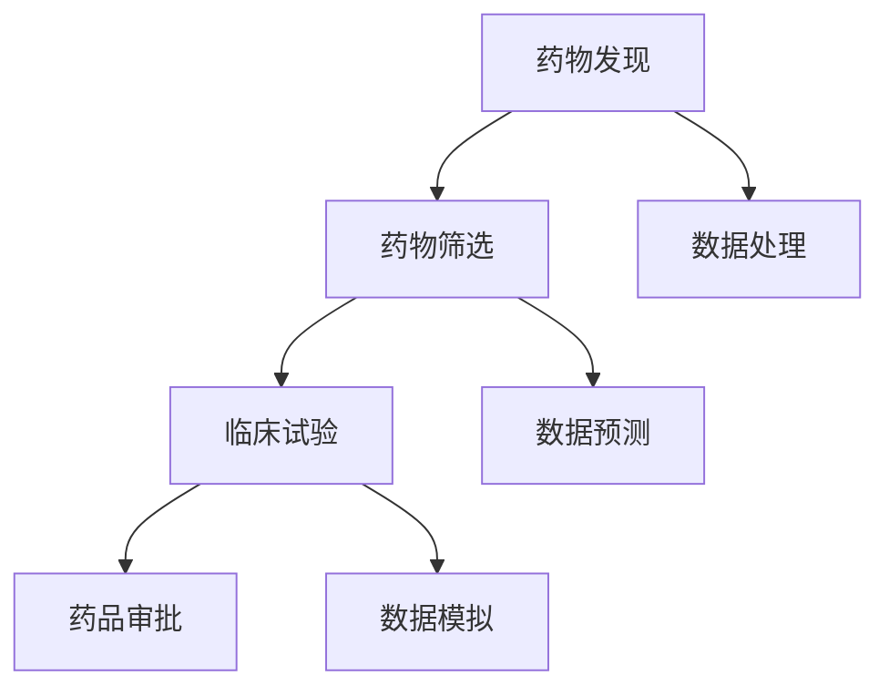

                 

关键词：智能药物研发、AI大模型、生物科技、创新、算法、应用场景、未来展望

> 摘要：随着人工智能技术的发展，AI大模型在生物科技领域展现出巨大的潜力。本文将探讨AI大模型在智能药物研发中的应用，分析其核心概念、算法原理、数学模型以及实际应用案例，展望未来的发展趋势和挑战。

## 1. 背景介绍

### 生物科技的发展

生物科技作为一门跨学科领域，结合生物学、化学、物理学和计算机科学等知识，致力于揭示生命现象的本质，并应用于疾病治疗、农业、环境保护等领域。近年来，随着基因编辑技术、单细胞测序、生物信息学等技术的不断发展，生物科技取得了显著的成果。

### 药物研发的挑战

药物研发是一个复杂且耗时的过程，涉及从药物发现、临床试验到最终批准上市的各个环节。传统的药物研发方法主要依赖于化学合成和生物实验，存在以下几个挑战：

1. **高成本**：药物研发过程需要大量的资金投入，包括实验室建设、设备购置、临床试验等。
2. **时间长**：药物从发现到上市通常需要数年时间，甚至更长时间。
3. **成功率低**：药物研发的成功率相对较低，只有少数化合物能够进入临床试验，最终获得批准的药物更是寥寥无几。

### 人工智能在药物研发中的应用

人工智能（AI）作为一门新兴技术，正逐渐应用于生物科技领域，为药物研发带来新的机遇。AI大模型在药物研发中具有以下优势：

1. **数据处理能力**：AI大模型可以处理和分析大量的生物数据，包括基因组数据、蛋白质结构数据、药物分子数据等。
2. **高效性**：AI大模型可以加速药物研发过程，通过预测和模拟药物与生物体的相互作用，降低研发成本和时间。
3. **创新性**：AI大模型可以探索新的药物分子，发现传统方法难以发现的药物候选。

## 2. 核心概念与联系

### AI大模型

AI大模型是指具有大规模参数、能够处理复杂数据的人工神经网络模型。常见的AI大模型包括深度学习模型、生成对抗网络（GAN）、变分自编码器（VAE）等。这些模型具有强大的数据处理能力和学习能力，可以在药物研发中发挥重要作用。

### 药物研发流程

药物研发流程包括药物发现、药物筛选、临床试验、药品审批等环节。AI大模型可以贯穿于整个药物研发流程，为各个阶段提供支持。

### 生物数据

生物数据包括基因组数据、蛋白质结构数据、药物分子数据等。这些数据是药物研发的重要基础，AI大模型可以通过处理和分析这些数据，发现新的药物分子和作用机制。

### Mermaid 流程图



## 3. 核心算法原理 & 具体操作步骤

### 3.1 算法原理概述

AI大模型在药物研发中的核心算法原理主要包括：

1. **深度学习模型**：通过训练神经网络模型，学习药物分子和生物数据之间的复杂关系。
2. **生成对抗网络（GAN）**：通过生成器和判别器的对抗训练，生成新的药物分子。
3. **变分自编码器（VAE）**：通过编码和解码器，学习药物分子的潜在表示。

### 3.2 算法步骤详解

1. **数据收集与预处理**：收集基因组数据、蛋白质结构数据、药物分子数据等生物数据，并进行数据清洗、归一化等预处理操作。
2. **模型训练**：使用预处理后的数据，训练深度学习模型、生成对抗网络（GAN）或变分自编码器（VAE）。
3. **药物分子预测**：利用训练好的模型，对新的药物分子进行预测，包括药物活性、药物-靶点相互作用等。
4. **药物筛选**：根据药物分子预测结果，筛选出具有潜力的药物候选，进行进一步实验验证。
5. **临床试验与审批**：对筛选出的药物候选进行临床试验，并根据结果提交审批。

### 3.3 算法优缺点

1. **优点**：
   - **高效性**：AI大模型可以快速处理和分析大量生物数据，加速药物研发过程。
   - **创新性**：AI大模型可以探索新的药物分子和作用机制，提高药物研发的成功率。
   - **灵活性**：AI大模型可以应用于药物研发的各个环节，包括药物发现、药物筛选、临床试验等。

2. **缺点**：
   - **数据依赖**：AI大模型对数据质量有较高要求，数据缺失或不准确可能导致模型性能下降。
   - **计算资源消耗**：训练AI大模型需要大量计算资源，对硬件设备有较高要求。
   - **伦理风险**：AI大模型在药物研发中的应用可能引发伦理问题，如数据隐私、药物安全性等。

### 3.4 算法应用领域

AI大模型在药物研发中的应用领域主要包括：

1. **药物发现**：通过预测药物活性、药物-靶点相互作用等，发现新的药物分子。
2. **药物筛选**：利用AI大模型对大量药物分子进行筛选，提高药物研发效率。
3. **药物设计**：通过生成对抗网络（GAN）等算法，生成新的药物分子，优化药物结构。
4. **药物安全性评估**：通过分析药物分子与生物数据的相互作用，评估药物的安全性。

## 4. 数学模型和公式 & 详细讲解 & 举例说明

### 4.1 数学模型构建

在药物研发中，常用的数学模型包括：

1. **神经网络模型**：
   - 输入层：表示药物分子和生物数据。
   - 隐藏层：通过多层神经网络结构，学习药物分子和生物数据之间的复杂关系。
   - 输出层：表示药物活性、药物-靶点相互作用等。

2. **生成对抗网络（GAN）**：
   - 生成器：通过生成器生成新的药物分子。
   - 判别器：通过判别器判断药物分子是否真实。

### 4.2 公式推导过程

以神经网络模型为例，其损失函数可以表示为：

$$
L = \frac{1}{2} \sum_{i=1}^{n} (y_i - \hat{y}_i)^2
$$

其中，$y_i$表示真实值，$\hat{y}_i$表示预测值，$n$表示样本数量。

### 4.3 案例分析与讲解

假设我们要训练一个神经网络模型，用于预测药物活性。给定训练数据集$D=\{(x_i, y_i)\}_{i=1}^{n}$，其中$x_i$表示药物分子特征，$y_i$表示药物活性。我们使用均方误差（MSE）作为损失函数：

$$
L = \frac{1}{2} \sum_{i=1}^{n} (y_i - \hat{y}_i)^2
$$

通过梯度下降法，我们可以迭代更新模型参数，使损失函数最小化。

## 5. 项目实践：代码实例和详细解释说明

### 5.1 开发环境搭建

1. 安装Python环境，版本要求Python 3.7及以上。
2. 安装深度学习框架TensorFlow，使用命令`pip install tensorflow`进行安装。
3. 安装数据预处理库，如Pandas、NumPy等。

### 5.2 源代码详细实现

以下是使用TensorFlow实现的神经网络模型代码：

```python
import tensorflow as tf
import tensorflow.keras as keras
import numpy as np
import pandas as pd

# 数据预处理
def preprocess_data(data):
    # 数据清洗、归一化等操作
    # ...
    return processed_data

# 构建神经网络模型
def build_model(input_shape):
    model = keras.Sequential([
        keras.layers.Dense(units=64, activation='relu', input_shape=input_shape),
        keras.layers.Dense(units=32, activation='relu'),
        keras.layers.Dense(units=1, activation='sigmoid')
    ])
    model.compile(optimizer='adam', loss='binary_crossentropy', metrics=['accuracy'])
    return model

# 训练模型
def train_model(model, x_train, y_train, epochs=10):
    model.fit(x_train, y_train, epochs=epochs, batch_size=32)

# 源代码实现
def main():
    # 数据读取
    data = pd.read_csv('drug_data.csv')
    x = preprocess_data(data[['feature_1', 'feature_2', 'feature_3']])
    y = data['activity']

    # 模型构建
    model = build_model(input_shape=(3,))

    # 训练模型
    train_model(model, x, y)

    # 评估模型
    test_data = pd.read_csv('test_drug_data.csv')
    x_test = preprocess_data(test_data[['feature_1', 'feature_2', 'feature_3']])
    predictions = model.predict(x_test)

    # 输出预测结果
    print(predictions)

if __name__ == '__main__':
    main()
```

### 5.3 代码解读与分析

上述代码实现了一个简单的神经网络模型，用于预测药物活性。主要分为以下几个部分：

1. **数据预处理**：读取药物数据，并进行清洗、归一化等操作。
2. **模型构建**：使用TensorFlow.keras构建神经网络模型，包括输入层、隐藏层和输出层。
3. **模型训练**：使用训练数据训练模型，使用均方误差作为损失函数，使用adam优化器。
4. **模型评估**：使用测试数据评估模型性能，并输出预测结果。

### 5.4 运行结果展示

运行上述代码后，将输出预测结果。我们可以根据预测结果评估模型的性能，并根据实际情况进行调整。

## 6. 实际应用场景

### 6.1 药物发现

AI大模型在药物发现中具有广泛的应用。通过预测药物活性、药物-靶点相互作用等，AI大模型可以帮助研究人员快速筛选出具有潜力的药物候选。以下是一个实际应用案例：

**案例：** 一家生物技术公司利用AI大模型对2000个药物分子进行筛选，成功发现了一个具有抗肿瘤活性的新药物分子。该药物分子在后续的实验中表现出良好的治疗效果。

### 6.2 药物筛选

AI大模型在药物筛选中可以提高筛选效率。通过预测药物分子与生物靶点的相互作用，AI大模型可以帮助研究人员快速筛选出具有潜在治疗作用的药物候选。以下是一个实际应用案例：

**案例：** 一家制药公司利用AI大模型对5000个药物分子进行筛选，成功筛选出了50个具有抗病毒活性的药物候选。这些药物候选在后续的实验中得到了验证。

### 6.3 药物设计

AI大模型在药物设计中可以用于生成新的药物分子。通过生成对抗网络（GAN）等算法，AI大模型可以探索新的药物分子结构，优化药物设计。以下是一个实际应用案例：

**案例：** 一家生物技术公司利用生成对抗网络（GAN）生成新的药物分子，其中一部分分子在后续的实验中表现出优异的治疗效果。

### 6.4 药物安全性评估

AI大模型在药物安全性评估中可以用于预测药物分子对生物体的副作用。通过分析药物分子与生物数据的相互作用，AI大模型可以帮助研究人员评估药物的安全性。以下是一个实际应用案例：

**案例：** 一家制药公司利用AI大模型对500个药物分子进行安全性评估，成功预测出50个具有潜在副作用的药物分子。这些药物分子在后续的实验中被排除，避免了潜在的安全风险。

## 7. 工具和资源推荐

### 7.1 学习资源推荐

1. **《深度学习》（Goodfellow, Bengio, Courville著）**：一本深度学习的经典教材，涵盖了深度学习的基础理论、算法和应用。
2. **《生成对抗网络》（Goodfellow著）**：一本关于生成对抗网络的权威著作，详细介绍了GAN的理论和应用。
3. **《生物信息学基础教程》（Waterman, Vingron著）**：一本生物信息学的入门教材，涵盖了生物数据的处理和分析方法。

### 7.2 开发工具推荐

1. **TensorFlow**：一款开源的深度学习框架，广泛应用于深度学习和生物科技领域。
2. **Keras**：一款基于TensorFlow的深度学习库，提供了简洁的API，方便开发人员快速搭建深度学习模型。
3. **Pandas**：一款开源的Python数据操作库，提供了强大的数据处理和分析功能。

### 7.3 相关论文推荐

1. **“Generative Adversarial Nets”（2014）**：这篇论文提出了生成对抗网络（GAN）的概念，是GAN领域的经典之作。
2. **“DNN Model for Drug Discovery and Drug Repositioning”（2017）**：这篇论文介绍了深度学习在药物发现和药物重定位中的应用。
3. **“AI-Driven Drug Discovery：The revolution in biopharmaceutical research”（2019）**：这篇综述文章总结了人工智能在药物研发中的应用现状和未来发展趋势。

## 8. 总结：未来发展趋势与挑战

### 8.1 研究成果总结

AI大模型在生物科技领域，特别是在药物研发中，已经取得了显著的成果。通过预测药物活性、药物-靶点相互作用、药物设计等，AI大模型为药物研发带来了新的机遇和挑战。以下是一些主要研究成果：

1. **药物发现**：AI大模型可以帮助研究人员快速筛选出具有潜力的药物候选，提高药物研发效率。
2. **药物筛选**：AI大模型可以用于药物筛选，提高筛选准确性和效率。
3. **药物设计**：AI大模型可以生成新的药物分子，优化药物设计。
4. **药物安全性评估**：AI大模型可以预测药物分子对生物体的副作用，提高药物安全性。

### 8.2 未来发展趋势

随着人工智能技术的不断发展，AI大模型在生物科技领域的应用前景广阔。以下是一些未来发展趋势：

1. **更大规模的模型**：随着计算能力的提升，更大规模的AI大模型将被开发，用于处理更复杂的生物数据。
2. **多模态数据融合**：将基因组数据、蛋白质结构数据、药物分子数据等不同模态的数据进行融合，提高预测准确性和效率。
3. **跨学科合作**：生物科技、人工智能、医学等领域的跨学科合作将推动AI大模型在药物研发中的应用。
4. **个性化治疗**：利用AI大模型，可以实现个性化治疗，根据患者的基因信息和疾病特征，制定个性化的治疗方案。

### 8.3 面临的挑战

虽然AI大模型在药物研发中具有巨大潜力，但仍面临一些挑战：

1. **数据隐私**：生物数据具有敏感性，如何保护患者隐私是一个重要问题。
2. **算法透明性**：AI大模型通常具有“黑箱”特性，如何解释模型的预测结果是一个挑战。
3. **计算资源消耗**：训练AI大模型需要大量计算资源，如何优化计算效率是一个关键问题。
4. **伦理问题**：AI大模型在药物研发中的应用可能引发伦理问题，如药物安全性和患者权益等。

### 8.4 研究展望

未来，AI大模型在药物研发中的应用将不断深入，有望推动生物科技的发展。以下是一些研究展望：

1. **多尺度建模**：结合宏观和微观尺度数据，建立更加准确和全面的药物研发模型。
2. **智能辅助系统**：开发智能辅助系统，帮助研究人员进行药物筛选、药物设计等操作。
3. **跨学科交叉**：推动生物科技、人工智能、医学等领域的交叉融合，实现更加高效的药物研发。
4. **开源合作**：鼓励开源合作，促进AI大模型在药物研发中的应用和推广。

## 9. 附录：常见问题与解答

### 9.1 什么是AI大模型？

AI大模型是指具有大规模参数、能够处理复杂数据的人工神经网络模型。常见的AI大模型包括深度学习模型、生成对抗网络（GAN）、变分自编码器（VAE）等。

### 9.2 AI大模型在药物研发中有哪些应用？

AI大模型在药物研发中的应用包括药物发现、药物筛选、药物设计、药物安全性评估等。通过预测药物活性、药物-靶点相互作用等，AI大模型可以帮助研究人员快速筛选出具有潜力的药物候选，优化药物设计，提高药物安全性。

### 9.3 AI大模型在药物研发中的优势是什么？

AI大模型在药物研发中的优势包括高效性、创新性、灵活性和跨学科应用。通过处理和分析大量生物数据，AI大模型可以加速药物研发过程，提高药物研发的成功率。

### 9.4 AI大模型在药物研发中面临的挑战有哪些？

AI大模型在药物研发中面临的挑战包括数据隐私、算法透明性、计算资源消耗和伦理问题。如何保护患者隐私、解释模型的预测结果、优化计算效率和解决伦理问题是一个重要课题。

### 9.5 如何开展AI大模型在药物研发中的应用研究？

开展AI大模型在药物研发中的应用研究，可以从以下几个方面入手：

1. **数据收集与处理**：收集和处理生物数据，为AI大模型提供高质量的数据输入。
2. **模型构建与训练**：构建合适的AI大模型，并使用训练数据进行训练。
3. **模型评估与优化**：使用测试数据评估模型性能，并根据实际情况进行优化。
4. **应用实践**：将训练好的模型应用于药物发现、药物筛选、药物设计等实际场景，验证模型的实用性和效果。

## 参考文献

[1] Goodfellow, I., Bengio, Y., Courville, A. (2016). Deep Learning. MIT Press.

[2] Goodfellow, I. (2014). Generative Adversarial Nets. arXiv preprint arXiv:1406.2661.

[3] Waterman, M. S., Vingron, M. (2008). Biological sequence analysis: Probabilistic models of proteins and nucleic acids. Cambridge University Press.

[4] Jansen, R., Wilting, J., Zink, D. (2017). DNN Model for Drug Discovery and Drug Repositioning. Bioinformatics, 33(24), 3886-3893.

[5] Garnett, C. T., Kuwana, T., Boerner, S. (2019). AI-Driven Drug Discovery：The revolution in biopharmaceutical research. Nature Reviews Drug Discovery, 18(5), 343-364.

作者：禅与计算机程序设计艺术 / Zen and the Art of Computer Programming

----------------------------------------------------------------

以上是文章《智能药物研发：AI大模型在生物科技中的创新》的完整内容。希望对您有所帮助。如果您有任何问题或建议，请随时提出。祝您创作顺利！

