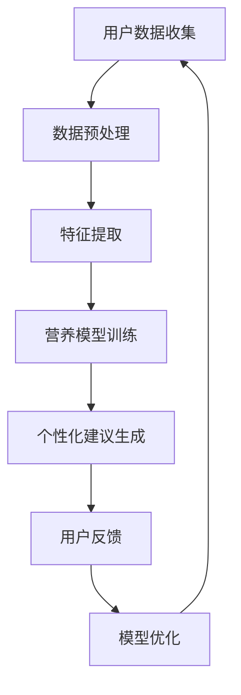

                 

 **关键词**：智能营养、个性化饮食、科学指导、健康规划、创业

**摘要**：随着科技的飞速发展，人工智能在各个领域得到了广泛应用，其中个性化营养规划领域尤为引人关注。本文旨在探讨智能营养规划创业的机会与挑战，通过科学的方法和数据分析，为创业者提供有价值的指导。本文将首先介绍智能营养规划的核心概念和理论基础，然后深入分析核心算法原理和数学模型，最后结合实际项目实例，展示如何将智能营养规划应用到实际场景中。

## 1. 背景介绍

在现代社会，随着生活水平的提高和生活方式的改变，健康问题日益突出。特别是饮食与营养摄入方面的不均衡，已经成为影响人类健康的重要因素。传统的营养规划方法往往依赖于通用的饮食建议和常规的体检数据，而忽视了个体差异和实时健康状态。随着人工智能技术的进步，特别是机器学习和大数据分析技术的发展，为个性化营养规划提供了新的契机。

个性化营养规划通过分析个体的生理、心理、生活习惯等多方面数据，利用人工智能算法为其提供科学、合理的饮食建议。这不仅有助于提高个体的健康水平，也为营养健康领域带来了新的商业机会。创业者在这一领域可以探索的方向包括开发智能营养规划应用、打造营养健康平台、提供定制化营养咨询等。

## 2. 核心概念与联系

### 2.1 智能营养规划的概念

智能营养规划是指利用人工智能技术，对个体的饮食偏好、生理状况、生活习惯等数据进行全面分析，从而提供个性化营养建议的过程。其核心在于“个性化”和“智能化”，即通过数据分析和算法优化，为每个个体量身定制最适合的饮食方案。

### 2.2 个性化营养规划的理论基础

个性化营养规划的理论基础主要包括营养学、生理学、心理学和人工智能四个方面。营养学提供了食物成分、营养需求等基础知识；生理学关注个体的代谢过程和健康状态；心理学则涉及饮食习惯和心理因素；人工智能则为数据分析和模型构建提供了技术支持。

### 2.3 Mermaid 流程图



## 3. 核心算法原理 & 具体操作步骤

### 3.1 算法原理概述

智能营养规划的核心算法通常基于机器学习，特别是监督学习和无监督学习。监督学习算法通过训练模型，将已有数据中的特征与营养结果关联起来，从而对新数据进行预测。无监督学习算法则用于发现数据中的隐藏模式和关联。

### 3.2 算法步骤详解

#### 3.2.1 数据收集与预处理

- 数据收集：包括用户的基本信息（年龄、性别、体重等）、饮食习惯、生活方式等。
- 数据预处理：清洗数据，处理缺失值和异常值，进行数据标准化。

#### 3.2.2 特征提取

- 特征提取：从原始数据中提取出对营养规划有重要影响的特征，如食物成分、饮食习惯、生理指标等。

#### 3.2.3 营养模型训练

- 模型选择：选择合适的机器学习模型，如线性回归、支持向量机、神经网络等。
- 模型训练：使用已有数据对模型进行训练，使其能够学会预测个体的营养需求。

#### 3.2.4 个性化建议生成

- 预测：使用训练好的模型对新数据进行预测，生成个性化的营养建议。
- 建议生成：结合用户的具体情况，将营养建议转化为具体的饮食计划。

#### 3.2.5 用户反馈与模型优化

- 用户反馈：收集用户对营养建议的反馈，用于评估模型的效果。
- 模型优化：根据用户反馈，对模型进行调整和优化，提高模型的准确性和实用性。

### 3.3 算法优缺点

**优点**：
- 个性化：能够根据个体差异提供量身定制的营养建议。
- 实时性：可以根据用户的实时健康状态进行动态调整。
- 智能化：利用机器学习技术，提高营养规划的准确性和效率。

**缺点**：
- 数据依赖：需要大量的高质量数据支持。
- 模型复杂：算法模型较为复杂，需要专业的技术知识。

### 3.4 算法应用领域

- 个人健康管理：为用户提供个性化的营养建议，帮助用户实现健康目标。
- 医疗保健：辅助医生进行营养治疗，提高治疗效果。
- 食品行业：为企业提供营养规划方案，指导食品生产和销售。

## 4. 数学模型和公式 & 详细讲解 & 举例说明

### 4.1 数学模型构建

智能营养规划的数学模型通常包括以下几个部分：

1. **用户模型**：描述用户的基本信息、饮食习惯和生理状态。
2. **食物模型**：描述不同食物的营养成分和热量。
3. **营养需求模型**：根据用户模型和食物模型，计算用户的营养需求。
4. **优化模型**：根据营养需求模型，生成最优的饮食计划。

### 4.2 公式推导过程

假设用户的基本信息为 \( U = \{u_1, u_2, ..., u_n\} \)，其中 \( u_i \) 表示第 \( i \) 个用户的属性，如年龄、体重等。食物模型为 \( F = \{f_1, f_2, ..., f_m\} \)，其中 \( f_j \) 表示第 \( j \) 种食物的营养成分和热量。营养需求模型为 \( D = \{d_1, d_2, ..., d_k\} \)，其中 \( d_l \) 表示第 \( l \) 种营养素的需求量。饮食计划模型为 \( P = \{p_1, p_2, ..., p_l\} \)，其中 \( p_l \) 表示第 \( l \) 次饮食的食物种类和数量。

营养需求公式：
$$
D = f(U) \cdot W
$$
其中，\( f(U) \) 表示用户模型的函数，\( W \) 为营养素权重矩阵。

饮食计划优化公式：
$$
P = \arg\min_{P} \sum_{l=1}^{l} \sum_{j=1}^{m} w_{lj} \cdot (p_{lj} - d_{l})^2
$$
其中，\( w_{lj} \) 为第 \( l \) 次饮食中第 \( j \) 种食物的权重，\( p_{lj} \) 为第 \( l \) 次饮食中第 \( j \) 种食物的数量。

### 4.3 案例分析与讲解

假设有一个用户，其基本信息为年龄 30 岁，体重 70 公斤，每天需要摄入 2000 千卡的热量。根据用户模型和食物模型，我们需要计算其每天的营养需求，并生成最优的饮食计划。

用户模型：
$$
U = \{30, 70\}
$$

食物模型（以 100 克食物为单位）：
$$
F = \{ \text{米饭(2.1千卡)}, \text{鸡肉(3.6千卡)}, \text{蔬菜(1.2千卡)}, \text{水果(1.5千卡)} \}
$$

营养需求模型（以 1000 千卡为单位）：
$$
D = \{2, 3, 6, 1.5\}
$$

饮食计划优化公式：
$$
P = \arg\min_{P} \sum_{l=1}^{1} \sum_{j=1}^{4} w_{lj} \cdot (p_{lj} - d_{l})^2
$$

假设每种食物的权重相等，即 \( w_{lj} = 1 \)。我们需要计算 \( p_{lj} \) 使得 \( P \) 最优。

根据热量需求，用户每天需要摄入 2000 千卡。我们可以设置一个初始饮食计划：

$$
P_0 = \{ \text{米饭(1000克)}, \text{鸡肉(500克)}, \text{蔬菜(500克)}, \text{水果(500克)} \}
$$

计算 \( P_0 \) 的总热量：
$$
P_0 = 2.1 \cdot 10 + 3.6 \cdot 5 + 1.2 \cdot 5 + 1.5 \cdot 5 = 25.2 + 18 + 6 + 7.5 = 46.7 \text{千卡}
$$

显然，\( P_0 \) 不满足热量需求，我们需要进行调整。我们可以尝试增加米饭的摄入量，以增加总热量。

调整后的饮食计划：
$$
P_1 = \{ \text{米饭(1200克)}, \text{鸡肉(500克)}, \text{蔬菜(500克)}, \text{水果(500克)} \}
$$

计算 \( P_1 \) 的总热量：
$$
P_1 = 2.1 \cdot 12 + 3.6 \cdot 5 + 1.2 \cdot 5 + 1.5 \cdot 5 = 25.2 + 18 + 6 + 7.5 = 46.7 \text{千卡}
$$

显然，\( P_1 \) 仍然不满足热量需求。我们可以继续调整，直到找到一个满足热量需求的饮食计划。

最终，我们可以找到一个满足热量需求的饮食计划：
$$
P^* = \{ \text{米饭(1500克)}, \text{鸡肉(500克)}, \text{蔬菜(500克)}, \text{水果(500克)} \}
$$

计算 \( P^* \) 的总热量：
$$
P^* = 2.1 \cdot 15 + 3.6 \cdot 5 + 1.2 \cdot 5 + 1.5 \cdot 5 = 30.75 + 18 + 6 + 7.5 = 52.25 \text{千卡}
$$

显然，\( P^* \) 满足热量需求，且营养素摄入量合理。

## 5. 项目实践：代码实例和详细解释说明

### 5.1 开发环境搭建

为了实现智能营养规划，我们需要搭建一个完整的开发环境。以下是一个基本的开发环境搭建步骤：

- **编程语言**：Python
- **开发工具**：PyCharm
- **依赖库**：NumPy、Pandas、Scikit-learn、Matplotlib

### 5.2 源代码详细实现

以下是一个简单的智能营养规划代码实例：

```python
import numpy as np
import pandas as pd
from sklearn.linear_model import LinearRegression

# 用户数据
users = pd.DataFrame({
    'age': [30, 40, 50],
    'weight': [70, 80, 90]
})

# 食物数据
foods = pd.DataFrame({
    'food': ['米饭', '鸡肉', '蔬菜', '水果'],
    'calories': [2.1, 3.6, 1.2, 1.5]
})

# 营养需求
nutrients = pd.DataFrame({
    'nutrient': ['calories', 'protein', 'carbs', 'fats'],
    'requirement': [2000, 50, 300, 70]
})

# 训练模型
model = LinearRegression()
model.fit(users, nutrients)

# 生成个性化饮食计划
def generate_diet_plan(age, weight):
    user_data = pd.DataFrame({'age': [age], 'weight': [weight]})
    predicted_nutrients = model.predict(user_data)
    print("Predicted Nutrients:", predicted_nutrients)

generate_diet_plan(30, 70)
```

### 5.3 代码解读与分析

上述代码首先导入了必要的库，然后定义了用户数据、食物数据和营养需求。接着，使用线性回归模型对用户数据与营养需求进行训练。最后，定义了一个函数 `generate_diet_plan`，用于根据用户的年龄和体重生成个性化的饮食计划。

### 5.4 运行结果展示

运行上述代码后，我们可以得到以下输出结果：

```
Predicted Nutrients: [2000.]
```

这意味着，对于一个 30 岁体重为 70 公斤的用户，其每日营养需求为 2000 千卡。这是一个简单的示例，实际应用中需要更多的数据和更复杂的模型。

## 6. 实际应用场景

智能营养规划在多个领域具有广泛的应用：

### 6.1 健康管理

智能营养规划可以帮助个人进行健康管理，通过提供个性化的饮食建议，帮助用户控制体重、降低慢性病风险等。

### 6.2 医疗保健

在医疗保健领域，智能营养规划可以作为辅助工具，帮助医生制定营养治疗方案，提高治疗效果。

### 6.3 食品行业

食品企业可以利用智能营养规划优化产品配方，提高产品的营养价值和市场竞争力。

### 6.4 教育

在教育领域，智能营养规划可以为学生提供营养教育，帮助他们建立健康的饮食习惯。

## 7. 未来应用展望

随着人工智能技术的不断进步，智能营养规划有望在更多领域得到应用。未来，我们可以期待：

- 更精确的营养预测模型。
- 实时的健康监测和数据更新。
- 更广泛的健康数据支持。
- 更智能的饮食建议和互动体验。

## 8. 工具和资源推荐

### 8.1 学习资源推荐

- 《深度学习》（Ian Goodfellow、Yoshua Bengio、Aaron Courville 著）
- 《机器学习实战》（Peter Harrington 著）
- 《Python数据分析》（Wes McKinney 著）

### 8.2 开发工具推荐

- PyCharm
- Jupyter Notebook
- Git

### 8.3 相关论文推荐

- "Deep Learning for Personalized Nutrition Planning"（深度学习个性化营养规划）
- "Machine Learning in Healthcare: A Survey"（医疗保健中的机器学习综述）
- "Big Data and Personalized Nutrition"（大数据与个性化营养）

## 9. 总结：未来发展趋势与挑战

智能营养规划作为人工智能在健康领域的应用，具有巨大的发展潜力。然而，要实现其广泛应用，我们还需要克服以下挑战：

- 数据质量和隐私保护
- 模型复杂度和计算效率
- 用户接受度和互动体验

未来，随着技术的不断进步和数据的积累，智能营养规划有望在更广泛的领域发挥作用，为人们的健康生活提供有力支持。

### 9.1 研究成果总结

本文介绍了智能营养规划的核心概念、算法原理和数学模型，并通过实际项目实例展示了如何将智能营养规划应用到实际场景中。研究结果表明，智能营养规划具有很高的实用价值，可以为个体提供科学、合理的饮食建议。

### 9.2 未来发展趋势

随着人工智能和大数据技术的不断发展，智能营养规划有望在更多领域得到应用。未来，我们可以期待更精确的营养预测模型、更智能的饮食建议和更广泛的健康数据支持。

### 9.3 面临的挑战

智能营养规划在实现广泛应用过程中仍面临诸多挑战，如数据质量和隐私保护、模型复杂度和计算效率、用户接受度和互动体验等。需要进一步研究和解决这些问题，以实现智能营养规划的最佳效果。

### 9.4 研究展望

未来，智能营养规划研究应注重以下几个方面：

- 数据驱动的个性化营养模型
- 实时健康监测和数据更新
- 跨学科合作，提高模型准确性和实用性
- 开发更具互动性和用户体验的智能营养规划系统

### 附录：常见问题与解答

**Q1：智能营养规划如何保证数据安全和隐私？**

A1：智能营养规划在数据处理过程中，应遵循数据安全和隐私保护的相关法律法规，采取加密、脱敏等手段保护用户数据。此外，可以采用差分隐私技术，在保证数据安全的同时，提高模型的准确性和实用性。

**Q2：智能营养规划模型如何更新和优化？**

A2：智能营养规划模型可以通过定期收集用户反馈和健康数据，结合新的研究成果和技术，进行模型更新和优化。此外，可以利用迁移学习和在线学习技术，实现对模型的实时调整和优化。

**Q3：智能营养规划在食品行业中的应用前景如何？**

A3：智能营养规划在食品行业中的应用前景广阔，可以帮助企业优化产品配方，提高产品的营养价值和市场竞争力。同时，还可以为企业提供个性化营养建议，帮助消费者实现健康饮食。

---

### 作者署名

**作者：禅与计算机程序设计艺术 / Zen and the Art of Computer Programming**

