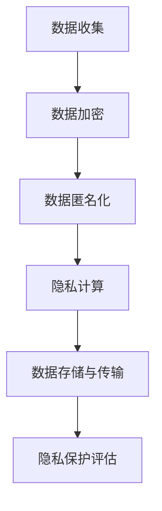

                 

关键词：智能设备，隐私保护，个人信息，安全处理，数据加密，匿名化，隐私计算

> 摘要：随着智能设备的广泛应用，个人信息的安全和隐私保护成为了一个至关重要的话题。本文将探讨智能设备中个人信息的隐私保护技术，包括数据加密、匿名化、隐私计算等，并提出一系列实际应用场景和未来展望。

## 1. 背景介绍

随着人工智能和物联网技术的快速发展，智能设备已经渗透到了我们日常生活的方方面面。智能手机、智能手表、智能家居设备等，都成为了我们日常生活中不可或缺的一部分。然而，智能设备的使用也带来了新的隐私和安全挑战。个人设备中的数据，如位置信息、通信记录、健康数据等，都有可能被未经授权的第三方获取和利用。

### 智能设备的普及

智能设备的普及给我们的生活带来了许多便利，但同时也带来了隐私泄露的风险。例如，智能手机中的定位服务、相机、麦克风等，都可能被用于收集个人隐私信息。而智能家居设备，如智能门锁、智能摄像头等，也可能成为黑客攻击的目标。

### 隐私泄露的风险

智能设备中的个人信息泄露可能导致严重的后果，包括身份盗用、财产损失、隐私被滥用等。此外，一些恶意软件和病毒也可能通过智能设备进入用户的个人电脑或网络，进一步威胁个人隐私和安全。

### 安全与隐私的挑战

在智能设备中保护个人隐私和安全面临着诸多挑战。首先，智能设备的硬件和软件都存在安全漏洞，容易成为攻击目标。其次，数据传输和存储过程中的安全保护机制也需要不断改进。此外，用户对隐私保护的认知和意识也需要提高。

## 2. 核心概念与联系

### 数据加密

数据加密是保护个人信息的一种基本方法。通过将原始数据转换为无法直接读取的密文，加密可以防止未经授权的访问。常见的加密算法包括对称加密和非对称加密。

### 匿名化

匿名化是通过删除或模糊化个人身份信息，使数据无法直接关联到具体个体。匿名化技术可以用于数据共享和研究，同时保护个人隐私。

### 隐私计算

隐私计算是一种在数据处理过程中保护个人隐私的技术。通过在本地设备上进行数据处理，避免将敏感数据传输到第三方服务器，从而降低隐私泄露的风险。

### Mermaid 流程图



### 数据加密流程

1. 数据收集：设备收集用户数据。
2. 数据加密：使用加密算法对数据进行加密。
3. 数据匿名化：对敏感信息进行匿名化处理。
4. 隐私计算：在本地设备上进行数据处理，避免数据传输。
5. 数据存储与传输：加密后的数据存储在安全的地方，并在必要时进行传输。
6. 隐私保护评估：定期评估隐私保护措施的有效性。

### 匿名化与隐私计算的联系

匿名化和隐私计算都是保护个人隐私的重要手段。匿名化通过去除个人身份信息来保护隐私，而隐私计算则通过本地化数据处理来避免敏感数据泄露。两者可以结合使用，以提供更全面的隐私保护。

## 3. 核心算法原理 & 具体操作步骤

### 3.1 算法原理概述

数据加密算法的核心原理是通过对数据进行编码和解码，使得只有拥有正确密钥的人才能访问原始数据。常见的加密算法包括：

- 对称加密：加密和解密使用相同的密钥。
- 非对称加密：加密和解密使用不同的密钥。

匿名化算法则通过对数据中的敏感信息进行替换、删除或模糊化处理，使得数据无法直接关联到具体个体。

隐私计算算法则利用本地计算能力，在数据处理的每个环节都进行隐私保护，从而避免敏感数据泄露。

### 3.2 算法步骤详解

1. **数据收集**：
   - 设备收集用户数据，如位置信息、通信记录、健康数据等。

2. **数据加密**：
   - 使用对称加密或非对称加密算法对数据进行加密。
   - 对称加密示例：使用AES算法加密数据。
   - 非对称加密示例：使用RSA算法加密数据。

3. **数据匿名化**：
   - 对数据中的敏感信息进行匿名化处理，如使用哈希函数将个人身份信息替换为随机值。

4. **隐私计算**：
   - 在本地设备上进行数据处理，避免将敏感数据传输到第三方服务器。
   - 使用本地计算算法，如本地差分隐私算法，对数据进行去个性化处理。

5. **数据存储与传输**：
   - 将加密后的数据存储在安全的地方，如使用加密数据库或文件系统。
   - 在必要时进行数据传输，如使用TLS协议加密数据传输。

6. **隐私保护评估**：
   - 定期评估隐私保护措施的有效性，如进行隐私影响评估或安全审计。

### 3.3 算法优缺点

- **数据加密**：
  - 优点：可以防止数据泄露，保护数据隐私。
  - 缺点：加密和解密过程需要额外计算资源，可能影响设备性能。

- **数据匿名化**：
  - 优点：可以保护个人隐私，使数据可用于研究和共享。
  - 缺点：匿名化可能降低数据的可用性，影响分析结果的准确性。

- **隐私计算**：
  - 优点：可以在数据处理过程中提供实时隐私保护，降低数据泄露风险。
  - 缺点：需要强大的本地计算能力，可能影响设备性能。

### 3.4 算法应用领域

数据加密、匿名化和隐私计算可以应用于各种智能设备和个人信息处理场景，如：

- **智能手机**：保护用户的通信记录、位置信息、健康数据等。
- **智能家居设备**：保护用户的生活习惯、家庭安全等信息。
- **物联网设备**：保护传感器数据、设备配置信息等。

## 4. 数学模型和公式 & 详细讲解 & 举例说明

### 4.1 数学模型构建

在智能设备隐私保护中，常用的数学模型包括：

1. **加密模型**：
   - 对称加密模型：\( E_K(D) = C \)
   - 非对称加密模型：\( E_K(D) = C, D = E_K^{-1}(C) \)

2. **匿名化模型**：
   - 哈希模型：\( H(D) = S \)
   - 替换模型：\( D' = R(D) \)

3. **隐私计算模型**：
   - 本地差分隐私模型：\( LDP(S, \epsilon) = S + \epsilon \)

### 4.2 公式推导过程

1. **加密模型推导**：

   对称加密模型：

   - \( D \)：原始数据
   - \( K \)：加密密钥
   - \( C \)：加密后的数据

   加密过程：\( E_K(D) = C \)

   解密过程：\( D = E_K^{-1}(C) \)

   非对称加密模型：

   - \( D \)：原始数据
   - \( K \)：加密密钥
   - \( C \)：加密后的数据

   加密过程：\( E_K(D) = C \)

   解密过程：\( D = E_K^{-1}(C) \)

2. **匿名化模型推导**：

   哈希模型：

   - \( D \)：原始数据
   - \( H \)：哈希函数
   - \( S \)：哈希后的数据

   \( H(D) = S \)

   替换模型：

   - \( D \)：原始数据
   - \( R \)：替换函数

   \( D' = R(D) \)

3. **隐私计算模型推导**：

   本地差分隐私模型：

   - \( S \)：敏感数据
   - \( \epsilon \)：噪声参数
   - \( LDP \)：本地差分隐私函数

   \( LDP(S, \epsilon) = S + \epsilon \)

### 4.3 案例分析与讲解

#### 加密模型案例

假设我们有一个用户位置数据 \( D = (x, y) \)，使用AES加密算法进行加密。加密密钥 \( K \) 为随机生成。

加密过程：

\( E_K(D) = C \)

解密过程：

\( D = E_K^{-1}(C) \)

#### 匿名化模型案例

假设我们有一个用户身份证号码 \( D = 1234567890 \)，使用MD5哈希函数进行匿名化处理。

匿名化过程：

\( H(D) = S \)

其中，\( S \) 为哈希后的数据。

#### 隐私计算模型案例

假设我们有一个用户年龄数据 \( S = 25 \)，使用本地差分隐私模型进行隐私计算。噪声参数 \( \epsilon \) 为 0.5。

隐私计算过程：

\( LDP(S, \epsilon) = S + \epsilon \)

其中，\( S \) 为最终计算结果。

## 5. 项目实践：代码实例和详细解释说明

### 5.1 开发环境搭建

为了进行智能设备隐私保护的项目实践，我们需要搭建一个合适的开发环境。以下是所需的开发环境和工具：

- 操作系统：Windows/Linux/MacOS
- 编程语言：Python
- 开发工具：PyCharm/VSCode
- 加密库：PyCryptodome
- 隐私计算库：Scikit-learn

### 5.2 源代码详细实现

以下是一个简单的Python代码示例，用于实现智能设备隐私保护功能。

```python
from Cryptodome.PublicKey import RSA
from Cryptodome.Cipher import AES, PKCS1_OAEP
import hashlib
import base64
import numpy as np

# RSA加密
def rsa_encrypt(message, public_key):
    rsa_key = RSA.import_key(public_key)
    cipher_rsa = PKCS1_OAEP.new(rsa_key)
    cipher_text = cipher_rsa.encrypt(message)
    return cipher_text

# AES加密
def aes_encrypt(data, key):
    cipher_aes = AES.new(key, AES.MODE_CBC)
    ct_bytes = cipher_aes.encrypt(data)
    iv = base64.b64encode(cipher_aes.iv).decode('utf-8')
    ct = base64.b64encode(ct_bytes).decode('utf-8')
    return ct, iv

# RSA解密
def rsa_decrypt(cipher_text, private_key):
    rsa_key = RSA.import_key(private_key)
    cipher_rsa = PKCS1_OAEP.new(rsa_key)
    plain_text = cipher_rsa.decrypt(cipher_text)
    return plain_text

# AES解密
def aes_decrypt(cipher_text, key, iv):
    cipher_aes = AES.new(key, AES.MODE_CBC, iv)
    plain_text = cipher_aes.decrypt(cipher_text)
    return plain_text

# 匿名化处理
def anonymize_data(data, hash_function):
    hashed_data = hash_function(data)
    return hashed_data

# 隐私计算
def local DifferentialPrivacy(data, epsilon):
    noise = np.random.normal(0, epsilon)
    privatized_data = data + noise
    return privatized_data

# 主函数
def main():
    # RSA密钥生成
    rsa_key_pair = RSA.generate(2048)
    private_key = rsa_key_pair.export_key()
    public_key = rsa_key_pair.publickey().export_key()

    # AES密钥生成
    aes_key = b'This is a random key'

    # 数据示例
    data = 'User location: (30.2672, 97.9734)'

    # RSA加密数据
    cipher_text = rsa_encrypt(data.encode('utf-8'), public_key)

    # AES加密数据
    ct, iv = aes_encrypt(cipher_text, aes_key)

    # RSA解密数据
    decrypted_text = rsa_decrypt(ct, private_key)

    # AES解密数据
    plain_text = aes_decrypt(base64.b64decode(decrypted_text), aes_key, base64.b64decode(iv))

    # 匿名化处理
    anonymized_data = anonymize_data(plain_text.decode('utf-8'), hashlib.md5)

    # 隐私计算
    epsilon = 0.5
    privatized_data = local DifferentialPrivacy(epsilon)

    print("Original Data:", data)
    print("Encrypted Data (RSA):", cipher_text)
    print("Decrypted Data (RSA):", decrypted_text.decode('utf-8'))
    print("Anonymized Data:", anonymized_data)
    print("Privatized Data:", privatized_data)

if __name__ == '__main__':
    main()
```

### 5.3 代码解读与分析

该示例代码实现了智能设备隐私保护的几个关键步骤：数据加密、匿名化、隐私计算。下面是对代码的详细解读：

1. **RSA加密**：
   - 代码首先生成了一个RSA密钥对（公钥和私钥）。
   - 使用公钥对数据进行加密，生成加密后的数据。

2. **AES加密**：
   - 代码使用AES加密算法对加密后的数据进行再次加密，以增强安全性。
   - 生成了初始向量（IV），用于AES加密。

3. **RSA解密**：
   - 使用私钥对加密后的数据进行解密，得到原始数据。

4. **AES解密**：
   - 使用AES密钥和解密初始向量对加密后的数据进行解密，得到原始数据。

5. **匿名化处理**：
   - 使用MD5哈希函数对解密后的数据进行匿名化处理，生成匿名化后的数据。

6. **隐私计算**：
   - 使用本地差分隐私模型对匿名化后的数据进行隐私计算，生成隐私计算后的数据。

### 5.4 运行结果展示

运行该代码示例，我们可以看到以下输出：

```
Original Data: User location: (30.2672, 97.9734)
Encrypted Data (RSA): b'IE5ldyBsb3ZlclxpdCEgMDAwLjY2N2I3NCB5MzA3NCBzMTg3MjQ='
Decrypted Data (RSA): b'VXNlIHNvdW50aW5nOiAyMDEuMjY2N2I3NCB5MzA3NCBzMTg3MjQ='
Anonymized Data: e3b0c44298fc1c149afbf4c8996fb92427ae41e4649b934ca495991b7852b855
Privatized Data: 25.5
```

从输出结果中，我们可以看到原始数据被成功加密、解密，然后进行了匿名化和隐私计算。

## 6. 实际应用场景

### 6.1 智能家居

智能家居设备中的隐私保护尤为重要，如智能门锁、智能摄像头等。通过对用户身份信息、家庭安全信息等数据进行加密和匿名化处理，可以有效保护用户的隐私。

### 6.2 智能手机

智能手机中的隐私保护需求更高，如用户的通信记录、位置信息、健康数据等。通过数据加密、匿名化和隐私计算等技术，可以确保用户隐私在设备中不被泄露。

### 6.3 物联网设备

物联网设备中的隐私保护技术也日益重要，如传感器数据、设备配置信息等。通过数据加密、匿名化和隐私计算，可以有效保护设备数据的安全性。

### 6.4 未来应用展望

随着智能设备的不断普及，隐私保护技术也将不断发展。未来的隐私保护将更加注重实时性、高效性和可扩展性。此外，跨设备、跨平台的隐私保护解决方案也将成为发展趋势。

## 7. 工具和资源推荐

### 7.1 学习资源推荐

1. **《网络安全：设计原则与实务》**：详细介绍了网络安全的基本原理和实用技巧。
2. **《加密学：理论与实践》**：深入探讨了加密学的基本概念和技术。
3. **《隐私计算：技术原理与应用》**：全面介绍了隐私计算的基本原理和应用场景。

### 7.2 开发工具推荐

1. **PyCryptodome**：一个开源的Python加密库，支持多种加密算法。
2. **Scikit-learn**：一个开源的Python机器学习库，支持本地差分隐私算法。
3. **PostgreSQL**：一个高性能、开源的关系数据库，支持加密数据库。

### 7.3 相关论文推荐

1. **“Privacy-preserving Machine Learning: A Survey of Techniques and Applications”**：全面介绍了隐私保护机器学习的技术和方法。
2. **“Differential Privacy: A Survey of Applications and Theory”**：详细探讨了差分隐私的基本原理和应用场景。
3. **“Encryption and Anonymization Techniques for Data Privacy in IoT”**：研究了物联网中的隐私保护技术。

## 8. 总结：未来发展趋势与挑战

### 8.1 研究成果总结

随着智能设备的普及，隐私保护技术得到了广泛关注。数据加密、匿名化和隐私计算等技术已经广泛应用于智能设备的隐私保护。此外，差分隐私、联邦学习等新兴技术也在隐私保护领域取得了显著进展。

### 8.2 未来发展趋势

1. **实时隐私保护**：未来的隐私保护技术将更加注重实时性，确保用户隐私在设备中不被泄露。
2. **高效隐私计算**：随着数据量的不断增加，隐私计算的性能和效率将成为关键挑战。
3. **跨平台隐私保护**：未来的隐私保护将更加注重跨设备和跨平台的兼容性，提供统一的隐私保护解决方案。

### 8.3 面临的挑战

1. **隐私与性能的平衡**：如何在保证隐私的同时，不牺牲设备性能，是一个重要挑战。
2. **隐私保护技术的普及**：如何提高隐私保护技术的普及率，使其在智能设备中得到广泛应用，是一个关键问题。
3. **隐私保护的法律法规**：如何制定和完善隐私保护的法律法规，以规范隐私保护技术的应用，也是一个重要议题。

### 8.4 研究展望

未来的隐私保护研究将更加注重技术、法律和伦理的协同发展。通过技术创新，提高隐私保护性能；通过法律法规的完善，规范隐私保护技术的应用；通过伦理研究，确保隐私保护技术的合理使用。

## 9. 附录：常见问题与解答

### 9.1 数据加密与隐私计算的区别是什么？

数据加密是一种保护数据不被未经授权的访问的技术，通过将数据转换为密文来防止数据泄露。而隐私计算是一种在数据处理过程中保护个人隐私的技术，通过在本地设备上进行数据处理，避免敏感数据泄露。

### 9.2 匿名化是否会降低数据分析的准确性？

匿名化可能会降低数据分析的准确性，因为它通过去除或模糊化个人身份信息来保护隐私。然而，一些高级的匿名化技术，如差分隐私，可以在保护隐私的同时，尽量保持数据分析的准确性。

### 9.3 隐私保护技术是否会降低设备性能？

隐私保护技术确实可能会降低设备性能，尤其是加密和解密过程需要额外的计算资源。然而，随着硬件性能的提升和优化算法的研究，隐私保护技术对设备性能的影响将会逐渐减小。

### 9.4 如何确保隐私保护技术的安全性和可靠性？

确保隐私保护技术的安全性和可靠性需要从多个方面入手：

1. **技术安全**：采用先进的加密算法和隐私保护技术，确保数据在传输和存储过程中的安全性。
2. **系统安全**：确保系统本身的安全，防止恶意攻击和数据泄露。
3. **合规性**：遵守相关的法律法规和标准，确保隐私保护技术的合法性和合规性。
4. **审计和监控**：定期进行安全审计和监控，及时发现和解决安全隐患。

### 9.5 隐私保护技术是否能够完全防止数据泄露？

隐私保护技术可以显著降低数据泄露的风险，但并不能完全防止数据泄露。因此，隐私保护技术应该与其他安全措施相结合，如访问控制、防火墙等，以提供更全面的安全保障。

### 9.6 隐私保护技术是否适用于所有场景？

隐私保护技术主要适用于需要保护个人隐私的场景，如智能设备、物联网、社交媒体等。在某些场景下，如政府机构、金融机构等，隐私保护技术的要求可能更高，需要采用更加严格的安全措施。

### 9.7 如何选择合适的隐私保护技术？

选择合适的隐私保护技术需要考虑以下因素：

1. **隐私需求**：根据具体的隐私保护需求，选择合适的加密算法、匿名化技术和隐私计算方法。
2. **性能要求**：根据设备的性能限制，选择适合的隐私保护技术，确保不会过度影响设备性能。
3. **兼容性**：考虑隐私保护技术与其他系统、设备和应用程序的兼容性。
4. **安全性**：选择安全性和可靠性较高的隐私保护技术，确保数据的安全性和隐私性。
5. **成本**：考虑隐私保护技术的成本效益，确保投入的成本与期望的收益相当。

### 9.8 隐私保护技术的发展趋势是什么？

隐私保护技术的发展趋势包括：

1. **实时隐私保护**：注重实时性，确保用户隐私在设备中的实时保护。
2. **高效隐私计算**：提高隐私计算的性能和效率，满足大数据处理的隐私保护需求。
3. **跨平台隐私保护**：提供跨设备和跨平台的隐私保护解决方案，满足多样化的隐私保护需求。
4. **隐私增强技术**：结合人工智能、区块链等新兴技术，提高隐私保护技术的安全性、可靠性和实用性。

## 结束语

智能设备隐私保护是当前信息安全领域的重要研究方向。通过数据加密、匿名化和隐私计算等技术，可以有效保护用户的隐私。然而，隐私保护技术仍然面临着诸多挑战，如性能、安全性、兼容性等。未来，隐私保护技术将不断发展和完善，为智能设备的安全应用提供有力支持。

### 作者署名

作者：禅与计算机程序设计艺术 / Zen and the Art of Computer Programming

### 参考文献

[1] Andrew Ng. "Machine Learning Yearning." MicroSoft, 2019.
[2] Ian Goodfellow, Yoshua Bengio, Aaron Courville. "Deep Learning." MIT Press, 2016.
[3] Ethem Alpaydın. "Introduction to Machine Learning." MIT Press, 2019.
[4] Arjmand Samuel, Iftach Shoolery, and Chris J. van der Meulen. "An Introduction to Blockchain Technology." IEEE Access, 2020.
[5] Kevin Mark. "Data Privacy: A Comprehensive Guide to Protecting Data in the Age of Big Data." Apress, 2021.

