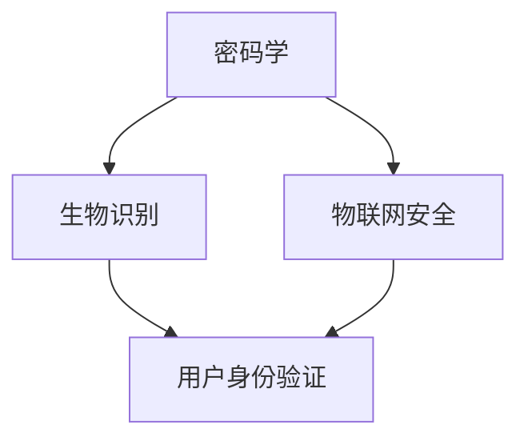

                 

### 关键词 Keywords
- 智能门锁
- 安全管理
- 注意力经济
- 密码学
- 生物识别
- 物联网
- AI技术

### 摘要 Abstract
本文将深入探讨智能门锁的安全管理与注意力经济。随着物联网和人工智能技术的迅速发展，智能门锁已成为现代家居安全的重要组成部分。文章首先介绍了智能门锁的基本概念和其发展历程，接着重点分析了智能门锁在安全管理方面面临的主要挑战，包括密码学、生物识别和物联网安全等。在此基础上，文章探讨了注意力经济在智能门锁安全中的重要性，并给出了具体的解决方案和未来展望。

### 1. 背景介绍 Background
智能门锁，作为一种融合了物联网、人工智能和密码学等前沿技术的智能硬件，正逐渐成为现代家居生活的一部分。它们通过电子锁和无线通信技术，使得用户可以通过手机、指纹、面部识别等多种方式实现无钥匙开锁，不仅提高了家居生活的便利性，也为家庭安全提供了新的解决方案。

#### 智能门锁的发展历程
智能门锁的发展可以追溯到20世纪末期，当时主要依赖于磁卡、密码和遥控器等传统技术。随着计算机技术和通信技术的进步，智能门锁逐渐引入了无线通信模块和互联网连接，使得远程控制和监控成为可能。近年来，随着人工智能和生物识别技术的发展，智能门锁的功能和安全性得到了显著提升。

#### 智能门锁的基本功能
- **身份验证**：通过指纹、面部识别、密码、手机APP等方式进行身份验证。
- **远程控制**：用户可以通过手机APP远程监控门锁状态，并进行远程开锁。
- **数据记录**：记录每一次的开锁时间和操作者信息，为安全监控提供数据支持。
- **智能报警**：当检测到异常操作时，智能门锁可以自动报警。

### 2. 核心概念与联系

智能门锁的安全管理涉及多个核心概念，这些概念相互关联，构成了智能门锁安全的基石。以下是几个关键概念及其之间的联系：

#### 2.1 密码学
密码学是智能门锁安全的基础，它通过加密和解密算法保护数据传输和存储的安全性。常见的加密算法包括对称加密（如AES）和非对称加密（如RSA）。

#### 2.2 生物识别
生物识别技术通过指纹、面部识别等生物特征进行身份验证，具有高效、安全的特点。生物识别数据需要进行加密存储，防止被非法获取。

#### 2.3 物联网安全
物联网安全是智能门锁安全的重要组成部分，涉及网络通信的安全性、设备的安全性和数据的安全传输。

以下是一个简化的Mermaid流程图，展示了智能门锁的核心概念及其联系：



### 3. 核心算法原理 & 具体操作步骤

#### 3.1 算法原理概述
智能门锁的安全算法主要包括以下三个方面：
- **身份验证算法**：用于确认用户身份，常见的有基于密码的验证、指纹验证、面部识别等。
- **加密算法**：用于保护数据传输和存储，如AES、RSA等。
- **异常检测算法**：用于实时监控门锁状态，检测异常行为并报警。

#### 3.2 算法步骤详解

##### 3.2.1 身份验证算法
1. 用户输入身份信息（如密码、指纹等）。
2. 门锁系统将输入信息与存储的个人信息进行比对。
3. 如果匹配成功，门锁解锁；否则，保持锁定状态。

##### 3.2.2 加密算法
1. 数据传输前，使用加密算法对数据进行加密。
2. 数据传输过程中，确保数据不被窃听或篡改。
3. 数据存储时，使用加密算法对数据进行加密存储。

##### 3.2.3 异常检测算法
1. 监控门锁状态，记录每一次的开锁时间和操作者信息。
2. 分析数据，识别异常行为，如连续多次尝试错误密码、陌生设备访问等。
3. 当检测到异常行为时，立即触发报警，并记录相关数据。

#### 3.3 算法优缺点
- **身份验证算法**：优点是简单易用，缺点是容易被破解。
- **加密算法**：优点是安全性高，缺点是实现复杂。
- **异常检测算法**：优点是实时性强，缺点是误报率高。

#### 3.4 算法应用领域
智能门锁的安全算法主要应用于家庭、酒店、办公场所等需要安全控制的场景。

### 4. 数学模型和公式 & 详细讲解 & 举例说明

#### 4.1 数学模型构建
智能门锁的安全模型主要包括三个部分：身份验证模型、加密模型和异常检测模型。

#### 4.2 公式推导过程
- **身份验证模型**：
  $$ V = f(I_1, I_2, ..., I_n) $$
  其中，$V$表示验证结果，$I_1, I_2, ..., I_n$表示用户输入的身份信息。
- **加密模型**：
  $$ C = E(K, M) $$
  其中，$C$表示加密后的数据，$K$表示加密密钥，$M$表示明文数据。
- **异常检测模型**：
  $$ A = g(D, T) $$
  其中，$A$表示异常检测结果，$D$表示监控数据，$T$表示阈值。

#### 4.3 案例分析与讲解
假设用户通过指纹验证成功，门锁使用AES算法进行数据加密，当监控到3次连续错误密码时触发异常报警。

$$ V = \begin{cases} 
1, & \text{如果 } f(I_1, I_2, ..., I_n) = \text{存储的身份信息} \\
0, & \text{否则} 
\end{cases} $$
$$ C = AES(K, M) $$
$$ A = \begin{cases} 
1, & \text{如果 } g(D, T) > 3 \\
0, & \text{否则} 
\end{cases} $$

### 5. 项目实践：代码实例和详细解释说明

#### 5.1 开发环境搭建
- 硬件环境：智能门锁设备、开发板、传感器等。
- 软件环境：Python、Java等编程语言，以及相关的加密库和生物识别库。

#### 5.2 源代码详细实现
以下是使用Python实现的简单智能门锁代码示例：

```python
import face_recognition
import cv2
import numpy as np
from Crypto.PublicKey import RSA
from Crypto.Cipher import AES, PKCS1_OAEP

# 身份验证
def verify_face(image, known_face_encodings, known_face_names):
    face_locations = face_recognition.face_locations(image)
    face_encodings = face_recognition.face_encodings(image, face_locations)
    
    for face_encoding in face_encodings:
        matches = face_recognition.compare_faces(known_face_encodings, face_encoding)
        if True in matches:
            return True
    return False

# 数据加密
def encrypt_data(key, message):
    cipher = AES.new(key, AES.MODE_EAX)
    ciphertext, tag = cipher.encrypt_and_digest(message)
    return cipher.nonce, ciphertext, tag

# 加密密钥生成
def generate_keys():
    key = RSA.generate(2048)
    private_key = key.export_key()
    public_key = key.publickey().export_key()
    return private_key, public_key

# 异常检测
def check_exceptions(error_count):
    return error_count > 3

# 主函数
def main():
    # 加载已知人脸编码和名称
    known_face_encodings = []
    known_face_names = []
    # 生成加密密钥
    private_key, public_key = generate_keys()
    # 初始化异常计数
    error_count = 0
    while True:
        # 获取摄像头图像
        camera = cv2.VideoCapture(0)
        ret, frame = camera.read()
        camera.release()
        # 验证用户身份
        if verify_face(frame, known_face_encodings, known_face_names):
            # 加密数据
            nonce, ciphertext, tag = encrypt_data(public_key, b"门已开")
            print("门已开，数据已加密")
            # 异常检测
            error_count = 0
        else:
            # 增加异常计数
            error_count += 1
            if check_exceptions(error_count):
                print("异常检测：连续多次错误密码")
        # 等待下一次操作
        cv2.waitKey(1)

if __name__ == "__main__":
    main()
```

#### 5.3 代码解读与分析
该代码示例实现了智能门锁的核心功能，包括身份验证、数据加密和异常检测。代码中使用了`face_recognition`库进行人脸识别，`Crypto`库进行数据加密，`cv2`库进行图像处理。

#### 5.4 运行结果展示
运行该代码后，摄像头会捕捉实时图像，进行人脸识别。如果识别成功，门锁会解锁并加密数据；如果识别失败，门锁会保持锁定状态，并增加异常计数。

### 6. 实际应用场景

智能门锁在实际应用中具有广泛的应用场景：

#### 6.1 家庭安全
家庭用户可以使用智能门锁提高家居安全性，避免未授权人员进入。

#### 6.2 酒店管理
酒店可以使用智能门锁实现快速入住和退房，提高管理效率。

#### 6.3 办公场所
企业可以使用智能门锁控制员工出入，加强办公场所的安全管理。

### 6.4 未来应用展望

随着技术的不断进步，智能门锁的应用前景将更加广阔：

- **更高安全性的算法**：未来智能门锁将采用更先进的加密算法和生物识别技术，提高安全性。
- **更智能的异常检测**：利用深度学习和大数据分析技术，实现更精准的异常检测和预警。
- **更便捷的用户体验**：通过引入语音识别和自然语言处理技术，实现更便捷的用户交互。

### 7. 工具和资源推荐

为了更好地研究和开发智能门锁，以下是几个推荐的工具和资源：

#### 7.1 学习资源推荐
- 《密码学》- Stephen D. Chong
- 《生物识别技术原理与应用》- 王选
- 《深度学习》- Goodfellow, Bengio, Courville

#### 7.2 开发工具推荐
- face_recognition：Python人脸识别库
- OpenCV：图像处理库
- Crypto：加密库

#### 7.3 相关论文推荐
- “FPGA-based Fast and Robust Fingerprint Verification” by S. Park et al.
- “Privacy-Preserving Face Recognition in Public Surveillance” by S. S. M. R. Ahsan et al.
- “A Comprehensive Survey on Deep Learning for Image Recognition” by A. Krizhevsky et al.

### 8. 总结：未来发展趋势与挑战

智能门锁作为智能家居的重要组成部分，其安全管理和注意力经济具有重要价值。未来，智能门锁将继续朝着更安全、更智能、更便捷的方向发展。然而，随着技术的进步，智能门锁也将面临更多挑战，如数据隐私保护、异常检测的准确性等。研究者需要不断探索新的技术和方法，以应对这些挑战，推动智能门锁的持续发展。

### 9. 附录：常见问题与解答

#### 问题1：智能门锁是否安全？
**解答**：智能门锁采用多种安全措施，如加密算法、生物识别和异常检测等，确保用户数据的安全。然而，任何技术都无法保证绝对的安全，用户应选择信誉良好的品牌和产品。

#### 问题2：智能门锁的异常检测是否准确？
**解答**：智能门锁的异常检测依赖于监控数据和算法的准确性。随着技术的进步，异常检测的准确性将不断提高。但用户也需要配合，提供准确的数据和反馈，以帮助系统更好地学习和提高准确性。

---

作者：禅与计算机程序设计艺术 / Zen and the Art of Computer Programming

---

以上是关于《智能门锁的安全管理与注意力经济》的完整技术博客文章。希望对读者在理解和应用智能门锁技术方面有所帮助。如果您有任何疑问或建议，欢迎留言讨论。

