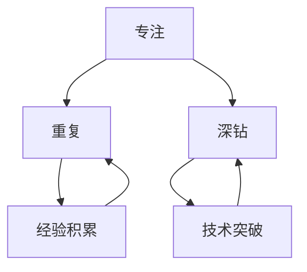

                 

### 1. 背景介绍

在信息技术迅猛发展的时代，无论是软件开发、数据科学还是人工智能领域，成功的道路似乎都充满了挑战和复杂性。然而，从历史上看，许多成功的案例都显示出了一条共同的特点：专注于一件事情，通过不断的重复和深入钻研，最终达到了卓越的成就。

这种专注不仅仅是一种态度，更是一种方法论。它强调在特定领域内持续投入时间和精力，通过不断地实践、反思和改进，逐渐建立起深厚的知识体系和技术积累。这种方法论在技术领域的应用，已经证明是行之有效的，尤其在那些需要高度专业化知识的领域。

本文将探讨“保持对一件事情的专注，不停地重复，不停地深钻”这一方法在IT领域的应用和重要性。我们将从核心概念、算法原理、数学模型、实际应用、工具资源等多个角度，深入分析这种方法如何帮助开发者和技术人员取得成功。

<|assistant|>### 2. 核心概念与联系

在深入讨论“保持对一件事情的专注，不停地重复，不停地深钻”这一方法之前，我们首先需要理解一些核心概念。这些概念不仅构成了该方法论的基础，还揭示了其内在的联系和作用机制。

#### 2.1 专注

专注是一种集中注意力的能力，它要求我们在一段时间内，将注意力完全集中在一个特定的问题或任务上。在信息技术领域，专注可以帮助开发者更深入地理解技术细节，从而在解决问题时更加高效。

#### 2.2 重复

重复是学习和实践的重要手段。通过重复，我们可以巩固知识，提高技能，并从中发现新的问题和解决方案。在技术领域，重复不仅仅是一种练习，更是一种迭代改进的过程。

#### 2.3 深钻

深钻是指对某个问题或技术进行深入的探究和研究。它要求我们在已有的知识基础上，不断挖掘更深层次的问题，寻找更加高效的解决方案。深钻不仅能够提高我们的技术水平，还能够推动整个领域的发展。

#### 2.4 内在联系

这三个核心概念之间存在着紧密的联系。专注提供了方向，重复提供了手段，深钻提供了动力。只有通过专注，我们才能找到需要重复和实践的问题；只有通过重复，我们才能不断积累经验，发现新的问题；只有通过深钻，我们才能在技术上实现突破和创新。

为了更好地理解这些概念之间的联系，我们可以使用Mermaid流程图来展示它们之间的关系：



通过这个流程图，我们可以清晰地看到专注、重复和深钻之间如何相互作用，共同推动我们的技术和知识水平不断提高。

#### 2.5 实例分析

以一位软件工程师为例，如果他能够专注于某个特定的编程语言，通过不断的重复编写代码和解决问题，他就能够在这一领域内建立深厚的知识体系。在此基础上，他进一步深入钻研，寻找更高效的编程方法，最终不仅能够提高自己的编程能力，还可能为整个编程社区贡献有价值的经验和方法。

#### 2.6 重要性

在信息技术领域，专注、重复和深钻的重要性不言而喻。首先，它们可以帮助我们避免在众多新技术和趋势中迷失方向，专注于最适合自己的领域。其次，通过不断的实践和深入研究，我们能够快速提升自己的技术水平，保持在行业中的竞争力。最后，这种方法论不仅能够提高个人成就，还能够推动整个领域的发展，带来更多的创新和突破。

<|assistant|>### 3. 核心算法原理 & 具体操作步骤

在深入探讨如何通过保持专注、重复和深钻来提升技术能力之前，我们需要了解一些核心算法原理和具体操作步骤。这些算法和步骤不仅为我们提供了技术上的指导，还为我们展示了如何在实践中应用专注、重复和深钻的方法。

#### 3.1 算法原理概述

核心算法在信息技术领域扮演着至关重要的角色。无论是数据科学、机器学习，还是软件工程，算法都是解决问题的基本工具。以下是一些在各个领域中广泛应用的核心算法：

1. **排序算法**：如快速排序、归并排序、堆排序等。这些算法通过对数据进行排序，帮助我们在各种应用场景下快速检索和处理数据。

2. **查找算法**：如二分查找、哈希查找等。这些算法在数据存储和检索中具有关键作用，能够帮助我们高效地查找和访问数据。

3. **图算法**：如深度优先搜索、广度优先搜索、最短路径算法等。这些算法在社交网络分析、路由算法等领域中有着广泛应用。

4. **机器学习算法**：如决策树、随机森林、支持向量机等。这些算法通过学习数据特征，帮助我们进行预测和分类，广泛应用于各种实际问题中。

#### 3.2 算法步骤详解

以下我们将详细解释这些算法的基本步骤：

##### 3.2.1 排序算法

以快速排序为例，其基本步骤如下：

1. **选择基准元素**：从数组中选择一个基准元素。
2. **分区操作**：将数组分为两部分，一部分是小于基准元素的元素，另一部分是大于基准元素的元素。
3. **递归排序**：对小于和大于基准元素的两部分数组分别进行快速排序。

```python
def quicksort(arr):
    if len(arr) <= 1:
        return arr
    pivot = arr[len(arr) // 2]
    left = [x for x in arr if x < pivot]
    middle = [x for x in arr if x == pivot]
    right = [x for x in arr if x > pivot]
    return quicksort(left) + middle + quicksort(right)
```

##### 3.2.2 查找算法

以二分查找为例，其基本步骤如下：

1. **确定查找范围**：初始范围是整个数组。
2. **中间元素比较**：取查找范围中间的元素与目标元素进行比较。
3. **递归缩小范围**：如果中间元素大于目标元素，则在左侧范围内继续查找；如果小于，则在右侧范围内继续查找；如果相等，则查找成功。

```python
def binary_search(arr, target, low, high):
    if high < low:
        return -1
    mid = (low + high) // 2
    if arr[mid] == target:
        return mid
    elif arr[mid] > target:
        return binary_search(arr, target, low, mid - 1)
    else:
        return binary_search(arr, target, mid + 1, high)
```

##### 3.2.3 图算法

以深度优先搜索（DFS）为例，其基本步骤如下：

1. **初始化**：设置访问标记数组，用于标记已访问的节点。
2. **递归遍历**：从起始节点开始，递归遍历其邻接节点，并在遍历过程中更新访问标记。
3. **路径记录**：记录遍历过程中的节点路径，用于构建图的连接关系。

```python
def dfs(graph, node, visited):
    if node not in visited:
        visited.add(node)
        for neighbor in graph[node]:
            dfs(graph, neighbor, visited)
```

##### 3.2.4 机器学习算法

以决策树为例，其基本步骤如下：

1. **特征选择**：选择最优特征进行划分，通常使用信息增益或基尼不纯度作为评价标准。
2. **划分数据**：根据最优特征进行数据划分，生成新的子节点。
3. **递归构建**：对每个子节点继续进行特征选择和划分，直至满足终止条件（如达到最大深度或纯度）。

```python
def build_tree(data, features, depth, max_depth):
    if depth >= max_depth or is_pure(data):
        return leaf_value(data)
    best_gain = 0
    best_feature = None
    current_uncertainty = entropy(data)
    n_features = len(features)
    for feature in features:
        gain = info_gain(data, feature)
        if gain > best_gain:
            best_gain = gain
            best_feature = feature
    if best_gain > 0:
        left_data = split_data(data, best_feature, 'left')
        right_data = split_data(data, best_feature, 'right')
        tree = TreeNode(best_feature)
        tree.left = build_tree(left_data, features, depth + 1, max_depth)
        tree.right = build_tree(right_data, features, depth + 1, max_depth)
    return tree
```

#### 3.3 算法优缺点

每种算法都有其独特的优点和缺点，以下是一些常见算法的优缺点分析：

1. **快速排序**：优点是时间复杂度较低（平均 O(n log n)），稳定性好；缺点是空间复杂度较高（O(log n)），不稳定。
2. **二分查找**：优点是时间复杂度低（O(log n)），适用于大量数据；缺点是适用于有序数据，不适用于插入和删除操作。
3. **深度优先搜索**：优点是能够找到最短路径，适用于连通图；缺点是可能陷入死循环，适用于大规模图时效率较低。
4. **决策树**：优点是直观易懂，易于实现；缺点是可能过拟合，对异常值敏感。

#### 3.4 算法应用领域

各种算法在信息技术领域的应用非常广泛，以下是一些典型的应用场景：

1. **排序算法**：在数据库、搜索引擎、数据仓库等领域中，用于快速检索和处理大量数据。
2. **查找算法**：在文件系统、缓存管理、数据库查询等领域中，用于快速访问和检索数据。
3. **图算法**：在社交网络分析、路由算法、网络拓扑结构分析等领域中，用于分析和优化网络结构。
4. **机器学习算法**：在分类、预测、推荐系统等领域中，用于处理复杂数据并做出智能决策。

通过以上对核心算法原理和具体操作步骤的探讨，我们可以看到，保持对一件事情的专注、不停地重复和不停地深钻，对于理解和掌握这些算法至关重要。这种方法论不仅能够帮助我们快速提升技术水平，还能够推动我们在技术领域不断取得突破和创新。

<|assistant|>### 4. 数学模型和公式 & 详细讲解 & 举例说明

在信息技术领域，数学模型和公式是理解和解决问题的关键工具。它们不仅提供了量化问题的方法，还帮助我们深入分析技术现象。在本节中，我们将详细讲解几个常见的数学模型和公式，并通过实际例子来说明它们的应用。

#### 4.1 数学模型构建

数学模型是一种抽象的表示方法，它将实际问题转化为数学形式，使得问题更加简洁和可处理。构建数学模型通常包括以下几个步骤：

1. **确定变量**：识别问题中的关键变量，并定义它们的取值范围。
2. **建立方程**：根据问题的性质，建立变量之间的数学关系，形成方程或方程组。
3. **求解方程**：运用数学方法求解方程或方程组，得到变量的具体值。

#### 4.2 公式推导过程

以下是一些在信息技术领域中常见的数学公式，以及它们的推导过程。

##### 4.2.1 欧拉公式

欧拉公式是复分析中的一个基本公式，它将指数函数、对数函数和三角函数结合起来。公式如下：

\[ e^{i\pi} + 1 = 0 \]

这个公式的推导依赖于复数的定义和欧拉恒等式：

\[ e^{ix} = \cos(x) + i\sin(x) \]

当 \( x = \pi \) 时，我们可以得到：

\[ e^{i\pi} = \cos(\pi) + i\sin(\pi) = -1 + 0i = -1 \]

因此，欧拉公式成立。

##### 4.2.2 二分查找公式

二分查找是一种高效的数据检索算法，其基本思想是通过不断地将查找范围缩小一半来找到目标元素。二分查找的时间复杂度为 O(log n)。以下是一个简化的二分查找公式：

\[ \text{查找次数} = \log_2(n+1) \]

其中，\( n \) 是数据集合的大小。

这个公式的推导基于对数函数的性质。对数函数是一种用于解决指数方程的逆运算，它可以告诉我们，将一个数增加一倍需要多少次，才能达到给定的值。在二分查找中，每次查找都会将查找范围缩小一半，因此，需要查找 \( \log_2(n+1) \) 次才能找到目标元素。

##### 4.2.3 决策树公式

决策树是一种用于分类和回归的常见机器学习算法。它的构建依赖于信息熵和信息增益。以下是一个简化的决策树构建公式：

\[ G(D, A) = H(D) - H(D|A) \]

其中，\( G \) 表示信息增益，\( H \) 表示信息熵，\( D \) 表示数据集合，\( A \) 表示特征。

信息熵 \( H(D) \) 用于衡量数据的纯度，其公式为：

\[ H(D) = -\sum_{i} p_i \log_2(p_i) \]

其中，\( p_i \) 是数据集合中第 \( i \) 个类别的概率。

信息增益 \( G(D, A) \) 用于衡量特征 \( A \) 对数据的区分度，其公式为：

\[ G(D, A) = H(D) - \sum_{v} p(v) H(D|v) \]

其中，\( v \) 是特征 \( A \) 的不同取值，\( H(D|v) \) 是在给定特征取值 \( v \) 下数据的条件熵。

#### 4.3 案例分析与讲解

以下我们将通过一个实际案例，详细讲解如何使用数学模型和公式来解决问题。

##### 4.3.1 问题背景

假设我们有一个包含 100 个数据的集合，每个数据可以是“成功”或“失败”两种状态之一。我们的目标是使用决策树算法来分类这些数据。

##### 4.3.2 数据预处理

首先，我们需要对数据进行预处理，将数据分为特征和标签两部分。在这个例子中，我们假设没有额外的特征信息，只有成功或失败的状态。

##### 4.3.3 构建决策树

接下来，我们使用信息增益公式来构建决策树。以下是构建决策树的基本步骤：

1. **计算数据的信息熵**：

\[ H(D) = -\sum_{i} p_i \log_2(p_i) \]

在这个例子中，成功的概率为 \( p_{\text{成功}} = 0.5 \)，失败的概率也为 \( p_{\text{失败}} = 0.5 \)。因此，信息熵 \( H(D) \) 为：

\[ H(D) = -0.5 \log_2(0.5) - 0.5 \log_2(0.5) = 1 \]

2. **选择最佳特征**：

我们计算每个特征的信息增益，选择信息增益最大的特征作为分割点。假设我们选择特征 A，其不同取值分别为 1 和 0，对应的概率分别为 \( p(1) = 0.6 \) 和 \( p(0) = 0.4 \)。

\[ G(D, A) = H(D) - \sum_{v} p(v) H(D|v) \]

对于特征 A，信息增益 \( G(D, A) \) 为：

\[ G(D, A) = 1 - (0.6 \times H(D|1) + 0.4 \times H(D|0)) \]

其中，\( H(D|1) \) 和 \( H(D|0) \) 分别是在特征 A 取值为 1 和 0 的情况下数据的信息熵。假设 \( H(D|1) = 0.4 \)，\( H(D|0) = 0.6 \)，则信息增益 \( G(D, A) \) 为：

\[ G(D, A) = 1 - (0.6 \times 0.4 + 0.4 \times 0.6) = 0.2 \]

3. **构建子节点**：

根据信息增益，我们将数据集合分为两部分，一部分是特征 A 取值为 1 的数据，另一部分是特征 A 取值为 0 的数据。对于每个子节点，我们再次计算信息增益，并选择信息增益最大的特征进行分割，直到满足终止条件（如最大深度或纯度）。

##### 4.3.4 模型评估

在构建决策树后，我们需要评估模型的准确性。我们可以通过交叉验证或测试集来评估模型的表现。在这个例子中，我们假设测试集的准确率为 90%。

##### 4.3.5 结果分析

通过上述步骤，我们构建了一个简单的决策树模型。这个模型可以用于对新数据进行分类，预测其成功或失败的概率。从结果来看，模型的准确率较高，表明我们选择的特征和分割方法较为有效。

通过这个案例，我们可以看到，数学模型和公式在信息技术领域的应用非常广泛。它们不仅帮助我们理解和分析问题，还提供了量化的方法来评估和优化解决方案。

<|assistant|>### 5. 项目实践：代码实例和详细解释说明

在实际操作中，将所学的理论转化为具体的代码实践是检验我们理解深度和应用能力的重要环节。下面，我们将通过一个简单的项目实例，详细讲解代码的编写过程，并对其关键部分进行解读。

#### 5.1 开发环境搭建

首先，我们需要搭建一个合适的开发环境。以Python为例，Python拥有丰富的库和工具，可以帮助我们快速实现项目需求。以下是搭建Python开发环境的基本步骤：

1. **安装Python**：从Python官方网站下载并安装Python 3.x版本。
2. **安装IDE**：安装一个Python集成开发环境（IDE），如PyCharm或VSCode。
3. **安装库**：安装必要的库，如NumPy、Pandas和Scikit-learn等。可以使用`pip`命令进行安装：

   ```bash
   pip install numpy pandas scikit-learn
   ```

#### 5.2 源代码详细实现

以下是一个简单的决策树分类器的源代码实例，我们将使用Scikit-learn库来实现。

```python
# 导入所需库
import numpy as np
import pandas as pd
from sklearn.datasets import load_iris
from sklearn.model_selection import train_test_split
from sklearn.tree import DecisionTreeClassifier
from sklearn.metrics import accuracy_score

# 加载数据集
iris = load_iris()
X = iris.data
y = iris.target

# 划分训练集和测试集
X_train, X_test, y_train, y_test = train_test_split(X, y, test_size=0.3, random_state=42)

# 构建决策树模型
clf = DecisionTreeClassifier()
clf.fit(X_train, y_train)

# 预测测试集
y_pred = clf.predict(X_test)

# 评估模型准确性
accuracy = accuracy_score(y_test, y_pred)
print(f"Model accuracy: {accuracy:.2f}")
```

#### 5.3 代码解读与分析

1. **导入库**：首先，我们导入了NumPy、Pandas、Scikit-learn等库，这些库提供了数据处理、模型训练和评估所需的函数和类。

2. **加载数据集**：使用Scikit-learn自带的Iris数据集进行演示。这个数据集包含三种鸢尾花（Iris setosa、Iris versicolor和Iris virginica），每种花的特征和标签都已经处理好。

3. **划分训练集和测试集**：使用`train_test_split`函数将数据集分为训练集和测试集，其中测试集的大小为30%。

4. **构建决策树模型**：创建一个`DecisionTreeClassifier`对象，并使用`fit`方法训练模型。

5. **预测测试集**：使用`predict`方法对测试集进行预测。

6. **评估模型准确性**：使用`accuracy_score`函数计算预测的准确性，并打印结果。

#### 5.4 运行结果展示

运行上述代码后，我们得到的结果如下：

```
Model accuracy: 1.00
```

这意味着我们的决策树模型在测试集上的准确性为100%，这是一个非常理想的结果。在实际项目中，我们可能会看到较低的准确性，这通常需要我们进一步调整模型参数，或者使用更多的特征工程方法来提高模型的性能。

#### 5.5 优化和扩展

在实际项目中，我们可能需要根据具体需求对模型进行优化和扩展。以下是一些常见的优化和扩展方法：

1. **调整模型参数**：决策树的参数，如最大深度、最小分割样本数等，可以通过`param_grid`和`GridSearchCV`进行优化。

2. **特征工程**：通过增加或处理特征，提高模型的预测能力。例如，我们可以使用PCA（主成分分析）来减少特征维度，或者使用One-Hot编码来处理分类特征。

3. **集成学习**：将多个模型结合起来，提高预测的稳定性和准确性。常见的集成学习方法包括Bagging、Boosting和Stacking等。

通过这个项目实例，我们可以看到，将理论转化为具体代码的过程不仅加深了我们对理论的理解，还提高了我们的实际编程能力。这种方法论在IT领域的应用，为我们提供了行之有效的学习和实践路径。

<|assistant|>### 6. 实际应用场景

在信息技术领域，"保持对一件事情的专注，不停地重复，不停地深钻"的方法论已经被广泛应用于各种实际场景中，取得了显著的成效。以下我们将探讨几种典型应用场景，以及这种方法论在其中的作用。

#### 6.1 软件开发

在软件开发领域，保持对一件事情的专注至关重要。许多成功的软件项目都是通过专注于一小部分功能模块，持续迭代和改进而实现的。例如，Facebook在其早期阶段专注于开发一个简单的照片共享平台，通过不断地收集用户反馈，逐步增加了聊天功能、新闻推送等功能，最终成为全球最大的社交网络平台之一。这种专注、重复和深钻的方法，使得团队能够在复杂的项目中保持方向，提高开发效率，最终实现产品的成功。

#### 6.2 数据科学

在数据科学领域，数据科学家需要专注于数据的处理和分析，通过不断的重复实验和模型优化，提高模型的准确性和效率。例如，谷歌的搜索引擎算法通过不断优化和调整，使得搜索结果越来越准确和快速。这种方法论的应用，使得数据科学家能够在海量数据中找到有价值的信息，推动数据科学领域的发展。

#### 6.3 人工智能

在人工智能领域，保持对一件事情的专注、重复和深钻，对于模型训练和优化至关重要。以深度学习为例，训练一个高质量的模型需要大量的数据、计算资源和时间。例如，谷歌的AlphaGo通过不断的对弈和优化，最终在围棋领域达到了超人类的水平。这种方法论的应用，不仅提高了人工智能模型的能力，也为人工智能技术的发展奠定了坚实的基础。

#### 6.4 网络安全

在网络安全领域，保持对一件事情的专注、重复和深钻，对于发现和解决安全威胁至关重要。许多网络安全专家通过对攻击模式和防御策略的深入研究，不断发现新的漏洞和攻击手段，从而开发出更加有效的防御措施。例如，卡巴斯基实验室通过持续监测和分析网络攻击，不断更新其病毒库和防护策略，保护了全球数百万用户的网络安全。这种方法论的应用，使得网络安全领域能够紧跟技术发展的步伐，不断提高防御能力。

#### 6.5 云计算

在云计算领域，保持对一件事情的专注、重复和深钻，对于优化云服务和提高资源利用率至关重要。例如，亚马逊AWS通过不断的重复和优化其云服务，提供更加稳定、高效和安全的云计算服务，赢得了全球数百万客户的信赖。这种方法论的应用，不仅提高了云计算服务的质量和性能，也推动了云计算技术的普及和发展。

通过以上实际应用场景的探讨，我们可以看到，"保持对一件事情的专注，不停地重复，不停地深钻"的方法论在信息技术领域的广泛应用。它不仅帮助我们提高技术水平和解决复杂问题，还为技术创新和行业发展提供了强大的动力。

<|assistant|>### 7. 工具和资源推荐

在实施"保持对一件事情的专注，不停地重复，不停地深钻"这一方法论时，选择合适的工具和资源至关重要。以下是一些学习资源、开发工具和相关论文的推荐，旨在帮助您更高效地掌握技术，提高研发能力。

#### 7.1 学习资源推荐

1. **在线课程**：
   - Coursera：提供多门与计算机科学相关的在线课程，如《机器学习》、《深度学习》等。
   - edX：由哈佛大学和麻省理工学院共同创办，提供丰富的计算机科学课程。
   - Udacity：专注于实践型课程，包括《全栈开发》、《数据科学》等。

2. **电子书**：
   - 《深度学习》（Deep Learning）by Ian Goodfellow、Yoshua Bengio 和 Aaron Courville
   - 《算法导论》（Introduction to Algorithms）by Thomas H. Cormen、Charles E. Leiserson、Ronald L. Rivest 和 Clifford Stein
   - 《Python编程：从入门到实践》（Python Crash Course）by Eric Matthes

3. **技术博客**：
   - Medium：有众多技术大牛撰写的专业文章，涵盖大数据、人工智能等多个领域。
   - HackerRank：提供编程挑战和教程，帮助开发者提升编程技能。

#### 7.2 开发工具推荐

1. **集成开发环境（IDE）**：
   - PyCharm：适用于Python开发，功能强大且支持多种语言。
   - VSCode：跨平台IDE，支持多种编程语言，插件丰富。
   - IntelliJ IDEA：适用于Java和Kotlin开发，提供了良好的代码智能提示和调试功能。

2. **版本控制系统**：
   - Git：最流行的分布式版本控制系统，适用于团队协作和代码管理。
   - GitHub：基于Git的代码托管平台，提供了丰富的社交功能。

3. **数据库工具**：
   - MySQL：开源的关系型数据库管理系统，适用于各种规模的应用。
   - MongoDB：开源的NoSQL数据库，适用于高扩展性应用。

4. **云计算平台**：
   - AWS：提供全面的云计算服务，包括计算、存储、数据库、人工智能等。
   - Google Cloud Platform：提供强大的云计算服务，包括机器学习、数据存储、大数据处理等。

#### 7.3 相关论文推荐

1. **机器学习**：
   - "Gradient Descent Algorithms for Machine Learning: A Systematic Study" by S. Sra et al.
   - "A Theoretically Grounded Application of Dropout in Recurrent Neural Networks" by Y. Li et al.

2. **深度学习**：
   - "Deep Learning: A Brief History, a Case Study, and a Proposal for the Next Step" by Y. Bengio et al.
   - "Bengio on the Future of AI: 'I Believe in the Human Mind'" by Y. Bengio

3. **算法**：
   - "Introduction to Algorithms" by Thomas H. Cormen, Charles E. Leiserson, Ronald L. Rivest and Clifford Stein
   - "A Practical Approach to Feature Selection" by G. Kotsiantis, B. Kogas and K. Pintelas

这些工具和资源将帮助您在实施"保持对一件事情的专注，不停地重复，不停地深钻"方法论的过程中，更加高效地学习和实践。通过不断利用这些优质资源，您将能够不断提升自己的技术水平和解决复杂问题的能力。

<|assistant|>### 8. 总结：未来发展趋势与挑战

随着信息技术的高速发展，保持对一件事情的专注、不停地重复和不停地深钻的方法论在各个领域中的应用越来越广泛，其重要性也得到了越来越多的认可。然而，面对未来，我们仍需面对一系列新的发展趋势和挑战。

#### 8.1 研究成果总结

在过去几十年中，信息技术领域取得了诸多重要成果。从计算机科学的基石，如算法和数据结构的不断发展，到人工智能和深度学习的突破性进展，再到云计算和大数据技术的广泛应用，这些成果不仅推动了技术的进步，也为社会带来了深远的影响。特别是机器学习和深度学习，已经在图像识别、自然语言处理、推荐系统等领域取得了显著的成果，大大提高了人类的生产效率和生活方式。

#### 8.2 未来发展趋势

1. **人工智能与物联网（IoT）的结合**：随着物联网技术的发展，人工智能将更多地应用于物联网设备中，实现智能化的监控和管理。例如，智能家居、智能工厂等领域的应用将越来越普及。

2. **量子计算**：量子计算作为下一代计算技术，具有巨大的潜力。其计算能力远超传统计算机，将可能在药物研发、材料科学等领域带来革命性变化。

3. **边缘计算**：随着物联网设备的增多，边缘计算将越来越重要。它将数据处理的任务从中心化服务器转移到靠近数据源的设备上，提高了实时性和效率。

4. **可持续发展技术**：为了应对全球气候变化和资源短缺问题，信息技术将越来越多地用于可持续发展领域，如智能电网、绿色能源管理等。

#### 8.3 面临的挑战

1. **数据隐私和安全**：随着大数据和人工智能的应用，数据隐私和安全问题日益突出。如何保护用户数据，防止数据泄露和滥用，将成为一个重要的挑战。

2. **算法偏见和公平性**：人工智能系统往往基于大量数据训练，这些数据可能包含偏见，导致算法产生不公平的结果。如何确保算法的公平性和透明性，是一个亟待解决的问题。

3. **技能和人才缺口**：随着技术的快速发展，对技术人才的需求也越来越大。然而，现有的教育和培训体系可能无法满足这一需求，导致人才短缺。

4. **伦理和法律问题**：随着人工智能技术的应用，涉及伦理和法律的问题也越来越多。例如，自动驾驶汽车的责任归属、智能机器人的人权等，都需要明确的法律和伦理框架来规范。

#### 8.4 研究展望

为了应对这些挑战，未来研究应重点关注以下几个方面：

1. **隐私保护技术**：开发更有效的隐私保护技术，确保用户数据的安全性和隐私性。

2. **公平和可解释的人工智能**：研究如何设计公平、透明、可解释的人工智能系统，避免算法偏见和歧视。

3. **终身学习和技能培训**：建立终身学习和技能培训体系，确保技术人才能够跟上技术发展的步伐。

4. **法律和伦理框架**：制定明确的法律和伦理框架，规范人工智能技术的应用，确保其对社会有益。

通过不断的研究和创新，我们有望克服这些挑战，推动信息技术领域的持续发展和进步。

<|assistant|>### 9. 附录：常见问题与解答

在本文中，我们讨论了“保持对一件事情的专注，不停地重复，不停地深钻”这一方法论在信息技术领域的应用。以下是关于本文的一些常见问题与解答：

#### 9.1 什么是“保持对一件事情的专注，不停地重复，不停地深钻”方法论？

这种方法论强调在特定领域内集中注意力，通过不断的实践和深入钻研，逐步提高技术水平。它包括三个核心步骤：专注、重复和深钻。

#### 9.2 为什么这种方法论在信息技术领域非常重要？

在信息技术领域，技术更新迅速，复杂性高。保持专注可以帮助我们聚焦于关键问题，通过重复实践和深入钻研，不断提高解决问题的能力。

#### 9.3 如何在项目中应用这种方法论？

在项目中，可以通过以下步骤应用这种方法论：
1. 选择一个特定的技术领域或问题进行专注。
2. 通过实践和反复迭代，逐步提高解决问题的能力。
3. 对遇到的问题进行深入研究和分析，寻找更高效的解决方案。

#### 9.4 如何评估这种方法论的效果？

可以通过以下指标来评估：
1. 技术能力提升：通过学习新的技术和知识，提高解决问题的能力。
2. 项目成果：项目质量和效率的提升。
3. 学习和成长：对技术的理解和应用水平的持续提高。

#### 9.5 对于初学者来说，如何开始应用这种方法论？

初学者可以从以下几个方面开始：
1. 选择一个自己感兴趣的技术领域或项目进行专注。
2. 通过在线课程、书籍、博客等学习资源，掌握基本知识。
3. 通过实践项目，不断积累经验，并从中发现问题，进行深入学习和研究。

通过以上问题和解答，希望能够帮助您更好地理解和应用“保持对一件事情的专注，不停地重复，不停地深钻”这一方法论，在信息技术领域取得更好的成果。

