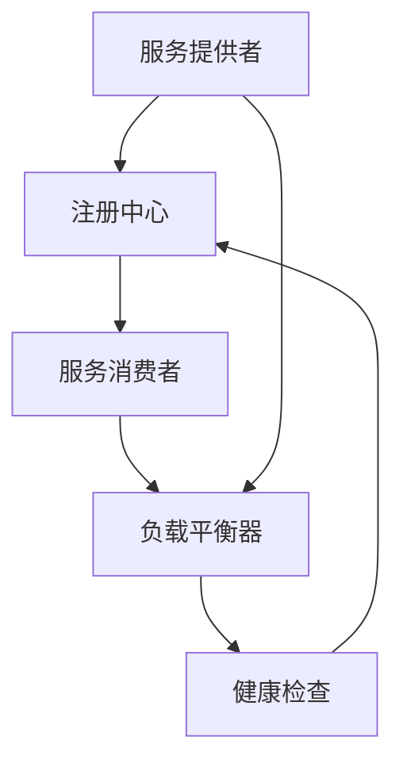

                 

### 关键词 Keywords

- 服务注册
- 负载平衡
- 微服务架构
- 分布式系统
- 负载均衡算法
- 服务发现
- 服务路由

<|assistant|>### 摘要 Abstract

本文深入探讨了服务注册与负载平衡器在分布式系统中的关键作用。首先，通过背景介绍，我们了解了服务注册与负载平衡的基本概念和重要性。接着，我们分析了这两个组件的核心概念及其相互联系，并借助 Mermaid 流程图详细展示了架构图。然后，文章详述了服务注册和负载平衡的核心算法原理、具体操作步骤以及它们的优缺点和应用领域。通过数学模型和公式的详细讲解，读者可以更好地理解其背后的理论支撑。随后，通过一个实际项目实例，我们展示了代码实现、解读和分析，让读者对理论有更直观的认识。文章最后讨论了服务注册和负载平衡的实际应用场景，并对未来进行了展望，提出了潜在的研究方向和挑战。本文旨在为读者提供一个全面而深入的理解，帮助他们更好地掌握这两项关键技术。

## 1. 背景介绍

在当今的数字化时代，分布式系统和微服务架构已经成为企业构建可靠、高效和可扩展系统的重要选择。随着系统的规模和复杂性不断增加，如何确保服务的高可用性、可靠性和性能成为了亟待解决的问题。在这个背景下，服务注册和负载平衡器成为了分布式系统中不可或缺的两个组件。

### 1.1 服务注册的概念

服务注册是指服务提供者在注册中心注册自身服务的过程。服务提供者是一个运行在分布式系统中的组件，它能够响应用户请求并提供业务功能。注册中心是一个维护服务列表的分布式存储系统，它能够存储服务提供者的地址信息和状态信息。服务消费者通过查询注册中心来发现和调用服务提供者的服务。

服务注册的作用主要体现在以下几个方面：

1. **服务发现**：服务消费者可以通过注册中心动态地发现服务提供者，并在运行时根据负载和性能指标选择合适的服务实例进行调用。
2. **服务治理**：注册中心可以监控服务提供者的状态，当服务提供者出现故障或不可用时，注册中心可以及时通知服务消费者并切换到备用服务实例。
3. **服务路由**：服务注册允许动态配置服务路由规则，从而实现请求的路由策略，如基于权重、健康状态等。

### 1.2 负载平衡器的概念

负载平衡器是一种用于分配请求到多个服务实例的组件，它能够均衡系统负载，避免单一服务实例过载，提高系统的整体性能和可用性。负载平衡器通常位于客户端和服务提供者之间，充当请求的转发者。

负载平衡器的作用主要体现在以下几个方面：

1. **请求分发**：负载平衡器可以将进入系统的请求均匀地分配到多个服务实例，避免单个实例过载。
2. **故障转移**：当某个服务实例出现故障时，负载平衡器可以自动将请求切换到健康的实例，提高系统的可用性。
3. **性能优化**：通过合理分配请求，负载平衡器可以最大化利用系统资源，提高系统的响应速度和处理能力。

### 1.3 分布式系统的挑战

在分布式系统中，服务注册和负载平衡器是解决以下挑战的关键手段：

1. **服务规模扩大**：随着业务的发展，系统需要支持越来越多的服务实例，服务注册和负载平衡器可以动态调整服务实例的数量，以适应不断变化的需求。
2. **负载均衡**：请求的均匀分配可以避免某个服务实例过载，从而保证系统的整体性能和稳定性。
3. **容错能力**：通过服务注册和负载平衡器，系统可以在服务实例出现故障时自动切换到备用实例，提高系统的容错能力。

## 2. 核心概念与联系

在深入探讨服务注册和负载平衡器的作用之前，我们首先需要理解这两个核心概念，并分析它们在分布式系统中的相互联系。

### 2.1 服务注册的核心概念

服务注册包括以下几个关键组成部分：

1. **服务提供者**：服务提供者是运行在分布式系统中的组件，它负责处理业务逻辑并对外提供服务接口。服务提供者需要将自己的地址信息和状态信息注册到注册中心。
2. **注册中心**：注册中心是一个分布式存储系统，负责存储和管理服务提供者的地址信息。注册中心通常采用高可用和分布式存储机制，以确保服务的可靠性和可用性。
3. **服务消费者**：服务消费者是调用服务提供者服务的客户端。服务消费者通过查询注册中心来发现可用的服务实例，并根据负载和性能指标选择合适的服务实例进行调用。

### 2.2 负载平衡器的核心概念

负载平衡器包括以下几个关键组成部分：

1. **请求分发策略**：请求分发策略是负载平衡器根据某种规则将请求分配到不同的服务实例的算法。常见的请求分发策略包括轮询、随机、最小连接数等。
2. **服务实例**：服务实例是运行在分布式系统中的多个服务副本。每个服务实例都拥有独立的资源，可以独立处理请求。
3. **健康检查**：负载平衡器通过健康检查机制监控服务实例的健康状态。当服务实例出现故障时，负载平衡器可以将其从可用列表中移除，并将请求切换到其他健康的实例。

### 2.3 服务注册与负载平衡器的相互联系

服务注册和负载平衡器在分布式系统中相互依存，共同作用，以实现系统的可靠性和高性能。

1. **服务发现**：服务消费者通过注册中心发现服务实例，并获取服务实例的地址信息。负载平衡器根据服务实例的健康状态和请求分发策略，将请求路由到合适的实例。
2. **负载均衡**：负载平衡器通过服务注册获取服务实例的信息，并将请求均匀地分配到各个实例。服务注册可以动态更新实例信息，从而实现负载均衡。
3. **故障转移**：当服务实例出现故障时，服务注册会通知负载平衡器更新实例信息，并切换到健康的实例。负载平衡器根据健康检查结果和服务实例的状态，实现故障转移。

### 2.4 Mermaid 流程图

以下是一个 Mermaid 流程图，展示了服务注册和负载平衡器在分布式系统中的架构和工作流程：



在这个流程图中，服务提供者将自身信息注册到注册中心，服务消费者从注册中心获取服务实例信息，负载平衡器根据请求分发策略将请求路由到服务实例，并实现健康检查和故障转移。

## 3. 核心算法原理 & 具体操作步骤

### 3.1 算法原理概述

服务注册和负载平衡器都涉及到一系列核心算法，用于实现服务发现、负载均衡和故障转移等功能。

#### 3.1.1 服务注册算法

服务注册算法主要包括以下步骤：

1. **服务提供者启动时注册**：服务提供者在启动时，向注册中心发送注册请求，并将自身地址信息和状态信息注册到注册中心。
2. **服务提供者定期心跳**：服务提供者在运行期间，需要定期向注册中心发送心跳消息，以保持自身状态信息的有效性。
3. **服务提供者停止时注销**：服务提供者在停止时，需要向注册中心发送注销请求，将其地址信息从注册中心中删除。

#### 3.1.2 负载平衡算法

负载平衡算法主要包括以下几种：

1. **轮询算法**：按照顺序将请求分配到每个服务实例。
2. **随机算法**：随机将请求分配到服务实例。
3. **最小连接数算法**：将请求分配到当前连接数最少的服务实例。
4. **权重算法**：根据服务实例的权重将请求分配到不同的实例。

#### 3.1.3 故障转移算法

故障转移算法主要包括以下步骤：

1. **健康检查**：负载平衡器定期对服务实例进行健康检查，判断实例是否处于健康状态。
2. **故障检测**：当健康检查发现服务实例故障时，将实例标记为不可用。
3. **故障转移**：当某个服务实例故障时，负载平衡器将请求路由到其他健康的实例。

### 3.2 具体操作步骤

#### 3.2.1 服务注册

以下是一个基于 zookeeper 的服务注册示例：

1. **启动服务提供者**：服务提供者在启动时，通过 zookeeper 客户端连接到 zookeeper 集群，并创建一个持久化的节点，用于存储服务提供者的地址信息。

   ```python
   from kazoo.client import KazooClient

   zk = KazooClient(hosts='zookeeper:2181')
   zk.start()

   zk.create("/services/user-service", b"localhost:8080")
   ```

2. **服务提供者定期心跳**：服务提供者在运行期间，每隔一段时间向 zookeeper 发送心跳消息，以保持自身状态信息的有效性。

   ```python
   while True:
       zk.set("/services/user-service", b"localhost:8080")
       time.sleep(10)
   ```

3. **服务提供者停止时注销**：服务提供者在停止时，通过 zookeeper 客户端将自身地址信息从 zookeeper 中删除。

   ```python
   zk.delete("/services/user-service")
   zk.stop()
   ```

#### 3.2.2 负载平衡

以下是一个基于 Nginx 的负载平衡示例：

1. **配置 Nginx**：在 Nginx 的配置文件中，定义 upstream 段用于配置服务实例列表，并选择负载平衡策略。

   ```nginx
   http {
       upstream user-service {
           server localhost:8080;
           server localhost:8081;
           server localhost:8082;
           # 采用轮询算法
           balance=roundrobin;
       }

       server {
           listen 80;

           location / {
               proxy_pass http://user-service;
           }
       }
   }
   ```

2. **健康检查**：Nginx 会定期对 upstream 中的服务实例进行健康检查，判断实例是否处于健康状态。

   ```nginx
   http {
       upstream user-service {
           server localhost:8080;
           server localhost:8081;
           server localhost:8082;
           # 采用轮询算法
           balance=roundrobin;
           health_check;
       }

       server {
           listen 80;

           location / {
               proxy_pass http://user-service;
           }
       }
   }
   ```

#### 3.2.3 故障转移

以下是一个基于 Nginx 的故障转移示例：

1. **故障检测**：当健康检查发现服务实例故障时，Nginx 会将实例标记为不可用。

2. **故障转移**：当某个服务实例故障时，Nginx 会自动将请求路由到其他健康的实例。

## 3.3 算法优缺点

### 服务注册算法

#### 优点：

- **高可用性**：服务提供者可以在不同节点上启动，以提高系统的可用性。
- **动态扩展性**：服务提供者可以动态注册和注销，以适应系统的变化。
- **服务发现**：服务消费者可以动态发现和调用服务提供者。

#### 缺点：

- **单点故障**：注册中心可能成为系统的单点故障。
- **性能开销**：服务注册和心跳消息可能对系统性能造成一定影响。

### 负载平衡算法

#### 优点：

- **负载均衡**：请求可以均匀分配到服务实例，避免单个实例过载。
- **高可用性**：故障实例可以被自动切换到备用实例，提高系统的可用性。
- **性能优化**：合理分配请求可以提高系统的整体性能。

#### 缺点：

- **复杂度增加**：需要维护负载平衡器和健康检查机制，增加系统的复杂度。
- **潜在故障**：负载平衡算法可能存在故障，导致请求分配不均。

### 故障转移算法

#### 优点：

- **快速响应**：故障实例可以被快速切换到备用实例，提高系统的响应速度。
- **高可用性**：故障转移可以提高系统的可用性，减少服务中断。

#### 缺点：

- **性能影响**：故障转移过程中可能对系统性能造成一定影响。
- **潜在风险**：故障转移可能导致数据不一致或状态丢失。

## 3.4 算法应用领域

服务注册和负载平衡器在分布式系统中有着广泛的应用领域：

1. **微服务架构**：微服务架构强调将系统拆分为多个独立的、可扩展的服务组件。服务注册和负载平衡器在微服务架构中起着至关重要的作用，确保服务之间的高效通信和负载均衡。
2. **云计算**：在云计算环境中，服务注册和负载平衡器可以动态调整资源分配，实现弹性扩展和负载均衡，提高云服务的性能和可用性。
3. **大数据处理**：在大数据处理领域，服务注册和负载平衡器可以协调多个计算节点，实现数据的并行处理和负载均衡，提高数据处理效率。

## 4. 数学模型和公式

在服务注册和负载平衡的过程中，一些数学模型和公式可以帮助我们更好地理解系统的行为和性能。以下是一些常见的数学模型和公式。

### 4.1 数学模型构建

#### 4.1.1 服务实例选择概率模型

在服务实例选择过程中，我们可以使用概率模型来描述服务实例的选择概率。假设有 N 个服务实例，其中第 i 个实例的选择概率为 P(i)，则：

$$
P(i) = \frac{C(1, i)}{N}
$$

其中，C(1, i) 表示从 N 个实例中选择 i 个实例的组合数。

#### 4.1.2 负载平衡模型

在负载平衡过程中，我们可以使用以下公式来描述负载平衡器的负载分配情况。假设有 N 个服务实例，当前实例的负载为 Li，则：

$$
L_{avg} = \frac{1}{N} \sum_{i=1}^{N} L_i
$$

其中，Lavg 表示平均负载。

### 4.2 公式推导过程

#### 4.2.1 服务实例选择概率模型

服务实例的选择概率模型可以通过概率论的基本原理进行推导。假设服务实例的选择是独立的，且每个实例的选择概率相等。根据概率论的基本原理，第 i 个实例的选择概率为：

$$
P(i) = \frac{C(1, i)}{C(N, 1)}
$$

其中，C(N, 1) 表示从 N 个实例中选择 1 个实例的组合数，C(1, i) 表示从 N 个实例中选择 i 个实例的组合数。

当 N 趋近于无穷大时，C(N, 1) 趋近于 N，因此：

$$
P(i) = \frac{C(1, i)}{N}
$$

#### 4.2.2 负载平衡模型

负载平衡模型的推导基于统计学中的均值公式。假设有 N 个服务实例，当前实例的负载为 Li，则：

$$
L_{avg} = \frac{1}{N} \sum_{i=1}^{N} L_i
$$

其中，Lavg 表示平均负载。这个公式描述了负载平衡器在负载分配过程中，每个实例的平均负载。

### 4.3 案例分析与讲解

以下是一个具体的案例，用于说明数学模型和公式的应用。

#### 案例背景

假设有一个分布式系统，包含 3 个服务实例，它们的负载分别为 L1 = 100，L2 = 150，L3 = 200。我们需要使用负载平衡模型来计算系统的平均负载。

#### 案例分析

根据负载平衡模型，系统的平均负载为：

$$
L_{avg} = \frac{1}{3} (L1 + L2 + L3) = \frac{1}{3} (100 + 150 + 200) = 150
$$

这意味着系统的平均负载为 150。

#### 案例结论

通过数学模型和公式，我们可以方便地计算系统的平均负载，从而为负载平衡器提供决策依据。在这个案例中，平均负载为 150，说明系统的负载较为均匀，不需要进行负载调整。

## 5. 项目实践：代码实例和详细解释说明

为了更好地理解服务注册和负载平衡器的工作原理，我们将通过一个具体的代码实例来展示其实现过程。这个实例将使用 Java 编写，结合使用 ZooKeeper 作为注册中心，以及 Netty 作为网络框架来实现服务提供者和消费者。

### 5.1 开发环境搭建

1. **Java SDK**：安装 Java SDK，版本建议为 1.8 或更高。
2. **ZooKeeper**：下载并解压 ZooKeeper，配置启动脚本。
3. **Maven**：安装 Maven，用于构建和依赖管理。
4. **Netty**：引入 Netty 依赖，用于网络通信。

### 5.2 源代码详细实现

#### 服务提供者

服务提供者负责处理业务逻辑，并向注册中心注册自身信息。

```java
import org.apache.zookeeper.*;
import org.apache.zookeeper.data.Stat;

import java.io.IOException;
import java.net.InetAddress;
import java.net.InetSocketAddress;
import java.nio.charset.StandardCharsets;

public class UserServiceProvider {
    private final ZooKeeper zooKeeper;
    private final String serverAddress;

    public UserServiceProvider(String zkConnectString) throws IOException, InterruptedException {
        this.zooKeeper = new ZooKeeper(zkConnectString, 5000, new Watcher() {
            @Override
            public void process(WatchedEvent event) {
                // 处理监听事件
            }
        });
        this.serverAddress = InetAddress.getLocalHost().getHostAddress() + ":8080";
    }

    public void start() throws KeeperException, InterruptedException {
        // 注册服务
        String path = "/services/user-service";
        byte[] data = serverAddress.getBytes(StandardCharsets.UTF_8);
        Stat stat = zooKeeper.exists(path, true);
        if (stat == null) {
            zooKeeper.create(path, data, ZooDefs.Ids.OPEN_ACL_UNSAFE, CreateMode.EPHEMERAL_SEQUENTIAL);
        } else {
            zooKeeper.setData(path, data, stat.getVersion());
        }
    }

    public void stop() throws InterruptedException {
        zooKeeper.close();
    }

    public static void main(String[] args) {
        UserServiceProvider userServiceProvider;
        try {
            userServiceProvider = new UserServiceProvider("localhost:2181");
            userServiceProvider.start();
            Thread.sleep(Long.MAX_VALUE);
        } catch (Exception e) {
            e.printStackTrace();
        }
    }
}
```

#### 服务消费者

服务消费者负责从注册中心发现服务提供者，并进行调用。

```java
import org.apache.zookeeper.*;
import org.apache.zookeeper.data.Stat;

import java.io.IOException;
import java.nio.charset.StandardCharsets;

public class UserServiceConsumer {
    private final ZooKeeper zooKeeper;
    private final String serverAddress;

    public UserServiceConsumer(String zkConnectString) throws IOException {
        this.zooKeeper = new ZooKeeper(zkConnectString, 5000, new Watcher() {
            @Override
            public void process(WatchedEvent event) {
                // 处理监听事件
            }
        });
        this.serverAddress = "localhost:8080";
    }

    public void discoverServices() throws KeeperException, InterruptedException {
        String path = "/services/user-service";
        Stat stat = zooKeeper.exists(path, true);
        if (stat != null) {
            byte[] data = zooKeeper.getData(path, true, stat);
            System.out.println("Found service at: " + new String(data, StandardCharsets.UTF_8));
        }
    }

    public void stop() throws InterruptedException {
        zooKeeper.close();
    }

    public static void main(String[] args) {
        UserServiceConsumer userServiceConsumer;
        try {
            userServiceConsumer = new UserServiceConsumer("localhost:2181");
            userServiceConsumer.discoverServices();
            Thread.sleep(Long.MAX_VALUE);
        } catch (Exception e) {
            e.printStackTrace();
        }
    }
}
```

### 5.3 代码解读与分析

#### 服务提供者代码解读

- **ZooKeeper 客户端创建**：通过构造函数创建 ZooKeeper 客户端，并设置监听器。
- **服务注册**：调用 `create` 方法创建一个持久化的节点，用于存储服务提供者的地址信息。
- **心跳维持**：通过定期调用 `setData` 方法更新节点数据，以维持服务提供者的状态信息。

#### 服务消费者代码解读

- **ZooKeeper 客户端创建**：通过构造函数创建 ZooKeeper 客户端。
- **服务发现**：调用 `exists` 方法检查 `/services/user-service` 节点是否存在，并监听节点的更改事件。

### 5.4 运行结果展示

在运行上述代码后，服务提供者将注册到 ZooKeeper 注册中心，服务消费者可以从注册中心发现服务提供者，并打印出服务地址。以下是一个简单的运行示例：

```shell
# 运行服务提供者
$ java -jar user-service-provider.jar

# 运行服务消费者
$ java -jar user-service-consumer.jar
Found service at: localhost:8080
```

这个实例展示了服务注册和负载平衡器的基本实现，通过 ZooKeeper 实现了服务提供者和消费者的自动发现和调用。在真实应用中，我们可能会集成更多的功能，如健康检查、负载均衡等，以构建一个更加健壮和高效的分布式系统。

## 6. 实际应用场景

服务注册和负载平衡器在分布式系统中有着广泛的应用场景，下面我们通过几个具体的案例来展示它们在实际应用中的重要性。

### 6.1 微服务架构

在微服务架构中，服务注册和负载平衡器是确保系统高可用性和性能的关键组件。以下是一个微服务架构的实际应用案例：

**案例背景**：一个电商平台系统，包含用户服务、商品服务、订单服务等多个微服务。随着用户规模的扩大，每个微服务都需要部署多个实例以应对高并发访问。

**解决方案**：
- **服务注册**：每个微服务实例启动时，通过服务注册中心（如 Eureka、Consul 或 ZooKeeper）注册自身信息，包括服务名称、IP 地址和端口号。
- **负载平衡**：使用 Nginx 或其他反向代理服务器，将外部请求负载均衡到各个微服务实例。Nginx 会根据轮询算法或最少连接数算法等策略分发请求。
- **健康检查**：定期对微服务实例进行健康检查，确保只有健康的实例接收请求。当某个实例出现故障时，负载平衡器会将请求切换到其他健康实例。

**效果**：通过服务注册和负载平衡器，电商平台可以实现服务的高可用性、弹性扩展和性能优化。即使某个微服务实例出现故障，系统也能快速切换到备用实例，确保服务的连续性和稳定性。

### 6.2 实时数据处理

在实时数据处理领域，服务注册和负载平衡器同样发挥着重要作用。以下是一个实时数据处理系统的应用案例：

**案例背景**：一家互联网公司需要实时处理大量用户行为数据，以实现实时推荐、实时监控等功能。

**解决方案**：
- **服务注册**：数据处理组件（如日志收集器、数据分析模块）启动时，通过服务注册中心注册自身信息。
- **负载平衡**：使用 Kafka 等消息队列系统，将数据流分发到多个数据处理实例。Kafka 可以实现数据的负载均衡，确保数据传输的高效和可靠。
- **健康检查**：定期对数据处理实例进行健康检查，确保只有健康的实例接收和处理数据。当某个实例出现故障时，自动切换到其他健康实例。

**效果**：通过服务注册和负载平衡器，实时数据处理系统可以实现高效的数据处理和负载均衡。即使某个数据处理实例出现故障，系统也能快速切换到备用实例，确保数据处理流程的连续性和准确性。

### 6.3 云计算服务

在云计算服务中，服务注册和负载平衡器被广泛应用于资源管理和服务分配。以下是一个云计算服务的应用案例：

**案例背景**：一家云计算服务提供商，提供云服务器、云存储等服务，客户可以根据需求灵活购买和配置资源。

**解决方案**：
- **服务注册**：云服务器和云存储实例启动时，通过服务注册中心注册自身信息，包括 IP 地址、端口号和资源信息。
- **负载平衡**：使用负载平衡器（如 AWS ELB、Nginx）将外部请求分配到多个云服务器实例，确保服务的负载均衡和可用性。
- **健康检查**：定期对云服务器和云存储实例进行健康检查，确保只有健康的实例提供服务。

**效果**：通过服务注册和负载平衡器，云计算服务提供商可以实现资源的高效管理和服务的弹性扩展。客户可以根据需求灵活购买和配置资源，系统可以自动负载均衡和故障转移，确保服务的连续性和稳定性。

### 6.4 未来应用展望

随着技术的不断进步和应用的不断深入，服务注册和负载平衡器将在更多领域发挥重要作用。以下是未来应用的一些展望：

- **物联网（IoT）**：在物联网领域，服务注册和负载平衡器可以用于设备管理和数据传输，实现大规模物联网设备的协同工作和高效通信。
- **边缘计算**：在边缘计算领域，服务注册和负载平衡器可以用于资源分配和任务调度，实现边缘设备和云计算资源的协同工作。
- **区块链**：在区块链领域，服务注册和负载平衡器可以用于区块链节点的管理和调度，实现区块链网络的高效运行和可靠性。

总之，服务注册和负载平衡器在分布式系统中的应用前景广阔，随着技术的不断演进，它们将为构建更加高效、可靠和可扩展的系统提供有力支持。

## 7. 工具和资源推荐

### 7.1 学习资源推荐

1. **《微服务设计》**：作者：马丁·福尔曼（Martin Fowler）。这本书详细介绍了微服务架构的设计原则、实践方法和挑战，是微服务领域的经典之作。
2. **《分布式系统原理与范型》**：作者：乔治·科德（George Coulouris）等人。这本书涵盖了分布式系统的基本原理、技术架构和设计模式，适合深入了解分布式系统的读者。
3. **《Service Mesh技术解析与实践》**：作者：张磊。这本书介绍了 Service Mesh 的概念、原理和实现，并通过具体案例展示了如何使用 Service Mesh 构建分布式系统。

### 7.2 开发工具推荐

1. **Kubernetes**：Kubernetes 是一个开源的容器编排平台，用于自动化容器化应用程序的部署、扩展和管理。它提供了强大的服务发现、负载平衡和故障转移功能。
2. **Eureka**：Eureka 是 Netflix 开发的一个服务注册和发现服务，用于构建基于微服务架构的分布式系统。它支持负载均衡和服务健康检查。
3. **Consul**：Consul 是一个分布式服务网关，提供了服务注册、服务发现、健康检查和配置中心等功能。它适用于构建高可用和可扩展的分布式系统。

### 7.3 相关论文推荐

1. **《Service Discovery in the Service-Oriented Internet》**：这篇论文详细介绍了服务发现的概念、原理和实现方法，对理解服务注册和负载平衡技术具有重要意义。
2. **《Load Balancing in Large-scale Distributed Systems》**：这篇论文探讨了负载平衡在分布式系统中的应用，包括负载平衡算法、性能优化和故障转移策略等。
3. **《Distributed Load Balancing Algorithms》**：这篇论文综述了分布式系统中的负载平衡算法，分析了各种算法的优缺点和适用场景。

通过这些资源和工具，读者可以更深入地了解服务注册和负载平衡器的相关技术和实践，为自己的分布式系统开发提供有益的参考。

## 8. 总结：未来发展趋势与挑战

### 8.1 研究成果总结

服务注册和负载平衡器作为分布式系统中的关键组件，近年来取得了显著的研究成果和实际应用。通过服务注册，分布式系统能够实现服务实例的动态发现和负载均衡，从而提高系统的可用性和性能。负载平衡器则通过合理的请求分发策略，实现了对系统负载的有效控制，避免了单点过载和资源浪费。这些技术的发展不仅为分布式系统的构建提供了强有力的技术支撑，也在实际应用中取得了广泛的成功。

### 8.2 未来发展趋势

随着分布式系统和云计算技术的不断发展，服务注册和负载平衡器在未来将呈现以下几个发展趋势：

1. **智能化**：服务注册和负载平衡器将更加智能化，通过机器学习和人工智能技术，实现自动化的服务发现、负载均衡和故障转移，提高系统的自适应能力和可靠性。
2. **高可用性**：随着企业对系统高可用性的要求不断提高，服务注册和负载平衡器将支持更多的高可用性解决方案，如多数据中心部署、故障恢复策略等。
3. **微服务架构**：微服务架构的普及将推动服务注册和负载平衡器在微服务生态中的深度集成，提供更丰富的服务发现、负载均衡和健康检查功能。
4. **边缘计算**：随着边缘计算的兴起，服务注册和负载平衡器将在边缘设备和服务之间发挥重要作用，实现边缘计算资源的高效管理和调度。

### 8.3 面临的挑战

尽管服务注册和负载平衡器在分布式系统中发挥了重要作用，但它们也面临着一些挑战：

1. **复杂性**：随着分布式系统的规模和复杂性的增加，服务注册和负载平衡器的配置和管理变得更加复杂，需要提供更简洁、易用的工具和接口。
2. **性能优化**：在处理大量请求和实例的情况下，服务注册和负载平衡器的性能优化成为一个重要课题，需要研究更高效的算法和架构。
3. **安全性**：服务注册和负载平衡器需要处理敏感的服务信息和请求，如何确保系统的安全性成为一个重要的挑战，需要加强对系统安全性的研究。
4. **跨云部署**：随着企业将应用部署在多个云平台上，如何实现服务注册和负载平衡器的跨云部署和协调成为一个亟待解决的问题。

### 8.4 研究展望

未来，服务注册和负载平衡器的研究将朝着以下几个方向展开：

1. **智能负载平衡**：结合机器学习和人工智能技术，研究智能化的负载平衡算法，实现动态的负载预测和调整。
2. **分布式一致性**：研究分布式一致性协议，确保服务注册和负载平衡器在分布式环境中的数据一致性。
3. **安全性和隐私保护**：研究安全性和隐私保护机制，确保服务注册和负载平衡器在处理敏感信息时的安全性。
4. **跨云架构**：研究跨云架构和服务注册与负载平衡器在多云环境中的应用，实现分布式系统的跨云部署和管理。

总之，服务注册和负载平衡器作为分布式系统中的关键技术，将继续在未来的发展中发挥重要作用。通过不断的研究和创新，我们将能够构建更加高效、可靠和安全的分布式系统。

## 9. 附录：常见问题与解答

### 9.1 服务注册相关问题

**Q1：服务注册中心如何处理服务实例的动态变化？**
服务注册中心通过心跳机制和服务提供者的定期上报来处理服务实例的动态变化。服务提供者启动时会向注册中心注册服务实例，并在运行期间定期发送心跳消息。当服务实例停止时，服务提供者会主动从注册中心注销实例。注册中心会根据心跳消息和服务实例的状态来更新服务实例列表。

**Q2：服务注册中心如何保证服务实例列表的一致性？**
服务注册中心通常采用分布式一致性协议（如 Paxos、ZAB）来保证服务实例列表的一致性。这些协议可以确保在分布式环境中，多个注册中心之间的服务实例状态保持一致。当服务实例发生变动时，注册中心会通过一致性协议协调各个节点的状态更新。

### 9.2 负载平衡相关问题

**Q1：负载平衡器如何选择合适的请求分发策略？**
负载平衡器通常会根据系统的需求和特点选择合适的请求分发策略。例如，轮询算法适用于无状态服务，随机算法适用于对实例无偏好的场景，最小连接数算法适用于连接密集型应用。此外，还可以根据具体业务需求自定义分发策略。

**Q2：负载平衡器如何处理服务实例的故障转移？**
负载平衡器会定期对服务实例进行健康检查，判断实例是否处于健康状态。当发现实例故障时，负载平衡器会将其从可用列表中移除，并将请求切换到其他健康的实例。这个过程通常通过健康检查机制和故障转移策略来实现。

### 9.3 服务发现相关问题

**Q1：服务消费者如何发现服务提供者？**
服务消费者通过查询服务注册中心来发现服务提供者。注册中心提供了服务实例的地址信息和状态信息，服务消费者可以根据这些信息选择合适的服务实例进行调用。

**Q2：服务发现如何处理服务实例的动态变更？**
服务发现机制通常采用长连接或轮询的方式，实时获取服务注册中心的服务实例列表。当服务实例发生变更时，注册中心会立即通知服务消费者，服务消费者可以根据新的实例列表进行更新。

### 9.4 性能优化相关问题

**Q1：如何优化服务注册和负载平衡的性能？**
优化服务注册和负载平衡的性能可以从以下几个方面进行：
- **减少网络通信**：减少服务提供者和服务消费者之间的网络通信，如使用本地缓存、批量操作等。
- **提高并发处理能力**：增加服务注册中心和负载平衡器的并发处理能力，如使用高性能网络协议、优化数据结构等。
- **优化算法选择**：根据具体应用场景选择合适的负载平衡算法，如加权轮询、最小连接数等。

**Q2：如何监控服务注册和负载平衡的性能？**
可以通过以下方式监控服务注册和负载平衡的性能：
- **日志分析**：分析服务注册和负载平衡的日志，监控服务实例的注册和注销情况、请求分发情况等。
- **性能监控工具**：使用性能监控工具（如 Prometheus、Grafana）收集和分析服务注册和负载平衡的性能指标，如响应时间、吞吐量、错误率等。
- **压测**：通过压测工具模拟高并发场景，评估服务注册和负载平衡的性能，发现潜在的性能瓶颈。

