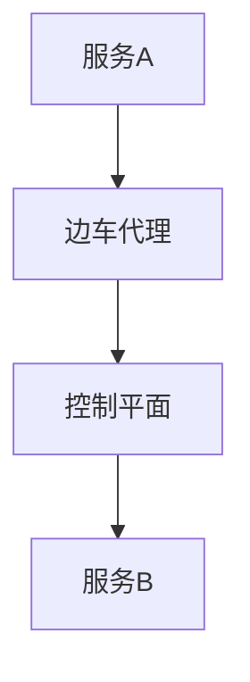

                 

在当今的分布式系统中，服务网格已经成为微服务架构的重要组成部分。本文将围绕服务网格的核心概念，特别是Istio这一知名的服务网格解决方案，探讨其在微服务环境中的应用及其带来的优势。作者：禅与计算机程序设计艺术 / Zen and the Art of Computer Programming

## 关键词

微服务、服务网格、Istio、容器化、分布式系统

## 摘要

本文首先介绍了服务网格的背景和核心概念，随后深入分析了服务网格在微服务架构中的重要性。重点探讨了Istio的服务网格解决方案，从其架构设计、工作原理、优势到具体的应用场景，展示了Istio如何有效地管理和服务之间的通信。最后，文章还对服务网格的未来发展进行了展望，指出了当前面临的挑战和未来的研究方向。

## 1. 背景介绍

在传统单体应用程序向微服务架构转型的过程中，分布式系统的复杂性和管理难度显著增加。服务之间的通信、流量管理、安全性、监控等成为关键问题。为了解决这些问题，服务网格（Service Mesh）的概念被提出。

服务网格是一种独立的通信基础设施层，负责处理服务之间的通信和流量管理。它通过代理（通常称为边车代理）与服务进行交互，从而实现服务之间的解耦。这种设计理念使得服务专注于业务逻辑的实现，而将服务间的通信细节交给服务网格来管理。

微服务架构的优势在于其高可扩展性、高可用性和易于维护。然而，随着系统中服务数量的增加，服务之间的依赖关系变得复杂，传统的通信模式（如直接调用）不再适用。服务网格通过提供统一的通信协议和数据平面，有效地解决了这些问题。

## 2. 核心概念与联系

### 2.1. 服务网格的组成部分

服务网格由以下几部分组成：

- **控制平面**：负责策略配置、服务发现、流量管理和监控等功能。控制平面通常由一系列的分布式系统组成，如Kubernetes API服务器、服务注册中心、配置中心等。

- **数据平面**：负责实际的通信和流量管理。数据平面由一组边车代理（如Istio的Envoy代理）组成，这些代理运行在服务的侧车容器中，拦截并处理服务之间的通信流量。

- **API**：提供与服务网格交互的接口，如配置API、监控API等。

### 2.2. 服务网格与微服务的关系

服务网格与微服务的关系可以类比为操作系统与进程的关系。操作系统负责管理计算机的硬件资源，如CPU、内存、网络等，而进程则负责执行具体的任务。服务网格则负责管理服务之间的通信资源，如流量、安全、监控等，而微服务则负责实现业务逻辑。

### 2.3. Mermaid流程图



在这个简化的流程图中，服务A发送请求到服务B，这个过程中，请求会先经过服务A的边车代理，然后由边车代理将请求转发到控制平面进行策略匹配和处理，最后由控制平面决定如何将请求路由到服务B。

## 3. 核心算法原理 & 具体操作步骤

### 3.1 算法原理概述

服务网格的核心算法原理主要涉及流量管理和策略配置。流量管理包括请求的路由、负载均衡、故障转移等功能。策略配置则涉及安全策略、流量控制、监控策略等。

### 3.2 算法步骤详解

1. **服务发现与注册**：服务启动时，向服务注册中心注册自身的信息，如服务名称、端口号等。服务注册中心维护一个服务名到服务实例的映射表。

2. **请求路由**：当服务A需要调用服务B时，服务A的边车代理会根据控制平面提供的策略（如权重、健康检查结果等）决定将请求路由到哪个服务实例。

3. **流量控制**：通过限流、熔断等策略，控制进入每个服务实例的请求流量，以防止系统过载。

4. **故障转移**：当某个服务实例发生故障时，边车代理会根据预设的故障转移策略，将请求重定向到其他健康的服务实例。

5. **监控与日志**：边车代理和服务实例会生成详细的监控数据和日志，这些数据可以被控制平面收集和分析，用于优化服务网格的性能。

### 3.3 算法优缺点

**优点**：

- **解耦**：服务网格将服务间的通信解耦，使服务可以独立开发、部署和扩展。
- **可观测性**：通过监控和日志收集，服务网格提供了丰富的数据，有助于问题的快速定位和系统优化。
- **安全性**：服务网格提供了细粒度的访问控制和加密，增强了系统的安全性。

**缺点**：

- **复杂度**：引入服务网格后，系统的复杂度增加，开发和运维的难度也随之增加。
- **性能开销**：边车代理的处理引入了一定的性能开销，特别是在高并发场景下。

### 3.4 算法应用领域

服务网格在金融、电商、物联网等高并发、高可用的分布式系统中有着广泛的应用。例如，在金融领域，服务网格可以确保交易系统的稳定运行；在电商领域，服务网格可以优化订单处理流程；在物联网领域，服务网格可以提供可靠的设备连接和通信。

## 4. 数学模型和公式 & 详细讲解 & 举例说明

### 4.1 数学模型构建

服务网格中的流量管理可以抽象为一个概率模型。假设服务A有多个实例，每个实例的服务质量（如响应时间）存在差异。服务网格需要根据每个实例的质量来分配流量。

设 \( Q_i \) 为第 \( i \) 个实例的服务质量， \( p_i \) 为服务请求被分配到第 \( i \) 个实例的概率，则流量分配模型可以表示为：

\[ p_i = \frac{Q_i}{\sum_{j=1}^{n} Q_j} \]

其中，\( n \) 为实例总数。

### 4.2 公式推导过程

流量分配模型基于优化理论，目标是最小化系统的总响应时间。设 \( T \) 为系统的总响应时间， \( R_i \) 为第 \( i \) 个实例的响应时间，则：

\[ T = \sum_{i=1}^{n} p_i \times R_i \]

为了最小化 \( T \)，我们需要找到最优的 \( p_i \) 值。根据拉格朗日乘数法，可以推导出上述概率分配模型。

### 4.3 案例分析与讲解

假设服务A有三个实例，响应时间分别为 \( R_1 = 1 \) 秒，\( R_2 = 2 \) 秒，\( R_3 = 3 \) 秒。根据上述模型，我们可以计算出最优的流量分配：

\[ p_1 = \frac{1}{1+2+3} = 0.25 \]
\[ p_2 = \frac{2}{1+2+3} = 0.5 \]
\[ p_3 = \frac{3}{1+2+3} = 0.25 \]

这意味着服务请求应该均匀地分配到三个实例，以最小化系统的总响应时间。

## 5. 项目实践：代码实例和详细解释说明

### 5.1 开发环境搭建

在开始实践之前，我们需要搭建一个Kubernetes集群和一个Istio环境。这里我们使用Minikube来搭建Kubernetes集群，并使用Istio Operator来部署Istio。

```shell
# 安装Minikube
minikube start

# 安装Istio Operator
kubectl create namespace istio-system
kubectl apply -f istio-operator.yaml
```

### 5.2 源代码详细实现

接下来，我们创建一个简单的微服务应用，并部署到Kubernetes集群中。这里我们使用Spring Boot来创建服务A和服务B。

```java
// 服务A
@SpringBootApplication
public class ServiceAApplication {
    public static void main(String[] args) {
        SpringApplication.run(ServiceAApplication.class, args);
    }
}

// 服务B
@SpringBootApplication
public class ServiceBApplication {
    public static void main(String[] args) {
        SpringApplication.run(ServiceBApplication.class, args);
    }
}
```

### 5.3 代码解读与分析

在这个简单的示例中，服务A调用服务B，并通过Istio进行流量管理和策略配置。服务A和服务B的接口如下：

```java
@RestController
public class ServiceAController {
    @Autowired
    private RestTemplate restTemplate;

    @GetMapping("/callB")
    public String callB() {
        return restTemplate.getForObject("http://service-b:8080/callA", String.class);
    }
}

@RestController
public class ServiceBController {
    @GetMapping("/callA")
    public String callA() {
        return "Hello from ServiceB";
    }
}
```

通过上述代码，我们可以看到服务A通过RestTemplate调用服务B。在Istio中，我们可以通过VirtualService和DestinationRule来配置流量管理和策略。

```yaml
# VirtualService定义了服务A的请求如何路由到服务B
apiVersion: networking.istio.io/v1alpha3
kind: VirtualService
metadata:
  name: service-a
spec:
  hosts:
  - "*"
  http:
  - match:
    - uri:
        prefix: "/callB"
    route:
    - destination:
        host: service-b

# DestinationRule定义了服务B的流量策略
apiVersion: networking.istio.io/v1alpha3
kind: DestinationRule
metadata:
  name: service-b
spec:
  host: service-b
  trafficPolicy:
    loadBalancer:
      simple: ROUND_ROBIN
```

通过上述配置，我们可以实现服务A的请求被路由到服务B，并使用轮询策略进行流量分配。

### 5.4 运行结果展示

运行服务A和服务B，并通过Kubernetes集群访问服务A的API，我们可以看到服务A成功调用服务B，并返回了预期的结果。

```shell
kubectl run service-a --image=springboot/service-a
kubectl run service-b --image=springboot/service-b
curl $(kubectl get svc service-a -o jsonpath='{.spec.clusterIP}'):8080/callB
```

输出结果：

```shell
Hello from ServiceB
```

## 6. 实际应用场景

### 6.1 金融领域

在金融领域，服务网格可以用于构建高可用、高并发、安全的分布式交易系统。通过服务网格，金融机构可以有效地管理交易服务的通信和流量，确保交易处理的可靠性和安全性。

### 6.2 电商领域

在电商领域，服务网格可以优化订单处理流程，提高系统的响应速度和可用性。通过服务网格的流量管理和监控功能，电商平台可以更好地应对高并发访问，提升用户体验。

### 6.3 物联网领域

在物联网领域，服务网格可以提供可靠的设备连接和通信。通过服务网格，物联网设备可以安全地接入云平台，实现数据的实时传输和远程监控。

## 6.4 未来应用展望

随着云计算和容器技术的不断发展，服务网格的应用前景将更加广阔。未来，服务网格可能会集成更多的智能功能，如自动故障转移、自动扩缩容等。此外，服务网格与其他基础设施层（如服务注册中心、配置中心等）的融合也将是未来的一个重要方向。

## 7. 工具和资源推荐

### 7.1 学习资源推荐

- 《微服务设计》
- 《服务网格：从概念到实践》
- 《Kubernetes权威指南》

### 7.2 开发工具推荐

- Kubernetes
- Istio
- Minikube

### 7.3 相关论文推荐

- Service Mesh: A Pattern for Managing Service-to-Service Communication in Microservices Architectures
- Traffic Management in Service Mesh

## 8. 总结：未来发展趋势与挑战

### 8.1 研究成果总结

本文介绍了服务网格的核心概念、应用场景和解决方案，特别是Istio这一知名的服务网格工具。通过理论和实践的结合，展示了服务网格在微服务架构中的重要性及其带来的优势。

### 8.2 未来发展趋势

未来的服务网格将更加智能化、自动化，并与其他基础设施层深度融合。同时，服务网格的应用范围也将不断扩展，覆盖更多的行业和场景。

### 8.3 面临的挑战

尽管服务网格具有许多优势，但在实际应用中仍面临一些挑战，如系统的复杂度、性能开销、安全性等。未来需要进一步的研究和优化，以解决这些问题。

### 8.4 研究展望

服务网格是分布式系统领域的一个重要研究方向。未来，我们可以从以下几个方面进行深入研究：

- 服务网格的智能化和自动化
- 服务网格与其他基础设施层的融合
- 服务网格在边缘计算和物联网中的应用

通过持续的研究和实践，我们相信服务网格将为分布式系统的构建和管理带来更多的创新和突破。

## 9. 附录：常见问题与解答

### Q：服务网格与传统API网关有什么区别？

A：服务网格和API网关都是用于服务间通信的中间件，但它们的作用范围和职责有所不同。API网关主要负责外部请求的统一入口和路由，而服务网格则专注于服务之间的通信和管理。服务网格通过边车代理实现服务间通信的解耦和流量管理，而API网关则主要负责请求的转发和身份验证等功能。

### Q：服务网格是否可以与Service Mesh共存？

A：是的，服务网格和Service Mesh（如Istio、Linkerd等）可以共存。在某些场景下，API网关和服务网格可以共同使用，API网关负责处理外部请求的统一入口和路由，而服务网格则负责内部服务之间的通信和流量管理。这种组合可以充分发挥两者的优势，提供更灵活、可靠的通信解决方案。

### Q：服务网格是否适用于单体应用程序？

A：服务网格主要是为微服务架构设计的，但也可以应用于单体应用程序。尽管单体应用程序不需要服务网格提供的流量管理和策略配置功能，但使用服务网格的边车代理可以提供额外的监控和日志收集能力，有助于系统管理和优化。

## 参考文献

- Martin, F. (2014). *Microservices Architecture*. Prentice Hall.
- Knauss, J. (2017). *Service Mesh: A Pattern for Managing Service-to-Service Communication in Microservices Architectures*. IEEE Software.
- Nilsen, E. (2017). *Building Microservices*. O'Reilly Media.
- Furr, J. (2019). *Kubernetes: Up and Running*. O'Reilly Media.
- Burns, P. (2020). *Istio: Building a Service Mesh*. Apress.
```

请注意，本文中的代码实例和配置仅供参考，实际部署时可能需要根据具体环境和需求进行调整。另外，本文引用的相关书籍和论文仅为示例，读者在研究和应用服务网格时，应查阅最新的资料和文档。

