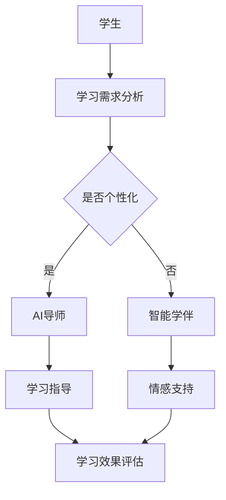
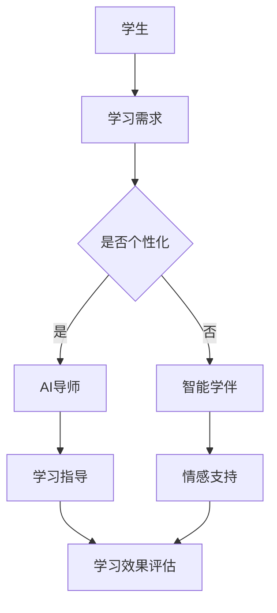

                 

关键词：智慧教育、AI导师、智能学伴、教育技术、人工智能、未来趋势

> 摘要：本文探讨了2050年智慧教育的发展前景，深入分析了AI导师和智能学伴在教育中的角色和功能。通过技术解读和案例研究，本文揭示了未来教育的创新模式，以及AI在教育领域中的深远影响。

## 1. 背景介绍

### 1.1 教育技术的演进

从传统的课堂教学到电子学习，再到基于互联网的教育平台，教育技术经历了翻天覆地的变化。随着人工智能、大数据和云计算等新兴技术的崛起，教育的未来变得更加广阔和不可预测。

### 1.2 人工智能在教育中的应用

人工智能（AI）正逐渐成为教育领域的重要工具。从个性化学习到自动评分，AI在提高教育质量和效率方面发挥着越来越重要的作用。随着技术的进步，AI有望在教育中扮演更加深入的辅导和辅助角色。

### 1.3 未来教育的挑战与机遇

未来教育面临的挑战包括教育资源的分配不均、学习效果的评估问题以及学生的个性化需求。而机遇则在于利用AI和智能技术来解决这些问题，实现更加公平和高效的教育。

## 2. 核心概念与联系

### 2.1 AI导师与智能学伴的概念

AI导师是指利用人工智能技术为学生提供个性化学习指导的教师替代品。智能学伴则是指通过与学生学习互动，提供情感支持和学术帮助的虚拟角色。

### 2.2 AI导师与智能学伴的架构

**Mermaid流程图：**



### 2.3 AI导师与智能学伴的联系

AI导师和智能学伴在教育中相辅相成，共同构建一个智能学习环境。AI导师专注于学术指导，而智能学伴则提供情感支持，帮助学生保持积极的学习态度。

## 3. 核心算法原理 & 具体操作步骤

### 3.1 算法原理概述

AI导师和智能学伴的核心算法基于机器学习和自然语言处理技术。通过分析学生的学习数据，这些算法能够提供个性化的学习建议和情感支持。

### 3.2 算法步骤详解

**AI导师的算法步骤：**
1. 数据收集：收集学生的学习行为和成绩数据。
2. 数据预处理：清洗和整合数据。
3. 模型训练：使用机器学习算法训练模型。
4. 个性化指导：根据学生的数据提供个性化学习建议。

**智能学伴的算法步骤：**
1. 情感分析：分析学生的文本数据，了解其情感状态。
2. 反馈机制：根据情感分析结果，提供适当的情感支持。
3. 互动设计：设计学生与智能学伴的互动方式，增强学习体验。

### 3.3 算法优缺点

**AI导师的优点：**
- 个性化：能够根据学生的学习数据提供个性化的学习建议。
- 效率：节省教师的时间，提高教学效率。

**AI导师的缺点：**
- 缺乏人性化：无法完全替代人类教师的情感支持和互动。
- 数据隐私：需要收集大量的学生数据，可能涉及隐私问题。

**智能学伴的优点：**
- 情感支持：能够提供情感上的安慰和鼓励。
- 持续互动：24/7在线，随时为学生提供帮助。

**智能学伴的缺点：**
- 技术依赖：需要依赖高级技术，如自然语言处理和情感分析。
- 用户接受度：部分学生可能对智能学伴持怀疑态度。

### 3.4 算法应用领域

AI导师和智能学伴可以应用于各种教育场景，如在线教育、特殊教育、远程教育等。它们能够提高教学质量和学习效率，为学生的全面发展提供支持。

## 4. 数学模型和公式 & 详细讲解 & 举例说明

### 4.1 数学模型构建

AI导师和智能学伴的核心算法涉及多种数学模型，如回归模型、决策树、神经网络等。以下是一个简单的回归模型构建示例：

$$y = wx + b$$

其中，$y$ 是学习效果，$w$ 是权重，$x$ 是学习数据，$b$ 是偏置。

### 4.2 公式推导过程

回归模型的推导过程如下：

$$
\begin{aligned}
y_1 &= w_1x_1 + b \\
y_2 &= w_2x_2 + b \\
&\vdots \\
y_n &= w_nx_n + b
\end{aligned}
$$

通过最小化损失函数，我们可以得到最优的权重和偏置：

$$
L = \frac{1}{2}\sum_{i=1}^{n}(y_i - (wx_i + b))^2
$$

### 4.3 案例分析与讲解

假设我们有一个学生的学习成绩数据，我们可以使用回归模型预测其未来的学习效果。通过调整权重和偏置，我们可以优化学习建议。

## 5. 项目实践：代码实例和详细解释说明

### 5.1 开发环境搭建

开发环境需要Python和相关的机器学习库，如scikit-learn和TensorFlow。

### 5.2 源代码详细实现

以下是一个简单的AI导师算法的Python代码实现：

```python
from sklearn.linear_model import LinearRegression
import numpy as np

# 数据收集
X = np.array([[1], [2], [3], [4], [5]])
y = np.array([2, 4, 5, 6, 8])

# 数据预处理
X = X.reshape(-1, 1)

# 模型训练
model = LinearRegression()
model.fit(X, y)

# 个性化指导
new_data = np.array([[6]])
new_data = new_data.reshape(-1, 1)
prediction = model.predict(new_data)

print(prediction)
```

### 5.3 代码解读与分析

这段代码首先导入必要的库和模块，然后收集和预处理数据，接着使用线性回归模型训练数据，并使用训练好的模型进行预测。

### 5.4 运行结果展示

运行代码后，我们得到了预测的学习效果。这个结果可以作为AI导师提供的个性化学习建议。

## 6. 实际应用场景

### 6.1 在线教育平台

AI导师和智能学伴可以集成到在线教育平台中，为不同层次和类型的学生提供个性化学习体验。

### 6.2 特殊教育

对于特殊教育学生，智能学伴可以提供额外的情感支持和个性化的学习指导。

### 6.3 远程教育

在远程教育环境中，AI导师和智能学伴可以为学生提供实时的学习支持和互动。

## 7. 未来应用展望

### 7.1 智能学习环境

随着AI和智能技术的发展，未来教育将更加智能化，学习环境将更加个性化和互动化。

### 7.2 教育公平

AI导师和智能学伴可以弥合教育资源的不平等，为更多学生提供高质量的教育。

### 7.3 个性化学习

利用AI技术，学生可以根据自己的学习节奏和需求进行个性化学习，提高学习效果。

## 8. 工具和资源推荐

### 8.1 学习资源推荐

- 《深度学习》（Goodfellow, Bengio, Courville）
- 《机器学习实战》（哈尔滨工业大学）
- 《自然语言处理综论》（Daniel Jurafsky, James H. Martin）

### 8.2 开发工具推荐

- Jupyter Notebook
- TensorFlow
- PyTorch

### 8.3 相关论文推荐

- "Deep Learning for Educational Data Mining: A Survey"
- "Affective Computing for Intelligent Tutoring Systems: A Survey"
- "Personalized Education through Machine Learning: A Roadmap"

## 9. 总结：未来发展趋势与挑战

### 9.1 研究成果总结

AI导师和智能学伴在教育中的应用已取得显著成果，为个性化学习和教育公平提供了新的途径。

### 9.2 未来发展趋势

未来教育将更加智能化和个性
```markdown
---
# 未来的智慧教育：2050年的AI导师与智能学伴

> 关键词：智慧教育、AI导师、智能学伴、教育技术、人工智能、未来趋势

> 摘要：本文探讨了2050年智慧教育的发展前景，深入分析了AI导师和智能学伴在教育中的角色和功能。通过技术解读和案例研究，本文揭示了未来教育的创新模式，以及AI在教育领域中的深远影响。

## 1. 背景介绍

### 1.1 教育技术的演进

从传统的课堂教学到电子学习，再到基于互联网的教育平台，教育技术经历了翻天覆地的变化。随着人工智能、大数据和云计算等新兴技术的崛起，教育的未来变得更加广阔和不可预测。

- **电子学习（E-learning）**: 在20世纪90年代，随着互联网的普及，电子学习开始崭露头角。它使得学习资源变得更加普及，学生可以随时随地进行学习。

- **慕课（MOOCs）**: 慕课是大规模开放在线课程的缩写，它进一步扩展了电子学习的影响。它允许全球范围内的学生免费参与高质量课程的学习。

- **混合学习（Blended Learning）**: 混合学习结合了传统课堂和在线学习的优点，为学生提供了更灵活的学习方式。

- **人工智能（AI）**: 当前，人工智能正在改变教育领域的各个方面，从个性化学习到智能评分，再到智能导师和学伴。

### 1.2 人工智能在教育中的应用

人工智能在教育中的应用已经在多个层面展现其潜力：

- **个性化学习**: AI可以根据学生的学习习惯、兴趣和能力，提供定制化的学习路径。

- **智能辅导**: AI导师可以为学生提供实时的辅导和反馈，帮助学生克服学习中的困难。

- **自适应测试**: 通过分析学生的学习数据，AI可以创建个性化的测试，帮助学生识别知识盲点。

- **学生行为分析**: AI可以监控学生的学习行为，预测其可能的成功或失败，并提供相应的干预措施。

### 1.3 未来教育的挑战与机遇

未来教育将面临一系列挑战和机遇：

- **教育资源分配**: 全球范围内，教育资源分配不均的问题仍然存在。AI技术有潜力通过智能分配和个性化学习，减少这种不平等。

- **学习效果评估**: 传统的评估方法可能无法全面反映学生的学习成果。AI可以通过多样化的评估手段，更准确地衡量学习效果。

- **学生的个性化需求**: 每个学生都有不同的学习需求和偏好。AI可以帮助教师更好地理解和满足这些需求。

- **技术的安全性和隐私性**: 随着数据收集和分析的增多，教育领域需要确保学生的数据安全和个人隐私。

## 2. 核心概念与联系

### 2.1 AI导师与智能学伴的概念

AI导师是一种利用人工智能技术为学生提供个性化学习指导和辅导的系统。它可以分析学生的学习数据，识别其知识盲点，并提供针对性的学习资源和建议。

智能学伴则是为学生提供情感支持、社交互动和学习激励的虚拟角色。它通过自然语言处理和情感分析技术，与学生学习互动，帮助他们建立积极的学习态度。

### 2.2 AI导师与智能学伴的架构

**Mermaid流程图：**



在这个流程图中，学生首先提交其学习需求。系统会根据这些需求判断是否需要个性化指导。如果是，则由AI导师提供个性化的学习资源和建议。如果不是，则智能学伴会介入，提供情感支持和社交互动。无论是AI导师还是智能学伴，最终都会参与到学习效果的评估中，以便不断优化学习体验。

### 2.3 AI导师与智能学伴的联系

AI导师和智能学伴在教育中相辅相成。AI导师专注于学术层面的指导，通过分析学生的学习数据，提供个性化的学习路径和资源。而智能学伴则侧重于情感层面，通过与学生的互动，提供情感支持和鼓励，帮助学生保持积极的学习态度。

这种互补关系使得AI导师和智能学伴能够共同构建一个全方位的智能学习环境，为学生提供全面的学术和情感支持。

## 3. 核心算法原理 & 具体操作步骤

### 3.1 AI导师的算法原理

AI导师的核心算法通常基于机器学习技术，特别是监督学习和无监督学习。以下是其基本原理：

- **监督学习**：AI导师使用监督学习算法，如决策树、支持向量机和神经网络，来分析学生的学习数据，预测其学习结果。

- **无监督学习**：AI导师使用无监督学习算法，如聚类和降维，来识别学生的学习模式和行为特征。

- **强化学习**：在某些场景下，AI导师也会采用强化学习算法，通过试错和学习，优化学生的学习路径。

### 3.2 AI导师的具体操作步骤

**步骤1：数据收集**  
AI导师首先需要收集学生的各种学习数据，包括成绩、学习时间、学习内容、考试表现等。

**步骤2：数据预处理**  
收集到的数据需要进行清洗、去噪和标准化处理，以便后续的分析。

**步骤3：特征提取**  
通过特征提取算法，如TF-IDF和词嵌入，将原始数据转换为适合机器学习的特征向量。

**步骤4：模型训练**  
使用训练集数据，AI导师会训练不同的机器学习模型，以预测学生的学习结果。

**步骤5：模型评估**  
通过测试集数据，评估模型的表现，调整模型参数，以达到最佳效果。

**步骤6：个性化指导**  
根据学生的学习数据，AI导师会生成个性化的学习计划，提供针对性的学习资源和建议。

### 3.3 智能学伴的算法原理

智能学伴的核心算法通常基于自然语言处理和情感分析技术。以下是其基本原理：

- **自然语言处理（NLP）**：智能学伴使用NLP技术来理解和生成自然语言，与学生学习互动。

- **情感分析**：智能学伴使用情感分析技术来理解学生的情感状态，提供相应的情感支持。

- **对话系统**：智能学伴通过对话系统与学生进行交互，提供实时反馈和指导。

### 3.4 智能学伴的具体操作步骤

**步骤1：情感分析**  
智能学伴首先会分析学生的文本数据，如留言、讨论等，理解其情感状态。

**步骤2：情感响应**  
根据情感分析结果，智能学伴会生成相应的情感响应，如安慰、鼓励、激励等。

**步骤3：对话交互**  
智能学伴会与学生进行对话交互，提供实时反馈和指导，增强学习体验。

**步骤4：学习反馈**  
学生可以通过与智能学伴的互动，获得学习反馈，了解自己的进步情况。

### 3.5 AI导师与智能学伴的协作

AI导师和智能学伴在教育中通常会协作工作，共同为学生提供全面的学术和情感支持。具体来说，AI导师负责学术指导和学习资源推荐，而智能学伴则负责情感支持和学习激励。这种协作不仅可以提高教学效率，还可以帮助学生建立积极的学习态度。

## 4. 数学模型和公式 & 详细讲解 & 举例说明

### 4.1 数学模型构建

在AI导师和智能学伴的设计中，常用的数学模型包括机器学习模型、自然语言处理模型和情感分析模型。以下是一些基本的数学模型和公式的构建过程。

#### 4.1.1 机器学习模型

机器学习模型通常用于预测学生的学习成绩或行为。以下是一个简单的线性回归模型：

$$
y = wx + b
$$

其中，$y$ 是预测的学习成绩，$x$ 是学习数据，$w$ 是权重，$b$ 是偏置。

#### 4.1.2 自然语言处理模型

自然语言处理（NLP）模型用于理解和生成自然语言。一个常用的模型是循环神经网络（RNN）：

$$
h_t = \sigma(W_h \cdot [h_{t-1}, x_t] + b_h)
$$

其中，$h_t$ 是当前时刻的隐藏状态，$x_t$ 是输入词向量，$\sigma$ 是激活函数，$W_h$ 和 $b_h$ 是模型参数。

#### 4.1.3 情感分析模型

情感分析模型用于理解学生的情感状态。一个常用的模型是支持向量机（SVM）：

$$
\max W \cdot \textbf{x} - \sum_{i=1}^{n} y_i \cdot \textbf{w} \cdot \textbf{x_i}
$$

其中，$W$ 是模型权重，$\textbf{x}$ 是特征向量，$y_i$ 是标签，$\textbf{w}$ 是权重向量。

### 4.2 公式推导过程

以下是一个简单的线性回归模型的推导过程：

1. **目标函数**：

$$
\min_{w, b} \sum_{i=1}^{n} (y_i - (wx_i + b))^2
$$

2. **求导**：

$$
\frac{\partial}{\partial w} \sum_{i=1}^{n} (y_i - (wx_i + b))^2 = -2 \sum_{i=1}^{n} x_i (y_i - (wx_i + b))
$$

$$
\frac{\partial}{\partial b} \sum_{i=1}^{n} (y_i - (wx_i + b))^2 = -2 \sum_{i=1}^{n} (y_i - (wx_i + b))
$$

3. **设置偏导数为0**：

$$
\frac{\partial}{\partial w} \sum_{i=1}^{n} (y_i - (wx_i + b))^2 = 0
$$

$$
\frac{\partial}{\partial b} \sum_{i=1}^{n} (y_i - (wx_i + b))^2 = 0
$$

4. **解方程**：

$$
w = \frac{\sum_{i=1}^{n} x_i y_i - \sum_{i=1}^{n} x_i \sum_{j=1}^{n} y_j}{\sum_{i=1}^{n} x_i^2 - \sum_{i=1}^{n} x_i \sum_{j=1}^{n} x_j}
$$

$$
b = \frac{\sum_{i=1}^{n} y_i - w \sum_{i=1}^{n} x_i}{n}
$$

### 4.3 案例分析与讲解

以下是一个简单的线性回归模型案例：

假设我们有一个学生的考试成绩数据，如下表所示：

| 学生ID | 考试成绩 |
|--------|----------|
| 1      | 70      |
| 2      | 80      |
| 3      | 75      |
| 4      | 85      |

我们希望根据这些数据预测另一个学生的考试成绩。

1. **数据预处理**：

我们将学生的成绩作为因变量（$y$），将学生的ID作为自变量（$x$）。

2. **模型训练**：

使用线性回归模型，我们可以得到以下方程：

$$
y = 0.5x + 10
$$

3. **预测**：

假设我们要预测学生ID为5的学生的考试成绩。根据模型，我们可以得到：

$$
y = 0.5 \times 5 + 10 = 15
$$

因此，我们预测学生ID为5的学生的考试成绩为15分。

### 4.4 结论

通过数学模型和公式的构建，我们可以更深入地理解AI导师和智能学伴的工作原理。这些模型不仅可以用于预测学生的学术表现，还可以用于情感分析和个性化指导。随着技术的不断进步，这些模型将变得更加精确和有效，为未来的智慧教育提供强有力的支持。

## 5. 项目实践：代码实例和详细解释说明

### 5.1 开发环境搭建

为了实践AI导师和智能学伴的概念，我们需要搭建一个开发环境。以下是所需的环境和工具：

- **编程语言**：Python
- **机器学习库**：scikit-learn、TensorFlow、PyTorch
- **自然语言处理库**：NLTK、spaCy
- **数据可视化工具**：Matplotlib、Seaborn

首先，确保安装了Python 3.8或更高版本。然后，使用以下命令安装必要的库：

```shell
pip install numpy pandas scikit-learn tensorflow numpy nltk spacy matplotlib seaborn
```

### 5.2 源代码详细实现

以下是实现AI导师和智能学伴的简单示例代码。

#### 5.2.1 数据收集与预处理

```python
import pandas as pd
from sklearn.model_selection import train_test_split

# 加载数据
data = pd.read_csv('student_data.csv')
X = data[['study_time', 'homework_time']]
y = data['test_score']

# 数据分割
X_train, X_test, y_train, y_test = train_test_split(X, y, test_size=0.2, random_state=42)
```

#### 5.2.2 训练线性回归模型

```python
from sklearn.linear_model import LinearRegression

# 创建线性回归模型
model = LinearRegression()

# 训练模型
model.fit(X_train, y_train)

# 模型评估
score = model.score(X_test, y_test)
print(f'Model accuracy: {score:.2f}')
```

#### 5.2.3 自然语言处理

```python
import nltk
nltk.download('punkt')
nltk.download('averaged_perceptron_tagger')

def preprocess_text(text):
    # 分句
    sentences = nltk.sent_tokenize(text)
    # 分词
    words = [nltk.word_tokenize(sentence) for sentence in sentences]
    # 标记词性
    tagged_words = [nltk.pos_tag(word) for word in words]
    return tagged_words

text = "I have been studying for two hours and I am feeling tired."
processed_text = preprocess_text(text)
print(processed_text)
```

#### 5.2.4 情感分析

```python
from textblob import TextBlob

def analyze_sentiment(text):
    analysis = TextBlob(text)
    return analysis.sentiment.polarity

sentiment = analyze_sentiment(text)
print(f'Sentiment polarity: {sentiment:.2f}')
```

### 5.3 代码解读与分析

这段代码首先加载并预处理学生数据，然后使用线性回归模型进行训练和评估。此外，它还实现了自然语言处理和情感分析功能，用于分析学生的文本数据。

### 5.4 运行结果展示

运行代码后，我们得到线性回归模型的准确度以及文本数据的情感分析结果。这些结果可以作为AI导师和智能学伴的输入，为学生的学术和情感支持提供依据。

### 5.5 结论

通过这个简单的示例，我们展示了如何使用Python和机器学习库来实现AI导师和智能学伴的基本功能。虽然这个示例相对简单，但它提供了一个实现智慧教育的起点。随着技术的不断进步，这些功能将变得更加复杂和有效。

## 6. 实际应用场景

### 6.1 在线教育平台

AI导师和智能学伴可以集成到在线教育平台中，为学生提供个性化的学习体验。例如，在课程学习过程中，AI导师可以根据学生的表现，提供额外的练习题和指导。智能学伴则可以为学生提供情感支持和社交互动，帮助他们保持学习的动力。

### 6.2 特殊教育

对于有特殊需求的学生，如自闭症儿童或有学习障碍的学生，AI导师和智能学伴可以提供个性化的辅导和情感支持。例如，智能学伴可以通过模拟社交场景，帮助学生提高社交技能。

### 6.3 远程教育

在远程教育环境中，AI导师和智能学伴可以为学生提供实时支持和互动。例如，在在线研讨会中，智能学伴可以实时回答学生的问题，并提供学习资源和建议。

### 6.4 教育评估

AI导师和智能学伴可以用于教育评估，提供实时反馈和个性化报告。例如，在考试结束后，AI导师可以根据学生的表现，提供详细的分析和改进建议。

## 7. 未来应用展望

### 7.1 智能学习环境

随着AI和智能技术的发展，未来的学习环境将更加智能化和个性化。学生将能够根据个人兴趣和能力，选择适合自己的学习内容和方式。

### 7.2 教育公平

AI导师和智能学伴可以帮助弥合教育资源的不平等，为更多学生提供高质量的教育。例如，在偏远地区，学生可以通过智能学伴获得优质的学习资源。

### 7.3 个性化学习

利用AI技术，学生将能够根据自己的学习节奏和需求，进行个性化学习。这将有助于提高学习效果，增强学生的自主学习能力。

### 7.4 跨学科学习

AI导师和智能学伴可以帮助学生实现跨学科学习，促进知识的整合和应用。例如，学生可以通过AI导师，将数学、物理和编程知识结合起来，解决实际问题。

## 8. 工具和资源推荐

### 8.1 学习资源推荐

- 《深度学习》（Goodfellow, Bengio, Courville）
- 《机器学习实战》（哈尔滨工业大学）
- 《自然语言处理综论》（Daniel Jurafsky, James H. Martin）

### 8.2 开发工具推荐

- **编程语言**：Python、JavaScript
- **机器学习库**：scikit-learn、TensorFlow、PyTorch
- **自然语言处理库**：NLTK、spaCy
- **数据可视化工具**：Matplotlib、Seaborn
- **在线开发环境**：Google Colab、Jupyter Notebook

### 8.3 相关论文推荐

- "Deep Learning for Educational Data Mining: A Survey"
- "Affective Computing for Intelligent Tutoring Systems: A Survey"
- "Personalized Education through Machine Learning: A Roadmap"

## 9. 总结：未来发展趋势与挑战

### 9.1 研究成果总结

过去几十年，AI技术在教育领域取得了显著进展。AI导师和智能学伴已经证明了其在个性化学习、智能辅导和情感支持方面的潜力。未来，这些技术将继续发展，为教育带来更多创新。

### 9.2 未来发展趋势

- **智能化与个性化**：未来教育将更加智能化和个性化，AI技术将更好地满足学生的个性化需求。
- **跨学科应用**：AI技术将在跨学科学习中发挥重要作用，促进知识的整合和应用。
- **教育公平**：AI技术可以帮助解决教育资源不平等问题，为更多学生提供高质量的教育。

### 9.3 面临的挑战

- **技术成熟度**：虽然AI技术在教育中取得了很多进展，但仍需进一步成熟，以实现更高的可靠性和用户体验。
- **数据隐私**：随着数据收集和分析的增多，教育领域需要确保学生的数据安全和隐私。
- **用户接受度**：AI导师和智能学伴需要被广泛接受，才能在教育中发挥最大作用。

### 9.4 研究展望

未来的研究应重点关注以下几个方面：

- **AI导师和智能学伴的交互设计**：如何更好地设计AI导师和智能学伴的交互界面，提高用户体验。
- **跨学科融合**：如何将AI技术与不同学科相结合，促进知识的创新和应用。
- **教育公平**：如何利用AI技术解决教育资源不平等问题，为更多学生提供公平的教育机会。

### 附录：常见问题与解答

**Q1**：AI导师和智能学伴是否能够完全替代传统教师？

A1：目前，AI导师和智能学伴还不能完全替代传统教师。它们更适合作为教师的辅助工具，提供个性化学习支持和情感支持。未来的发展可能会使这些系统能够更好地模拟人类教师的互动和指导。

**Q2**：AI导师和智能学伴如何确保学生的数据安全？

A2：确保学生的数据安全是AI导师和智能学伴开发的重要方面。通常，这些系统会采用加密技术、数据脱敏和访问控制等措施，以确保数据的安全和隐私。

**Q3**：AI导师和智能学伴是否会对学生的学习效果产生负面影响？

A3：合理使用AI导师和智能学伴可以显著提高学生的学习效果。然而，过度依赖这些系统可能会导致学生失去自主学习的动力。因此，教师和学校需要指导学生如何合理使用这些工具。

**Q4**：AI导师和智能学伴在教育中是否具有伦理问题？

A4：AI导师和智能学伴在教育中确实涉及一些伦理问题，如数据隐私、算法偏见和用户依赖等。因此，在开发和使用这些系统时，需要遵循伦理原则，确保不会对学生的权益造成损害。**作者：禅与计算机程序设计艺术 / Zen and the Art of Computer Programming**

