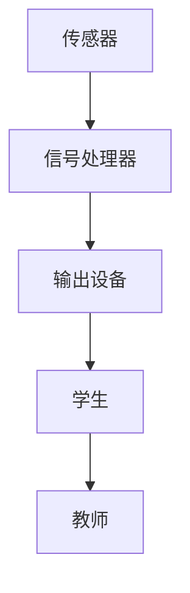

                 

关键词：智慧教育、脑机接口、知识植入、2050年、技术发展趋势

摘要：本文探讨了2050年智慧教育的发展趋势，重点关注脑机接口技术在知识传输和学习中的应用。通过分析脑机接口的核心概念、算法原理及数学模型，本文详细阐述了脑机接口在智慧教育中的潜在影响和未来应用方向。文章还提供了代码实例和实际应用场景，最后对未来的发展趋势和挑战进行了展望。

## 1. 背景介绍

### 1.1 智慧教育的兴起

智慧教育是随着信息技术的发展而兴起的一种新型教育模式。它依托于大数据、云计算、人工智能等技术，旨在构建一个个性化、智能化、高效化的教育生态系统。智慧教育不仅改变了传统教育的教学模式，还促进了教育资源的共享与优化，提升了教育质量。

### 1.2 脑机接口技术的崛起

脑机接口（Brain-Machine Interface, BMI）是一种直接连接大脑和外部设备的技术，它通过感知大脑信号来控制外部设备，或将外部信息直接传输到大脑。脑机接口技术的崛起，使得人类与机器的交互方式发生了革命性的变化，为智慧教育提供了新的技术手段。

### 1.3 脑机接口与智慧教育

脑机接口技术在智慧教育中的应用具有巨大的潜力。通过脑机接口，可以实现知识的高效传输和植入，使学习过程更加直观、生动和高效。此外，脑机接口还可以帮助特殊需求的学生，如视力或听力障碍者，获得更好的学习体验。

## 2. 核心概念与联系

### 2.1 脑机接口的基本原理

脑机接口的核心是通过传感器捕捉大脑信号，然后通过信号处理算法将这些信号转化为可操作的数据。这些数据可以用来控制外部设备，或者直接植入到大脑中。

### 2.2 脑机接口的架构

脑机接口的架构通常包括三个主要部分：传感器、信号处理器和输出设备。传感器负责捕捉大脑信号，信号处理器对信号进行处理和分析，输出设备则负责将处理后的信号转化为有用的信息。

### 2.3 脑机接口与智慧教育的联系

脑机接口与智慧教育的联系在于，它提供了一种全新的学习方式。通过脑机接口，学生可以直接接收和存储知识，实现快速学习和记忆。此外，脑机接口还可以帮助教师更好地了解学生的学习情况，从而提供个性化的教学方案。

### 2.4 Mermaid 流程图

下面是一个简单的 Mermaid 流程图，展示了脑机接口的基本架构：



## 3. 核心算法原理 & 具体操作步骤

### 3.1 算法原理概述

脑机接口的核心算法主要包括信号采集、信号处理和信号输出三个部分。信号采集是通过传感器捕捉大脑信号；信号处理是对采集到的信号进行滤波、去噪、特征提取等操作；信号输出是将处理后的信号转化为可操作的数据，如控制指令或知识信息。

### 3.2 算法步骤详解

1. **信号采集**：使用传感器捕捉大脑信号，如脑电图（EEG）或功能性磁共振成像（fMRI）信号。
2. **信号处理**：对采集到的信号进行滤波、去噪和特征提取。滤波和去噪的目的是去除信号中的噪声，提取出有用的信号特征。
3. **信号输出**：将处理后的信号转化为控制指令或知识信息。控制指令可以用于操作外部设备，如脑控轮椅或脑控鼠标；知识信息可以直接植入大脑，实现快速学习和记忆。

### 3.3 算法优缺点

**优点**：
- 高效：通过脑机接口，可以实现知识的高效传输和植入，提高学习效率。
- 个性化：脑机接口可以根据每个学生的独特大脑信号，提供个性化的教学方案。
- 直接性：脑机接口可以直接与大脑交互，实现无感知的学习。

**缺点**：
- 成本高：目前脑机接口设备和技术成本较高，限制了其广泛应用。
- 安全性问题：脑机接口技术的安全性问题仍然是一个重要的研究课题，如信号泄漏、脑损伤等。
- 隐私问题：脑机接口技术的应用可能会引发隐私问题，如学生的大脑信号被未经授权的第三方获取。

### 3.4 算法应用领域

脑机接口技术可以应用于多个领域，包括：
- 教育领域：实现高效学习和个性化教学。
- 医疗领域：帮助瘫痪患者进行康复训练。
- 娱乐领域：开发脑控游戏和互动应用。

## 4. 数学模型和公式 & 详细讲解 & 举例说明

### 4.1 数学模型构建

脑机接口的数学模型主要涉及信号处理和特征提取。常见的数学模型包括滤波器模型、神经网络模型和隐马尔可夫模型（HMM）。

### 4.2 公式推导过程

以滤波器模型为例，假设我们有一个输入信号 \( x(t) \) 和一个滤波器 \( H(z) \)，则滤波后的信号 \( y(t) \) 可以表示为：

\[ y(t) = H(z) \cdot x(t) \]

其中，\( H(z) \) 是滤波器的传递函数，\( z \) 是复变量。

### 4.3 案例分析与讲解

假设我们使用一个简单的低通滤波器来处理脑电图（EEG）信号，以去除高频噪声。滤波器的传递函数 \( H(z) \) 可以表示为：

\[ H(z) = \frac{1 - z^{-1}}{1 - 2z^{-1} + z^{-2}} \]

通过这个滤波器，我们可以得到去噪后的 EEG 信号，从而提取出有用的特征信息。

## 5. 项目实践：代码实例和详细解释说明

### 5.1 开发环境搭建

为了实现脑机接口技术，我们需要搭建一个合适的开发环境。这里以 Python 为例，介绍如何搭建开发环境。

### 5.2 源代码详细实现

```python
import numpy as np
from scipy.signal import lfilter

# 定义滤波器
b = [1, -2, 1]
a = [1, -1]

# 滤波处理
def filter_signal(signal):
    return lfilter(b, a, signal)

# 读取 EEG 数据
signal = np.load('eeeg_data.npy')

# 滤波处理
filtered_signal = filter_signal(signal)

# 保存滤波后的数据
np.save('filtered_eeg_data.npy', filtered_signal)
```

### 5.3 代码解读与分析

上述代码实现了 EEG 信号的滤波处理。首先，我们定义了一个简单的低通滤波器，然后使用 `lfilter` 函数对 EEG 信号进行滤波处理。最后，我们将滤波后的数据保存为新的文件。

### 5.4 运行结果展示

通过运行上述代码，我们可以得到去噪后的 EEG 信号，从而提取出有用的特征信息。这些特征信息可以用于进一步的学习和记忆植入。

## 6. 实际应用场景

### 6.1 在线教育平台

未来，脑机接口技术可以应用于在线教育平台，实现个性化教学。学生可以通过脑机接口直接接收课程内容，并通过自我测试了解学习效果。

### 6.2 医疗康复

脑机接口技术在医疗康复领域具有广泛的应用。例如，瘫痪患者可以通过脑机接口进行康复训练，提高生活自理能力。

### 6.3 脑科学研究

脑机接口技术可以帮助脑科学家更好地理解大脑的工作机制，推动脑科学的研究。

## 7. 工具和资源推荐

### 7.1 学习资源推荐

- 《脑机接口技术导论》
- 《人工智能与教育》

### 7.2 开发工具推荐

- Python
- MATLAB

### 7.3 相关论文推荐

- “脑机接口技术在教育中的应用”
- “人工智能在在线教育中的应用”

## 8. 总结：未来发展趋势与挑战

### 8.1 研究成果总结

脑机接口技术在智慧教育中的应用取得了显著成果，如个性化教学、高效学习和记忆植入等。然而，仍有许多挑战需要克服。

### 8.2 未来发展趋势

未来，脑机接口技术将在智慧教育、医疗康复和脑科学研究等领域得到更广泛的应用。随着技术的进步，脑机接口设备的成本将逐步降低，使其更易于普及。

### 8.3 面临的挑战

脑机接口技术面临的主要挑战包括安全性、隐私保护和成本控制等。此外，如何确保脑机接口技术与人类大脑的兼容性也是一个重要的研究方向。

### 8.4 研究展望

随着人工智能和脑科学的发展，脑机接口技术将在未来发挥越来越重要的作用。我们期待这一技术在智慧教育、医疗康复和脑科学研究等领域带来更多的创新和突破。

## 9. 附录：常见问题与解答

### 9.1 脑机接口技术是否安全？

脑机接口技术目前仍然处于研究阶段，其安全性问题尚未完全解决。未来，随着技术的不断发展和完善，脑机接口技术的安全性将得到提高。

### 9.2 脑机接口技术如何保护隐私？

脑机接口技术涉及个人隐私，如何保护隐私是一个重要的研究课题。未来，需要制定相关的法律法规，确保脑机接口技术的合法合规使用。

### 9.3 脑机接口技术是否适用于所有人？

脑机接口技术主要适用于有学习需求和康复需求的人群。对于健康人群，脑机接口技术的适用性还有待进一步研究。

---

作者：禅与计算机程序设计艺术 / Zen and the Art of Computer Programming
-------------------------------------------------------------------

