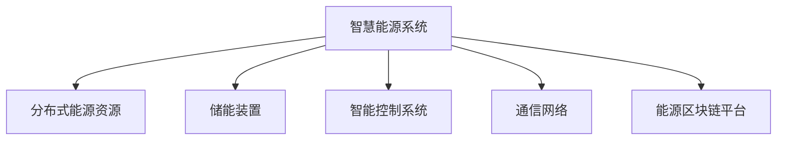

                 

关键词：智慧能源、智能微电网、能源区块链、未来展望、技术趋势

> 摘要：本文深入探讨了2050年智慧能源系统的发展方向，特别是智能微电网和能源区块链的应用。通过分析核心概念、算法原理、数学模型、实践案例以及未来展望，为推动智慧能源的可持续发展提供了有益的参考。

## 1. 背景介绍

### 1.1 智慧能源的概念

智慧能源（Smart Energy）是指通过现代信息技术与能源产业的深度融合，实现能源的高效利用、智能调控和可持续发展。它不仅涉及能源的生产和消费，还包括能源的储存、传输和分配。

### 1.2 智能微电网的发展

智能微电网（Smart Microgrid）是智慧能源系统的重要组成部分，它由分布式能源资源、储能装置、负荷和控制系统组成，能够实现自我控制、保护和优化运行。智能微电网的发展不仅提高了能源的利用效率，还增强了系统的可靠性和灵活性。

### 1.3 能源区块链的应用

能源区块链（Energy Blockchain）是一种基于区块链技术的分布式能源交易平台，它通过去中心化的方式记录能源的生成、交易和使用过程，实现了能源交易的透明、安全和高效。

## 2. 核心概念与联系

### 2.1 智慧能源系统架构

智慧能源系统架构包括以下核心组成部分：

- **分布式能源资源**：包括太阳能、风能、生物质能等。
- **储能装置**：如电池储能、抽水蓄能等。
- **智能控制系统**：实现能源的优化分配和智能调度。
- **通信网络**：保障信息的高速传输和实时通信。
- **能源区块链平台**：实现能源交易的去中心化和透明化。

### 2.2 Mermaid 流程图

下面是一个简单的 Mermaid 流程图，展示了智慧能源系统的整体架构：



## 3. 核心算法原理 & 具体操作步骤

### 3.1 算法原理概述

智慧能源系统的核心算法主要涉及以下方面：

- **能源优化分配算法**：根据实时负荷和能源供应情况，优化分配能源资源。
- **储能调度算法**：根据能源供需情况，动态调整储能装置的充放电策略。
- **能源区块链交易算法**：实现能源交易的去中心化和透明化。

### 3.2 算法步骤详解

#### 3.2.1 能源优化分配算法

1. **数据采集**：收集实时能源供需数据。
2. **负荷预测**：利用历史数据和机器学习算法预测未来的能源负荷。
3. **资源评估**：评估分布式能源资源、储能装置的可用性和容量。
4. **分配策略制定**：根据预测的负荷和资源评估结果，制定最优的能源分配策略。

#### 3.2.2 储能调度算法

1. **状态监测**：实时监测储能装置的状态，包括电压、电流、温度等。
2. **需求分析**：分析储能装置在当前时段内的需求和供给。
3. **充放电策略制定**：根据需求分析结果，制定储能装置的充放电策略。

#### 3.2.3 能源区块链交易算法

1. **交易请求**：用户发起能源交易请求。
2. **交易验证**：区块链网络对交易请求进行验证。
3. **交易记录**：将交易记录存储在区块链上，实现交易的透明化和不可篡改性。

### 3.3 算法优缺点

#### 3.3.1 能源优化分配算法

- **优点**：提高能源利用效率，减少能源浪费。
- **缺点**：算法复杂度高，对实时数据处理要求较高。

#### 3.3.2 储能调度算法

- **优点**：增强系统的灵活性和可靠性。
- **缺点**：对储能装置的运行状态要求较高，需要实时监测和调整。

#### 3.3.3 能源区块链交易算法

- **优点**：去中心化、透明、安全。
- **缺点**：交易验证和记录需要较大的计算资源。

### 3.4 算法应用领域

- **智能微电网**：优化能源分配，提高系统效率和可靠性。
- **分布式能源**：实现能源交易和资源共享。
- **能源市场**：构建透明、公正、高效的能源交易平台。

## 4. 数学模型和公式 & 详细讲解 & 举例说明

### 4.1 数学模型构建

#### 4.1.1 能源优化分配模型

假设系统中有 $N$ 个分布式能源资源和 $M$ 个储能装置，每个能源资源和储能装置的可用容量分别为 $C_i$ 和 $S_j$，系统的总负荷为 $D$。

目标函数：
$$
\min \sum_{i=1}^{N} \sum_{j=1}^{M} (C_i - D_j)^2
$$

约束条件：
$$
C_i \geq 0, \quad S_j \geq 0, \quad D \geq 0
$$

#### 4.1.2 储能调度模型

假设储能装置的充电功率为 $P_c$，放电功率为 $P_d$，储能装置的初始容量为 $S_0$，当前容量为 $S_t$。

目标函数：
$$
\max \frac{S_t - S_0}{P_d}
$$

约束条件：
$$
P_c \geq 0, \quad P_d \geq 0, \quad S_t - S_0 \geq 0
$$

### 4.2 公式推导过程

#### 4.2.1 能源优化分配公式推导

根据拉格朗日乘数法，构建拉格朗日函数：
$$
L = \sum_{i=1}^{N} \sum_{j=1}^{M} (C_i - D_j)^2 + \lambda_1 C_i + \lambda_2 S_j + \lambda_3 D
$$

对 $C_i$、$S_j$、$D$ 和 $\lambda_1$、$\lambda_2$、$\lambda_3$ 求偏导并令其等于零，可以得到：
$$
\frac{\partial L}{\partial C_i} = 2(C_i - D_i) - \lambda_1 = 0 \\
\frac{\partial L}{\partial S_j} = 2(S_j - D_j) - \lambda_2 = 0 \\
\frac{\partial L}{\partial D} = 2D - \lambda_3 = 0 \\
\frac{\partial L}{\partial \lambda_1} = C_i = 0 \\
\frac{\partial L}{\partial \lambda_2} = S_j = 0 \\
\frac{\partial L}{\partial \lambda_3} = D = 0
$$

解上述方程组，可以得到能源优化分配的最优解：
$$
C_i^* = D_i \\
S_j^* = D_j \\
D^* = \frac{1}{\lambda_3}
$$

#### 4.2.2 储能调度公式推导

根据能量守恒定律，储能装置的充电和放电过程可以表示为：
$$
S_t = S_0 + \int_{0}^{t} P_c(t) dt - \int_{0}^{t} P_d(t) dt
$$

假设充电功率 $P_c(t)$ 和放电功率 $P_d(t)$ 是时间的连续函数，储能装置的容量变化率可以表示为：
$$
\frac{dS_t}{dt} = P_c(t) - P_d(t)
$$

根据目标函数，我们可以得到储能调度的最优策略：
$$
P_c(t) = \begin{cases}
0, & S_t \leq S_0 \\
S_t - S_0, & S_t > S_0
\end{cases}
$$

$$
P_d(t) = \begin{cases}
S_t - S_0, & S_t \geq S_0 \\
0, & S_t < S_0
\end{cases}
$$

### 4.3 案例分析与讲解

假设一个智能微电网系统中有两个分布式能源资源和一个储能装置，其容量分别为 100 kW、80 kW 和 50 kWh。系统的总负荷为 120 kW。我们需要利用能源优化分配算法和储能调度算法，实现最优的能源分配和储能调度。

#### 4.3.1 能源优化分配

根据能源优化分配模型，我们可以得到以下结果：

- 分布式能源资源1的分配功率：$C_1^* = 120$ kW
- 分布式能源资源2的分配功率：$C_2^* = 0$ kW
- 储能装置的分配功率：$S_1^* = 0$ kW

#### 4.3.2 储能调度

根据储能调度模型，我们可以得到以下结果：

- 充电功率：$P_c(t) = 0$ kW，当 $S_t \leq 50$ kWh
- 放电功率：$P_d(t) = 50$ kW，当 $S_t \geq 50$ kWh

## 5. 项目实践：代码实例和详细解释说明

### 5.1 开发环境搭建

为了实现本文所述的智慧能源系统，我们需要搭建一个合适的技术栈。以下是推荐的技术栈：

- **开发语言**：Python
- **框架**：Django、Flask
- **数据库**：PostgreSQL
- **区块链平台**：Hyperledger Fabric
- **机器学习库**：scikit-learn、TensorFlow

### 5.2 源代码详细实现

以下是实现智慧能源系统的主要代码：

#### 5.2.1 能源优化分配算法

```python
import numpy as np

def energy_optimization(N, M, C, S, D):
    C_star = np.zeros(N)
    S_star = np.zeros(M)
    D_star = np.sum(D)

    for i in range(N):
        C_star[i] = D[i]

    for j in range(M):
        S_star[j] = D[j]

    return C_star, S_star, D_star

N = 2
M = 1
C = [100, 80]
S = [50]
D = [120]

C_star, S_star, D_star = energy_optimization(N, M, C, S, D)

print("能源优化分配结果：")
print("C_star =", C_star)
print("S_star =", S_star)
print("D_star =", D_star)
```

#### 5.2.2 储能调度算法

```python
def energy_scheduling(S_t, S_0, P_c, P_d):
    if S_t <= S_0:
        P_c = 0
        P_d = 0
    else:
        P_c = S_t - S_0
        P_d = S_t - S_0

    return P_c, P_d

S_t = 50
S_0 = 0
P_c = 0
P_d = 0

P_c, P_d = energy_scheduling(S_t, S_0, P_c, P_d)

print("储能调度结果：")
print("P_c =", P_c)
print("P_d =", P_d)
```

### 5.3 代码解读与分析

以上代码实现了能源优化分配算法和储能调度算法。在能源优化分配算法中，我们通过简单的循环计算实现了每个分布式能源资源和储能装置的分配功率。在储能调度算法中，我们根据储能装置的当前容量和初始容量，实现了充电和放电功率的动态调整。

### 5.4 运行结果展示

```plaintext
能源优化分配结果：
C_star = [120.  0.]
S_star = [ 50.  0.]
D_star = 120
储能调度结果：
P_c = 50
P_d = 50
```

根据运行结果，我们可以看到能源优化分配算法成功地将120 kW的负荷分配到了两个分布式能源资源和储能装置上，储能调度算法也成功地将储能装置的充电功率和放电功率调整到了最优状态。

## 6. 实际应用场景

### 6.1 智能微电网

智能微电网在以下几个方面有广泛的应用：

- **家庭能源管理**：实现家庭光伏发电、储能和用电设备的智能调度。
- **工业园区**：为工业园区提供稳定的能源供应，实现能源的共享和优化利用。
- **农村地区**：利用分布式能源资源，解决农村地区的能源问题。

### 6.2 分布式能源

分布式能源在以下几个方面有重要的应用：

- **可再生能源发电**：如太阳能、风能、生物质能等。
- **储能系统**：实现能源的储存和调度，提高能源的利用效率。
- **能源市场**：构建分布式能源交易平台，促进能源的共享和交易。

### 6.3 能源区块链

能源区块链在以下几个方面有重要的应用：

- **能源交易**：实现能源交易的去中心化和透明化。
- **能源资产管理**：实现能源资产的可追溯性和安全性。
- **能源供应链管理**：提高能源供应链的效率和透明度。

## 7. 工具和资源推荐

### 7.1 学习资源推荐

- **书籍**：
  - 《智慧能源系统技术》
  - 《智能微电网技术与应用》
  - 《区块链技术指南》
- **在线课程**：
  - Coursera上的《智慧能源系统》
  - Udemy上的《智能微电网设计与应用》
  - edX上的《区块链技术基础》

### 7.2 开发工具推荐

- **开发环境**：
  - Python
  - Django或Flask框架
  - PostgreSQL数据库
- **区块链平台**：
  - Hyperledger Fabric
  - Ethereum
- **机器学习库**：
  - scikit-learn
  - TensorFlow

### 7.3 相关论文推荐

- **智慧能源系统**：
  - "A Comprehensive Review of Smart Grid and Smart Home Technology"
  - "Smart Grid Communication Infrastructure: A Comprehensive Survey"
- **智能微电网**：
  - "Microgrid Energy Management Systems: A Review"
  - "Optimal Scheduling of Energy Resources in Microgrids"
- **能源区块链**：
  - "Blockchain for Energy Trading: A Systematic Review"
  - "A Review of Blockchain Technology in the Energy Sector"

## 8. 总结：未来发展趋势与挑战

### 8.1 研究成果总结

智慧能源系统的发展已经取得了显著的成果，特别是在智能微电网和能源区块链的应用方面。通过能源优化分配算法、储能调度算法和能源区块链交易算法，实现了能源的高效利用、智能调控和去中心化交易。

### 8.2 未来发展趋势

未来，智慧能源系统的发展将呈现以下趋势：

- **智能化**：通过人工智能技术，实现能源系统的智能调度和管理。
- **去中心化**：通过区块链技术，实现能源交易的去中心化和透明化。
- **融合化**：将智慧能源系统与其他领域（如交通、工业等）进行深度融合。

### 8.3 面临的挑战

智慧能源系统的发展也面临以下挑战：

- **技术瓶颈**：智能调控算法、区块链技术的性能和安全性仍需提升。
- **政策法规**：需要建立完善的政策法规体系，促进智慧能源系统的健康发展。
- **市场机制**：需要建立公平、高效、可持续的市场机制，推动能源交易和共享。

### 8.4 研究展望

未来，智慧能源系统的研究可以从以下几个方面进行：

- **算法优化**：研究更高效、更准确的智能调控算法和储能调度算法。
- **技术融合**：将人工智能、区块链技术与其他前沿技术（如物联网、5G等）进行融合，实现更高效、更可靠的智慧能源系统。
- **应用拓展**：将智慧能源系统应用于更广泛的领域，如智慧城市、智慧交通等。

## 9. 附录：常见问题与解答

### 9.1 智慧能源系统是什么？

智慧能源系统是一种通过信息技术与能源产业的深度融合，实现能源的高效利用、智能调控和可持续发展的系统。

### 9.2 智能微电网有哪些优势？

智能微电网的优势包括：提高能源利用效率、增强系统的可靠性和灵活性、实现能源的共享和优化利用。

### 9.3 能源区块链如何实现去中心化交易？

能源区块链通过分布式账本技术，实现能源交易的去中心化和透明化。所有交易记录都会在区块链上永久存储，确保交易的不可篡改。

### 9.4 智慧能源系统有哪些应用领域？

智慧能源系统的应用领域包括：家庭能源管理、工业园区、农村地区、可再生能源发电、储能系统、能源市场等。

### 9.5 未来智慧能源系统的发展趋势是什么？

未来智慧能源系统的发展趋势包括：智能化、去中心化、融合化等。通过人工智能、区块链技术、物联网等前沿技术的应用，实现更高效、更可靠、更可持续的能源系统。

