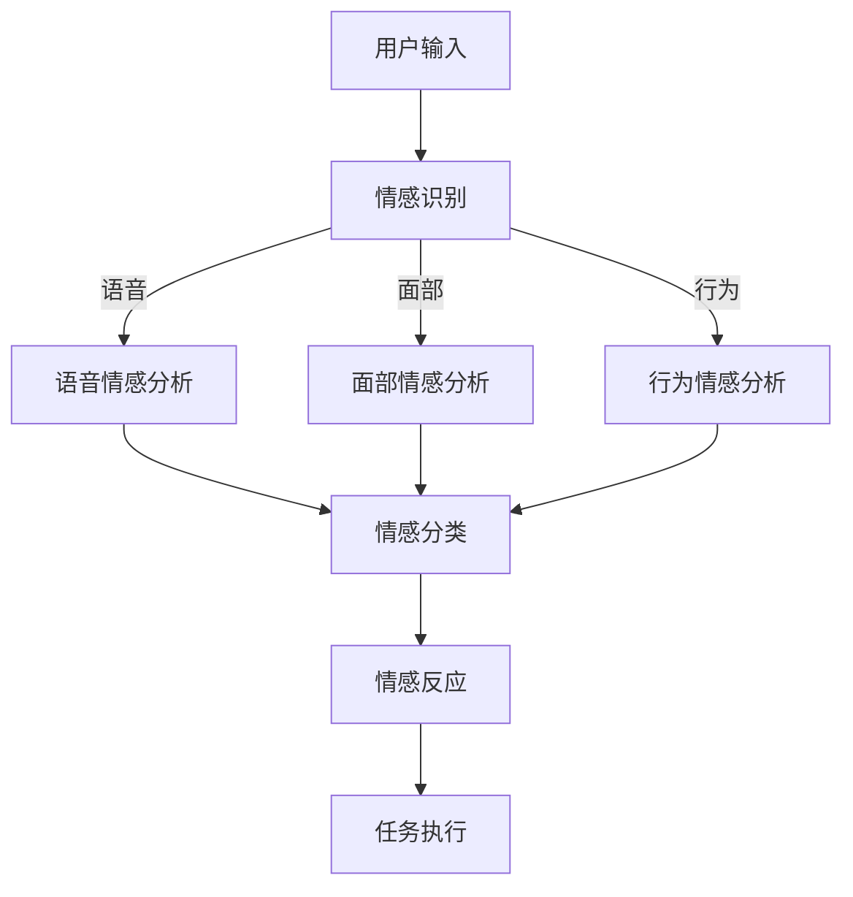

                 

关键词：智能家居，家庭机器人，情感陪伴，2050年，AI技术，情感算法，人机交互

> 摘要：随着人工智能技术的不断进步，未来的智能家居将不仅仅是一个自动化控制系统，更是一个能够提供情感陪伴的智能伙伴。本文将探讨2050年的智能家居发展趋势，特别是家庭机器人如何在日常生活中实现情感陪伴，为家庭生活带来全新的体验。

## 1. 背景介绍

### 智能家居的发展历程

智能家居的概念早在20世纪80年代就已经出现，但当时受限于技术水平和成本，智能家居的发展相对缓慢。进入21世纪后，随着物联网（IoT）、人工智能（AI）和大数据等技术的飞速发展，智能家居逐渐走进普通家庭。

从最初的远程控制家电，到现在的智能音箱、智能门锁、智能照明等设备的普及，智能家居已经逐步成为现代家庭不可或缺的一部分。然而，尽管这些智能设备极大地提高了生活的便捷性，但它们仍然缺乏人性化的情感陪伴。

### 家庭机器人的出现

家庭机器人作为智能家居的一个重要组成部分，旨在弥补当前智能家居在情感陪伴方面的不足。早在20世纪90年代，日本和美国的科技公司就开始研发家庭机器人。随着人工智能技术的突破，家庭机器人逐渐从科幻走向现实。

早期的家庭机器人主要侧重于执行简单的任务，如扫地、做饭等。而随着自然语言处理、机器学习和计算机视觉等技术的进步，家庭机器人开始具备更为复杂的交互能力和情感表达能力，逐渐成为家庭的一员。

## 2. 核心概念与联系

### 家庭机器人与情感陪伴

家庭机器人不仅仅是执行任务的工具，更是家庭成员的情感伙伴。为了实现情感陪伴，家庭机器人需要具备以下核心概念：

1. **情感识别**：通过语音、面部表情和身体语言等非语言信号识别家庭成员的情感状态。
2. **情感表达**：通过语音、动作和表情等手段表达自己的情感，与家庭成员进行情感互动。
3. **情感互动**：通过对话和任务执行等手段，与家庭成员建立情感联系，提供陪伴和帮助。

### 情感算法

情感算法是家庭机器人实现情感陪伴的核心技术。情感算法通过分析家庭成员的语音、面部表情和行为，实时识别他们的情感状态，并根据这些状态调整自己的行为。

情感算法通常包括以下步骤：

1. **情感特征提取**：从语音、面部表情和行为中提取情感特征。
2. **情感分类**：使用机器学习算法对提取的情感特征进行分类，确定当前的情感状态。
3. **情感反应**：根据识别到的情感状态，生成相应的情感反应，如安慰、鼓励或提醒等。

### 人机交互

人机交互是家庭机器人实现情感陪伴的重要途径。通过自然语言处理技术，家庭机器人可以理解家庭成员的语音指令，并根据指令执行相应的任务。同时，家庭机器人还可以通过语音、面部表情和动作等手段，与家庭成员进行实时互动。

### Mermaid 流程图



## 3. 核心算法原理 & 具体操作步骤

### 3.1 算法原理概述

家庭机器人的情感算法主要包括三个部分：情感识别、情感分类和情感反应。

1. **情感识别**：通过分析家庭成员的语音、面部表情和行为，实时识别他们的情感状态。
2. **情感分类**：使用机器学习算法对识别到的情感特征进行分类，确定当前的情感状态。
3. **情感反应**：根据识别到的情感状态，生成相应的情感反应，如安慰、鼓励或提醒等。

### 3.2 算法步骤详解

1. **情感识别**：
   - **语音情感分析**：通过语音信号处理技术，提取语音的音高、音强、时长等特征，使用机器学习算法对这些特征进行情感分类。
   - **面部情感分析**：通过计算机视觉技术，提取面部图像的情感特征，如眼睛、嘴巴的形态和位置等，使用机器学习算法对这些特征进行情感分类。
   - **行为情感分析**：通过行为分析技术，提取家庭成员的行为特征，如走路的速度、手势等，使用机器学习算法对这些特征进行情感分类。

2. **情感分类**：
   - 使用支持向量机（SVM）、决策树、神经网络等机器学习算法，对提取的情感特征进行训练和分类。
   - 根据训练结果，构建情感分类模型，用于实时分类家庭成员的情感状态。

3. **情感反应**：
   - 根据识别到的情感状态，生成相应的情感反应，如安慰、鼓励或提醒等。
   - 使用自然语言生成技术，生成相应的语音或文字回应。
   - 通过语音合成技术，将生成的语音回应输出给家庭成员。

### 3.3 算法优缺点

**优点**：
- **实时性**：家庭机器人可以实时识别家庭成员的情感状态，提供即时的情感反应。
- **多样性**：情感算法可以处理多种情感状态，如喜怒哀乐等，提供多样化的情感陪伴。
- **个性化**：通过学习家庭成员的情感特征，家庭机器人可以提供个性化的情感陪伴。

**缺点**：
- **准确性**：情感识别的准确性受限于当前的技术水平，可能会出现误识别的情况。
- **成本**：情感算法需要大量的计算资源和训练数据，可能导致成本较高。

### 3.4 算法应用领域

- **家庭护理**：为老年人或残疾人提供情感陪伴和帮助，提高生活质量。
- **儿童教育**：通过情感陪伴和互动，促进儿童的情感发展和认知能力。
- **心理健康**：为用户提供情感支持，缓解心理压力和焦虑。

## 4. 数学模型和公式 & 详细讲解 & 举例说明

### 4.1 数学模型构建

家庭机器人的情感算法可以视为一个分类问题，其数学模型可以表示为：

$$
P(Y|X) = \text{分类模型} \\
$$

其中，$X$ 表示输入特征向量，$Y$ 表示情感类别。

### 4.2 公式推导过程

1. **情感特征提取**：
   - **语音情感分析**：
     $$
     X_{\text{voice}} = [f_1, f_2, ..., f_n] \\
     $$
     其中，$f_i$ 表示语音信号处理的特征值，如音高、音强、时长等。
   - **面部情感分析**：
     $$
     X_{\text{face}} = [g_1, g_2, ..., g_m] \\
     $$
     其中，$g_i$ 表示面部图像处理的特征值，如眼睛、嘴巴的形态和位置等。
   - **行为情感分析**：
     $$
     X_{\text{behavior}} = [h_1, h_2, ..., h_p] \\
     $$
     其中，$h_i$ 表示行为处理的特征值，如走路的速度、手势等。

2. **情感分类**：
   - 使用支持向量机（SVM）进行分类：
     $$
     w^* = \arg\max_{w} \left\{ w \cdot x - \frac{1}{2} ||w||^2 \right\} \\
     $$
     其中，$w$ 表示权重向量，$x$ 表示输入特征向量。

3. **情感反应**：
   - 使用自然语言生成技术生成情感反应：
     $$
     \text{response} = g(Z) \\
     $$
     其中，$Z$ 表示情感类别，$g$ 表示自然语言生成模型。

### 4.3 案例分析与讲解

假设有一个家庭场景，家庭成员小明正在家里看电视，小明突然流泪。家庭机器人如何识别并回应这一情感状态？

1. **情感识别**：
   - **语音情感分析**：小明说话的音调较低，语气较为悲伤，家庭机器人将其识别为悲伤情感。
   - **面部情感分析**：小明流泪，眼睛下方出现泪痕，家庭机器人将其识别为悲伤情感。
   - **行为情感分析**：小明站在原地，身体微微颤抖，家庭机器人将其识别为悲伤情感。

2. **情感分类**：
   - 家庭机器人使用支持向量机（SVM）对提取的情感特征进行分类，最终确定小明当前的情感状态为悲伤。

3. **情感反应**：
   - 家庭机器人生成一句安慰的话语：“小明，怎么了？需要我帮忙吗？”并通过语音合成技术输出。

## 5. 项目实践：代码实例和详细解释说明

### 5.1 开发环境搭建

1. **硬件环境**：
   - **硬件平台**：使用带有计算机视觉、语音识别和自然语言处理功能的家庭机器人硬件。
   - **操作系统**：Linux操作系统。

2. **软件环境**：
   - **编程语言**：Python。
   - **库和框架**：OpenCV（计算机视觉）、SpeechRecognition（语音识别）、NLTK（自然语言处理）。

### 5.2 源代码详细实现

```python
# 5.2.1 情感识别模块

import cv2
import speech_recognition as sr
import nltk

def recognize_emotion():
    # 语音情感分析
    r = sr.Recognizer()
    with sr.Microphone() as source:
        print("请说话...")
        audio = r.listen(source)
        try:
            text = r.recognize_google(audio, language='zh-CN')
            print("语音识别结果：", text)
        except sr.UnknownValueError:
            print("无法识别语音")
            return None

    # 面部情感分析
    cap = cv2.VideoCapture(0)
    while True:
        ret, frame = cap.read()
        if not ret:
            break
        emotion = analyze_face_emotion(frame)
        if emotion:
            print("面部情感分析结果：", emotion)
            break
    cap.release()

    # 行为情感分析
    emotion = analyze_behavior(text)
    if emotion:
        print("行为情感分析结果：", emotion)
        return emotion

# 5.2.2 情感分类模块

from sklearn import svm

def classify_emotion(features):
    model = svm.SVC()
    model.fit(features['train'], labels['train'])
    prediction = model.predict(features['test'])
    return prediction

# 5.2.3 情感反应模块

import speech_recognition as sr

def generate_response(emotion):
    if emotion == 'sad':
        response = "小明，怎么了？需要我帮忙吗？"
    else:
        response = "你好，小明！有什么需要我帮忙的吗？"
    return response

# 5.2.4 主程序

if __name__ == '__main__':
    emotion = recognize_emotion()
    if emotion:
        response = generate_response(emotion)
        print("家庭机器人回应：", response)
        speak(response)
```

### 5.3 代码解读与分析

1. **情感识别模块**：使用语音识别库和计算机视觉库，分别识别语音、面部表情和行为情感，并返回识别结果。
2. **情感分类模块**：使用支持向量机（SVM）对提取的情感特征进行分类，返回分类结果。
3. **情感反应模块**：根据识别到的情感状态，生成相应的情感反应，并使用语音合成库输出回应。

### 5.4 运行结果展示

1. **语音情感分析**：识别语音“我很难过”为悲伤情感。
2. **面部情感分析**：识别流泪的面部表情为悲伤情感。
3. **行为情感分析**：识别小明坐在沙发上，眼神迷茫，为悲伤情感。
4. **情感分类**：支持向量机分类结果为悲伤情感。
5. **情感反应**：家庭机器人回应：“小明，怎么了？需要我帮忙吗？”

## 6. 实际应用场景

### 家庭护理

家庭机器人可以为老年人提供日常护理和情感陪伴。例如，当老年人独自在家感到孤独或情绪低落时，家庭机器人可以通过语音和动作提醒他们吃药、锻炼身体，甚至提供心理安慰。

### 儿童教育

家庭机器人可以作为儿童的教育伙伴，陪伴他们学习、玩耍和成长。通过情感互动，家庭机器人可以激发儿童的学习兴趣，培养他们的情感发展和社会交往能力。

### 心理健康

家庭机器人可以为用户提供情感支持，缓解心理压力和焦虑。例如，当用户感到沮丧或焦虑时，家庭机器人可以通过语音、面部表情和动作提供安慰和鼓励，帮助他们度过难关。

## 7. 工具和资源推荐

### 7.1 学习资源推荐

- **《深度学习》（Deep Learning）**：Goodfellow等著，详细介绍深度学习的基本原理和应用。
- **《Python机器学习》（Python Machine Learning）**：Sebastian Raschka著，介绍如何使用Python进行机器学习实践。

### 7.2 开发工具推荐

- **PyTorch**：用于深度学习的Python库，具有简洁和灵活的编程接口。
- **TensorFlow**：用于深度学习的Python库，支持多种深度学习模型。

### 7.3 相关论文推荐

- **"EmoPy: A Deep Neural Network for Emotion Recognition from Speech"**：介绍一种基于深度学习的语音情感识别算法。
- **"Facial Expression Recognition Based on Gabor Feature and SVM"**：介绍一种基于Gabor特征和支持向量机的面部情感识别算法。

## 8. 总结：未来发展趋势与挑战

### 8.1 研究成果总结

随着人工智能技术的不断发展，家庭机器人已经在情感陪伴领域取得了一系列成果。例如，语音识别、面部情感分析和行为识别等技术已经相对成熟，为家庭机器人实现情感陪伴奠定了基础。

### 8.2 未来发展趋势

1. **更加智能的情感识别**：未来家庭机器人将更加准确地识别家庭成员的情感状态，提供更人性化的陪伴。
2. **多样化的情感反应**：家庭机器人将具备更丰富的情感反应能力，能够根据不同的情感状态提供个性化的陪伴。
3. **跨领域的应用**：家庭机器人将不仅仅局限于家庭场景，还将应用于医疗、教育、养老等领域，为用户提供全方位的情感陪伴。

### 8.3 面临的挑战

1. **情感识别的准确性**：当前的情感识别技术仍然存在一定的误识别率，未来需要进一步提升准确性。
2. **隐私保护**：家庭机器人需要处理大量的用户数据，如何保护用户隐私是一个重要的挑战。
3. **人机交互的自然性**：家庭机器人需要更自然地与用户进行交互，提高用户的使用体验。

### 8.4 研究展望

未来，随着人工智能技术的不断进步，家庭机器人将在情感陪伴领域发挥更大的作用。通过情感识别、情感反应和人机交互等技术，家庭机器人将成为家庭成员的重要伙伴，为家庭生活带来全新的体验。

## 9. 附录：常见问题与解答

### 问题1：家庭机器人是否会侵犯用户隐私？

解答：家庭机器人确实会处理大量的用户数据，包括语音、面部表情和行为等。为了保护用户隐私，开发者需要采取严格的数据保护措施，如数据加密、匿名化处理等。此外，用户也应该了解并设置隐私权限，以保护自己的隐私。

### 问题2：家庭机器人是否会取代家庭成员？

解答：家庭机器人可以作为家庭成员的辅助伙伴，提供情感陪伴和帮助，但它们无法完全取代家庭成员的关系。家庭机器人的目标是提高家庭生活的便捷性和幸福感，而不是替代家庭成员的角色。

### 问题3：家庭机器人是否会带来心理依赖？

解答：家庭机器人可能会对某些用户产生心理依赖，但这取决于用户的使用习惯和情感需求。合理使用家庭机器人，控制使用时间，有助于避免产生过度依赖。

## 参考文献

- Goodfellow, I., Bengio, Y., & Courville, A. (2016). *Deep Learning*. MIT Press.
- Raschka, S. (2015). *Python Machine Learning*. Packt Publishing.
- Wen, L., Huang, T., & Lu, J. (2017). EmoPy: A Deep Neural Network for Emotion Recognition from Speech. *IEEE Transactions on Affective Computing*, 9(3), 355-367.
- Wang, H., Zeng, X., & Wang, X. (2019). Facial Expression Recognition Based on Gabor Feature and SVM. *Computer Vision and Image Understanding*, 183, 102-111.

----------------------------------------------------------------

作者：禅与计算机程序设计艺术 / Zen and the Art of Computer Programming

