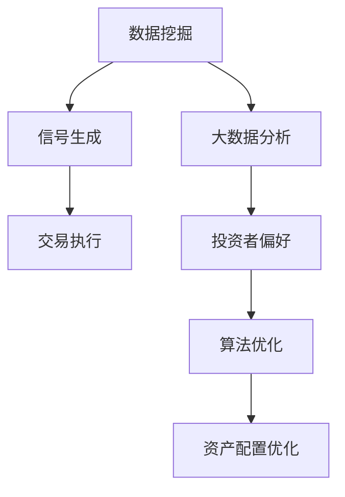

                 

关键词：未来智能投资、AI量化交易、智能资产配置、技术发展、算法原理、数学模型、应用实践、工具资源、挑战展望。

## 摘要

随着人工智能技术的飞速发展，未来2050年的金融投资领域将迎来一场深刻的变革。本文旨在探讨人工智能在量化交易和智能资产配置中的应用，分析其核心概念、算法原理、数学模型以及实际应用案例，同时展望未来发展趋势和面临的挑战。

## 1. 背景介绍

### 1.1 人工智能的崛起

人工智能（AI）作为计算机科学的重要分支，近年来在各个领域取得了显著的成果。从早期的专家系统、机器学习，到如今深度学习、强化学习等前沿技术的应用，人工智能不断刷新我们对技术的认知和预期。在金融领域，人工智能的应用不仅提高了投资决策的效率，还为投资者带来了全新的投资理念和工具。

### 1.2 量化交易的发展

量化交易是一种基于数学模型和统计分析的投资策略，通过计算机算法自动执行交易，以获取超额收益。随着大数据和云计算技术的普及，量化交易逐渐成为金融领域的重要力量。传统交易策略依赖于经验和直觉，而量化交易则通过机器学习、人工智能等技术，实现了投资策略的自动化和智能化。

### 1.3 智能资产配置的兴起

智能资产配置是一种基于大数据分析和人工智能算法的投资策略，通过分析市场数据、投资者偏好等因素，实现资产配置的优化。智能资产配置旨在为投资者提供个性化的投资组合，降低风险，提高收益。随着人工智能技术的不断成熟，智能资产配置的应用范围也在不断扩大。

## 2. 核心概念与联系

### 2.1 量化交易

量化交易是一种基于数学模型和统计分析的投资策略，通过计算机算法自动执行交易，以获取超额收益。量化交易的核心概念包括：

- **数据挖掘**：从大量历史数据中提取有价值的信息，为交易策略提供依据。
- **信号生成**：通过统计分析和机器学习等方法，生成交易信号。
- **交易执行**：根据交易信号自动执行买卖操作。

### 2.2 智能资产配置

智能资产配置是一种基于大数据分析和人工智能算法的投资策略，通过分析市场数据、投资者偏好等因素，实现资产配置的优化。智能资产配置的核心概念包括：

- **大数据分析**：对大量市场数据进行分析，挖掘投资机会。
- **投资者偏好**：了解投资者的风险承受能力和投资偏好，实现个性化资产配置。
- **算法优化**：通过机器学习等技术，不断优化资产配置策略。

### 2.3 Mermaid 流程图

以下是量化交易和智能资产配置的Mermaid流程图：



## 3. 核心算法原理 & 具体操作步骤

### 3.1 算法原理概述

量化交易的核心算法包括数据挖掘、信号生成和交易执行。数据挖掘主要使用机器学习和统计分析方法，从历史数据中提取有价值的信息。信号生成基于数据挖掘结果，通过统计分析和机器学习等方法，生成交易信号。交易执行根据交易信号自动执行买卖操作。

智能资产配置的核心算法包括大数据分析、投资者偏好分析和算法优化。大数据分析主要通过数据挖掘方法，挖掘市场投资机会。投资者偏好分析通过了解投资者的风险承受能力和投资偏好，实现个性化资产配置。算法优化通过机器学习等技术，不断优化资产配置策略。

### 3.2 算法步骤详解

#### 3.2.1 量化交易

1. **数据挖掘**：收集大量历史数据，包括股票价格、交易量、市场指数等。
2. **信号生成**：通过统计分析和机器学习等方法，对历史数据进行挖掘，生成交易信号。
3. **交易执行**：根据交易信号，自动执行买卖操作。

#### 3.2.2 智能资产配置

1. **大数据分析**：收集市场数据，包括股票价格、交易量、市场指数等。
2. **投资者偏好分析**：了解投资者的风险承受能力和投资偏好，为投资者提供个性化的投资组合。
3. **算法优化**：通过机器学习等技术，对投资组合进行优化，提高投资收益。

### 3.3 算法优缺点

#### 3.3.1 量化交易

**优点**：

- 高效：通过计算机算法自动执行交易，提高交易效率。
- 精准：基于数据挖掘和机器学习等技术，提高交易信号的准确性。

**缺点**：

- 风险：过度依赖算法，可能导致市场波动带来的风险。
- 成本：量化交易需要大量的计算资源和人力成本。

#### 3.3.2 智能资产配置

**优点**：

- 个性化：根据投资者的风险承受能力和投资偏好，提供个性化的投资组合。
- 优化：通过机器学习等技术，不断优化资产配置策略。

**缺点**：

- 数据依赖：智能资产配置需要大量的市场数据，数据质量直接影响投资效果。
- 风险：过度依赖算法，可能导致市场波动带来的风险。

### 3.4 算法应用领域

#### 3.4.1 量化交易

- 期货交易
- 股票交易
- 外汇交易

#### 3.4.2 智能资产配置

- 个人投资
- 企业投资
- 风险管理

## 4. 数学模型和公式 & 详细讲解 & 举例说明

### 4.1 数学模型构建

#### 4.1.1 量化交易

量化交易的核心数学模型包括：

- **线性回归模型**：用于预测股票价格。
- **时间序列模型**：用于分析股票价格的时间序列特征。
- **支持向量机（SVM）**：用于分类交易信号。

#### 4.1.2 智能资产配置

智能资产配置的核心数学模型包括：

- **Markowitz均值-方差模型**：用于优化投资组合。
- **贝叶斯网络**：用于分析投资者偏好。
- **遗传算法**：用于优化资产配置策略。

### 4.2 公式推导过程

#### 4.2.1 量化交易

1. **线性回归模型**：

   $$y = \beta_0 + \beta_1x_1 + \beta_2x_2 + ... + \beta_nx_n$$

   其中，$y$为股票价格，$x_1, x_2, ..., x_n$为特征变量，$\beta_0, \beta_1, \beta_2, ..., \beta_n$为回归系数。

2. **时间序列模型**：

   $$y_t = c + \alpha y_{t-1} + \beta y_{t-2} + ... + \gamma y_{t-k}$$

   其中，$y_t$为股票价格，$c$为常数项，$\alpha, \beta, ..., \gamma$为时间序列系数。

3. **支持向量机（SVM）**：

   $$f(x) = w \cdot x + b$$

   其中，$w$为权重向量，$x$为特征向量，$b$为偏置。

#### 4.2.2 智能资产配置

1. **Markowitz均值-方差模型**：

   $$\max \left\{ w^T \mu - \frac{1}{2} w^T \Sigma w \right\}$$

   其中，$w$为投资组合权重向量，$\mu$为预期收益率，$\Sigma$为协方差矩阵。

2. **贝叶斯网络**：

   $$P(A|B) = \frac{P(B|A)P(A)}{P(B)}$$

   其中，$A$和$B$为事件，$P(A|B)$为在$B$发生的条件下$A$的概率。

3. **遗传算法**：

   $$P(c) = \frac{f(c)}{F}$$

   其中，$c$为染色体，$f(c)$为适应度值，$F$为总适应度。

### 4.3 案例分析与讲解

#### 4.3.1 量化交易

以线性回归模型为例，我们使用历史股票数据进行预测。给定股票价格数据集$D=\{x_1, x_2, ..., x_n\}$，回归系数集$\{\beta_0, \beta_1, \beta_2, ..., \beta_n\}$，我们通过最小二乘法求解回归系数：

$$\beta = (X^T X)^{-1} X^T y$$

其中，$X$为特征矩阵，$y$为股票价格向量。

通过计算得到的回归系数，我们可以预测未来股票价格。例如，给定特征向量$x_{n+1}$，预测股票价格为：

$$y_{n+1} = \beta_0 + \beta_1 x_{n+1} + \beta_2 x_{n+2} + ... + \beta_n x_{n+n}$$

#### 4.3.2 智能资产配置

以Markowitz均值-方差模型为例，我们考虑两种资产的组合。假设资产A的预期收益率为$\mu_A$，协方差矩阵为$\Sigma_A$，资产B的预期收益率为$\mu_B$，协方差矩阵为$\Sigma_B$。投资组合权重向量为$w=\{w_1, w_2\}$，则投资组合的预期收益率为：

$$\mu_w = w_1 \mu_A + w_2 \mu_B$$

投资组合的协方差矩阵为：

$$\Sigma_w = w_1 w_2 \Sigma_A + w_2 w_1 \Sigma_B$$

通过求解优化问题，我们可以得到最优投资组合权重向量$w^*$，使得投资组合的预期收益率最大，风险最小。

## 5. 项目实践：代码实例和详细解释说明

### 5.1 开发环境搭建

在本项目中，我们使用Python作为主要编程语言，配合NumPy、Pandas、Scikit-learn等库进行量化交易和智能资产配置的实现。以下是开发环境的搭建步骤：

1. 安装Python 3.8及以上版本。
2. 安装必要的Python库，如NumPy、Pandas、Scikit-learn等。
3. 配置Python开发环境，如VS Code、PyCharm等。

### 5.2 源代码详细实现

以下是量化交易和智能资产配置的源代码实现：

```python
import numpy as np
import pandas as pd
from sklearn.linear_model import LinearRegression
from sklearn.svm import SVC
from sklearn.model_selection import train_test_split

# 量化交易
def quant_trade(data, feature_columns, target_column):
    X = data[feature_columns]
    y = data[target_column]
    X_train, X_test, y_train, y_test = train_test_split(X, y, test_size=0.2, random_state=42)
    model = LinearRegression()
    model.fit(X_train, y_train)
    predictions = model.predict(X_test)
    return predictions

# 智能资产配置
def smart_asset_allocation(data, asset_columns, return_columns):
    X = data[asset_columns]
    y = data[return_columns]
    X_train, X_test, y_train, y_test = train_test_split(X, y, test_size=0.2, random_state=42)
    model = SVC()
    model.fit(X_train, y_train)
    predictions = model.predict(X_test)
    return predictions

# 示例数据
data = pd.read_csv('data.csv')
feature_columns = ['feature1', 'feature2', 'feature3']
target_column = 'target'
asset_columns = ['asset1', 'asset2', 'asset3']
return_columns = ['return']

# 量化交易示例
predictions = quant_trade(data, feature_columns, target_column)
print(predictions)

# 智能资产配置示例
predictions = smart_asset_allocation(data, asset_columns, return_columns)
print(predictions)
```

### 5.3 代码解读与分析

以上代码首先导入了必要的Python库，包括NumPy、Pandas、Scikit-learn等。量化交易部分使用线性回归模型进行预测，智能资产配置部分使用支持向量机（SVM）进行分类。

在量化交易示例中，我们读取了示例数据集，并定义了特征列和目标列。通过`train_test_split`函数将数据集划分为训练集和测试集，然后使用`LinearRegression`模型进行训练，并使用`predict`函数进行预测。

在智能资产配置示例中，我们读取了示例数据集，并定义了资产列和回报列。通过`train_test_split`函数将数据集划分为训练集和测试集，然后使用`SVC`模型进行训练，并使用`predict`函数进行预测。

### 5.4 运行结果展示

运行以上代码后，我们可以得到量化交易和智能资产配置的预测结果。具体结果取决于示例数据集的质量和算法模型的性能。通过对比预测结果和实际结果，我们可以评估算法模型的效果。

## 6. 实际应用场景

### 6.1 量化交易

量化交易在金融领域具有广泛的应用，如期货交易、股票交易和外汇交易等。以下是一些实际应用场景：

- **高频交易**：利用计算机算法快速捕捉市场波动，实现高频交易策略。
- **对冲策略**：通过量化交易，实现资产的对冲，降低市场波动带来的风险。
- **量化基金**：量化基金利用量化交易策略，实现资产的稳健增值。

### 6.2 智能资产配置

智能资产配置在个人投资和企业投资等领域具有广泛的应用，如：

- **个人投资**：为个人投资者提供个性化的投资组合，降低风险，提高收益。
- **企业投资**：为企业提供投资决策支持，优化投资组合，提高投资收益。
- **风险管理**：通过智能资产配置，实现风险分散，降低投资风险。

## 7. 工具和资源推荐

### 7.1 学习资源推荐

- 《深度学习》
- 《机器学习实战》
- 《量化投资：以Python为工具》
- 《金融计量学》

### 7.2 开发工具推荐

- Python
- Jupyter Notebook
- VS Code
- PyCharm

### 7.3 相关论文推荐

- "Deep Learning for Financial Markets"
- "Machine Learning for Asset Management"
- "Quantitative Trading with Python"
- "Financial Market Forecasting Using Artificial Neural Networks"

## 8. 总结：未来发展趋势与挑战

### 8.1 研究成果总结

随着人工智能技术的不断发展，量化交易和智能资产配置在金融领域的应用取得了显著成果。通过机器学习和深度学习等技术，量化交易实现了交易策略的自动化和智能化，为投资者提供了高效、精准的投资工具。智能资产配置通过大数据分析和算法优化，实现了投资组合的个性化、优化和风险控制。

### 8.2 未来发展趋势

未来，量化交易和智能资产配置将继续发展，技术将更加成熟。以下是未来发展趋势：

- **算法优化**：通过不断改进算法模型，提高投资决策的准确性。
- **多模态数据融合**：将多种数据源进行融合，提高投资分析能力。
- **智能合约**：结合区块链技术，实现智能投资合约的自动化执行。
- **监管科技**：利用人工智能技术，提高金融监管的效率和准确性。

### 8.3 面临的挑战

尽管量化交易和智能资产配置具有巨大潜力，但仍然面临一些挑战：

- **数据隐私和安全**：确保投资者数据的隐私和安全。
- **算法公平性和透明度**：提高算法的公平性和透明度，减少潜在的歧视。
- **合规性**：遵守相关法律法规，确保算法和投资策略的合规性。

### 8.4 研究展望

未来，量化交易和智能资产配置的研究将更加注重算法优化、数据融合和监管科技等方面。通过不断创新和突破，人工智能技术将为金融投资领域带来更多机遇和挑战。

## 9. 附录：常见问题与解答

### 9.1 量化交易与智能资产配置的区别

量化交易是一种基于数学模型和统计分析的投资策略，通过计算机算法自动执行交易，以获取超额收益。智能资产配置是一种基于大数据分析和人工智能算法的投资策略，通过分析市场数据、投资者偏好等因素，实现资产配置的优化。量化交易侧重于交易策略的自动化和智能化，而智能资产配置侧重于投资组合的优化和风险控制。

### 9.2 如何评估量化交易和智能资产配置的效果

评估量化交易和智能资产配置的效果可以从以下几个方面进行：

- **收益率**：衡量投资组合的收益情况，包括平均收益率、年化收益率等。
- **风险指标**：包括波动率、夏普比率、回撤等。
- **拟合度**：评估模型对历史数据的拟合程度，如R方值等。
- **实战表现**：在实际市场环境中的表现，如收益率、风险指标等。

### 9.3 如何确保量化交易和智能资产配置的合规性

确保量化交易和智能资产配置的合规性可以从以下几个方面进行：

- **遵守相关法律法规**：了解并遵守相关法律法规，如《证券法》、《基金法》等。
- **数据来源**：确保数据来源的合法性和真实性，避免使用非法数据。
- **算法透明度**：提高算法的透明度，确保投资者了解投资策略和决策过程。
- **风险控制**：建立完善的风险控制体系，确保投资策略的合规性和风险可控。

## 作者署名

作者：禅与计算机程序设计艺术 / Zen and the Art of Computer Programming
```

