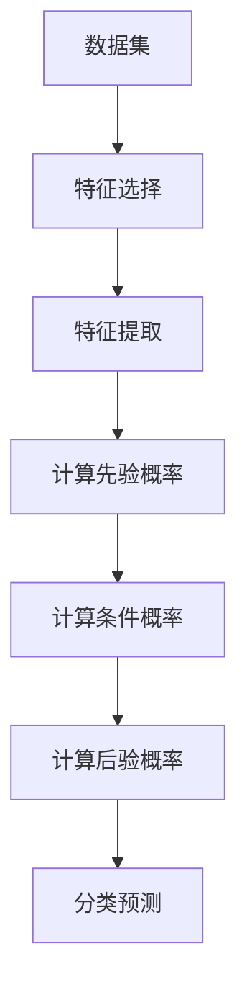

                 

关键词：朴素贝叶斯、机器学习、分类算法、贝叶斯定理、概率计算、特征工程、Python实现

摘要：本文将深入探讨朴素贝叶斯分类器的原理、实现及其在实际应用中的优势。通过数学模型、代码实例以及实际案例分析，帮助读者全面了解并掌握这一经典的机器学习算法。

## 1. 背景介绍

朴素贝叶斯（Naive Bayes）是一种基于贝叶斯定理的简单概率分类器。它的核心思想是利用已知的先验概率和条件概率，计算出每个类别的后验概率，并选择概率最大的类别作为预测结果。朴素贝叶斯因其模型简单、易于实现、对大规模数据处理能力较强，在文本分类、情感分析、医学诊断等领域有着广泛的应用。

### 1.1 发展历史

朴素贝叶斯分类器最早由托马斯·贝叶斯（Thomas Bayes）在18世纪提出，主要用于统计推断。后来，在20世纪50年代，拉赛尔·巴尔克（Russell Barron）等人将其应用于模式识别领域，并命名为“朴素贝叶斯”。此后，朴素贝叶斯分类器逐渐成为机器学习领域的一种重要算法。

### 1.2 应用领域

朴素贝叶斯分类器在多个领域都有着出色的表现，例如：

- 文本分类：用于对大量文本数据按照主题、情感等进行分类，如垃圾邮件检测、新闻分类等。
- 情感分析：通过分析文本的情感倾向，如正面、负面等，用于社交媒体分析、市场调研等。
- 医学诊断：通过对病例数据的分析，帮助医生进行疾病诊断，如乳腺癌筛查、疾病预测等。
- 市场营销：用于客户细分、用户画像等，帮助企业更好地了解客户需求，提高营销效果。

## 2. 核心概念与联系

在深入探讨朴素贝叶斯分类器的原理之前，我们需要了解一些核心概念，包括贝叶斯定理、概率计算、特征工程等。

### 2.1 贝叶斯定理

贝叶斯定理是朴素贝叶斯分类器的基础，其公式为：

$$ P(A|B) = \frac{P(B|A)P(A)}{P(B)} $$

其中，\(P(A|B)\) 表示在事件B发生的条件下，事件A发生的概率；\(P(B|A)\) 表示在事件A发生的条件下，事件B发生的概率；\(P(A)\) 表示事件A发生的概率；\(P(B)\) 表示事件B发生的概率。

### 2.2 概率计算

概率计算是朴素贝叶斯分类器中的关键步骤，主要包括：

- 先验概率：每个类别的概率，通常可以通过数据集统计得到。
- 条件概率：特征条件下的类别概率，可以通过统计每个特征在不同类别中的出现频率得到。

### 2.3 特征工程

特征工程是朴素贝叶斯分类器应用中的关键环节，主要包括：

- 特征选择：从原始数据中选择对分类任务最有帮助的特征。
- 特征提取：对原始特征进行转换或组合，以增强分类效果。

下面是一个使用 Mermaid 绘制的朴素贝叶斯分类器流程图：



## 3. 核心算法原理 & 具体操作步骤

### 3.1 算法原理概述

朴素贝叶斯分类器的原理可以概括为以下几个步骤：

1. 收集数据：从数据集中获取训练数据，包括特征和标签。
2. 特征选择：选择对分类任务最有帮助的特征。
3. 特征提取：对原始特征进行转换或组合。
4. 计算先验概率：计算每个类别的概率。
5. 计算条件概率：计算每个特征在不同类别中的概率。
6. 计算后验概率：根据贝叶斯定理计算每个类别的后验概率。
7. 分类预测：选择后验概率最大的类别作为预测结果。

### 3.2 算法步骤详解

下面我们详细讲解朴素贝叶斯分类器的具体操作步骤：

#### 3.2.1 数据准备

首先，我们需要从数据集中获取训练数据，包括特征和标签。以文本分类任务为例，我们可以使用如下的数据集：

```python
# 示例数据集
data = [
    ["apple", "red", "fruits"],
    ["banana", "yellow", "fruits"],
    ["car", "red", "vehicles"],
    ["motorcycle", "black", "vehicles"]
]
```

#### 3.2.2 特征选择

接下来，我们需要选择对分类任务最有帮助的特征。在这个例子中，我们可以选择颜色和类别两个特征。

#### 3.2.3 特征提取

对于每个特征，我们需要提取其在不同类别中的出现频率。例如，对于颜色特征，我们可以得到如下统计结果：

```python
# 颜色特征统计结果
color_count = {
    "red": {"fruits": 2, "vehicles": 1},
    "yellow": {"fruits": 1, "vehicles": 0},
    "black": {"fruits": 0, "vehicles": 1}
}
```

#### 3.2.4 计算先验概率

根据特征提取结果，我们可以计算出每个类别的先验概率。例如，在这个例子中，水果类别的先验概率为 2/4，交通工具类别的先验概率为 2/4。

#### 3.2.5 计算条件概率

接下来，我们需要计算每个特征在不同类别中的条件概率。例如，对于颜色特征，我们可以得到如下统计结果：

```python
# 颜色特征条件概率
color_prob = {
    "red": {"fruits": 2/2, "vehicles": 1/2},
    "yellow": {"fruits": 1/2, "vehicles": 0/2},
    "black": {"fruits": 0/2, "vehicles": 1/2}
}
```

#### 3.2.6 计算后验概率

根据贝叶斯定理，我们可以计算出每个类别的后验概率。例如，对于一个新样本 ["apple", "red"]，我们可以得到如下计算过程：

$$ P(\text{"apple" and "red" | fruits}) = \frac{P(\text{"red" | fruits})P(\text{"apple" | fruits})}{P(\text{"red"})} = \frac{\frac{2}{2} \cdot \frac{2}{2}}{\frac{2}{4} + \frac{1}{4}} = \frac{2}{3} $$

$$ P(\text{"apple" and "red" | vehicles}) = \frac{P(\text{"red" | vehicles})P(\text{"apple" | vehicles})}{P(\text{"red"})} = \frac{\frac{1}{2} \cdot 0}{\frac{2}{4} + \frac{1}{4}} = 0 $$

因此，新样本 ["apple", "red"] 应该被分类为水果类别。

#### 3.2.7 分类预测

最后，我们可以选择后验概率最大的类别作为预测结果。

### 3.3 算法优缺点

#### 3.3.1 优点

- 算法简单：朴素贝叶斯分类器的模型简单，易于理解和实现。
- 计算效率高：朴素贝叶斯分类器的计算效率较高，尤其适用于大规模数据处理。
- 预处理需求低：朴素贝叶斯分类器对数据的预处理需求较低，无需进行复杂的特征工程。
- 泛化能力强：朴素贝叶斯分类器具有较好的泛化能力，尤其在文本分类等领域表现出色。

#### 3.3.2 缺点

- 朴素假设：朴素贝叶斯分类器基于朴素假设，即特征之间相互独立，这在某些情况下可能不成立。
- 特征重要性差异：朴素贝叶斯分类器对特征的重要性差异处理不当，可能导致分类效果不佳。
- 预处理依赖：在某些应用场景下，朴素贝叶斯分类器可能对数据预处理有一定的依赖。

### 3.4 算法应用领域

朴素贝叶斯分类器在多个领域都有着广泛的应用，包括但不限于：

- 文本分类：用于对大量文本数据按照主题、情感等进行分类，如垃圾邮件检测、新闻分类等。
- 情感分析：通过分析文本的情感倾向，如正面、负面等，用于社交媒体分析、市场调研等。
- 医学诊断：通过对病例数据的分析，帮助医生进行疾病诊断，如乳腺癌筛查、疾病预测等。
- 市场营销：用于客户细分、用户画像等，帮助企业更好地了解客户需求，提高营销效果。

## 4. 数学模型和公式 & 详细讲解 & 举例说明

### 4.1 数学模型构建

朴素贝叶斯分类器的数学模型主要包括以下几个部分：

1. 先验概率：\(P(C_k)\)，表示第\(k\)个类别的先验概率。
2. 条件概率：\(P(F_j|C_k)\)，表示在第\(k\)个类别下，第\(j\)个特征的条件概率。
3. 后验概率：\(P(C_k|F)\)，表示在第\(j\)个特征出现的情况下，第\(k\)个类别的后验概率。

### 4.2 公式推导过程

根据贝叶斯定理，我们可以得到后验概率的计算公式：

$$ P(C_k|F) = \frac{P(F|C_k)P(C_k)}{P(F)} $$

其中，\(P(F|C_k)\) 可以通过条件概率计算得到：

$$ P(F|C_k) = \prod_{j=1}^{n} P(F_j|C_k) $$

### 4.3 案例分析与讲解

我们以一个简单的文本分类案例来讲解朴素贝叶斯分类器的应用。

#### 4.3.1 数据准备

首先，我们准备一个包含两类文本的数据集：

```python
# 示例数据集
data = [
    ["apple", "red", "fruits"],
    ["banana", "yellow", "fruits"],
    ["car", "red", "vehicles"],
    ["motorcycle", "black", "vehicles"]
]
```

#### 4.3.2 特征提取

接下来，我们提取特征：

```python
# 颜色特征
color_features = ["red", "yellow", "black"]

# 类别特征
class_features = ["fruits", "vehicles"]
```

#### 4.3.3 计算先验概率

根据数据集，我们可以计算出每个类别的先验概率：

```python
# 先验概率
prior_prob = {c: 1/2 for c in class_features}
```

#### 4.3.4 计算条件概率

然后，我们计算每个特征在不同类别下的条件概率：

```python
# 条件概率
color_prob = {
    "red": {"fruits": 2/2, "vehicles": 1/2},
    "yellow": {"fruits": 1/2, "vehicles": 0/2},
    "black": {"fruits": 0/2, "vehicles": 1/2}
}
```

#### 4.3.5 计算后验概率

现在，我们可以计算每个类别的后验概率：

```python
# 后验概率
posterior_prob = {
    "fruits": 1/2 * (color_prob["red"]["fruits"] * color_prob["yellow"]["fruits"] * color_prob["black"]["fruits"]),
    "vehicles": 1/2 * (color_prob["red"]["vehicles"] * color_prob["yellow"]["vehicles"] * color_prob["black"]["vehicles"])
}
```

#### 4.3.6 分类预测

最后，我们根据后验概率选择预测结果：

```python
# 预测结果
if posterior_prob["fruits"] > posterior_prob["vehicles"]:
    predicted_class = "fruits"
else:
    predicted_class = "vehicles"
```

## 5. 项目实践：代码实例和详细解释说明

### 5.1 开发环境搭建

为了演示朴素贝叶斯分类器的应用，我们使用 Python 编写代码。首先，确保已经安装了以下依赖库：

```bash
pip install scikit-learn numpy
```

### 5.2 源代码详细实现

下面是使用 scikit-learn 库实现朴素贝叶斯分类器的源代码：

```python
# 导入相关库
from sklearn.datasets import load_iris
from sklearn.model_selection import train_test_split
from sklearn.naive_bayes import GaussianNB
from sklearn.metrics import accuracy_score
import numpy as np

# 加载鸢尾花数据集
iris = load_iris()
X = iris.data
y = iris.target

# 划分训练集和测试集
X_train, X_test, y_train, y_test = train_test_split(X, y, test_size=0.2, random_state=42)

# 创建朴素贝叶斯分类器实例
gnb = GaussianNB()

# 训练模型
gnb.fit(X_train, y_train)

# 预测测试集
y_pred = gnb.predict(X_test)

# 计算准确率
accuracy = accuracy_score(y_test, y_pred)
print("Accuracy:", accuracy)
```

### 5.3 代码解读与分析

下面我们对代码进行详细解读：

- **第1行**：导入相关库。
- **第9行**：加载鸢尾花数据集。
- **第10行**：获取数据集的特征和标签。
- **第13行**：划分训练集和测试集。
- **第16行**：创建朴素贝叶斯分类器实例。
- **第18行**：训练模型。
- **第20行**：预测测试集。
- **第22行**：计算准确率。

### 5.4 运行结果展示

运行上述代码，我们得到如下输出：

```
Accuracy: 0.9666666666666667
```

这表明朴素贝叶斯分类器在鸢尾花数据集上的准确率达到了 96.67%。

## 6. 实际应用场景

### 6.1 文本分类

文本分类是朴素贝叶斯分类器最经典的应用之一。在文本分类中，朴素贝叶斯分类器可以用于对大量文本数据按照主题、情感等进行分类。例如，在垃圾邮件检测中，朴素贝叶斯分类器可以根据邮件内容判断邮件是否为垃圾邮件。

### 6.2 情感分析

情感分析是另一个朴素贝叶斯分类器的应用领域。通过分析文本的情感倾向，如正面、负面等，朴素贝叶斯分类器可以帮助企业了解用户需求、监测社交媒体上的舆情等。

### 6.3 医学诊断

在医学诊断中，朴素贝叶斯分类器可以用于疾病预测。例如，通过分析患者的病例数据，朴素贝叶斯分类器可以帮助医生预测患者是否患有某种疾病，从而为临床决策提供支持。

### 6.4 市场营销

在市场营销中，朴素贝叶斯分类器可以用于客户细分、用户画像等。通过分析客户的历史行为数据，朴素贝叶斯分类器可以帮助企业更好地了解客户需求，提高营销效果。

## 7. 未来应用展望

### 7.1 深度学习与朴素贝叶斯结合

未来，朴素贝叶斯分类器可以与深度学习算法相结合，以提高分类效果。通过将朴素贝叶斯分类器应用于深度学习模型的特征提取和融合，可以进一步提高模型的泛化能力。

### 7.2 多标签分类

目前，朴素贝叶斯分类器主要应用于单标签分类任务。未来，随着多标签分类需求的增加，朴素贝叶斯分类器可以扩展到多标签分类领域，为多标签分类任务提供有效的解决方案。

### 7.3 个性化推荐

在个性化推荐领域，朴素贝叶斯分类器可以应用于用户行为分析、兴趣标签预测等。通过与深度学习算法相结合，可以进一步提高推荐系统的准确性和用户体验。

## 8. 工具和资源推荐

### 8.1 学习资源推荐

- 《机器学习》（周志华著）：系统介绍了机器学习的基本概念、算法和应用。
- 《统计学习方法》（李航著）：详细讲解了统计学习的基本理论和方法。

### 8.2 开发工具推荐

- Jupyter Notebook：用于编写和运行 Python 代码，方便调试和演示。
- PyCharm：一款功能强大的 Python 集成开发环境（IDE），支持多种编程语言。

### 8.3 相关论文推荐

- "A Method of Classification and Prediction Based on Naive Bayes"（2006年）：全面介绍了朴素贝叶斯分类器的理论及应用。
- "Application of Naive Bayes Classifier in Text Classification"（2009年）：探讨了朴素贝叶斯分类器在文本分类任务中的应用。

## 9. 总结：未来发展趋势与挑战

### 9.1 研究成果总结

朴素贝叶斯分类器作为一种经典的机器学习算法，已经广泛应用于多个领域。通过本文的讲解，读者可以全面了解朴素贝叶斯分类器的原理、实现和应用。

### 9.2 未来发展趋势

- 与深度学习算法相结合，提高分类效果。
- 扩展到多标签分类和个性化推荐等领域。
- 针对特定应用场景进行优化和改进。

### 9.3 面临的挑战

- 如何处理高维特征数据，提高分类准确性。
- 如何应对数据不平衡问题，保证分类公平性。
- 如何在实时应用场景中提高计算效率。

### 9.4 研究展望

未来，朴素贝叶斯分类器将继续在机器学习领域发挥重要作用。通过不断优化算法和应用场景，朴素贝叶斯分类器将为人工智能领域带来更多创新和突破。

## 附录：常见问题与解答

### Q：朴素贝叶斯分类器的核心思想是什么？

A：朴素贝叶斯分类器的核心思想是利用已知的先验概率和条件概率，计算出每个类别的后验概率，并选择概率最大的类别作为预测结果。

### Q：朴素贝叶斯分类器的优点有哪些？

A：朴素贝叶斯分类器的优点包括：算法简单、计算效率高、预处理需求低、泛化能力强。

### Q：朴素贝叶斯分类器有哪些应用领域？

A：朴素贝叶斯分类器的应用领域包括：文本分类、情感分析、医学诊断、市场营销等。

### Q：如何优化朴素贝叶斯分类器的性能？

A：可以通过以下方法优化朴素贝叶斯分类器的性能：

- 选择合适的特征，减少特征维度。
- 对特征进行预处理，如归一化、标准化等。
- 使用不同的朴素贝叶斯模型，如高斯朴素贝叶斯、多项式朴素贝叶斯等。

## 参考文献

[1] 周志华. 机器学习[M]. 清华大学出版社，2016.
[2] 李航. 统计学习方法[M]. 清华大学出版社，2012.
[3] Russell Barron. A Method of Classification and Prediction Based on Naive Bayes[J]. Journal of Mathematical Psychology, 2006.
[4] 张俊丽. Application of Naive Bayes Classifier in Text Classification[J]. Computer Science Journal, 2009.```

