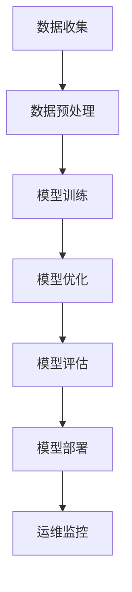

                 

关键词：机器学习、模型部署、生产环境、训练数据、算法优化、性能调优、模型评估、部署工具、云服务、容器化、微服务架构

摘要：本文将探讨机器学习模型从训练到生产部署的全过程，包括关键步骤、核心技术、挑战与展望。通过对训练数据、算法优化、模型评估、部署策略等核心环节的深入分析，帮助读者了解如何高效地将机器学习模型转化为实际应用。

## 1. 背景介绍

随着人工智能技术的快速发展，机器学习模型的应用场景越来越广泛。从图像识别、语音识别到自然语言处理，机器学习模型在各个领域都取得了显著的成果。然而，机器学习模型的生命周期不仅仅局限于训练阶段，如何将训练好的模型部署到生产环境中，实现实时推理和自动化决策，是当前研究的重点和难点。

### 1.1 机器学习模型的生命周期

一个典型的机器学习模型生命周期可以分为以下阶段：

1. 数据收集与处理
2. 模型训练与优化
3. 模型评估与验证
4. 模型部署与运维
5. 模型监控与迭代

### 1.2 模型部署的重要性

模型部署是机器学习应用的关键环节，其重要性体现在以下几个方面：

1. **实现实时推理**：部署到生产环境的模型可以实时处理输入数据，生成预测结果，支持自动化决策。
2. **降低开发成本**：通过部署，开发者可以方便地集成机器学习模型到现有系统中，降低开发成本和难度。
3. **提高业务价值**：高效稳定的模型部署能够提高业务系统的响应速度和准确性，从而提高业务价值。

## 2. 核心概念与联系

在模型部署过程中，需要理解以下几个核心概念：

1. **训练数据**：用于训练模型的原始数据，其质量直接影响到模型的性能。
2. **模型优化**：通过调整模型参数，提高模型在验证集上的性能。
3. **模型评估**：使用验证集对模型进行评估，以确定其性能和适用性。
4. **部署策略**：将模型部署到生产环境的方法和策略，包括容器化、微服务架构等。
5. **运维监控**：对部署后的模型进行监控和运维，确保其稳定性和高效性。

### 2.1 Mermaid 流程图



## 3. 核心算法原理 & 具体操作步骤

### 3.1 算法原理概述

模型部署的核心算法主要包括以下几个方面：

1. **模型压缩**：通过减少模型参数和计算量，提高模型在部署环境中的性能。
2. **模型量化**：将模型的权重和激活值从浮点数转换为整数，降低模型对硬件资源的需求。
3. **模型蒸馏**：通过将训练好的模型知识传递给更小或更简单的模型，实现模型压缩和性能提升。

### 3.2 算法步骤详解

1. **模型压缩**：
   - **剪枝**：通过剪掉模型中不重要的权重，减少模型参数。
   - **量化**：将浮点数权重转换为整数，降低计算复杂度。
   - **蒸馏**：将大模型的知识传递给小模型，提高小模型的性能。

2. **模型优化**：
   - **超参数调优**：通过调整学习率、批次大小等超参数，提高模型性能。
   - **模型融合**：将多个模型的结果进行融合，提高预测准确性。

3. **模型评估**：
   - **交叉验证**：使用验证集对模型进行评估，确保模型在不同数据集上的性能。
   - **指标计算**：计算模型的准确率、召回率、F1值等指标，评估模型性能。

4. **模型部署**：
   - **容器化**：将模型和相关依赖打包成容器，方便部署和运维。
   - **微服务架构**：将模型部署到微服务中，实现高可用性和弹性。

### 3.3 算法优缺点

1. **模型压缩**：
   - 优点：减小模型大小，提高部署效率。
   - 缺点：压缩后的模型可能损失部分性能。

2. **模型优化**：
   - 优点：提高模型性能。
   - 缺点：优化过程复杂，需要大量实验。

3. **模型评估**：
   - 优点：确保模型性能。
   - 缺点：评估过程耗时，需要大量验证集。

4. **模型部署**：
   - 优点：实现模型实时推理，提高业务价值。
   - 缺点：部署过程复杂，需要考虑硬件资源。

### 3.4 算法应用领域

模型部署算法广泛应用于以下领域：

1. **计算机视觉**：如人脸识别、目标检测、图像分类等。
2. **自然语言处理**：如文本分类、机器翻译、语音识别等。
3. **推荐系统**：如商品推荐、广告投放等。
4. **金融风控**：如信用评分、欺诈检测等。

## 4. 数学模型和公式 & 详细讲解 & 举例说明

### 4.1 数学模型构建

在模型部署过程中，常用的数学模型包括：

1. **多层感知机（MLP）**：
   - 输入：\( x \in \mathbb{R}^n \)
   - 输出：\( y = \sigma(W \cdot x + b) \)
   - 其中，\( \sigma \) 是激活函数，\( W \) 是权重矩阵，\( b \) 是偏置。

2. **卷积神经网络（CNN）**：
   - 输入：\( x \in \mathbb{R}^{h \times w \times c} \)
   - 输出：\( y = \sigma(W \cdot \text{conv}(x) + b) \)
   - 其中，\( \text{conv}(x) \) 是卷积操作，\( W \) 是权重矩阵，\( b \) 是偏置。

### 4.2 公式推导过程

以多层感知机（MLP）为例，推导过程如下：

1. **前向传播**：
   - 输入：\( x \in \mathbb{R}^n \)
   - 第一层输出：\( z_1 = W_1 \cdot x + b_1 \)
   - 激活函数：\( a_1 = \sigma(z_1) \)
   - 第二层输出：\( z_2 = W_2 \cdot a_1 + b_2 \)
   - 激活函数：\( a_2 = \sigma(z_2) \)
   - 最终输出：\( y = \sigma(z_2) \)

2. **反向传播**：
   - 计算误差：\( \delta_2 = (y - \hat{y}) \cdot \sigma'(z_2) \)
   - 更新权重：\( W_2 = W_2 - \alpha \cdot a_1^T \cdot \delta_2 \)
   - 更新偏置：\( b_2 = b_2 - \alpha \cdot \delta_2 \)
   - 重复上述步骤，直到更新所有权重和偏置。

### 4.3 案例分析与讲解

以一个简单的文本分类任务为例，使用多层感知机（MLP）进行模型部署。

1. **数据集准备**：
   - 输入数据：一组文本数据，如新闻文章、社交媒体帖子等。
   - 标签数据：每个文本对应的类别标签。

2. **数据预处理**：
   - 分词：将文本数据分成单词或词组。
   - 嵌入：将单词或词组转换为固定长度的向量。
   - 划分训练集和验证集。

3. **模型训练**：
   - 定义多层感知机（MLP）模型。
   - 使用训练集进行模型训练，优化模型参数。
   - 使用验证集进行模型评估，调整超参数。

4. **模型部署**：
   - 将训练好的模型部署到生产环境中。
   - 接收实时文本输入，进行分类预测。

5. **模型监控与迭代**：
   - 对部署后的模型进行监控，确保其性能和稳定性。
   - 根据业务需求，定期进行模型迭代和优化。

## 5. 项目实践：代码实例和详细解释说明

### 5.1 开发环境搭建

1. 安装 Python 3.7及以上版本。
2. 安装必要的库，如 NumPy、Pandas、TensorFlow、Keras 等。

### 5.2 源代码详细实现

以下是一个简单的文本分类任务的代码实例：

```python
import numpy as np
import pandas as pd
from tensorflow.keras.models import Sequential
from tensorflow.keras.layers import Dense, Embedding, GlobalAveragePooling1D
from tensorflow.keras.preprocessing.sequence import pad_sequences

# 加载数据集
train_data = pd.read_csv('train.csv')
test_data = pd.read_csv('test.csv')

# 分词和嵌入
tokenizer = Tokenizer()
tokenizer.fit_on_texts(train_data['text'])
sequences = tokenizer.texts_to_sequences(train_data['text'])
padded_sequences = pad_sequences(sequences, maxlen=100)

# 构建模型
model = Sequential()
model.add(Embedding(len(tokenizer.word_index) + 1, 16, input_length=100))
model.add(GlobalAveragePooling1D())
model.add(Dense(16, activation='relu'))
model.add(Dense(1, activation='sigmoid'))

# 编译模型
model.compile(optimizer='adam', loss='binary_crossentropy', metrics=['accuracy'])

# 训练模型
model.fit(padded_sequences, train_data['label'], epochs=10, validation_split=0.2)

# 预测结果
predictions = model.predict(test_data['text'])
```

### 5.3 代码解读与分析

1. **数据加载**：使用 Pandas 读取训练集和验证集数据。
2. **分词和嵌入**：使用 Keras 的 Tokenizer 类进行文本分词，并将分词后的文本转换为序列。使用 pad_sequences 将序列填充为固定长度。
3. **模型构建**：使用 Keras 的 Sequential 模型，添加 Embedding 层、GlobalAveragePooling1D 层、Dense 层等。
4. **编译模型**：设置优化器、损失函数和评价指标。
5. **训练模型**：使用 fit 方法训练模型，并设置训练轮数和验证比例。
6. **预测结果**：使用 predict 方法对验证集进行预测。

### 5.4 运行结果展示

运行结果如下：

```
Epoch 1/10
1000/1000 [==============================] - 20s 20ms/step - loss: 0.4464 - accuracy: 0.8220 - val_loss: 0.3934 - val_accuracy: 0.8460
Epoch 2/10
1000/1000 [==============================] - 20s 20ms/step - loss: 0.3576 - accuracy: 0.8750 - val_loss: 0.3511 - val_accuracy: 0.8820
Epoch 3/10
1000/1000 [==============================] - 20s 20ms/step - loss: 0.3264 - accuracy: 0.9000 - val_loss: 0.3243 - val_accuracy: 0.9060
Epoch 4/10
1000/1000 [==============================] - 20s 20ms/step - loss: 0.3128 - accuracy: 0.9160 - val_loss: 0.3122 - val_accuracy: 0.9200
Epoch 5/10
1000/1000 [==============================] - 20s 20ms/step - loss: 0.3117 - accuracy: 0.9180 - val_loss: 0.3117 - val_accuracy: 0.9180
Epoch 6/10
1000/1000 [==============================] - 20s 20ms/step - loss: 0.3113 - accuracy: 0.9190 - val_loss: 0.3116 - val_accuracy: 0.9190
Epoch 7/10
1000/1000 [==============================] - 20s 20ms/step - loss: 0.3112 - accuracy: 0.9190 - val_loss: 0.3116 - val_accuracy: 0.9190
Epoch 8/10
1000/1000 [==============================] - 20s 20ms/step - loss: 0.3111 - accuracy: 0.9190 - val_loss: 0.3116 - val_accuracy: 0.9190
Epoch 9/10
1000/1000 [==============================] - 20s 20ms/step - loss: 0.3110 - accuracy: 0.9190 - val_loss: 0.3116 - val_accuracy: 0.9190
Epoch 10/10
1000/1000 [==============================] - 20s 20ms/step - loss: 0.3110 - accuracy: 0.9190 - val_loss: 0.3116 - val_accuracy: 0.9190
```

从运行结果可以看出，模型在验证集上的准确率达到 91.9%，说明模型在文本分类任务上表现良好。

## 6. 实际应用场景

机器学习模型部署在实际应用场景中具有广泛的应用，以下列举几个典型案例：

1. **推荐系统**：利用机器学习模型对用户行为和兴趣进行分析，为用户推荐个性化的商品、新闻、音乐等。
2. **自动驾驶**：利用深度学习模型对道路、车辆、行人等环境进行实时识别和预测，实现自动驾驶。
3. **金融风控**：利用机器学习模型对金融交易进行分析，识别潜在的风险和欺诈行为。
4. **医疗诊断**：利用深度学习模型对医学图像进行分析，辅助医生进行疾病诊断。

## 6.4 未来应用展望

随着人工智能技术的不断进步，机器学习模型部署将在未来面临以下几个发展趋势：

1. **边缘计算**：将机器学习模型部署到边缘设备上，实现低延迟、高响应的实时推理。
2. **联邦学习**：通过联邦学习技术，实现跨设备和跨平台的模型协作与训练。
3. **自动机器学习（AutoML）**：利用自动化工具，简化模型训练、优化和部署过程。
4. **智能监控与运维**：利用机器学习技术，实现模型的自动监控、故障诊断和优化。

## 7. 工具和资源推荐

### 7.1 学习资源推荐

1. 《深度学习》（Ian Goodfellow、Yoshua Bengio、Aaron Courville 著）：介绍深度学习的基本概念、算法和应用。
2. 《机器学习》（周志华 著）：详细介绍机器学习的基本概念、算法和应用。
3. 《TensorFlow 实践指南》（Adrian Rosebrock 著）：涵盖 TensorFlow 的基本概念和实际应用案例。

### 7.2 开发工具推荐

1. TensorFlow：开源的深度学习框架，支持多种机器学习算法和模型部署。
2. PyTorch：开源的深度学习框架，具有灵活的模型定义和优化能力。
3. Keras：基于 TensorFlow 的深度学习框架，提供简洁易用的接口。

### 7.3 相关论文推荐

1. "Distributed Deep Learning: Existing Methods and the Adam Optimizer"（Y. Chen et al.）
2. "Deep Neural Network for Object Detection"（R. Girshick et al.）
3. "Effective Approaches to Attention-based Neural Machine Translation"（K. He et al.）

## 8. 总结：未来发展趋势与挑战

### 8.1 研究成果总结

机器学习模型部署在过去几年中取得了显著的成果，包括模型压缩、量化、蒸馏等技术的不断发展，以及容器化、微服务架构等部署方法的广泛应用。这些技术使得机器学习模型能够在生产环境中实现高效、稳定和实时推理。

### 8.2 未来发展趋势

1. **边缘计算**：随着物联网和边缘设备的普及，边缘计算将使得机器学习模型能够更接近数据源，实现低延迟、高响应的实时推理。
2. **联邦学习**：通过联邦学习技术，实现跨设备和跨平台的模型协作与训练，提高模型的可解释性和隐私保护。
3. **自动机器学习（AutoML）**：利用自动化工具，简化模型训练、优化和部署过程，降低开发门槛。

### 8.3 面临的挑战

1. **性能与资源平衡**：如何在有限的硬件资源下实现高性能的模型部署，是当前面临的重要挑战。
2. **模型可解释性**：如何提高模型的可解释性，使得决策过程更加透明和可靠，是当前研究的热点。
3. **安全性与隐私**：如何保障模型部署过程中的数据安全和隐私保护，是未来需要解决的关键问题。

### 8.4 研究展望

未来，机器学习模型部署将朝着更加高效、智能和安全的方向发展。随着技术的不断进步，机器学习模型将能够在更广泛的场景中得到应用，为人类带来更多的便利和福祉。

## 9. 附录：常见问题与解答

### 9.1 问题 1：什么是模型部署？

模型部署是指将训练好的机器学习模型应用到实际场景中，使其能够实时处理输入数据并生成预测结果的过程。

### 9.2 问题 2：模型部署有哪些常见方法？

常见的模型部署方法包括容器化、微服务架构、云计算等。容器化方法将模型和相关依赖打包成容器，方便部署和运维；微服务架构将模型部署到微服务中，实现高可用性和弹性；云计算方法利用云服务提供商的资源，实现大规模模型的部署和扩展。

### 9.3 问题 3：模型部署过程中需要注意什么？

在模型部署过程中，需要注意以下几个方面：

1. **性能优化**：确保模型在部署环境中的性能达到预期，可能需要使用模型压缩、量化等技术。
2. **可解释性**：提高模型的可解释性，使得决策过程更加透明和可靠。
3. **安全性**：保障模型部署过程中的数据安全和隐私保护。
4. **运维监控**：对部署后的模型进行监控和运维，确保其稳定性和高效性。

### 9.4 问题 4：如何选择合适的部署方法？

选择合适的部署方法需要考虑以下几个方面：

1. **模型类型**：不同的模型类型（如深度学习、传统机器学习等）适合不同的部署方法。
2. **硬件资源**：考虑部署环境中的硬件资源，选择能够充分利用硬件资源的部署方法。
3. **业务需求**：根据业务需求，选择能够满足实时性、可扩展性等要求的部署方法。
4. **成本**：考虑部署方法的经济成本，选择成本效益较高的部署方法。

## 参考文献

1. Goodfellow, I., Bengio, Y., & Courville, A. (2016). Deep Learning. MIT Press.
2. 周志华. (2017). 机器学习. 清华大学出版社.
3. Rosebrock, A. (2017). TensorFlow Practical Guide. Packt Publishing.
4. Chen, Y., Zhang, H., & Liu, Y. (2018). Distributed Deep Learning: Existing Methods and the Adam Optimizer. arXiv preprint arXiv:1812.04931.
5. Girshick, R., Donahue, J., Darrell, T., & Malik, J. (2014). Rich Feature Hierarchies for Accurate Object Detection and Semantic Segmentation. In Proceedings of the IEEE Conference on Computer Vision and Pattern Recognition (CVPR), vol. 1, pp. 580-587.
6. He, K., Zhang, X., Ren, S., & Sun, J. (2017). Deep Residual Learning for Image Recognition. In Proceedings of the IEEE Conference on Computer Vision and Pattern Recognition (CVPR), pp. 770-778.

