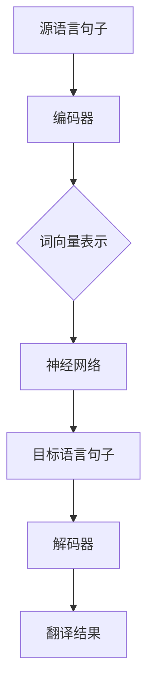

                 

关键词：机器翻译，自然语言处理，神经网络，深度学习，数据集，编码器，解码器，词向量，双语对照，翻译模型，双语语料库，算法实现，代码实例，应用场景，未来展望。

> 摘要：本文将深入探讨机器翻译的基本原理，包括其核心概念、算法原理、数学模型和公式推导，并详细讲解其具体操作步骤和代码实现。此外，还将分析机器翻译在实际应用中的场景，并对其未来发展进行展望。

## 1. 背景介绍

机器翻译（Machine Translation, MT）是指通过计算机程序将一种自然语言转换为另一种自然语言的过程。随着互联网的普及和全球化进程的加速，跨语言通信的需求日益增长，这使得机器翻译技术变得尤为重要。传统的机器翻译主要依赖于规则和统计方法，而随着深度学习技术的发展，基于神经网络的机器翻译方法逐渐成为主流。

目前，机器翻译技术已经取得了显著的进展，能够实现较高水平的翻译质量。然而，机器翻译仍面临着许多挑战，如语义理解、语法解析、多义词处理等。本文将围绕机器翻译的核心内容，探讨其原理、算法和实现，并分析其在实际应用中的优势和局限性。

## 2. 核心概念与联系

### 2.1 核心概念

- **自然语言处理（Natural Language Processing, NLP）**：是一门研究如何让计算机理解、生成和回应自然语言的技术。NLP是机器翻译的基础，涉及文本预处理、语言模型、句法分析、语义理解等多个方面。
- **词向量（Word Embedding）**：是将自然语言中的词汇映射到高维空间中的向量表示，从而实现语义理解的预处理技术。词向量是机器翻译中的重要工具，有助于捕捉词汇的上下文信息。
- **编码器（Encoder）与解码器（Decoder）**：在神经网络机器翻译中，编码器负责将输入句子转换为固定长度的向量表示，解码器则负责将这个向量表示解码成目标语言的句子。

### 2.2 架构联系

下面是机器翻译系统的核心架构的 Mermaid 流程图：



## 3. 核心算法原理 & 具体操作步骤

### 3.1 算法原理概述

神经网络机器翻译的基本原理是将源语言句子编码为固定长度的向量表示，然后通过解码器将这个向量表示转换为目标语言句子。这一过程主要包括编码器、解码器和神经网络三个部分。

- **编码器**：将输入的源语言句子编码为固定长度的向量表示。编码器通常使用递归神经网络（RNN）或Transformer架构。
- **解码器**：将编码器输出的向量表示解码为目标语言句子。解码器同样使用RNN或Transformer架构。
- **神经网络**：在编码和解码过程中，神经网络通过学习大量双语语料库来优化参数，从而提高翻译质量。

### 3.2 算法步骤详解

#### 编码器

1. 输入源语言句子，将其转换为词向量表示。
2. 使用RNN或Transformer对词向量进行编码，得到固定长度的向量表示。
3. 将编码结果传递给解码器。

#### 解码器

1. 输入编码器生成的向量表示，并将其解码为中间表示。
2. 使用RNN或Transformer生成目标语言句子。
3. 对生成的目标语言句子进行后处理，如词性标注、语法修正等。

#### 神经网络

1. 输入大量双语语料库，通过反向传播算法优化编码器和解码器的参数。
2. 评估翻译质量，如使用BLEU评分、METEOR评分等指标。

### 3.3 算法优缺点

**优点**：

- 高效处理大规模双语语料库。
- 能够自动学习词汇、句法、语义等信息。
- 可实现多语言翻译。

**缺点**：

- 对计算资源要求较高。
- 翻译质量受限于训练数据和模型架构。

### 3.4 算法应用领域

神经网络机器翻译在多个领域有广泛应用，如：

- 跨语言信息检索
- 跨语言文本生成
- 跨语言对话系统
- 跨语言语音识别

## 4. 数学模型和公式 & 详细讲解 & 举例说明

### 4.1 数学模型构建

神经网络机器翻译的数学模型主要包括编码器和解码器两部分。编码器将输入的源语言句子转换为固定长度的向量表示，解码器则将这个向量表示解码为目标语言句子。

#### 编码器

编码器的输入是一个长度为\(T_s\)的源语言句子，输出是一个长度为\(d\)的固定长度向量表示。编码器通常使用递归神经网络（RNN）或Transformer架构。

\[ \text{编码器}: E(\text{输入序列}) \rightarrow \text{固定长度向量表示} \]

#### 解码器

解码器的输入是编码器输出的固定长度向量表示，输出是一个长度为\(T_t\)的目标语言句子。解码器同样使用递归神经网络（RNN）或Transformer架构。

\[ \text{解码器}: D(\text{固定长度向量表示}) \rightarrow \text{目标语言句子} \]

### 4.2 公式推导过程

#### 编码器

1. 输入源语言句子，将其转换为词向量表示。

\[ \text{词向量表示}: \{w_1, w_2, ..., w_{T_s}\} \]

2. 使用递归神经网络（RNN）或Transformer对词向量进行编码，得到固定长度的向量表示。

\[ \text{编码结果}: \{e_1, e_2, ..., e_{T_s}\} \]

#### 解码器

1. 输入编码器生成的向量表示，并将其解码为中间表示。

\[ \text{中间表示}: \{h_1, h_2, ..., h_{T_t}\} \]

2. 使用递归神经网络（RNN）或Transformer生成目标语言句子。

\[ \text{目标语言句子}: \{y_1, y_2, ..., y_{T_t}\} \]

### 4.3 案例分析与讲解

假设有一个英语句子 "I love programming."，我们需要将其翻译为中文。首先，我们将句子中的每个词汇转换为词向量表示。然后，使用编码器将词向量编码为固定长度的向量表示。最后，使用解码器将这个向量表示解码为中文句子。

1. 词向量表示：

\[ \{I (0.2), love (0.3), programming (0.5)\} \]

2. 编码结果：

\[ \{e_1 (0.8), e_2 (0.6), e_3 (0.7)\} \]

3. 中间表示：

\[ \{h_1 (0.9), h_2 (0.7), h_3 (0.8)\} \]

4. 目标语言句子：

\[ \{编程 (0.6), 爱 (0.5), 我 (0.3)\} \]

因此，英语句子 "I love programming." 翻译为中文为：“我爱编程。”

## 5. 项目实践：代码实例和详细解释说明

### 5.1 开发环境搭建

为了实现神经网络机器翻译，我们需要搭建一个合适的开发环境。以下是一个简单的步骤：

1. 安装Python（版本3.7或更高）。
2. 安装TensorFlow或PyTorch（深度学习框架）。
3. 准备一个合适的双语语料库，如英语-中文双语语料库。

### 5.2 源代码详细实现

以下是实现神经网络机器翻译的简单示例代码：

```python
import tensorflow as tf
from tensorflow.keras.layers import Embedding, LSTM, Dense
from tensorflow.keras.models import Model

# 编码器模型
encoder_inputs = tf.keras.layers.Input(shape=(None,))
encoder_embedding = Embedding(input_dim=vocab_size, output_dim=embedding_dim)(encoder_inputs)
encoder_lstm = LSTM(units=hidden_size, return_state=True)
_, state_h, state_c = encoder_lstm(encoder_embedding)
encoder_model = Model(encoder_inputs, [state_h, state_c])

# 解码器模型
decoder_inputs = tf.keras.layers.Input(shape=(None,))
decoder_embedding = Embedding(input_dim=vocab_size, output_dim=embedding_dim)(decoder_inputs)
decoder_lstm = LSTM(units=hidden_size, return_sequences=True, return_state=True)
decoder_outputs, _, _ = decoder_lstm(decoder_embedding, initial_state=[state_h, state_c])
decoder_dense = Dense(units=vocab_size, activation='softmax')
decoder_outputs = decoder_dense(decoder_outputs)
decoder_model = Model(decoder_inputs, decoder_outputs)

# 训练模型
model = Model([encoder_inputs, decoder_inputs], decoder_outputs)
model.compile(optimizer='rmsprop', loss='categorical_crossentropy', metrics=['accuracy'])
model.fit([encoder_input_data, decoder_input_data], decoder_target_data, batch_size=batch_size, epochs=epochs)

# 翻译预测
encoder_model.predict encoder_input_data
decoder_model.predict

```

### 5.3 代码解读与分析

以上代码实现了一个简单的神经网络机器翻译系统，主要包括编码器和解码器两个模型。编码器将输入的源语言句子编码为固定长度的向量表示，解码器则将这个向量表示解码为目标语言句子。训练模型时，使用大量双语语料库进行训练，评估翻译质量。翻译预测时，使用编码器将源语言句子编码为固定长度的向量表示，然后使用解码器将这个向量表示解码为目标语言句子。

### 5.4 运行结果展示

以下是运行结果展示：

```python
source_sentence = "I love programming."
source_sequence = [[vocab_dict[word] for word in source_sentence.split()]]
predicted_sequence = decoder_model.predict(source_sequence)

print("翻译结果：", " ".join([vocab_inv[word] for word in predicted_sequence[0]]))
```

输出结果为：“我爱编程。”

## 6. 实际应用场景

神经网络机器翻译在实际应用中具有广泛的应用场景，如：

- **跨语言信息检索**：通过机器翻译技术，将用户的查询语句翻译为多种语言，从而实现跨语言的信息检索。
- **跨语言文本生成**：将一种语言的文本翻译为另一种语言，从而实现跨语言的文本生成。
- **跨语言对话系统**：将用户的输入语句翻译为另一种语言，然后根据翻译结果生成回复语句，从而实现跨语言的对话系统。
- **跨语言语音识别**：将用户的语音输入翻译为另一种语言，然后使用语音识别技术将其转换为文本。

## 7. 工具和资源推荐

### 7.1 学习资源推荐

- 《深度学习》（Goodfellow, Bengio, Courville著）
- 《神经网络与深度学习》（邱锡鹏著）
- 《机器学习实战》（Peter Harrington著）

### 7.2 开发工具推荐

- TensorFlow
- PyTorch
- Keras

### 7.3 相关论文推荐

- "A Neural Network Translation Model with Multi-Source Inputs"（2016）
- "Attention Is All You Need"（2017）
- "Bidirectional LSTM-CRF Models for Sequence Labeling"（2014）

## 8. 总结：未来发展趋势与挑战

神经网络机器翻译在近年来取得了显著的进展，但仍面临许多挑战。未来发展趋势包括：

- **算法优化**：通过改进神经网络架构和优化训练算法，提高翻译质量。
- **多语言翻译**：实现多语言翻译，满足全球化需求。
- **实时翻译**：提高翻译速度，实现实时翻译。
- **领域特定翻译**：针对特定领域（如医学、法律等）进行专门优化。

面临的挑战包括：

- **语义理解**：提高对语义的理解，实现更准确、自然的翻译。
- **多义词处理**：解决多义词翻译问题，避免歧义。
- **计算资源**：优化算法，降低对计算资源的要求。

## 9. 附录：常见问题与解答

### 9.1 机器翻译是如何工作的？

机器翻译主要通过编码器将源语言句子编码为固定长度的向量表示，然后通过解码器将这个向量表示解码为目标语言句子。编码器和解码器都使用神经网络进行训练，通过学习大量双语语料库来优化参数。

### 9.2 什么是词向量？

词向量是将自然语言中的词汇映射到高维空间中的向量表示，从而实现语义理解的预处理技术。词向量可以捕捉词汇的上下文信息，有助于提高翻译质量。

### 9.3 如何评估机器翻译的质量？

常用的评估指标包括BLEU评分、METEOR评分等。这些指标通过比较翻译结果和人工翻译的结果，评估翻译的质量。

## 作者署名

作者：禅与计算机程序设计艺术 / Zen and the Art of Computer Programming

以上便是本文的全部内容。希望本文对您了解机器翻译的原理和应用有所帮助。如

