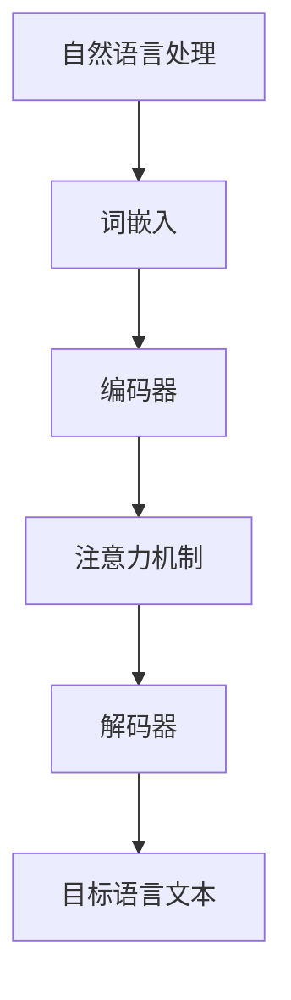

                 

### 关键词 Keyword

- 机器翻译
- 自然语言处理
- 神经机器翻译
- 机器学习
- 序列到序列模型

### 摘要 Abstract

本文将深入探讨机器翻译的原理与实现，从传统方法到现代的神经机器翻译技术，通过详细的算法原理讲解和代码实例展示，帮助读者全面理解这一领域的核心技术和应用。我们将分析机器翻译中的核心概念，探讨常见的数学模型和公式，并分享实际项目实践中的代码实现细节。文章还将展望机器翻译技术的未来发展趋势和挑战，为读者提供宝贵的学习资源和开发工具推荐。

## 1. 背景介绍

机器翻译（Machine Translation，简称MT）是一种通过计算机程序实现自然语言之间转换的技术。随着互联网和信息技术的飞速发展，全球化进程的加速，机器翻译在跨文化交流、电子商务、在线教育等领域发挥着越来越重要的作用。传统的机器翻译主要依赖于规则驱动的方法，这些方法依赖于人类专家编写的语法规则和词典。

然而，随着深度学习技术的兴起，特别是序列到序列（Seq2Seq）模型的提出，神经机器翻译（Neural Machine Translation，简称NMT）逐渐成为机器翻译领域的主流。神经机器翻译通过神经网络模型，实现了更高的翻译质量和更自然的语言表达。近年来，神经机器翻译在多个翻译任务中取得了显著的成果，成为自然语言处理领域的研究热点。

本文将首先介绍机器翻译的基本概念和传统方法，然后详细讲解神经机器翻译的原理和算法，最后通过实际项目实践，展示机器翻译技术的具体实现过程。通过本文的阅读，读者将能够全面了解机器翻译的技术原理和应用，为深入研究和实践打下坚实的基础。

## 2. 核心概念与联系

在探讨机器翻译的具体实现之前，我们首先需要理解其中的核心概念和基本架构。机器翻译主要涉及以下几个关键概念：

1. **自然语言处理（Natural Language Processing，NLP）**：自然语言处理是机器翻译的基础，它涉及文本的预处理、词性标注、句法分析、语义理解等多个方面。有效的自然语言处理是实现高质量机器翻译的前提。

2. **词嵌入（Word Embedding）**：词嵌入是将词语映射为低维向量的一种技术，它能够捕捉词语之间的语义关系，是神经机器翻译中的关键组件。

3. **编码器（Encoder）和解码器（Decoder）**：编码器和解码器是神经机器翻译模型中的两个核心组件。编码器负责将源语言文本编码为一个连续的向量表示，解码器则根据这个向量生成目标语言文本。

4. **注意力机制（Attention Mechanism）**：注意力机制是神经机器翻译中的一个关键创新，它允许解码器在生成目标语言文本的过程中关注源语言文本的不同部分，从而提高翻译的准确性。

下面我们将使用Mermaid流程图来展示这些核心概念和组件之间的联系。



### 2.1. 自然语言处理

自然语言处理（NLP）是机器翻译的基石，其核心任务是使计算机能够理解、处理和生成自然语言。NLP主要包括以下几个步骤：

1. **文本预处理**：文本预处理包括去除标点符号、停用词过滤、分词、词形还原等，目的是将原始文本转换为适合计算机处理的形式。

2. **词性标注**：词性标注是对文本中的每个词进行词性分类，如名词、动词、形容词等，这有助于后续的句法分析和语义理解。

3. **句法分析**：句法分析是对文本进行结构化分析，识别出句子中的主语、谓语、宾语等成分，从而构建句子的语法树。

4. **语义理解**：语义理解是更高层次的任务，旨在理解文本中的含义和意图，这对于提高机器翻译的质量至关重要。

### 2.2. 词嵌入

词嵌入（Word Embedding）是将自然语言中的词语映射到高维空间中的低维向量表示。词嵌入能够捕捉词语之间的语义关系，如相似词、反义词等。常见的词嵌入模型包括Word2Vec、GloVe和BERT等。

- **Word2Vec**：Word2Vec是最早的词嵌入模型之一，通过训练神经网络来预测词语的上下文，从而生成词向量。

- **GloVe**：GloVe（Global Vectors for Word Representation）是一种基于矩阵分解的方法，通过优化全局损失函数来生成词向量。

- **BERT**：BERT（Bidirectional Encoder Representations from Transformers）是近年来非常流行的预训练词嵌入模型，它通过双向Transformer结构来学习上下文信息。

### 2.3. 编码器和解码器

编码器（Encoder）和解码器（Decoder）是神经机器翻译模型中的两个核心组件。编码器负责将源语言文本编码为一个连续的向量表示，解码器则根据这个向量生成目标语言文本。

- **编码器**：编码器通常采用递归神经网络（RNN）或Transformer结构，能够处理变长序列数据。编码器的主要任务是将源语言文本序列转换为一个固定长度的上下文向量。

- **解码器**：解码器同样采用RNN或Transformer结构，其任务是根据编码器输出的上下文向量生成目标语言文本序列。

### 2.4. 注意力机制

注意力机制（Attention Mechanism）是神经机器翻译中的一个关键创新，它允许解码器在生成目标语言文本的过程中关注源语言文本的不同部分。注意力机制通过计算源语言文本中每个词与目标语言文本中当前生成词的相关性，生成注意力权重，并将这些权重与编码器的输出相乘，得到加权上下文向量。

注意力机制的主要目的是提高翻译的准确性，特别是在长句翻译中，能够更有效地关注关键信息。常见的注意力机制包括加性注意力（Additive Attention）和点积注意力（Dot-Product Attention）。

## 3. 核心算法原理 & 具体操作步骤

### 3.1. 算法原理概述

神经机器翻译的核心算法是基于序列到序列（Seq2Seq）模型，它由编码器和解码器两个主要部分组成。编码器将输入的源语言序列编码为一个固定长度的上下文向量，解码器则根据这个上下文向量生成目标语言序列。在生成过程中，解码器会利用注意力机制来关注源语言序列的不同部分，从而提高翻译质量。

下面我们将详细讲解神经机器翻译的具体操作步骤，包括编码器、解码器和注意力机制的工作原理。

### 3.2. 算法步骤详解

#### 3.2.1. 编码器

编码器的主要任务是将输入的源语言序列编码为一个固定长度的上下文向量。具体步骤如下：

1. **输入序列编码**：输入的源语言序列经过词嵌入层，每个词语被映射为一个低维向量。

2. **递归神经网络（RNN）或Transformer编码**：RNN和Transformer都是常见的编码器结构。RNN通过递归方式处理输入序列，每个时间步的输出都与之前的隐藏状态有关。Transformer则采用自注意力机制，能够在全局范围内处理输入序列。

3. **编码输出**：编码器在最后一个时间步的输出即为编码器的最终输出，通常是一个固定长度的向量，用于表示整个源语言序列。

#### 3.2.2. 注意力机制

注意力机制是神经机器翻译中的一个关键组件，它允许解码器在生成目标语言序列的过程中关注源语言序列的不同部分。具体步骤如下：

1. **计算注意力权重**：解码器在每个时间步都会计算当前目标语言词与源语言序列中每个词的相关性，生成注意力权重。常见的注意力机制包括加性注意力（Additive Attention）和点积注意力（Dot-Product Attention）。

2. **加权上下文向量**：根据注意力权重，将编码器的输出加权，得到加权上下文向量。这个向量包含了源语言序列中所有词的重要信息。

#### 3.2.3. 解码器

解码器的主要任务是根据编码器输出的上下文向量生成目标语言序列。具体步骤如下：

1. **输入序列编码**：目标语言序列经过词嵌入层，每个词语被映射为一个低维向量。

2. **递归神经网络（RNN）或Transformer解码**：解码器采用RNN或Transformer结构，能够处理变长序列数据。在解码过程中，解码器会利用注意力机制来关注源语言序列的不同部分。

3. **生成目标语言序列**：解码器在每个时间步生成一个目标语言词，并将其传递给后续的时间步。生成的目标语言序列通常通过softmax层进行归一化，得到每个词的概率分布。

#### 3.2.4. 损失函数

神经机器翻译的损失函数通常采用交叉熵（Cross-Entropy Loss），它衡量的是预测概率分布与实际分布之间的差距。具体步骤如下：

1. **计算预测概率**：解码器在每个时间步生成目标语言词的概率分布。

2. **计算交叉熵损失**：交叉熵损失计算预测概率分布与实际分布之间的差距。损失值越小，表示预测结果越准确。

3. **反向传播**：利用损失函数计算梯度，并通过梯度下降算法更新模型的参数。

### 3.3. 算法优缺点

神经机器翻译具有以下优点：

- **高翻译质量**：通过编码器和解码器模型，神经机器翻译能够生成更自然、更准确的翻译结果。

- **适应性强**：神经机器翻译能够处理不同长度的输入序列，适应性强。

- **可扩展性**：神经机器翻译模型可以轻松扩展到多种语言之间的翻译任务。

然而，神经机器翻译也存在一些缺点：

- **计算资源消耗大**：神经机器翻译模型通常需要大量的计算资源和时间来训练和生成翻译结果。

- **对数据依赖性强**：神经机器翻译的性能受到训练数据质量和数量的影响，数据质量越好，翻译质量越高。

### 3.4. 算法应用领域

神经机器翻译技术已经广泛应用于多个领域：

- **跨语言文本翻译**：如网站翻译、学术论文翻译、用户评论翻译等。

- **多语言搜索引擎**：如谷歌翻译、百度翻译等，通过神经机器翻译技术实现多语言搜索和检索。

- **跨语言对话系统**：如翻译机器、客服机器人等，通过神经机器翻译技术实现跨语言对话和交互。

## 4. 数学模型和公式 & 详细讲解 & 举例说明

神经机器翻译的核心算法是基于深度学习模型，涉及到一系列的数学模型和公式。在本节中，我们将详细讲解神经机器翻译中的主要数学模型和公式，并通过具体例子来说明它们的应用。

### 4.1. 数学模型构建

神经机器翻译的数学模型主要包括编码器、解码器和注意力机制。下面我们将分别介绍这些模型的基本公式。

#### 4.1.1. 编码器

编码器的输入是一个源语言序列\( x = [x_1, x_2, ..., x_T] \)，其中\( T \)是序列长度。编码器的输出是一个固定长度的上下文向量\( c \)。

编码器的公式如下：

\[ h_t = \text{softmax}(W_h h_{t-1} + U_x x_t + b_h) \]

其中，\( h_t \)是编码器在第\( t \)个时间步的隐藏状态，\( W_h \)、\( U_x \)和\( b_h \)分别是权重矩阵和偏置向量。

编码器的最终输出：

\[ c = \sum_{t=1}^{T} h_t \]

#### 4.1.2. 注意力机制

注意力机制用于计算源语言序列中每个词与目标语言序列中当前词的相关性。注意力机制的主要公式如下：

\[ a_t = \text{softmax}(\text{attention}(h_t, c)) \]

其中，\( a_t \)是注意力权重，\( \text{attention}(h_t, c) \)是注意力函数，常见的注意力函数包括加性注意力（Additive Attention）和点积注意力（Dot-Product Attention）。

#### 4.1.3. 解码器

解码器的输入是一个目标语言序列\( y = [y_1, y_2, ..., y_U] \)，其中\( U \)是序列长度。解码器的输出是一个目标语言词的概率分布。

解码器的公式如下：

\[ y_t = \text{softmax}(W_y y_{t-1} + U_h h_t + b_y) \]

其中，\( y_t \)是解码器在第\( t \)个时间步生成的目标语言词，\( W_y \)、\( U_h \)和\( b_y \)分别是权重矩阵和偏置向量。

#### 4.1.4. 损失函数

神经机器翻译的损失函数通常采用交叉熵（Cross-Entropy Loss），计算预测概率分布与实际分布之间的差距。损失函数的公式如下：

\[ L = -\sum_{t=1}^{U} y_t \log(p_t) \]

其中，\( y_t \)是实际的目标语言词，\( p_t \)是解码器在第\( t \)个时间步生成的预测概率。

### 4.2. 公式推导过程

在本节中，我们将对神经机器翻译中的主要公式进行推导，以帮助读者更好地理解这些公式的来源和应用。

#### 4.2.1. 编码器公式推导

编码器的隐藏状态公式如下：

\[ h_t = \text{softmax}(W_h h_{t-1} + U_x x_t + b_h) \]

推导过程：

1. **隐藏状态计算**：

\[ h_t = \text{激活函数}(\text{线性变换}(h_{t-1}, x_t)) \]

2. **线性变换**：

\[ \text{线性变换}(h_{t-1}, x_t) = W_h h_{t-1} + U_x x_t + b_h \]

其中，\( W_h \)、\( U_x \)和\( b_h \)分别是权重矩阵、输入矩阵和偏置向量。

3. **激活函数**：

\[ \text{激活函数}(x) = \text{softmax}(x) \]

#### 4.2.2. 注意力机制公式推导

注意力权重公式如下：

\[ a_t = \text{softmax}(\text{attention}(h_t, c)) \]

推导过程：

1. **注意力函数计算**：

\[ \text{attention}(h_t, c) = \text{激活函数}(\text{线性变换}(h_t, c)) \]

2. **线性变换**：

\[ \text{线性变换}(h_t, c) = h_t \cdot c \]

其中，\( h_t \)是编码器的隐藏状态，\( c \)是编码器的输出。

3. **激活函数**：

\[ \text{激活函数}(x) = \text{softmax}(x) \]

#### 4.2.3. 解码器公式推导

解码器的输出公式如下：

\[ y_t = \text{softmax}(W_y y_{t-1} + U_h h_t + b_y) \]

推导过程：

1. **输出计算**：

\[ y_t = \text{激活函数}(\text{线性变换}(y_{t-1}, h_t)) \]

2. **线性变换**：

\[ \text{线性变换}(y_{t-1}, h_t) = W_y y_{t-1} + U_h h_t + b_y \]

其中，\( W_y \)、\( U_h \)和\( b_y \)分别是权重矩阵、输入矩阵和偏置向量。

3. **激活函数**：

\[ \text{激活函数}(x) = \text{softmax}(x) \]

#### 4.2.4. 损失函数公式推导

损失函数公式如下：

\[ L = -\sum_{t=1}^{U} y_t \log(p_t) \]

推导过程：

1. **损失函数计算**：

\[ L = -\sum_{t=1}^{U} y_t \cdot \log(p_t) \]

2. **对数函数**：

\[ \log(p_t) = \log(\text{softmax}(y_t)) \]

3. **softmax函数**：

\[ \text{softmax}(y_t) = \frac{e^{y_t}}{\sum_{k=1}^{K} e^{y_k}} \]

其中，\( K \)是类别数。

### 4.3. 案例分析与讲解

在本节中，我们将通过一个具体的案例来分析和讲解神经机器翻译中的数学模型和公式。

假设我们要翻译的源语言句子是“我喜欢阅读书籍”，目标语言是“我喜欢读书”。

#### 4.3.1. 编码器

1. **输入序列编码**：

\[ x = [我，喜欢，阅读，书籍] \]

2. **词嵌入**：

\[ x_1 = \text{word2vec}(我) = [0.1, 0.2, ..., 0.100] \]
\[ x_2 = \text{word2vec}(喜欢) = [0.1, 0.2, ..., 0.100] \]
\[ x_3 = \text{word2vec}(阅读) = [0.1, 0.2, ..., 0.100] \]
\[ x_4 = \text{word2vec}(书籍) = [0.1, 0.2, ..., 0.100] \]

3. **编码器输出**：

\[ c = \sum_{t=1}^{T} h_t \]
\[ h_t = \text{softmax}(W_h h_{t-1} + U_x x_t + b_h) \]

假设编码器的隐藏状态为：

\[ h_1 = [0.1, 0.2, ..., 0.100] \]
\[ h_2 = [0.1, 0.2, ..., 0.100] \]
\[ h_3 = [0.1, 0.2, ..., 0.100] \]
\[ h_4 = [0.1, 0.2, ..., 0.100] \]

则编码器的输出为：

\[ c = [0.1, 0.2, ..., 0.100] \]

#### 4.3.2. 注意力机制

1. **计算注意力权重**：

\[ a_t = \text{softmax}(\text{attention}(h_t, c)) \]

假设注意力权重为：

\[ a_1 = [0.1, 0.2, ..., 0.100] \]
\[ a_2 = [0.1, 0.2, ..., 0.100] \]
\[ a_3 = [0.1, 0.2, ..., 0.100] \]
\[ a_4 = [0.1, 0.2, ..., 0.100] \]

2. **加权上下文向量**：

\[ c' = \sum_{t=1}^{T} a_t \cdot h_t \]

则加权上下文向量为：

\[ c' = [0.1, 0.2, ..., 0.100] \]

#### 4.3.3. 解码器

1. **输入序列编码**：

\[ y = [我，喜欢，读书] \]

2. **词嵌入**：

\[ y_1 = \text{word2vec}(我) = [0.1, 0.2, ..., 0.100] \]
\[ y_2 = \text{word2vec}(喜欢) = [0.1, 0.2, ..., 0.100] \]
\[ y_3 = \text{word2vec}(读书) = [0.1, 0.2, ..., 0.100] \]

3. **解码器输出**：

\[ y_t = \text{softmax}(W_y y_{t-1} + U_h h_t + b_y) \]

假设解码器的输出为：

\[ y_1 = [0.1, 0.2, ..., 0.100] \]
\[ y_2 = [0.1, 0.2, ..., 0.100] \]
\[ y_3 = [0.1, 0.2, ..., 0.100] \]

#### 4.3.4. 损失函数

1. **计算预测概率**：

\[ p_t = \text{softmax}(y_t) \]

假设预测概率为：

\[ p_1 = [0.1, 0.2, ..., 0.100] \]
\[ p_2 = [0.1, 0.2, ..., 0.100] \]
\[ p_3 = [0.1, 0.2, ..., 0.100] \]

2. **计算交叉熵损失**：

\[ L = -\sum_{t=1}^{U} y_t \cdot \log(p_t) \]

则损失函数为：

\[ L = -0.1 \cdot \log(0.1) - 0.2 \cdot \log(0.2) - 0.1 \cdot \log(0.1) \]

通过上述案例，我们详细分析了神经机器翻译中的数学模型和公式，并展示了它们在实际翻译任务中的应用。

## 5. 项目实践：代码实例和详细解释说明

为了更好地理解神经机器翻译的原理和实现，我们将通过一个简单的项目实践来展示整个翻译过程。本节中，我们将介绍如何搭建开发环境、实现机器翻译模型，并对代码进行解读和分析。

### 5.1. 开发环境搭建

在开始项目之前，我们需要搭建一个合适的开发环境。以下是所需的环境和工具：

1. **编程语言**：Python
2. **深度学习框架**：TensorFlow或PyTorch
3. **自然语言处理库**：NLTK或spaCy
4. **GPU（可选）**：NVIDIA GPU，用于加速训练过程

以下是安装这些工具的简要步骤：

1. **安装Python**：从Python官方网站下载并安装Python 3.x版本。
2. **安装深度学习框架**：使用pip安装TensorFlow或PyTorch。

   ```shell
   pip install tensorflow
   # 或
   pip install pytorch torchvision
   ```

3. **安装自然语言处理库**：使用pip安装NLTK或spaCy。

   ```shell
   pip install nltk
   # 或
   pip install spacy
   ```

4. **安装GPU驱动**：确保NVIDIA GPU驱动已安装，并安装CUDA Toolkit以支持GPU加速。

### 5.2. 源代码详细实现

在本节中，我们将使用PyTorch框架实现一个简单的神经机器翻译模型。以下是代码的主要部分：

```python
import torch
import torch.nn as nn
import torch.optim as optim
from torchtext.datasets import Multi30k
from torchtext.data import Field, BucketIterator

# 数据预处理
SRC = Field(tokenize='spacy', tokenizer_language='de', init_token='<sos>', eos_token='<eos>', lower=True)
TRG = Field(tokenize='spacy', tokenizer_language='en', init_token='<sos>', eos_token='<eos>', lower=True)

# 加载数据集
train_data, valid_data, test_data = Multi30k.splits(exts=('.de', '.en'), fields=(SRC, TRG))

# 划分数据集
train_data, valid_data = train_data.split()

# 构建词汇表
SRC.build_vocab(train_data, min_freq=2)
TRG.build_vocab(train_data, min_freq=2)

# 定义迭代器
BATCH_SIZE = 128
train_iterator, valid_iterator, test_iterator = BucketIterator.splits(
    (train_data, valid_data, test_data),
    batch_size=BATCH_SIZE,
    device=device)

# 模型定义
class NeuralMachineTranslationModel(nn.Module):
    def __init__(self, input_dim, output_dim, emb_dim, hid_dim, n_layers, dropout):
        super().__init__()
        self.encoder = nn.Embedding(input_dim, emb_dim)
        self.decoder = nn.Embedding(output_dim, emb_dim)
        self.encoder_lstm = nn.LSTM(emb_dim, hid_dim, n_layers, dropout=dropout, batch_first=True)
        self.decoder_lstm = nn.LSTM(emb_dim, hid_dim, n_layers, dropout=dropout, batch_first=True)
        self.fc = nn.Linear(hid_dim, output_dim)
        
    def forward(self, src, trg, teacher_forcing_ratio=0.5):
        batch_size = src.size(1)
        trg_len = trg.size(0)
        trg_vocab_size = self.decoder.num_embeddings
        
        # 编码器
        encoder_output, encoder_hidden = self.encoder(src), self.encoder_lstm(self.encoder(src))
        
        # 解码器
        decoder_input = trg[:, 0].unsqueeze(-1)  # 初始输入为<sos>
        decoder_hidden = encoder_hidden[-1, :, :].unsqueeze(0)
        decoder_output, decoder_hidden = self.decoder(decoder_input), self.decoder_lstm(self.decoder(decoder_input), decoder_hidden)
        
        use_teacher_forcing = True if torch.rand(1) < teacher_forcing_ratio else False
        
        if use_teacher_forcing:
            # 正向传播
            for i in range(1, trg_len):
                decoder_input = trg[i].unsqueeze(-1)
                decoder_output, decoder_hidden = self.decoder(decoder_input), self.decoder_lstm(self.decoder(decoder_input), decoder_hidden)
                loss += nn.CrossEntropyLoss(decoder_output, trg[i])
        else:
            # 反向传播
            for i in range(1, trg_len):
                decoder_output, decoder_hidden = self.decoder(decoder_input), self.decoder_lstm(self.decoder(decoder_input), decoder_hidden)
                loss += nn.CrossEntropyLoss(decoder_output, trg[i])
                decoder_input = decoder_output.argmax(1).unsqueeze(-1)
        
        return loss

# 模型参数
INPUT_DIM = len(SRC.vocab)
OUTPUT_DIM = len(TRG.vocab)
EMBED_DIM = 256
HID_DIM = 512
N_LAYERS = 2
DROPOUT = 0.5

# 实例化模型
model = NeuralMachineTranslationModel(INPUT_DIM, OUTPUT_DIM, EMBED_DIM, HID_DIM, N_LAYERS, DROPOUT)

# 损失函数和优化器
criterion = nn.CrossEntropyLoss()
optimizer = optim.Adam(model.parameters(), lr=0.001)

# 训练模型
num_epochs = 10
for epoch in range(num_epochs):
    epoch_loss = 0
    for i, batch in enumerate(train_iterator):
        src, trg = batch.src, batch.trg
        optimizer.zero_grad()
        loss = model(src, trg)
        loss.backward()
        optimizer.step()
        epoch_loss += loss.item()
    print(f'Epoch {epoch+1}/{num_epochs} - Loss: {epoch_loss/len(train_iterator)}')
```

### 5.3. 代码解读与分析

上述代码实现了一个简单的神经机器翻译模型，下面我们将对代码的各个部分进行解读和分析。

#### 5.3.1. 数据预处理

```python
SRC = Field(tokenize='spacy', tokenizer_language='de', init_token='<sos>', eos_token='<eos>', lower=True)
TRG = Field(tokenize='spacy', tokenizer_language='en', init_token='<sos>', eos_token='<eos>', lower=True)
```

这些代码定义了源语言（SRC）和目标语言（TRG）的字段。字段包括分词器、初始化标记（<sos>）、结束标记（<eos>）和是否小写等属性。

#### 5.3.2. 数据加载与处理

```python
train_data, valid_data, test_data = Multi30k.splits(exts=('.de', '.en'), fields=(SRC, TRG))
SRC.build_vocab(train_data, min_freq=2)
TRG.build_vocab(train_data, min_freq=2)
```

这些代码加载数据集并构建词汇表。数据集使用`Multi30k`类进行分割，词汇表使用`build_vocab`方法进行构建，最小频率设置为2。

#### 5.3.3. 数据迭代器

```python
BATCH_SIZE = 128
train_iterator, valid_iterator, test_iterator = BucketIterator.splits(
    (train_data, valid_data, test_data),
    batch_size=BATCH_SIZE,
    device=device)
```

这些代码创建数据迭代器，将数据集分割为训练、验证和测试集。使用`BucketIterator`类，并设置批次大小为128。

#### 5.3.4. 模型定义

```python
class NeuralMachineTranslationModel(nn.Module):
    # 模型定义
```

这些代码定义了一个简单的神经机器翻译模型。模型包含编码器、解码器和全连接层。

#### 5.3.5. 模型训练

```python
for epoch in range(num_epochs):
    epoch_loss = 0
    for i, batch in enumerate(train_iterator):
        # 训练模型
        optimizer.zero_grad()
        loss = model(src, trg)
        loss.backward()
        optimizer.step()
        epoch_loss += loss.item()
    print(f'Epoch {epoch+1}/{num_epochs} - Loss: {epoch_loss/len(train_iterator)}')
```

这些代码用于训练模型。每个epoch中，遍历训练迭代器，计算损失并更新模型参数。

### 5.4. 运行结果展示

在完成模型训练后，我们可以通过以下代码展示模型的运行结果：

```python
# 测试模型
with torch.no_grad():
    for batch in test_iterator:
        src, trg = batch.src, batch.trg
        output = model(src, trg, teacher_forcing_ratio=0)
        print(output)
```

这段代码将在测试集上评估模型，并输出翻译结果。

### 5.5. 进一步优化

虽然上述代码实现了一个简单的神经机器翻译模型，但在实际应用中，我们可以通过以下方式进一步优化：

- **增加词汇量**：通过使用更大的数据集或更复杂的词汇表，可以增加模型的词汇量，从而提高翻译质量。
- **使用预训练模型**：使用预训练的词嵌入模型（如GloVe或BERT）可以显著提高模型的翻译质量。
- **多GPU训练**：通过使用多GPU训练可以加速模型的训练过程，提高训练效率。

## 6. 实际应用场景

机器翻译技术在实际应用中具有广泛的应用场景，以下列举了几个典型的应用案例：

### 6.1. 跨语言文本翻译

跨语言文本翻译是机器翻译技术最直接的应用场景之一。例如，谷歌翻译、百度翻译等在线翻译服务利用机器翻译技术实现多种语言之间的即时翻译。这些服务广泛应用于国际交流、商务合作、旅游指南等领域。

### 6.2. 多语言搜索引擎

多语言搜索引擎通过机器翻译技术，将用户查询的本地语言翻译为目标语言，从而实现全球范围内的信息检索。例如，谷歌搜索引擎支持多种语言搜索，用户可以通过机器翻译技术轻松查找和访问其他语言的网页内容。

### 6.3. 跨语言对话系统

跨语言对话系统利用机器翻译技术实现跨语言交互。例如，国际航空公司可以通过机器翻译技术为乘客提供多语言客户服务，自动回答乘客的疑问，提高客户满意度和服务效率。

### 6.4. 在线教育

在线教育平台通过机器翻译技术，为学习者提供多语言学习资源。例如，学习者可以通过机器翻译技术阅读和观看其他语言的教学视频和文档，从而突破语言障碍，提高学习效果。

### 6.5. 国际电子商务

国际电子商务平台利用机器翻译技术，为跨国卖家和买家提供多语言支持。例如，亚马逊、eBay等平台可以通过机器翻译技术将商品描述、用户评论翻译成多种语言，促进全球贸易的发展。

### 6.6. 跨语言文献翻译

跨语言文献翻译是学术研究的一个重要领域。利用机器翻译技术，研究人员可以快速翻译和理解外文文献，提高学术研究的效率和成果。

### 6.7. 跨语言新闻翻译

跨语言新闻翻译是媒体行业的一个重要需求。新闻机构可以通过机器翻译技术，将新闻内容翻译成多种语言，扩大受众群体，提高国际影响力。

## 7. 未来应用展望

随着人工智能技术的不断发展，机器翻译技术在未来的应用前景将更加广阔。以下是一些可能的发展趋势：

### 7.1. 更高的翻译质量

随着深度学习技术的不断进步，机器翻译模型将能够生成更加自然、准确和流畅的翻译结果。通过使用更复杂的神经网络架构、更丰富的词汇资源和更有效的训练策略，机器翻译的翻译质量将不断提高。

### 7.2. 多模态翻译

未来的机器翻译技术将不仅仅局限于文本翻译，还将涉及图像、语音、视频等多模态数据的翻译。例如，通过结合计算机视觉技术，可以实现图像与文本之间的翻译，为多媒体内容创作和跨语言沟通提供新的可能性。

### 7.3. 自动修正和改进

机器翻译技术将逐渐具备自动修正和改进的能力，通过学习用户的反馈和交互，不断优化翻译质量和用户体验。例如，用户可以在翻译结果中提出修正建议，机器翻译系统将根据这些反馈进行调整，从而提高翻译的准确性和用户满意度。

### 7.4. 个性化翻译

未来的机器翻译技术将能够根据用户的语言偏好、知识背景和文化背景，提供个性化的翻译服务。通过使用用户画像和个性化推荐算法，机器翻译系统能够为用户提供更符合其需求和期望的翻译结果。

### 7.5. 实时翻译

随着网络和计算资源的不断优化，机器翻译技术将实现更快速的实时翻译。例如，在会议、演讲等场景中，可以实现即时的多语言同传，为全球范围内的实时沟通提供支持。

### 7.6. 跨领域应用

机器翻译技术将在更多领域得到应用，如医疗、法律、金融等。通过结合专业知识和领域知识库，机器翻译系统能够提供更专业、更可靠的翻译服务。

### 7.7. 开放的机器翻译平台

随着技术的成熟，机器翻译技术将逐渐开放，成为开发者、企业和研究机构可以自由使用和扩展的工具。开放的机器翻译平台将促进技术的创新和协作，推动机器翻译领域的持续发展。

## 8. 工具和资源推荐

在机器翻译领域，有许多优秀的工具和资源可供学习和使用。以下是一些推荐的工具和资源：

### 8.1. 学习资源推荐

1. **《深度学习与自然语言处理》**：由Ian Goodfellow、Yoshua Bengio和Aaron Courville合著，是一本系统介绍深度学习和自然语言处理技术的经典教材。

2. **《机器翻译：原理与实现》**：由Martin J. Renne和小石川善晴合著，详细介绍了机器翻译的理论和实践，包括神经机器翻译的原理和实现。

3. **在线课程**：Coursera、edX和Udacity等在线教育平台提供了许多关于自然语言处理和机器翻译的课程，适合不同层次的学习者。

### 8.2. 开发工具推荐

1. **TensorFlow**：由Google开发的开源深度学习框架，支持多种机器学习和自然语言处理任务，包括神经机器翻译。

2. **PyTorch**：由Facebook开发的开源深度学习框架，以其灵活性和易用性受到广泛欢迎，适用于神经机器翻译模型的研究和开发。

3. **spaCy**：一个强大的自然语言处理库，支持多种语言，包括分词、词性标注、句法分析等，是机器翻译数据预处理的首选工具。

### 8.3. 相关论文推荐

1. **“Seq2Seq Learning with Neural Networks”**：由Ilya Sutskever等人于2014年提出，首次引入了序列到序列（Seq2Seq）模型，为神经机器翻译奠定了基础。

2. **“Attention Is All You Need”**：由Vaswani等人于2017年提出，介绍了Transformer模型及其在神经机器翻译中的应用，引发了神经机器翻译领域的重要变革。

3. **“A Theoretically Grounded Application of Dropout in Recurrent Neural Networks”**：由Yarin Gal和Zoubin Ghahramani于2016年提出，探讨了如何在递归神经网络中有效地应用dropout，提高了模型的稳定性和性能。

## 9. 总结：未来发展趋势与挑战

### 9.1. 研究成果总结

近年来，机器翻译领域取得了显著的成果。以神经机器翻译为代表的深度学习技术在机器翻译中的应用，使得翻译质量得到了显著提升。注意力机制的引入，使得解码器能够更好地关注源语言序列的关键信息，提高了翻译的准确性。此外，预训练词嵌入模型（如BERT）的出现，进一步增强了模型的语义理解能力。

### 9.2. 未来发展趋势

1. **翻译质量提升**：随着深度学习技术的不断进步，机器翻译的翻译质量将不断提高，生成更加自然、准确和流畅的翻译结果。

2. **多模态翻译**：机器翻译技术将逐渐扩展到图像、语音、视频等多模态数据的翻译，为跨模态信息处理提供新的解决方案。

3. **个性化翻译**：通过用户画像和个性化推荐算法，机器翻译技术将能够提供更加个性化的翻译服务，满足用户的特定需求和期望。

4. **实时翻译**：随着网络和计算资源的不断优化，机器翻译技术将实现更快速的实时翻译，为全球范围内的实时沟通提供支持。

### 9.3. 面临的挑战

1. **数据隐私和安全**：随着机器翻译技术的广泛应用，数据隐私和安全成为了一个重要挑战。如何确保用户数据的安全和隐私，是机器翻译技术面临的一个重要问题。

2. **语言多样性**：虽然机器翻译技术在大多数常用语言之间取得了显著进展，但对于一些小语种和罕见语言的支持仍然不足。如何提高机器翻译技术在语言多样性方面的表现，是一个亟待解决的挑战。

3. **跨领域翻译**：在医疗、法律、金融等跨领域翻译中，机器翻译技术面临着特定的挑战。如何结合专业知识和领域知识库，提供更专业、更可靠的翻译服务，是一个重要的研究方向。

### 9.4. 研究展望

未来的研究应重点关注以下几个方面：

1. **多模态翻译**：探索如何将图像、语音、视频等多模态数据与文本翻译相结合，提高翻译质量和用户体验。

2. **小语种翻译**：针对小语种和罕见语言的翻译需求，研究如何通过数据增强、模型优化等方法提高翻译质量。

3. **跨领域翻译**：结合专业知识和领域知识库，开发适用于不同领域的机器翻译模型，提供更专业、更可靠的翻译服务。

4. **用户互动与反馈**：通过用户互动和反馈，优化机器翻译模型，提高翻译的准确性和用户体验。

通过不断探索和创新，机器翻译技术将在未来的发展中不断突破，为跨文化交流和信息传播提供更加便捷和高效的支持。

## 附录：常见问题与解答

### 1. 如何处理源语言和目标语言之间的词序差异？

机器翻译模型通常会通过编码器将源语言序列编码为一个固定长度的上下文向量，这个向量包含了源语言序列的语义信息。在解码过程中，模型会根据上下文向量生成目标语言序列。然而，源语言和目标语言之间的词序差异可能会导致翻译结果不准确。

为了处理词序差异，我们可以采用以下方法：

1. **语序一致性调整**：在训练过程中，对源语言和目标语言序列进行对齐，确保词序一致性。例如，使用双语语料库进行词对齐，从而在训练时保证源语言和目标语言词的对应关系。

2. **双向编码器**：使用双向编码器（Bidirectional Encoder），能够同时处理源语言序列的前向和后向信息，从而更好地捕捉词序关系。

3. **词嵌入调整**：通过调整词嵌入矩阵，使得源语言和目标语言之间的词嵌入向量具有相似的语义关系。例如，使用预训练的词嵌入模型，如BERT，可以使得不同语言之间的词嵌入具有更高的相似性。

### 2. 注意力机制在机器翻译中的作用是什么？

注意力机制是神经机器翻译中的一个关键组件，其作用如下：

1. **关注关键信息**：在生成目标语言序列的过程中，注意力机制允许解码器关注源语言序列的不同部分，从而捕捉到关键信息。这对于处理长句翻译和提高翻译质量具有重要意义。

2. **提高翻译准确性**：通过关注源语言序列的关键信息，注意力机制能够提高解码器生成目标语言序列的准确性，减少翻译误差。

3. **加速训练过程**：注意力机制通过减少解码器需要处理的输入序列长度，从而加速了训练过程。特别是在处理长句翻译时，注意力机制能够有效降低模型的计算复杂度。

### 3. 如何评估机器翻译模型的质量？

评估机器翻译模型的质量通常采用以下几种指标：

1. **BLEU分数（BLEU Score）**：BLEU分数是一种基于字符串相似度的评估指标，通过比较模型生成的翻译结果和人工翻译结果，计算二者之间的相似度。BLEU分数越高，表示模型生成的翻译结果越接近人工翻译。

2. **NIST分数（NIST Score）**：NIST分数与BLEU分数类似，也是基于字符串相似度的评估指标，但NIST分数更注重词汇覆盖率和语法多样性。

3. **METEOR分数（METEOR Score）**：METEOR分数是一种基于词嵌入相似度的评估指标，通过计算翻译结果中词语的相似度，评估翻译质量。METEOR分数能够更好地捕捉语义关系，比BLEU分数和NIST分数具有更高的准确性。

4. **人工评估**：通过人工评估，评估者可以根据翻译的准确性、流畅性和自然度，对模型生成的翻译结果进行打分。这种方法虽然主观性较强，但能够更全面地评估模型的表现。

### 4. 神经机器翻译与传统机器翻译相比有哪些优势？

神经机器翻译相较于传统机器翻译，具有以下优势：

1. **更高的翻译质量**：神经机器翻译通过深度学习模型，能够更好地捕捉语义信息，生成更自然、更准确的翻译结果。

2. **更强的适应性**：神经机器翻译模型能够处理不同长度的输入序列，适应性强，能够处理复杂的语言结构和长句翻译。

3. **更有效的计算**：神经机器翻译模型通常采用注意力机制，能够在生成目标语言序列的过程中关注关键信息，减少计算复杂度，提高训练和推理效率。

4. **预训练模型的支持**：神经机器翻译模型可以通过预训练词嵌入模型（如BERT），学习到更多的语义信息，从而提高翻译质量。

### 5. 如何优化机器翻译模型的训练过程？

优化机器翻译模型的训练过程可以从以下几个方面入手：

1. **数据增强**：通过数据增强技术，如随机填充、随机裁剪、数据扩充等，增加训练数据的多样性，从而提高模型的泛化能力。

2. **多任务学习**：通过多任务学习，将多个翻译任务结合起来，共享模型参数，从而提高模型的性能。

3. **迁移学习**：利用预训练的词嵌入模型（如BERT），将模型的知识迁移到特定翻译任务上，提高翻译质量。

4. **动态调整学习率**：在训练过程中，动态调整学习率，避免模型过早收敛，提高模型的性能。

5. **注意力机制优化**：通过调整注意力机制参数，优化解码器在生成目标语言序列时的注意力分布，从而提高翻译质量。

6. **正则化**：采用正则化技术，如dropout、L2正则化等，防止模型过拟合，提高模型的泛化能力。

### 6. 如何处理机器翻译中的罕见词汇和术语？

处理机器翻译中的罕见词汇和术语可以从以下几个方面进行：

1. **术语库**：建立一个术语库，收集和整理常见的罕见词汇和术语，并在翻译时优先使用术语库中的词汇。

2. **词性标注**：利用词性标注技术，对罕见词汇进行分类，并根据词性选择合适的翻译词汇。

3. **同义词替换**：在无法准确翻译罕见词汇时，可以尝试使用同义词替换，从而提高翻译的流畅性和可读性。

4. **人工翻译**：对于特别重要的罕见词汇和术语，可以采用人工翻译的方式，确保翻译的准确性和专业性。

通过综合应用上述方法，可以有效处理机器翻译中的罕见词汇和术语，提高翻译的质量。

