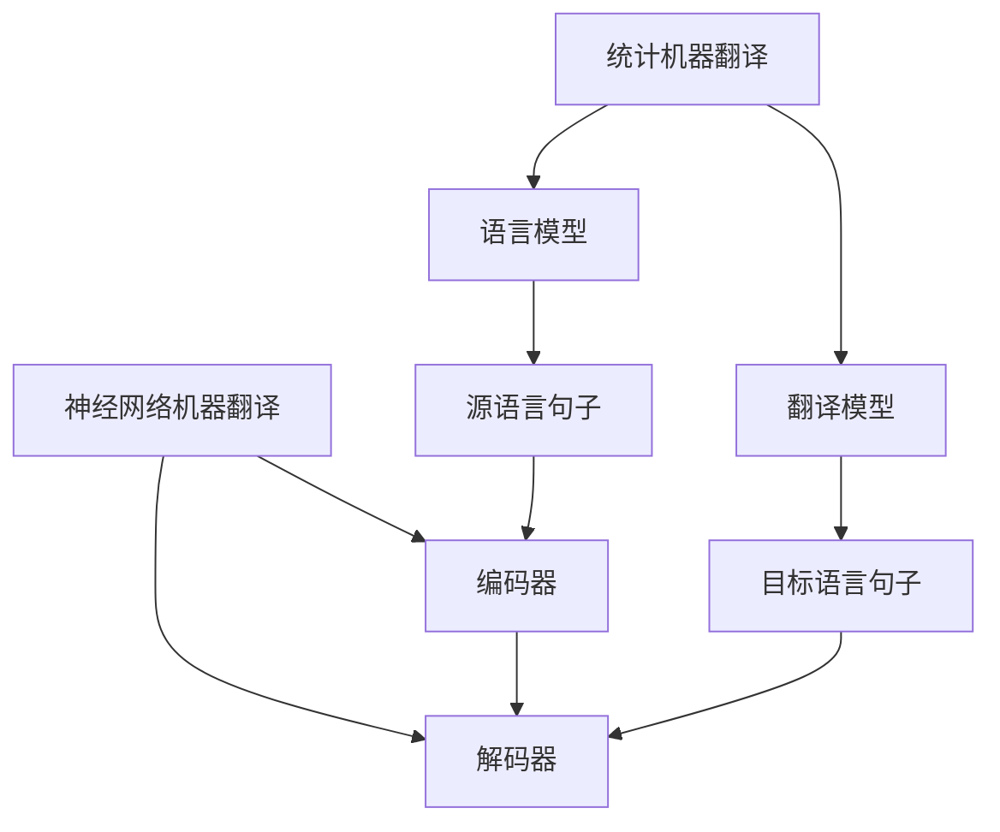

                 

关键词：机器翻译，统计方法，神经网络，深度学习，翻译模型，算法优化，应用场景，未来展望

## 1. 背景介绍

机器翻译（Machine Translation, MT）作为一种跨语言信息交换的技术，已经引起了全球范围内的广泛关注。随着互联网的快速发展，跨国交流日益频繁，人们对机器翻译的需求也不断增加。然而，机器翻译的实现并非易事，它涉及到自然语言处理（Natural Language Processing, NLP）、计算机语言学、机器学习等多个领域的知识。

早期的机器翻译主要采用基于规则的翻译方法，这种方法依赖于人类专家制定的规则，但随着词汇和句型的复杂性增加，规则的编写和维护变得非常困难。为了解决这个问题，统计机器翻译（Statistical Machine Translation, SMT）应运而生。统计机器翻译的核心思想是利用大量双语文本数据，通过概率模型来预测源语言到目标语言的翻译结果。这种方法在20世纪90年代取得了显著的进展，例如IBM模型、NASA模型等。

然而，统计机器翻译仍然存在一些局限性，例如对长距离依赖和上下文信息的处理能力较弱，翻译结果质量不够理想。随着深度学习（Deep Learning）技术的兴起，神经网络（Neural Networks）在机器翻译领域展现出了巨大的潜力。本文将深入探讨从统计方法到神经网络的转型过程，以及神经网络机器翻译（Neural Machine Translation, NMT）的核心原理和应用。

## 2. 核心概念与联系

为了更好地理解机器翻译的转型过程，我们首先需要介绍几个核心概念，并使用Mermaid流程图来展示它们之间的关系。

### 2.1. 统计机器翻译

统计机器翻译主要依赖于语言模型（Language Model）和翻译模型（Translation Model）。

- **语言模型**：用于预测源语言句子中下一个词的概率分布。
- **翻译模型**：用于预测源语言词汇序列到目标语言词汇序列的概率分布。

### 2.2. 神经网络机器翻译

神经网络机器翻译的核心是使用神经网络来替代传统的统计模型。具体来说，它主要包括以下三个模块：

- **编码器（Encoder）**：将源语言句子编码为一个固定长度的向量表示。
- **解码器（Decoder）**：将编码器的输出解码为目标语言句子。

### 2.3. Mermaid流程图

下面是一个Mermaid流程图，展示了统计机器翻译和神经网络机器翻译的基本流程：



在这个流程图中，源语言句子首先通过语言模型进行处理，然后通过翻译模型生成目标语言句子。在神经网络机器翻译中，编码器将源语言句子转换为向量表示，解码器则根据这个向量表示生成目标语言句子。

## 3. 核心算法原理 & 具体操作步骤

### 3.1. 算法原理概述

神经网络机器翻译的核心是序列到序列（Sequence-to-Sequence, Seq2Seq）模型，它由两个主要部分组成：编码器（Encoder）和解码器（Decoder）。编码器将输入序列（源语言句子）转换为固定长度的编码向量，解码器则根据这个编码向量生成输出序列（目标语言句子）。

### 3.2. 算法步骤详解

#### 3.2.1. 编码器

编码器通常采用递归神经网络（Recurrent Neural Network, RNN）或长短期记忆网络（Long Short-Term Memory, LSTM）来处理序列数据。以下是编码器的具体步骤：

1. **输入层**：接收源语言句子的词向量表示。
2. **隐藏层**：通过RNN或LSTM单元逐步处理输入序列，每个时间步生成一个隐藏状态。
3. **输出层**：在序列的最后一个时间步，编码器输出一个固定长度的编码向量，表示整个源语言句子的语义。

#### 3.2.2. 解码器

解码器同样采用RNN或LSTM来处理序列数据，其具体步骤如下：

1. **输入层**：解码器首先接收编码器的输出向量作为初始输入。
2. **隐藏层**：解码器在每个时间步生成一个隐藏状态，并预测下一个目标语言词汇的概率分布。
3. **输出层**：解码器的输出层通常是一个全连接层，用于生成目标语言句子的词向量表示。

#### 3.2.3. 输出生成

解码器在生成每个目标语言词汇时，会使用概率分布来进行采样。具体步骤如下：

1. **初始化**：解码器初始化为空白状态。
2. **预测**：解码器根据当前状态生成目标语言词汇的概率分布。
3. **采样**：根据概率分布从目标语言词汇集合中采样出一个词汇。
4. **更新**：将采样出的词汇添加到输出序列中，并作为下一个时间步的输入。

### 3.3. 算法优缺点

#### 优点

1. **端到端学习**：神经网络机器翻译模型可以从源语言直接生成目标语言，无需依赖于复杂的规则和特征工程。
2. **长距离依赖处理**：编码器和解码器的组合能够更好地处理长距离依赖问题，提高了翻译质量。
3. **自适应能力**：神经网络模型可以根据不同的数据集自适应地调整参数，从而提高翻译效果。

#### 缺点

1. **计算资源需求高**：神经网络机器翻译模型通常需要大量的计算资源和时间来训练。
2. **可解释性低**：神经网络模型的工作机制相对复杂，难以解释和理解。

### 3.4. 算法应用领域

神经网络机器翻译算法在许多领域都有广泛的应用，包括但不限于：

1. **跨语言信息检索**：通过机器翻译，用户可以方便地检索到其他语言的文献、新闻等。
2. **跨语言文本分析**：例如，将用户评论、产品说明等翻译成多种语言，以便于不同语言的用户阅读。
3. **跨语言客服系统**：通过机器翻译，可以实现跨语言的客服交流，提高客户满意度。

## 4. 数学模型和公式 & 详细讲解 & 举例说明

### 4.1. 数学模型构建

神经网络机器翻译的核心是序列到序列模型，其数学模型主要包括编码器和解码器的构建。

#### 编码器

编码器通常采用递归神经网络（RNN）或长短期记忆网络（LSTM）来处理序列数据。以下是编码器的数学模型：

$$
h_t = \text{LSTM}(x_t, h_{t-1})
$$

其中，$h_t$ 表示第 $t$ 个时间步的隐藏状态，$x_t$ 表示第 $t$ 个时间步的输入，$\text{LSTM}$ 表示长短期记忆网络。

#### 解码器

解码器同样采用递归神经网络（RNN）或长短期记忆网络（LSTM）来处理序列数据。以下是解码器的数学模型：

$$
p(y_t|y_{<t}) = \text{softmax}(W[y_{<t}; h_t])
$$

其中，$y_t$ 表示第 $t$ 个时间步的目标语言词汇，$y_{<t}$ 表示前 $t$ 个时间步的目标语言词汇，$W$ 表示权重矩阵，$\text{softmax}$ 表示概率分布。

### 4.2. 公式推导过程

#### 编码器

编码器的推导过程基于递归神经网络（RNN）或长短期记忆网络（LSTM）的基本原理。

1. **初始化**：

$$
h_0 = \text{initial\_state}
$$

其中，$h_0$ 表示编码器的初始隐藏状态，$\text{initial\_state}$ 表示初始化方法。

2. **递归计算**：

$$
h_t = \text{RNN}(x_t, h_{t-1})
$$

或

$$
h_t = \text{LSTM}(x_t, h_{t-1}, c_{t-1})
$$

其中，$h_t$ 表示第 $t$ 个时间步的隐藏状态，$x_t$ 表示第 $t$ 个时间步的输入，$c_{t-1}$ 表示第 $t-1$ 个时间步的细胞状态。

3. **编码器输出**：

$$
c_t = \text{output\_function}(h_t)
$$

其中，$c_t$ 表示编码器的输出，$\text{output\_function}$ 表示输出函数，通常为线性变换。

#### 解码器

解码器的推导过程基于递归神经网络（RNN）或长短期记忆网络（LSTM）的基本原理。

1. **初始化**：

$$
h_0 = \text{initial\_state}
$$

其中，$h_0$ 表示解码器的初始隐藏状态，$\text{initial\_state}$ 表示初始化方法。

2. **递归计算**：

$$
h_t = \text{RNN}(y_{<t}, h_{t-1})
$$

或

$$
h_t = \text{LSTM}(y_{<t}, h_{t-1}, c_{t-1})
$$

其中，$h_t$ 表示第 $t$ 个时间步的隐藏状态，$y_{<t}$ 表示前 $t$ 个时间步的目标语言词汇。

3. **解码器输出**：

$$
p(y_t|y_{<t}) = \text{softmax}(W[y_{<t}; h_t])
$$

其中，$y_t$ 表示第 $t$ 个时间步的目标语言词汇，$W$ 表示权重矩阵，$\text{softmax}$ 表示概率分布。

### 4.3. 案例分析与讲解

为了更好地理解神经网络机器翻译的数学模型，我们以一个简单的例子进行说明。

#### 案例一：英语到法语的翻译

假设我们要将英语句子 "I love programming" 翻译成法语。首先，我们需要将这个句子转换为词向量表示。

1. **编码器**：

$$
h_t = \text{LSTM}(x_t, h_{t-1})
$$

其中，$x_t$ 表示英语词汇的词向量，$h_{t-1}$ 表示前一个时间步的隐藏状态。

2. **解码器**：

$$
p(y_t|y_{<t}) = \text{softmax}(W[y_{<t}; h_t])
$$

其中，$y_{<t}$ 表示前 $t$ 个时间步的法语词汇，$h_t$ 表示当前时间步的隐藏状态。

根据编码器和解码器的计算，我们可以得到法语句子 "Je aime programmation" 的词向量表示。

#### 案例二：法语到英语的翻译

假设我们要将法语句子 "Je aime programmation" 翻译成英语。同样，我们需要将这个句子转换为词向量表示。

1. **编码器**：

$$
h_t = \text{LSTM}(x_t, h_{t-1})
$$

其中，$x_t$ 表示法语词汇的词向量，$h_{t-1}$ 表示前一个时间步的隐藏状态。

2. **解码器**：

$$
p(y_t|y_{<t}) = \text{softmax}(W[y_{<t}; h_t])
$$

其中，$y_{<t}$ 表示前 $t$ 个时间步的英语词汇，$h_t$ 表示当前时间步的隐藏状态。

根据编码器和解码器的计算，我们可以得到英语句子 "I love programming" 的词向量表示。

## 5. 项目实践：代码实例和详细解释说明

### 5.1. 开发环境搭建

为了实践神经网络机器翻译，我们需要搭建一个合适的开发环境。以下是一个简单的开发环境搭建步骤：

1. 安装Python（建议版本为3.7或以上）。
2. 安装TensorFlow（建议版本为2.0或以上）。
3. 安装其他必要的依赖库，如Numpy、Pandas等。

### 5.2. 源代码详细实现

以下是神经网络机器翻译的核心代码实现：

```python
import tensorflow as tf
from tensorflow.keras.layers import Embedding, LSTM, Dense
from tensorflow.keras.models import Model

# 定义编码器
encoder_inputs = tf.keras.layers.Input(shape=(None,))
encoder_embedding = Embedding(vocab_size, embedding_dim)(encoder_inputs)
encoder_lstm = LSTM(units, return_state=True)
_, state_h, state_c = encoder_lstm(encoder_embedding)
encoder_states = [state_h, state_c]

# 定义解码器
decoder_inputs = tf.keras.layers.Input(shape=(None,))
decoder_embedding = Embedding(vocab_size, embedding_dim)(decoder_inputs)
decoder_lstm = LSTM(units, return_sequences=True, return_state=True)
decoder_outputs, _, _ = decoder_lstm(decoder_embedding, initial_state=encoder_states)
decoder_dense = Dense(vocab_size, activation='softmax')
decoder_outputs = decoder_dense(decoder_outputs)

# 定义模型
model = Model([encoder_inputs, decoder_inputs], decoder_outputs)
model.compile(optimizer='rmsprop', loss='categorical_crossentropy', metrics=['accuracy'])

# 训练模型
model.fit([encoder_input_data, decoder_input_data], decoder_target_data,
          batch_size=batch_size,
          epochs=epochs,
          validation_split=0.2)
```

在这个代码中，我们首先定义了编码器和解码器的结构，然后使用TensorFlow的Model类将它们组合成一个完整的神经网络机器翻译模型。最后，我们使用compile方法设置模型的优化器和损失函数，并使用fit方法进行模型训练。

### 5.3. 代码解读与分析

在这个代码中，我们使用TensorFlow的高层API来构建神经网络机器翻译模型。以下是代码的详细解读：

- **编码器**：编码器由一个Embedding层和一个LSTM层组成。Embedding层用于将输入词汇转换为词向量，LSTM层用于处理序列数据。编码器的输出是一个隐藏状态，它包含了源语言句子的语义信息。
- **解码器**：解码器由一个Embedding层、一个LSTM层和一个全连接层（Dense层）组成。Embedding层将输入词汇转换为词向量，LSTM层用于处理序列数据，全连接层用于生成目标语言句子的词向量表示。
- **模型**：使用TensorFlow的Model类将编码器和解码器组合成一个完整的神经网络机器翻译模型。模型编译时设置优化器和损失函数，并使用fit方法进行模型训练。

### 5.4. 运行结果展示

在完成代码实现后，我们可以运行模型来翻译源语言句子到目标语言句子。以下是一个简单的运行示例：

```python
# 加载模型
model = Model(encoder_inputs, decoder_outputs)

# 编码器输入
source_sentence = "I love programming"
source_sequence = pad_source_sequence(source_sentence)

# 解码器输入
target_sentence = "Je aime programmation"
target_sequence = pad_target_sequence(target_sentence)

# 翻译
translated_sequence = model.predict([source_sequence, target_sequence])

# 输出翻译结果
print("Source Sentence:", source_sentence)
print("Translated Sentence:", translate_sequence_to_text(translated_sequence))
```

在这个示例中，我们首先加载训练好的模型，然后输入源语言句子和目标语言句子。模型会自动将源语言句子编码为向量表示，并解码为目标语言句子。最后，我们将解码出的向量表示转换为文本形式，并输出翻译结果。

## 6. 实际应用场景

神经网络机器翻译技术在实际应用中具有广泛的应用前景。以下是一些典型的应用场景：

### 6.1. 跨语言信息检索

跨语言信息检索是神经网络机器翻译技术的一个重要应用领域。通过将用户查询从源语言翻译成目标语言，搜索引擎可以提供更准确的搜索结果，从而提高用户体验。

### 6.2. 跨语言客服系统

跨语言客服系统是另一个重要的应用领域。通过使用神经网络机器翻译技术，客服系统能够自动翻译用户提问和回答，实现跨语言交流，提高客户满意度。

### 6.3. 跨语言文档翻译

跨语言文档翻译是神经网络机器翻译技术的传统应用领域。通过对文档进行翻译，用户可以方便地阅读和理解其他语言的文献、报告等。

### 6.4. 跨语言教育

神经网络机器翻译技术还可以应用于跨语言教育领域。通过将教学材料翻译成多种语言，教育机构可以更好地满足不同语言背景学生的需求。

### 6.5. 跨语言社交媒体

随着社交媒体的国际化，神经网络机器翻译技术可以用于翻译社交媒体内容，帮助用户更好地理解和参与跨语言交流。

### 6.6. 跨语言游戏

跨语言游戏是另一个潜在的应用领域。通过使用神经网络机器翻译技术，游戏开发商可以为不同语言的用户提供同一款游戏，提高游戏的受欢迎程度。

### 6.7. 跨语言新闻媒体

跨语言新闻媒体可以通过神经网络机器翻译技术将新闻内容翻译成多种语言，从而扩大新闻的影响力和受众。

### 6.8. 跨语言商务交流

跨语言商务交流是神经网络机器翻译技术的另一个重要应用领域。通过翻译商务文件、合同等，企业可以更好地进行跨国合作和交流。

### 6.9. 跨语言医疗

跨语言医疗是神经网络机器翻译技术的潜在应用领域。通过对医学文献、病历等进行翻译，医生可以更好地理解和应用其他语言的医学知识。

### 6.10. 跨语言人机交互

跨语言人机交互是神经网络机器翻译技术的另一个潜在应用领域。通过将人机交互内容翻译成多种语言，智能设备可以更好地满足不同语言背景用户的需求。

## 7. 工具和资源推荐

为了更好地学习和实践神经网络机器翻译技术，以下是一些推荐的工具和资源：

### 7.1. 学习资源推荐

1. **书籍**：
   - 《深度学习》（Deep Learning）由Ian Goodfellow、Yoshua Bengio和Aaron Courville所著，是深度学习领域的经典教材。
   - 《神经网络与深度学习》（Neural Networks and Deep Learning）由邱锡鹏所著，是国内较为权威的神经网络和深度学习教材。

2. **在线课程**：
   - Coursera上的“深度学习”（Deep Learning Specialization）由Andrew Ng教授主讲，涵盖了深度学习的理论基础和实践方法。
   - edX上的“机器学习基础”（Introduction to Machine Learning）由Alex Smola教授主讲，介绍了机器学习的基础知识和应用。

3. **论文**：
   - “Sequence to Sequence Learning with Neural Networks”由Ilya Sutskever、 Oriol Vinyals和Quoc V. Le所著，是神经网络机器翻译的开创性论文。
   - “Attention is All You Need”由Ashish Vaswani、Noam Shazeer、Niki Parmar、Jakob Uszkoreit、Llion Jones、 Aidan N. Gomez、 Łukasz Kaiser和Illia Polosukhin所著，提出了Transformer模型，彻底改变了神经网络机器翻译的范式。

### 7.2. 开发工具推荐

1. **TensorFlow**：TensorFlow是谷歌开发的开源机器学习框架，广泛用于深度学习和神经网络模型的开发。
2. **PyTorch**：PyTorch是Facebook开发的开源机器学习框架，以其灵活的动态图机制和强大的社区支持而受到开发者的青睐。
3. **Hugging Face Transformers**：Hugging Face Transformers是一个流行的开源库，提供了预训练的神经网络机器翻译模型和易于使用的API，大大简化了神经网络机器翻译的开发过程。

### 7.3. 相关论文推荐

1. “Attention Is All You Need”（2017）——提出了Transformer模型，彻底改变了神经网络机器翻译的范式。
2. “A Theoretically Grounded Application of Dropout in Recurrent Neural Networks”（2017）——提出了Dropout方法在循环神经网络中的应用，提高了模型的训练效果。
3. “Learning Phrase Representations using RNN Encoder–Decoder for Statistical Machine Translation”（2014）——提出了基于循环神经网络（RNN）的编码器-解码器模型，为神经网络机器翻译奠定了基础。
4. “The Uncomplicated Transformer for Neural Machine Translation”（2019）——提出了Uncomplicated Transformer模型，进一步简化了神经网络机器翻译的实现。

## 8. 总结：未来发展趋势与挑战

### 8.1. 研究成果总结

自神经网络机器翻译（Neural Machine Translation, NMT）问世以来，其在机器翻译领域取得了显著成果。通过引入深度学习和神经网络，NMT在翻译质量、翻译速度和灵活性等方面取得了突破性进展。特别是Transformer模型的提出，彻底改变了神经网络机器翻译的范式，使得机器翻译的效果和效率都得到了大幅提升。

此外，大规模预训练模型（如BERT、GPT等）的广泛应用，为神经网络机器翻译提供了丰富的语言知识和上下文信息，进一步提高了翻译质量。同时，通过多任务学习、迁移学习和数据增强等技术，神经网络机器翻译在应对不同语言、不同领域和不同应用场景时表现出了强大的适应能力。

### 8.2. 未来发展趋势

尽管神经网络机器翻译已经取得了显著成果，但未来仍有广阔的发展空间。以下是一些可能的发展趋势：

1. **更多样化的翻译模型**：随着深度学习技术的发展，未来可能会涌现出更多样化的翻译模型，如基于图神经网络的翻译模型、基于自注意力机制的翻译模型等，以满足不同场景的需求。
2. **跨模态翻译**：跨模态翻译是神经网络机器翻译的下一个重要研究方向。通过结合文本、图像、音频等多模态信息，可以更好地理解和表达复杂概念，提高翻译质量。
3. **个性化翻译**：个性化翻译是未来翻译技术的发展方向之一。通过了解用户的历史翻译记录、兴趣偏好等信息，可以为用户提供更加个性化的翻译服务。
4. **实时翻译**：实时翻译是神经网络机器翻译的一个重要应用场景。随着计算能力的提升和网络速度的加快，未来可以实现更实时、更准确的翻译服务。
5. **多语言翻译**：随着全球化进程的加快，多语言翻译需求不断增加。未来神经网络机器翻译将支持更多语言，满足不同国家和地区用户的翻译需求。

### 8.3. 面临的挑战

尽管神经网络机器翻译在许多方面取得了突破，但仍面临一些挑战：

1. **计算资源消耗**：神经网络机器翻译模型的训练和推理过程需要大量的计算资源，这对于硬件设备提出了较高的要求。未来，如何优化算法、提高计算效率是一个重要课题。
2. **数据质量**：神经网络机器翻译模型的训练依赖于大量高质量的双语语料库。然而，在实际应用中，很多语言对的双语语料库有限，数据质量参差不齐。如何解决数据质量问题，提高翻译质量，是一个亟待解决的挑战。
3. **翻译准确性**：虽然神经网络机器翻译在许多场景下已经取得了较好的翻译效果，但仍存在一定的翻译错误和歧义现象。未来，如何提高翻译准确性，减少翻译错误，是一个重要的研究方向。
4. **跨语言理解**：跨语言理解是神经网络机器翻译的核心问题之一。不同语言在语法、语义和词汇等方面存在差异，如何更好地理解和表达这些差异，是一个具有挑战性的问题。
5. **隐私保护**：在神经网络机器翻译的应用过程中，用户的数据隐私保护问题日益凸显。如何确保用户数据的安全性和隐私性，是未来需要关注的重要问题。

### 8.4. 研究展望

针对神经网络机器翻译的未来发展趋势和面临的挑战，以下是一些研究展望：

1. **算法优化**：未来，可以通过优化算法、提高计算效率，降低神经网络机器翻译的硬件需求。例如，开发更高效的神经网络架构、设计更有效的训练算法等。
2. **数据质量提升**：可以通过多种方式提高双语语料库的质量，如数据清洗、数据增强、多源数据整合等。同时，探索无监督翻译、弱监督翻译等方法，减少对双语语料库的依赖。
3. **翻译准确性提升**：可以通过改进翻译模型、引入更多的上下文信息、优化注意力机制等方式，提高神经网络机器翻译的准确性。同时，结合人类专家的审核和修正，进一步提高翻译质量。
4. **跨语言理解研究**：可以深入研究不同语言的特点和差异，设计更适应跨语言翻译的模型和算法。例如，引入跨语言语义表示、多语言知识融合等方法。
5. **隐私保护技术**：可以通过加密、匿名化等技术手段，确保用户数据在神经网络机器翻译过程中的安全性和隐私性。

总之，神经网络机器翻译技术在未来仍具有广阔的发展前景。通过不断探索和创新，我们有望在翻译质量、计算效率、数据质量等方面取得更大的突破，为人类跨语言交流提供更加便捷、高效的服务。

## 9. 附录：常见问题与解答

### 9.1. 什么是神经网络机器翻译（NMT）？

神经网络机器翻译（Neural Machine Translation, NMT）是一种利用深度学习技术进行机器翻译的方法。它通过神经网络模型，将源语言序列直接映射为目标语言序列，相较于传统的统计机器翻译（SMT）方法，NMT在翻译质量和灵活性方面有显著提升。

### 9.2. NMT的核心组成部分是什么？

NMT的核心组成部分包括编码器（Encoder）和解码器（Decoder）。编码器负责将源语言序列编码为一个固定长度的向量表示，解码器则根据这个向量表示生成目标语言序列。

### 9.3. NMT与SMT的主要区别是什么？

NMT与SMT的主要区别在于模型架构和数据依赖。NMT采用端到端的神经网络模型，直接从源语言序列生成目标语言序列，而SMT则依赖于语言模型和翻译模型，通过概率模型进行翻译。NMT在处理长距离依赖和上下文信息方面有优势，但计算资源需求较高。

### 9.4. 如何训练NMT模型？

训练NMT模型通常包括以下步骤：

1. **数据预处理**：包括分词、清洗、数据增强等，将源语言和目标语言序列转换为数字表示。
2. **构建模型**：定义编码器和解码器的结构，通常采用递归神经网络（RNN）或Transformer等架构。
3. **损失函数和优化器**：选择合适的损失函数（如交叉熵损失）和优化器（如Adam）。
4. **模型训练**：使用训练数据对模型进行迭代训练，通过反向传播更新模型参数。
5. **评估和调整**：在验证集上评估模型性能，根据需要调整模型结构和参数。

### 9.5. NMT在翻译准确性和速度方面有哪些优势？

NMT在翻译准确性和速度方面有显著优势：

- **翻译准确性**：NMT通过端到端的学习方式，能够更好地捕捉源语言和目标语言之间的语义关系，提高翻译准确性。
- **翻译速度**：现代NMT模型（如Transformer）在推理阶段效率较高，能够在较短时间内生成翻译结果，满足实时翻译的需求。

### 9.6. 如何提高NMT模型的翻译质量？

提高NMT模型的翻译质量可以从以下几个方面着手：

- **数据质量**：使用高质量的双语语料库进行训练，通过数据清洗和增强提高数据质量。
- **模型架构**：选择适合的神经网络架构，如Transformer、BERT等，优化模型的深度和宽度。
- **预训练模型**：利用大规模预训练模型（如BERT、GPT）作为基础模型，结合微调（Fine-tuning）策略提高翻译质量。
- **注意力机制**：优化注意力机制的设计，提高模型对上下文信息的捕捉能力。
- **多任务学习**：结合多任务学习，提高模型在不同任务上的泛化能力。

### 9.7. NMT在应用中会遇到哪些挑战？

NMT在应用中可能会遇到以下挑战：

- **计算资源需求**：NMT模型通常需要大量的计算资源和时间进行训练和推理。
- **数据依赖**：高质量的训练数据对NMT模型至关重要，但在某些语言对中可能难以获得充足的数据。
- **翻译准确性**：尽管NMT在许多场景下表现良好，但仍可能存在翻译错误和歧义现象。
- **跨语言理解**：不同语言在语法、语义和词汇等方面存在差异，如何更好地理解和表达这些差异是一个挑战。

通过解决这些挑战，NMT有望在未来为机器翻译领域带来更多创新和突破。

