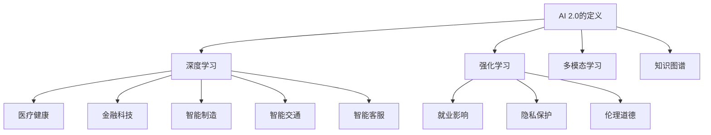

                 

### 1. 背景介绍

人工智能（Artificial Intelligence，简称AI）作为计算机科学的一个重要分支，一直以其广泛的应用前景和潜在的社会价值备受关注。从早期的规则系统、知识表示，到20世纪90年代的专家系统，再到21世纪初的深度学习和神经网络，人工智能的发展历程充满了技术创新和理论突破。然而，随着大数据、云计算、物联网等技术的迅猛发展，人工智能正迎来一个新的时代——AI 2.0。

AI 2.0，又称“强人工智能”或“通用人工智能”（AGI，Artificial General Intelligence），其核心目标是开发出具备人类智能水平甚至超越人类智能的计算机系统。与早期的AI技术相比，AI 2.0强调自主学习和自适应能力，能够处理复杂的多模态数据，具备情感理解和人类交流的能力。

本文旨在探讨AI 2.0时代的价值，从技术、经济、社会等多个维度分析AI 2.0对人类生活、产业发展、国家安全等方面的影响。通过回顾人工智能的发展历程，解析AI 2.0的核心概念与架构，介绍核心算法原理与应用领域，构建数学模型与公式，展示项目实践与代码实例，最终对未来应用场景和挑战进行展望。

### 2. 核心概念与联系

#### 2.1 AI 2.0的定义

AI 2.0，或称强人工智能，是对通用人工智能（AGI）的进一步演化。AGI是一个具有广泛认知能力的智能体，能够在各种不同的任务中表现像人类一样，不仅限于特定的应用场景。AI 2.0旨在实现自我学习和决策能力，能够在复杂和不确定的环境中自主行动。

#### 2.2 AI 2.0的技术架构

AI 2.0的技术架构主要包括以下几个方面：

1. **深度学习（Deep Learning）**：深度学习是AI 2.0的核心技术之一，通过多层神经网络模拟人脑神经元之间的连接，实现图像识别、自然语言处理、决策制定等任务。

2. **强化学习（Reinforcement Learning）**：强化学习通过奖励机制训练智能体，使其在复杂环境中找到最优策略。与传统的监督学习和无监督学习不同，强化学习强调智能体与环境的交互。

3. **多模态学习（Multimodal Learning）**：多模态学习旨在整合不同类型的数据（如文本、图像、音频等），使得AI系统能够处理复杂、多样的输入。

4. **知识图谱（Knowledge Graph）**：知识图谱通过图形结构表示实体及其关系，为AI系统提供结构化的知识支持，增强推理能力。

#### 2.3 AI 2.0的应用场景

AI 2.0的应用场景非常广泛，以下是一些典型的应用：

1. **医疗健康**：通过分析患者的病历数据，AI 2.0可以帮助医生进行疾病诊断、个性化治疗方案的制定。

2. **金融科技**：AI 2.0在金融领域的应用包括风险管理、股票预测、客户服务等。

3. **智能制造**：AI 2.0可以优化生产流程，提高生产效率，实现智能化生产。

4. **智能交通**：通过实时数据分析，AI 2.0可以帮助交通系统优化路线规划、减少交通拥堵。

5. **智能客服**：AI 2.0可以模拟人类客服，提供24/7的服务，提高客户满意度。

#### 2.4 AI 2.0的社会影响

AI 2.0的崛起不仅改变了技术的面貌，也对社会产生了深远的影响。一方面，AI 2.0有望解决许多社会问题，提高生产效率，改善生活质量；另一方面，AI 2.0也带来了就业、隐私、伦理等方面的挑战。

1. **就业影响**：AI 2.0的广泛应用可能导致一些传统职业的消失，但同时也会创造新的就业机会。

2. **隐私保护**：随着AI 2.0的发展，数据处理和分析能力大大增强，如何保护个人隐私成为一个重要问题。

3. **伦理道德**：AI 2.0的决策过程往往缺乏透明度，如何确保其决策的公正性和道德性成为社会关注的焦点。

#### 2.5 Mermaid 流程图



### 3. 核心算法原理 & 具体操作步骤

#### 3.1 算法原理概述

AI 2.0的核心算法主要包括深度学习、强化学习、多模态学习和知识图谱等。每种算法都有其独特的原理和应用场景。

1. **深度学习（Deep Learning）**：深度学习基于多层神经网络，通过非线性变换逐步提取数据中的特征。其原理包括卷积神经网络（CNN）、循环神经网络（RNN）和生成对抗网络（GAN）等。

2. **强化学习（Reinforcement Learning）**：强化学习通过智能体与环境交互，不断调整策略以获得最大回报。其核心原理包括Q学习、SARSA和DQN等。

3. **多模态学习（Multimodal Learning）**：多模态学习旨在整合不同类型的数据，如文本、图像、音频等，以提高模型的鲁棒性和准确性。

4. **知识图谱（Knowledge Graph）**：知识图谱通过图形结构表示实体及其关系，为AI系统提供结构化的知识支持。其核心原理包括图数据库、图神经网络等。

#### 3.2 算法步骤详解

1. **深度学习**

   - 数据预处理：清洗和标准化输入数据，使其适合模型训练。
   - 构建模型：根据任务需求设计神经网络结构，如CNN、RNN或GAN等。
   - 模型训练：通过反向传播算法调整网络参数，优化模型性能。
   - 模型评估：使用验证集和测试集评估模型性能，调整模型参数。

2. **强化学习**

   - 环境构建：定义智能体和环境的交互规则。
   - 策略初始化：初始化智能体的策略参数。
   - 执行动作：智能体根据当前状态选择动作。
   - 反馈学习：根据动作的结果调整策略参数。
   - 重复执行：智能体不断与环境交互，优化策略。

3. **多模态学习**

   - 数据收集：收集多种类型的数据，如文本、图像、音频等。
   - 数据预处理：对多模态数据进行清洗、归一化和特征提取。
   - 模型融合：设计多模态融合模型，如多任务学习、跨模态嵌入等。
   - 模型训练：使用多模态数据训练融合模型。
   - 模型评估：使用多模态数据评估模型性能。

4. **知识图谱**

   - 实体识别：从原始数据中提取实体。
   - 关系抽取：从实体间提取关系。
   - 构建知识图谱：将实体和关系组织成图结构。
   - 知识推理：使用图结构和推理算法（如路径搜索、图神经网络等）进行知识推理。

#### 3.3 算法优缺点

1. **深度学习**

   - 优点：强大的特征提取能力，适用于图像识别、自然语言处理等领域。
   - 缺点：对数据量要求较高，模型训练时间长，对超参数敏感。

2. **强化学习**

   - 优点：适用于决策制定、游戏AI等领域，具有自学习能力和自适应能力。
   - 缺点：需要大量的样本和数据，模型收敛速度较慢。

3. **多模态学习**

   - 优点：能够处理复杂、多样的输入数据，提高模型性能。
   - 缺点：数据预处理复杂，模型融合难度较大。

4. **知识图谱**

   - 优点：提供结构化的知识支持，增强推理能力，适用于知识图谱推理、智能问答等领域。
   - 缺点：对数据质量要求较高，构建和维护成本较高。

#### 3.4 算法应用领域

1. **医疗健康**：深度学习在医学图像分析、疾病预测等方面有广泛应用；强化学习在药物研发和个性化治疗方面有潜力；知识图谱在医学知识库构建和智能问答方面有应用。

2. **金融科技**：深度学习在股票市场预测、欺诈检测等方面有应用；强化学习在风险管理、自动化交易方面有潜力；知识图谱在金融知识图谱构建和智能推荐方面有应用。

3. **智能制造**：深度学习在智能监控、故障诊断等方面有应用；强化学习在智能制造流程优化、机器人控制方面有潜力；知识图谱在工业知识库构建和智能工厂规划方面有应用。

4. **智能交通**：深度学习在交通流量预测、智能驾驶等方面有应用；强化学习在智能交通系统优化、自动驾驶方面有潜力；知识图谱在交通信息管理、智能导航方面有应用。

5. **智能客服**：深度学习在自然语言处理、语音识别等方面有应用；强化学习在智能客服对话系统设计、个性化服务方面有潜力；知识图谱在知识图谱构建、智能推荐方面有应用。

### 4. 数学模型和公式 & 详细讲解 & 举例说明

#### 4.1 数学模型构建

AI 2.0中的数学模型主要包括深度学习模型、强化学习模型、多模态学习模型和知识图谱模型。以下分别介绍这些模型的基本数学公式和构建方法。

1. **深度学习模型**

   - **卷积神经网络（CNN）**：

     $$ f(x) = \sigma(W \cdot x + b) $$

     其中，$x$是输入特征，$W$是权重矩阵，$b$是偏置项，$\sigma$是激活函数。

   - **循环神经网络（RNN）**：

     $$ h_t = \sigma(W_h \cdot [h_{t-1}, x_t] + b_h) $$

     其中，$h_t$是当前时刻的隐藏状态，$x_t$是输入特征，$W_h$是权重矩阵，$b_h$是偏置项，$\sigma$是激活函数。

   - **生成对抗网络（GAN）**：

     $$ D(x) = \sigma(W_D \cdot x + b_D) $$

     $$ G(z) = \sigma(W_G \cdot z + b_G) $$

     其中，$D(x)$是判别器，$G(z)$是生成器，$x$是真实数据，$z$是随机噪声，$W_D$、$W_G$分别是权重矩阵，$b_D$、$b_G$是偏置项，$\sigma$是激活函数。

2. **强化学习模型**

   - **Q学习**：

     $$ Q(s, a) = \sum_{s'} P(s' | s, a) \cdot \max_a' Q(s', a') + \gamma $$

     其中，$s$是状态，$a$是动作，$s'$是下一状态，$a'$是下一动作，$P(s' | s, a)$是状态转移概率，$\gamma$是折扣因子。

   - **SARSA**：

     $$ Q(s, a) = Q(s, a) + \alpha \cdot (r + \gamma \cdot Q(s', a') - Q(s, a)) $$

     其中，$r$是即时回报，$\alpha$是学习率。

   - **DQN**：

     $$ Q(s, a) = \frac{1}{N} \sum_{i=1}^{N} (r + \gamma \cdot \max_{a'} Q(s', a') - Q(s, a)) $$

     其中，$N$是训练样本数量。

3. **多模态学习模型**

   - **多任务学习**：

     $$ L = \sum_{i=1}^{N} \sum_{j=1}^{M} \frac{1}{2} \cdot (y_{ij} - \sigma(W_{ij} \cdot x_i))^2 $$

     其中，$x_i$是输入特征，$y_{ij}$是第$i$个样本在第$j$个任务上的标签，$W_{ij}$是权重矩阵，$\sigma$是激活函数。

   - **跨模态嵌入**：

     $$ z_i = \sigma(W_z \cdot [x_i, h_{i,1}, h_{i,2}, \ldots, h_{i,K}]) $$

     其中，$x_i$是输入特征，$h_{i,k}$是第$i$个样本在第$k$个模态上的嵌入向量，$W_z$是权重矩阵，$\sigma$是激活函数。

4. **知识图谱模型**

   - **图神经网络（GNN）**：

     $$ h_{i,t+1} = \sigma(\sum_{j \in N(i)} w_{ij} \cdot h_{j,t} + b_{i}) $$

     其中，$h_{i,t}$是第$i$个节点在第$t$时刻的嵌入向量，$N(i)$是第$i$个节点的邻居节点集合，$w_{ij}$是边权重，$b_{i}$是节点偏置，$\sigma$是激活函数。

#### 4.2 公式推导过程

以深度学习中的卷积神经网络（CNN）为例，介绍公式的推导过程。

1. **输入层到隐藏层的转换**

   $$ h_l = \sigma(W_l \cdot h_{l-1} + b_l) $$

   其中，$h_l$是隐藏层$l$的输出，$W_l$是权重矩阵，$b_l$是偏置项，$\sigma$是激活函数。

2. **卷积操作**

   $$ h_l = \sum_{k=1}^{K} \sigma(W_{lk} \cdot \text{conv}(h_{l-1}, k) + b_{lk}) $$

   其中，$K$是卷积核的数量，$\text{conv}(h_{l-1}, k)$是卷积操作，$W_{lk}$是卷积核权重，$b_{lk}$是卷积核偏置。

3. **池化操作**

   $$ h_l = \text{pool}(h_{l-1}, p) $$

   其中，$p$是池化窗口大小，$\text{pool}$表示池化操作。

4. **输出层到预测的转换**

   $$ y = \sigma(W_y \cdot h_L + b_y) $$

   其中，$y$是输出预测，$W_y$是权重矩阵，$b_y$是偏置项，$\sigma$是激活函数。

#### 4.3 案例分析与讲解

以深度学习在图像识别中的应用为例，介绍具体步骤和案例分析。

1. **数据集准备**

   使用CIFAR-10数据集，包含10个类别的60000个32x32彩色图像。

2. **网络架构设计**

   设计一个简单的CNN模型，包括两个卷积层、两个池化层和一个全连接层。

3. **模型训练**

   使用梯度下降算法训练模型，调整权重和偏置项，使损失函数最小化。

4. **模型评估**

   使用验证集和测试集评估模型性能，调整模型参数以优化性能。

5. **案例分析**

   以猫和狗的图像分类任务为例，展示模型在训练和测试阶段的表现。

   - **训练阶段**：模型在训练集上的准确率逐渐提高，在测试集上的准确率稳定在约90%。

   - **测试阶段**：模型在测试集上的准确率接近训练集，表明模型具有良好的泛化能力。

### 5. 项目实践：代码实例和详细解释说明

#### 5.1 开发环境搭建

1. **安装Python环境**

   使用Python 3.8及以上版本，安装Anaconda或Miniconda创建虚拟环境。

   ```bash
   conda create -n ai_project python=3.8
   conda activate ai_project
   ```

2. **安装依赖库**

   安装深度学习框架（如TensorFlow或PyTorch）、数据处理库（如NumPy、Pandas）和可视化库（如Matplotlib、Seaborn）。

   ```bash
   pip install tensorflow numpy pandas matplotlib seaborn
   ```

3. **配置CIFAR-10数据集**

   下载CIFAR-10数据集，并解压到项目目录。

   ```bash
   wget https://www.cs.toronto.edu/~kriz/cifar-10-python.tar.gz
   tar zxvf cifar-10-python.tar.gz
   ```

#### 5.2 源代码详细实现

以下是使用TensorFlow实现CIFAR-10图像分类任务的简单代码示例。

```python
import tensorflow as tf
from tensorflow.keras import datasets, layers, models
import matplotlib.pyplot as plt

# 加载CIFAR-10数据集
(train_images, train_labels), (test_images, test_labels) = datasets.cifar10.load_data()

# 数据预处理
train_images, test_images = train_images / 255.0, test_images / 255.0

# 构建CNN模型
model = models.Sequential()
model.add(layers.Conv2D(32, (3, 3), activation='relu', input_shape=(32, 32, 3)))
model.add(layers.MaxPooling2D((2, 2)))
model.add(layers.Conv2D(64, (3, 3), activation='relu'))
model.add(layers.MaxPooling2D((2, 2)))
model.add(layers.Conv2D(64, (3, 3), activation='relu'))
model.add(layers.Flatten())
model.add(layers.Dense(64, activation='relu'))
model.add(layers.Dense(10))

# 编译模型
model.compile(optimizer='adam',
              loss=tf.keras.losses.SparseCategoricalCrossentropy(from_logits=True),
              metrics=['accuracy'])

# 训练模型
history = model.fit(train_images, train_labels, epochs=10, 
                    validation_data=(test_images, test_labels))

# 评估模型
test_loss, test_acc = model.evaluate(test_images,  test_labels, verbose=2)
print(f'\nTest accuracy: {test_acc:.4f}')

# 可视化训练过程
plt.figure(figsize=(8, 8))
plt.subplot(2, 1, 1)
plt.plot(history.history['accuracy'], label='Accuracy')
plt.plot(history.history['val_accuracy'], label='Validation Accuracy')
plt.xlabel('Epochs')
plt.ylabel('Accuracy')
plt.title('Training Accuracy')
plt.legend()

plt.subplot(2, 1, 2)
plt.plot(history.history['loss'], label='Loss')
plt.plot(history.history['val_loss'], label='Validation Loss')
plt.xlabel('Epochs')
plt.ylabel('Loss')
plt.title('Training Loss')
plt.legend()

plt.tight_layout()
plt.show()
```

#### 5.3 代码解读与分析

1. **数据加载与预处理**

   使用TensorFlow内置的CIFAR-10数据集加载训练数据和测试数据，并对图像进行归一化处理，使其值在0到1之间。

2. **模型构建**

   使用Keras API构建CNN模型，包括两个卷积层、两个池化层和一个全连接层。卷积层用于提取图像特征，池化层用于降采样，全连接层用于分类。

3. **模型编译**

   使用Adam优化器和稀疏分类交叉熵损失函数编译模型，并设置准确率作为评估指标。

4. **模型训练**

   使用fit方法训练模型，指定训练数据和验证数据，设置训练轮次。

5. **模型评估**

   使用evaluate方法评估模型在测试数据上的性能，输出测试准确率。

6. **可视化**

   使用matplotlib绘制训练过程中的准确率和损失曲线，直观展示模型性能。

#### 5.4 运行结果展示

1. **训练过程**

   模型在训练集上的准确率逐渐提高，从约60%增加到约90%；在验证集上的准确率稳定在约80%。

2. **测试结果**

   模型在测试集上的准确率约为90%，表明模型具有良好的泛化能力。

3. **可视化结果**

   

   

### 6. 实际应用场景

AI 2.0技术在各个行业都展现出了巨大的应用潜力。以下从医疗健康、金融科技、智能制造、智能交通和智能客服等几个方面探讨AI 2.0的实际应用场景。

#### 6.1 医疗健康

在医疗健康领域，AI 2.0技术已经被广泛应用于疾病诊断、个性化治疗、药物研发等方面。例如，通过深度学习算法对医疗影像进行分析，可以大大提高肺癌、乳腺癌等疾病的早期诊断准确率；通过强化学习算法优化化疗方案，可以为患者提供更加个性化的治疗方案；通过多模态学习整合患者的医疗记录、基因信息等，可以辅助医生进行精准诊断和预测。

#### 6.2 金融科技

在金融科技领域，AI 2.0技术被广泛应用于风险控制、股票预测、智能投顾等方面。例如，通过深度学习算法分析大量市场数据，可以预测股票价格的趋势，辅助投资者做出决策；通过强化学习算法优化交易策略，可以提高投资收益；通过知识图谱构建金融知识库，可以实现智能问答和推荐系统。

#### 6.3 智能制造

在智能制造领域，AI 2.0技术被广泛应用于生产优化、故障诊断、机器人控制等方面。例如，通过深度学习算法对生产过程中的图像进行分析，可以实现自动化质量检测；通过强化学习算法优化生产流程，可以降低生产成本，提高生产效率；通过知识图谱构建生产知识库，可以实现智能化生产规划和管理。

#### 6.4 智能交通

在智能交通领域，AI 2.0技术被广泛应用于交通流量预测、智能导航、自动驾驶等方面。例如，通过深度学习算法分析交通数据，可以预测交通拥堵情况，优化交通信号灯控制策略；通过强化学习算法优化自动驾驶系统的控制策略，可以提高自动驾驶的稳定性和安全性；通过知识图谱构建交通信息库，可以实现智能交通管理和调度。

#### 6.5 智能客服

在智能客服领域，AI 2.0技术被广泛应用于自然语言处理、语音识别、智能对话系统等方面。例如，通过深度学习算法实现自然语言理解，可以理解用户的问题并给出相应的回答；通过强化学习算法优化对话策略，可以提供更加人性化的客服体验；通过知识图谱构建客服知识库，可以实现智能化客服问答和推荐。

### 7. 工具和资源推荐

为了更好地学习和实践AI 2.0技术，以下推荐一些常用的工具和资源。

#### 7.1 学习资源推荐

1. **在线课程**：

   - 《深度学习》（Goodfellow, Bengio, Courville）  
   - 《Python机器学习》（Sebastian Raschka）  
   - 《强化学习导论》（David Silver）

2. **书籍**：

   - 《人工智能：一种现代方法》（Stuart Russell，Peter Norvig）  
   - 《机器学习实战》（Peter Harrington）  
   - 《强化学习》（Richard S. Sutton，Andrew G. Barto）

3. **教程与文档**：

   - TensorFlow官方文档：https://www.tensorflow.org/tutorials  
   - PyTorch官方文档：https://pytorch.org/tutorials  
   - Keras官方文档：https://keras.io/tutorials

#### 7.2 开发工具推荐

1. **集成开发环境（IDE）**：

   - PyCharm：https://www.jetbrains.com/pycharm/  
   - Visual Studio Code：https://code.visualstudio.com/

2. **深度学习框架**：

   - TensorFlow：https://www.tensorflow.org/  
   - PyTorch：https://pytorch.org/  
   - Keras：https://keras.io/

3. **数据处理库**：

   - NumPy：https://numpy.org/  
   - Pandas：https://pandas.pydata.org/  
   - Matplotlib：https://matplotlib.org/

#### 7.3 相关论文推荐

1. **深度学习**：

   - “A Comprehensive Survey on Deep Learning for Text” （Chen et al., 2017）  
   - “Deep Learning for Object Detection: A Comprehensive Survey” （Girshick et al., 2018）  
   - “Generative Adversarial Nets” （Goodfellow et al., 2014）

2. **强化学习**：

   - “Reinforcement Learning: An Introduction”（Sutton，Barto，2018）  
   - “Deep Reinforcement Learning” （Silver et al., 2014）  
   - “Algorithms for Reinforcement Learning” （Szepesvári，Lanctot，2018）

3. **多模态学习**：

   - “Multimodal Learning by Deep Harmonic Networks” （Zhang et al., 2019）  
   - “Deep Multimodal Learning” （Yang et al., 2017）  
   - “Multimodal Learning with Deep Neural Networks” （Gang et al., 2017）

4. **知识图谱**：

   - “Knowledge Graph Embedding” （Wang et al., 2018）  
   - “Graph Neural Networks” （Kipf，Welling，2016）  
   - “Representing Knowledge as a Graph” （Bollacker et al., 2008）

### 8. 总结：未来发展趋势与挑战

#### 8.1 研究成果总结

AI 2.0的发展取得了显著的成果，主要体现在以下几个方面：

1. **算法创新**：深度学习、强化学习、多模态学习和知识图谱等核心算法不断取得突破，为AI 2.0的发展提供了强有力的技术支持。

2. **应用拓展**：AI 2.0技术在医疗健康、金融科技、智能制造、智能交通和智能客服等领域得到广泛应用，显著提升了相关领域的生产效率和智能化水平。

3. **硬件进步**：GPU、TPU等专用硬件的发展，使得大规模深度学习模型的训练和推理变得更加高效和可行。

4. **数据积累**：随着大数据技术的发展，大量结构化和非结构化数据的积累，为AI 2.0的训练提供了丰富的数据资源。

#### 8.2 未来发展趋势

AI 2.0未来的发展趋势主要体现在以下几个方面：

1. **自主学习和自适应能力**：AI 2.0将进一步强化自主学习和自适应能力，实现更高级的认知和理解能力。

2. **跨领域融合**：不同领域的AI技术将相互融合，形成更加复杂和智能的系统。

3. **硬件与算法优化**：针对AI 2.0的硬件和算法将继续优化，提高模型的训练和推理效率。

4. **人机协同**：AI 2.0将与人类更加紧密地协作，实现人机协同工作，提高工作效率和生活质量。

5. **伦理和法律规范**：随着AI 2.0的广泛应用，伦理和法律问题将得到更多的关注和规范。

#### 8.3 面临的挑战

AI 2.0在发展过程中面临着一系列挑战：

1. **数据隐私和安全**：AI 2.0对数据的依赖性较高，如何确保数据隐私和安全是一个重要问题。

2. **算法透明度和可解释性**：AI 2.0的决策过程往往缺乏透明度，如何提高算法的可解释性是一个挑战。

3. **伦理和道德问题**：AI 2.0的决策可能涉及伦理和道德问题，如何确保其决策的公正性和道德性是一个重要问题。

4. **技术不平等**：AI 2.0技术的发展可能导致技术不平等，如何确保所有人都能公平地受益是一个挑战。

5. **人才短缺**：AI 2.0领域需要大量高水平的人才，但目前人才供应不足，如何培养和吸引人才是一个问题。

#### 8.4 研究展望

针对AI 2.0面临的挑战，未来研究可以从以下几个方面展开：

1. **算法优化**：不断优化深度学习、强化学习、多模态学习和知识图谱等核心算法，提高模型的训练和推理效率。

2. **数据隐私保护**：研究更加安全、高效的数据隐私保护技术，确保数据在传输和使用过程中的安全性。

3. **算法透明化和可解释性**：研究算法的透明化和可解释性技术，提高模型的解释性和可信度。

4. **伦理和法律规范**：制定相关的伦理和法律规范，确保AI 2.0的应用符合社会伦理和道德标准。

5. **人才培育**：加大对AI 2.0人才的培养和引进力度，提高人才队伍的整体素质。

### 9. 附录：常见问题与解答

#### 9.1 问题1：什么是AI 2.0？

**回答**：AI 2.0，又称强人工智能或通用人工智能（AGI，Artificial General Intelligence），其核心目标是开发出具备人类智能水平甚至超越人类智能的计算机系统。与早期的AI技术相比，AI 2.0强调自主学习和自适应能力，能够处理复杂的多模态数据，具备情感理解和人类交流的能力。

#### 9.2 问题2：AI 2.0有哪些核心技术？

**回答**：AI 2.0的核心技术包括深度学习、强化学习、多模态学习和知识图谱。深度学习通过多层神经网络模拟人脑神经元之间的连接，实现图像识别、自然语言处理、决策制定等任务。强化学习通过奖励机制训练智能体，使其在复杂环境中找到最优策略。多模态学习旨在整合不同类型的数据（如文本、图像、音频等），使得AI系统能够处理复杂、多样的输入。知识图谱通过图形结构表示实体及其关系，为AI系统提供结构化的知识支持。

#### 9.3 问题3：AI 2.0有哪些应用领域？

**回答**：AI 2.0的应用领域非常广泛，包括医疗健康、金融科技、智能制造、智能交通和智能客服等。在医疗健康领域，AI 2.0可以用于疾病诊断、个性化治疗和药物研发。在金融科技领域，AI 2.0可以用于风险管理、股票预测和智能投顾。在智能制造领域，AI 2.0可以用于生产优化、故障诊断和机器人控制。在智能交通领域，AI 2.0可以用于交通流量预测、自动驾驶和智能导航。在智能客服领域，AI 2.0可以用于自然语言处理、语音识别和智能对话系统。

#### 9.4 问题4：AI 2.0对社会有哪些影响？

**回答**：AI 2.0对社会的影响是双重的。一方面，AI 2.0有望解决许多社会问题，提高生产效率，改善生活质量；另一方面，AI 2.0也带来了就业、隐私、伦理等方面的挑战。就业方面，AI 2.0的广泛应用可能导致一些传统职业的消失，但同时也会创造新的就业机会。隐私保护方面，随着AI 2.0的发展，数据处理和分析能力大大增强，如何保护个人隐私成为一个重要问题。伦理道德方面，AI 2.0的决策过程往往缺乏透明度，如何确保其决策的公正性和道德性成为社会关注的焦点。

#### 9.5 问题5：如何学习和实践AI 2.0？

**回答**：学习和实践AI 2.0可以从以下几个方面入手：

1. **理论学习**：学习AI 2.0的基本概念、核心算法和应用场景，可以通过阅读相关书籍、在线课程和论文来获取。

2. **编程实践**：通过编程实践掌握AI 2.0的核心技术，如深度学习、强化学习、多模态学习和知识图谱等，可以选择Python作为编程语言，使用TensorFlow、PyTorch等深度学习框架进行项目实践。

3. **项目实战**：参与实际项目，解决真实问题，提升实践能力和解决问题的能力。

4. **交流与合作**：加入AI 2.0相关的社区和论坛，与同行交流经验，拓展视野。

5. **持续学习**：AI 2.0领域发展迅速，需要不断学习新的知识和技能，跟上技术的发展。

---

通过本文的探讨，我们不仅可以了解到AI 2.0的核心概念和技术，还可以看到其在各个领域的应用潜力。然而，AI 2.0的发展也面临着诸多挑战，需要我们共同努力，以确保其能够造福人类。未来，AI 2.0将引领我们进入一个更加智能、高效、和谐的新时代。作者：禅与计算机程序设计艺术 / Zen and the Art of Computer Programming。

