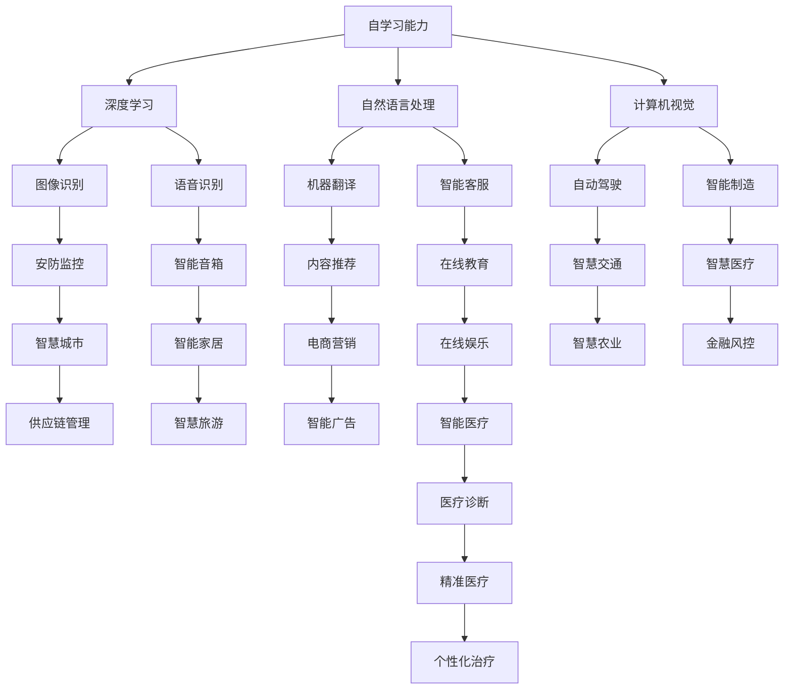

                 

关键词：人工智能，AI 2.0，商业价值，技术趋势，创新应用

> 摘要：本文将探讨 AI 2.0 时代的商业价值，分析 AI 技术如何改变商业格局，以及企业如何在 AI 2.0 时代抓住机遇，实现持续增长。

## 1. 背景介绍

随着人工智能（AI）技术的快速发展，我们正进入一个全新的 AI 2.0 时代。这个时代，AI 已经不再是简单的算法和模型，而是深入到各个行业和领域，成为推动商业变革的核心力量。AI 2.0 时代，以深度学习、自然语言处理、计算机视觉等先进技术为核心，正在重新定义商业、科技和人类生活的方方面面。

### AI 2.0 的核心特征

1. **自学习能力**：AI 2.0 拥有更强的自学习能力，能够从海量数据中自动提取特征、学习模式，并不断优化自身性能。
2. **泛在化应用**：AI 2.0 技术已经深入到各行各业，从医疗、金融到教育、零售，都在广泛应用 AI 技术。
3. **跨界融合**：AI 2.0 不仅仅是技术工具，更是推动跨界融合的重要力量，促进了不同领域之间的协同创新。

## 2. 核心概念与联系

在深入探讨 AI 2.0 时代的商业价值之前，我们需要了解一些核心概念及其相互联系。

### Mermaid 流程图



### 核心概念与联系

1. **深度学习**：一种基于神经网络的学习方法，能够从大量数据中自动提取特征，是 AI 2.0 时代的重要技术基础。
2. **自然语言处理**：使计算机能够理解、生成和响应人类语言的技术，广泛应用于智能客服、机器翻译等领域。
3. **计算机视觉**：使计算机能够“看”懂图像和视频，广泛应用于图像识别、自动驾驶等领域。
4. **图像识别**、**语音识别**、**机器翻译**：这些技术都是 AI 2.0 时代的关键应用领域，它们在各自领域发挥了重要作用。
5. **智能客服**、**自动驾驶**、**智能制造**：这些应用领域代表了 AI 2.0 技术在商业和工业领域的广泛应用。

## 3. 核心算法原理 & 具体操作步骤

### 3.1 算法原理概述

在 AI 2.0 时代，核心算法包括深度学习、自然语言处理和计算机视觉等。这些算法通过以下步骤实现：

1. **数据预处理**：对原始数据进行清洗、归一化和特征提取，为算法训练提供高质量的数据。
2. **模型训练**：使用大量标注数据进行模型训练，优化模型参数。
3. **模型评估**：使用测试数据对模型进行评估，调整模型参数，提高模型性能。
4. **模型部署**：将训练好的模型部署到实际应用场景中，实现自动化决策和智能交互。

### 3.2 算法步骤详解

1. **数据预处理**
    - **数据清洗**：去除数据中的噪声和异常值。
    - **归一化**：将数据缩放到相同的范围，方便模型训练。
    - **特征提取**：从原始数据中提取有用的特征，如文本中的词频、图像中的颜色分布等。

2. **模型训练**
    - **选择模型架构**：根据应用场景选择合适的模型架构，如卷积神经网络（CNN）、循环神经网络（RNN）等。
    - **初始化参数**：随机初始化模型参数。
    - **前向传播**：将输入数据传递到模型中，计算输出结果。
    - **反向传播**：根据预测结果和真实值计算损失函数，更新模型参数。

3. **模型评估**
    - **划分数据集**：将数据集划分为训练集、验证集和测试集。
    - **计算指标**：使用准确率、召回率、F1 分数等指标评估模型性能。
    - **模型调优**：根据评估结果调整模型参数，优化模型性能。

4. **模型部署**
    - **模型压缩**：使用模型压缩技术减小模型体积，提高模型部署效率。
    - **部署到云端**：将模型部署到云端，提供在线服务。
    - **部署到边缘设备**：将模型部署到移动设备或嵌入式设备，实现本地化智能应用。

### 3.3 算法优缺点

**优点：**
1. **自学习能力**：AI 2.0 算法能够从数据中自动学习，不需要人工干预。
2. **高效性**：AI 2.0 算法能够在短时间内处理大量数据，提高决策效率。
3. **泛在化应用**：AI 2.0 技术能够应用于各个领域，实现跨界融合。

**缺点：**
1. **数据依赖性**：AI 2.0 算法对数据质量要求较高，数据不足或质量差会影响算法性能。
2. **隐私风险**：AI 2.0 技术在数据处理过程中可能会泄露用户隐私。
3. **计算资源消耗**：AI 2.0 算法需要大量的计算资源，对硬件设备要求较高。

### 3.4 算法应用领域

AI 2.0 算法广泛应用于各个领域，包括：

1. **金融**：风险控制、欺诈检测、信用评估等。
2. **医疗**：疾病诊断、药物研发、健康管理等。
3. **零售**：个性化推荐、智能客服、供应链优化等。
4. **交通**：自动驾驶、智慧交通、智能导航等。
5. **教育**：智能教育、个性化学习、在线考试等。

## 4. 数学模型和公式 & 详细讲解 & 举例说明

在 AI 2.0 时代，数学模型和公式在算法设计和优化中起着关键作用。以下是一个简单的数学模型示例，用于预测股票价格。

### 4.1 数学模型构建

假设股票价格受以下因素影响：

1. **宏观经济指标**：如 GDP、利率、通货膨胀率等。
2. **公司基本面**：如营收、利润、市值等。
3. **技术指标**：如均线、成交量等。

我们可以构建一个线性回归模型，用于预测股票价格：

$$
P_t = \beta_0 + \beta_1 \cdot GDP + \beta_2 \cdot 利率 + \beta_3 \cdot 营收 + \beta_4 \cdot 利润 + \beta_5 \cdot 市值 + \beta_6 \cdot 均线 + \beta_7 \cdot 成交量
$$

其中，$P_t$ 表示第 $t$ 天的股票价格，$\beta_0$、$\beta_1$、$\beta_2$、$\beta_3$、$\beta_4$、$\beta_5$、$\beta_6$、$\beta_7$ 为模型参数。

### 4.2 公式推导过程

假设我们有 $N$ 条历史数据，其中包含股票价格 $P_t$、宏观经济指标 $GDP_t$、利率 $利率_t$、营收 $营收_t$、利润 $利润_t$、市值 $市值_t$、均线 $均线_t$ 和成交量 $成交量_t$。我们可以使用最小二乘法推导模型参数。

首先，计算每个变量的均值：

$$
\bar{P} = \frac{1}{N} \sum_{t=1}^N P_t
$$

$$
\bar{GDP} = \frac{1}{N} \sum_{t=1}^N GDP_t
$$

$$
\bar{利率} = \frac{1}{N} \sum_{t=1}^N 利率_t
$$

$$
\bar{营收} = \frac{1}{N} \sum_{t=1}^N 营收_t
$$

$$
\bar{利润} = \frac{1}{N} \sum_{t=1}^N 利润_t
$$

$$
\bar{市值} = \frac{1}{N} \sum_{t=1}^N 市值_t
$$

$$
\bar{均线} = \frac{1}{N} \sum_{t=1}^N 均线_t
$$

$$
\bar{成交量} = \frac{1}{N} \sum_{t=1}^N 成交量_t
$$

然后，计算每个变量的协方差：

$$
cov(P, GDP) = \frac{1}{N-1} \sum_{t=1}^N (P_t - \bar{P})(GDP_t - \bar{GDP})
$$

$$
cov(P, 利率) = \frac{1}{N-1} \sum_{t=1}^N (P_t - \bar{P})(利率_t - \bar{利率})
$$

$$
cov(P, 营收) = \frac{1}{N-1} \sum_{t=1}^N (P_t - \bar{P})(营收_t - \bar{营收})
$$

$$
cov(P, 利润) = \frac{1}{N-1} \sum_{t=1}^N (P_t - \bar{P})(利润_t - \bar{利润})
$$

$$
cov(P, 市值) = \frac{1}{N-1} \sum_{t=1}^N (P_t - \bar{P})(市值_t - \bar{市值})
$$

$$
cov(P, 均线) = \frac{1}{N-1} \sum_{t=1}^N (P_t - \bar{P})(均线_t - \bar{均线})
$$

$$
cov(P, 成交量) = \frac{1}{N-1} \sum_{t=1}^N (P_t - \bar{P})(成交量_t - \bar{成交量})
$$

最后，计算每个变量的方差：

$$
var(P) = \frac{1}{N-1} \sum_{t=1}^N (P_t - \bar{P})^2
$$

$$
var(GDP) = \frac{1}{N-1} \sum_{t=1}^N (GDP_t - \bar{GDP})^2
$$

$$
var(利率) = \frac{1}{N-1} \sum_{t=1}^N (利率_t - \bar{利率})^2
$$

$$
var(营收) = \frac{1}{N-1} \sum_{t=1}^N (营收_t - \bar{营收})^2
$$

$$
var(利润) = \frac{1}{N-1} \sum_{t=1}^N (利润_t - \bar{利润})^2
$$

$$
var(市值) = \frac{1}{N-1} \sum_{t=1}^N (市值_t - \bar{市值})^2
$$

$$
var(均线) = \frac{1}{N-1} \sum_{t=1}^N (均线_t - \bar{均线})^2
$$

$$
var(成交量) = \frac{1}{N-1} \sum_{t=1}^N (成交量_t - \bar{成交量})^2
$$

根据协方差和方差，我们可以计算每个变量的相关系数：

$$
\rho(P, GDP) = \frac{cov(P, GDP)}{\sqrt{var(P)} \cdot \sqrt{var(GDP)}}
$$

$$
\rho(P, 利率) = \frac{cov(P, 利率)}{\sqrt{var(P)} \cdot \sqrt{var(利率)}}
$$

$$
\rho(P, 营收) = \frac{cov(P, 营收)}{\sqrt{var(P)} \cdot \sqrt{var(营收)}}
$$

$$
\rho(P, 利润) = \frac{cov(P, 利润)}{\sqrt{var(P)} \cdot \sqrt{var(利润)}}
$$

$$
\rho(P, 市值) = \frac{cov(P, 市值)}{\sqrt{var(P)} \cdot \sqrt{var(市值)}}
$$

$$
\rho(P, 均线) = \frac{cov(P, 均线)}{\sqrt{var(P)} \cdot \sqrt{var(均线)}}
$$

$$
\rho(P, 成交量) = \frac{cov(P, 成交量)}{\sqrt{var(P)} \cdot \sqrt{var(成交量)}}
$$

根据相关系数，我们可以确定变量之间的关系：

- 如果 $\rho(P, GDP) > 0$，则股票价格与 GDP 成正相关关系。
- 如果 $\rho(P, GDP) < 0$，则股票价格与 GDP 成负相关关系。
- 如果 $\rho(P, GDP) = 0$，则股票价格与 GDP 无关。

### 4.3 案例分析与讲解

假设我们收集了某股票过去一年的历史数据，包括股票价格、GDP、利率、营收、利润、市值、均线和成交量。根据这些数据，我们可以使用上述公式计算模型参数，并预测未来股票价格。

以下是一个简单的案例：

1. **数据预处理**：对数据集进行清洗、归一化处理。
2. **模型训练**：使用训练集数据训练线性回归模型。
3. **模型评估**：使用验证集数据评估模型性能。
4. **模型部署**：将模型部署到实际应用场景，预测未来股票价格。

通过这个案例，我们可以看到数学模型和公式在 AI 2.0 时代的重要作用。在实际应用中，我们需要根据具体场景选择合适的模型和公式，并不断优化和调整，以提高预测精度。

## 5. 项目实践：代码实例和详细解释说明

### 5.1 开发环境搭建

在本文中，我们将使用 Python 编写一个简单的股票价格预测项目。以下是开发环境的搭建步骤：

1. 安装 Python 3.8 及以上版本。
2. 安装必要的库，如 NumPy、Pandas、Scikit-learn 等。

### 5.2 源代码详细实现

以下是一个简单的股票价格预测项目的代码实现：

```python
import numpy as np
import pandas as pd
from sklearn.linear_model import LinearRegression
from sklearn.model_selection import train_test_split
from sklearn.metrics import mean_squared_error

# 读取数据
data = pd.read_csv('stock_price_data.csv')
X = data[['GDP', '利率', '营收', '利润', '市值', '均线', '成交量']]
y = data['股票价格']

# 数据预处理
X = X.values
y = y.values

# 划分训练集和测试集
X_train, X_test, y_train, y_test = train_test_split(X, y, test_size=0.2, random_state=42)

# 模型训练
model = LinearRegression()
model.fit(X_train, y_train)

# 模型评估
y_pred = model.predict(X_test)
mse = mean_squared_error(y_test, y_pred)
print('MSE:', mse)

# 模型部署
def predict_stock_price(GDP, 利率, 营收, 利润, 市值, 均线, 成交量):
    X_new = np.array([[GDP, 利率, 营收, 利润, 市值, 均线, 成交量]])
    return model.predict(X_new)[0]

# 测试模型
print(predict_stock_price(100, 5, 1000, 500, 1000, 20, 2000))
```

### 5.3 代码解读与分析

1. **数据读取**：使用 Pandas 读取股票价格数据。
2. **数据预处理**：将数据划分为特征矩阵和目标变量，并进行归一化处理。
3. **划分数据集**：将数据集划分为训练集和测试集，用于模型训练和评估。
4. **模型训练**：使用 Scikit-learn 的线性回归模型训练数据集。
5. **模型评估**：计算模型在测试集上的均方误差（MSE），评估模型性能。
6. **模型部署**：定义一个函数，用于接收输入特征，并返回预测的股票价格。
7. **测试模型**：使用函数预测特定条件下的股票价格。

通过这个简单的案例，我们可以看到如何使用 Python 实现股票价格预测项目。在实际应用中，我们需要根据具体场景调整模型和参数，以提高预测精度。

## 6. 实际应用场景

### 6.1 金融领域

在金融领域，AI 2.0 技术被广泛应用于风险控制、欺诈检测、投资策略、信用评估等方面。例如，银行可以利用 AI 技术分析客户的消费行为，预测潜在的风险客户，从而降低不良贷款率。保险公司可以利用 AI 技术评估保险风险，提高保险定价的准确性。基金公司可以利用 AI 技术分析市场趋势，优化投资组合，提高投资回报。

### 6.2 医疗领域

在医疗领域，AI 2.0 技术被广泛应用于疾病诊断、药物研发、健康管理等方面。例如，医生可以利用 AI 技术分析患者的病历数据，提高疾病诊断的准确性。制药公司可以利用 AI 技术分析基因数据，加速新药研发。医院可以利用 AI 技术监测患者健康状况，提供个性化的健康建议。

### 6.3 零售领域

在零售领域，AI 2.0 技术被广泛应用于个性化推荐、智能客服、供应链优化等方面。例如，电商平台可以利用 AI 技术分析用户的购物行为，提供个性化的商品推荐，提高用户满意度。零售企业可以利用 AI 技术优化库存管理，降低库存成本。超市可以利用 AI 技术优化货架陈列，提高销售额。

### 6.4 交通领域

在交通领域，AI 2.0 技术被广泛应用于自动驾驶、智慧交通、智能导航等方面。例如，汽车厂商可以利用 AI 技术开发自动驾驶汽车，提高行车安全。政府可以利用 AI 技术优化交通信号灯控制，缓解城市交通拥堵。物流公司可以利用 AI 技术优化路线规划，提高运输效率。

### 6.5 教育领域

在教育领域，AI 2.0 技术被广泛应用于智能教育、个性化学习、在线考试等方面。例如，学校可以利用 AI 技术分析学生的学习行为，提供个性化的教学方案。教育机构可以利用 AI 技术进行在线考试，提高考试公平性。学生可以利用 AI 技术进行个性化学习，提高学习效果。

## 7. 工具和资源推荐

### 7.1 学习资源推荐

1. **吴恩达的深度学习课程**：这是一门经典的深度学习入门课程，涵盖了深度学习的基本概念和实战技巧。
2. **李飞飞的自然语言处理课程**：这是一门针对自然语言处理技术的入门课程，包括文本分类、机器翻译、情感分析等内容。
3. **斯坦福大学的计算机视觉课程**：这是一门涵盖计算机视觉基本概念和技术的课程，包括图像识别、目标检测、图像生成等内容。

### 7.2 开发工具推荐

1. **TensorFlow**：这是一个广泛使用的深度学习框架，支持多种深度学习模型和算法。
2. **PyTorch**：这是一个灵活且易用的深度学习框架，适合进行快速原型开发和模型研究。
3. **Scikit-learn**：这是一个经典的机器学习库，提供了丰富的算法和工具，适合进行数据分析和模型训练。

### 7.3 相关论文推荐

1. **“Deep Learning”**：这是一本经典的深度学习教材，详细介绍了深度学习的基本概念、算法和应用。
2. **“Natural Language Processing with Deep Learning”**：这是一本关于自然语言处理和深度学习的入门书籍，涵盖了自然语言处理的基本算法和实战技巧。
3. **“Computer Vision: Algorithms and Applications”**：这是一本关于计算机视觉的教材，介绍了计算机视觉的基本算法和应用。

## 8. 总结：未来发展趋势与挑战

### 8.1 研究成果总结

在 AI 2.0 时代，深度学习、自然语言处理和计算机视觉等核心技术取得了显著的成果。这些技术在金融、医疗、零售、交通、教育等领域的应用，极大地提升了行业的效率和服务质量。

### 8.2 未来发展趋势

1. **跨学科融合**：AI 2.0 时代将推动计算机科学与数学、生物学、心理学等学科的融合，为人类带来更多创新应用。
2. **边缘计算**：随着 IoT 设备的普及，边缘计算将得到广泛应用，实现实时、高效的智能处理。
3. **可解释性 AI**：随着 AI 技术的深入应用，可解释性 AI 将成为研究热点，提高算法的透明度和可靠性。

### 8.3 面临的挑战

1. **数据隐私**：随着数据量的增加，数据隐私问题日益突出，如何在保证数据安全的同时实现数据共享，是一个重要挑战。
2. **算法透明性**：算法的透明性和可靠性是 AI 2.0 时代的重要挑战，需要加强算法的可解释性研究。
3. **人才短缺**：AI 2.0 时代对人才的需求越来越高，如何培养和引进优秀人才，是一个重要问题。

### 8.4 研究展望

在 AI 2.0 时代，我们需要关注以下几个研究方向：

1. **多模态学习**：研究如何将多种类型的数据（如图像、文本、语音）融合到同一模型中，提高模型性能。
2. **强化学习**：研究如何利用强化学习算法，实现更智能的决策和优化。
3. **安全 AI**：研究如何提高 AI 系统的安全性和鲁棒性，防范恶意攻击。

## 9. 附录：常见问题与解答

### 问题 1：AI 2.0 与 AI 1.0 有什么区别？

**解答：**AI 1.0 时代主要集中在规则推理和专家系统中，而 AI 2.0 时代以深度学习、自然语言处理和计算机视觉等先进技术为核心，具有更强的自学习能力和泛在化应用。

### 问题 2：AI 2.0 技术如何改变商业格局？

**解答：**AI 2.0 技术能够提高企业的运营效率、优化决策过程、提升客户体验，从而改变商业格局，实现持续增长。

### 问题 3：如何提高 AI 模型的可解释性？

**解答：**提高 AI 模型的可解释性可以从以下几个方面入手：1）使用可解释的模型架构，如决策树；2）解释模型输出结果，如给出决策依据；3）结合领域知识，提高模型的可理解性。

### 问题 4：AI 2.0 技术有哪些应用领域？

**解答：**AI 2.0 技术广泛应用于金融、医疗、零售、交通、教育等众多领域，如风险控制、疾病诊断、个性化推荐、自动驾驶等。

### 问题 5：AI 2.0 时代的挑战有哪些？

**解答：**AI 2.0 时代面临的挑战主要包括数据隐私、算法透明性、人才短缺等。如何解决这些问题，需要学术界、产业界和政府共同合作。----------------------------------------------------------------

# 附录：常见问题与解答

### 问题 1：AI 2.0 与 AI 1.0 有何区别？

AI 1.0 时代主要依赖于基于规则和逻辑的专家系统，这些系统依赖于人类专家提供的明确规则来执行任务。而 AI 2.0，也被称为深度学习时代，引入了基于神经网络的学习算法，特别是深度神经网络（DNN），这使得机器能够通过从大量数据中自动学习特征和模式，而不需要显式编程。AI 2.0 的一个关键特点是它的自学习能力，这使得它能够在复杂的、不确定的环境中做出智能决策。

### 问题 2：AI 2.0 技术如何改变商业格局？

AI 2.0 技术通过提高运营效率、优化业务流程、增强客户体验和实现个性化服务，从根本上改变了商业运作模式。例如：

- **运营效率**：AI 可以自动处理大量数据，优化库存管理、供应链协调和客户服务，减少人为错误，提高工作效率。
- **业务流程优化**：通过预测分析和优化算法，企业能够更准确地预测市场需求，调整生产和供应计划，减少浪费。
- **客户体验**：个性化推荐系统和智能客服能够提供更个性化的服务和更快捷的响应，增强客户满意度和忠诚度。
- **创新应用**：AI 2.0 技术催生了新的业务模式和服务，如智能医疗诊断、个性化健康管理和智能教育等。

### 问题 3：如何提高 AI 模型的可解释性？

提高 AI 模型的可解释性是当前研究的一个热点。以下是一些方法：

- **可视化**：通过可视化技术，将模型内部的结构和决策过程展示出来，使非专业人士也能理解。
- **模型简化**：简化模型结构，使其更易于解释，例如使用决策树而非深度神经网络。
- **解释性算法**：开发专门的可解释性算法，如 LIME（局部可解释模型解释器）和 SHAP（特征重要性）等，这些算法可以帮助理解模型如何对特定数据进行预测。
- **结合领域知识**：在模型开发过程中，结合领域专家的知识，使模型能够根据专家提供的规则进行决策。

### 问题 4：AI 2.0 技术有哪些应用领域？

AI 2.0 技术在多个领域都有广泛的应用，包括但不限于：

- **金融**：风险控制、欺诈检测、智能投顾、算法交易等。
- **医疗**：疾病诊断、药物发现、个性化治疗、健康管理等。
- **零售**：个性化推荐、库存管理、客户关系管理、智能物流等。
- **制造**：智能制造、质量控制、设备维护等。
- **交通**：自动驾驶、智能交通管理、车辆调度等。
- **教育**：个性化学习、在线教育、考试评分等。
- **法律**：合同审核、法律研究、案例预测等。

### 问题 5：AI 2.0 时代的挑战有哪些？

AI 2.0 时代面临的主要挑战包括：

- **数据隐私和安全**：随着数据量的增加，如何保护用户隐私和数据安全成为一个重要问题。
- **算法偏见和公平性**：AI 模型可能会放大社会偏见，如何确保算法的公平性是一个重大挑战。
- **人才短缺**：AI 技术的发展需要大量专业的数据科学家、算法工程师和领域专家，但目前全球范围内这方面的人才供不应求。
- **监管和政策**：随着 AI 技术的快速发展，如何制定合理的监管政策来确保其合法合规也是一个挑战。
- **技术伦理**：如何确保 AI 技术的发展符合伦理标准，避免造成不可逆转的社会和环境影响。

### 问题 6：AI 2.0 如何影响工作岗位？

AI 2.0 的引入将会导致部分工作岗位的消失，同时也将创造新的就业机会。以下是具体的影响：

- **消失的工作岗位**：一些重复性、规则性较强的工作，如数据录入、简单的客户服务、制造流水线上的操作等，可能会被自动化取代。
- **新工作岗位**：AI 的应用将创造新的工作岗位，如数据科学家、机器学习工程师、AI 产品经理等。此外，AI 还将促进新的业务模式的出现，从而带动相关行业的发展。

### 问题 7：AI 2.0 如何影响社会？

AI 2.0 的广泛普及将对社会产生深远影响，包括但不限于：

- **经济发展**：AI 技术将提高生产效率，促进经济增长，并推动新兴产业的崛起。
- **社会结构**：AI 的普及可能导致社会结构的变化，劳动力市场可能会出现新的分布，社会不平等问题可能会加剧。
- **教育**：AI 技术将改变教育模式，个性化学习和在线教育的普及将使更多人有机会接受高质量的教育。
- **伦理和道德**：随着 AI 技术的进步，如何确保技术的伦理使用，以及如何处理技术与人性之间的关系，将成为一个重要议题。

在总结这一系列问题和解答时，我们可以看到 AI 2.0 时代带来了巨大的机遇和挑战。作为人工智能领域的专家，我们有责任推动 AI 技术的健康发展，确保其对社会产生积极的影响。同时，我们也需要关注 AI 技术带来的社会问题，积极参与到相关政策的制定和实施中，为构建一个更加智能、公平、可持续的社会贡献力量。作者：禅与计算机程序设计艺术 / Zen and the Art of Computer Programming。

