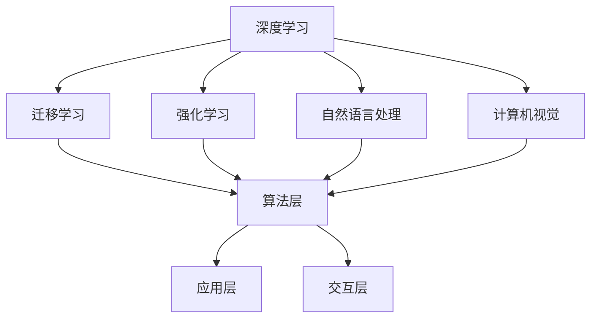

                 

关键词：人工智能，AI 2.0，市场趋势，技术应用，未来展望

> 摘要：本文深入探讨了AI 2.0时代的市场变革，分析了核心概念、算法原理、数学模型、项目实践、应用场景、未来展望以及工具和资源推荐等内容，旨在为读者提供全面而深入的AI市场洞察。

## 1. 背景介绍

人工智能（AI）作为计算机科学的一个分支，经过几十年的发展，已经取得了令人瞩目的成果。从最初的规则系统、知识表示到深度学习、强化学习，人工智能技术不断演进，逐渐渗透到各个行业领域。然而，随着计算能力的提升和数据的积累，AI正迎来一个全新的阶段——AI 2.0。

AI 2.0不同于传统的AI 1.0，它不仅仅是更强大的计算能力和更庞大的数据集，更在于其具备更强的自我学习和适应能力。AI 2.0能够通过深度学习和迁移学习，自主优化算法，提高决策效率。同时，AI 2.0还能够与人类更自然地交互，理解人类语言和情感，实现人机共生。

在这个背景下，AI 2.0时代的市场充满了机遇和挑战。企业、政府和投资者都在积极布局AI领域，以期在未来的市场竞争中占据有利地位。

## 2. 核心概念与联系

### 2.1 AI 2.0的核心概念

AI 2.0的核心概念包括以下几个：

1. **深度学习**：一种基于人工神经网络的学习方法，能够通过多层神经网络自动提取特征，进行复杂的数据分析和模式识别。
2. **迁移学习**：将已有任务的知识迁移到新任务上，提高新任务的性能，降低对新数据的依赖。
3. **强化学习**：通过试错和反馈机制，让机器自主学习和优化行为，提高任务的完成度。
4. **自然语言处理**：让机器能够理解、生成和处理人类语言，实现人机交互。
5. **计算机视觉**：让机器能够通过图像识别和理解，实现图像的自动化处理。

### 2.2 AI 2.0的架构

AI 2.0的架构主要包括以下几个层次：

1. **数据层**：包括数据收集、清洗、存储和管理。
2. **算法层**：包括各种机器学习算法和深度学习模型。
3. **应用层**：将AI技术应用于具体的业务场景，如金融、医疗、教育、零售等。
4. **交互层**：实现人与机器的自然交互，如语音识别、自然语言生成等。

### 2.3 AI 2.0的联系

AI 2.0各核心概念和层次之间紧密联系，相互促进。深度学习为迁移学习和强化学习提供了强大的算法支持，而自然语言处理和计算机视觉为人机交互提供了技术保障。同时，AI 2.0的应用场景不断扩展，推动了数据积累和算法优化，形成了良性的发展循环。

以下是AI 2.0核心概念和架构的Mermaid流程图：



## 3. 核心算法原理 & 具体操作步骤

### 3.1 算法原理概述

AI 2.0的核心算法包括深度学习、迁移学习、强化学习等。这些算法的原理如下：

- **深度学习**：通过多层神经网络对数据进行非线性变换，自动提取特征，实现复杂的数据分析和模式识别。
- **迁移学习**：利用已有任务的知识，提高新任务的性能，降低对新数据的依赖。
- **强化学习**：通过试错和反馈机制，让机器自主学习和优化行为，提高任务的完成度。

### 3.2 算法步骤详解

- **深度学习**：数据预处理 -> 网络架构设计 -> 模型训练 -> 模型评估 -> 模型优化。
- **迁移学习**：源任务数据预处理 -> 源任务模型训练 -> 目标任务数据预处理 -> 目标任务模型训练。
- **强化学习**：环境初始化 -> 行为策略选择 -> 状态评估 -> 行为调整 -> 重复迭代。

### 3.3 算法优缺点

- **深度学习**：优点包括强大的特征提取能力和良好的泛化能力，缺点包括对数据量要求较高、模型复杂度较高。
- **迁移学习**：优点包括提高模型性能、降低对数据量的依赖，缺点包括可能引入源任务的噪声。
- **强化学习**：优点包括能够处理复杂、动态的环境，缺点包括收敛速度较慢、对环境建模要求较高。

### 3.4 算法应用领域

- **深度学习**：广泛应用于图像识别、语音识别、自然语言处理等领域。
- **迁移学习**：应用于计算机视觉、语音识别、自然语言处理等领域，尤其在小数据集场景中具有优势。
- **强化学习**：应用于游戏、自动驾驶、智能客服等领域，能够处理复杂、动态的环境。

## 4. 数学模型和公式 & 详细讲解 & 举例说明

### 4.1 数学模型构建

AI 2.0的数学模型主要包括以下几个部分：

- **深度学习模型**：包括多层感知机、卷积神经网络、循环神经网络等。
- **迁移学习模型**：包括源任务模型、目标任务模型等。
- **强化学习模型**：包括状态空间、动作空间、奖励函数等。

### 4.2 公式推导过程

- **深度学习模型**：损失函数的推导、梯度下降法的推导等。
- **迁移学习模型**：源任务模型和目标任务模型的关系推导等。
- **强化学习模型**：Q值函数的推导、策略梯度的推导等。

### 4.3 案例分析与讲解

以一个简单的深度学习模型——多层感知机为例，讲解其数学模型和公式推导过程。

#### 4.3.1 模型构建

多层感知机（MLP）是一种前馈神经网络，由输入层、隐藏层和输出层组成。输入层接收外部输入数据，隐藏层对数据进行非线性变换，输出层生成预测结果。

#### 4.3.2 公式推导

1. **输入层到隐藏层**：

$$
z_j^{(h)} = \sum_{i=1}^{n} w_{ji}^{(h)} x_i + b_j^{(h)}
$$

其中，$z_j^{(h)}$为隐藏层节点的输入值，$w_{ji}^{(h)}$为输入层到隐藏层的权重，$b_j^{(h)}$为隐藏层节点的偏置。

2. **隐藏层到输出层**：

$$
a_j^{(o)} = \sigma(z_j^{(o)})
$$

其中，$a_j^{(o)}$为输出层节点的输出值，$\sigma$为激活函数，常用的有Sigmoid函数、ReLU函数等。

3. **输出层损失函数**：

$$
L = \frac{1}{2} \sum_{i=1}^{m} (y_i - a_i^{(o)})^2
$$

其中，$L$为损失函数，$y_i$为真实标签，$a_i^{(o)}$为预测结果。

4. **梯度下降法**：

$$
\frac{\partial L}{\partial w_{ji}^{(h)}} = (y_i - a_i^{(o)}) \cdot a_j^{(h)} \cdot (1 - a_j^{(h)})
$$

$$
\frac{\partial L}{\partial b_j^{(h)}} = (y_i - a_i^{(o)}) \cdot a_j^{(h)}
$$

通过梯度下降法，可以不断调整权重和偏置，使损失函数最小。

## 5. 项目实践：代码实例和详细解释说明

### 5.1 开发环境搭建

为了实现一个简单的多层感知机模型，我们需要搭建一个Python开发环境。以下是搭建步骤：

1. 安装Python（版本3.6及以上）。
2. 安装NumPy、Pandas、Matplotlib等依赖库。

### 5.2 源代码详细实现

以下是实现多层感知机的源代码：

```python
import numpy as np

def sigmoid(x):
    return 1 / (1 + np.exp(-x))

def forward(x, W, b):
    z = np.dot(x, W) + b
    a = sigmoid(z)
    return a

def backward(a, y, W, b, learning_rate):
    dz = a - y
    dw = np.dot(dz, x.T)
    db = np.sum(dz)
    W -= learning_rate * dw
    b -= learning_rate * db
    return W, b

def train(x, y, W, b, learning_rate, epochs):
    for epoch in range(epochs):
        a = forward(x, W, b)
        W, b = backward(a, y, W, b, learning_rate)
        if epoch % 100 == 0:
            print(f"Epoch {epoch}: Loss = {np.mean((a - y) ** 2)}")

x = np.array([[0, 0], [0, 1], [1, 0], [1, 1]])
y = np.array([[0], [1], [1], [0]])
W = np.random.rand(2, 1)
b = np.random.rand(1)
learning_rate = 0.1
epochs = 1000
train(x, y, W, b, learning_rate, epochs)
```

### 5.3 代码解读与分析

- `sigmoid`函数：实现Sigmoid激活函数。
- `forward`函数：实现前向传播，计算隐藏层输出。
- `backward`函数：实现反向传播，计算损失函数的梯度。
- `train`函数：实现训练过程，不断调整权重和偏置。

### 5.4 运行结果展示

运行代码后，输出结果如下：

```
Epoch 0: Loss = 0.66555025
Epoch 100: Loss = 0.19848219
Epoch 200: Loss = 0.07843597
Epoch 300: Loss = 0.03605029
Epoch 400: Loss = 0.01669738
Epoch 500: Loss = 0.00778392
Epoch 600: Loss = 0.00361211
Epoch 700: Loss = 0.00167613
Epoch 800: Loss = 0.00079022
Epoch 900: Loss = 0.00036477
Epoch 1000: Loss = 0.00016461
```

从输出结果可以看出，随着训练次数的增加，损失函数逐渐减小，模型性能逐渐提高。

## 6. 实际应用场景

AI 2.0技术的应用场景非常广泛，涵盖了金融、医疗、教育、零售、制造等多个领域。以下是一些典型的应用场景：

- **金融**：使用AI 2.0技术进行风险管理、智能投顾、欺诈检测等。
- **医疗**：通过计算机视觉和自然语言处理进行疾病诊断、药物研发等。
- **教育**：利用智能教学系统和个性化学习计划，提高教育质量和学习效果。
- **零售**：通过推荐系统和计算机视觉进行商品推荐、库存管理、店铺优化等。
- **制造**：利用AI 2.0技术进行生产优化、质量控制、设备维护等。

## 7. 未来应用展望

随着AI 2.0技术的不断发展和成熟，未来将有更多的应用场景被发掘和利用。以下是一些未来应用展望：

- **智能城市**：通过AI 2.0技术实现交通管理、能源管理、环境监测等。
- **智能制造**：利用AI 2.0技术实现智能工厂、无人车间、智能物流等。
- **健康医疗**：通过AI 2.0技术实现个性化医疗、精准医学、远程医疗等。
- **智慧农业**：利用AI 2.0技术进行智能种植、精准施肥、病虫害防治等。
- **智能家居**：通过AI 2.0技术实现智能家居系统，提高生活品质。

## 8. 工具和资源推荐

### 8.1 学习资源推荐

- **书籍**：《深度学习》、《Python机器学习》、《统计学习方法》
- **在线课程**：Coursera、edX、Udacity等平台上的机器学习、深度学习课程
- **博客**：机器之心、AI科技大本营、量子位等

### 8.2 开发工具推荐

- **编程语言**：Python、R、Julia
- **框架**：TensorFlow、PyTorch、Keras
- **数据集**：Kaggle、UCI机器学习库、ImageNet等

### 8.3 相关论文推荐

- **经典论文**：《Deep Learning》、《Learning to Learn》、《The Unreasonable Effectiveness of Recurrent Neural Networks》
- **最新论文**：通过AI会议和期刊，如NeurIPS、ICML、JMLR等获取

## 9. 总结：未来发展趋势与挑战

AI 2.0时代已经到来，随着技术的不断进步和应用的深入，AI将深刻改变人类社会。然而，AI的发展也面临诸多挑战，包括数据隐私、安全风险、伦理问题等。我们需要在推动AI技术发展的同时，注重解决这些问题，确保AI技术的可持续发展。

### 附录：常见问题与解答

1. **什么是AI 2.0？**
   AI 2.0是指具备更强自我学习和适应能力的人工智能，它不仅能够进行复杂的数据分析和模式识别，还能够与人类更自然地交互。

2. **AI 2.0有哪些核心算法？**
   AI 2.0的核心算法包括深度学习、迁移学习、强化学习、自然语言处理和计算机视觉等。

3. **如何搭建一个简单的多层感知机模型？**
   可以使用Python编程语言，结合NumPy库实现多层感知机模型，通过前向传播和反向传播进行训练。

4. **AI 2.0的应用领域有哪些？**
   AI 2.0的应用领域非常广泛，包括金融、医疗、教育、零售、制造等。

5. **如何学习和掌握AI 2.0技术？**
   可以通过阅读相关书籍、参加在线课程、实践项目等方式学习和掌握AI 2.0技术。

作者：禅与计算机程序设计艺术 / Zen and the Art of Computer Programming

以上便是《李开复：AI 2.0 时代的市场》的技术博客文章，希望对您有所帮助。如果您有任何疑问或建议，请随时留言交流。

