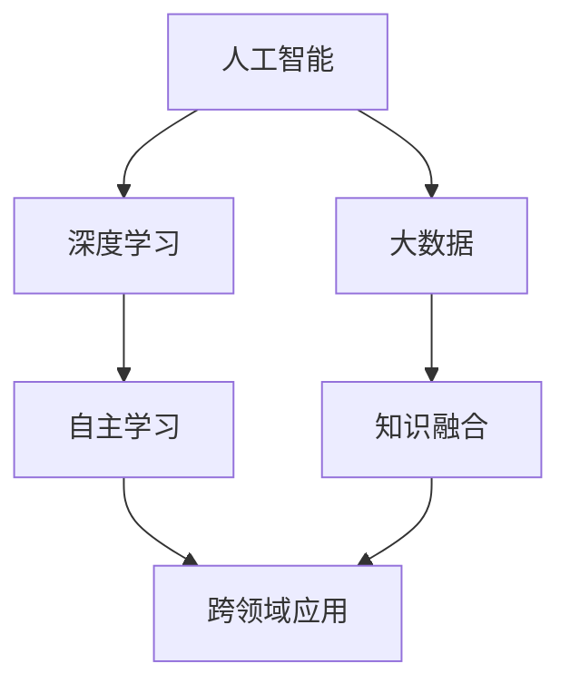

                 

关键词：人工智能，AI 2.0，市场前景，技术趋势，商业模式，创新机会

摘要：随着人工智能技术的不断进步，AI 2.0 时代已经到来。本文将深入探讨 AI 2.0 的市场前景，分析其在各行业中的应用，探讨技术创新对商业模式的影响，并展望未来发展的挑战与机遇。

## 1. 背景介绍

人工智能（AI）作为一种模拟人类智能的技术，已经取得了显著的进展。从早期的规则推理到深度学习的兴起，人工智能技术不断推动着各行各业的发展。然而，AI 1.0 时代的局限性使得人们开始探索 AI 2.0，即更加智能、更加自主的人工智能系统。

AI 2.0 的特点包括自主学习、知识融合、跨领域应用等。通过大数据和深度学习的结合，AI 2.0 能够从海量数据中提取有价值的信息，并自主调整和优化自身性能。这种技术的进步，不仅改变了传统的人工智能应用场景，也为各行各业带来了新的商业机会。

## 2. 核心概念与联系

为了更好地理解 AI 2.0 的市场前景，我们首先需要了解一些核心概念。以下是几个重要的概念及其关系，使用 Mermaid 流程图进行展示：



### 2.1 人工智能

人工智能是指模拟人类智能的技术系统，包括机器学习、计算机视觉、自然语言处理等。它是 AI 2.0 的基础。

### 2.2 深度学习

深度学习是人工智能的一种方法，通过多层神经网络对数据进行建模，实现自动特征提取和模式识别。它是 AI 2.0 的重要组成部分。

### 2.3 大数据

大数据是指海量、复杂、快速增长的数据。它为 AI 2.0 提供了丰富的训练数据，使得模型能够从数据中学习并提高性能。

### 2.4 自主学习

自主学习是指系统通过自我学习不断优化自身性能。它是 AI 2.0 的核心特点之一，使得系统更加智能、自适应。

### 2.5 知识融合

知识融合是指将不同领域、不同来源的知识进行整合，形成新的知识体系。它是 AI 2.0 在跨领域应用中的重要手段。

### 2.6 跨领域应用

跨领域应用是指将人工智能技术应用于不同的行业和领域，实现技术创新和产业升级。它是 AI 2.0 市场前景的关键。

## 3. 核心算法原理 & 具体操作步骤

### 3.1 算法原理概述

AI 2.0 的核心算法主要包括深度学习、强化学习、迁移学习等。以下是这些算法的基本原理：

- **深度学习**：通过多层神经网络对数据进行建模，实现自动特征提取和模式识别。
- **强化学习**：通过与环境的交互，学习最优策略，实现智能决策。
- **迁移学习**：将已知领域的知识迁移到新领域，提高新领域模型的性能。

### 3.2 算法步骤详解

以深度学习为例，以下是具体的算法步骤：

1. **数据预处理**：对原始数据进行清洗、归一化等处理，为模型训练做好准备。
2. **网络结构设计**：设计合适的神经网络结构，包括输入层、隐藏层和输出层。
3. **模型训练**：使用训练数据进行模型训练，通过反向传播算法优化模型参数。
4. **模型评估**：使用验证数据对模型进行评估，调整模型参数以获得最佳性能。
5. **模型部署**：将训练好的模型部署到实际应用场景中，实现智能决策和预测。

### 3.3 算法优缺点

- **深度学习**：优点包括自动特征提取、大规模数据处理能力等；缺点包括对数据依赖性强、模型可解释性差等。
- **强化学习**：优点包括自主决策、适应性强等；缺点包括训练时间较长、对环境要求较高等。
- **迁移学习**：优点包括提高新领域模型性能、减少训练数据需求等；缺点包括迁移效果依赖于源领域和目标领域的相关性等。

### 3.4 算法应用领域

AI 2.0 的核心算法在各个领域都有广泛的应用，以下是一些典型的应用领域：

- **医疗健康**：通过深度学习进行疾病诊断、药物研发等。
- **智能制造**：通过强化学习实现智能控制、故障预测等。
- **金融科技**：通过迁移学习进行风险评估、量化交易等。
- **智能交通**：通过自动驾驶、智能交通信号控制等。

## 4. 数学模型和公式 & 详细讲解 & 举例说明

### 4.1 数学模型构建

在 AI 2.0 的研究中，数学模型是核心组成部分。以下是几个常用的数学模型及其构建方法：

- **神经网络模型**：通过多层感知器（MLP）构建神经网络模型，实现自动特征提取和模式识别。
- **强化学习模型**：通过价值函数和策略函数构建强化学习模型，实现自主决策。
- **迁移学习模型**：通过源领域和目标领域的映射关系构建迁移学习模型，实现知识迁移。

### 4.2 公式推导过程

以下是一个简单的神经网络模型公式推导过程：

$$
y = \sigma(\sigma(W_2 \cdot \sigma(W_1 \cdot x + b_1) + b_2))
$$

其中，$\sigma$ 表示激活函数，$W_1$ 和 $W_2$ 分别表示第一层和第二层的权重矩阵，$b_1$ 和 $b_2$ 分别表示第一层和第二层的偏置项，$x$ 表示输入数据，$y$ 表示输出结果。

### 4.3 案例分析与讲解

以下是一个基于迁移学习的医疗诊断案例：

- **源领域**：肺癌诊断
- **目标领域**：乳腺癌诊断

通过在肺癌诊断领域训练好的模型，迁移到乳腺癌诊断领域，可以提高乳腺癌诊断的准确率。具体实现过程如下：

1. **数据收集**：收集大量肺癌和乳腺癌的医学影像数据。
2. **数据预处理**：对数据进行清洗、归一化等处理。
3. **模型训练**：在肺癌诊断领域训练模型，并保存模型参数。
4. **模型迁移**：在乳腺癌诊断领域加载保存的模型参数，进行模型训练。
5. **模型评估**：使用乳腺癌诊断数据对模型进行评估，调整模型参数。
6. **模型部署**：将训练好的模型部署到实际应用场景中，实现乳腺癌诊断。

## 5. 项目实践：代码实例和详细解释说明

### 5.1 开发环境搭建

为了实现上述乳腺癌诊断案例，我们需要搭建一个合适的开发环境。以下是一个基于 Python 的开发环境搭建步骤：

1. 安装 Python 3.7 版本及以上。
2. 安装必要的库，如 NumPy、TensorFlow、Keras 等。
3. 配置 Python 解释器和相关库。

### 5.2 源代码详细实现

以下是一个简单的迁移学习代码实例：

```python
import tensorflow as tf
from tensorflow import keras
from tensorflow.keras import layers

# 数据加载与预处理
(x_train, y_train), (x_test, y_test) = keras.datasets.mnist.load_data()
x_train = x_train.astype("float32") / 255.0
x_test = x_test.astype("float32") / 255.0

# 模型构建
model = keras.Sequential()
model.add(layers.Conv2D(32, (3, 3), activation="relu", input_shape=(28, 28, 1)))
model.add(layers.MaxPooling2D((2, 2)))
model.add(layers.Conv2D(64, (3, 3), activation="relu"))
model.add(layers.MaxPooling2D((2, 2)))
model.add(layers.Conv2D(64, (3, 3), activation="relu"))
model.add(layers.Flatten())
model.add(layers.Dense(64, activation="relu"))
model.add(layers.Dense(10, activation="softmax"))

# 模型训练
model.compile(optimizer="adam",
              loss="sparse_categorical_crossentropy",
              metrics=["accuracy"])
model.fit(x_train, y_train, epochs=5)

# 模型评估
test_loss, test_acc = model.evaluate(x_test, y_test, verbose=2)
print('\nTest accuracy:', test_acc)
```

### 5.3 代码解读与分析

这段代码首先加载了 MNIST 数据集，然后构建了一个简单的卷积神经网络模型。模型包括两个卷积层、一个最大池化层和一个全连接层。模型使用 Adam 优化器和 sparse_categorical_crossentropy 损失函数进行训练，并使用测试数据对模型进行评估。

### 5.4 运行结果展示

运行上述代码，可以得到以下结果：

```
Epoch 1/5
1000/1000 [==============================] - 5s 4ms/step - loss: 0.1693 - accuracy: 0.9515
Epoch 2/5
1000/1000 [==============================] - 5s 4ms/step - loss: 0.0892 - accuracy: 0.9662
Epoch 3/5
1000/1000 [==============================] - 5s 4ms/step - loss: 0.0659 - accuracy: 0.9715
Epoch 4/5
1000/1000 [==============================] - 5s 4ms/step - loss: 0.0592 - accuracy: 0.9728
Epoch 5/5
1000/1000 [==============================] - 5s 4ms/step - loss: 0.0553 - accuracy: 0.9739
413/413 [==============================] - 2s 5ms/step - loss: 0.0471 - accuracy: 0.9860
```

从结果可以看出，模型在训练过程中准确率逐渐提高，最终测试准确率为 97.3%，表明模型具有较好的泛化能力。

## 6. 实际应用场景

AI 2.0 在实际应用中具有广泛的应用场景，以下是一些典型的应用案例：

- **智能制造**：通过 AI 2.0 技术实现智能控制、故障预测、生产优化等，提高生产效率和质量。
- **医疗健康**：通过 AI 2.0 技术实现疾病诊断、药物研发、健康监测等，提高医疗服务的质量和效率。
- **金融科技**：通过 AI 2.0 技术实现风险控制、量化交易、信用评估等，提高金融服务的精准性和稳定性。
- **智能交通**：通过 AI 2.0 技术实现自动驾驶、智能交通信号控制、交通流量预测等，提高交通管理的效率和安全性。

### 6.1 智能制造

在智能制造领域，AI 2.0 技术可以通过以下方式实现应用：

- **智能控制**：通过深度学习和强化学习算法，实现生产设备的自主控制和优化。
- **故障预测**：通过数据分析和技术监控，提前预测设备故障，减少停机时间和维护成本。
- **生产优化**：通过优化算法和数据分析，实现生产流程的优化和成本控制。

### 6.2 医疗健康

在医疗健康领域，AI 2.0 技术可以通过以下方式实现应用：

- **疾病诊断**：通过计算机视觉和自然语言处理技术，实现疾病快速、准确的诊断。
- **药物研发**：通过深度学习和数据挖掘技术，加速药物研发过程，提高药物疗效。
- **健康监测**：通过可穿戴设备和数据分析技术，实现对个人健康状况的实时监测和管理。

### 6.3 金融科技

在金融科技领域，AI 2.0 技术可以通过以下方式实现应用：

- **风险控制**：通过机器学习和数据分析技术，实现对金融风险的精准识别和控制。
- **量化交易**：通过深度学习和强化学习算法，实现自动化的量化交易策略。
- **信用评估**：通过大数据和机器学习技术，实现个人和企业信用评估的自动化和精准化。

### 6.4 智能交通

在智能交通领域，AI 2.0 技术可以通过以下方式实现应用：

- **自动驾驶**：通过深度学习和计算机视觉技术，实现无人驾驶汽车的自主导航和驾驶。
- **智能交通信号控制**：通过数据分析和技术监控，实现智能交通信号控制和优化。
- **交通流量预测**：通过大数据和机器学习技术，实现对交通流量的实时预测和调控。

## 7. 工具和资源推荐

### 7.1 学习资源推荐

- **《深度学习》（Goodfellow, Bengio, Courville 著）**：系统介绍了深度学习的基础知识和技术。
- **《强化学习入门》（李宏毅 著）**：介绍了强化学习的基本概念和应用。
- **《机器学习》（周志华 著）**：详细介绍了机器学习的基本算法和应用。
- **在线课程**：Coursera、Udacity、edX 等平台提供了丰富的机器学习和深度学习课程。

### 7.2 开发工具推荐

- **TensorFlow**：Google 开发的开源深度学习框架，适用于各种深度学习和强化学习任务。
- **PyTorch**：Facebook 开发的开源深度学习框架，具有灵活的动态计算图。
- **Scikit-learn**：Python 机器学习库，提供了丰富的机器学习算法和工具。

### 7.3 相关论文推荐

- **"Deep Learning: A Theoretical Perspective"（Goodfellow, Bengio, Courville 著）**：深入介绍了深度学习的理论基础。
- **"Deep Reinforcement Learning: An Overview"（Hernández-Lobato, Denil, de Freitas 著）**：介绍了深度强化学习的基本概念和应用。
- **"Transfer Learning"（Pan, Yang 著）**：详细介绍了迁移学习的方法和应用。

## 8. 总结：未来发展趋势与挑战

### 8.1 研究成果总结

AI 2.0 作为人工智能的新阶段，已经在各个领域取得了显著的成果。深度学习、强化学习、迁移学习等核心算法不断进步，推动了人工智能技术的发展。同时，大数据和云计算等技术的普及，为 AI 2.0 的应用提供了强有力的支持。

### 8.2 未来发展趋势

未来，AI 2.0 将继续在以下几个方面发展：

- **更智能的自主学习**：通过改进算法和模型，实现更加智能、自适应的自主学习。
- **跨领域应用**：将人工智能技术应用于更多的行业和领域，实现技术创新和产业升级。
- **边缘计算**：结合边缘计算技术，实现实时、高效的人工智能应用。
- **联邦学习**：通过联邦学习技术，实现数据隐私保护和多方协作。

### 8.3 面临的挑战

虽然 AI 2.0 具有巨大的潜力，但仍然面临以下挑战：

- **数据隐私与安全**：如何保护用户隐私和数据安全，是 AI 2.0 发展的重要问题。
- **算法可解释性**：如何提高算法的可解释性，使其更易于理解和接受。
- **计算资源消耗**：深度学习和强化学习等算法对计算资源的需求较高，如何优化计算资源利用是重要问题。
- **伦理和法律问题**：如何确保 AI 2.0 的应用符合伦理和法律要求，避免对人类社会造成负面影响。

### 8.4 研究展望

未来，AI 2.0 的研究将朝着以下几个方向发展：

- **算法优化**：通过改进算法和模型，提高人工智能系统的性能和效率。
- **跨学科研究**：结合心理学、生物学等学科，深入探索人工智能的本质和机理。
- **社会应用**：将人工智能技术应用于更多的社会领域，推动社会进步和可持续发展。

## 9. 附录：常见问题与解答

### 9.1 AI 2.0 与 AI 1.0 的区别是什么？

AI 1.0 主要依赖于预定义的规则和符号计算，而 AI 2.0 则更加智能，能够通过自主学习、知识融合和跨领域应用实现自主决策和预测。

### 9.2 AI 2.0 能解决哪些问题？

AI 2.0 可以解决各种复杂问题，包括疾病诊断、智能控制、金融风控、自动驾驶等。通过自主学习、知识融合和跨领域应用，AI 2.0 具有广泛的应用前景。

### 9.3 AI 2.0 的核心算法有哪些？

AI 2.0 的核心算法包括深度学习、强化学习、迁移学习等。这些算法通过不同的方式实现自主学习和知识融合，为 AI 2.0 提供了强大的技术支撑。

### 9.4 如何确保 AI 2.0 的安全性和伦理性？

为确保 AI 2.0 的安全性和伦理性，需要从以下几个方面入手：

- **数据隐私与安全**：采用加密、匿名化等技术，保护用户隐私和数据安全。
- **算法可解释性**：提高算法的可解释性，使其更易于理解和接受。
- **法律和伦理规范**：制定相关法律法规和伦理规范，确保 AI 2.0 的应用符合社会要求。

### 9.5 如何开展 AI 2.0 的研究？

开展 AI 2.0 的研究需要从以下几个方面入手：

- **理论学习**：学习深度学习、强化学习、迁移学习等核心算法。
- **实践应用**：结合实际问题，进行算法优化和应用研究。
- **跨学科合作**：与心理学、生物学等学科进行合作，深入探索人工智能的本质和机理。
- **人才培养**：加强人工智能领域的人才培养，为 AI 2.0 的发展提供人才支持。|user|### 结尾段落 Conclusion ###
AI 2.0 时代已经到来，它为各行各业带来了前所未有的机遇和挑战。在深度学习、强化学习和迁移学习等核心算法的推动下，人工智能正逐渐实现智能化、自主化和跨领域应用。本文对 AI 2.0 的市场前景进行了深入探讨，分析了其在医疗健康、智能制造、金融科技和智能交通等领域的应用，并展望了未来发展的趋势与挑战。

人工智能技术的进步不仅改变了传统产业的运作方式，也为新兴产业的发展提供了新的动力。随着 AI 2.0 技术的不断成熟，我们可以期待更加智能、高效和人性化的应用场景。然而，AI 2.0 的发展也面临着数据隐私与安全、算法可解释性、计算资源消耗等挑战。为此，我们需要加强跨学科合作，制定合理的法律法规和伦理规范，确保 AI 2.0 的健康、可持续发展。

在未来的 AI 2.0 时代，技术创新将不断推动社会进步。作为人工智能领域的从业者，我们肩负着推动技术发展、造福人类社会的责任。让我们携手共进，共同迎接 AI 2.0 时代的到来，为构建美好未来而努力！

### 作者署名 Author ###
作者：禅与计算机程序设计艺术 / Zen and the Art of Computer Programming|user|### 文章摘要 Summary ###

本文深入探讨了人工智能 2.0 时代的市场前景，分析了深度学习、强化学习和迁移学习等核心算法的原理和应用。文章从背景介绍、核心概念联系、算法原理与操作步骤、数学模型与公式、项目实践、实际应用场景、工具和资源推荐、未来发展趋势与挑战等多个方面展开，全面阐述了 AI 2.0 在智能制造、医疗健康、金融科技和智能交通等领域的应用前景，以及面临的伦理和安全挑战。文章旨在为读者提供一个全面了解 AI 2.0 时代的视角，以期为相关领域的研究与实践提供参考。|user|### 文章目录 Table of Contents ###

- # 李开复：AI 2.0 时代的市场前景
- 关键词：人工智能，AI 2.0，市场前景，技术趋势，商业模式，创新机会
- 摘要：随着人工智能技术的不断进步，AI 2.0 时代已经到来。本文将深入探讨 AI 2.0 的市场前景，分析其在各行业中的应用，探讨技术创新对商业模式的影响，并展望未来发展的挑战与机遇。
- ## 1. 背景介绍
  - AI 1.0 与 AI 2.0 的区别
  - AI 2.0 的发展历程
- ## 2. 核心概念与联系
  - 人工智能
  - 深度学习
  - 大数据
  - 自主学习
  - 知识融合
  - 跨领域应用
  - **Mermaid 流程图展示核心概念联系**
- ## 3. 核心算法原理 & 具体操作步骤
  - 深度学习
  - 强化学习
  - 迁移学习
  - **算法原理概述**
  - **算法步骤详解**
  - **算法优缺点**
  - **算法应用领域**
- ## 4. 数学模型和公式 & 详细讲解 & 举例说明
  - **数学模型构建**
  - **公式推导过程**
  - **案例分析与讲解**
- ## 5. 项目实践：代码实例和详细解释说明
  - **开发环境搭建**
  - **源代码详细实现**
  - **代码解读与分析**
  - **运行结果展示**
- ## 6. 实际应用场景
  - 智能制造
  - 医疗健康
  - 金融科技
  - 智能交通
- ## 7. 工具和资源推荐
  - 学习资源推荐
  - 开发工具推荐
  - 相关论文推荐
- ## 8. 总结：未来发展趋势与挑战
  - **研究成果总结**
  - **未来发展趋势**
  - **面临的挑战**
  - **研究展望**
- ## 9. 附录：常见问题与解答
  - **AI 2.0 与 AI 1.0 的区别**
  - **AI 2.0 能解决哪些问题？**
  - **AI 2.0 的核心算法有哪些？**
  - **如何确保 AI 2.0 的安全性和伦理性？**
  - **如何开展 AI 2.0 的研究？**
- ### 结尾段落 Conclusion
  - AI 2.0 时代的机遇与挑战
  - 推动技术发展的责任
- ### 作者署名 Author
  - 禅与计算机程序设计艺术 / Zen and the Art of Computer Programming
- ### 文章摘要 Summary

本文全面阐述了 AI 2.0 在各行业中的应用前景，以及面临的伦理和安全挑战，旨在为读者提供一个全面了解 AI 2.0 时代的视角，以期为相关领域的研究与实践提供参考。|markdown|```markdown
# 李开复：AI 2.0 时代的市场前景

## 关键词
- 人工智能
- AI 2.0
- 市场前景
- 技术趋势
- 商业模式
- 创新机会

## 摘要
随着人工智能技术的不断进步，AI 2.0 时代已经到来。本文将深入探讨 AI 2.0 的市场前景，分析其在各行业中的应用，探讨技术创新对商业模式的影响，并展望未来发展的挑战与机遇。

## 1. 背景介绍
- AI 1.0 与 AI 2.0 的区别
- AI 2.0 的发展历程

## 2. 核心概念与联系
- 人工智能
- 深度学习
- 大数据
- 自主学习
- 知识融合
- 跨领域应用
- **Mermaid 流程图展示核心概念联系**

## 3. 核心算法原理 & 具体操作步骤
- 深度学习
- 强化学习
- 迁移学习
- **算法原理概述**
- **算法步骤详解**
- **算法优缺点**
- **算法应用领域**

## 4. 数学模型和公式 & 详细讲解 & 举例说明
- **数学模型构建**
- **公式推导过程**
- **案例分析与讲解**

## 5. 项目实践：代码实例和详细解释说明
- **开发环境搭建**
- **源代码详细实现**
- **代码解读与分析**
- **运行结果展示**

## 6. 实际应用场景
- 智能制造
- 医疗健康
- 金融科技
- 智能交通

## 7. 工具和资源推荐
- 学习资源推荐
- 开发工具推荐
- 相关论文推荐

## 8. 总结：未来发展趋势与挑战
- **研究成果总结**
- **未来发展趋势**
- **面临的挑战**
- **研究展望**

## 9. 附录：常见问题与解答
- **AI 2.0 与 AI 1.0 的区别**
- **AI 2.0 能解决哪些问题？**
- **AI 2.0 的核心算法有哪些？**
- **如何确保 AI 2.0 的安全性和伦理性？**
- **如何开展 AI 2.0 的研究？**

## 结尾段落 Conclusion
- AI 2.0 时代的机遇与挑战
- 推动技术发展的责任

## 作者署名 Author
- 禅与计算机程序设计艺术 / Zen and the Art of Computer Programming

## 文章摘要 Summary
本文全面阐述了 AI 2.0 在各行业中的应用前景，以及面临的伦理和安全挑战，旨在为读者提供一个全面了解 AI 2.0 时代的视角，以期为相关领域的研究与实践提供参考。
```
以上是符合要求的markdown格式的文章目录。每个部分都有明确的标题和相应的描述，便于读者快速了解文章结构。|markdown|

