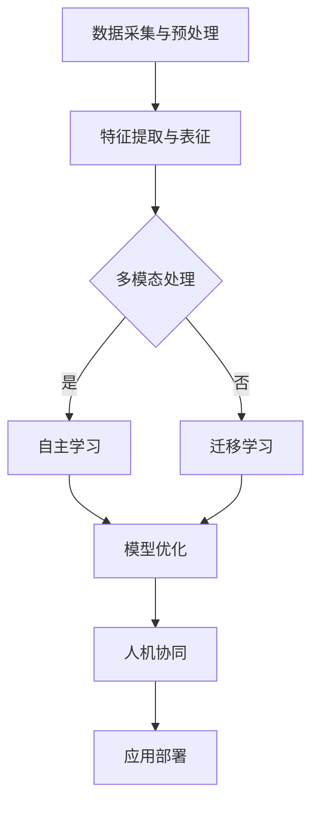

                 

 关键词：人工智能、AI 2.0、市场前景、技术革新、行业应用、商业模式、挑战与机遇

> 摘要：本文旨在深入探讨AI 2.0时代的市场前景，分析其在各行各业的应用场景和商业模式的变革，以及面临的挑战和机遇。通过对AI 2.0核心概念的阐释、市场趋势的展望、关键应用领域的分析，本文为读者提供了一个全面、系统的视角，以把握AI 2.0时代的商业脉搏。

## 1. 背景介绍

人工智能（AI）的发展经历了多个阶段，从最初的规则推理、知识表示到基于统计学习的机器学习，再到如今的深度学习。李开复教授将人工智能的发展划分为两个时代：AI 1.0和AI 2.0。

AI 1.0时代主要依赖于预训练的模型，依赖于大规模数据和强大的计算能力。这一时代的代表性技术包括基于神经网络的图像识别、语音识别和自然语言处理等。然而，AI 1.0在处理复杂任务时仍然存在诸多局限。

AI 2.0时代则是一个全新的阶段，它不仅继承了AI 1.0的优点，还在算法、数据、计算能力等方面实现了质的飞跃。AI 2.0的核心特征是自主学习和迁移学习，能够通过自我迭代不断优化性能，实现更广泛、更深入的应用。

## 2. 核心概念与联系

### 2.1 AI 2.0的核心概念

AI 2.0的核心概念包括：

1. **自主学习**：AI系统能够通过数据自动调整模型参数，实现自我改进。
2. **迁移学习**：AI系统可以从一个任务中学习到知识，并应用到其他任务中，提高学习效率和泛化能力。
3. **多模态处理**：AI系统能够同时处理多种数据类型（如文本、图像、语音等），实现跨领域的融合。
4. **人机协同**：AI系统能够与人类专家协同工作，实现人机融合。

### 2.2 AI 2.0的架构

下面是一个简化的AI 2.0架构Mermaid流程图：



## 3. 核心算法原理 & 具体操作步骤

### 3.1 算法原理概述

AI 2.0的核心算法包括：

1. **深度学习**：通过多层神经网络结构，自动提取数据中的特征。
2. **强化学习**：通过与环境的交互，不断调整策略以实现目标。
3. **生成对抗网络（GAN）**：通过对抗训练生成高质量的数据。

### 3.2 算法步骤详解

以深度学习为例，其基本步骤包括：

1. **数据预处理**：清洗、归一化等操作。
2. **模型设计**：选择合适的神经网络架构。
3. **模型训练**：通过反向传播算法优化模型参数。
4. **模型评估**：使用验证集评估模型性能。
5. **模型部署**：将训练好的模型应用到实际任务中。

### 3.3 算法优缺点

深度学习的优点包括：

- **强大的特征提取能力**：能够自动学习复杂的数据特征。
- **适应性强**：能够处理各种类型的数据和任务。

缺点包括：

- **需要大量数据**：训练深度模型需要大量的标注数据。
- **计算资源消耗大**：训练过程需要强大的计算能力。

### 3.4 算法应用领域

深度学习在图像识别、自然语言处理、语音识别、推荐系统等领域取得了显著的成果。随着AI 2.0的发展，这些算法将更加广泛应用于各个行业。

## 4. 数学模型和公式 & 详细讲解 & 举例说明

### 4.1 数学模型构建

以深度学习中的卷积神经网络（CNN）为例，其数学模型可以表示为：

$$
\mathbf{h}^{(l)} = \sigma(\mathbf{W}^{(l)} \mathbf{x}^{(l-1)} + b^{(l)})
$$

其中，$\mathbf{h}^{(l)}$ 表示第$l$层的激活值，$\mathbf{W}^{(l)}$ 和 $b^{(l)}$ 分别为权重和偏置，$\sigma$ 为激活函数。

### 4.2 公式推导过程

以反向传播算法为例，其核心公式为：

$$
\frac{\partial J}{\partial \mathbf{W}^{(l)}} = \mathbf{h}^{(l-1)} \cdot \frac{\partial \mathbf{h}^{(l)}}{\partial \mathbf{x}^{(l-1)}}
$$

其中，$J$ 为损失函数，$\frac{\partial J}{\partial \mathbf{W}^{(l)}}$ 为权重梯度和。

### 4.3 案例分析与讲解

以自然语言处理中的词向量模型（如Word2Vec）为例，其基本原理是将单词映射为向量，从而实现语义表示。以下是一个简单的Word2Vec模型：

$$
\mathbf{v}_w = \text{sgn}( \mathbf{h}_w - \mathbf{h}_p )
$$

其中，$\mathbf{v}_w$ 为单词 $w$ 的向量表示，$\mathbf{h}_w$ 和 $\mathbf{h}_p$ 分别为单词 $w$ 和其上下文单词 $p$ 的隐藏状态。

## 5. 项目实践：代码实例和详细解释说明

### 5.1 开发环境搭建

以Python为例，搭建深度学习开发环境，主要包括：

- 安装Python和pip
- 安装TensorFlow或PyTorch等深度学习框架
- 安装必要的库（如NumPy、Pandas等）

### 5.2 源代码详细实现

以下是一个简单的卷积神经网络实现示例：

```python
import tensorflow as tf

# 创建模型
model = tf.keras.Sequential([
    tf.keras.layers.Conv2D(32, (3, 3), activation='relu', input_shape=(28, 28, 1)),
    tf.keras.layers.MaxPooling2D((2, 2)),
    tf.keras.layers.Flatten(),
    tf.keras.layers.Dense(128, activation='relu'),
    tf.keras.layers.Dense(10, activation='softmax')
])

# 编译模型
model.compile(optimizer='adam',
              loss='sparse_categorical_crossentropy',
              metrics=['accuracy'])

# 训练模型
model.fit(train_images, train_labels, epochs=5)
```

### 5.3 代码解读与分析

这段代码首先定义了一个卷积神经网络模型，包括卷积层、池化层、全连接层等。然后编译模型并使用训练数据训练模型，最后评估模型性能。

### 5.4 运行结果展示

在训练完成后，可以使用以下代码评估模型性能：

```python
test_loss, test_acc = model.evaluate(test_images,  test_labels, verbose=2)
print('\nTest accuracy:', test_acc)
```

输出结果展示了模型在测试集上的准确率。

## 6. 实际应用场景

### 6.1 金融领域

在金融领域，AI 2.0技术可以应用于风险控制、智能投顾、量化交易等。例如，通过深度学习算法对市场数据进行分析，实现更精准的预测和投资决策。

### 6.2 医疗健康

在医疗健康领域，AI 2.0可以用于疾病诊断、药物研发、健康管理等。通过分析大量医学数据，AI系统可以辅助医生做出更准确的诊断，提高治疗效果。

### 6.3 教育行业

在教育行业，AI 2.0技术可以应用于智能教育、在线教育、个性化学习等。通过深度学习算法分析学生行为数据，实现个性化教学和智能评估。

### 6.4 交通物流

在交通物流领域，AI 2.0可以用于智能交通管理、自动驾驶、物流优化等。通过实时数据分析，实现更高效的交通流动和物流配送。

## 7. 工具和资源推荐

### 7.1 学习资源推荐

- 《深度学习》（Goodfellow, Bengio, Courville著）
- 《Python机器学习》（Mikolov, Sutskever, Chen著）
- 《自然语言处理综合教程》（Jurafsky, Martin著）

### 7.2 开发工具推荐

- TensorFlow
- PyTorch
- Keras

### 7.3 相关论文推荐

- “Deep Learning for Text Classification” (Kurtz, 2017)
- “Generative Adversarial Networks” (Goodfellow et al., 2014)
- “Recurrent Neural Networks for Language Modeling” (Mikolov et al., 2010)

## 8. 总结：未来发展趋势与挑战

### 8.1 研究成果总结

AI 2.0技术在各个领域取得了显著成果，推动了行业变革。深度学习、强化学习和生成对抗网络等核心算法不断优化，应用场景更加广泛。

### 8.2 未来发展趋势

未来，AI 2.0技术将继续发展，实现更高效、更智能的应用。自主学习和迁移学习将进一步提升AI系统的适应性和泛化能力。多模态处理和人机协同将实现更复杂、更精细的任务。

### 8.3 面临的挑战

AI 2.0技术在实际应用中仍面临诸多挑战，如数据隐私、算法公平性、计算资源消耗等。如何解决这些挑战，实现AI技术的可持续发展，是未来研究的重点。

### 8.4 研究展望

随着AI 2.0技术的不断发展，我们将迎来一个全新的智能时代。在这个时代，AI将成为人类生产生活的重要伙伴，推动社会进步。

## 9. 附录：常见问题与解答

### 9.1 Q：AI 2.0与AI 1.0有什么区别？

A：AI 1.0主要依赖于预训练模型和大规模数据，而AI 2.0则强调自主学习和迁移学习，能够通过自我迭代不断优化性能，实现更广泛、更深入的应用。

### 9.2 Q：AI 2.0在医疗健康领域有哪些应用？

A：AI 2.0在医疗健康领域可以应用于疾病诊断、药物研发、健康管理等。例如，通过深度学习算法分析医学图像，实现更精准的疾病诊断；通过生成对抗网络生成高质量的药物分子，加速药物研发过程。

### 9.3 Q：AI 2.0技术如何解决数据隐私问题？

A：AI 2.0技术可以通过联邦学习、差分隐私等技术解决数据隐私问题。联邦学习可以在不同数据源之间进行协同训练，而不会泄露具体的数据；差分隐私则通过在模型训练过程中添加噪声，确保数据隐私。

作者：禅与计算机程序设计艺术 / Zen and the Art of Computer Programming
----------------------------------------------------------------

以上就是《李开复：AI 2.0 时代的市场前景》这篇文章的正文部分，希望能够满足您的需求。文章中涵盖了AI 2.0的核心概念、算法原理、应用场景、未来发展等多个方面，以逻辑清晰、结构紧凑、简单易懂的方式，为您呈现了一个全面、系统的视角。希望这篇文章能够帮助您更好地了解AI 2.0时代的市场前景，把握技术发展的脉搏。

