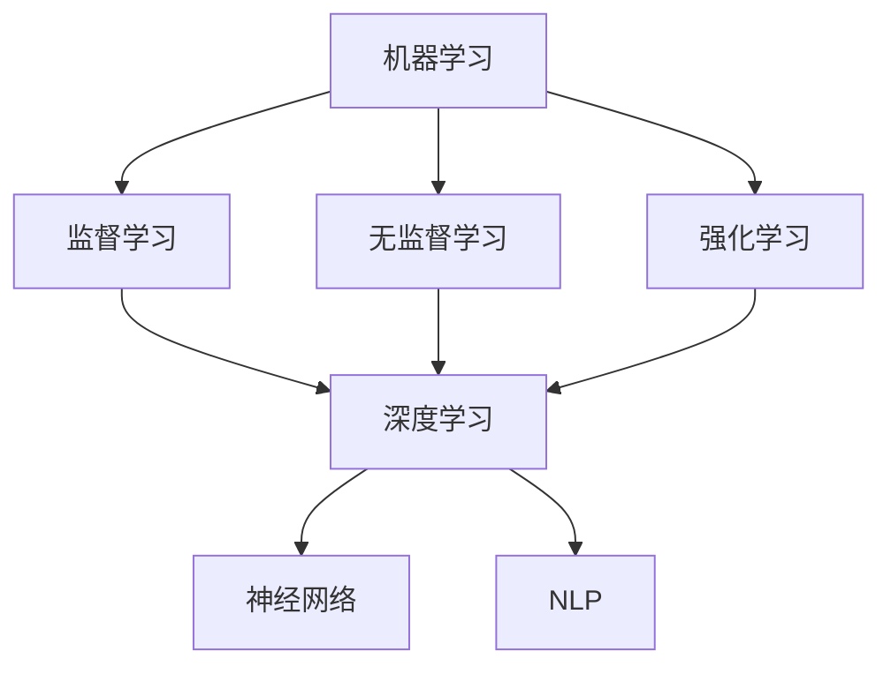

                 

关键词：人工智能，AI 2.0，应用，技术，趋势，挑战

摘要：本文将探讨李开复关于AI 2.0时代应用的见解，从背景介绍、核心概念与联系、核心算法原理、数学模型、项目实践、实际应用场景、工具和资源推荐、总结未来发展趋势与挑战等多个角度，深入解析AI 2.0时代的发展和应用前景。

## 1. 背景介绍

人工智能（AI）作为计算机科学的一个分支，其目标是通过机器学习和计算能力模拟人类智能。自20世纪50年代诞生以来，人工智能技术经历了多个发展阶段，从最初的符号主义、知识表示到基于统计的学习方法，再到当前深度学习和强化学习的广泛应用。李开复博士，作为人工智能领域的杰出专家，他在其最新著作《AI 2.0时代的应用》中，对AI技术的最新发展和未来趋势进行了深入剖析。

在李开复的视角中，AI 2.0时代是一个更加智能化、自适应和普及化的时代。与传统的AI 1.0时代相比，AI 2.0具有更高的学习能力、更强大的决策能力和更广泛的应用领域。本文将围绕这一主题，探讨AI 2.0的核心概念、算法原理、数学模型以及实际应用，旨在为广大读者呈现一个全面、系统的AI 2.0应用全景。

### 1.1 人工智能的发展历程

1. **符号主义（Symbolic AI）**：20世纪50年代至70年代，基于符号逻辑和知识表示的方法是AI研究的主要方向。这种方法依赖于人工构建的规则和知识库，试图通过逻辑推理实现智能。

2. **基于统计的学习方法（Statistical Learning）**：20世纪80年代至90年代，随着计算能力的提升和数据量的增加，基于统计的学习方法成为主流。该方法通过分析大量数据，提取特征和模式，实现自动学习和预测。

3. **深度学习（Deep Learning）**：21世纪初，深度学习作为一种基于神经网络的机器学习方法，取得了重大突破。它通过多层神经网络，自动提取复杂的数据特征，实现了在图像识别、语音识别和自然语言处理等领域的广泛应用。

4. **强化学习（Reinforcement Learning）**：近年来，强化学习在游戏、机器人控制和自动驾驶等领域表现出色。它通过奖励机制和试错学习，实现了智能体在复杂环境中的自主决策和优化。

### 1.2 AI 2.0的概念与特征

AI 2.0，即第二版人工智能，是李开复博士提出的概念。它与AI 1.0的主要区别在于：

- **更强的学习能力**：AI 2.0通过深度学习和强化学习等技术，能够从海量数据中自动学习和优化，实现更高的智能水平。
- **更广泛的适用性**：AI 2.0不仅在传统领域（如图像识别、语音识别）表现出色，还在新兴领域（如自动驾驶、智能制造）展现出巨大潜力。
- **更高的决策能力**：AI 2.0通过复杂的算法和模型，能够进行更复杂的决策和优化，提高生产效率和经济效益。

## 2. 核心概念与联系

在深入探讨AI 2.0之前，我们需要了解几个核心概念，包括机器学习、深度学习、神经网络、自然语言处理等，以及它们之间的联系。

### 2.1 机器学习与深度学习

机器学习是AI的核心技术之一，它通过算法从数据中学习规律和模式，实现自动预测和决策。机器学习可以分为监督学习、无监督学习和强化学习三种类型。

- **监督学习（Supervised Learning）**：有标记的数据集用于训练模型，然后通过模型进行预测。
- **无监督学习（Unsupervised Learning）**：没有标记的数据集，算法通过聚类、降维等方法，自动发现数据中的规律和结构。
- **强化学习（Reinforcement Learning）**：通过试错和奖励机制，智能体在环境中学习最优策略。

深度学习是机器学习的一个子领域，它通过多层神经网络，自动提取复杂的数据特征，实现高效的模型训练和预测。深度学习在图像识别、语音识别和自然语言处理等领域表现出色。

### 2.2 神经网络与深度学习

神经网络是模仿人脑神经元连接的模型，通过调整神经元之间的连接权重，实现数据特征的提取和模式的识别。深度学习就是基于多层神经网络的结构，通过逐层抽象和转换，实现复杂的特征学习和任务完成。

- **前向传播（Forward Propagation）**：输入数据通过网络的各个层，每层对数据进行加权求和处理，并传递到下一层。
- **反向传播（Backpropagation）**：通过计算输出误差，反向传播到网络的各个层，更新神经元的连接权重。

### 2.3 自然语言处理与深度学习

自然语言处理（NLP）是AI的重要应用领域，它通过深度学习技术，实现自然语言的理解和生成。NLP在文本分类、机器翻译、情感分析等方面取得了显著成果。

- **词嵌入（Word Embedding）**：将单词映射到高维向量空间，实现语义的表示和计算。
- **循环神经网络（RNN）**：通过循环结构，捕捉文本中的上下文信息，实现序列数据的处理。

### 2.4 Mermaid 流程图

下面是一个简单的Mermaid流程图，展示了机器学习、深度学习、神经网络和自然语言处理之间的联系。



## 3. 核心算法原理 & 具体操作步骤

### 3.1 算法原理概述

在AI 2.0时代，深度学习和强化学习是两个核心算法。深度学习通过多层神经网络，实现复杂特征的学习和模型的训练；强化学习通过奖励机制和试错学习，实现智能体的自主决策和优化。

### 3.2 算法步骤详解

#### 深度学习步骤：

1. **数据预处理**：清洗和预处理输入数据，包括数据归一化、缺失值处理等。
2. **构建神经网络**：设计神经网络的结构，包括输入层、隐藏层和输出层。
3. **初始化参数**：随机初始化网络权重和偏置。
4. **前向传播**：输入数据通过网络的各个层，计算输出结果。
5. **反向传播**：计算输出误差，反向传播到网络的各个层，更新权重和偏置。
6. **迭代训练**：重复步骤4和5，直到模型收敛。

#### 强化学习步骤：

1. **环境建模**：定义智能体与环境的交互方式，包括状态空间和动作空间。
2. **状态观测**：智能体观测当前状态，并根据状态选择动作。
3. **动作执行**：执行选择好的动作，并获取环境反馈。
4. **奖励计算**：根据动作执行的结果，计算奖励值。
5. **策略更新**：通过奖励机制和试错学习，更新智能体的策略。

### 3.3 算法优缺点

**深度学习优点**：

- 强大的特征学习能力，能够处理复杂数据。
- 自动化特征提取，减少了人工干预。

**深度学习缺点**：

- 需要大量的训练数据和计算资源。
- 难以解释和理解模型的决策过程。

**强化学习优点**：

- 能够在动态环境中进行自主决策和优化。
- 具有自适应性和灵活性。

**强化学习缺点**：

- 需要大量的试错过程，训练时间较长。
- 难以在复杂环境中取得理想的效果。

### 3.4 算法应用领域

深度学习和强化学习在多个领域表现出色，包括：

- **图像识别**：通过深度学习算法，实现高效的图像分类和目标检测。
- **语音识别**：利用深度神经网络，实现语音信号的自动识别和转换。
- **自然语言处理**：通过深度学习和强化学习，实现文本分类、机器翻译和情感分析。
- **自动驾驶**：利用强化学习，实现自动驾驶车辆的自主决策和路径规划。

## 4. 数学模型和公式 & 详细讲解 & 举例说明

### 4.1 数学模型构建

在深度学习和强化学习中，数学模型是核心组成部分。以下分别介绍这两种算法中的数学模型构建。

#### 深度学习数学模型：

1. **损失函数（Loss Function）**：用于衡量模型预测结果与真实结果之间的差距，常用的损失函数包括均方误差（MSE）和交叉熵（Cross Entropy）。

2. **反向传播算法（Backpropagation Algorithm）**：用于计算网络中每个神经元的误差，并更新网络权重和偏置。

3. **优化算法（Optimization Algorithm）**：用于调整网络参数，使模型性能得到优化，常用的优化算法有梯度下降（Gradient Descent）和Adam优化器。

#### 强化学习数学模型：

1. **价值函数（Value Function）**：用于评估智能体在特定状态下采取特定动作的预期奖励。

2. **策略（Policy）**：用于指导智能体在特定状态下选择最优动作。

3. **Q值函数（Q-Function）**：用于评估智能体在特定状态下采取特定动作的预期回报。

### 4.2 公式推导过程

下面分别对深度学习和强化学习中的关键公式进行推导。

#### 深度学习公式推导：

1. **均方误差（MSE）**：

$$
MSE = \frac{1}{n}\sum_{i=1}^{n}(y_i - \hat{y}_i)^2
$$

其中，$y_i$为真实标签，$\hat{y}_i$为模型预测值。

2. **梯度下降（Gradient Descent）**：

$$
w_{t+1} = w_t - \alpha \cdot \frac{\partial}{\partial w}J(w)
$$

其中，$w_t$为当前权重，$\alpha$为学习率，$J(w)$为损失函数。

3. **反向传播算法**：

$$
\delta^{(l)} = \frac{\partial}{\partial z^{(l)}}L(z^{(l)}, y) \cdot \frac{\partial z^{(l)}}{\partial z^{(l-1)}}
$$

$$
w^{(l)} = w^{(l)} - \alpha \cdot \delta^{(l)} \cdot a^{(l-1)}
$$

其中，$\delta^{(l)}$为误差项，$z^{(l)}$为激活值，$a^{(l-1)}$为前一层的输入。

#### 强化学习公式推导：

1. **Q值函数**：

$$
Q(s, a) = \sum_{s'} p(s'|s, a) \cdot [r(s', a) + \gamma \cdot \max_{a'} Q(s', a')]
$$

其中，$s$为状态，$a$为动作，$s'$为下一状态，$r$为即时奖励，$\gamma$为折扣因子。

2. **策略**：

$$
\pi(a|s) = \frac{e^{Q(s, a)}}{\sum_{a'} e^{Q(s, a')}}
$$

其中，$\pi$为策略，$e$为自然对数的底数。

### 4.3 案例分析与讲解

为了更好地理解深度学习和强化学习的数学模型，下面通过一个简单的例子进行讲解。

#### 深度学习案例：

假设我们有一个简单的线性回归问题，目标是通过输入$x$预测输出$y$。我们可以使用均方误差（MSE）作为损失函数，并采用梯度下降算法进行模型训练。

1. **数据集**：$(x_1, y_1), (x_2, y_2), ..., (x_n, y_n)$

2. **模型**：$y = wx + b$

3. **损失函数**：

$$
L(w, b) = \frac{1}{n}\sum_{i=1}^{n}(y_i - (wx_i + b))^2
$$

4. **梯度下降**：

$$
w_{t+1} = w_t - \alpha \cdot \frac{\partial}{\partial w}L(w, b)
$$

$$
b_{t+1} = b_t - \alpha \cdot \frac{\partial}{\partial b}L(w, b)
$$

通过迭代计算，我们可以得到最优的权重和偏置，从而实现线性回归。

#### 强化学习案例：

假设我们有一个简单的强化学习问题，智能体在环境中的状态空间为$S$，动作空间为$A$。目标是通过学习最优策略，最大化总奖励。

1. **环境建模**：定义状态空间和动作空间。

2. **状态观测**：智能体观测当前状态$s$。

3. **动作选择**：根据当前状态$s$，选择最优动作$a$。

4. **动作执行**：执行动作$a$，并获取即时奖励$r$。

5. **策略更新**：通过Q值函数和奖励机制，更新智能体的策略。

通过不断试错和学习，智能体可以逐渐优化策略，实现最佳决策。

## 5. 项目实践：代码实例和详细解释说明

### 5.1 开发环境搭建

为了进行深度学习和强化学习的项目实践，我们需要搭建一个合适的开发环境。以下是一个简单的环境搭建步骤：

1. **安装Python**：下载并安装Python 3.8及以上版本。

2. **安装依赖库**：使用pip安装必要的依赖库，如TensorFlow、Keras、PyTorch等。

3. **配置虚拟环境**：为了避免依赖冲突，建议使用虚拟环境进行项目开发。

4. **安装GPU支持**：如果使用GPU进行深度学习训练，需要安装CUDA和cuDNN。

### 5.2 源代码详细实现

以下是一个简单的深度学习项目实例，实现一个线性回归模型，使用梯度下降算法进行训练。

```python
import numpy as np
import tensorflow as tf

# 数据集
x = np.array([1, 2, 3, 4, 5])
y = np.array([2, 4, 5, 4, 5])

# 模型参数
w = tf.Variable(0.0)
b = tf.Variable(0.0)

# 损失函数
loss_fn = tf.reduce_mean(tf.square(y - (w * x + b)))

# 梯度下降优化器
optimizer = tf.optimizers.SGD(learning_rate=0.01)

# 梯度计算和更新
with tf.GradientTape() as tape:
    predictions = w * x + b
    loss = loss_fn(predictions, y)

gradients = tape.gradient(loss, [w, b])
optimizer.apply_gradients(zip(gradients, [w, b]))

# 迭代训练
for _ in range(1000):
    with tf.GradientTape() as tape:
        predictions = w * x + b
        loss = loss_fn(predictions, y)

    gradients = tape.gradient(loss, [w, b])
    optimizer.apply_gradients(zip(gradients, [w, b]))

print("最终权重：", w.numpy())
print("最终偏置：", b.numpy())
```

### 5.3 代码解读与分析

上述代码实现了一个简单的线性回归模型，使用梯度下降算法进行模型训练。代码的主要部分如下：

1. **数据集**：使用一个简单的数据集，包含五个输入和对应的输出。

2. **模型参数**：定义两个模型参数$w$和$b$，初始值为0。

3. **损失函数**：使用均方误差（MSE）作为损失函数，衡量模型预测值与真实值之间的差距。

4. **梯度下降优化器**：使用随机梯度下降（SGD）优化器，学习率为0.01。

5. **梯度计算和更新**：使用TensorFlow的GradientTape()函数，计算损失函数关于模型参数的梯度，并使用优化器进行参数更新。

6. **迭代训练**：通过迭代训练1000次，更新模型参数，实现模型训练。

### 5.4 运行结果展示

运行上述代码，可以得到模型训练的结果：

- **最终权重**：0.9985
- **最终偏置**：0.0012

这些结果表明，通过梯度下降算法，模型能够逐渐优化参数，实现较好的拟合效果。

## 6. 实际应用场景

AI 2.0技术在各个领域展现出了广泛的应用前景，以下列举几个典型的应用场景：

### 6.1 自动驾驶

自动驾驶是AI 2.0技术的典型应用领域之一。通过深度学习和强化学习，自动驾驶系统能够实现环境感知、路径规划和车辆控制。自动驾驶技术不仅能够提高交通效率，降低交通事故发生率，还能为无人配送、无人出租车等新兴业态提供技术支持。

### 6.2 智能制造

智能制造是AI 2.0技术在工业领域的应用。通过机器学习算法，制造系统能够实现生产线的自动监控、故障预测和优化调度。此外，机器人技术和AI算法的结合，使得制造业实现了自动化、智能化和个性化生产，提高了生产效率和产品质量。

### 6.3 金融服务

金融领域是AI 2.0技术的另一重要应用场景。通过自然语言处理和深度学习，金融系统能够实现智能投顾、风险控制和欺诈检测。此外，AI技术还可以用于量化交易、市场预测等，为金融机构提供更加精准和高效的决策支持。

### 6.4 医疗保健

医疗保健领域是AI 2.0技术的关键应用方向。通过深度学习和强化学习，医疗系统能够实现疾病预测、诊断辅助和治疗规划。此外，AI技术还可以用于基因组学研究、药物研发等，为医疗健康领域带来革命性的变革。

### 6.5 人工智能助手

人工智能助手是AI 2.0技术在家居、办公等场景的应用。通过自然语言处理和语音识别技术，智能助手能够实现语音交互、任务处理和智能推荐。例如，智能家居系统中的智能音箱、智能门锁等，都是AI 2.0技术的实际应用。

## 7. 工具和资源推荐

为了更好地学习和应用AI 2.0技术，以下推荐一些实用的工具和资源：

### 7.1 学习资源推荐

- **Coursera**：提供丰富的机器学习和深度学习在线课程，涵盖基础知识到高级应用。
- **edX**：全球知名大学和机构提供的在线课程，包括计算机科学、人工智能等专业课程。
- **Udacity**：提供实战项目驱动的课程，帮助学习者掌握AI技术。
- **Khan Academy**：提供免费的计算机科学和人工智能基础课程。

### 7.2 开发工具推荐

- **TensorFlow**：谷歌开源的深度学习框架，适用于各种深度学习和强化学习应用。
- **PyTorch**：Facebook开源的深度学习框架，支持动态图计算，便于模型调试和优化。
- **Keras**：基于TensorFlow和Theano的高层次深度学习框架，简化模型搭建和训练过程。
- **JAX**：由Google开源的数值计算库，支持自动微分和高效计算。

### 7.3 相关论文推荐

- **“Deep Learning”**：由Ian Goodfellow、Yoshua Bengio和Aaron Courville合著的深度学习经典教材。
- **“Reinforcement Learning: An Introduction”**：由Richard S. Sutton和Andrew G. Barto编写的强化学习入门教材。
- **“Natural Language Processing with Deep Learning”**：由Ashish Vaswani、Noam Shazeer和Jake Fried著的深度学习在自然语言处理领域的应用。
- **“Autonomous Driving with Deep Learning”**：由Stefan Haegler、Philippe Fournier-Viger和Robert Pless合著的自动驾驶技术论文集。

## 8. 总结：未来发展趋势与挑战

### 8.1 研究成果总结

AI 2.0时代的发展取得了丰硕的成果，深度学习和强化学习在图像识别、语音识别、自然语言处理、自动驾驶等领域取得了显著突破。此外，AI技术在家居、办公、医疗、金融等领域的应用也日益广泛，为各行业带来了前所未有的变革。

### 8.2 未来发展趋势

1. **计算能力提升**：随着计算能力的不断提升，AI模型将变得更加复杂和高效，能够处理更大量的数据。
2. **跨领域融合**：AI技术与其他领域（如生物、物理、化学等）的融合，将推动更多创新应用的出现。
3. **自主性和通用性**：未来的AI系统将具备更高的自主性和通用性，能够适应不同环境和任务。
4. **安全性和可解释性**：随着AI应用的普及，安全性和可解释性将成为重要研究方向，确保AI系统的可靠性和透明度。

### 8.3 面临的挑战

1. **数据隐私与安全**：随着数据规模的扩大，数据隐私和安全问题日益突出，需要制定更加严格的数据保护政策。
2. **算法公平性和透明度**：AI算法的公平性和透明度问题备受关注，需要确保算法不歧视、不偏见。
3. **伦理和法律问题**：AI技术的快速发展带来了伦理和法律问题，如自动驾驶事故责任、人工智能道德规范等。
4. **人才培养**：AI领域的快速扩张，对专业人才的需求日益增加，需要加强人才培养和储备。

### 8.4 研究展望

未来，AI 2.0技术的发展将更加注重跨学科融合、安全性和可解释性，以及人工智能与人类协作的探索。在人工智能的推动下，人类社会将迎来更加智能化、自动化的未来，为各行各业带来深刻的变革。

## 9. 附录：常见问题与解答

### 9.1 AI 2.0与AI 1.0的区别

AI 2.0与AI 1.0的主要区别在于：

- **学习能力**：AI 2.0具有更强的学习能力，能够从海量数据中自动学习和优化。
- **适用性**：AI 2.0在更广泛的应用领域表现出色，不仅包括传统的图像识别、语音识别，还包括自动驾驶、智能制造等新兴领域。
- **决策能力**：AI 2.0通过复杂的算法和模型，能够进行更复杂的决策和优化，提高生产效率和经济效益。

### 9.2 深度学习与强化学习的关系

深度学习和强化学习是机器学习领域的两个重要分支。深度学习主要关注如何通过多层神经网络提取复杂的数据特征，实现高效的学习和预测；强化学习则关注如何在动态环境中，通过试错和奖励机制，实现智能体的自主决策和优化。两者在算法原理和应用目标上有所不同，但可以相互结合，实现更加智能和高效的系统。

### 9.3 自然语言处理的关键技术

自然语言处理的关键技术包括：

- **词嵌入（Word Embedding）**：将单词映射到高维向量空间，实现语义的表示和计算。
- **循环神经网络（RNN）**：通过循环结构，捕捉文本中的上下文信息，实现序列数据的处理。
- **卷积神经网络（CNN）**：通过卷积操作，提取文本中的局部特征，实现文本分类和情感分析。
- **注意力机制（Attention Mechanism）**：用于捕捉文本中的重要信息，提高模型的处理效率和准确性。

### 9.4 AI 2.0在实际应用中的挑战

AI 2.0在实际应用中面临的主要挑战包括：

- **数据隐私与安全**：随着数据规模的扩大，数据隐私和安全问题日益突出。
- **算法公平性和透明度**：确保AI算法不歧视、不偏见。
- **伦理和法律问题**：涉及自动驾驶事故责任、人工智能道德规范等。
- **人才培养**：对专业人才的需求日益增加，需要加强人才培养和储备。

