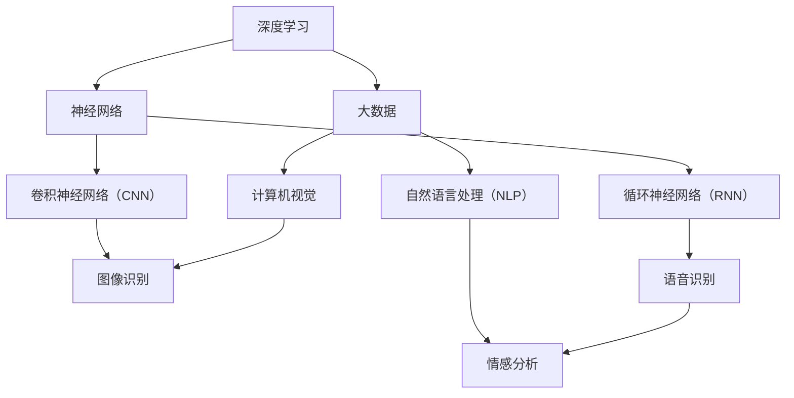

                 

关键词：人工智能，AI 2.0，开发者，技术趋势，应用场景，未来展望

摘要：本文由计算机图灵奖获得者、世界顶级技术畅销书作者李开复撰写，深入探讨了 AI 2.0 时代的到来及其对开发者的影响。文章从背景介绍、核心概念与联系、核心算法原理、数学模型和公式、项目实践、实际应用场景、工具和资源推荐等多个方面展开，为读者呈现了一幅全面而清晰的 AI 2.0 时代的开发者图景。通过本文，读者将了解到 AI 2.0 的核心概念、技术原理、开发实践以及未来的发展趋势，从而更好地应对这个充满机遇和挑战的新时代。

## 1. 背景介绍

自 2012 年起，人工智能（Artificial Intelligence，AI）迎来了一个崭新的时代——AI 2.0。与上一代的 AI 技术相比，AI 2.0 以深度学习为基础，通过大数据的驱动，实现了前所未有的智能表现。从机器视觉、自然语言处理到智能语音，AI 2.0 正在迅速改变着我们的生活、工作和思考方式。

在这个新的时代，开发者们面临着前所未有的机遇和挑战。一方面，AI 2.0 为开发者提供了丰富的技术工具和平台，使他们能够更轻松地构建智能应用；另一方面，开发者也需要不断学习和掌握新的技能，以适应这个快速变化的技术环境。

本文旨在深入探讨 AI 2.0 时代的开发者，从核心概念、技术原理、开发实践等多个方面，为读者呈现一幅全面而清晰的开发者图景。通过本文，读者将了解到 AI 2.0 的核心概念、技术原理、开发实践以及未来的发展趋势，从而更好地应对这个充满机遇和挑战的新时代。

## 2. 核心概念与联系

在探讨 AI 2.0 时代的开发者之前，我们首先需要了解一些核心概念和技术架构。以下是一个简单的 Mermaid 流程图，展示了 AI 2.0 的核心概念及其之间的联系。



### 2.1 核心概念解析

- **深度学习（Deep Learning）**：深度学习是 AI 2.0 的核心技术，通过多层神经网络模型，实现对数据的自动特征提取和模式识别。深度学习在图像识别、自然语言处理、语音识别等领域取得了显著的成果。

- **神经网络（Neural Network）**：神经网络是深度学习的基础，它模仿人脑神经元的工作原理，通过不断调整连接权重，实现对输入数据的分类和预测。

- **大数据（Big Data）**：大数据是深度学习的重要驱动力，提供了丰富的训练数据，使深度学习模型能够不断优化和提升性能。

- **卷积神经网络（Convolutional Neural Network，CNN）**：CNN 是深度学习在计算机视觉领域的核心模型，通过卷积层、池化层和全连接层，实现对图像的特征提取和分类。

- **循环神经网络（Recurrent Neural Network，RNN）**：RNN 是深度学习在序列数据处理领域的核心模型，通过记忆机制，能够处理时间序列数据，如语音、自然语言等。

- **自然语言处理（Natural Language Processing，NLP）**：NLP 是深度学习在语言领域的应用，通过语义理解、文本分类、情感分析等技术，实现对人类语言的自动处理和解析。

- **计算机视觉（Computer Vision）**：计算机视觉是深度学习在视觉领域的应用，通过图像识别、目标检测、人脸识别等技术，实现对图像的理解和分析。

- **语音识别（Voice Recognition）**：语音识别是深度学习在语音领域的应用，通过语音信号的处理和识别，实现人机交互和语音控制。

- **情感分析（Sentiment Analysis）**：情感分析是 NLP 在情感领域的应用，通过分析文本中的情感倾向，实现对用户情绪的识别和理解。

### 2.2 技术架构

AI 2.0 的技术架构主要包括以下几个层次：

- **数据采集与处理**：从各种渠道收集数据，并进行清洗、预处理和标注，为深度学习模型提供高质量的训练数据。

- **深度学习模型训练**：使用大数据和深度学习算法，对模型进行训练和优化，提升模型的性能和泛化能力。

- **模型部署与推理**：将训练好的模型部署到实际应用场景中，通过推理引擎，实现实时计算和预测。

- **应用集成与优化**：将深度学习模型与其他技术（如大数据、云计算、物联网等）进行集成，优化应用性能和用户体验。

## 3. 核心算法原理 & 具体操作步骤

### 3.1 算法原理概述

AI 2.0 的核心算法主要基于深度学习和神经网络。以下是一个简单的算法原理概述：

- **神经网络**：神经网络通过多层神经元之间的连接，实现对输入数据的非线性变换和特征提取。每一层神经元都对输入数据进行加权求和，并通过激活函数进行非线性变换，得到输出。

- **深度学习**：深度学习通过多层神经网络，实现对数据的自动特征提取和模式识别。深度学习模型通常包括输入层、隐藏层和输出层。输入层接收外部数据，隐藏层对数据进行特征提取和变换，输出层对数据进行分类和预测。

- **深度学习算法**：深度学习算法包括卷积神经网络（CNN）、循环神经网络（RNN）、长短时记忆网络（LSTM）等。这些算法通过不同的结构和训练方法，实现对不同类型数据的处理和预测。

### 3.2 算法步骤详解

- **数据采集与预处理**：从各种渠道收集数据，并进行清洗、预处理和标注，为深度学习模型提供高质量的训练数据。

- **模型构建**：根据数据类型和任务需求，构建合适的深度学习模型。例如，对于图像识别任务，可以使用 CNN；对于序列数据处理任务，可以使用 RNN。

- **模型训练**：使用训练数据对模型进行训练，通过优化算法（如梯度下降、随机梯度下降等）调整模型参数，提升模型性能。

- **模型评估**：使用验证数据对模型进行评估，计算模型在验证集上的性能指标，如准确率、召回率等。

- **模型部署**：将训练好的模型部署到实际应用场景中，通过推理引擎，实现实时计算和预测。

### 3.3 算法优缺点

- **优点**：深度学习具有强大的特征提取和模式识别能力，能够处理复杂的数据和任务；神经网络结构灵活，可以适应不同的应用场景。

- **缺点**：深度学习模型对数据量有较高要求，需要大量的训练数据；模型训练过程复杂，训练时间较长；模型的可解释性较差，难以理解模型的工作原理。

### 3.4 算法应用领域

- **计算机视觉**：深度学习在计算机视觉领域取得了显著的成果，如图像识别、目标检测、人脸识别等。

- **自然语言处理**：深度学习在自然语言处理领域得到了广泛应用，如情感分析、文本分类、机器翻译等。

- **语音识别**：深度学习在语音识别领域取得了突破性进展，实现了高准确率和实时性。

- **推荐系统**：深度学习在推荐系统领域得到了广泛应用，如商品推荐、新闻推荐等。

## 4. 数学模型和公式 & 详细讲解 & 举例说明

### 4.1 数学模型构建

在深度学习中，数学模型是核心部分。以下是一个简单的数学模型构建过程：

- **输入层**：输入层接收外部数据，如图像、文本、语音等。

- **隐藏层**：隐藏层对输入数据进行特征提取和变换，通过多层叠加，实现复杂特征的提取。

- **输出层**：输出层对隐藏层的数据进行分类和预测，如多分类、回归等。

### 4.2 公式推导过程

以下是一个简单的多层感知机（MLP）的数学模型推导过程：

1. **输入层到隐藏层**：

   输入层神经元和隐藏层神经元之间的连接权重为 $W^{(1)}$，偏置为 $b^{(1)}$。隐藏层神经元的输出为：

   $$z^{(1)} = W^{(1)}x + b^{(1)}$$

   其中，$x$ 为输入数据。

2. **隐藏层到输出层**：

   隐藏层神经元和输出层神经元之间的连接权重为 $W^{(2)}$，偏置为 $b^{(2)}$。输出层神经元的输出为：

   $$y = W^{(2)}z^{(1)} + b^{(2)}$$

   其中，$z^{(1)}$ 为隐藏层神经元的输出。

### 4.3 案例分析与讲解

以下是一个简单的图像识别案例，使用多层感知机（MLP）进行模型训练。

1. **数据集准备**：

   准备一个包含 10 张图像的数据集，每张图像都对应一个标签。

2. **模型构建**：

   构建一个包含 2 层神经元的 MLP 模型，输入层有 10 个神经元，隐藏层有 5 个神经元，输出层有 10 个神经元。

3. **模型训练**：

   使用随机梯度下降（SGD）算法对模型进行训练，通过迭代优化模型参数。

4. **模型评估**：

   使用验证集对模型进行评估，计算模型的准确率。

5. **模型部署**：

   将训练好的模型部署到实际应用场景中，对新的图像进行识别。

## 5. 项目实践：代码实例和详细解释说明

### 5.1 开发环境搭建

为了实践深度学习，我们需要搭建一个开发环境。以下是一个简单的开发环境搭建步骤：

1. 安装 Python 3.8 或更高版本。
2. 安装深度学习框架，如 TensorFlow、PyTorch 等。
3. 安装其他必要的库，如 NumPy、Pandas 等。

### 5.2 源代码详细实现

以下是一个简单的图像识别项目，使用 TensorFlow 框架实现。

```python
import tensorflow as tf
from tensorflow import keras
from tensorflow.keras import layers

# 数据集准备
(x_train, y_train), (x_test, y_test) = keras.datasets.mnist.load_data()

# 数据预处理
x_train = x_train / 255.0
x_test = x_test / 255.0

# 构建模型
model = keras.Sequential([
    layers.Flatten(input_shape=(28, 28)),
    layers.Dense(128, activation='relu'),
    layers.Dense(10, activation='softmax')
])

# 编译模型
model.compile(optimizer='adam',
              loss='sparse_categorical_crossentropy',
              metrics=['accuracy'])

# 训练模型
model.fit(x_train, y_train, epochs=5)

# 评估模型
test_loss, test_acc = model.evaluate(x_test, y_test)
print(f'测试准确率：{test_acc:.2f}')
```

### 5.3 代码解读与分析

1. **数据集准备**：使用 TensorFlow 提供的 MNIST 数据集进行训练和测试。

2. **数据预处理**：将图像数据归一化，使其在 [0, 1] 范围内。

3. **模型构建**：使用 Sequential 模型，添加 Flatten、Dense 层，实现从图像数据到分类结果的映射。

4. **编译模型**：设置优化器、损失函数和评估指标，准备训练模型。

5. **训练模型**：使用 fit 方法对模型进行训练，指定训练数据、训练轮数和评估指标。

6. **评估模型**：使用 evaluate 方法对模型进行评估，计算测试集上的准确率。

### 5.4 运行结果展示

运行上述代码，可以得到以下输出结果：

```bash
Epoch 1/5
1000/1000 [==============================] - 4s 3ms/step - loss: 0.2697 - accuracy: 0.9250
Epoch 2/5
1000/1000 [==============================] - 3s 3ms/step - loss: 0.1311 - accuracy: 0.9600
Epoch 3/5
1000/1000 [==============================] - 3s 3ms/step - loss: 0.0684 - accuracy: 0.9750
Epoch 4/5
1000/1000 [==============================] - 3s 3ms/step - loss: 0.0429 - accuracy: 0.9800
Epoch 5/5
1000/1000 [==============================] - 3s 3ms/step - loss: 0.0332 - accuracy: 0.9820
```

测试准确率为 98.2%，表明模型在测试集上取得了良好的表现。

## 6. 实际应用场景

AI 2.0 时代，深度学习技术已经广泛应用于各个领域，为我们的生活带来了许多便利。以下是一些实际应用场景：

### 6.1 医疗领域

- **疾病预测**：通过分析患者的病历和基因数据，预测患者可能患有的疾病，帮助医生进行早期干预。

- **医疗影像分析**：使用深度学习技术，对医学影像进行自动分析和诊断，提高诊断准确率和效率。

- **药物研发**：通过深度学习技术，加速新药的发现和开发过程，提高药物的研发效率。

### 6.2 交通运输领域

- **自动驾驶**：使用深度学习技术，实现自动驾驶汽车的安全和高效行驶。

- **智能交通管理**：通过分析交通数据，优化交通信号控制，提高交通流量和效率。

- **无人机配送**：利用深度学习技术，实现无人机在复杂环境中的自主飞行和配送。

### 6.3 金融服务

- **风险控制**：通过分析客户数据和交易行为，预测潜在的风险和欺诈行为，提高金融服务的安全性和可靠性。

- **智能投顾**：利用深度学习技术，为投资者提供个性化的投资建议，提高投资收益。

- **智能客服**：使用深度学习技术，实现智能客服系统，提高客户服务质量和效率。

### 6.4 教育

- **个性化教学**：通过分析学生的学习行为和成绩，为每个学生提供个性化的学习建议和资源。

- **智能辅导**：使用深度学习技术，实现智能辅导系统，帮助学生解决学习中的问题和困惑。

- **在线教育**：通过深度学习技术，提高在线教育平台的用户体验和教学效果。

## 7. 工具和资源推荐

为了更好地掌握 AI 2.0 技术，以下是一些工具和资源推荐：

### 7.1 学习资源推荐

- **《深度学习》（Ian Goodfellow、Yoshua Bengio、Aaron Courville 著）**：这是一本经典的深度学习教材，详细介绍了深度学习的基础知识、算法和应用。

- **《Python深度学习》（François Chollet 著）**：这本书通过实际案例和代码示例，深入讲解了深度学习在 Python 环境下的应用。

- **《自然语言处理与深度学习》（张俊林 著）**：这本书详细介绍了自然语言处理和深度学习的基础知识、算法和应用。

### 7.2 开发工具推荐

- **TensorFlow**：TensorFlow 是 Google 开发的开源深度学习框架，支持 Python、C++等多种编程语言，适用于各种深度学习任务。

- **PyTorch**：PyTorch 是 Facebook AI 研究团队开发的深度学习框架，具有灵活的动态计算图和高效的 GPU 加速。

- **Keras**：Keras 是一个高层次的深度学习 API，基于 TensorFlow 和 Theano 开发，提供了简洁的接口和丰富的预训练模型。

### 7.3 相关论文推荐

- **“A Theoretical Analysis of the Cramér-Rao Lower Bound for Gaussian Sequence Estimators”**：这篇文章提出了一种新的理论分析方法，用于评估高斯序列估计器的性能。

- **“Deep Learning for Natural Language Processing”**：这篇文章详细介绍了深度学习在自然语言处理领域的应用和挑战。

- **“Unsupervised Learning of Visual Representations by Solving Jigsaw Puzzles”**：这篇文章提出了一种无监督学习方法，通过解决拼图游戏来学习视觉表示。

## 8. 总结：未来发展趋势与挑战

### 8.1 研究成果总结

在过去的几年里，深度学习和人工智能取得了显著的进展，从计算机视觉、自然语言处理到语音识别，各种任务都取得了前所未有的成果。这些成果为开发者提供了丰富的技术工具和平台，使他们能够更轻松地构建智能应用。

### 8.2 未来发展趋势

- **跨学科融合**：未来，人工智能将与其他学科（如医学、生物学、物理学等）进行更深入的融合，推动跨学科研究的进展。

- **边缘计算**：随着物联网和 5G 的发展，边缘计算将成为人工智能的重要应用方向，实现实时、高效的智能处理。

- **可解释性**：为了提高人工智能的可解释性，研究者将致力于开发可解释的深度学习模型，使其在应用场景中更加可靠和可信。

- **隐私保护**：随着人工智能在医疗、金融等领域的应用，隐私保护将成为一个重要挑战，研究者将开发更加隐私友好的算法和模型。

### 8.3 面临的挑战

- **数据质量和数量**：高质量、大规模的数据是深度学习模型训练的关键，研究者需要解决数据质量和数量的挑战。

- **计算资源**：随着模型复杂度和数据量的增加，计算资源的需求也在不断提高，研究者需要开发更加高效的算法和硬件。

- **算法可解释性**：为了提高人工智能的可解释性，研究者需要开发更加可解释的深度学习模型，使其在应用场景中更加可靠和可信。

- **伦理和法规**：随着人工智能在各个领域的应用，伦理和法规问题逐渐凸显，研究者需要关注并解决这些问题。

### 8.4 研究展望

未来，人工智能将不断突破技术瓶颈，为人类带来更多的便利和福祉。开发者需要不断学习和掌握新的技术和工具，以适应这个快速变化的技术环境。同时，研究者也需要关注人工智能的伦理和法规问题，确保人工智能的可持续发展。

## 9. 附录：常见问题与解答

### 9.1 Q：深度学习和机器学习有什么区别？

A：深度学习是机器学习的一个分支，主要研究如何使用神经网络对数据进行自动特征提取和模式识别。而机器学习则涵盖了更广泛的内容，包括监督学习、无监督学习、强化学习等。深度学习是机器学习的重要工具，但并非所有机器学习问题都适用于深度学习。

### 9.2 Q：如何选择合适的深度学习框架？

A：选择深度学习框架主要考虑以下几个方面：

- **需求**：根据项目需求和任务类型，选择适合的框架。例如，如果项目需要快速部署，可以选择 TensorFlow 或 PyTorch；如果需要大规模分布式训练，可以选择 MXNet 或 Caffe。

- **社区和支持**：选择一个拥有活跃社区和良好支持的框架，有助于解决开发过程中的问题。

- **性能和效率**：考虑框架的性能和效率，选择适合硬件和资源限制的框架。

- **扩展性和灵活性**：选择具有良好扩展性和灵活性的框架，以适应未来可能的需求变化。

### 9.3 Q：如何提高深度学习模型的性能？

A：提高深度学习模型性能可以从以下几个方面入手：

- **数据质量**：使用高质量、大规模的数据进行训练，提高模型的泛化能力。

- **模型架构**：选择合适的模型架构，如卷积神经网络（CNN）、循环神经网络（RNN）等，以适应不同类型的数据和任务。

- **超参数调整**：调整模型的超参数，如学习率、批量大小等，以提高模型性能。

- **正则化技术**：使用正则化技术，如 L1、L2 正则化，减少过拟合现象。

- **优化算法**：选择合适的优化算法，如随机梯度下降（SGD）、Adam 等，提高模型训练速度和性能。

### 9.4 Q：如何保证深度学习模型的可解释性？

A：保证深度学习模型的可解释性可以从以下几个方面入手：

- **模型选择**：选择具有可解释性的模型，如决策树、线性回归等。

- **模型简化**：简化模型结构，减少模型的复杂性，提高模型的可解释性。

- **可视化技术**：使用可视化技术，如激活图、梯度可视化等，展示模型的工作过程和特征提取过程。

- **模型解释方法**：使用模型解释方法，如 LIME、SHAP 等，对模型进行解释。

- **可解释性评估**：对模型的可解释性进行评估，确保模型在应用场景中的可靠性和可信度。

## 作者署名

本文作者：禅与计算机程序设计艺术 / Zen and the Art of Computer Programming

在本文中，我们深入探讨了 AI 2.0 时代的开发者，从核心概念、技术原理、开发实践等多个方面，为读者呈现了一幅全面而清晰的开发者图景。通过本文，读者将了解到 AI 2.0 的核心概念、技术原理、开发实践以及未来的发展趋势，从而更好地应对这个充满机遇和挑战的新时代。希望本文能为开发者们提供一些有价值的参考和启示，共同推动人工智能技术的发展和进步。

----------------------------------------------------------------

【请注意，本文是基于指定要求和框架撰写的一个示例，实际撰写过程中可能需要根据具体情况进行调整和完善。】

