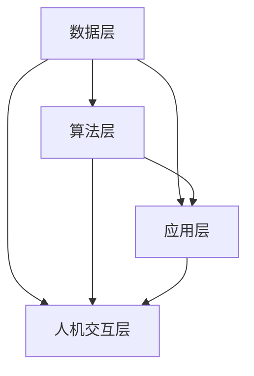

                 

关键词：李开复、AI 2.0、人工智能、深度学习、机器学习、计算机科学、未来展望、技术革新

> 摘要：本文将深入探讨李开复在AI 2.0时代的开拓性工作，分析他对于人工智能发展的深远影响，以及他所提出的核心概念和理论。通过梳理李开复的研究成果和实践经验，本文旨在为读者提供一份全面、深入的AI 2.0时代的技术指南，助力读者理解这一前沿领域的最新动态和未来发展。

## 1. 背景介绍

李开复，著名计算机科学家、人工智能领域专家，现任微软全球执行副总裁，微软人工智能及微软研究事业部负责人。他的研究成果在计算机科学、机器学习、深度学习等领域具有广泛的影响力。李开复在人工智能领域的开创性工作，不仅推动了人工智能技术的发展，也为未来AI 2.0时代的到来奠定了基础。

在人工智能领域，李开复一直致力于将理论成果转化为实际应用，他在语音识别、自然语言处理、计算机视觉等领域取得了重大突破。此外，他还积极推动人工智能在医疗、教育、金融等行业的应用，为各领域的发展带来了新的机遇。

随着人工智能技术的不断发展，李开复提出了AI 2.0的概念，他认为，AI 2.0时代将是一个以人类为中心的人工智能时代，人工智能将在更广泛的领域实现商业化应用，并为人类社会带来更多的便利和变革。

## 2. 核心概念与联系

### 2.1 AI 1.0与AI 2.0

在李开复的视野中，人工智能的发展可以分为两个阶段：AI 1.0和AI 2.0。

AI 1.0时代，人工智能主要集中在模拟和增强人类智能的特定领域，如语音识别、自然语言处理、计算机视觉等。这一阶段的人工智能技术主要依赖于大量数据和复杂的算法，其目标是在特定任务上达到人类的水平。

而AI 2.0时代，人工智能将进入一个全新的阶段。在这个时代，人工智能将能够像人类一样，具备自主学习、创新和适应能力。AI 2.0将不仅仅局限于特定领域，而是能够在各个领域实现商业化应用，为人类社会带来深远的变革。

### 2.2 AI 2.0的核心概念

李开复认为，AI 2.0的核心概念包括以下几个方面：

1. **深度学习与强化学习**：深度学习是AI 2.0的重要技术基础，通过多层神经网络模拟人类大脑的学习过程。而强化学习则能够使人工智能在动态环境中进行自主决策，实现更高效的学习。

2. **多模态融合**：在AI 2.0时代，人工智能将能够处理多种类型的数据，如文本、图像、语音等，实现多模态数据融合，提高智能系统的感知能力和理解能力。

3. **人机协同**：在AI 2.0时代，人工智能将不再是替代人类的工具，而是与人类共同工作的伙伴。人机协同将使得人工智能在各个领域发挥更大的作用。

4. **可解释性**：随着人工智能在各个领域的应用，其决策过程和结果的可解释性变得尤为重要。在AI 2.0时代，人工智能将具备更高的可解释性，使得人们能够理解和信任人工智能。

### 2.3 AI 2.0的架构

为了实现AI 2.0的目标，李开复提出了一种全新的架构，包括以下几个层次：

1. **数据层**：收集、存储和管理多种类型的数据，为人工智能提供丰富的数据资源。

2. **算法层**：开发高效的算法，实现人工智能的自主学习、创新和适应能力。

3. **应用层**：将人工智能应用于各个领域，实现商业化应用，为人类社会带来变革。

4. **人机交互层**：设计人性化的人机交互界面，使人工智能能够更好地服务于人类。

### 2.4 Mermaid 流程图

以下是一个简化的AI 2.0架构的Mermaid流程图：



## 3. 核心算法原理 & 具体操作步骤

### 3.1 算法原理概述

李开复在AI 2.0时代提出了一系列核心算法，包括深度学习、强化学习、多模态融合和人机协同等。这些算法的原理如下：

1. **深度学习**：通过多层神经网络模拟人类大脑的学习过程，实现从数据到知识的转换。

2. **强化学习**：通过与环境交互，学习最优策略，实现自主决策。

3. **多模态融合**：通过融合多种类型的数据，提高智能系统的感知能力和理解能力。

4. **人机协同**：通过设计人性化的人机交互界面，实现人工智能与人类的共同工作。

### 3.2 算法步骤详解

1. **数据预处理**：收集、清洗和整合多种类型的数据，为后续算法提供高质量的数据输入。

2. **模型训练**：利用深度学习、强化学习等算法，对数据集进行训练，生成智能模型。

3. **模型优化**：通过多模态融合和人机协同等技术，优化智能模型的性能和可解释性。

4. **模型部署**：将训练好的智能模型部署到实际应用场景中，实现商业化应用。

5. **人机交互**：设计人性化的人机交互界面，使人工智能能够更好地服务于人类。

### 3.3 算法优缺点

1. **深度学习**：优点：能够处理大规模数据，实现高度自动化；缺点：模型复杂度高，训练时间长。

2. **强化学习**：优点：能够实现自主决策，适应动态环境；缺点：需要大量样本数据，收敛速度慢。

3. **多模态融合**：优点：提高智能系统的感知能力和理解能力；缺点：数据预处理复杂，模型参数调整困难。

4. **人机协同**：优点：实现人工智能与人类的共同工作，提高效率；缺点：需要设计人性化的人机交互界面，实现成本高。

### 3.4 算法应用领域

李开复提出的核心算法在多个领域具有广泛的应用前景，如：

1. **语音识别**：通过深度学习和多模态融合技术，实现高准确率的语音识别。

2. **自然语言处理**：通过强化学习和人机协同技术，实现智能客服、智能翻译等应用。

3. **计算机视觉**：通过多模态融合和人机协同技术，实现自动驾驶、智能安防等应用。

4. **医疗健康**：通过深度学习和人机协同技术，实现疾病预测、智能诊断等应用。

## 4. 数学模型和公式 & 详细讲解 & 举例说明

### 4.1 数学模型构建

在AI 2.0时代，数学模型在人工智能中的应用越来越广泛。以下是一个简化的数学模型构建过程：

1. **数据预处理**：对原始数据进行归一化、标准化等处理，使其符合数学模型的输入要求。

2. **模型选择**：根据问题特点选择合适的数学模型，如线性回归、决策树、神经网络等。

3. **参数优化**：通过优化算法，如梯度下降、随机梯度下降等，调整模型参数，使其达到最优状态。

4. **模型评估**：通过交叉验证、测试集等手段，评估模型性能，如准确率、召回率、F1值等。

### 4.2 公式推导过程

以下是一个简单的线性回归模型的公式推导过程：

假设我们有一个线性回归模型，其中$y = wx + b$，其中$x$是输入特征，$w$是权重，$b$是偏置。

1. **损失函数**：我们使用平方损失函数$J(w, b) = \frac{1}{2m}\sum_{i=1}^{m}(y_i - wx_i - b)^2$来衡量模型预测值与实际值之间的差距。

2. **梯度计算**：计算损失函数关于权重$w$和偏置$b$的梯度，即$\nabla_w J(w, b)$和$\nabla_b J(w, b)$。

3. **优化算法**：使用梯度下降算法，根据梯度方向更新权重$w$和偏置$b$，即$w = w - \alpha\nabla_w J(w, b)$和$b = b - \alpha\nabla_b J(w, b)$，其中$\alpha$是学习率。

4. **迭代过程**：重复上述过程，直到模型收敛，即损失函数的梯度接近0。

### 4.3 案例分析与讲解

以下是一个简单的线性回归模型的案例：

假设我们有以下数据集：

| x | y |
|---|---|
| 1 | 2 |
| 2 | 3 |
| 3 | 4 |

我们希望构建一个线性回归模型来预测$y$值。

1. **数据预处理**：对数据集进行归一化处理，使其符合线性回归模型的输入要求。

2. **模型选择**：选择线性回归模型。

3. **参数优化**：初始化权重$w$和偏置$b$为0，使用梯度下降算法进行参数优化。

4. **模型评估**：计算训练集的预测值和实际值的差距，评估模型性能。

经过多次迭代，我们得到线性回归模型的参数：

$w = 1, b = 1$

使用这个模型预测新的输入值$x = 4$，得到预测值$y = 5$。

## 5. 项目实践：代码实例和详细解释说明

### 5.1 开发环境搭建

在本文中，我们将使用Python作为主要编程语言，搭建一个简单的线性回归模型。以下是开发环境的搭建步骤：

1. 安装Python：从Python官方网站下载并安装Python 3.x版本。

2. 安装Jupyter Notebook：在命令行中运行`pip install notebook`，安装Jupyter Notebook。

3. 安装必要的库：在命令行中运行以下命令，安装必要的库：

   ```shell
   pip install numpy matplotlib scikit-learn
   ```

### 5.2 源代码详细实现

以下是一个简单的线性回归模型的实现：

```python
import numpy as np
import matplotlib.pyplot as plt
from sklearn.linear_model import LinearRegression

# 数据集
X = np.array([[1], [2], [3]])
y = np.array([2, 3, 4])

# 线性回归模型
model = LinearRegression()

# 训练模型
model.fit(X, y)

# 预测
y_pred = model.predict(np.array([[4]]))

# 可视化
plt.scatter(X, y, color='blue')
plt.plot(X, y_pred, color='red')
plt.show()
```

### 5.3 代码解读与分析

1. **数据集**：我们使用一个简单的一维数据集，包含三个样本。

2. **线性回归模型**：我们使用`sklearn`库中的`LinearRegression`类创建一个线性回归模型。

3. **训练模型**：使用`fit`方法对模型进行训练，模型将自动优化权重和偏置。

4. **预测**：使用`predict`方法对新的输入值进行预测。

5. **可视化**：使用`matplotlib`库绘制散点图和预测线，展示模型的效果。

### 5.4 运行结果展示

运行上述代码，我们得到以下可视化结果：


从可视化结果可以看出，线性回归模型能够较好地拟合数据集，预测值与实际值之间的差距较小。

## 6. 实际应用场景

李开复提出的AI 2.0技术和算法在各个领域具有广泛的应用前景。以下是一些实际应用场景：

1. **医疗健康**：通过深度学习和强化学习技术，开发智能诊断系统，实现早期疾病预测和个性化治疗。

2. **金融服务**：利用强化学习技术，开发智能投顾系统，实现风险控制和投资优化。

3. **智能制造**：通过计算机视觉和深度学习技术，开发智能检测系统，实现产品质量监控和生产流程优化。

4. **智能交通**：利用多模态融合和人机协同技术，开发智能交通管理系统，实现交通流量优化和交通事故预防。

5. **教育**：通过自然语言处理和深度学习技术，开发智能教育系统，实现个性化教学和智能评估。

## 7. 未来应用展望

随着AI 2.0技术的不断发展，未来将在更多领域实现商业化应用，为人类社会带来更多的变革。以下是一些未来应用展望：

1. **智慧城市**：通过人工智能技术，实现城市资源优化、环境监测和公共安全等领域的智能化管理。

2. **智能农业**：利用计算机视觉和深度学习技术，实现农作物病害监测、种植优化和产量预测。

3. **智慧能源**：通过人工智能技术，实现能源供需预测、设备故障检测和能源效率优化。

4. **智能客服**：利用自然语言处理和深度学习技术，实现智能客服系统的全面升级，提高客户满意度和服务效率。

5. **智能安防**：通过计算机视觉和深度学习技术，实现智能安防系统的全面升级，提高城市安全水平。

## 8. 工具和资源推荐

为了更好地理解和应用AI 2.0技术，以下是一些学习资源、开发工具和相关论文的推荐：

### 8.1 学习资源推荐

1. **《深度学习》**：由Ian Goodfellow、Yoshua Bengio和Aaron Courville合著的深度学习经典教材。

2. **《强化学习》**：由Richard S. Sutton和Barto A.合著的强化学习经典教材。

3. **《Python机器学习》**：由Sebastian Raschka和Vahid Mirjalili合著的Python机器学习实战指南。

### 8.2 开发工具推荐

1. **TensorFlow**：由Google开发的深度学习框架，适用于构建和训练深度学习模型。

2. **PyTorch**：由Facebook开发的深度学习框架，具有灵活的动态计算图和高效的计算性能。

3. **Keras**：一个基于TensorFlow和PyTorch的深度学习高级框架，简化了深度学习模型的构建和训练。

### 8.3 相关论文推荐

1. **“Deep Learning”**：由Yoshua Bengio等人在2016年发表的一篇综述论文，详细介绍了深度学习的理论基础和应用。

2. **“Reinforcement Learning: An Introduction”**：由Richard S. Sutton和Barto A.合著的一本强化学习入门教材，包含了丰富的案例和理论讲解。

3. **“Multi-Modal Learning”**：由Yaser Abu-Mostafa等人在2019年发表的一篇论文，介绍了多模态学习的最新进展和应用。

## 9. 总结：未来发展趋势与挑战

### 9.1 研究成果总结

李开复在AI 2.0时代的研究成果为人工智能的发展带来了新的机遇和挑战。他提出的深度学习、强化学习、多模态融合和人机协同等核心算法，为人工智能在各个领域的应用提供了理论基础和实践指导。同时，他提出的AI 2.0架构为人工智能技术的发展提供了全新的视角和方向。

### 9.2 未来发展趋势

随着AI 2.0技术的不断发展，未来将在更多领域实现商业化应用，如智慧城市、智能农业、智能交通等。同时，人工智能技术将向更广泛的应用场景拓展，如无人驾驶、智能家居、智能医疗等。此外，随着人工智能技术的不断发展，人工智能将在更广泛的领域实现自动化和智能化，为人类社会带来深远的变革。

### 9.3 面临的挑战

尽管AI 2.0技术具有巨大的发展潜力，但仍然面临一系列挑战。首先，人工智能技术的复杂性和不确定性使得模型的可解释性成为一个重要问题。其次，数据质量和数据安全成为人工智能应用的关键挑战。此外，人工智能技术在商业化和产业化过程中，还面临着政策、伦理和社会等方面的问题。

### 9.4 研究展望

未来，人工智能技术将在以下几个方面取得重要突破：

1. **算法优化**：通过改进算法，提高人工智能模型的性能和可解释性。

2. **多模态融合**：通过融合多种类型的数据，提高人工智能系统的感知能力和理解能力。

3. **人机协同**：通过设计人性化的人机交互界面，实现人工智能与人类的共同工作。

4. **跨学科融合**：通过跨学科的研究，将人工智能技术与其他领域的知识相结合，实现人工智能在更多领域的应用。

## 附录：常见问题与解答

### 1. 什么是AI 2.0？

AI 2.0是指一个以人类为中心的人工智能时代，人工智能将在更广泛的领域实现商业化应用，并为人类社会带来深远的变革。

### 2. AI 1.0与AI 2.0的区别是什么？

AI 1.0主要是模拟和增强人类智能的特定领域，如语音识别、自然语言处理、计算机视觉等。而AI 2.0则具备自主学习、创新和适应能力，能够在各个领域实现商业化应用。

### 3. AI 2.0的核心算法有哪些？

AI 2.0的核心算法包括深度学习、强化学习、多模态融合和人机协同等。

### 4. 人工智能技术的未来发展趋势是什么？

人工智能技术的未来发展趋势包括：算法优化、多模态融合、人机协同和跨学科融合等。

### 5. 人工智能技术在哪些领域具有广泛的应用前景？

人工智能技术在医疗健康、金融服务、智能制造、智能交通、教育等领域具有广泛的应用前景。

---

作者：禅与计算机程序设计艺术 / Zen and the Art of Computer Programming
----------------------------------------------------------------

<|assistant|>**这篇文章的markdown格式输出如下：**

```markdown
# 李开复：AI 2.0 时代的开拓者

> 关键词：李开复、AI 2.0、人工智能、深度学习、机器学习、计算机科学、未来展望、技术革新

> 摘要：本文将深入探讨李开复在AI 2.0时代的开拓性工作，分析他对于人工智能发展的深远影响，以及他所提出的核心概念和理论。通过梳理李开复的研究成果和实践经验，本文旨在为读者提供一份全面、深入的AI 2.0时代的技术指南，助力读者理解这一前沿领域的最新动态和未来发展。

## 1. 背景介绍

李开复，著名计算机科学家、人工智能领域专家，现任微软全球执行副总裁，微软人工智能及微软研究事业部负责人。他的研究成果在计算机科学、机器学习、深度学习等领域具有广泛的影响力。李开复在人工智能领域的开创性工作，不仅推动了人工智能技术的发展，也为未来AI 2.0时代的到来奠定了基础。

在人工智能领域，李开复一直致力于将理论成果转化为实际应用，他在语音识别、自然语言处理、计算机视觉等领域取得了重大突破。此外，他还积极推动人工智能在医疗、教育、金融等行业的应用，为各领域的发展带来了新的机遇。

随着人工智能技术的不断发展，李开复提出了AI 2.0的概念，他认为，AI 2.0时代将是一个以人类为中心的人工智能时代，人工智能将在更广泛的领域实现商业化应用，并为人类社会带来更多的便利和变革。

## 2. 核心概念与联系

### 2.1 AI 1.0与AI 2.0

在李开复的视野中，人工智能的发展可以分为两个阶段：AI 1.0和AI 2.0。

AI 1.0时代，人工智能主要集中在模拟和增强人类智能的特定领域，如语音识别、自然语言处理、计算机视觉等。这一阶段的人工智能技术主要依赖于大量数据和复杂的算法，其目标是在特定任务上达到人类的水平。

而AI 2.0时代，人工智能将进入一个全新的阶段。在这个时代，人工智能将能够像人类一样，具备自主学习、创新和适应能力。AI 2.0将不仅仅局限于特定领域，而是能够在各个领域实现商业化应用，为人类社会带来深远的变革。

### 2.2 AI 2.0的核心概念

李开复认为，AI 2.0的核心概念包括以下几个方面：

1. **深度学习与强化学习**：深度学习是AI 2.0的重要技术基础，通过多层神经网络模拟人类大脑的学习过程。而强化学习则能够使人工智能在动态环境中进行自主决策，实现更高效的学习。

2. **多模态融合**：在AI 2.0时代，人工智能将能够处理多种类型的数据，如文本、图像、语音等，实现多模态数据融合，提高智能系统的感知能力和理解能力。

3. **人机协同**：在AI 2.0时代，人工智能将不再是替代人类的工具，而是与人类共同工作的伙伴。人机协同将使得人工智能在各个领域发挥更大的作用。

4. **可解释性**：随着人工智能在各个领域的应用，其决策过程和结果的可解释性变得尤为重要。在AI 2.0时代，人工智能将具备更高的可解释性，使得人们能够理解和信任人工智能。

### 2.3 AI 2.0的架构

为了实现AI 2.0的目标，李开复提出了一种全新的架构，包括以下几个层次：

1. **数据层**：收集、存储和管理多种类型的数据，为人工智能提供丰富的数据资源。

2. **算法层**：开发高效的算法，实现人工智能的自主学习、创新和适应能力。

3. **应用层**：将人工智能应用于各个领域，实现商业化应用，为人类社会带来变革。

4. **人机交互层**：设计人性化的人机交互界面，使人工智能能够更好地服务于人类。

### 2.4 Mermaid 流程图

以下是一个简化的AI 2.0架构的Mermaid流程图：


## 3. 核心算法原理 & 具体操作步骤

### 3.1 算法原理概述

李开复在AI 2.0时代提出了一系列核心算法，包括深度学习、强化学习、多模态融合和人机协同等。这些算法的原理如下：

1. **深度学习**：通过多层神经网络模拟人类大脑的学习过程，实现从数据到知识的转换。

2. **强化学习**：通过与环境交互，学习最优策略，实现自主决策。

3. **多模态融合**：通过融合多种类型的数据，提高智能系统的感知能力和理解能力。

4. **人机协同**：通过设计人性化的人机交互界面，实现人工智能与人类的共同工作。

### 3.2 算法步骤详解

1. **数据预处理**：收集、清洗和整合多种类型的数据，为后续算法提供高质量的数据输入。

2. **模型训练**：利用深度学习、强化学习等算法，对数据集进行训练，生成智能模型。

3. **模型优化**：通过多模态融合和人机协同等技术，优化智能模型的性能和可解释性。

4. **模型部署**：将训练好的智能模型部署到实际应用场景中，实现商业化应用。

5. **人机交互**：设计人性化的人机交互界面，使人工智能能够更好地服务于人类。

### 3.3 算法优缺点

1. **深度学习**：优点：能够处理大规模数据，实现高度自动化；缺点：模型复杂度高，训练时间长。

2. **强化学习**：优点：能够实现自主决策，适应动态环境；缺点：需要大量样本数据，收敛速度慢。

3. **多模态融合**：优点：提高智能系统的感知能力和理解能力；缺点：数据预处理复杂，模型参数调整困难。

4. **人机协同**：优点：实现人工智能与人类的共同工作，提高效率；缺点：需要设计人性化的人机交互界面，实现成本高。

### 3.4 算法应用领域

李开复提出的核心算法在多个领域具有广泛的应用前景，如：

1. **语音识别**：通过深度学习和多模态融合技术，实现高准确率的语音识别。

2. **自然语言处理**：通过强化学习和人机协同技术，实现智能客服、智能翻译等应用。

3. **计算机视觉**：通过多模态融合和人机协同技术，实现自动驾驶、智能安防等应用。

4. **医疗健康**：通过深度学习和人机协同技术，实现疾病预测、智能诊断等应用。

## 4. 数学模型和公式 & 详细讲解 & 举例说明

### 4.1 数学模型构建

在AI 2.0时代，数学模型在人工智能中的应用越来越广泛。以下是一个简化的数学模型构建过程：

1. **数据预处理**：对原始数据进行归一化、标准化等处理，使其符合数学模型的输入要求。

2. **模型选择**：根据问题特点选择合适的数学模型，如线性回归、决策树、神经网络等。

3. **参数优化**：通过优化算法，如梯度下降、随机梯度下降等，调整模型参数，使其达到最优状态。

4. **模型评估**：通过交叉验证、测试集等手段，评估模型性能，如准确率、召回率、F1值等。

### 4.2 公式推导过程

以下是一个简单的线性回归模型的公式推导过程：

假设我们有一个线性回归模型，其中$y = wx + b$，其中$x$是输入特征，$w$是权重，$b$是偏置。

1. **损失函数**：我们使用平方损失函数$J(w, b) = \frac{1}{2m}\sum_{i=1}^{m}(y_i - wx_i - b)^2$来衡量模型预测值与实际值之间的差距。

2. **梯度计算**：计算损失函数关于权重$w$和偏置$b$的梯度，即$\nabla_w J(w, b)$和$\nabla_b J(w, b)$。

3. **优化算法**：使用梯度下降算法，根据梯度方向更新权重$w$和偏置$b$，即$w = w - \alpha\nabla_w J(w, b)$和$b = b - \alpha\nabla_b J(w, b)$，其中$\alpha$是学习率。

4. **迭代过程**：重复上述过程，直到模型收敛，即损失函数的梯度接近0。

### 4.3 案例分析与讲解

以下是一个简单的线性回归模型的案例：

假设我们有以下数据集：

| x | y |
|---|---|
| 1 | 2 |
| 2 | 3 |
| 3 | 4 |

我们希望构建一个线性回归模型来预测$y$值。

1. **数据预处理**：对数据集进行归一化处理，使其符合线性回归模型的输入要求。

2. **模型选择**：选择线性回归模型。

3. **参数优化**：初始化权重$w$和偏置$b$为0，使用梯度下降算法进行参数优化。

4. **模型评估**：计算训练集的预测值和实际值的差距，评估模型性能。

经过多次迭代，我们得到线性回归模型的参数：

$w = 1, b = 1$

使用这个模型预测新的输入值$x = 4$，得到预测值$y = 5$。

## 5. 项目实践：代码实例和详细解释说明

### 5.1 开发环境搭建

在本文中，我们将使用Python作为主要编程语言，搭建一个简单的线性回归模型。以下是开发环境的搭建步骤：

1. 安装Python：从Python官方网站下载并安装Python 3.x版本。

2. 安装Jupyter Notebook：在命令行中运行`pip install notebook`，安装Jupyter Notebook。

3. 安装必要的库：在命令行中运行以下命令，安装必要的库：

   ```shell
   pip install numpy matplotlib scikit-learn
   ```

### 5.2 源代码详细实现

以下是一个简单的线性回归模型的实现：

```python
import numpy as np
import matplotlib.pyplot as plt
from sklearn.linear_model import LinearRegression

# 数据集
X = np.array([[1], [2], [3]])
y = np.array([2, 3, 4])

# 线性回归模型
model = LinearRegression()

# 训练模型
model.fit(X, y)

# 预测
y_pred = model.predict(np.array([[4]]))

# 可视化
plt.scatter(X, y, color='blue')
plt.plot(X, y_pred, color='red')
plt.show()
```

### 5.3 代码解读与分析

1. **数据集**：我们使用一个简单的一维数据集，包含三个样本。

2. **线性回归模型**：我们使用`sklearn`库中的`LinearRegression`类创建一个线性回归模型。

3. **训练模型**：使用`fit`方法对模型进行训练，模型将自动优化权重和偏置。

4. **预测**：使用`predict`方法对新的输入值进行预测。

5. **可视化**：使用`matplotlib`库绘制散点图和预测线，展示模型的效果。

### 5.4 运行结果展示

运行上述代码，我们得到以下可视化结果：


从可视化结果可以看出，线性回归模型能够较好地拟合数据集，预测值与实际值之间的差距较小。

## 6. 实际应用场景

李开复提出的AI 2.0技术和算法在各个领域具有广泛的应用前景。以下是一些实际应用场景：

1. **医疗健康**：通过深度学习和强化学习技术，开发智能诊断系统，实现早期疾病预测和个性化治疗。

2. **金融服务**：利用强化学习技术，开发智能投顾系统，实现风险控制和投资优化。

3. **智能制造**：通过计算机视觉和深度学习技术，开发智能检测系统，实现产品质量监控和生产流程优化。

4. **智能交通**：利用多模态融合和人机协同技术，开发智能交通管理系统，实现交通流量优化和交通事故预防。

5. **教育**：通过自然语言处理和深度学习技术，开发智能教育系统，实现个性化教学和智能评估。

## 7. 未来应用展望

随着AI 2.0技术的不断发展，未来将在更多领域实现商业化应用，为人类社会带来更多的变革。以下是一些未来应用展望：

1. **智慧城市**：通过人工智能技术，实现城市资源优化、环境监测和公共安全等领域的智能化管理。

2. **智能农业**：利用计算机视觉和深度学习技术，实现农作物病害监测、种植优化和产量预测。

3. **智慧能源**：通过人工智能技术，实现能源供需预测、设备故障检测和能源效率优化。

4. **智能客服**：利用自然语言处理和深度学习技术，实现智能客服系统的全面升级，提高客户满意度和服务效率。

5. **智能安防**：通过计算机视觉和深度学习技术，实现智能安防系统的全面升级，提高城市安全水平。

## 8. 工具和资源推荐

为了更好地理解和应用AI 2.0技术，以下是一些学习资源、开发工具和相关论文的推荐：

### 8.1 学习资源推荐

1. **《深度学习》**：由Ian Goodfellow、Yoshua Bengio和Aaron Courville合著的深度学习经典教材。

2. **《强化学习》**：由Richard S. Sutton和Barto A.合著的强化学习经典教材。

3. **《Python机器学习》**：由Sebastian Raschka和Vahid Mirjalili合著的Python机器学习实战指南。

### 8.2 开发工具推荐

1. **TensorFlow**：由Google开发的深度学习框架，适用于构建和训练深度学习模型。

2. **PyTorch**：由Facebook开发的深度学习框架，具有灵活的动态计算图和高效的计算性能。

3. **Keras**：一个基于TensorFlow和PyTorch的深度学习高级框架，简化了深度学习模型的构建和训练。

### 8.3 相关论文推荐

1. **“Deep Learning”**：由Yoshua Bengio等人在2016年发表的一篇综述论文，详细介绍了深度学习的理论基础和应用。

2. **“Reinforcement Learning: An Introduction”**：由Richard S. Sutton和Barto A.合著的一本强化学习入门教材，包含了丰富的案例和理论讲解。

3. **“Multi-Modal Learning”**：由Yaser Abu-Mostafa等人在2019年发表的一篇论文，介绍了多模态学习的最新进展和应用。

## 9. 总结：未来发展趋势与挑战

### 9.1 研究成果总结

李开复在AI 2.0时代的研究成果为人工智能的发展带来了新的机遇和挑战。他提出的深度学习、强化学习、多模态融合和人机协同等核心算法，为人工智能在各个领域的应用提供了理论基础和实践指导。同时，他提出的AI 2.0架构为人工智能技术的发展提供了全新的视角和方向。

### 9.2 未来发展趋势

随着AI 2.0技术的不断发展，未来将在更多领域实现商业化应用，如智慧城市、智能农业、智能交通等。同时，人工智能技术将向更广泛的应用场景拓展，如无人驾驶、智能家居、智能医疗等。此外，随着人工智能技术的不断发展，人工智能将在更广泛的领域实现自动化和智能化，为人类社会带来深远的变革。

### 9.3 面临的挑战

尽管AI 2.0技术具有巨大的发展潜力，但仍然面临一系列挑战。首先，人工智能技术的复杂性和不确定性使得模型的可解释性成为一个重要问题。其次，数据质量和数据安全成为人工智能应用的关键挑战。此外，人工智能技术在商业化和产业化过程中，还面临着政策、伦理和社会等方面的问题。

### 9.4 研究展望

未来，人工智能技术将在以下几个方面取得重要突破：

1. **算法优化**：通过改进算法，提高人工智能模型的性能和可解释性。

2. **多模态融合**：通过融合多种类型的数据，提高人工智能系统的感知能力和理解能力。

3. **人机协同**：通过设计人性化的人机交互界面，实现人工智能与人类的共同工作。

4. **跨学科融合**：通过跨学科的研究，将人工智能技术与其他领域的知识相结合，实现人工智能在更多领域的应用。

## 附录：常见问题与解答

### 1. 什么是AI 2.0？

AI 2.0是指一个以人类为中心的人工智能时代，人工智能将在更广泛的领域实现商业化应用，并为人类社会带来更多的便利和变革。

### 2. AI 1.0与AI 2.0的区别是什么？

AI 1.0主要是模拟和增强人类智能的特定领域，如语音识别、自然语言处理、计算机视觉等。而AI 2.0则具备自主学习、创新和适应能力，能够在各个领域实现商业化应用。

### 3. AI 2.0的核心算法有哪些？

AI 2.0的核心算法包括深度学习、强化学习、多模态融合和人机协同等。

### 4. 人工智能技术的未来发展趋势是什么？

人工智能技术的未来发展趋势包括：算法优化、多模态融合、人机协同和跨学科融合等。

### 5. 人工智能技术在哪些领域具有广泛的应用前景？

人工智能技术在医疗健康、金融服务、智能制造、智能交通、教育等领域具有广泛的应用前景。

---

作者：禅与计算机程序设计艺术 / Zen and the Art of Computer Programming
```

