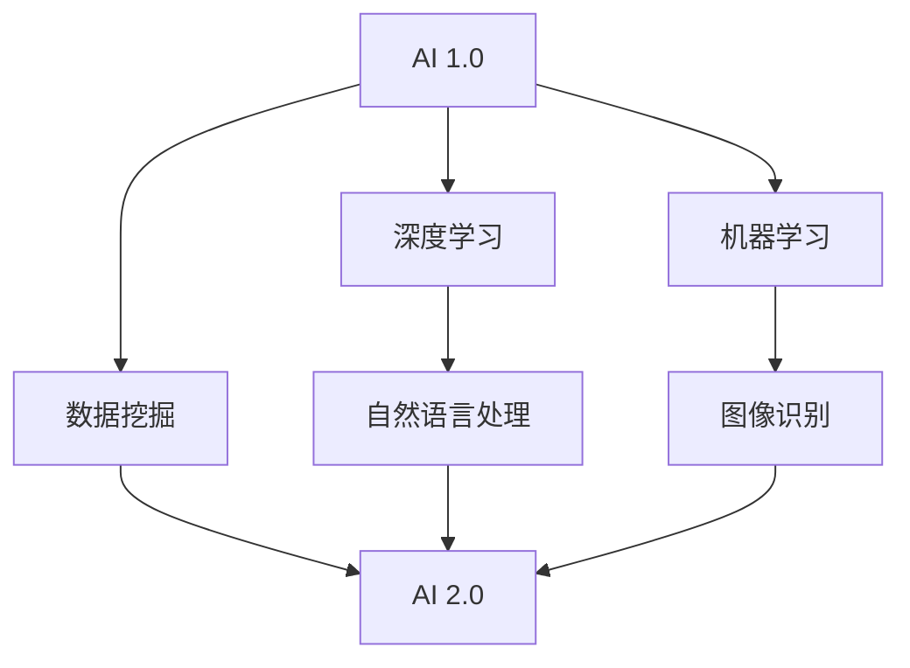

                 

关键词：人工智能，AI 2.0，李开复，技术革命，未来展望

> 摘要：随着人工智能（AI）技术的迅猛发展，李开复教授提出了AI 2.0的概念，探讨了其在现代技术革命中的核心地位。本文将深入剖析AI 2.0时代的意义，分析其背后的技术原理、应用领域、挑战与未来发展趋势。

## 1. 背景介绍

人工智能（AI）作为计算机科学的一个重要分支，已经取得了令人瞩目的成果。从最初的符号推理、专家系统，到基于数据的机器学习，再到如今的深度学习和强化学习，人工智能技术经历了从简单到复杂、从通用到专用的发展过程。李开复教授作为人工智能领域的知名专家，对AI技术的发展有着深刻的理解和独到的见解。

在李开复看来，人工智能的发展可以分为两个阶段：AI 1.0和AI 2.0。AI 1.0时代主要依赖于数据和算法的优化，通过统计学习等方法实现特定任务的自动化；而AI 2.0时代则强调人机协同，通过更加智能的算法和更加丰富的数据实现人与机器的深度融合。

## 2. 核心概念与联系

### 2.1 AI 1.0与AI 2.0的定义

AI 1.0时代的主要特点在于，人工智能系统主要通过学习大量数据来发现规律和模式，从而实现特定任务的自动化。这种模式识别和预测能力使得人工智能在图像识别、自然语言处理等领域取得了显著成果。

相比之下，AI 2.0时代更加注重人机协同。在这一阶段，人工智能不仅要能够处理大量数据，还需要具备理解、推理和交互的能力。具体来说，AI 2.0要求人工智能系统能够与人类进行自然语言交流，理解人类的意图和需求，并在实际应用中不断优化自身。

### 2.2 AI 1.0与AI 2.0的联系

尽管AI 1.0和AI 2.0在目标和实现方式上有所不同，但它们并非完全割裂的两个阶段。事实上，AI 2.0在很大程度上是AI 1.0技术的延续和升华。例如，深度学习、强化学习等技术在AI 1.0时代已经取得了重要进展，但在AI 2.0时代，这些技术的应用范围更加广泛，效果也更为显著。

下面是一个简单的Mermaid流程图，用于描述AI 1.0与AI 2.0之间的联系：



## 3. 核心算法原理 & 具体操作步骤

### 3.1 算法原理概述

AI 2.0时代的核心算法包括深度学习、强化学习、自然语言处理等。这些算法通过模拟人类大脑的神经结构和工作方式，实现数据的自动学习和推理。

- **深度学习**：通过多层神经网络对数据进行自动特征提取和模式识别。
- **强化学习**：通过试错和反馈机制，让智能体在复杂环境中不断学习和优化策略。
- **自然语言处理**：通过深度学习等技术，实现自然语言的理解和生成。

### 3.2 算法步骤详解

- **深度学习**：

  1. 数据预处理：对输入数据进行归一化、标准化等处理。
  2. 构建神经网络：设计合适的神经网络结构，包括输入层、隐藏层和输出层。
  3. 训练模型：通过反向传播算法，不断调整网络权重，使模型在训练数据上达到最佳效果。
  4. 验证和测试：使用验证集和测试集对模型进行评估，确保其泛化能力。

- **强化学习**：

  1. 环境建模：建立智能体与环境的交互模型。
  2. 策略选择：根据当前状态，选择最优策略。
  3. 执行动作：智能体根据策略执行动作。
  4. 反馈学习：根据环境反馈，调整策略。

- **自然语言处理**：

  1. 分词：将文本分解为词或词组。
  2. 词向量化：将词转换为向量表示。
  3. 神经网络模型：构建用于文本分类、情感分析等任务的神经网络模型。
  4. 模型训练：通过大量语料库训练模型，优化参数。

### 3.3 算法优缺点

- **深度学习**：

  - 优点：强大的特征提取能力，能够处理复杂的数据。
  - 缺点：对数据量和计算资源要求较高，模型可解释性较低。

- **强化学习**：

  - 优点：适用于动态和复杂环境，能够自适应调整策略。
  - 缺点：收敛速度较慢，需要大量的试错过程。

- **自然语言处理**：

  - 优点：能够处理大规模文本数据，实现文本理解和生成。
  - 缺点：对语言理解和语义理解的深度有限。

### 3.4 算法应用领域

AI 2.0算法在各个领域都有广泛的应用，如：

- **计算机视觉**：图像识别、目标检测、视频分析等。
- **自然语言处理**：机器翻译、文本分类、情感分析等。
- **智能助手**：语音识别、语义理解、对话系统等。
- **自动驾驶**：环境感知、路径规划、决策控制等。
- **医疗健康**：疾病诊断、药物研发、健康管理等。

## 4. 数学模型和公式 & 详细讲解 & 举例说明

### 4.1 数学模型构建

在AI 2.0时代，常用的数学模型包括：

- **深度学习模型**：如卷积神经网络（CNN）、循环神经网络（RNN）等。
- **强化学习模型**：如Q学习、SARSA等。
- **自然语言处理模型**：如Transformer、BERT等。

### 4.2 公式推导过程

以深度学习中的卷积神经网络为例，其基本公式如下：

$$
\text{output} = \sigma(\text{weight} \cdot \text{input} + \text{bias})
$$

其中，$\sigma$表示激活函数，$\text{weight}$表示权重矩阵，$\text{input}$表示输入数据，$\text{bias}$表示偏置。

### 4.3 案例分析与讲解

以自然语言处理中的BERT模型为例，其核心公式如下：

$$
\text{output} = \text{Transformer}(\text{input} \oplus \text{position} \oplus \text{segment})
$$

其中，$\oplus$表示拼接操作，$\text{input}$表示输入词向量，$\text{position}$表示位置编码，$\text{segment}$表示句子编码。

BERT模型通过拼接词向量、位置编码和句子编码，实现了对文本的深层理解和生成。

## 5. 项目实践：代码实例和详细解释说明

### 5.1 开发环境搭建

- **深度学习框架**：使用TensorFlow或PyTorch。
- **编程语言**：Python。
- **环境配置**：安装相应的依赖库，如Numpy、Pandas、Scikit-learn等。

### 5.2 源代码详细实现

以下是一个简单的深度学习模型的实现代码：

```python
import tensorflow as tf

# 构建神经网络
model = tf.keras.Sequential([
    tf.keras.layers.Dense(128, activation='relu', input_shape=(784,)),
    tf.keras.layers.Dense(10, activation='softmax')
])

# 编译模型
model.compile(optimizer='adam',
              loss='categorical_crossentropy',
              metrics=['accuracy'])

# 训练模型
model.fit(x_train, y_train, epochs=5)
```

### 5.3 代码解读与分析

以上代码实现了一个简单的深度学习模型，用于对MNIST手写数字数据集进行分类。模型包含一个全连接层，输入层有784个神经元，隐藏层有128个神经元，输出层有10个神经元。通过编译和训练，模型可以实现对手写数字的准确识别。

### 5.4 运行结果展示

在训练完成后，可以使用测试集对模型进行评估，查看其准确率：

```python
test_loss, test_acc = model.evaluate(x_test, y_test)
print('Test accuracy:', test_acc)
```

## 6. 实际应用场景

### 6.1 自动驾驶

自动驾驶是AI 2.0技术的重要应用场景之一。通过深度学习和强化学习算法，自动驾驶系统可以实现对车辆环境的高精度感知和智能决策，实现安全、高效的自动驾驶。

### 6.2 医疗健康

AI 2.0技术在医疗健康领域也有广泛应用，如疾病诊断、药物研发、健康管理等。通过深度学习和自然语言处理技术，可以实现对医学图像的智能分析，提高疾病诊断的准确性。

### 6.3 智能助手

智能助手是AI 2.0时代的一个典型应用。通过语音识别、自然语言处理和对话系统等技术，智能助手可以与用户进行自然、流畅的交流，提供个性化的服务和支持。

## 7. 工具和资源推荐

### 7.1 学习资源推荐

- **书籍**：《深度学习》、《强化学习基础》、《自然语言处理入门》等。
- **在线课程**：Coursera、Udacity、edX等平台上的相关课程。

### 7.2 开发工具推荐

- **深度学习框架**：TensorFlow、PyTorch、Keras等。
- **编程语言**：Python、Rust、Julia等。

### 7.3 相关论文推荐

- **深度学习**：《A Study on Deep Learning》、《Deep Learning for Text Classification》等。
- **强化学习**：《Deep Reinforcement Learning for Continuous Control》、《Deep Q-Network》等。
- **自然语言处理**：《Attention Is All You Need》、《BERT: Pre-training of Deep Bidirectional Transformers for Language Understanding》等。

## 8. 总结：未来发展趋势与挑战

### 8.1 研究成果总结

AI 2.0技术在各个领域取得了显著的成果，推动了人工智能技术的快速发展和应用。深度学习、强化学习和自然语言处理等算法的不断优化和突破，为AI 2.0时代的到来奠定了基础。

### 8.2 未来发展趋势

未来，AI 2.0技术将继续在以下几个方面发展：

- **算法创新**：探索更加高效、智能的算法，提高人工智能系统的性能和可解释性。
- **跨学科融合**：与生物、物理、数学等学科相结合，推动人工智能技术的全面发展。
- **应用拓展**：在自动驾驶、医疗健康、智能助手等更多领域实现深度应用。

### 8.3 面临的挑战

尽管AI 2.0技术在各个领域取得了显著成果，但仍面临一些挑战：

- **数据隐私**：如何保护用户数据隐私，确保数据的安全性和可靠性。
- **伦理道德**：如何制定合适的伦理规范，确保人工智能技术的公正性和透明度。
- **安全风险**：如何防范人工智能系统被恶意攻击，确保系统的安全稳定。

### 8.4 研究展望

未来，随着AI 2.0技术的不断发展和应用，我们将迎来一个更加智能、高效、安全的数字化世界。然而，这需要全社会的共同努力，从政策、教育、科研等多个层面推动人工智能技术的健康、可持续发展。

## 9. 附录：常见问题与解答

### 9.1 什么是AI 2.0？

AI 2.0是人工智能发展的新阶段，强调人机协同，通过更加智能的算法和更加丰富的数据实现人与机器的深度融合。

### 9.2 AI 2.0的核心技术是什么？

AI 2.0的核心技术包括深度学习、强化学习和自然语言处理等。

### 9.3 AI 2.0在哪些领域有应用？

AI 2.0在计算机视觉、自然语言处理、智能助手、自动驾驶、医疗健康等领域都有广泛应用。

### 9.4 如何学习AI 2.0技术？

可以通过阅读相关书籍、参加在线课程、实践项目等多种途径学习AI 2.0技术。

作者：禅与计算机程序设计艺术 / Zen and the Art of Computer Programming

----------------------------------------------------------------

以上就是本文的完整内容，希望对您在人工智能领域的探索和研究有所帮助。如果您有任何问题或建议，欢迎在评论区留言，期待与您交流。

