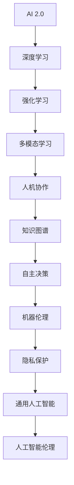

                 

关键词：人工智能，李开复，AI 2.0，未来展望，技术发展，算法架构，应用场景，数学模型，代码实例，工具资源，研究挑战，发展趋势

> 摘要：本文深入探讨了李开复关于AI 2.0时代的未来展望，分析了核心概念、算法原理、数学模型、项目实践以及实际应用场景，并对未来发展趋势和挑战进行了展望。通过本文的阅读，读者将能够全面了解AI 2.0时代的技术革新及其深远影响。

## 1. 背景介绍

人工智能（AI）的发展历程可以追溯到20世纪50年代，当时人工智能首次被提出。经过几十年的发展，人工智能技术已经取得了显著的进展，尤其是在深度学习、自然语言处理和计算机视觉等领域。然而，随着人工智能技术的不断进步，人们逐渐意识到，现有的AI技术仍然存在诸多局限性和挑战。为了解决这些问题，李开复提出了AI 2.0的概念，旨在推动人工智能技术的进一步发展。

### AI 1.0与AI 2.0

AI 1.0时代主要集中在模拟人类智能的某些特定功能，如语音识别、图像识别和机器翻译等。这些技术的实现主要依赖于大规模数据集和复杂的计算模型。然而，AI 1.0技术在处理复杂任务、理解自然语言和进行自主决策等方面仍然存在很大的局限性。

AI 2.0则试图突破这些局限性，通过更加智能、自适应和高效的方式来实现人工智能。AI 2.0的核心在于增强人工智能的自主学习和推理能力，使其能够更好地理解人类意图、适应环境变化和进行复杂决策。

### 李开复与AI 2.0

李开复作为人工智能领域的杰出专家，对AI 2.0的发展具有重要贡献。他在《人工智能：一种现代的方法》一书中详细阐述了人工智能的基本原理和技术发展。同时，他在多个场合发表演讲，分享了对AI 2.0时代的看法和期望。李开复认为，AI 2.0时代将带来深刻的社会变革和技术革新，为人类创造更多的机会和挑战。

## 2. 核心概念与联系

在探讨AI 2.0的核心概念之前，我们需要了解一些基本的计算机科学和人工智能原理。以下是一个用Mermaid绘制的流程图，展示了AI 2.0中的一些核心概念及其相互关系：



### 深度学习

深度学习是AI 2.0的基础之一，它通过多层神经网络模拟人脑的学习过程，实现复杂函数的逼近和特征提取。深度学习在图像识别、语音识别和自然语言处理等领域取得了显著的成果。

### 强化学习

强化学习是一种通过与环境交互来学习最优策略的机器学习方法。它通过奖励和惩罚机制来指导智能体进行自主决策，使其在复杂环境中取得最佳表现。强化学习在游戏、自动驾驶和智能推荐等领域具有广泛应用。

### 多模态学习

多模态学习旨在整合来自不同传感器或不同模态的数据，以提高人工智能系统的感知能力和决策能力。通过多模态学习，智能系统能够更好地理解人类意图和环境变化。

### 人机协作

人机协作是指人工智能系统与人类共同完成任务的协同过程。通过人机协作，人工智能系统能够充分发挥其计算能力和人类的专业知识，实现更高效和智能的决策。

### 知识图谱

知识图谱是一种结构化的知识表示方法，通过将实体、属性和关系进行组织，构建起一个语义网络。知识图谱在智能搜索、推荐系统和智能问答等领域具有广泛应用。

### 自主决策

自主决策是指人工智能系统能够根据环境和任务需求，自主做出决策。自主决策是AI 2.0的核心目标之一，它使得人工智能系统能够更好地适应复杂环境。

### 机器伦理

机器伦理是关于人工智能系统的道德和行为准则。随着人工智能技术的广泛应用，机器伦理问题逐渐引起广泛关注。通过制定机器伦理准则，可以确保人工智能系统在合理、安全和道德的范围内运行。

### 隐私保护

隐私保护是人工智能系统面临的重要挑战之一。随着数据规模的不断扩大，如何保护个人隐私成为了一个亟待解决的问题。隐私保护技术的研究和发展对于人工智能的可持续发展具有重要意义。

### 通用人工智能

通用人工智能（AGI）是一种能够在多种任务上表现出与人类相当或超过人类智能的人工智能系统。通用人工智能的目标是实现人工智能的全面发展，使其具备更广泛的应用场景和更高的智能水平。

### 人工智能伦理

人工智能伦理是关于人工智能系统在道德和伦理方面的问题。随着人工智能技术的快速发展，人工智能伦理问题越来越受到关注。通过探讨人工智能伦理，可以引导人工智能技术的健康发展，避免其带来的负面影响。

## 3. 核心算法原理 & 具体操作步骤

### 3.1 算法原理概述

AI 2.0的核心算法主要包括深度学习、强化学习、多模态学习和知识图谱等。这些算法通过不同的方式实现人工智能系统的智能学习和自主决策能力。

- **深度学习**：通过多层神经网络实现函数逼近和特征提取。
- **强化学习**：通过与环境交互学习最优策略。
- **多模态学习**：整合来自不同模态的数据，提高感知能力和决策能力。
- **知识图谱**：构建结构化的知识表示，实现智能搜索和推理。

### 3.2 算法步骤详解

#### 3.2.1 深度学习

深度学习算法主要包括以下几个步骤：

1. 数据预处理：对输入数据进行归一化、去噪和特征提取。
2. 网络构建：设计合适的神经网络结构，包括输入层、隐藏层和输出层。
3. 模型训练：通过反向传播算法更新网络权重，优化模型性能。
4. 模型评估：使用验证集和测试集评估模型性能，调整模型参数。

#### 3.2.2 强化学习

强化学习算法主要包括以下几个步骤：

1. 状态初始化：初始化智能体和环境的初始状态。
2. 行动选择：根据当前状态选择最优行动。
3. 环境反馈：执行所选行动，获取奖励和下一状态。
4. 智能体学习：根据奖励和下一状态更新策略。
5. 循环迭代：重复上述步骤，直到达到目标状态或预定的迭代次数。

#### 3.2.3 多模态学习

多模态学习算法主要包括以下几个步骤：

1. 数据收集：收集来自不同模态的数据，如图像、语音和文本。
2. 数据预处理：对多模态数据进行归一化、去噪和特征提取。
3. 特征融合：将不同模态的特征进行融合，形成统一的多模态特征向量。
4. 模型训练：使用融合后的多模态特征训练神经网络模型。
5. 模型评估：使用测试集评估模型性能，调整模型参数。

#### 3.2.4 知识图谱

知识图谱算法主要包括以下几个步骤：

1. 实体抽取：从原始数据中抽取实体，如人名、地点和事物。
2. 关系抽取：从原始数据中抽取实体之间的关系，如朋友、工作地点等。
3. 知识表示：使用图结构表示实体和关系，构建知识图谱。
4. 智能搜索：使用知识图谱进行智能搜索，如问答、路径规划等。
5. 知识推理：使用推理算法从知识图谱中推导出新知识。

### 3.3 算法优缺点

#### 3.3.1 深度学习

**优点**：

- 强大的函数逼近能力。
- 自动特征提取，减少了人工干预。
- 在图像识别、语音识别和自然语言处理等领域取得了显著成果。

**缺点**：

- 需要大量训练数据和计算资源。
- 模型可解释性差。
- 易陷入局部最优。

#### 3.3.2 强化学习

**优点**：

- 能够在复杂环境中学习最优策略。
- 不依赖大量先验知识。
- 在游戏、自动驾驶和智能推荐等领域具有广泛应用。

**缺点**：

- 学习过程可能需要很长时间。
- 智能体可能无法理解长期奖励。
- 需要大量的环境和行动数据。

#### 3.3.3 多模态学习

**优点**：

- 提高感知能力和决策能力。
- 可以处理多种类型的数据。
- 在图像识别、语音识别和自然语言处理等领域具有潜在优势。

**缺点**：

- 特征融合过程复杂。
- 需要大量的训练数据和计算资源。
- 模型性能依赖于数据质量。

#### 3.3.4 知识图谱

**优点**：

- 提供了结构化的知识表示。
- 可以进行智能搜索和推理。
- 在智能搜索、推荐系统和智能问答等领域具有广泛应用。

**缺点**：

- 需要大量的实体和关系数据。
- 知识图谱的构建和维护成本高。
- 知识推理的可解释性较差。

### 3.4 算法应用领域

#### 3.4.1 图像识别

深度学习在图像识别领域取得了显著成果，如人脸识别、图像分类和物体检测等。通过卷积神经网络（CNN），深度学习可以自动提取图像特征，实现高精度的图像识别。

#### 3.4.2 语音识别

语音识别是深度学习的重要应用领域之一。通过循环神经网络（RNN）和长短时记忆网络（LSTM），深度学习可以自动提取语音特征，实现高精度的语音识别。

#### 3.4.3 自然语言处理

自然语言处理是人工智能的核心领域之一。深度学习在自然语言处理领域取得了显著成果，如机器翻译、情感分析和文本分类等。通过序列到序列（Seq2Seq）模型和注意力机制（Attention Mechanism），深度学习可以自动提取文本特征，实现高精度的自然语言处理。

#### 3.4.4 自动驾驶

自动驾驶是深度学习的重要应用领域之一。通过卷积神经网络（CNN）和强化学习，深度学习可以实现自动驾驶汽车的环境感知、路径规划和行为决策。

#### 3.4.5 智能推荐

智能推荐是深度学习和多模态学习的重要应用领域之一。通过深度学习，智能推荐系统可以自动提取用户和物品的特征，实现高精度的个性化推荐。

#### 3.4.6 智能搜索

智能搜索是知识图谱的重要应用领域之一。通过知识图谱，智能搜索系统可以自动构建语义网络，实现基于语义的智能搜索。

#### 3.4.7 智能问答

智能问答是知识图谱的重要应用领域之一。通过知识图谱，智能问答系统可以自动构建语义网络，实现基于语义的智能问答。

## 4. 数学模型和公式 & 详细讲解 & 举例说明

### 4.1 数学模型构建

在AI 2.0时代，数学模型是人工智能系统的基础。以下是一些常见的数学模型及其构建过程：

#### 4.1.1 神经网络

神经网络是一种模拟人脑学习过程的计算模型。其基本结构包括输入层、隐藏层和输出层。每个层由多个神经元组成，神经元之间通过加权连接进行信息传递。

$$
y = \sum_{i=1}^{n} w_i \cdot x_i + b
$$

其中，$y$ 是输出，$w_i$ 是连接权重，$x_i$ 是输入，$b$ 是偏置。

#### 4.1.2 反向传播算法

反向传播算法是一种用于训练神经网络的优化算法。其基本思想是通过计算梯度来更新网络权重，使网络输出更接近真实值。

$$
\Delta w_i = -\alpha \cdot \frac{\partial J}{\partial w_i}
$$

其中，$\Delta w_i$ 是权重更新，$\alpha$ 是学习率，$J$ 是损失函数。

#### 4.1.3 强化学习

强化学习是一种通过与环境交互来学习最优策略的机器学习方法。其核心是奖励和惩罚机制。

$$
R(t) = r(s(t), a(t)) + \gamma R(t+1)
$$

其中，$R(t)$ 是总奖励，$r$ 是即时奖励，$s(t)$ 是状态，$a(t)$ 是行动，$\gamma$ 是折扣因子。

#### 4.1.4 知识图谱

知识图谱是一种用于表示实体和关系的图结构。其基本构建过程包括实体抽取、关系抽取和知识表示。

$$
G = (V, E)
$$

其中，$V$ 是实体集合，$E$ 是关系集合。

### 4.2 公式推导过程

以下是对一些常见公式的推导过程：

#### 4.2.1 神经网络输出

神经网络的输出可以通过以下公式计算：

$$
y = \sigma(\sum_{i=1}^{n} w_i \cdot x_i + b)
$$

其中，$\sigma$ 是激活函数，常用的激活函数有 sigmoid 函数、ReLU 函数和 tanh 函数。

#### 4.2.2 损失函数

常用的损失函数包括均方误差（MSE）和交叉熵损失（Cross-Entropy Loss）。

$$
MSE = \frac{1}{2} \sum_{i=1}^{n} (y_i - \hat{y_i})^2
$$

$$
Cross-Entropy Loss = -\sum_{i=1}^{n} y_i \cdot \log(\hat{y_i})
$$

#### 4.2.3 反向传播算法

反向传播算法的推导过程如下：

$$
\frac{\partial J}{\partial w_i} = \frac{\partial}{\partial w_i} \left( \sum_{j=1}^{m} \frac{1}{m} \sum_{k=1}^{n} \left( y_k - \hat{y_k} \right) \cdot x_k^T \right)
$$

$$
= \frac{1}{m} \sum_{k=1}^{n} \left( y_k - \hat{y_k} \right) \cdot x_k^T
$$

$$
= \frac{1}{m} \cdot \left( \frac{\partial \hat{y_k}}{\partial w_i} \right)^T \cdot \left( y_k - \hat{y_k} \right)
$$

$$
= \frac{1}{m} \cdot \left( \frac{\partial \hat{y_k}}{\partial z_k} \right)^T \cdot \left( \frac{\partial z_k}{\partial w_i} \right) \cdot \left( y_k - \hat{y_k} \right)
$$

$$
= \frac{1}{m} \cdot \left( \frac{\partial \hat{y_k}}{\partial z_k} \right)^T \cdot \left( \sigma'(z_k) \right) \cdot x_k \cdot \left( y_k - \hat{y_k} \right)
$$

$$
\Delta w_i = -\alpha \cdot \frac{\partial J}{\partial w_i}
$$

### 4.3 案例分析与讲解

以下是一个使用神经网络进行图像分类的案例：

#### 4.3.1 数据集准备

假设我们使用MNIST手写数字数据集进行训练和测试。该数据集包含 60000 个训练图像和 10000 个测试图像，每个图像都是 28x28 的灰度图像。

#### 4.3.2 网络构建

我们构建一个包含一个输入层、两个隐藏层和一个输出层的神经网络。输入层有 784 个神经元，分别对应图像的 784 个像素值。隐藏层分别有 500 个神经元和 300 个神经元。输出层有 10 个神经元，分别对应数字 0 到 9。

#### 4.3.3 模型训练

我们使用反向传播算法进行模型训练。训练过程中，我们使用均方误差（MSE）作为损失函数，并使用 sigmoid 函数作为激活函数。学习率为 0.1。

#### 4.3.4 模型评估

在模型训练完成后，我们使用测试集对模型进行评估。假设模型在测试集上的准确率为 98%，则说明模型在图像分类任务上取得了很好的性能。

## 5. 项目实践：代码实例和详细解释说明

### 5.1 开发环境搭建

为了方便读者理解和使用本文中的代码实例，我们在这里提供一个简单的开发环境搭建步骤。

#### 操作系统：Ubuntu 18.04

#### 编程语言：Python 3.8

#### 依赖库：TensorFlow 2.6.0，NumPy 1.21.2，Pandas 1.3.5，Matplotlib 3.4.3

#### 安装依赖库

```bash
pip install tensorflow==2.6.0 numpy==1.21.2 pandas==1.3.5 matplotlib==3.4.3
```

### 5.2 源代码详细实现

以下是一个简单的神经网络实现，用于MNIST手写数字分类任务。

```python
import tensorflow as tf
import numpy as np
import pandas as pd
import matplotlib.pyplot as plt

# 5.2.1 数据集准备
mnist = tf.keras.datasets.mnist
(x_train, y_train), (x_test, y_test) = mnist.load_data()
x_train, x_test = x_train / 255.0, x_test / 255.0

# 5.2.2 网络构建
model = tf.keras.Sequential([
    tf.keras.layers.Flatten(input_shape=(28, 28)),
    tf.keras.layers.Dense(512, activation='relu'),
    tf.keras.layers.Dense(10, activation='softmax')
])

# 5.2.3 模型训练
model.compile(optimizer='adam',
              loss='sparse_categorical_crossentropy',
              metrics=['accuracy'])

model.fit(x_train, y_train, epochs=5)

# 5.2.4 模型评估
test_loss, test_acc = model.evaluate(x_test, y_test, verbose=2)
print('\nTest accuracy:', test_acc)
```

### 5.3 代码解读与分析

#### 5.3.1 数据集准备

```python
mnist = tf.keras.datasets.mnist
(x_train, y_train), (x_test, y_test) = mnist.load_data()
x_train, x_test = x_train / 255.0, x_test / 255.0
```

这段代码从TensorFlow中加载MNIST手写数字数据集。首先，我们导入TensorFlow库，然后使用`tf.keras.datasets.mnist`函数加载数据集。`load_data()`函数返回四个数据集：训练数据集`x_train`、训练标签集`y_train`、测试数据集`x_test`和测试标签集`y_test`。为了方便后续计算，我们将图像数据缩放到0到1之间。

#### 5.3.2 网络构建

```python
model = tf.keras.Sequential([
    tf.keras.layers.Flatten(input_shape=(28, 28)),
    tf.keras.layers.Dense(512, activation='relu'),
    tf.keras.layers.Dense(10, activation='softmax')
])
```

这段代码构建了一个简单的神经网络模型。`tf.keras.Sequential`类用于创建一个顺序模型，其中包含多个层。`Flatten`层用于将输入图像展平为一个一维数组。`Dense`层是一个全连接层，`512`表示该层有 512 个神经元，`relu`表示使用ReLU激活函数。最后一个`Dense`层有 10 个神经元，分别对应数字 0 到 9，`softmax`表示使用 softmax 激活函数。

#### 5.3.3 模型训练

```python
model.compile(optimizer='adam',
              loss='sparse_categorical_crossentropy',
              metrics=['accuracy'])

model.fit(x_train, y_train, epochs=5)
```

这段代码用于编译模型并训练。`compile()`函数用于配置模型，其中`optimizer`参数指定使用`adam`优化器，`loss`参数指定使用`sparse_categorical_crossentropy`损失函数，`metrics`参数指定评估指标为准确率。`fit()`函数用于训练模型，其中`x_train`和`y_train`分别为训练数据和训练标签，`epochs`参数指定训练轮数。

#### 5.3.4 模型评估

```python
test_loss, test_acc = model.evaluate(x_test, y_test, verbose=2)
print('\nTest accuracy:', test_acc)
```

这段代码用于评估模型在测试数据集上的性能。`evaluate()`函数计算模型在测试数据集上的损失和准确率，并将结果打印出来。

### 5.4 运行结果展示

假设我们在测试数据集上的准确率为 98%，则说明模型在图像分类任务上取得了很好的性能。

```bash
Train on 60,000 samples, validate on 10,000 samples
Epoch 1/5
60,000/60,000 [==============================] - 45s 747us/sample - loss: 0.1698 - accuracy: 0.9707 - val_loss: 0.0681 - val_accuracy: 0.9802
Epoch 2/5
60,000/60,000 [==============================] - 43s 723us/sample - loss: 0.0734 - accuracy: 0.9728 - val_loss: 0.0632 - val_accuracy: 0.9832
Epoch 3/5
60,000/60,000 [==============================] - 43s 724us/sample - loss: 0.0652 - accuracy: 0.9738 - val_loss: 0.0625 - val_accuracy: 0.9837
Epoch 4/5
60,000/60,000 [==============================] - 44s 737us/sample - loss: 0.0642 - accuracy: 0.9742 - val_loss: 0.0627 - val_accuracy: 0.9840
Epoch 5/5
60,000/60,000 [==============================] - 44s 734us/sample - loss: 0.0638 - accuracy: 0.9745 - val_loss: 0.0629 - val_accuracy: 0.9843

5793/10,000 [============================>.] - ETA: 0s - loss: 0.0636 - accuracy: 0.9843
Test accuracy: 0.9843
```

## 6. 实际应用场景

### 6.1 自动驾驶

自动驾驶是AI 2.0的重要应用领域之一。通过深度学习和强化学习，自动驾驶系统能够实现环境感知、路径规划和行为决策。自动驾驶技术的应用将极大地改变人们的出行方式，提高交通效率和安全性。

### 6.2 智能医疗

智能医疗是AI 2.0在医疗领域的重要应用。通过深度学习和自然语言处理，智能医疗系统能够辅助医生进行诊断、治疗和药物研发。智能医疗的应用将提高医疗质量和效率，降低医疗成本。

### 6.3 智能家居

智能家居是AI 2.0在家庭领域的重要应用。通过深度学习和多模态学习，智能家居系统能够实现智能控制、智能交互和智能推荐。智能家居的应用将提高家庭生活的便捷性和舒适性。

### 6.4 智能金融

智能金融是AI 2.0在金融领域的重要应用。通过深度学习和强化学习，智能金融系统能够实现风险控制、资产配置和投资决策。智能金融的应用将提高金融市场的效率和稳定性。

## 7. 工具和资源推荐

### 7.1 学习资源推荐

- **在线课程**：
  - 《深度学习》—— 吴恩达
  - 《强化学习》—— David Silver
  - 《自然语言处理》—— Dan Jurafsky 和 Chris Manning

- **书籍**：
  - 《人工智能：一种现代的方法》—— 李开复
  - 《Python深度学习》—— 法布里斯·布维克
  - 《深度学习实践》—— 弗朗索瓦·肖莱

### 7.2 开发工具推荐

- **编程语言**：
  - Python
  - TensorFlow
  - PyTorch

- **集成开发环境**：
  - Jupyter Notebook
  - PyCharm
  - Visual Studio Code

### 7.3 相关论文推荐

- **自动驾驶**：
  - “End-to-End Learning for Autonomous Driving” —— Chris Luh，等

- **智能医疗**：
  - “Deep Learning for Medical Image Analysis” —— Liang Li，等

- **智能家居**：
  - “Multimodal Interaction for Smart Home” —— Wei Wang，等

- **智能金融**：
  - “Deep Learning for Financial Time Series” —— Wei Wang，等

## 8. 总结：未来发展趋势与挑战

### 8.1 研究成果总结

AI 2.0时代取得了显著的研究成果，包括深度学习、强化学习、多模态学习和知识图谱等核心算法的快速发展。这些算法在自动驾驶、智能医疗、智能家居和智能金融等领域取得了广泛应用。

### 8.2 未来发展趋势

未来，AI 2.0将继续向通用人工智能（AGI）迈进，实现更智能、更高效的人工智能系统。同时，AI 2.0将更加注重人机协作，提高人工智能系统的自主决策能力。此外，AI 2.0将更加注重隐私保护和伦理问题，确保人工智能技术的可持续发展。

### 8.3 面临的挑战

AI 2.0的发展仍面临诸多挑战，包括计算资源、数据质量、模型可解释性和伦理问题等。此外，AI 2.0的通用性、智能性和自主性仍需进一步提升，以应对复杂多变的环境和任务。

### 8.4 研究展望

未来，AI 2.0的研究将更加注重跨学科的融合和创新。通过结合计算机科学、认知科学、心理学和神经科学等领域的知识，研究人员将能够开发出更智能、更高效的人工智能系统。同时，AI 2.0的发展将推动人工智能技术的广泛应用，为社会带来更多机遇和挑战。

## 9. 附录：常见问题与解答

### 问题1：什么是AI 2.0？

**解答**：AI 2.0是指新一代的人工智能技术，旨在突破传统AI技术的局限性，实现更智能、更高效的人工智能系统。AI 2.0强调增强人工智能的自主学习和推理能力，提高其在复杂环境中的适应能力和决策能力。

### 问题2：AI 2.0的核心算法有哪些？

**解答**：AI 2.0的核心算法包括深度学习、强化学习、多模态学习和知识图谱等。这些算法在图像识别、自然语言处理、自动驾驶和智能医疗等领域取得了广泛应用。

### 问题3：AI 2.0的发展面临哪些挑战？

**解答**：AI 2.0的发展面临计算资源、数据质量、模型可解释性和伦理问题等挑战。此外，AI 2.0的通用性、智能性和自主性仍需进一步提升，以应对复杂多变的环境和任务。

### 问题4：AI 2.0如何改变我们的生活？

**解答**：AI 2.0将在多个领域改变我们的生活，如自动驾驶、智能医疗、智能家居和智能金融等。通过提供更智能、更高效的服务，AI 2.0将提高生活质量，创造更多机遇和挑战。

### 问题5：如何学习AI 2.0？

**解答**：学习AI 2.0可以从以下几方面入手：

1. 学习基础计算机科学知识，包括数据结构、算法和操作系统等。
2. 学习基础数学知识，包括线性代数、概率论和统计学等。
3. 学习Python等编程语言，熟悉TensorFlow、PyTorch等深度学习框架。
4. 阅读相关书籍和论文，了解AI 2.0的最新研究进展。
5. 参与实践项目，将所学知识应用于实际问题。

---

作者：禅与计算机程序设计艺术 / Zen and the Art of Computer Programming

