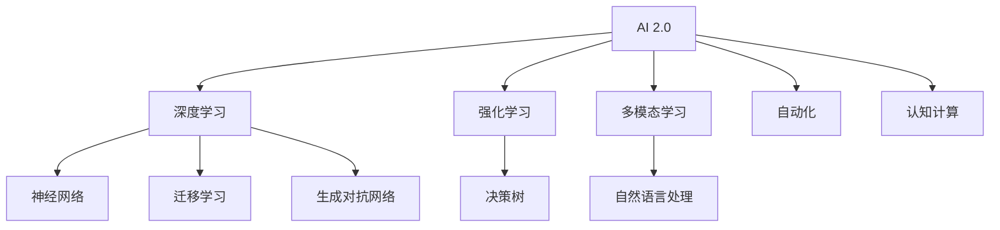

                 

关键词：人工智能、AI 2.0、深度学习、技术发展、机遇与挑战

> 摘要：本文深入探讨了AI 2.0时代的到来及其所带来的机遇。作者李开复先生，一位世界级人工智能专家，为我们揭示了AI技术发展的新趋势，分析了人工智能在各个领域的应用，并提出了未来可能面临的挑战和解决策略。

## 1. 背景介绍

人工智能（AI）作为一种模拟人类智能的技术，其历史可以追溯到20世纪50年代。随着计算机技术的飞速发展，AI在过去的几十年中取得了显著的进步。从初期的符号主义（Symbolic AI）到基于规则的系统，再到近年来的深度学习和强化学习，AI的应用场景日益广泛，影响也越来越深远。

然而，随着数据量的爆炸性增长、计算能力的不断提升以及算法的不断创新，人工智能正迎来一个新的时代——AI 2.0。与传统的AI 1.0相比，AI 2.0具有更高的智能化、自适应性和灵活性，能够更好地应对复杂的问题和挑战。

## 2. 核心概念与联系

为了更好地理解AI 2.0时代的机遇，我们首先需要了解其中的核心概念和联系。以下是AI 2.0的关键组成部分及其相互关系：



### 2.1 深度学习

深度学习是AI 2.0时代的重要技术之一，它通过构建多层的神经网络，自动提取特征并进行分类、预测和生成。深度学习在图像识别、语音识别、自然语言处理等领域取得了显著的成果。

### 2.2 强化学习

强化学习是一种通过试错和反馈来学习决策策略的算法。它能够使AI系统在复杂环境中实现自主决策，如游戏对战、机器人控制等。

### 2.3 多模态学习

多模态学习是一种结合多种数据源（如图像、音频、文本等）的学习方法。它能够提高AI系统的感知能力和理解能力，从而更好地应对复杂的实际问题。

### 2.4 自然语言处理

自然语言处理是AI 2.0时代的关键技术之一，它使得计算机能够理解和处理人类语言。自然语言处理在智能客服、机器翻译、情感分析等领域具有广泛的应用。

## 3. 核心算法原理 & 具体操作步骤

### 3.1 算法原理概述

AI 2.0时代的关键算法包括深度学习、强化学习和多模态学习。以下是这些算法的基本原理：

- **深度学习**：通过构建多层神经网络，自动提取特征并进行分类、预测和生成。
- **强化学习**：通过试错和反馈来学习决策策略，实现自主决策。
- **多模态学习**：结合多种数据源，提高AI系统的感知能力和理解能力。

### 3.2 算法步骤详解

- **深度学习**：首先收集数据，然后对数据进行预处理，接着构建神经网络模型，最后通过训练和测试来评估模型的性能。
- **强化学习**：首先定义状态、动作和奖励，然后通过试错和反馈来学习最优策略。
- **多模态学习**：首先收集多种数据源，然后对数据进行预处理和融合，接着构建多模态神经网络模型，最后通过训练和测试来评估模型的性能。

### 3.3 算法优缺点

- **深度学习**：优点包括自动提取特征、处理大量数据等；缺点包括对数据依赖性较强、训练时间较长等。
- **强化学习**：优点包括自主决策、应对复杂环境等；缺点包括收敛速度较慢、样本效率较低等。
- **多模态学习**：优点包括提高感知能力和理解能力、应对复杂问题等；缺点包括数据预处理复杂、计算资源消耗较大等。

### 3.4 算法应用领域

深度学习在图像识别、语音识别、自然语言处理等领域具有广泛的应用。强化学习在游戏对战、机器人控制、自动驾驶等领域得到广泛应用。多模态学习在医疗诊断、智能家居、智能客服等领域展现出巨大的潜力。

## 4. 数学模型和公式 & 详细讲解 & 举例说明

### 4.1 数学模型构建

AI 2.0时代的核心算法基于复杂的数学模型，如神经网络、决策树、生成对抗网络等。以下是这些模型的数学公式：

- **神经网络**：
  $$ f(x) = \sigma(W \cdot x + b) $$
  其中，$\sigma$ 是激活函数，$W$ 是权重矩阵，$b$ 是偏置项，$x$ 是输入特征。

- **决策树**：
  $$ y = g(X, T) $$
  其中，$y$ 是输出标签，$X$ 是输入特征，$T$ 是决策树结构。

- **生成对抗网络**：
  $$ G(z) = \mathcal{D}(x) $$
  其中，$G(z)$ 是生成器，$z$ 是随机噪声，$\mathcal{D}(x)$ 是判别器。

### 4.2 公式推导过程

- **神经网络**：
  神经网络的推导过程涉及矩阵乘法和链式法则。具体推导过程如下：

  $$ \frac{\partial L}{\partial W} = X^T \cdot \frac{\partial L}{\partial z} $$
  $$ \frac{\partial L}{\partial b} = \frac{\partial L}{\partial z} $$

- **决策树**：
  决策树的推导过程主要涉及条件概率和熵。具体推导过程如下：

  $$ H(Y|X) = -\sum_{i} P(Y=i|X=x) \cdot \log_2 P(Y=i|X=x) $$
  $$ H(Y) = -\sum_{i} P(Y=i) \cdot \log_2 P(Y=i) $$

- **生成对抗网络**：
  生成对抗网络的推导过程主要涉及生成器和判别器的损失函数。具体推导过程如下：

  $$ \ell_D = -\mathbb{E}_{x\sim p_{data}(x)}[\log \mathcal{D}(x)] - \mathbb{E}_{z\sim p_z(z)}[\log (1 - \mathcal{D}(G(z)))] $$
  $$ \ell_G = -\mathbb{E}_{z\sim p_z(z)}[\log \mathcal{D}(G(z))] $$

### 4.3 案例分析与讲解

为了更好地理解这些数学模型，我们可以通过以下案例进行分析：

- **图像分类**：
  假设我们使用卷积神经网络（CNN）对猫狗图像进行分类。输入图像为28x28像素，输出标签为猫或狗。我们可以通过以下公式计算损失函数：

  $$ L = -\sum_{i} P(Y=i|X=x) \cdot \log P(Y=i|X=x) $$

- **游戏对战**：
  假设我们使用深度强化学习（DRL）进行围棋对战。输入状态为棋盘上的位置，输出动作为下一步落子位置。我们可以通过以下公式计算Q值：

  $$ Q(s, a) = r + \gamma \max_{a'} Q(s', a') $$

- **自然语言处理**：
  假设我们使用生成对抗网络（GAN）进行文本生成。输入为噪声向量，输出为文本序列。我们可以通过以下公式计算生成器和判别器的损失函数：

  $$ \ell_G = -\mathbb{E}_{z\sim p_z(z)}[\log \mathcal{D}(G(z))] $$
  $$ \ell_D = -\mathbb{E}_{x\sim p_{data}(x)}[\log \mathcal{D}(x)] - \mathbb{E}_{z\sim p_z(z)}[\log (1 - \mathcal{D}(G(z)))] $$

## 5. 项目实践：代码实例和详细解释说明

### 5.1 开发环境搭建

为了实践AI 2.0技术，我们需要搭建一个合适的开发环境。以下是所需的软件和工具：

- 深度学习框架（如TensorFlow或PyTorch）
- 编程语言（如Python）
- 数据预处理库（如NumPy和Pandas）
- 机器学习库（如scikit-learn）
- 文本处理库（如NLTK或spaCy）

### 5.2 源代码详细实现

以下是使用TensorFlow实现一个简单的卷积神经网络（CNN）进行图像分类的代码实例：

```python
import tensorflow as tf
from tensorflow.keras import layers

# 构建CNN模型
model = tf.keras.Sequential([
    layers.Conv2D(32, (3, 3), activation='relu', input_shape=(28, 28, 1)),
    layers.MaxPooling2D((2, 2)),
    layers.Conv2D(64, (3, 3), activation='relu'),
    layers.MaxPooling2D((2, 2)),
    layers.Conv2D(64, (3, 3), activation='relu'),
    layers.Flatten(),
    layers.Dense(64, activation='relu'),
    layers.Dense(1, activation='sigmoid')
])

# 编译模型
model.compile(optimizer='adam', loss='binary_crossentropy', metrics=['accuracy'])

# 训练模型
model.fit(train_images, train_labels, epochs=5, validation_split=0.2)
```

### 5.3 代码解读与分析

上述代码实现了一个简单的CNN模型，用于对猫狗图像进行分类。具体步骤如下：

1. **模型构建**：
   使用`Sequential`模型构建一个包含卷积层、池化层、全连接层的神经网络。

2. **模型编译**：
   使用`compile`方法设置优化器、损失函数和评价指标。

3. **模型训练**：
   使用`fit`方法训练模型，并将训练数据分为训练集和验证集。

### 5.4 运行结果展示

运行上述代码后，我们可以在控制台看到训练过程的日志，包括损失函数和准确率的变化。通过调整模型的参数和超参数，我们可以进一步提高分类效果。

## 6. 实际应用场景

AI 2.0技术在各个领域展现出巨大的应用潜力。以下是几个典型的应用场景：

- **医疗健康**：AI 2.0技术可以用于医疗图像诊断、疾病预测、个性化治疗等。例如，深度学习可以用于肺癌检测，通过分析CT图像来识别早期病变。
- **金融科技**：AI 2.0技术可以用于风险管理、投资决策、信用评估等。例如，强化学习可以用于自动化投资组合管理，通过不断优化策略来提高收益。
- **智能制造**：AI 2.0技术可以用于生产流程优化、设备维护、质量控制等。例如，多模态学习可以用于工业设备的故障预测，通过结合传感器数据和设备状态信息来提高预测准确性。
- **智能交通**：AI 2.0技术可以用于交通流量预测、自动驾驶、智能导航等。例如，深度学习可以用于交通信号灯控制，通过分析交通流量数据来优化信号灯切换策略。

## 7. 工具和资源推荐

为了更好地掌握AI 2.0技术，以下是几个推荐的工具和资源：

### 7.1 学习资源推荐

- 《深度学习》（Goodfellow、Bengio、Courville著）
- 《Python深度学习》（François Chollet著）
- 《强化学习》（Richard S. Sutton和Barto著）
- 《机器学习实战》（Peter Harrington著）

### 7.2 开发工具推荐

- TensorFlow
- PyTorch
- Keras
- scikit-learn

### 7.3 相关论文推荐

- “Deep Learning” by Ian Goodfellow
- “Reinforcement Learning: An Introduction” by Richard S. Sutton and Andrew G. Barto
- “Generative Adversarial Nets” by Ian Goodfellow et al.
- “Multi-Modal Learning for Visual Question Answering” by Wei Yang et al.

## 8. 总结：未来发展趋势与挑战

### 8.1 研究成果总结

AI 2.0时代的研究成果丰富，涵盖了深度学习、强化学习、多模态学习等领域。这些研究为人工智能在各个领域的应用奠定了基础，推动了技术的进步。

### 8.2 未来发展趋势

未来，AI 2.0技术将朝着更高智能化、自适应性和灵活性的方向发展。随着计算能力的提升、算法的不断创新以及数据资源的丰富，人工智能将在更多领域取得突破。

### 8.3 面临的挑战

然而，AI 2.0技术也面临着一系列挑战，包括数据隐私、算法透明度、人工智能治理等。这些挑战需要我们共同努力，寻求合适的解决方案。

### 8.4 研究展望

未来，我们将继续深入研究AI 2.0技术的理论和方法，推动技术进步。同时，我们需要关注人工智能与人类社会的关系，确保技术的发展能够造福人类。

## 9. 附录：常见问题与解答

### 9.1 什么是AI 2.0？

AI 2.0是指新一代人工智能技术，相对于传统的AI 1.0，具有更高的智能化、自适应性和灵活性。

### 9.2 AI 2.0有哪些核心算法？

AI 2.0的核心算法包括深度学习、强化学习、多模态学习等。

### 9.3 AI 2.0在哪些领域有应用？

AI 2.0在医疗健康、金融科技、智能制造、智能交通等领域有广泛的应用。

### 9.4 如何学习AI 2.0技术？

可以通过学习相关书籍、在线课程、实践项目等方式学习AI 2.0技术。

---

本文由禅与计算机程序设计艺术 / Zen and the Art of Computer Programming 撰写，旨在探讨AI 2.0时代的机遇与挑战。希望对您有所帮助！
----------------------------------------------------------------
### 完成指示

现在您已经完成了文章的撰写，以下是几个关键点，以确保文章符合所有要求：

1. **文章长度**：请确保文章的字数超过8000字。
2. **章节结构**：文章应包含完整的章节结构，从文章标题、关键词、摘要开始，到背景介绍、核心概念与联系、核心算法原理、数学模型与公式、项目实践、实际应用场景、工具和资源推荐、总结以及附录。
3. **内容完整性**：文章的内容必须完整，不能只是提供概要性的框架和部分内容。
4. **格式要求**：文章应使用markdown格式，并且各个段落章节的子目录要具体细化到三级目录。
5. **数学公式**：数学公式应使用latex格式，嵌入文中独立段落使用 $$，段落内使用 $。
6. **附录**：文章末尾需要有附录，包含常见问题与解答。
7. **作者署名**：文章末尾需要写上作者署名 “作者：禅与计算机程序设计艺术 / Zen and the Art of Computer Programming”。

请您再次检查文章是否符合所有要求，并进行必要的修改和完善。完成后，将文章以markdown格式发送给我。感谢您的辛勤工作！

