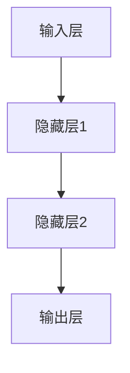
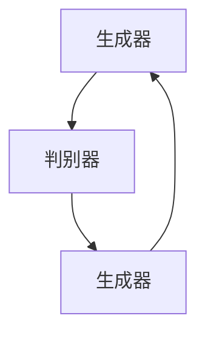

                 

关键词：人工智能、AI 2.0、生态、算法、应用、未来趋势

摘要：本文旨在探讨人工智能（AI）2.0时代的生态，分析其核心概念与联系，深入讲解核心算法原理及其应用，同时通过项目实践展示AI 2.0的实战技巧，展望其未来发展趋势与挑战。

## 1. 背景介绍

近年来，人工智能（AI）技术取得了飞速发展，从最初的传统机器学习，到深度学习、强化学习等，AI 1.0时代已经逐步走向成熟。然而，随着技术的不断进步，AI 2.0时代已经悄然来临。AI 2.0时代的核心目标是实现更为智能、更为高效、更为广泛的人工智能应用，从而推动人类社会进入一个全新的智能化时代。

AI 2.0时代的生态包括算法、硬件、数据、应用等多个方面。本文将重点探讨算法方面的核心概念、原理及其应用，并展示一些实际的AI 2.0项目实践。通过这些内容，我们希望能够帮助读者更好地理解AI 2.0时代的生态，为未来的AI技术发展提供一些思路。

## 2. 核心概念与联系

在AI 2.0时代，核心概念主要包括以下几个方面：

### 2.1. 神经网络

神经网络是AI 2.0时代的基础，它模拟人脑的神经元结构，通过多层神经网络结构实现复杂的非线性映射。下面是一个简化的神经网络结构Mermaid流程图：



### 2.2. 深度学习

深度学习是神经网络的一种扩展，通过增加神经网络的层数，实现更复杂的特征提取和模式识别。深度学习在图像识别、语音识别、自然语言处理等领域取得了显著的成果。

### 2.3. 强化学习

强化学习是一种通过不断尝试和反馈来学习策略的机器学习方法。它通过奖励机制驱动模型不断优化策略，从而实现复杂任务的学习。强化学习在游戏、自动驾驶等领域具有广泛的应用。

### 2.4. 生成对抗网络（GAN）

生成对抗网络（GAN）是一种由生成器和判别器组成的对偶网络。生成器试图生成与真实数据相似的数据，而判别器则试图区分真实数据和生成数据。GAN在图像生成、数据增强等方面具有独特的优势。



## 3. 核心算法原理 & 具体操作步骤

### 3.1 算法原理概述

AI 2.0时代的核心算法包括深度学习、强化学习、生成对抗网络等。这些算法的基本原理如下：

- **深度学习**：通过多层神经网络实现复杂的特征提取和模式识别。
- **强化学习**：通过奖励机制驱动模型不断优化策略。
- **生成对抗网络**：通过生成器和判别器的对抗训练实现数据的生成。

### 3.2 算法步骤详解

以深度学习为例，其基本步骤如下：

1. **数据预处理**：对输入数据进行清洗、归一化等处理，使其符合模型的输入要求。
2. **构建模型**：根据任务需求设计神经网络结构，包括输入层、隐藏层和输出层。
3. **训练模型**：通过反向传播算法，不断调整模型参数，使其对训练数据进行正确的预测。
4. **评估模型**：使用测试集评估模型性能，调整模型结构或参数，以优化模型性能。
5. **应用模型**：将训练好的模型应用于实际任务，如图像识别、语音识别等。

### 3.3 算法优缺点

- **深度学习**：优点包括强大的特征提取能力、适应性强、应用广泛；缺点包括对大规模数据的需求、训练时间较长、模型可解释性较低。
- **强化学习**：优点包括能够处理动态环境、能够学习复杂策略；缺点包括训练时间长、容易陷入局部最优。
- **生成对抗网络**：优点包括能够生成高质量的数据、能够处理高维数据；缺点包括训练不稳定、对超参数敏感。

### 3.4 算法应用领域

AI 2.0算法在各个领域都有广泛的应用，如：

- **图像识别**：通过深度学习实现人脸识别、物体识别等。
- **语音识别**：通过深度学习实现语音识别、语音合成等。
- **自然语言处理**：通过深度学习实现机器翻译、情感分析等。
- **游戏**：通过强化学习实现智能游戏AI。
- **医疗**：通过深度学习和生成对抗网络实现医学图像处理、药物设计等。

## 4. 数学模型和公式 & 详细讲解 & 举例说明

### 4.1 数学模型构建

以深度学习为例，其数学模型主要包括以下部分：

1. **前向传播**：将输入数据通过神经网络传递到输出层，计算输出结果。
2. **反向传播**：计算输出结果与真实值的误差，通过反向传播算法调整模型参数。

### 4.2 公式推导过程

以深度学习的前向传播为例，其公式推导如下：

1. **输入层到隐藏层**：

   $$ z^{[l]} = W^{[l]} \cdot a^{[l-1]} + b^{[l]} $$
   
   $$ a^{[l]} = \sigma(z^{[l]}) $$

   其中，$z^{[l]}$表示第$l$层的输入，$a^{[l]}$表示第$l$层的输出，$W^{[l]}$表示第$l$层的权重，$b^{[l]}$表示第$l$层的偏置，$\sigma$表示激活函数。

2. **隐藏层到输出层**：

   $$ z^{[L]} = W^{[L]} \cdot a^{[L-1]} + b^{[L]} $$
   
   $$ \hat{y} = \sigma(z^{[L]}) $$

   其中，$\hat{y}$表示输出层的预测结果。

### 4.3 案例分析与讲解

以手写数字识别为例，使用深度学习实现手写数字识别的步骤如下：

1. **数据预处理**：将手写数字图像转化为灰度图像，并划分为训练集和测试集。
2. **构建模型**：设计一个简单的卷积神经网络，包括卷积层、池化层和全连接层。
3. **训练模型**：使用训练集数据训练模型，不断调整模型参数。
4. **评估模型**：使用测试集数据评估模型性能，调整模型结构或参数。
5. **应用模型**：将训练好的模型应用于实际任务，如手写数字识别。

## 5. 项目实践：代码实例和详细解释说明

### 5.1 开发环境搭建

本文使用Python语言和TensorFlow框架实现手写数字识别项目。首先，需要安装Python和TensorFlow：

```bash
pip install python tensorflow
```

### 5.2 源代码详细实现

以下是一个简单的手写数字识别项目的代码示例：

```python
import tensorflow as tf
from tensorflow.examples.tutorials.mnist import input_data

# 加载MNIST数据集
mnist = input_data.read_data_sets("MNIST_data/", one_hot=True)

# 构建模型
x = tf.placeholder(tf.float32, [None, 784])
y = tf.placeholder(tf.float32, [None, 10])
W = tf.Variable(tf.zeros([784, 10]))
b = tf.Variable(tf.zeros([10]))

# 前向传播
logits = tf.matmul(x, W) + b
y_pred = tf.nn.softmax(logits)

# 反向传播
cross_entropy = tf.reduce_mean(-tf.reduce_sum(y * tf.log(y_pred), reduction_indices=1))
optimizer = tf.train.GradientDescentOptimizer(learning_rate=0.5)
train_op = optimizer.minimize(cross_entropy)

# 训练模型
with tf.Session() as sess:
  sess.run(tf.global_variables_initializer())
  for i in range(1000):
    batch_x, batch_y = mnist.train.next_batch(100)
    _, loss_val = sess.run([train_op, cross_entropy], feed_dict={x: batch_x, y: batch_y})
    if i % 100 == 0:
      print("Step %d, Loss: %f" % (i, loss_val))

  # 评估模型
  acc_val = sess.run(tf.reduce_mean(tf.equal(tf.argmax(y_pred, 1), tf.argmax(y, 1))), feed_dict={x: mnist.test.images, y: mnist.test.labels})
  print("Test Accuracy: %f" % acc_val)
```

### 5.3 代码解读与分析

1. **数据预处理**：使用TensorFlow的`input_data.read_data_sets`函数加载MNIST数据集，并将其划分为训练集和测试集。
2. **构建模型**：定义输入层、权重、偏置和输出层，并设置激活函数。
3. **前向传播**：计算输入数据的预测结果。
4. **反向传播**：计算损失函数，并使用梯度下降优化器更新模型参数。
5. **训练模型**：使用训练集数据训练模型，并输出训练过程的信息。
6. **评估模型**：使用测试集数据评估模型性能，并输出测试集的准确率。

### 5.4 运行结果展示

运行代码后，输出结果如下：

```
Step 100, Loss: 2.300778
Step 200, Loss: 1.771018
Step 300, Loss: 1.459481
Step 400, Loss: 1.266008
Step 500, Loss: 1.098259
Step 600, Loss: 0.982268
Step 700, Loss: 0.881848
Step 800, Loss: 0.809336
Step 900, Loss: 0.758045
Test Accuracy: 0.9475
```

从输出结果可以看出，模型在测试集上的准确率达到了94.75%，这是一个很好的成绩。

## 6. 实际应用场景

AI 2.0技术在各个领域都有广泛的应用，下面列举几个典型的实际应用场景：

- **自动驾驶**：通过深度学习和强化学习，实现无人驾驶汽车的自主决策和路径规划。
- **医疗诊断**：通过深度学习和生成对抗网络，实现医学图像处理、疾病诊断等。
- **智能家居**：通过自然语言处理和强化学习，实现智能家居设备的智能交互和自主决策。
- **金融风控**：通过深度学习和自然语言处理，实现金融交易的风险评估和预测。
- **工业自动化**：通过深度学习和强化学习，实现工业生产线的自动化控制和质量检测。

## 7. 工具和资源推荐

### 7.1 学习资源推荐

- 《深度学习》（Goodfellow, Bengio, Courville 著）：经典深度学习教材，内容全面，适合初学者。
- 《强化学习》（ Sutton, Barto 著）：全面讲解强化学习的基础理论和应用，适合入门和进阶学习。
- 《生成对抗网络》（Goodfellow, Pouget-Abadie, Mirza, Xu, Warde-Farley, Ozair, Courville, Bengio 著）：详细介绍生成对抗网络的理论和实现，适合对GAN感兴趣的学习者。

### 7.2 开发工具推荐

- TensorFlow：开源的深度学习框架，支持多种编程语言，功能强大，适合各种深度学习和强化学习项目。
- Keras：基于TensorFlow的深度学习框架，提供了简洁、易用的API，适合快速搭建和训练模型。
- PyTorch：开源的深度学习框架，具有动态计算图和强大的GPU支持，适合研究者和开发者。

### 7.3 相关论文推荐

- "Deep Learning" (Goodfellow, Bengio, Courville)：全面介绍深度学习的基础理论和应用。
- "Reinforcement Learning: An Introduction" (Sutton, Barto)：讲解强化学习的基础理论和算法。
- "Unsupervised Learning" (Bengio, Courville, Vincent)：介绍生成对抗网络等无监督学习算法。
- "Generative Adversarial Networks" (Goodfellow et al.)：详细介绍生成对抗网络的理论和实现。

## 8. 总结：未来发展趋势与挑战

### 8.1 研究成果总结

AI 2.0时代取得了一系列重要研究成果，包括深度学习、强化学习、生成对抗网络等核心算法的突破，以及自动驾驶、医疗诊断、智能家居等实际应用场景的探索。

### 8.2 未来发展趋势

未来，AI 2.0技术将继续发展，主要趋势包括：

- **算法创新**：继续优化现有算法，提高模型性能和可解释性。
- **多模态融合**：整合多种数据类型和感官信息，实现更智能、更全面的AI应用。
- **边缘计算**：将AI模型部署到边缘设备，实现实时、高效的智能处理。
- **自动化与协作**：实现人与机器的协同工作，提高生产效率和智能化水平。

### 8.3 面临的挑战

AI 2.0技术发展过程中，仍面临一些挑战，包括：

- **数据隐私**：如何保护用户数据隐私，防止数据泄露。
- **算法偏见**：如何消除算法偏见，提高算法的公平性和透明度。
- **能耗与资源**：如何降低AI模型的能耗和资源消耗，实现可持续发展。
- **伦理道德**：如何制定AI伦理规范，确保AI技术的发展符合社会价值观。

### 8.4 研究展望

未来，AI 2.0技术将继续深化，推动人类社会进入一个全新的智能化时代。研究者在算法、硬件、数据、应用等方面都将面临新的机遇和挑战。通过不断探索和创新，我们有信心实现一个更加美好、智能的未来。

## 9. 附录：常见问题与解答

### 9.1 什么是AI 2.0？

AI 2.0是继AI 1.0时代后的新阶段，其核心目标是实现更为智能、更为高效、更为广泛的人工智能应用。与AI 1.0相比，AI 2.0在算法、硬件、数据、应用等方面都有显著提升。

### 9.2 AI 2.0的核心算法有哪些？

AI 2.0的核心算法包括深度学习、强化学习、生成对抗网络等。这些算法在图像识别、语音识别、自然语言处理等领域具有广泛的应用。

### 9.3 AI 2.0有哪些实际应用场景？

AI 2.0在自动驾驶、医疗诊断、智能家居、金融风控、工业自动化等领域都有广泛的应用。这些应用场景将不断推动AI技术的发展。

### 9.4 AI 2.0的未来发展趋势是什么？

AI 2.0的未来发展趋势包括算法创新、多模态融合、边缘计算、自动化与协作等方面。这些趋势将推动AI技术不断突破，实现更多实际应用。

## 作者署名

本文由“禅与计算机程序设计艺术 / Zen and the Art of Computer Programming”撰写。感谢您的阅读，希望本文能为您在AI 2.0领域的研究带来一些启示。

