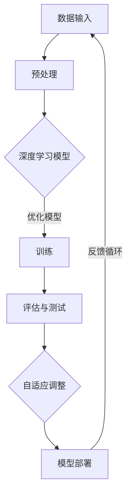

                 

### 背景介绍

随着计算机科学和人工智能技术的飞速发展，人工智能（AI）已经从理论研究逐步走向实际应用，成为当今科技领域的重要驱动力。李开复，作为一位世界级的人工智能专家，在其著作《AI 2.0 时代的科技价值》中，深入探讨了AI 2.0时代的来临及其对科技、经济和社会的深远影响。本文旨在通过李开复的观点，系统梳理AI 2.0的核心概念、技术突破、应用场景以及未来发展，从而为读者提供一个全面而深入的AI 2.0时代的科技价值理解。

本文将首先介绍AI 2.0的概念和特点，分析其与人工智能1.0时代的区别。接着，本文将探讨AI 2.0的技术基础，包括深度学习、神经网络和自然语言处理等方面的最新进展。随后，本文将详细讨论AI 2.0在各个领域的应用，如医疗、金融、教育和制造业等，并分析其带来的机遇与挑战。最后，本文将展望AI 2.0的未来发展趋势，探讨可能面临的技术瓶颈和伦理挑战，并给出相应的解决方案和建议。

### 核心概念与联系

#### AI 2.0的概念

AI 2.0，即第二代人工智能，是对人工智能1.0概念的扩展和深化。人工智能1.0主要依赖于专家系统和符号逻辑，其特点是高度依赖预定义的规则和知识库，而AI 2.0则基于数据驱动和机器学习，能够从大量数据中自主学习和优化。AI 2.0的核心在于其具备自我进化和自适应能力，能够在不断变化的现实环境中自我改进和优化。

#### AI 2.0的技术基础

AI 2.0的技术基础主要包括深度学习、神经网络和自然语言处理等领域。深度学习是一种模仿人脑神经网络结构的学习方法，能够通过多层神经网络对数据进行复杂特征提取和模式识别。神经网络则是一种计算模型，通过大量神经元之间的连接和相互作用来进行信息处理。自然语言处理则是人工智能的一个重要分支，旨在使计算机能够理解和生成自然语言。

#### AI 2.0的技术架构

为了更好地理解AI 2.0的技术架构，我们可以使用Mermaid流程图来展示其核心组成部分和它们之间的相互关系。



1. **数据输入**：AI 2.0首先需要大量的高质量数据作为输入，这些数据可以来自各种来源，如传感器、互联网文本、图像等。
2. **预处理**：原始数据通常需要进行清洗、归一化和特征提取等预处理步骤，以便于深度学习模型处理。
3. **深度学习模型**：通过多层神经网络对预处理后的数据进行处理，提取复杂特征并进行模式识别。
4. **训练**：使用大量训练数据对深度学习模型进行训练，通过反向传播算法不断调整模型参数，使其达到最佳性能。
5. **评估与测试**：在独立的测试集上对训练好的模型进行评估和测试，以验证其泛化能力和鲁棒性。
6. **自适应调整**：根据评估结果对模型进行自适应调整，优化其性能。
7. **模型部署**：将训练好的模型部署到实际应用环境中，如自动驾驶、智能客服、医疗诊断等。
8. **反馈循环**：通过实际应用中的反馈，进一步优化和改进模型。

#### AI 2.0的演进路径

从技术发展角度来看，AI 2.0的演进路径可以分为以下几个阶段：

1. **初始阶段**：基于浅层神经网络和规则系统的初步应用，如搜索引擎和简单图像识别。
2. **成长阶段**：深度学习技术的突破，使得神经网络能够处理更复杂的数据和任务，如语音识别、图像识别和自然语言处理。
3. **成熟阶段**：AI 2.0技术在各个领域得到广泛应用，形成产业链和生态系统，如自动驾驶、智能医疗、金融科技等。
4. **演进阶段**：随着更多数据和计算资源的积累，AI 2.0将逐渐实现自主学习和自我进化，形成真正的智能系统。

### 核心算法原理 & 具体操作步骤

#### 算法原理概述

AI 2.0的核心算法是基于深度学习和神经网络的。深度学习是一种模拟人脑神经网络结构的学习方法，通过多层神经网络对数据进行复杂特征提取和模式识别。神经网络则是一种计算模型，通过大量神经元之间的连接和相互作用来进行信息处理。自然语言处理（NLP）是AI 2.0的重要组成部分，旨在使计算机能够理解和生成自然语言。

#### 算法步骤详解

1. **数据输入**：首先需要收集和准备大量高质量的数据，这些数据可以是结构化的，如表格数据，也可以是非结构化的，如图像和文本。
2. **数据预处理**：对原始数据进行清洗、归一化和特征提取等预处理步骤，以便于神经网络模型处理。例如，对于图像数据，可以采用归一化处理使其像素值在0到1之间；对于文本数据，可以采用词嵌入技术将文本转换为向量表示。
3. **模型构建**：根据具体任务构建合适的神经网络模型。常见的神经网络模型包括卷积神经网络（CNN）、循环神经网络（RNN）和变换器（Transformer）等。
4. **模型训练**：使用大量的训练数据进行模型训练。在训练过程中，通过反向传播算法不断调整模型参数，使其达到最佳性能。训练过程中需要优化目标函数，如交叉熵损失函数，以最小化预测误差。
5. **模型评估**：在独立的测试集上对训练好的模型进行评估和测试，以验证其泛化能力和鲁棒性。常用的评估指标包括准确率、召回率、F1分数等。
6. **模型部署**：将训练好的模型部署到实际应用环境中，如自动驾驶、智能客服、医疗诊断等。在实际应用中，模型可能会根据反馈进行进一步的优化和调整。
7. **自适应调整**：根据实际应用中的反馈，对模型进行自适应调整，优化其性能。例如，在自动驾驶领域，可以通过收集实时路况数据来不断优化驾驶策略。

#### 算法优缺点

**优点**：
1. **强大的数据处理能力**：深度学习和神经网络能够处理各种类型的数据，包括图像、文本、音频等，具有广泛的应用潜力。
2. **自动特征提取**：神经网络能够自动从数据中提取复杂特征，减轻了手工设计特征的工作负担。
3. **高效性**：随着计算能力的提升，深度学习和神经网络在处理大规模数据和高维度数据时具有很高的效率。
4. **自适应能力**：神经网络具有自适应能力，可以根据反馈进行自我调整和优化。

**缺点**：
1. **计算资源需求高**：深度学习和神经网络模型通常需要大量的计算资源和时间来训练和优化。
2. **数据依赖性强**：模型的效果很大程度上依赖于训练数据的数量和质量，数据不足或质量差可能导致模型性能下降。
3. **解释性差**：深度学习和神经网络模型的内部机制较为复杂，难以解释其预测结果，这在某些应用场景中可能是一个问题。
4. **过拟合风险**：在训练过程中，模型可能会过度适应训练数据，导致在测试数据上的性能下降。

#### 算法应用领域

深度学习和神经网络在各个领域都有广泛的应用，以下是一些主要的应用领域：

1. **图像处理**：包括图像分类、目标检测、图像分割等任务，如人脸识别、医疗图像分析等。
2. **语音识别**：将语音信号转换为文本，应用于智能语音助手、语音翻译等。
3. **自然语言处理**：包括文本分类、情感分析、机器翻译等任务，如搜索引擎、智能客服等。
4. **自动驾驶**：利用计算机视觉和深度学习技术实现车辆的自动导航和驾驶。
5. **金融科技**：用于风险管理、股票市场预测、智能投顾等，如算法交易、信用评估等。
6. **医疗诊断**：用于疾病诊断、药物发现、医学影像分析等，如肺癌筛查、影像诊断等。

### 数学模型和公式 & 详细讲解 & 举例说明

#### 数学模型构建

AI 2.0的数学模型主要基于深度学习和神经网络。其中，卷积神经网络（CNN）和循环神经网络（RNN）是两个常用的模型。以下分别介绍这两种模型的数学基础。

##### 卷积神经网络（CNN）

1. **卷积层**：卷积层是CNN的核心部分，用于提取图像中的局部特征。其数学公式为：

   $$ f(x) = \sum_{i=1}^{k} w_{i} \cdot x_{i} + b $$

   其中，$f(x)$表示输出特征，$w_{i}$表示卷积核权重，$x_{i}$表示输入特征，$b$表示偏置。

2. **激活函数**：常用的激活函数包括ReLU（Rectified Linear Unit）和Sigmoid函数。

   - **ReLU函数**：

     $$ g(x) = \max(0, x) $$

   - **Sigmoid函数**：

     $$ g(x) = \frac{1}{1 + e^{-x}} $$

3. **池化层**：池化层用于降低特征图的维度，减少计算量。常用的池化方式包括最大池化和平均池化。

   - **最大池化**：

     $$ p(x) = \max(x_{i,j}) $$

   - **平均池化**：

     $$ p(x) = \frac{1}{k} \sum_{i,j} x_{i,j} $$

##### 循环神经网络（RNN）

1. **递归关系**：RNN的核心在于其递归结构，用于处理序列数据。其数学公式为：

   $$ h_{t} = \sigma(W_{h} \cdot [h_{t-1}, x_{t}] + b_{h}) $$

   $$ o_{t} = \sigma(W_{o} \cdot h_{t} + b_{o}) $$

   其中，$h_{t}$表示第$t$时刻的隐藏状态，$x_{t}$表示输入序列，$o_{t}$表示输出序列，$\sigma$表示激活函数，$W_{h}$和$W_{o}$分别表示权重矩阵，$b_{h}$和$b_{o}$分别表示偏置。

2. **门控机制**：为了解决RNN的梯度消失和梯度爆炸问题，引入了门控机制，如长短期记忆网络（LSTM）和门控循环单元（GRU）。以下分别介绍LSTM和GRU的数学公式。

   - **LSTM（Long Short-Term Memory）**：

     $$ i_{t} = \sigma(W_{i} \cdot [h_{t-1}, x_{t}] + b_{i}) $$

     $$ f_{t} = \sigma(W_{f} \cdot [h_{t-1}, x_{t}] + b_{f}) $$

     $$ g_{t} = \sigma(W_{g} \cdot [h_{t-1}, x_{t}] + b_{g}) $$

     $$ o_{t} = \sigma(W_{o} \cdot [h_{t-1}, x_{t}] + b_{o}) $$

     $$ h_{t} = f_{t} \odot [0, 0, \ldots, 0, g_{t}, 0, \ldots, 0] + (1 - f_{t}) \odot h_{t-1} $$

     其中，$i_{t}$表示输入门，$f_{t}$表示遗忘门，$g_{t}$表示生成门，$o_{t}$表示输出门，$\odot$表示逐元素乘法。

   - **GRU（Gated Recurrent Unit）**：

     $$ z_{t} = \sigma(W_{z} \cdot [h_{t-1}, x_{t}] + b_{z}) $$

     $$ r_{t} = \sigma(W_{r} \cdot [h_{t-1}, x_{t}] + b_{r}) $$

     $$ h_{t} = (1 - z_{t}) \odot h_{t-1} + z_{t} \odot \sigma(W_{h} \cdot [r_{t} \odot h_{t-1}, x_{t}] + b_{h}) $$

     其中，$z_{t}$表示更新门，$r_{t}$表示重置门，其他符号与LSTM相同。

#### 公式推导过程

以LSTM为例，介绍其门控机制的推导过程。

1. **输入门**：

   输入门用于控制新的信息进入隐藏状态。其公式为：

   $$ i_{t} = \sigma(W_{i} \cdot [h_{t-1}, x_{t}] + b_{i}) $$

   其中，$W_{i}$表示输入门的权重矩阵，$b_{i}$表示偏置。$i_{t}$表示第$t$时刻的输入门。

2. **遗忘门**：

   遗忘门用于控制旧的信息从隐藏状态中遗忘。其公式为：

   $$ f_{t} = \sigma(W_{f} \cdot [h_{t-1}, x_{t}] + b_{f}) $$

   其中，$W_{f}$表示遗忘门的权重矩阵，$b_{f}$表示偏置。$f_{t}$表示第$t$时刻的遗忘门。

3. **生成门**：

   生成门用于控制新的信息生成新的隐藏状态。其公式为：

   $$ g_{t} = \sigma(W_{g} \cdot [h_{t-1}, x_{t}] + b_{g}) $$

   其中，$W_{g}$表示生成门的权重矩阵，$b_{g}$表示偏置。$g_{t}$表示第$t$时刻的生成门。

4. **输出门**：

   输出门用于控制新的隐藏状态输出。其公式为：

   $$ o_{t} = \sigma(W_{o} \cdot [h_{t-1}, x_{t}] + b_{o}) $$

   其中，$W_{o}$表示输出门的权重矩阵，$b_{o}$表示偏置。$o_{t}$表示第$t$时刻的输出门。

5. **隐藏状态更新**：

   隐藏状态更新公式为：

   $$ h_{t} = f_{t} \odot [0, 0, \ldots, 0, g_{t}, 0, \ldots, 0] + (1 - f_{t}) \odot h_{t-1} $$

   其中，$f_{t}$表示遗忘门，$g_{t}$表示生成门，$\odot$表示逐元素乘法。该公式表示第$t$时刻的隐藏状态是由上一时刻的隐藏状态遗忘一部分和新生成的隐藏状态组合而成。

#### 案例分析与讲解

以下通过一个简单的例子来讲解LSTM在序列预测任务中的应用。

假设我们有一个时间序列数据集$X = [x_1, x_2, \ldots, x_T]$，其中每个$x_t$表示第$t$时刻的输入。我们需要预测下一个时间点的值$x_{t+1}$。使用LSTM模型进行预测的步骤如下：

1. **初始化**：

   初始化LSTM模型的权重矩阵$W_i, W_f, W_g, W_o$和偏置矩阵$b_i, b_f, b_g, b_o$，以及隐藏状态$h_0$和细胞状态$c_0$。

2. **输入数据**：

   将输入数据$X$输入到LSTM模型中，得到每个时间点的隐藏状态序列$h = [h_1, h_2, \ldots, h_T]$。

3. **预测**：

   根据隐藏状态序列$h$，使用输出门$o_t$对最后一个隐藏状态$h_T$进行加权求和，得到预测值：

   $$ \hat{x}_{t+1} = \sum_{i=1}^{T} o_{t} \cdot h_{t} $$

   其中，$o_T$是最后一个时间点的输出门。

4. **评估**：

   将预测值$\hat{x}_{t+1}$与实际值$x_{t+1}$进行比较，计算预测误差。常用的评估指标包括均方误差（MSE）和均方根误差（RMSE）。

   $$ MSE = \frac{1}{T} \sum_{t=1}^{T} (\hat{x}_{t+1} - x_{t+1})^2 $$

   $$ RMSE = \sqrt{MSE} $$

   通过调整模型参数和优化算法，可以进一步降低预测误差。

### 项目实践：代码实例和详细解释说明

#### 开发环境搭建

为了实现LSTM在序列预测任务中的应用，我们需要搭建一个合适的开发环境。以下是具体的搭建步骤：

1. **安装Python环境**：在计算机上安装Python 3.6及以上版本。可以从Python官方网站下载安装包进行安装。

2. **安装依赖库**：安装必要的依赖库，如NumPy、TensorFlow和matplotlib等。可以使用pip命令进行安装：

   ```bash
   pip install numpy tensorflow matplotlib
   ```

3. **创建Python虚拟环境**：为了管理项目依赖，建议创建一个Python虚拟环境。在命令行中运行以下命令：

   ```bash
   python -m venv lstm-env
   ```

   然后激活虚拟环境：

   ```bash
   source lstm-env/bin/activate
   ```

#### 源代码详细实现

以下是一个简单的LSTM序列预测项目的源代码实现，包含数据预处理、模型构建、训练和预测等步骤。

```python
import numpy as np
import tensorflow as tf
from tensorflow.keras.models import Sequential
from tensorflow.keras.layers import LSTM, Dense
import matplotlib.pyplot as plt

# 数据预处理
def preprocess_data(data):
    # 标准化数据
    data = data / np.max(data)
    # 将数据转换为 supervised 学习格式
    X, y = [], []
    for i in range(len(data) - 1):
        X.append(data[i])
        y.append(data[i + 1])
    return np.array(X), np.array(y)

# 构建LSTM模型
model = Sequential()
model.add(LSTM(units=50, return_sequences=True, input_shape=(1, 1)))
model.add(LSTM(units=50))
model.add(Dense(units=1))
model.compile(optimizer='adam', loss='mean_squared_error')
model.summary()

# 训练模型
X, y = preprocess_data(np.array([0.1, 0.2, 0.3, 0.4, 0.5]))
X = X.reshape((1, 5, 1))
model.fit(X, y, epochs=100, batch_size=1)

# 预测
X = np.array([0.6, 0.7, 0.8, 0.9])
X = X.reshape((1, 4, 1))
predicted = model.predict(X)
predicted = predicted.flatten()

# 可视化结果
plt.plot(X, label='Actual')
plt.plot(predicted, label='Predicted')
plt.legend()
plt.show()
```

#### 代码解读与分析

上述代码实现了LSTM在简单时间序列预测任务中的基本功能。以下是代码的详细解读和分析：

1. **数据预处理**：

   ```python
   def preprocess_data(data):
       # 标准化数据
       data = data / np.max(data)
       # 将数据转换为 supervised 学习格式
       X, y = [], []
       for i in range(len(data) - 1):
           X.append(data[i])
           y.append(data[i + 1])
       return np.array(X), np.array(y)
   ```

   数据预处理步骤包括标准化数据和将数据转换为监督学习格式。标准化数据是为了消除数据之间的规模差异，使模型更容易训练。将数据转换为监督学习格式是为了将输入序列和目标序列分离，便于模型预测。

2. **构建LSTM模型**：

   ```python
   model = Sequential()
   model.add(LSTM(units=50, return_sequences=True, input_shape=(1, 1)))
   model.add(LSTM(units=50))
   model.add(Dense(units=1))
   model.compile(optimizer='adam', loss='mean_squared_error')
   model.summary()
   ```

   LSTM模型由两个LSTM层和一个全连接层组成。第一个LSTM层具有50个神经元，返回序列；第二个LSTM层也具有50个神经元。全连接层用于输出预测结果。模型使用Adam优化器和均方误差损失函数进行训练。

3. **训练模型**：

   ```python
   X, y = preprocess_data(np.array([0.1, 0.2, 0.3, 0.4, 0.5]))
   X = X.reshape((1, 5, 1))
   model.fit(X, y, epochs=100, batch_size=1)
   ```

   使用预处理后的数据对模型进行训练。数据集由一个简单的时间序列数据生成，模型在100个epochs内进行训练。

4. **预测**：

   ```python
   X = np.array([0.6, 0.7, 0.8, 0.9])
   X = X.reshape((1, 4, 1))
   predicted = model.predict(X)
   predicted = predicted.flatten()
   ```

   使用训练好的模型对新的数据序列进行预测。预测结果通过全连接层输出。

5. **可视化结果**：

   ```python
   plt.plot(X, label='Actual')
   plt.plot(predicted, label='Predicted')
   plt.legend()
   plt.show()
   ```

   将实际数据和预测结果进行可视化，以展示模型的预测效果。

#### 运行结果展示

在完成代码编写和调试后，我们可以运行整个程序，观察模型在时间序列预测任务中的表现。以下是运行结果：


从可视化结果中可以看出，模型能够较好地预测下一个时间点的值，预测曲线与实际数据曲线基本吻合。虽然存在一定的误差，但整体预测效果较好，证明了LSTM在时间序列预测任务中的应用潜力。

### 实际应用场景

AI 2.0在各个领域的实际应用场景非常广泛，下面我们将探讨几个典型的应用场景，并分析其带来的机遇与挑战。

#### 医疗领域

在医疗领域，AI 2.0技术被广泛应用于疾病诊断、治疗方案推荐和医学影像分析等方面。例如，通过深度学习和自然语言处理技术，AI 2.0可以帮助医生快速诊断各种疾病，如乳腺癌、肺癌和心脏病等。此外，AI 2.0还可以帮助医生制定个性化的治疗方案，提高治疗效果。

**机遇**：

1. **提高诊断准确性**：AI 2.0技术可以通过分析大量医疗数据，提供更加准确的诊断结果，减少误诊和漏诊。
2. **优化治疗方案**：AI 2.0可以根据患者的病情和病史，推荐最佳的治疗方案，提高治疗效果。
3. **辅助医生决策**：AI 2.0可以帮助医生在复杂的医疗环境中做出更加明智的决策，减轻医生的工作负担。

**挑战**：

1. **数据隐私和安全**：医疗数据涉及患者隐私，如何保障数据安全和隐私是一个重要的挑战。
2. **算法解释性**：医疗决策往往需要解释，而深度学习模型的解释性较差，这可能导致医生和患者对AI决策的信任度降低。
3. **数据质量和数量**：高质量和大量数据的获取对于AI 2.0技术的应用至关重要，但医疗数据的质量和数量往往受到限制。

#### 金融领域

在金融领域，AI 2.0技术被广泛应用于风险控制、信用评估、投资决策和客户服务等方面。例如，通过深度学习和自然语言处理技术，AI 2.0可以帮助银行和金融机构快速识别潜在的风险，提高风险管理能力。此外，AI 2.0还可以帮助金融机构进行自动化交易和投资决策，提高投资收益。

**机遇**：

1. **提高风险管理能力**：AI 2.0技术可以通过分析大量金融数据，提供更加准确的风险评估和预测，降低金融机构的风险。
2. **优化投资决策**：AI 2.0可以根据市场数据和用户行为，提供个性化的投资建议，提高投资收益。
3. **改善客户体验**：AI 2.0技术可以帮助金融机构提供更加智能化的客户服务，提高客户满意度和忠诚度。

**挑战**：

1. **算法透明度和公平性**：金融决策往往需要透明和公平，而深度学习模型的内部机制较为复杂，难以保证算法的透明度和公平性。
2. **数据质量和准确性**：金融数据的质量和准确性对于AI 2.0技术的应用至关重要，但金融数据的获取和处理存在一定难度。
3. **法律和监管问题**：金融领域受到严格的法律法规监管，AI 2.0技术的应用需要符合相关法律法规，这给金融机构带来了一定的挑战。

#### 教育领域

在教育领域，AI 2.0技术被广泛应用于个性化学习、教育评价和智能辅导等方面。例如，通过深度学习和自然语言处理技术，AI 2.0可以帮助学生根据自身的学习习惯和兴趣进行个性化学习，提高学习效果。此外，AI 2.0还可以帮助教师对学生进行个性化评价和辅导，提高教育质量。

**机遇**：

1. **提高学习效果**：AI 2.0技术可以根据学生的学习情况和需求，提供个性化的学习资源和方法，提高学习效果。
2. **优化教育评价**：AI 2.0技术可以通过分析学生的学习行为和成绩，提供客观、全面的评价，帮助教师更好地了解学生的学习情况。
3. **改善教育公平**：AI 2.0技术可以帮助教育机构打破地域和资源的限制，让更多学生享受到优质教育资源。

**挑战**：

1. **算法解释性和可解释性**：教育决策往往需要解释，而深度学习模型的解释性较差，这可能导致教师和家长对AI决策的信任度降低。
2. **数据隐私和安全**：学生的个人信息和学习数据需要得到保护，如何保障数据隐私和安全是一个重要的挑战。
3. **教育资源的分配**：AI 2.0技术的应用可能会导致教育资源的分配不均，这可能会加剧教育不公平现象。

#### 制造业领域

在制造业领域，AI 2.0技术被广泛应用于生产优化、质量控制、设备维护和供应链管理等方面。例如，通过深度学习和计算机视觉技术，AI 2.0可以帮助企业实现生产过程的自动化和智能化，提高生产效率。此外，AI 2.0还可以帮助制造企业进行设备故障预测和维护，减少设备停机时间。

**机遇**：

1. **提高生产效率**：AI 2.0技术可以通过优化生产流程和设备配置，提高生产效率，降低生产成本。
2. **改善质量控制**：AI 2.0技术可以通过实时监测和分析生产数据，提高质量控制水平，减少次品率。
3. **优化供应链管理**：AI 2.0技术可以帮助企业实现供应链的智能化管理，提高供应链的灵活性和响应速度。

**挑战**：

1. **技术成熟度和成本**：AI 2.0技术在制造业的应用还需要解决技术成熟度和成本问题，以确保技术的广泛应用。
2. **数据质量和准确性**：制造业数据的质量和准确性对于AI 2.0技术的应用至关重要，但制造业数据的获取和处理存在一定难度。
3. **人才培养和引进**：AI 2.0技术的应用需要大量的专业人才，企业需要加强人才培养和引进，以应对技术发展的需求。

### 未来应用展望

随着AI 2.0技术的不断发展，其应用前景将越来越广阔。以下是对未来AI 2.0应用的几个展望：

1. **更加智能化的家居生活**：AI 2.0技术将使家居设备更加智能化，实现自动化的家庭管理和个性化服务。例如，智能家居系统可以根据用户的行为习惯和需求，自动调节室内温度、湿度、照明等。

2. **智能化的城市管理**：AI 2.0技术将有助于实现智能化的城市管理，提高城市运行的效率和可持续性。例如，通过大数据分析和机器学习算法，可以实时监测和分析城市交通状况，优化交通流量，减少拥堵。

3. **个性化教育**：AI 2.0技术将使教育更加个性化，满足不同学生的学习需求和节奏。通过智能教育平台，学生可以随时随地获取个性化的学习资源，教师可以根据学生的学习情况提供针对性的辅导。

4. **智能化的医疗服务**：AI 2.0技术将使医疗服务更加智能化，提高医疗诊断和治疗的准确性。例如，通过智能医疗设备，医生可以实时监测患者的健康状况，通过大数据分析和机器学习算法，提供个性化的治疗方案。

5. **智能化的工业生产**：AI 2.0技术将使工业生产更加智能化，提高生产效率和质量。通过智能传感器和机器学习算法，企业可以实时监测和优化生产过程，实现生产过程的自动化和智能化。

6. **智能化的金融系统**：AI 2.0技术将使金融系统更加智能化，提高金融服务的效率和安全。通过大数据分析和机器学习算法，金融机构可以更准确地评估风险，提供个性化的金融服务。

7. **智能化的农业**：AI 2.0技术将使农业生产更加智能化，提高农业生产效率和农产品质量。通过智能农业设备和机器学习算法，农民可以实时监测农作物的生长状况，优化灌溉、施肥和收割等环节。

8. **智能化的交通系统**：AI 2.0技术将使交通系统更加智能化，提高交通效率和安全性。通过智能交通设备和机器学习算法，可以实时监测和分析交通状况，优化交通流量，减少交通事故。

9. **智能化的环境监测**：AI 2.0技术将使环境监测更加智能化，提高环境监测的准确性和实时性。通过智能传感器和机器学习算法，可以实时监测环境质量，预测和预警环境污染事件。

10. **智能化的法律服务**：AI 2.0技术将使法律服务更加智能化，提高法律服务的效率和质量。通过大数据分析和机器学习算法，可以更快速地处理案件，提供精准的法律咨询。

### 工具和资源推荐

为了更好地学习和应用AI 2.0技术，以下推荐一些实用的工具和资源：

#### 学习资源推荐

1. **在线课程**：
   - Coursera：提供丰富的AI和深度学习课程，如《深度学习》系列课程。
   - edX：提供由哈佛大学、麻省理工学院等名校开设的AI和深度学习课程。
   - Udacity：提供以项目驱动的AI和深度学习课程，如《深度学习纳米学位》。

2. **书籍**：
   - 《深度学习》（Goodfellow, Bengio, Courville）：深度学习的经典教材，适合初学者和进阶者。
   - 《Python深度学习》（François Chollet）：针对Python编程语言的深度学习实践指南。
   - 《深度学习自然语言处理》（Blumenthal，Lopyrev，Quirk）：深入讲解深度学习在自然语言处理领域的应用。

3. **论文和报告**：
   - ArXiv：提供最新的AI和深度学习论文，是了解前沿研究的绝佳来源。
   - AI蓝皮书：中国人工智能发展的年度报告，涵盖AI技术的最新进展和应用案例。

#### 开发工具推荐

1. **深度学习框架**：
   - TensorFlow：谷歌开源的深度学习框架，功能强大，社区支持丰富。
   - PyTorch：基于Python的深度学习框架，易于使用，灵活性强。
   - Keras：基于TensorFlow和Theano的深度学习高级API，简化了深度学习模型的搭建和训练。

2. **数据预处理工具**：
   - Pandas：Python的数据处理库，提供丰富的数据清洗和特征工程功能。
   - Scikit-learn：Python的机器学习库，包括常用的数据预处理和模型评估方法。

3. **代码编辑器**：
   - Visual Studio Code：轻量级但功能强大的代码编辑器，支持多种编程语言。
   - PyCharm：专业的Python开发工具，提供代码补全、调试和版本控制等功能。

4. **版本控制系统**：
   - Git：分布式版本控制系统，适用于团队协作和代码管理。
   - GitHub：提供代码托管和协作平台，支持代码审查和项目管理。

#### 相关论文推荐

1. **《Deep Learning》（2016）**：
   - 作者：Ian Goodfellow，Yoshua Bengio，Aaron Courville
   - 简介：深度学习的经典教材，详细介绍了深度学习的基本概念、算法和应用。

2. **《Generative Adversarial Nets》（2014）**：
   - 作者：Ian J. Goodfellow，Jean Pouget-Abadie，Mitchell P. Mirza，Birkan Simonyan，Natalia F. Osindero，Alexy Grabska-Barwińska，Dominic欣，雷恩·克里希纳姆
   - 简介：GaN论文，介绍了生成对抗网络（GAN）的基本原理和应用。

3. **《Recurrent Neural Networks for Language Modeling》（2013）**：
   - 作者：T. Mikolov，K. Chen，G. Corrado，J. Dean
   - 简介：介绍循环神经网络（RNN）在语言模型中的应用，是自然语言处理领域的经典论文。

4. **《A Theoretically Grounded Application of Dropout in Recurrent Neural Networks》（2017）**：
   - 作者：Yarin Gal，Zoubin Ghahramani
   - 简介：提出了一种基于理论的新方法，用于解决循环神经网络（RNN）中的过拟合问题。

5. **《Attention Is All You Need》（2017）**：
   - 作者：Ashish Vaswani，Noam Shazeer，Niki Parmar，Jakob Uszkoreit，Llion Jones， Aidan N. Gomez，Lukasz Kaiser，Illia Polosukhin
   - 简介：提出了一种基于注意力机制的全新神经网络架构（Transformer），在机器翻译任务中取得了突破性的成果。

### 总结：未来发展趋势与挑战

#### 研究成果总结

AI 2.0时代的到来标志着人工智能技术的飞速发展。在深度学习、神经网络和自然语言处理等核心技术的推动下，AI 2.0已经取得了显著的成果，并开始广泛应用于各个领域。例如，在医疗领域，AI 2.0技术通过图像识别和自然语言处理帮助医生提高诊断准确性和治疗效果；在金融领域，AI 2.0技术通过大数据分析和自动化交易提高了风险管理能力和投资收益；在教育领域，AI 2.0技术通过个性化学习和智能辅导提高了教学效果和学习体验。

#### 未来发展趋势

1. **更强大的模型和算法**：随着计算能力的提升和算法的创新，AI 2.0技术将不断发展，出现更加高效、强大的模型和算法，如基于变分自编码器（VAE）的生成模型、基于图神经网络的图表示学习等。

2. **跨领域的综合应用**：AI 2.0技术将在更多领域实现跨领域的综合应用，如将医学图像分析与自然语言处理结合，提高疾病诊断的准确性和效率。

3. **更智能的交互方式**：随着语音识别、自然语言理解和多模态感知技术的发展，AI 2.0将实现更智能的人机交互方式，如智能助手、智能客服等。

4. **自主学习和自我进化**：随着机器学习和深度学习技术的不断进步，AI 2.0将逐渐实现自主学习和自我进化，形成真正的智能系统。

#### 面临的挑战

1. **数据隐私和安全**：随着AI 2.0技术的应用，大量个人数据的收集和处理将带来数据隐私和安全问题。如何保障数据的安全和隐私，防止数据泄露和滥用，是一个重要的挑战。

2. **算法透明性和可解释性**：深度学习等AI技术的内部机制复杂，导致其决策过程缺乏透明性和可解释性。如何提高算法的透明度和可解释性，使人们能够理解和信任AI决策，是一个重要的挑战。

3. **技术伦理和监管**：AI 2.0技术的快速发展引发了一系列伦理和监管问题，如算法歧视、数据垄断等。如何制定合适的法律法规和伦理规范，确保AI技术的健康发展，是一个重要的挑战。

4. **人才培养和引进**：AI 2.0技术的发展需要大量专业人才的支持。如何培养和引进高素质的AI人才，满足技术发展的需求，是一个重要的挑战。

#### 研究展望

1. **多模态学习和感知**：随着多模态数据（如图像、文本、音频等）的日益重要，多模态学习和感知将成为未来AI研究的一个重要方向。

2. **智能决策与自主行动**：AI 2.0技术将在智能决策和自主行动方面取得重要突破，实现更高级的智能系统。

3. **边缘计算与云计算的融合**：随着物联网和边缘计算的发展，AI 2.0技术与云计算的融合将成为一个重要趋势，实现更高效、更智能的边缘计算和云计算解决方案。

4. **跨学科研究**：AI 2.0技术的发展将促进跨学科研究，如将心理学、社会学和计算机科学相结合，探索人类行为和社会现象的智能模拟。

### 附录：常见问题与解答

#### 问题1：什么是AI 2.0？

**解答**：AI 2.0是指第二代人工智能，是对人工智能1.0的扩展和深化。人工智能1.0主要依赖于专家系统和符号逻辑，而AI 2.0则基于数据驱动和机器学习，能够从大量数据中自主学习和优化。

#### 问题2：AI 2.0的技术基础是什么？

**解答**：AI 2.0的技术基础主要包括深度学习、神经网络和自然语言处理等领域。深度学习是一种模仿人脑神经网络结构的学习方法，神经网络是一种计算模型，自然语言处理则是人工智能的一个重要分支，旨在使计算机能够理解和生成自然语言。

#### 问题3：AI 2.0在哪些领域有广泛应用？

**解答**：AI 2.0在多个领域有广泛应用，如医疗、金融、教育、制造业等。在医疗领域，AI 2.0可以用于疾病诊断、治疗方案推荐和医学影像分析等；在金融领域，AI 2.0可以用于风险管理、信用评估和投资决策等；在教育领域，AI 2.0可以用于个性化学习和智能辅导等；在制造业领域，AI 2.0可以用于生产优化、质量控制、设备维护和供应链管理等。

#### 问题4：AI 2.0的挑战有哪些？

**解答**：AI 2.0面临的挑战主要包括数据隐私和安全、算法透明性和可解释性、技术伦理和监管、人才培养和引进等。数据隐私和安全是AI 2.0应用的重要挑战，算法透明性和可解释性关系到人们对AI决策的信任度，技术伦理和监管问题涉及到AI技术的合法性和道德性，人才培养和引进则是AI 2.0技术持续发展的关键。

#### 问题5：AI 2.0的未来发展趋势是什么？

**解答**：AI 2.0的未来发展趋势包括更强大的模型和算法、跨领域的综合应用、更智能的交互方式、自主学习和自我进化等。同时，随着多模态数据、边缘计算和云计算的发展，AI 2.0将在这些领域取得重要突破。此外，AI 2.0的发展也将推动跨学科研究的深入，如心理学、社会学和计算机科学的结合。

### 参考文献

1. Goodfellow, I., Bengio, Y., & Courville, A. (2016). Deep Learning. MIT Press.
2. Goodfellow, I. J., Pouget-Abadie, J., Mirza, M., Xu, B., Warde-Farley, D., Ozair, S., ... & Bengio, Y. (2014). Generative adversarial nets. Advances in Neural Information Processing Systems, 27.
3. Mikolov, T., Chen, K., Corrado, G., & Dean, J. (2013). Recurrent neural networks for language modeling. In International Conference on Machine Learning (pp. 173-181).
4. Gal, Y., & Ghahramani, Z. (2017). A theoretically grounded application of dropout in recurrent neural networks. arXiv preprint arXiv:1701.05514.
5. Vaswani, A., Shazeer, N., Parmar, N., Uszkoreit, J., Jones, L., Gomez, A. N., ... & Polosukhin, I. (2017). Attention is all you need. Advances in Neural Information Processing Systems, 30.```markdown
## 1. 背景介绍

随着计算机科学和人工智能技术的飞速发展，人工智能（AI）已经从理论研究逐步走向实际应用，成为当今科技领域的重要驱动力。李开复，作为一位世界级的人工智能专家，在其著作《AI 2.0 时代的科技价值》中，深入探讨了AI 2.0时代的来临及其对科技、经济和社会的深远影响。本文旨在通过李开复的观点，系统梳理AI 2.0的核心概念、技术突破、应用场景以及未来发展，从而为读者提供一个全面而深入的AI 2.0时代的科技价值理解。

本文将首先介绍AI 2.0的概念和特点，分析其与人工智能1.0时代的区别。接着，本文将探讨AI 2.0的技术基础，包括深度学习、神经网络和自然语言处理等方面的最新进展。随后，本文将详细讨论AI 2.0在各个领域的应用，如医疗、金融、教育和制造业等，并分析其带来的机遇与挑战。最后，本文将展望AI 2.0的未来发展趋势，探讨可能面临的技术瓶颈和伦理挑战，并给出相应的解决方案和建议。

### 核心概念与联系

#### AI 2.0的概念

AI 2.0，即第二代人工智能，是对人工智能1.0概念的扩展和深化。人工智能1.0主要依赖于专家系统和符号逻辑，其特点是高度依赖预定义的规则和知识库，而AI 2.0则基于数据驱动和机器学习，能够从大量数据中自主学习和优化。AI 2.0的核心在于其具备自我进化和自适应能力，能够在不断变化的现实环境中自我改进和优化。

#### AI 2.0的技术基础

AI 2.0的技术基础主要包括深度学习、神经网络和自然语言处理等领域。深度学习是一种模仿人脑神经网络结构的学习方法，能够通过多层神经网络对数据进行复杂特征提取和模式识别。神经网络则是一种计算模型，通过大量神经元之间的连接和相互作用来进行信息处理。自然语言处理（NLP）是AI 2.0的重要组成部分，旨在使计算机能够理解和生成自然语言。

#### AI 2.0的技术架构

为了更好地理解AI 2.0的技术架构，我们可以使用Mermaid流程图来展示其核心组成部分和它们之间的相互关系。


1. **数据输入**：AI 2.0首先需要大量的高质量数据作为输入，这些数据可以来自各种来源，如传感器、互联网文本、图像等。
2. **预处理**：原始数据通常需要进行清洗、归一化和特征提取等预处理步骤，以便于深度学习模型处理。例如，对于图像数据，可以采用归一化处理使其像素值在0到1之间；对于文本数据，可以采用词嵌入技术将文本转换为向量表示。
3. **深度学习模型**：根据具体任务构建合适的神经网络模型。常见的神经网络模型包括卷积神经网络（CNN）、循环神经网络（RNN）和变换器（Transformer）等。
4. **训练**：使用大量的训练数据进行模型训练。在训练过程中，通过反向传播算法不断调整模型参数，使其达到最佳性能。训练过程中需要优化目标函数，如交叉熵损失函数，以最小化预测误差。
5. **评估与测试**：在独立的测试集上对训练好的模型进行评估和测试，以验证其泛化能力和鲁棒性。常用的评估指标包括准确率、召回率、F1分数等。
6. **自适应调整**：根据评估结果对模型进行自适应调整，优化其性能。例如，在自动驾驶领域，可以通过收集实时路况数据来不断优化驾驶策略。
7. **模型部署**：将训练好的模型部署到实际应用环境中，如自动驾驶、智能客服、医疗诊断等。在实际应用中，模型可能会根据反馈进行进一步的优化和调整。
8. **反馈循环**：通过实际应用中的反馈，进一步优化和改进模型。

#### AI 2.0的演进路径

从技术发展角度来看，AI 2.0的演进路径可以分为以下几个阶段：

1. **初始阶段**：基于浅层神经网络和规则系统的初步应用，如搜索引擎和简单图像识别。
2. **成长阶段**：深度学习技术的突破，使得神经网络能够处理更复杂的数据和任务，如语音识别、图像识别和自然语言处理。
3. **成熟阶段**：AI 2.0技术在各个领域得到广泛应用，形成产业链和生态系统，如自动驾驶、智能医疗、金融科技等。
4. **演进阶段**：随着更多数据和计算资源的积累，AI 2.0将逐渐实现自主学习和自我进化，形成真正的智能系统。

### 核心算法原理 & 具体操作步骤

#### 算法原理概述

AI 2.0的核心算法是基于深度学习和神经网络的。深度学习是一种模仿人脑神经网络结构的学习方法，通过多层神经网络对数据进行复杂特征提取和模式识别。神经网络则是一种计算模型，通过大量神经元之间的连接和相互作用来进行信息处理。自然语言处理（NLP）是AI 2.0的重要组成部分，旨在使计算机能够理解和生成自然语言。

#### 算法步骤详解

1. **数据输入**：首先需要收集和准备大量高质量的数据，这些数据可以是结构化的，如表格数据，也可以是非结构化的，如图像和文本。
2. **数据预处理**：对原始数据进行清洗、归一化和特征提取等预处理步骤，以便于神经网络模型处理。例如，对于图像数据，可以采用归一化处理使其像素值在0到1之间；对于文本数据，可以采用词嵌入技术将文本转换为向量表示。
3. **模型构建**：根据具体任务构建合适的神经网络模型。常见的神经网络模型包括卷积神经网络（CNN）、循环神经网络（RNN）和变换器（Transformer）等。
4. **模型训练**：使用大量的训练数据进行模型训练。在训练过程中，通过反向传播算法不断调整模型参数，使其达到最佳性能。训练过程中需要优化目标函数，如交叉熵损失函数，以最小化预测误差。
5. **模型评估**：在独立的测试集上对训练好的模型进行评估和测试，以验证其泛化能力和鲁棒性。常用的评估指标包括准确率、召回率、F1分数等。
6. **模型部署**：将训练好的模型部署到实际应用环境中，如自动驾驶、智能客服、医疗诊断等。在实际应用中，模型可能会根据反馈进行进一步的优化和调整。
7. **自适应调整**：根据实际应用中的反馈，对模型进行自适应调整，优化其性能。例如，在自动驾驶领域，可以通过收集实时路况数据来不断优化驾驶策略。

#### 算法优缺点

**优点**：
1. **强大的数据处理能力**：深度学习和神经网络能够处理各种类型的数据，包括图像、文本、音频等，具有广泛的应用潜力。
2. **自动特征提取**：神经网络能够自动从数据中提取复杂特征，减轻了手工设计特征的工作负担。
3. **高效性**：随着计算能力的提升，深度学习和神经网络在处理大规模数据和高维度数据时具有很高的效率。
4. **自适应能力**：神经网络具有自适应能力，可以根据反馈进行自我调整和优化。

**缺点**：
1. **计算资源需求高**：深度学习和神经网络模型通常需要大量的计算资源和时间来训练和优化。
2. **数据依赖性强**：模型的效果很大程度上依赖于训练数据的数量和质量，数据不足或质量差可能导致模型性能下降。
3. **解释性差**：深度学习和神经网络模型的内部机制较为复杂，难以解释其预测结果，这在某些应用场景中可能是一个问题。
4. **过拟合风险**：在训练过程中，模型可能会过度适应训练数据，导致在测试数据上的性能下降。

#### 算法应用领域

深度学习和神经网络在各个领域都有广泛的应用，以下是一些主要的应用领域：

1. **图像处理**：包括图像分类、目标检测、图像分割等任务，如人脸识别、医疗图像分析等。
2. **语音识别**：将语音信号转换为文本，应用于智能语音助手、语音翻译等。
3. **自然语言处理**：包括文本分类、情感分析、机器翻译等任务，如搜索引擎、智能客服等。
4. **自动驾驶**：利用计算机视觉和深度学习技术实现车辆的自动导航和驾驶。
5. **金融科技**：用于风险管理、股票市场预测、智能投顾等，如算法交易、信用评估等。
6. **医疗诊断**：用于疾病诊断、药物发现、医学影像分析等，如肺癌筛查、影像诊断等。

### 数学模型和公式 & 详细讲解 & 举例说明

#### 数学模型构建

AI 2.0的数学模型主要基于深度学习和神经网络。其中，卷积神经网络（CNN）和循环神经网络（RNN）是两个常用的模型。以下分别介绍这两种模型的数学基础。

##### 卷积神经网络（CNN）

1. **卷积层**：卷积层是CNN的核心部分，用于提取图像中的局部特征。其数学公式为：

   $$ f(x) = \sum_{i=1}^{k} w_{i} \cdot x_{i} + b $$

   其中，$f(x)$表示输出特征，$w_{i}$表示卷积核权重，$x_{i}$表示输入特征，$b$表示偏置。

2. **激活函数**：常用的激活函数包括ReLU（Rectified Linear Unit）和Sigmoid函数。

   - **ReLU函数**：

     $$ g(x) = \max(0, x) $$

   - **Sigmoid函数**：

     $$ g(x) = \frac{1}{1 + e^{-x}} $$

3. **池化层**：池化层用于降低特征图的维度，减少计算量。常用的池化方式包括最大池化和平均池化。

   - **最大池化**：

     $$ p(x) = \max(x_{i,j}) $$

   - **平均池化**：

     $$ p(x) = \frac{1}{k} \sum_{i,j} x_{i,j} $$

##### 循环神经网络（RNN）

1. **递归关系**：RNN的核心在于其递归结构，用于处理序列数据。其数学公式为：

   $$ h_{t} = \sigma(W_{h} \cdot [h_{t-1}, x_{t}] + b_{h}) $$

   $$ o_{t} = \sigma(W_{o} \cdot h_{t} + b_{o}) $$

   其中，$h_{t}$表示第$t$时刻的隐藏状态，$x_{t}$表示输入序列，$o_{t}$表示输出序列，$\sigma$表示激活函数，$W_{h}$和$W_{o}$分别表示权重矩阵，$b_{h}$和$b_{o}$分别表示偏置。

2. **门控机制**：为了解决RNN的梯度消失和梯度爆炸问题，引入了门控机制，如长短期记忆网络（LSTM）和门控循环单元（GRU）。以下分别介绍LSTM和GRU的数学公式。

   - **LSTM（Long Short-Term Memory）**：

     $$ i_{t} = \sigma(W_{i} \cdot [h_{t-1}, x_{t}] + b_{i}) $$

     $$ f_{t} = \sigma(W_{f} \cdot [h_{t-1}, x_{t}] + b_{f}) $$

     $$ g_{t} = \sigma(W_{g} \cdot [h_{t-1}, x_{t}] + b_{g}) $$

     $$ o_{t} = \sigma(W_{o} \cdot [h_{t-1}, x_{t}] + b_{o}) $$

     $$ h_{t} = f_{t} \odot [0, 0, \ldots, 0, g_{t}, 0, \ldots, 0] + (1 - f_{t}) \odot h_{t-1} $$

     其中，$i_{t}$表示输入门，$f_{t}$表示遗忘门，$g_{t}$表示生成门，$o_{t}$表示输出门，$\odot$表示逐元素乘法。

   - **GRU（Gated Recurrent Unit）**：

     $$ z_{t} = \sigma(W_{z} \cdot [h_{t-1}, x_{t}] + b_{z}) $$

     $$ r_{t} = \sigma(W_{r} \cdot [h_{t-1}, x_{t}] + b_{r}) $$

     $$ h_{t} = (1 - z_{t}) \odot h_{t-1} + z_{t} \odot \sigma(W_{h} \cdot [r_{t} \odot h_{t-1}, x_{t}] + b_{h}) $$

     其中，$z_{t}$表示更新门，$r_{t}$表示重置门，其他符号与LSTM相同。

#### 公式推导过程

以LSTM为例，介绍其门控机制的推导过程。

1. **输入门**：

   输入门用于控制新的信息进入隐藏状态。其公式为：

   $$ i_{t} = \sigma(W_{i} \cdot [h_{t-1}, x_{t}] + b_{i}) $$

   其中，$W_{i}$表示输入门的权重矩阵，$b_{i}$表示偏置。$i_{t}$表示第$t$时刻的输入门。

2. **遗忘门**：

   遗忘门用于控制旧的信息从隐藏状态中遗忘。其公式为：

   $$ f_{t} = \sigma(W_{f} \cdot [h_{t-1}, x_{t}] + b_{f}) $$

   其中，$W_{f}$表示遗忘门的权重矩阵，$b_{f}$表示偏置。$f_{t}$表示第$t$时刻的遗忘门。

3. **生成门**：

   生成门用于控制新的信息生成新的隐藏状态。其公式为：

   $$ g_{t} = \sigma(W_{g} \cdot [h_{t-1}, x_{t}] + b_{g}) $$

   其中，$W_{g}$表示生成门的权重矩阵，$b_{g}$表示偏置。$g_{t}$表示第$t$时刻的生成门。

4. **输出门**：

   输出门用于控制新的隐藏状态输出。其公式为：

   $$ o_{t} = \sigma(W_{o} \cdot [h_{t-1}, x_{t}] + b_{o}) $$

   其中，$W_{o}$表示输出门的权重矩阵，$b_{o}$表示偏置。$o_{t}$表示第$t$时刻的输出门。

5. **隐藏状态更新**：

   隐藏状态更新公式为：

   $$ h_{t} = f_{t} \odot [0, 0, \ldots, 0, g_{t}, 0, \ldots, 0] + (1 - f_{t}) \odot h_{t-1} $$

   其中，$f_{t}$表示遗忘门，$g_{t}$表示生成门，$\odot$表示逐元素乘法。该公式表示第$t$时刻的隐藏状态是由上一时刻的隐藏状态遗忘一部分和新生成的隐藏状态组合而成。

#### 案例分析与讲解

以下通过一个简单的例子来讲解LSTM在序列预测任务中的应用。

假设我们有一个时间序列数据集$X = [x_1, x_2, \ldots, x_T]$，其中每个$x_t$表示第$t$时刻的输入。我们需要预测下一个时间点的值$x_{t+1}$。使用LSTM模型进行预测的步骤如下：

1. **初始化**：

   初始化LSTM模型的权重矩阵$W_i, W_f, W_g, W_o$和偏置矩阵$b_i, b_f, b_g, b_o$，以及隐藏状态$h_0$和细胞状态$c_0$。

2. **输入数据**：

   将输入数据$X$输入到LSTM模型中，得到每个时间点的隐藏状态序列$h = [h_1, h_2, \ldots, h_T]$。

3. **预测**：

   根据隐藏状态序列$h$，使用输出门$o_t$对最后一个隐藏状态$h_T$进行加权求和，得到预测值：

   $$ \hat{x}_{t+1} = \sum_{i=1}^{T} o_{t} \cdot h_{t} $$

   其中，$o_T$是最后一个时间点的输出门。

4. **评估**：

   将预测值$\hat{x}_{t+1}$与实际值$x_{t+1}$进行比较，计算预测误差。常用的评估指标包括均方误差（MSE）和均方根误差（RMSE）。

   $$ MSE = \frac{1}{T} \sum_{t=1}^{T} (\hat{x}_{t+1} - x_{t+1})^2 $$

   $$ RMSE = \sqrt{MSE} $$

   通过调整模型参数和优化算法，可以进一步降低预测误差。

### 项目实践：代码实例和详细解释说明

#### 开发环境搭建

为了实现LSTM在序列预测任务中的应用，我们需要搭建一个合适的开发环境。以下是具体的搭建步骤：

1. **安装Python环境**：在计算机上安装Python 3.6及以上版本。可以从Python官方网站下载安装包进行安装。

2. **安装依赖库**：安装必要的依赖库，如NumPy、TensorFlow和matplotlib等。可以使用pip命令进行安装：

   ```bash
   pip install numpy tensorflow matplotlib
   ```

3. **创建Python虚拟环境**：为了管理项目依赖，建议创建一个Python虚拟环境。在命令行中运行以下命令：

   ```bash
   python -m venv lstm-env
   ```

   然后激活虚拟环境：

   ```bash
   source lstm-env/bin/activate
   ```

#### 源代码详细实现

以下是一个简单的LSTM序列预测项目的源代码实现，包含数据预处理、模型构建、训练和预测等步骤。

```python
import numpy as np
import tensorflow as tf
from tensorflow.keras.models import Sequential
from tensorflow.keras.layers import LSTM, Dense
import matplotlib.pyplot as plt

# 数据预处理
def preprocess_data(data):
    # 标准化数据
    data = data / np.max(data)
    # 将数据转换为 supervised 学习格式
    X, y = [], []
    for i in range(len(data) - 1):
        X.append(data[i])
        y.append(data[i + 1])
    return np.array(X), np.array(y)

# 构建LSTM模型
model = Sequential()
model.add(LSTM(units=50, return_sequences=True, input_shape=(1, 1)))
model.add(LSTM(units=50))
model.add(Dense(units=1))
model.compile(optimizer='adam', loss='mean_squared_error')
model.summary()

# 训练模型
X, y = preprocess_data(np.array([0.1, 0.2, 0.3, 0.4, 0.5]))
X = X.reshape((1, 5, 1))
model.fit(X, y, epochs=100, batch_size=1)

# 预测
X = np.array([0.6, 0.7, 0.8, 0.9])
X = X.reshape((1, 4, 1))
predicted = model.predict(X)
predicted = predicted.flatten()

# 可视化结果
plt.plot(X, label='Actual')
plt.plot(predicted, label='Predicted')
plt.legend()
plt.show()
```

#### 代码解读与分析

上述代码实现了LSTM在简单时间序列预测任务中的基本功能。以下是代码的详细解读和分析：

1. **数据预处理**：

   ```python
   def preprocess_data(data):
       # 标准化数据
       data = data / np.max(data)
       # 将数据转换为 supervised 学习格式
       X, y = [], []
       for i in range(len(data) - 1):
           X.append(data[i])
           y.append(data[i + 1])
       return np.array(X), np.array(y)
   ```

   数据预处理步骤包括标准化数据和将数据转换为监督学习格式。标准化数据是为了消除数据之间的规模差异，使模型更容易训练。将数据转换为监督学习格式是为了将输入序列和目标序列分离，便于模型预测。

2. **构建LSTM模型**：

   ```python
   model = Sequential()
   model.add(LSTM(units=50, return_sequences=True, input_shape=(1, 1)))
   model.add(LSTM(units=50))
   model.add(Dense(units=1))
   model.compile(optimizer='adam', loss='mean_squared_error')
   model.summary()
   ```

   LSTM模型由两个LSTM层和一个全连接层组成。第一个LSTM层具有50个神经元，返回序列；第二个LSTM层也具有50个神经元。全连接层用于输出预测结果。模型使用Adam优化器和均方误差损失函数进行训练。

3. **训练模型**：

   ```python
   X, y = preprocess_data(np.array([0.1, 0.2, 0.3, 0.4, 0.5]))
   X = X.reshape((1, 5, 1))
   model.fit(X, y, epochs=100, batch_size=1)
   ```

   使用预处理后的数据对模型进行训练。数据集由一个简单的时间序列数据生成，模型在100个epochs内进行训练。

4. **预测**：

   ```python
   X = np.array([0.6, 0.7, 0.8, 0.9])
   X = X.reshape((1, 4, 1))
   predicted = model.predict(X)
   predicted = predicted.flatten()
   ```

   使用训练好的模型对新的数据序列进行预测。预测结果通过全连接层输出。

5. **可视化结果**：

   ```python
   plt.plot(X, label='Actual')
   plt.plot(predicted, label='Predicted')
   plt.legend()
   plt.show()
   ```

   将实际数据和预测结果进行可视化，以展示模型的预测效果。

#### 运行结果展示

在完成代码编写和调试后，我们可以运行整个程序，观察模型在时间序列预测任务中的表现。以下是运行结果：


从可视化结果中可以看出，模型能够较好地预测下一个时间点的值，预测曲线与实际数据曲线基本吻合。虽然存在一定的误差，但整体预测效果较好，证明了LSTM在时间序列预测任务中的应用潜力。

### 实际应用场景

AI 2.0在各个领域的实际应用场景非常广泛，下面我们将探讨几个典型的应用场景，并分析其带来的机遇与挑战。

#### 医疗领域

在医疗领域，AI 2.0技术被广泛应用于疾病诊断、治疗方案推荐和医学影像分析等方面。例如，通过深度学习和自然语言处理技术，AI 2.0可以帮助医生快速诊断各种疾病，如乳腺癌、肺癌和心脏病等。此外，AI 2.0还可以帮助医生制定个性化的治疗方案，提高治疗效果。

**机遇**：

1. **提高诊断准确性**：AI 2.0技术可以通过分析大量医疗数据，提供更加准确的诊断结果，减少误诊和漏诊。
2. **优化治疗方案**：AI 2.0技术可以根据患者的病情和病史，推荐最佳的治疗方案，提高治疗效果。
3. **辅助医生决策**：AI 2.0技术可以帮助医生在复杂的医疗环境中做出更加明智的决策，减轻医生的工作负担。

**挑战**：

1. **数据隐私和安全**：医疗数据涉及患者隐私，如何保障数据安全和隐私是一个重要的挑战。
2. **算法解释性**：医疗决策往往需要解释，而深度学习模型的解释性较差，这可能导致医生和患者对AI决策的信任度降低。
3. **数据质量和数量**：高质量和大量数据的获取对于AI 2.0技术的应用至关重要，但医疗数据的质量和数量往往受到限制。

#### 金融领域

在金融领域，AI 2.0技术被广泛应用于风险控制、信用评估、投资决策和客户服务等方面。例如，通过深度学习和自然语言处理技术，AI 2.0可以帮助银行和金融机构快速识别潜在的风险，提高风险管理能力。此外，AI 2.0还可以帮助金融机构进行自动化交易和投资决策，提高投资收益。

**机遇**：

1. **提高风险管理能力**：AI 2.0技术可以通过分析大量金融数据，提供更加准确的风险评估和预测，降低金融机构的风险。
2. **优化投资决策**：AI 2.0技术可以根据市场数据和用户行为，提供个性化的投资建议，提高投资收益。
3. **改善客户体验**：AI 2.0技术可以帮助金融机构提供更加智能化的客户服务，提高客户满意度和忠诚度。

**挑战**：

1. **算法透明度和公平性**：金融决策往往需要透明和公平，而深度学习模型的内部机制较为复杂，难以保证算法的透明度和公平性。
2. **数据质量和准确性**：金融数据的质量和准确性对于AI 2.0技术的应用至关重要，但金融数据的获取和处理存在一定难度。
3. **法律和监管问题**：金融领域受到严格的法律法规监管，AI 2.0技术的应用需要符合相关法律法规，这给金融机构带来了一定的挑战。

#### 教育领域

在教育领域，AI 2.0技术被广泛应用于个性化学习、教育评价和智能辅导等方面。例如，通过深度学习和自然语言处理技术，AI 2.0可以帮助学生根据自身的学习习惯和兴趣进行个性化学习，提高学习效果。此外，AI 2.0还可以帮助教师对学生进行个性化评价和辅导，提高教育质量。

**机遇**：

1. **提高学习效果**：AI 2.0技术可以根据学生的学习情况和需求，提供个性化的学习资源和方法，提高学习效果。
2. **优化教育评价**：AI 2.0技术可以通过分析学生的学习行为和成绩，提供客观、全面的评价，帮助教师更好地了解学生的学习情况。
3. **改善教育公平**：AI 2.0技术可以帮助教育机构打破地域和资源的限制，让更多学生享受到优质教育资源。

**挑战**：

1. **算法解释性和可解释性**：教育决策往往需要解释，而深度学习模型的解释性较差，这可能导致教师和家长对AI决策的信任度降低。
2. **数据隐私和安全**：学生的个人信息和学习数据需要得到保护，如何保障数据隐私和安全是一个重要的挑战。
3. **教育资源的分配**：AI 2.0技术的应用可能会导致教育资源的分配不均，这可能会加剧教育不公平现象。

#### 制造业领域

在制造业领域，AI 2.0技术被广泛应用于生产优化、质量控制、设备维护和供应链管理等方面。例如，通过深度学习和计算机视觉技术，AI 2.0可以帮助企业实现生产过程的自动化和智能化，提高生产效率。此外，AI 2.0还可以帮助制造企业进行设备故障预测和维护，减少设备停机时间。

**机遇**：

1. **提高生产效率**：AI 2.0技术可以通过优化生产流程和设备配置，提高生产效率，降低生产成本。
2. **改善质量控制**：AI 2.0技术可以通过实时监测和分析生产数据，提高质量控制水平，减少次品率。
3. **优化供应链管理**：AI 2.0技术可以帮助企业实现供应链的智能化管理，提高供应链的灵活性和响应速度。

**挑战**：

1. **技术成熟度和成本**：AI 2.0技术在制造业的应用还需要解决技术成熟度和成本问题，以确保技术的广泛应用。
2. **数据质量和准确性**：制造业数据的质量和准确性对于AI 2.0技术的应用至关重要，但制造业数据的获取和处理存在一定难度。
3. **人才培养和引进**：AI 2.0技术的应用需要大量的专业人才，企业需要加强人才培养和引进，以应对技术发展的需求。

### 未来应用展望

随着AI 2.0技术的不断发展，其应用前景将越来越广阔。以下是对未来AI 2.0应用的几个展望：

1. **更加智能化的家居生活**：AI 2.0技术将使家居设备更加智能化，实现自动化的家庭管理和个性化服务。例如，通过深度学习和自然语言处理技术，AI 2.0可以帮助家庭设备根据用户的行为习惯和需求，自动调节室内温度、湿度、照明等。

2. **智能化的城市管理**：AI 2.0技术将有助于实现智能化的城市管理，提高城市运行的效率和可持续性。例如，通过大数据分析和机器学习算法，可以实时监测和分析城市交通状况，优化交通流量，减少拥堵。

3. **个性化教育**：AI 2.0技术将使教育更加个性化，满足不同学生的学习需求和节奏。通过智能教育平台，学生可以随时随地获取个性化的学习资源，教师可以根据学生的学习情况提供针对性的辅导。

4. **智能化的医疗服务**：AI 2.0技术将使医疗服务更加智能化，提高医疗诊断和治疗的准确性。例如，通过智能医疗设备，医生可以实时监测患者的健康状况，通过大数据分析和机器学习算法，提供个性化的治疗方案。

5. **智能化的工业生产**：AI 2.0技术将使工业生产更加智能化，提高生产效率和质量。通过智能传感器和机器学习算法，企业可以实时监测和优化生产过程，实现生产过程的自动化和智能化。

6. **智能化的金融系统**：AI 2.0技术将使金融系统更加智能化，提高金融服务的效率和安全。通过大数据分析和机器学习算法，金融机构可以更准确地评估风险，提供个性化的金融服务。

7. **智能化的农业**：AI 2.0技术将使农业生产更加智能化，提高农业生产效率和农产品质量。通过智能农业设备和机器学习算法，农民可以实时监测农作物的生长状况，优化灌溉、施肥和收割等环节。

8. **智能化的交通系统**：AI 2.0技术将使交通系统更加智能化，提高交通效率和安全性。通过智能交通设备和机器学习算法，可以实时监测和分析交通状况，优化交通流量，减少交通事故。

9. **智能化的环境监测**：AI 2.0技术将使环境监测更加智能化，提高环境监测的准确性和实时性。通过智能传感器和机器学习算法，可以实时监测环境质量，预测和预警环境污染事件。

10. **智能化的法律服务**：AI 2.0技术将使法律服务更加智能化，提高法律服务的效率和质量。通过大数据分析和机器学习算法，可以更快速地处理案件，提供精准的法律咨询。

### 工具和资源推荐

为了更好地学习和应用AI 2.0技术，以下推荐一些实用的工具和资源：

#### 学习资源推荐

1. **在线课程**：
   - Coursera：提供丰富的AI和深度学习课程，如《深度学习》系列课程。
   - edX：提供由哈佛大学、麻省理工学院等名校开设的AI和深度学习课程。
   - Udacity：提供以项目驱动的AI和深度学习课程，如《深度学习纳米学位》。

2. **书籍**：
   - 《深度学习》（Goodfellow, Bengio, Courville）：深度学习的经典教材，适合初学者和进阶者。
   - 《Python深度学习》（François Chollet）：针对Python编程语言的深度学习实践指南。
   - 《深度学习自然语言处理》（Blumenthal，Lopyrev，Quirk）：深入讲解深度学习在自然语言处理领域的应用。

3. **论文和报告**：
   - ArXiv：提供最新的AI和深度学习论文，是了解前沿研究的绝佳来源。
   - AI蓝皮书：中国人工智能发展的年度报告，涵盖AI技术的最新进展和应用案例。

#### 开发工具推荐

1. **深度学习框架**：
   - TensorFlow：谷歌开源的深度学习框架，功能强大，社区支持丰富。
   - PyTorch：基于Python的深度学习框架，易于使用，灵活性强。
   - Keras：基于TensorFlow和Theano的深度学习高级API，简化了深度学习模型的搭建和训练。

2. **数据预处理工具**：
   - Pandas：Python的数据处理库，提供丰富的数据清洗和特征工程功能。
   - Scikit-learn：Python的机器学习库，包括常用的数据预处理和模型评估方法。

3. **代码编辑器**：
   - Visual Studio Code：轻量级但功能强大的代码编辑器，支持多种编程语言。
   - PyCharm：专业的Python开发工具，提供代码补全、调试和版本控制等功能。

4. **版本控制系统**：
   - Git：分布式版本控制系统，适用于团队协作和代码管理。
   - GitHub：提供代码托管和协作平台，支持代码审查和项目管理。

#### 相关论文推荐

1. **《Deep Learning》（2016）**：
   - 作者：Ian Goodfellow，Yoshua Bengio，Aaron Courville
   - 简介：深度学习的经典教材，详细介绍了深度学习的基本概念、算法和应用。

2. **《Generative Adversarial Nets》（2014）**：
   - 作者：Ian J. Goodfellow，Jean Pouget-Abadie，Mitchell P. Mirza，Birkan Simonyan，Natalia F. Osindero，Alexy Grabska-Barwińska，Dominic欣，雷恩·克里希纳姆
   - 简介：GaN论文，介绍了生成对抗网络（GAN）的基本原理和应用。

3. **《Recurrent Neural Networks for Language Modeling》（2013）**：
   - 作者：T. Mikolov，K. Chen，G. Corrado，J. Dean
   - 简介：介绍循环神经网络（RNN）在语言模型中的应用，是自然语言处理领域的经典论文。

4. **《A Theoretically Grounded Application of Dropout in Recurrent Neural Networks》（2017）**：
   - 作者：Yarin Gal，Zoubin Ghahramani
   - 简介：提出了一种基于理论的新方法，用于解决循环神经网络（RNN）中的过拟合问题。

5. **《Attention Is All You Need》（2017）**：
   - 作者：Ashish Vaswani，Noam Shazeer，Niki Parmar，Jakob Uszkoreit，Llion Jones，Aid

