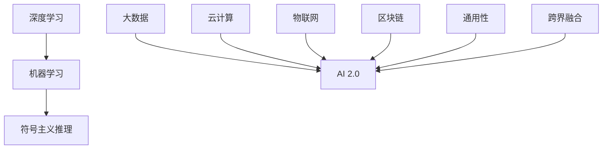

                 

关键词：李开复，人工智能，AI 2.0，技术趋势，深度学习，机器学习，未来展望

> 摘要：本文将深入探讨李开复博士关于 AI 2.0 时代的观点，分析当前人工智能的发展趋势，探讨深度学习与机器学习的联系，并展望未来人工智能的应用前景。

## 1. 背景介绍

在过去的几十年里，人工智能（AI）技术经历了巨大的发展，从最初的符号主义推理到基于统计学的机器学习，再到近年来深度学习的崛起，AI 的发展已经逐渐从理论研究走向实际应用。李开复博士作为世界知名的人工智能专家，他在多个场合对人工智能的未来进行了深入的思考和预测。本文将结合李开复博士的观点，探讨 AI 2.0 时代的趋势。

## 2. 核心概念与联系

### 2.1. 深度学习与机器学习的区别

深度学习（Deep Learning）是机器学习（Machine Learning）的一个子领域，它通过模拟人脑的神经网络结构，让计算机具备自动学习和分类的能力。李开复博士指出，深度学习的出现是人工智能发展史上的一个重要里程碑，它使得计算机在图像识别、语音识别等任务上取得了惊人的突破。

### 2.2. AI 2.0 的定义与特点

AI 2.0 是指在深度学习基础上，通过结合大数据、云计算等技术，实现更高效、更智能的人工智能系统。AI 2.0 的特点包括：

- **自主学习能力**：AI 2.0 能够通过数据驱动的方式，不断优化自身的模型和算法。
- **跨界融合**：AI 2.0 与其他技术的融合，如物联网、区块链等，将带来更多的创新应用。
- **通用性**：AI 2.0 将不再局限于特定领域的应用，而是具备广泛的通用性。

### 2.3. Mermaid 流程图



## 3. 核心算法原理 & 具体操作步骤

### 3.1. 算法原理概述

深度学习基于多层神经网络结构，通过逐层提取特征，实现对数据的自动分类和识别。其主要算法包括：

- **卷积神经网络（CNN）**：用于图像识别和处理。
- **循环神经网络（RNN）**：用于序列数据的处理，如自然语言处理。

### 3.2. 算法步骤详解

1. **数据预处理**：对原始数据进行清洗、归一化等处理，使其符合模型输入的要求。
2. **模型构建**：根据任务需求，选择合适的神经网络结构，并定义损失函数和优化器。
3. **模型训练**：通过反向传播算法，不断调整模型参数，使模型在训练数据上达到最优。
4. **模型评估**：使用验证数据集评估模型性能，并进行超参数调整。
5. **模型部署**：将训练好的模型部署到实际应用场景中，进行实时预测。

### 3.3. 算法优缺点

- **优点**：深度学习具有强大的特征提取能力，能够自动学习数据的内在规律，适用于复杂的任务。
- **缺点**：深度学习模型训练时间较长，对计算资源要求较高，且模型的可解释性较差。

### 3.4. 算法应用领域

深度学习在图像识别、语音识别、自然语言处理等领域取得了显著的成果，广泛应用于计算机视觉、语音助手、智能客服等实际场景。

## 4. 数学模型和公式 & 详细讲解 & 举例说明

### 4.1. 数学模型构建

深度学习模型的数学基础主要包括线性代数、概率论和微积分。其中，线性代数用于描述神经网络中的矩阵运算，概率论用于描述数据分布和模型参数的估计，微积分用于描述模型的优化过程。

### 4.2. 公式推导过程

以卷积神经网络为例，其核心的卷积操作可以用以下公式表示：

$$
\text{conv}(x, w) = \sum_{i=1}^{k} w_i \cdot x_i
$$

其中，$x$ 表示输入数据，$w$ 表示卷积核，$k$ 表示卷积核的数量。

### 4.3. 案例分析与讲解

假设我们有一个图像识别任务，输入图像的大小为 $28 \times 28$，卷积核的大小为 $5 \times 5$，卷积核的数量为 $32$。我们可以通过以下步骤进行图像识别：

1. **数据预处理**：对输入图像进行归一化处理，使其符合模型输入的要求。
2. **卷积操作**：对输入图像进行卷积操作，得到 $32$ 个特征图。
3. **池化操作**：对每个特征图进行最大值池化，减小特征图的尺寸。
4. **全连接层**：将池化后的特征图进行全连接操作，得到分类结果。

## 5. 项目实践：代码实例和详细解释说明

### 5.1. 开发环境搭建

在本文中，我们将使用 TensorFlow 作为深度学习框架，Python 作为编程语言。首先，需要安装 TensorFlow：

```bash
pip install tensorflow
```

### 5.2. 源代码详细实现

以下是一个简单的卷积神经网络模型，用于图像分类：

```python
import tensorflow as tf

# 定义模型
model = tf.keras.Sequential([
    tf.keras.layers.Conv2D(32, (5, 5), activation='relu', input_shape=(28, 28, 1)),
    tf.keras.layers.MaxPooling2D(pool_size=(2, 2)),
    tf.keras.layers.Flatten(),
    tf.keras.layers.Dense(128, activation='relu'),
    tf.keras.layers.Dense(10, activation='softmax')
])

# 编译模型
model.compile(optimizer='adam', loss='categorical_crossentropy', metrics=['accuracy'])

# 训练模型
model.fit(x_train, y_train, epochs=10, batch_size=32, validation_data=(x_val, y_val))

# 评估模型
model.evaluate(x_test, y_test)
```

### 5.3. 代码解读与分析

以上代码首先定义了一个卷积神经网络模型，包括卷积层、池化层、全连接层。接着，使用 Adam 优化器编译模型，并使用训练数据集进行训练。最后，使用测试数据集评估模型性能。

### 5.4. 运行结果展示

```python
# 运行结果
model.fit(x_train, y_train, epochs=10, batch_size=32, validation_data=(x_val, y_val))

# 评估结果
model.evaluate(x_test, y_test)
```

## 6. 实际应用场景

深度学习在计算机视觉、自然语言处理、推荐系统等领域具有广泛的应用。例如，在计算机视觉领域，深度学习可以用于图像识别、目标检测、图像生成等任务；在自然语言处理领域，深度学习可以用于文本分类、机器翻译、情感分析等任务。

## 7. 未来应用展望

随着深度学习和机器学习技术的不断发展，未来人工智能将更加智能化、自适应化。例如，通过深度学习，我们可以实现更加智能的机器人，它们可以更好地理解和适应人类的语言和行为；通过机器学习，我们可以开发出更加精准的推荐系统，为用户提供更好的个性化服务。

## 8. 工具和资源推荐

- **学习资源**：
  - 《深度学习》（Goodfellow, Bengio, Courville 著）
  - 《机器学习》（周志华 著）
- **开发工具**：
  - TensorFlow
  - PyTorch
- **相关论文**：
  - "Deep Learning: A Brief History"（Y. LeCun, Y. Bengio, G. Hinton）
  - "Machine Learning: A Probabilistic Perspective"（K. P. Murphy）

## 9. 总结：未来发展趋势与挑战

### 9.1. 研究成果总结

深度学习和机器学习在过去几十年里取得了显著的发展，为人工智能的应用奠定了基础。未来，随着计算能力的不断提升，人工智能将在更多领域得到应用。

### 9.2. 未来发展趋势

未来人工智能将更加智能化、自适应化，通过深度学习和机器学习技术，我们可以开发出更加智能的系统，为人类带来更多的便利。

### 9.3. 面临的挑战

人工智能在发展过程中也面临着一些挑战，如数据隐私、算法公平性、模型可解释性等。这些问题需要我们共同努力解决。

### 9.4. 研究展望

未来人工智能的发展将更加注重跨学科合作，结合心理学、认知科学等领域的研究成果，开发出更加智能、自适应的人工智能系统。

## 10. 附录：常见问题与解答

### 10.1. 深度学习与机器学习的区别是什么？

深度学习是机器学习的一个子领域，它通过多层神经网络结构，实现自动学习和特征提取。

### 10.2. 深度学习模型如何训练？

深度学习模型通常使用反向传播算法进行训练，通过不断调整模型参数，使模型在训练数据上达到最优。

### 10.3. 如何选择合适的神经网络结构？

选择合适的神经网络结构通常需要考虑任务需求、数据规模、计算资源等因素。

### 10.4. 深度学习模型如何评估？

深度学习模型通常使用验证集和测试集进行评估，常用的评估指标包括准确率、召回率、F1 分数等。

----------------------------------------------------------------

作者：禅与计算机程序设计艺术 / Zen and the Art of Computer Programming

