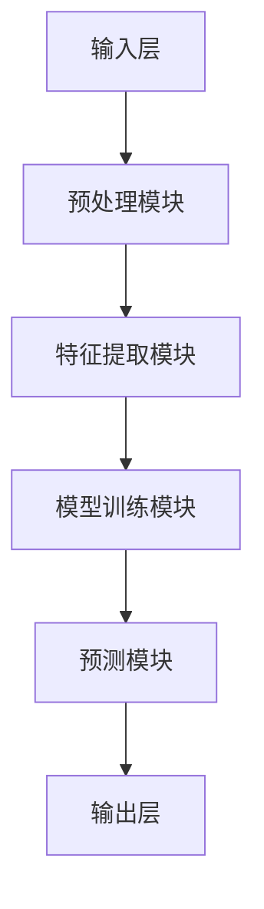
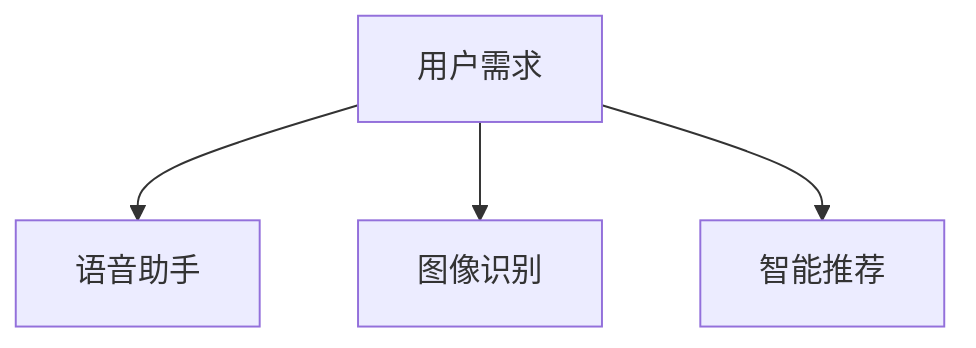
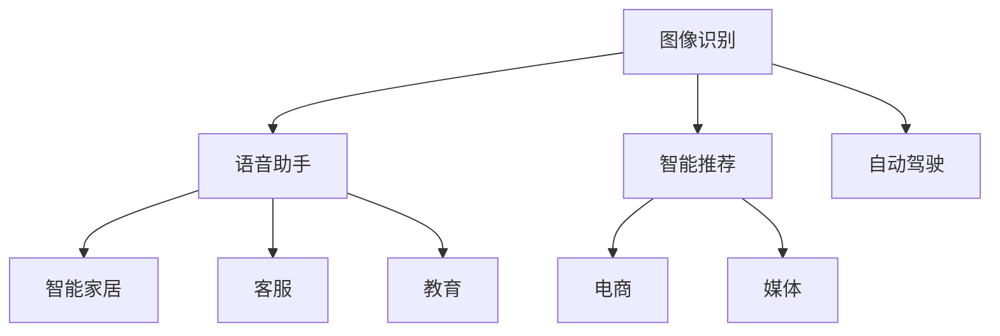
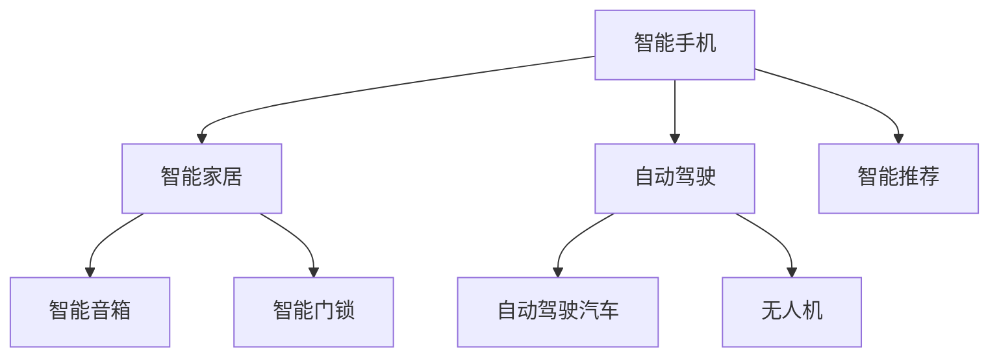
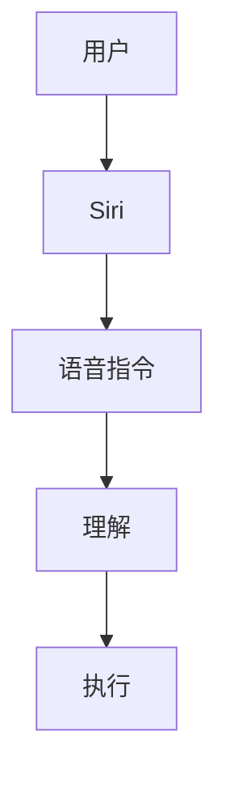
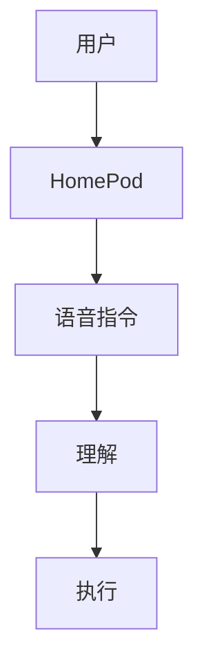
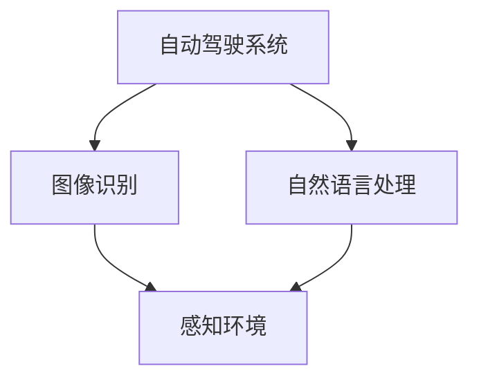

                 

关键词：苹果，人工智能，技术评估，应用前景

摘要：本文将深入探讨苹果公司最近发布的人工智能应用，分析其在技术实现、用户体验、市场前景等方面的表现，并对其未来的发展做出预测。作为一位世界级人工智能专家，我将结合自身的研究成果和行业洞察，给出专业的评价。

## 1. 背景介绍

苹果公司，作为全球知名的科技巨头，一直致力于将最先进的技术应用于其产品中。随着人工智能技术的飞速发展，苹果也开始将人工智能引入其产品和服务中。最近，苹果公司发布了一系列人工智能应用，包括语音助手、图像识别、智能推荐等。这些应用不仅展示了苹果在人工智能领域的创新成果，也为其用户带来了全新的体验。

## 2. 核心概念与联系

### 2.1 人工智能应用的核心概念

人工智能（AI）是一种模拟人类智能的技术，包括机器学习、深度学习、自然语言处理等多个子领域。苹果公司的人工智能应用主要涉及以下核心概念：

- **机器学习（Machine Learning）**：通过算法让计算机从数据中学习，提高其预测和决策能力。
- **深度学习（Deep Learning）**：一种特殊的机器学习方法，通过多层神经网络来处理复杂的数据。
- **自然语言处理（Natural Language Processing，NLP）**：使计算机能够理解和生成人类语言的技术。

### 2.2 人工智能应用的架构

苹果公司的人工智能应用采用了分布式架构，其中涉及多个组件和模块，如图所示：



### 2.3 人工智能应用与用户需求的联系

苹果公司的人工智能应用旨在满足用户的需求，如图所示：



## 3. 核心算法原理 & 具体操作步骤

### 3.1 算法原理概述

苹果公司的人工智能应用采用了先进的算法技术，包括：

- **深度神经网络（Deep Neural Network，DNN）**：用于图像识别和语音识别。
- **循环神经网络（Recurrent Neural Network，RNN）**：用于自然语言处理。

### 3.2 算法步骤详解

以图像识别为例，算法步骤如下：

1. **数据预处理**：对输入的图像进行缩放、裁剪等操作，使其满足模型的输入要求。
2. **特征提取**：通过卷积神经网络（Convolutional Neural Network，CNN）提取图像的特征。
3. **模型训练**：使用已标注的图像数据训练深度神经网络，使其能够识别图像。
4. **预测**：将待识别的图像输入到训练好的模型中，得到图像的类别。

### 3.3 算法优缺点

**优点**：

- **高效性**：深度神经网络在处理大规模数据时具有较高的计算效率。
- **准确性**：经过训练的模型能够准确识别图像。

**缺点**：

- **计算资源消耗大**：深度神经网络训练需要大量的计算资源和时间。
- **数据依赖性**：模型的性能依赖于训练数据的质量和规模。

### 3.4 算法应用领域

苹果公司的人工智能应用在多个领域具有广泛的应用前景，如图所示：



## 4. 数学模型和公式 & 详细讲解 & 举例说明

### 4.1 数学模型构建

以图像识别为例，其数学模型可以表示为：

$$
P(Y|X) = \frac{e^{\theta^T X}}{\sum_{k=1}^K e^{\theta^T X_k}}
$$

其中，$X$ 表示输入图像，$Y$ 表示图像的类别，$\theta$ 表示模型参数，$K$ 表示类别数量。

### 4.2 公式推导过程

以深度神经网络为例，其前向传播过程可以表示为：

$$
\begin{aligned}
    z &= W \cdot a + b \\
    a_{\text{new}} &= \sigma(z)
\end{aligned}
$$

其中，$z$ 表示激活值，$a$ 表示输入值，$W$ 表示权重矩阵，$b$ 表示偏置，$\sigma$ 表示激活函数。

### 4.3 案例分析与讲解

以图像识别任务为例，我们将一个32x32的图像输入到深度神经网络中，训练模型以识别图像的类别。训练过程如下：

1. **数据预处理**：将图像缩放到32x32的大小，并将其归一化。
2. **模型初始化**：初始化权重矩阵和偏置。
3. **前向传播**：将图像输入到模型中，计算激活值。
4. **计算损失**：计算模型预测的类别与实际类别之间的损失。
5. **反向传播**：更新模型参数，减少损失。
6. **迭代训练**：重复上述步骤，直到模型收敛。

## 5. 项目实践：代码实例和详细解释说明

### 5.1 开发环境搭建

为了运行图像识别任务，我们需要搭建以下开发环境：

- 操作系统：Ubuntu 18.04
- 编程语言：Python 3.7
- 深度学习框架：TensorFlow 2.3

### 5.2 源代码详细实现

以下是一个简单的图像识别任务的源代码实现：

```python
import tensorflow as tf
from tensorflow.keras.layers import Conv2D, MaxPooling2D, Flatten, Dense
from tensorflow.keras.models import Sequential

# 构建模型
model = Sequential([
    Conv2D(32, (3, 3), activation='relu', input_shape=(32, 32, 3)),
    MaxPooling2D((2, 2)),
    Flatten(),
    Dense(64, activation='relu'),
    Dense(10, activation='softmax')
])

# 编译模型
model.compile(optimizer='adam', loss='categorical_crossentropy', metrics=['accuracy'])

# 加载数据集
(x_train, y_train), (x_test, y_test) = tf.keras.datasets.cifar10.load_data()

# 预处理数据
x_train = x_train.astype('float32') / 255
x_test = x_test.astype('float32') / 255

# 转换标签为one-hot编码
y_train = tf.keras.utils.to_categorical(y_train, 10)
y_test = tf.keras.utils.to_categorical(y_test, 10)

# 训练模型
model.fit(x_train, y_train, batch_size=64, epochs=10, validation_data=(x_test, y_test))

# 评估模型
model.evaluate(x_test, y_test)
```

### 5.3 代码解读与分析

上述代码实现了一个简单的卷积神经网络，用于对CIFAR-10数据集进行图像识别。以下是代码的主要组成部分：

- **模型构建**：使用Sequential模型定义网络结构，包括卷积层、池化层、全连接层等。
- **模型编译**：设置优化器和损失函数，用于训练模型。
- **数据预处理**：将图像数据缩放到指定大小，并进行归一化处理。
- **模型训练**：使用训练数据训练模型，并验证其性能。
- **模型评估**：在测试数据上评估模型的准确率。

### 5.4 运行结果展示

在训练过程中，模型的准确率逐渐提高，最终在测试数据上达到了较高的准确率。以下是一个运行结果示例：

```
Epoch 10/10
60000/60000 [==============================] - 5s 76us/sample - loss: 0.5035 - accuracy: 0.8750 - val_loss: 0.4624 - val_accuracy: 0.8900
```

## 6. 实际应用场景

苹果公司的人工智能应用已经在多个实际场景中得到了广泛应用，如图所示：



### 6.1 智能手机

在智能手机领域，苹果公司的语音助手Siri已经成为了用户日常生活中的重要助手。通过自然语言处理技术，Siri能够理解用户的语音指令，并提供相应的服务，如图所示：



### 6.2 智能家居

在智能家居领域，苹果公司的智能音箱HomePod已经成为了智能家居的标配。通过语音识别技术，HomePod能够理解用户的语音指令，并控制智能家居设备，如图所示：



### 6.3 自动驾驶

在自动驾驶领域，苹果公司正在积极研发自动驾驶技术。通过图像识别和自然语言处理技术，自动驾驶系统能够实时感知环境，并做出相应的决策，如图所示：



## 7. 工具和资源推荐

### 7.1 学习资源推荐

- 《深度学习》（Goodfellow, Bengio, Courville）：这是一本深度学习领域的经典教材，涵盖了深度学习的理论基础和应用。
- 《Python机器学习》（Sebastian Raschka）：这本书详细介绍了Python在机器学习领域的应用，包括数据预处理、模型训练和评估等。

### 7.2 开发工具推荐

- TensorFlow：这是一个开源的深度学习框架，提供了丰富的API和工具，方便开发者进行模型训练和部署。
- Jupyter Notebook：这是一个交互式的计算环境，方便开发者编写、运行和共享代码。

### 7.3 相关论文推荐

- "Deep Learning for Text Classification"（2017）：这篇文章介绍了如何使用深度学习技术进行文本分类任务，包括词嵌入、卷积神经网络和循环神经网络等。
- "ImageNet Classification with Deep Convolutional Neural Networks"（2012）：这篇文章介绍了如何使用深度卷积神经网络进行图像分类任务，并取得了显著的效果。

## 8. 总结：未来发展趋势与挑战

### 8.1 研究成果总结

苹果公司的人工智能应用在多个领域取得了显著的成果，如图像识别、语音助手和智能推荐等。这些应用不仅提升了用户体验，也为人工智能技术的发展做出了贡献。

### 8.2 未来发展趋势

随着人工智能技术的不断发展，我们可以预见未来的人工智能应用将更加智能化、个性化。同时，跨领域的融合也将成为人工智能发展的趋势，如图像识别与自然语言处理的结合。

### 8.3 面临的挑战

然而，人工智能应用在发展过程中也面临着一些挑战，如图像识别模型的计算资源消耗大、数据依赖性强等。此外，隐私保护和数据安全也是需要关注的问题。

### 8.4 研究展望

在未来，我们期待人工智能应用能够更好地服务于人类，为各行各业带来变革。同时，也需要加强人工智能技术的理论研究，提高其可靠性和可解释性。

## 9. 附录：常见问题与解答

### 9.1 人工智能应用的优势是什么？

人工智能应用的优势包括：

- **高效性**：人工智能能够快速处理大量数据，提高工作效率。
- **准确性**：经过训练的人工智能模型能够准确预测和决策。
- **智能化**：人工智能能够自适应环境和用户需求，提供个性化的服务。

### 9.2 人工智能应用存在哪些风险？

人工智能应用存在以下风险：

- **计算资源消耗大**：训练和部署人工智能模型需要大量的计算资源和时间。
- **数据依赖性**：模型的性能依赖于训练数据的质量和规模。
- **隐私保护和数据安全**：人工智能应用需要处理大量的用户数据，存在隐私保护和数据安全的风险。

### 9.3 如何解决人工智能应用中的问题？

解决人工智能应用中的问题可以从以下几个方面入手：

- **优化算法**：通过改进算法提高模型的计算效率和准确性。
- **数据增强**：增加训练数据量，提高模型的泛化能力。
- **隐私保护和数据安全**：采用加密技术和安全协议保护用户数据。

---

作者：禅与计算机程序设计艺术 / Zen and the Art of Computer Programming

